# DESKRIPSI PERANCANGAN PERANGKAT LUNAK
# Payana — Sistem Payroll Terdesentralisasi Berbasis Smart Contract

**Disusun oleh:**
Bonaventura Octavito
[NPM]

Program Studi Informatika
Fakultas Teknologi Industri
Universitas Atma Jaya Yogyakarta

---

## Daftar Revisi

| Revisi | Deskripsi | Ditulis oleh | Diperiksa oleh | Disetujui oleh |
|--------|-----------|--------------|----------------|----------------|
| A | Dokumen awal | Bonaventura Octavito | - | - |

---

## 1. Pendahuluan

### 1.1 Tujuan Penulisan Dokumen

Dokumen Deskripsi Perancangan Perangkat Lunak (DPPL) ini merupakan tindak lanjut langsung dari Spesifikasi Kebutuhan Perangkat Lunak (SKPL) Payana. Apabila SKPL mendefinisikan *apa* yang harus dilakukan sistem — kebutuhan fungsional, batasan, dan karakteristik pengguna — maka DPPL mendefinisikan *bagaimana* sistem tersebut dirancang untuk memenuhi kebutuhan yang telah ditetapkan. Dokumen ini menguraikan keputusan arsitektural, struktur data, antarmuka antar komponen, serta mekanisme keamanan yang menjadi landasan implementasi teknis sistem Payana.

Tujuan utama penulisan dokumen ini adalah dua arah: pertama, sebagai acuan implementasi bagi pengembang sehingga setiap komponen yang dibangun konsisten dengan keputusan desain yang telah dipikirkan secara sistematis; kedua, sebagai instrumen verifikasi bagi tim penguji dan penguji akademik untuk memastikan bahwa implementasi aktual sesuai dengan rancangan yang telah disetujui. Seluruh uraian dalam dokumen ini merujuk langsung pada kode sumber aktual yang telah di-deploy atau sedang dalam pengembangan aktif, sehingga tidak ada kesenjangan antara dokumentasi dan implementasi.

### 1.2 Ruang Lingkup

Dokumen DPPL ini mencakup perancangan teknis dari empat komponen utama sistem Payana yang saling berinteraksi dalam satu ekosistem terpadu. Komponen pertama adalah **lapisan Smart Contract** yang ditulis dalam bahasa Solidity versi 0.8.26, dikompilasi dan di-deploy menggunakan framework Foundry, terdiri dari empat kontrak utama: `PayrollFactory`, `CompanyVault`, `EmployeeLiquidityContract`, dan `EmploymentSBT` yang berjalan di jaringan Base L2 (Ethereum Layer-2). Komponen kedua adalah **lapisan Backend API** yang diimplementasikan menggunakan Node.js dengan framework Express versi 5.2.1, bertanggung jawab atas autentikasi, penerusan transaksi gasless (Bundler Relay), pelaporan kepatuhan, dan penerimaan webhook dari Alchemy. Komponen ketiga adalah **lapisan Frontend** yang dibangun menggunakan Next.js versi 16.2.6 dengan React 19.2.4, Tailwind CSS v4, dan Shadcn/UI, menyajikan empat portal terpisah untuk HR Admin, Karyawan, Legal Officer, dan Owner SaaS. Komponen keempat adalah **lapisan Indexer** yang menggunakan Ponder versi 0.16.6 untuk mengindeks event blockchain secara real-time ke dalam skema PostgreSQL yang dapat dikueri.

Beberapa hal yang secara eksplisit **tidak** dicakup dalam dokumen DPPL ini antara lain: perancangan detail fitur Salary Privacy berbasis Inco Lightning FHE (direncanakan pada Sprint 7 dan belum diimplementasikan per Juni 2026), spesifikasi teknis integrasi KYC melalui Verihubs/Dukcapil API (direncanakan untuk produksi), desain antarmuka mobile native (platform saat ini berbasis web), dan perancangan infrastruktur multichain di luar jaringan Base.

### 1.3 Definisi, Akronim, dan Singkatan

**Definisi**

| Istilah | Definisi |
|---------|----------|
| Smart Contract | Program komputer yang dieksekusi secara otomatis di atas jaringan blockchain tanpa intervensi pihak ketiga terpusat; logika dan status kontrak disimpan permanen di jaringan dan tidak dapat diubah unilateral setelah di-deploy. |
| Blockchain | Struktur data terdistribusi berupa rantai blok transaksi yang divalidasi secara kriptografis dan direplikasi di ribuan node jaringan, sehingga data yang telah tercatat bersifat immutable dan dapat diaudit oleh siapapun. |
| Streaming Payment | Mekanisme pembayaran di mana dana ditransfer secara kontinyu detik per detik berdasarkan laju alir (`flowRate`) yang dikonfigurasi, berbeda dengan sistem batch bulanan konvensional. |
| Earned Wage Access (EWA) | Kemampuan karyawan untuk mengakses porsi gaji yang sudah mereka peroleh (accrued) sebelum tanggal gajian resmi; diimplementasikan melalui fungsi `claimSalary()` yang dapat dipanggil kapan saja selama stream aktif. |
| Vault | Kontrak penyimpanan dana perusahaan di atas blockchain; setiap perusahaan memiliki satu `CompanyVault` terisolasi yang menyimpan saldo IDRX dan mengelola seluruh stream karyawan miliknya. |
| Soulbound Token (SBT) | Token non-fungible yang tidak dapat dipindahtangankan (non-transferable) dan melekat permanen pada satu alamat wallet; digunakan sebagai Sertifikat Ketenagakerjaan digital berbasis standar ERC-5192. |
| Fully Homomorphic Encryption (FHE) | Skema kriptografi yang memungkinkan komputasi langsung atas data terenkripsi tanpa proses dekripsi terlebih dahulu; direncanakan melalui Inco Lightning untuk menyimpan nilai gaji sebagai `euint64` terenkripsi on-chain. |
| IDRX | Stablecoin ERC-20 yang dilatunilai terhadap Rupiah Indonesia (1 IDRX = 1 IDR, presisi 18 desimal), digunakan sebagai satu-satunya medium pembayaran gaji dalam ekosistem Payana. |
| Wallet | Sepasang kunci kriptografi (kunci publik dan kunci privat) yang merepresentasikan identitas dan kepemilikan aset di blockchain; dalam antarmuka karyawan disebut "Akun Gaji". |
| Stream | Konfigurasi pembayaran per-karyawan yang mendefinisikan laju alir gaji (`flowRate` dalam satuan IDRX wei per detik), waktu mulai, status, dan persentase split; disimpan dalam `employeeStreams` mapping di `CompanyVault`. |
| flowRate | Laju akrual gaji karyawan dalam satuan IDRX wei per detik; total gaji yang sudah diperoleh pada waktu tertentu dihitung sebagai `flowRate × (block.timestamp − lastWithdrawnTs)`. |
| settledBalance | Akumulasi IDRX yang sudah di-settle (dikunci nilainya) ketika stream dijeda atau flow rate diperbarui, sehingga perhitungan klaim tidak perlu melacak riwayat laju yang berubah-ubah. |
| Severance Vault | Bagian dari `CompanyVault` yang menyimpan akumulasi dana pesangon karyawan (2% dari setiap klaim gaji) dalam status terkunci hingga kondisi PHK atau resign yang sah terpenuhi. |
| Compliance Vault | Sub-pool dalam `CompanyVault` yang menampung 5% dari setiap klaim gaji untuk kebutuhan BPJS Kesehatan, BPJS Ketenagakerjaan, dan PPh21; dilacak melalui variabel `complianceBalance`. |
| Factory Pattern | Pola desain kontrak di mana satu kontrak induk (`PayrollFactory`) bertanggung jawab men-deploy dan melacak kontrak-kontrak anak (`CompanyVault`) secara terisolasi per tenant. |
| CEI Pattern | Checks-Effects-Interactions: pola keamanan smart contract yang mengharuskan pemeriksaan kondisi dan perubahan state dilakukan sebelum panggilan eksternal, guna mencegah serangan reentrancy. |
| UserOperation | Struktur data standar ERC-4337 yang merepresentasikan transaksi yang ingin dieksekusi oleh Smart Account; dikirimkan ke Bundler alih-alih langsung ke jaringan seperti transaksi EOA biasa. |
| Bundler | Node jaringan yang mengumpulkan UserOperation dari pengguna, memvalidasinya, dan mengirimkannya ke kontrak `EntryPoint` di blockchain; dalam Payana menggunakan layanan Pimlico. |
| Paymaster | Kontrak ERC-4337 yang mensponsori biaya gas atas nama pengguna; memungkinkan karyawan mengirim transaksi tanpa memiliki ETH. |
| nonReentrant | Modifier dari OpenZeppelin `ReentrancyGuard` yang mencegah panggilan ulang (reentrancy) ke fungsi yang sama sebelum eksekusi pertama selesai; digunakan pada semua fungsi transfer IDRX di Payana. |
| JTI | JWT Token Identifier — nilai unik yang disisipkan dalam setiap JWT untuk memungkinkan pencabutan sesi individual tanpa invalidasi semua token. |
| ABI | Application Binary Interface — deskripsi formal fungsi dan tipe data smart contract yang memungkinkan klien eksternal (frontend, backend) mengkodekan panggilan ke kontrak secara benar. |
| calldata | Area memori read-only di EVM yang menyimpan data argumen fungsi yang dikirimkan bersama transaksi; lebih hemat gas dibandingkan `memory` untuk parameter yang hanya perlu dibaca. |
| Smart Account | Akun blockchain yang diimplementasikan sebagai smart contract (bukan EOA), mendukung logika kustom seperti penandatanganan batch dan pembayaran gas oleh pihak ketiga sesuai standar ERC-4337. |
| basis points (bps) | Satuan persentase finansial di mana 1 bps = 0,01%; digunakan secara konsisten dalam kontrak Payana untuk split gaji (9300 bps = 93%), tarif bunga, dan threshold peringatan. |
| euint64 | Tipe data bilangan bulat 64-bit terenkripsi yang disediakan oleh Inco Lightning FHE; nilai aktualnya tidak dapat dibaca secara on-chain oleh pihak yang tidak memegang viewing key yang sesuai. |
| wei | Unit terkecil IDRX (dan ETH); 1 IDRX = 10^18 wei; seluruh nilai moneter dalam kontrak Payana disimpan dalam satuan wei untuk menghindari pembulatan pecahan. |
| ERC-4337 | Standar Account Abstraction Ethereum yang memungkinkan Smart Account, Paymaster, dan Bundler beroperasi tanpa mengubah protokol konsensus jaringan. |
| ERC-5192 | Standar Minimal Soulbound NFT yang mengekstensi ERC-721 dengan menonaktifkan seluruh fungsi transfer; diimplementasikan pada `EmploymentSBT` Payana. |
| fhEVM | Fully Homomorphic Encrypted EVM — ekstensi EVM yang disediakan Inco Lightning untuk memproses komputasi atas data terenkripsi secara on-chain. |

**Akronim dan Singkatan**

| Akronim | Kepanjangan |
|---------|-------------|
| DPPL | Deskripsi Perancangan Perangkat Lunak |
| SKPL | Spesifikasi Kebutuhan Perangkat Lunak |
| FR | Functional Requirement (Kebutuhan Fungsional) |
| NFR | Non-Functional Requirement (Kebutuhan Non-Fungsional) |
| UC | Use Case |
| IDRX | Indonesian Rupiah Token (stablecoin ERC-20 berpegged IDR) |
| EWA | Earned Wage Access |
| SBT | Soulbound Token |
| FHE | Fully Homomorphic Encryption |
| PHK | Pemutusan Hubungan Kerja |
| JWT | JSON Web Token |
| JTI | JWT Token Identifier |
| EOA | Externally Owned Account |
| EIP | Ethereum Improvement Proposal |
| ERC | Ethereum Request for Comments |
| AES | Advanced Encryption Standard |
| GCM | Galois/Counter Mode |
| ABI | Application Binary Interface |
| API | Application Programming Interface |
| REST | Representational State Transfer |
| RPC | Remote Procedure Call |
| L2 | Layer 2 (solusi skalabilitas blockchain di atas Ethereum) |
| SaaS | Software as a Service |
| HR | Human Resources |
| NIK | Nomor Induk Kependudukan |
| UU PDP | Undang-Undang Pelindungan Data Pribadi (UU No. 27 Tahun 2022) |
| BPJS | Badan Penyelenggara Jaminan Sosial |
| PPh21 | Pajak Penghasilan Pasal 21 |
| PII | Personally Identifiable Information |
| MPC | Multi-Party Computation |
| ORM | Object-Relational Mapping |
| CEI | Checks-Effects-Interactions (pola keamanan smart contract) |
| bps | Basis Points (1 bps = 0,01%) |
| TVL | Total Value Locked |
| WaaS | Wallet-as-a-Service |
| SSR | Server-Side Rendering |
| OJK | Otoritas Jasa Keuangan |
| DJP | Direktorat Jenderal Pajak |

### 1.4 Referensi

| No | Dokumen | Keterangan |
|----|---------|------------|
| 1 | Bonaventura Octavito — *Spesifikasi Kebutuhan Perangkat Lunak (SKPL) Payana* (2025) | Dokumen induk yang mendefinisikan seluruh kebutuhan fungsional dan non-fungsional yang menjadi dasar perancangan dalam DPPL ini. |
| 2 | IEEE 830-1998: *IEEE Recommended Practice for Software Requirements Specifications* | Standar panduan struktur dokumen kebutuhan perangkat lunak yang juga diadaptasi untuk DPPL. |
| 3 | Bonaventura Octavito — *Technical Architecture: Payana Payroll SaaS* (2025) | Dokumen internal arsitektur teknis yang menjadi dasar diagram dan deskripsi arsitektur Bagian 2. |
| 4 | EIP-191: *Signed Data Standard* | Standar tanda tangan pesan Ethereum yang digunakan dalam alur autentikasi backend (`POST /auth/login`). |
| 5 | EIP-721: *Non-Fungible Token Standard* | Standar dasar NFT yang menjadi fondasi `EmploymentSBT`. |
| 6 | EIP-5192: *Minimal Soulbound NFTs* | Standar yang diimplementasikan pada `EmploymentSBT` untuk memblokir transfer token. |
| 7 | EIP-4337: *Account Abstraction Using Alt Mempool* | Standar UserOperation, Bundler, dan Paymaster yang mendasari mekanisme transaksi gasless karyawan. |
| 8 | OpenZeppelin Contracts v5 — Dokumentasi Resmi | Referensi untuk `AccessControl`, `ReentrancyGuard`, `SafeERC20`, `ERC721`, dan `Pausable` yang digunakan dalam kontrak Payana. |
| 9 | Foundry Book — *Forge, Cast, Anvil Documentation* | Referensi framework kompilasi, pengujian, dan deployment smart contract Solidity 0.8.26. |
| 10 | Express.js v5.2.1 — Dokumentasi Resmi | Referensi framework backend HTTP server yang digunakan pada lapisan API Payana. |
| 11 | Drizzle ORM v0.45.2 — Dokumentasi Resmi | Referensi ORM type-safe untuk akses skema PostgreSQL off-chain di backend. |
| 12 | Ponder v0.16.6 — Dokumentasi Resmi | Referensi framework indexer event blockchain yang menghasilkan skema `public` di PostgreSQL. |
| 13 | Next.js v16.2.6 — Dokumentasi Resmi | Referensi framework frontend dengan App Router yang digunakan pada lapisan antarmuka pengguna. |
| 14 | viem v2.47.17 (backend) / v2.47.0 (frontend) — Dokumentasi Resmi | Referensi library EVM low-level untuk verifikasi tanda tangan dan encoding calldata. |
| 15 | wagmi v2.15.0 — Dokumentasi Resmi | Referensi library React hooks untuk interaksi kontrak EVM di sisi frontend. |
| 16 | Privy SDK v2.10.0 (`@privy-io/react-auth`) — Dokumentasi Resmi | Referensi SDK embedded wallet dan autentikasi email-to-wallet. |
| 17 | jsonwebtoken v9.0.3 — Dokumentasi Resmi | Referensi library pembuatan dan verifikasi JWT untuk manajemen sesi backend. |
| 18 | Inco Lightning — *Confidential EVM Documentation* | Dokumentasi FHE co-processor untuk tipe `euint64` di Base Sepolia; digunakan pada fitur Salary Privacy yang direncanakan. |
| 19 | Base Network — *Developer Documentation* | Dokumentasi jaringan Base L2 (Chain ID 84532 untuk testnet, 8453 untuk mainnet). |

### 1.5 Ikhtisar Dokumen

Dokumen DPPL Payana disusun dalam enam bab utama dan satu lampiran, dengan uraian konten sebagai berikut.

**Bab 1 — Pendahuluan** menyajikan konteks penulisan dokumen ini sebagai tindak lanjut SKPL, mendefinisikan ruang lingkup empat komponen teknis yang dirancang, menyediakan glosarium istilah teknis blockchain dan akronim yang digunakan, serta mendaftarkan seluruh referensi standar, library, dan dokumentasi yang menjadi landasan teknis perancangan.

**Bab 2 — Perancangan Sistem Secara Keseluruhan** menyajikan gambaran makro arsitektur sistem Payana dalam diagram Mermaid yang menunjukkan interaksi antar empat lapisan (frontend, backend, indexer, smart contract) beserta layanan eksternal. Bab ini menjelaskan alur data kritis — terutama alur EWA gasless end-to-end — dan memberikan narasi tentang strategi pengelolaan data di tiga lapisan penyimpanan berbeda.

**Bab 3 — Perancangan Antarmuka** merinci antarmuka pengguna dari keempat portal (HR Dashboard, Employee Dashboard, Legal Dashboard, Owner Dashboard) beserta hierarki URL dan mekanisme routing berbasis peran, serta antarmuka eksternal dengan layanan Alchemy, Pimlico, dan Privy.

**Bab 4 — Perancangan Data** merupakan bab yang paling rinci secara teknis. Bab ini menyajikan tiga Entity Relationship Diagram terpisah: (a) state on-chain dari struct dan mapping Solidity aktual di kontrak-kontrak Payana, (b) skema PostgreSQL off-chain dari `schema.ts` backend untuk data PII dan sesi, serta (c) skema Ponder indexed dari `ponder.schema.ts` untuk data event yang dapat dikueri. Setiap diagram dilengkapi tabel keterangan field dengan tipe data aktual.

**Bab 5 — Perancangan Komponen** menguraikan perancangan masing-masing komponen sistem: empat smart contract (fungsi, modifier, event), lima route group backend (auth, bundler, compliance, webhook, registration), hook frontend (`useRole.ts`), dan handler Ponder.

**Bab 6 — Perancangan Keamanan** membahas mekanisme keamanan lintas lapisan: CEI Pattern pada smart contract, nonReentrant guard, AccessControl berbasis role, AES-256-GCM untuk enkripsi PII, JWT stateless dengan JTI revocation, dan rate limiting EWA.

**Lampiran A** menyediakan materi pendukung berupa pemetaan FR ke komponen implementasi dan daftar lengkap event blockchain yang diindeks oleh Ponder.

---

## 2. Perancangan Sistem Secara Keseluruhan

### 2.1 Arsitektur Sistem

Sistem Payana dirancang menggunakan arsitektur berlapis empat tier yang memisahkan tanggung jawab secara tegas antara lapisan antarmuka pengguna, lapisan logika bisnis terpusat, lapisan pengindeksan data on-chain, dan lapisan eksekusi smart contract yang sepenuhnya terdesentralisasi. Pemisahan ini memungkinkan setiap lapisan untuk diskalakan, diuji, dan di-upgrade secara independen tanpa mengganggu lapisan lain. Sebagai contoh, smart contract yang sudah di-deploy di Base bersifat immutable — namun frontend dan backend dapat diperbarui kapan saja tanpa redeployment kontrak selama ABI tidak berubah.

Prinsip desain utama yang membentuk arsitektur ini adalah: (1) **trust minimization** — semua logika bisnis kritis (streaming, klaim, pesangon, PHK) dieksekusi on-chain tanpa kemungkinan manipulasi oleh pihak manapun termasuk operator platform; (2) **data minimization** — data pribadi karyawan (NIK, nama, telepon) tidak pernah menyentuh blockchain, disimpan hanya di PostgreSQL off-chain dengan enkripsi AES-256-GCM sesuai UU PDP 2022; (3) **abstraksi kompleksitas** — karyawan tidak perlu memahami blockchain sama sekali; seluruh kerumitan ERC-4337, Paymaster, dan tanda tangan kriptografi disembunyikan di balik antarmuka yang ramah pengguna.

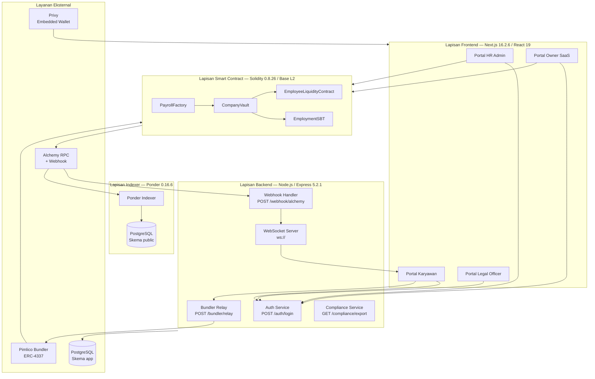

Alur EWA gasless end-to-end dimulai ketika karyawan menekan tombol "Tarik Gaji" di Portal Karyawan. Frontend meminta Privy SDK untuk membuat `UserOperation` yang mengandung calldata `claimSalary()` dan menandatanganinya secara diam-diam (*silent sign*) menggunakan Smart Account karyawan tanpa prompt password atau konfirmasi manual. `UserOperation` yang telah ditandatangani dikirim ke Backend Bundler Relay (`POST /bundler/relay`), di mana backend memverifikasi tanda tangan, memeriksa rate limit (maksimum 10 klaim per jam per karyawan sesuai FR-B02), melampirkan tanda tangan Paymaster untuk mensponsori gas ETH, lalu meneruskan `UserOperation` ke Pimlico Bundler yang kemudian menyebarkannya ke kontrak `EntryPoint` di Base. Eksekusi on-chain membutuhkan sekitar 2 detik (optimistic finality Base); selama eksekusi, fungsi `claimSalary()` menghitung gaji akrual, memotong auto-repay koperasi jika ada pinjaman aktif, lalu mendistribusikan 93%/5%/2% secara atomic dalam satu transaksi.

Alur deteksi peran pengguna dilakukan sepenuhnya di sisi klien setelah autentikasi berhasil, melalui hook `useRole.ts`. Hook ini melakukan pengecekan berurutan secara on-chain: pertama memeriksa apakah alamat wallet cocok dengan `OWNER_ADDRESS` dari variabel lingkungan (peran Owner); kedua memanggil `PayrollFactory.companyVaults(address)` untuk memeriksa apakah HR sudah memiliki vault (peran HR); ketiga mengonsultasikan endpoint Ponder `/stream/{address}` untuk memeriksa keberadaan stream aktif (peran Employee); dan keempat memanggil `CompanyVault.hasRole(LEGAL_ROLE, address)` pada vault yang relevan (peran Legal). Jika tidak ada kondisi yang terpenuhi, pengguna diarahkan ke halaman `/onboarding` untuk mendaftar.

Alur pengindeksan Ponder bekerja secara reaktif terhadap event blockchain. Ponder berlangganan ke Alchemy RPC menggunakan konfigurasi di `ponder.config.ts` dan mendengarkan event dari semua kontrak yang terdaftar (PayrollFactory, CompanyVault, EmployeeLiquidityContract, EmploymentSBT). Setiap kali event seperti `StreamCreated`, `SalaryClaimed`, `LoanCreated`, atau `LockEvent` (SBT) diemisi on-chain, Ponder memanggil handler TypeScript yang sesuai untuk menulis atau memperbarui baris di tabel PostgreSQL skema `public`. Data yang terindeks ini kemudian dapat dikueri oleh backend melalui SQL langsung, digunakan untuk laporan kepatuhan, dashboard real-time, dan logika rate limit — tanpa overhead RPC call ke node blockchain pada setiap permintaan.

### 2.2 Perancangan Data Secara Keseluruhan

Sistem Payana menggunakan tiga lapisan penyimpanan data yang berbeda secara fundamental dalam karakteristik konsistensi, biaya, dan model kepercayaan. Pemilihan lapisan penyimpanan untuk setiap jenis data bukan semata keputusan teknis, melainkan juga keputusan regulasi dan ekonomi. Pembahasan rinci masing-masing lapisan beserta ERD lengkap tersedia di Bagian 4.

Lapisan pertama adalah **penyimpanan on-chain** yang bersifat immutable, publik, dan mahal secara komputasi. Data yang disimpan on-chain meliputi seluruh state kontrak yang kritis terhadap keuangan: `employeeStreams` (laju gaji, status, split), `severanceVaults` (akumulasi pesangon), `cliffVests` (bonus terkunci), `loanRecords` (pinjaman koperasi), dan `employmentRecords` (SBT). Data ini disimpan on-chain karena harus *tidak dapat dimanipulasi* oleh siapapun termasuk operator Payana — jaminan ini hanya dapat diberikan oleh blockchain. Biaya penyimpanan dibayar dalam ETH gas pada setiap operasi tulis.

Lapisan kedua adalah **penyimpanan PostgreSQL off-chain** di skema `app` yang dikelola oleh backend melalui Drizzle ORM. Data yang disimpan di sini meliputi: profil karyawan terenkripsi AES-256-GCM (nama, NIK, telepon) sesuai kewajiban UU PDP 2022, sesi JWT aktif (tabel `sessions` dengan kolom `jti` untuk revocation), audit log backend yang immutable secara off-chain (`audit_logs`), event webhook Alchemy untuk deduplication (`webhook_events`), data rate limiter per karyawan (`rate_limits`), dan antrian pendaftaran HR yang menunggu persetujuan Owner (`pending_registrations`). Data ini tidak boleh disimpan on-chain karena mengandung PII yang dilindungi regulasi, dan tidak memerlukan jaminan trustless selama operator backend bertanggung jawab atas keamanannya.

Lapisan ketiga adalah **penyimpanan Ponder indexed** di skema `public` yang merupakan proyeksi dari state on-chain ke dalam struktur relasional yang dapat dikueri dengan SQL. Tabel-tabel seperti `company`, `employee_stream`, `salary_claim`, `severance_vault`, `cliff_vest`, `liquidity_pool`, `lender_deposit`, `loan_record`, `employment_certificate`, dan `low_balance_alert` merupakan snapshot dari event blockchain yang telah diproses. Data ini bersifat eventually consistent (dapat ter-lag beberapa blok dari state aktual) dan dapat direkonstruksi ulang dari genesis dengan menjalankan ulang Ponder indexer — sehingga kehilangan database Ponder tidak berarti kehilangan data; hanya membutuhkan waktu sinkronisasi ulang.

### 2.3 Perancangan Antarmuka Secara Keseluruhan

Sistem Payana menyajikan empat portal antarmuka yang terpisah namun berbagi komponen UI, state autentikasi, dan infrastruktur routing yang sama di atas Next.js App Router. Hierarki URL dirancang berbasis segmen peran: `/hr/*` untuk HR Dashboard, `/employee/*` untuk Employee Dashboard, `/legal/*` untuk Legal Dashboard, dan `/admin/*` atau `/onboarding` untuk Owner dan pendaftar baru. Halaman-halaman yang tidak memerlukan autentikasi (login, onboarding publik) berada di level root `/login` dan `/onboarding`.

Routing berbasis peran diimplementasikan melalui middleware Next.js yang memeriksa token JWT yang tersimpan di cookie atau memory state, dikombinasikan dengan hasil deteksi peran dari hook `useRole.ts` yang berjalan di sisi klien. Pengguna yang mencoba mengakses segmen URL yang tidak sesuai perannya akan diarahkan secara otomatis ke portal yang benar. Seluruh portal berbagi komponen desain yang konsisten menggunakan Shadcn/UI dengan palet warna dan tipografi yang sama, namun setiap portal memiliki layout dan navigasi sidebar yang disesuaikan dengan kebutuhan spesifik perannya. Pembahasan rinci komponen antarmuka per portal tersedia di Bagian 3.

---

## 3. Perancangan Antarmuka

Bagian ini mendeskripsikan perancangan antarmuka pengguna untuk seluruh portal yang tersedia dalam sistem Payana. Setiap halaman dirancang untuk mengabstraksi kompleksitas teknis blockchain dari pengguna akhir; terminologi seperti "Akun Gaji" dan "Tarik Gaji" menggantikan jargon kriptografi, sementara interaksi on-chain dikemas sebagai alur wizard atau modal yang familiar. Bagian ini mencakup dua kelompok besar portal: (3.A) halaman autentikasi dan onboarding yang menjadi pintu masuk seluruh peran, serta (3.B) portal HR Admin yang menjadi pusat kendali operasional penggajian, kepatuhan, dan manajemen sumber daya manusia berbasis kontrak pintar.

---

### 3.A Halaman Autentikasi dan Onboarding

#### 3.A.1 Halaman Login (`/login`)

**Deskripsi:** Halaman masuk tunggal untuk seluruh peran pengguna (HR Admin, Karyawan, Legal Officer, dan Owner SaaS). Pengguna memilih konteks masuk ("Perusahaan" atau "Karyawan") lalu Privy SDK menangani pembuatan embedded wallet dan proses tanda tangan EIP-191 secara otomatis.

**Aktor:** Semua pengguna (HR Admin, Karyawan, Legal Officer, Owner SaaS)

**FR Terkait:** FR-PAYANA-101, FR-PAYANA-106

**Alur Interaksi:**
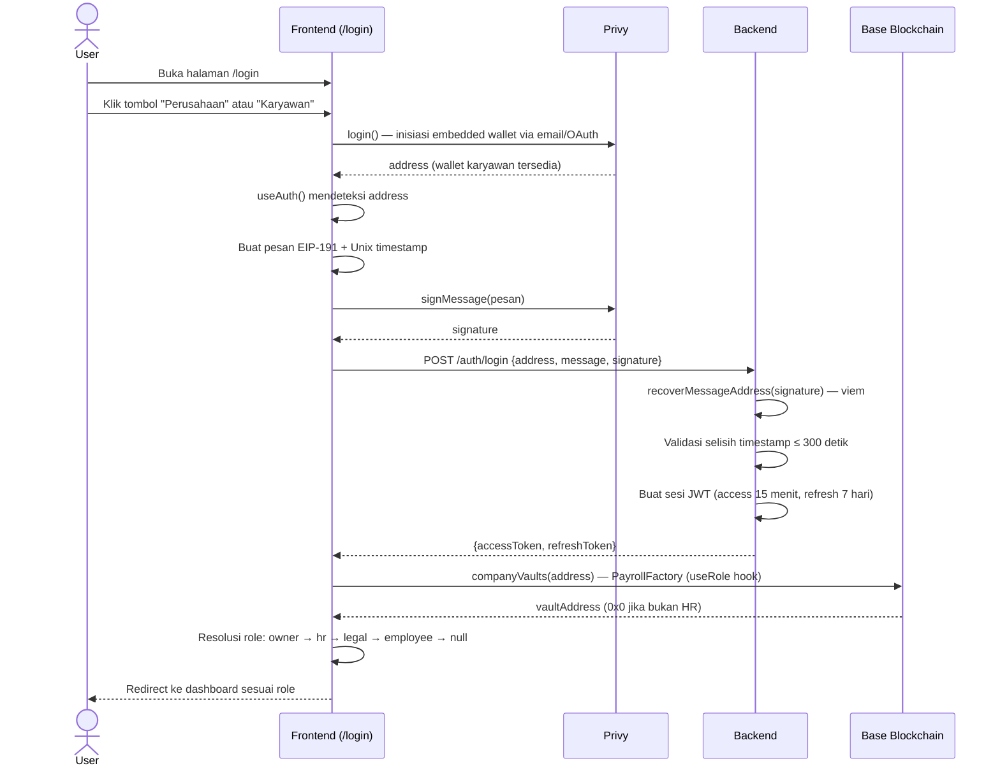

**Deskripsi Antarmuka:**

| Komponen | Tipe | Deskripsi |
|----------|------|-----------|
| Logo "Payana." | Teks heading dekoratif | Judul aplikasi dengan aksen titik berwarna emerald-400; menjadi penanda branding di semua halaman publik |
| Teks subjudul | Teks informatif | Menampilkan "Earned Wage Access & payroll on-chain" sebagai deskripsi singkat platform |
| Label "Masuk sebagai" | Label konteks | Teks uppercase kecil sebagai petunjuk sebelum pilihan role |
| Tombol "Perusahaan" | Kartu pilihan (button) | Kartu putih berisi ikon `Building2`, label "Perusahaan", dan sub-label "HR / Admin payroll"; menetapkan intent = "hr" lalu memanggil `login()` |
| Tombol "Karyawan" | Kartu pilihan (button) | Kartu putih berisi ikon `User`, label "Karyawan", dan sub-label "Akses gaji & EWA"; menetapkan intent = "employee" lalu memanggil `login()` |
| Background ASCII Canvas | Elemen dekoratif animasi | Kanvas `<canvas>` yang merender karakter ASCII monokrom bergerak berbasis gelombang sinus/kosinus dengan warna emerald transparan; animasi 28 fps |
| Footer teknologi | Teks metadata | Baris teks monospace kecil "Base Sepolia · IDRX · ERC-4337" sebagai informasi jaringan |

**Method/Algoritma:**

**Pada pemilihan role dan klik tombol login:**
1. State `intent` ditetapkan sesuai pilihan pengguna ("hr" atau "employee").
2. `login()` dari Privy SDK dipanggil; modal Privy muncul untuk autentikasi email atau OAuth.
3. Setelah Privy berhasil, `useAuth()` mengekspos `address` dan `isReady = true`.
4. `useRole()` memanggil `companyVaults(address)` ke kontrak `PayrollFactory` via `publicClient.readContract`.
5. Resolusi peran dilakukan berurutan: jika `address === OWNER_ADDRESS` maka `role = "owner"`, jika `vaultAddress !== zeroAddress` maka `role = "hr"`, jika ditemukan `LEGAL_ROLE` maka `role = "legal"`, jika ada stream aktif maka `role = "employee"`, jika tidak ada maka `role = null`.
6. Redirect otomatis: `"hr"` → `/hr/vault`; `"employee"` → `/employee/ewa`; `"legal"` → `/hr/phk`; `null` → `/onboarding`.
7. Jika intent = "hr" namun tidak ada vault: redirect ke `/hr/onboarding`.

---

#### 3.A.2 Halaman Onboarding (`/onboarding`)

**Deskripsi:** Halaman pendaftaran untuk calon HR Admin yang belum memiliki vault perusahaan. Menampilkan formulir pengisian data diri (Nama, NIK, Nomor HP), menyimpannya sebagai data PII terenkripsi ke backend, lalu mengajukan permohonan pendaftaran ke Owner SaaS melalui endpoint registrasi. Halaman juga menampilkan status permohonan secara real-time (form, pending, approved, rejected).

**Aktor:** Calon HR Admin (pengguna yang belum memiliki role)

**FR Terkait:** FR-PAYANA-104, FR-PAYANA-107

**Alur Interaksi:**
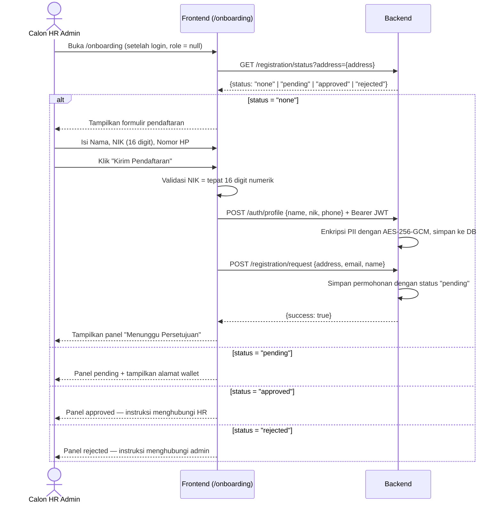

**Deskripsi Antarmuka:**

| Komponen | Tipe | Deskripsi |
|----------|------|-----------|
| Logo "Payana." | Heading | Branding identik dengan halaman login |
| Panel formulir ("Daftarkan Akunmu") | Kartu formulir | Berisi input Nama Lengkap (teks), NIK 16 digit (numerik, dibatasi hanya angka), dan Nomor HP (tel); hanya angka diterima pada field NIK |
| Field Email (read-only) | Input read-only | Menampilkan email dari akun Privy (`user.email.address`) jika tersedia; tidak dapat diedit |
| Tombol "Kirim Pendaftaran" | Button submit | Mengirimkan data ke backend; disabled selama proses berlangsung, menampilkan "Mengirim..." |
| Panel "Menunggu Persetujuan" | Kartu status | Ikon jam amber, teks status, dan tampilan alamat wallet yang dapat disalin menggunakan tombol Copy |
| Panel "Akun Disetujui!" | Kartu status | Ikon centang hijau; menginformasikan pengguna untuk menunggu HR mengaktifkan stream gaji |
| Panel "Pendaftaran Ditolak" | Kartu status | Ikon X merah; mengarahkan pengguna menghubungi admin Payana |
| Tombol "Keluar" | Button logout | Memanggil `privyLogout()` lalu redirect ke `/login` |

**Method/Algoritma:**

**Pada submit formulir:**
1. Validasi sisi klien: `name.trim()` tidak boleh kosong; NIK harus cocok dengan regex `/^\d{16}$/`; `phone.trim()` tidak boleh kosong.
2. Jika validasi lulus, panggil `POST /auth/profile` dengan header `Authorization: Bearer {token}` untuk menyimpan PII terenkripsi.
3. Panggil `registration.submit(address, privyEmail, name)` ke `POST /registration/request`.
4. Jika berhasil, set `pageState = "pending"`.
5. Jika terjadi error, tampilkan pesan "Terjadi kesalahan. Coba lagi." pada elemen error di atas tombol submit.

---

### 3.B Portal HR Admin

#### 3.B.1 Dashboard Vault HR (`/hr/vault`)

**Deskripsi:** Halaman utama HR Admin untuk memantau saldo treasury perusahaan (CompanyVault) secara real-time, melakukan deposit IDRX ke vault (top up), menarik saldo bebas (withdraw), melihat proyeksi burn rate, serta mengkonfigurasi parameter alokasi split.

**Aktor:** HR Admin

**FR Terkait:** FR-PAYANA-202, FR-PAYANA-203, FR-PAYANA-204, FR-PAYANA-207

**Alur Interaksi:**
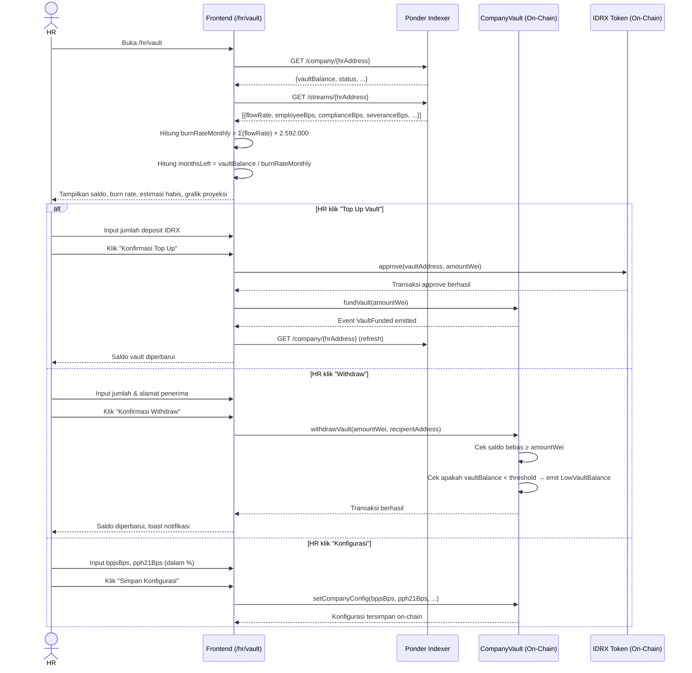

**Deskripsi Antarmuka:**

| Komponen | Tipe | Deskripsi |
|----------|------|-----------|
| Heading "Vault Management" | Heading h1 | Judul halaman dengan sub-teks deskripsi singkat |
| Tombol "Withdraw" | Button sekunder | Membuka modal withdraw; ikon `TrendingDown` |
| Tombol "Konfigurasi" | Button sekunder | Membuka modal konfigurasi split; ikon `Settings` |
| Tombol "Top Up Vault" | Button primer (hitam) | Membuka modal top up; ikon `PlusCircle` |
| Kartu saldo vault (Saldo Brankas IDRX) | Display angka besar | Menampilkan `vaultBalance` dari Ponder dalam format IDR; dengan `VaultStatusBadge` (Active/Paused/Frozen) di pojok kanan atas |
| Kartu "Burn Rate Bulanan" | Stat card | Total flow rate semua karyawan aktif × 2.592.000 detik, ditampilkan sebagai IDRX per bulan |
| Kartu "Estimasi Habis" | Stat card | Perkiraan bulan sisa (`monthsLeft`) sebelum vault habis |
| Grafik proyeksi burn (AreaChart) | Grafik area | Proyeksi saldo 7 titik ke depan (per 5 hari) menggunakan library recharts; warna emerald |
| Kartu "Alokasi Split" | Panel info | Bar progress menampilkan persentase Employee Bps (93%), Compliance Bps (5%), dan Severance Bps (2%) dari stream pertama |
| Tabel riwayat stream | Tabel | Daftar stream aktif per karyawan: Stream ID (disingkat), status badge, flow rate bulanan, dan identifier karyawan |
| Modal "Top Up Vault" | Modal form | Input jumlah deposit dalam format rupiah (auto-format dengan Intl.NumberFormat); menampilkan alamat vault yang akan menerima dana |
| Modal "Withdraw dari Vault" | Modal form | Input jumlah withdraw dan alamat penerima (0x...); validasi keduanya sebelum submit |
| Modal "Konfigurasi Vault" | Modal form | Input persentase BPJS & Pajak dan Pesangon; tombol "Simpan Konfigurasi" |

**Method/Algoritma:**

**Pada "Top Up Vault":**
1. Konversi input rupiah ke wei: `amountWei = BigInt(amountRaw) * BigInt(1e18)`.
2. Panggil `approve(vaultAddress, amountWei)` pada kontrak IDRX.
3. Setelah transaksi approve dikonfirmasi, panggil `fundVault(amountWei)` pada `CompanyVault`.
4. Refresh data dari Ponder menggunakan `ponder.getCompany(address)`.

**Pada "Withdraw":**
1. Validasi `withdrawAmount` dan `withdrawAddress` tidak kosong.
2. Panggil `withdrawVault(amountWei, withdrawAddress)` pada `CompanyVault`.
3. Kontrak secara otomatis memancarkan `LowVaultBalance` jika saldo pasca-withdraw di bawah threshold.

---

#### 3.B.2 Manajemen Karyawan (`/hr/employees`)

**Deskripsi:** Halaman pengelolaan daftar seluruh karyawan aktif dalam sistem stream perusahaan. HR dapat memantau status, gaji bulanan, dan EWA live setiap karyawan, serta melakukan tindakan cepat seperti pause/resume stream. Juga menampilkan antrean pendaftaran karyawan baru yang belum mendapatkan stream.

**Aktor:** HR Admin

**FR Terkait:** FR-PAYANA-107, FR-PAYANA-109

**Alur Interaksi:**
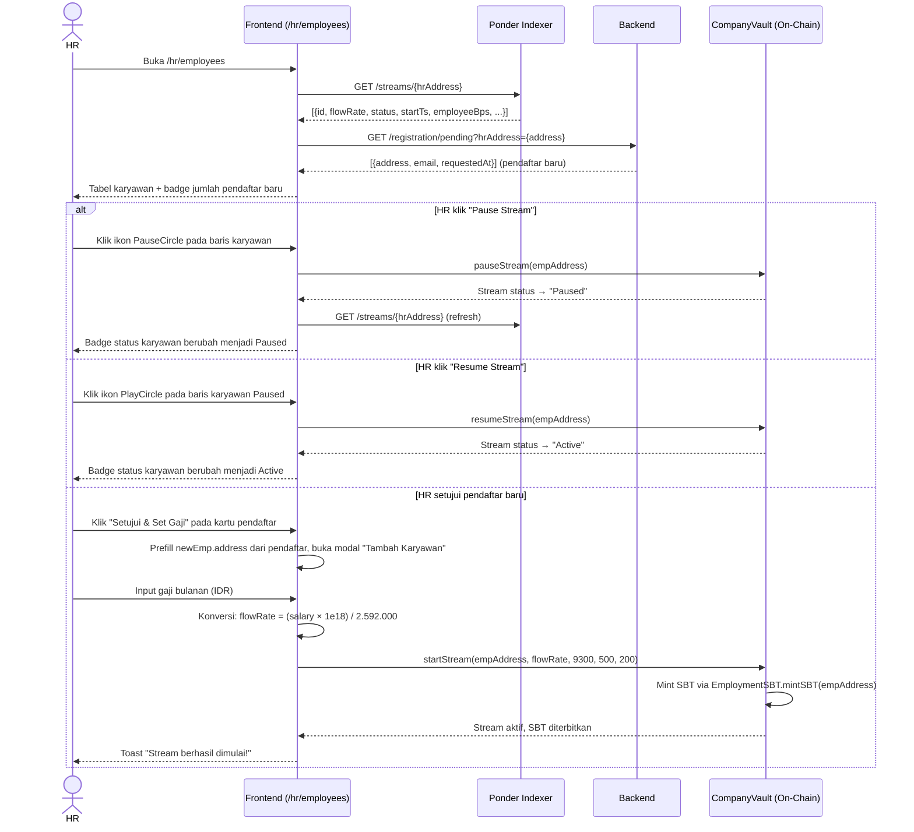

**Deskripsi Antarmuka:**

| Komponen | Tipe | Deskripsi |
|----------|------|-----------|
| Heading "Manajemen Karyawan" | Heading h1 | Judul halaman |
| Tombol "Tambah Karyawan" | Button primer | Membuka modal tambah karyawan baru; ikon `UserPlus` |
| Search bar | Input teks | Filter daftar berdasarkan alamat wallet karyawan (pencarian substring) |
| Dropdown filter status | Select | Filter berdasarkan status stream: "Semua Status", "Active", "Paused", "Cancelled" |
| Tabel karyawan | Tabel data | Kolom: Karyawan (avatar inisial + alamat wallet disingkat), Gaji Bulanan (dalam IDR), EWA Live (komponen `StreamCounter` real-time), Status Stream (badge berwarna), Aksi |
| Komponen `StreamCounter` | Counter animasi | Menghitung akrual secara real-time di browser berdasarkan `flowRate` dan `startTs` |
| Ikon Pause / Play | Icon button | Pause jika status "Active"; Play jika status "Paused"; disabled selama transaksi berlangsung |
| Ikon Eye | Icon button | Navigasi ke halaman detail karyawan `/hr/employees/{address}` |
| Ikon StopCircle | Icon button | Navigasi ke halaman PHK `/hr/phk` |
| Panel "Permintaan Pendaftaran" | Section list | Muncul jika ada pendaftar; setiap item menampilkan alamat wallet (disingkat), email, waktu relatif pengajuan, serta tombol "Setujui & Set Gaji" dan "Tolak" |
| Modal "Tambah Karyawan" | Modal form | Input alamat wallet karyawan (0x...) dan gaji bulanan (IDR, auto-format); menampilkan preview flow rate dalam IDR/sec |

**Method/Algoritma:**

**Pada tambah karyawan:**
1. Hitung `flowRate = (BigInt(salaryRaw) * BigInt(1e18)) / BigInt(2592000)`.
2. Panggil `startStream(empAddress, flowRate, 9300, 500, 200)` pada `CompanyVault`; argumen terakhir adalah split bps: 9300 = 93% karyawan, 500 = 5% compliance, 200 = 2% severance.
3. Fungsi `startStream` di dalam kontrak juga memanggil `EmploymentSBT.mintSBT(empAddress)` secara otomatis.

---

#### 3.B.3 Detail Karyawan (`/hr/employees/[id]`)

**Deskripsi:** Halaman detail stream satu karyawan dengan visualisasi EWA live, struktur kompensasi (take home pay, potongan compliance, potongan severance), serta kontrol stream individual. HR dapat menjeda/melanjutkan stream, memperbarui flow rate (gaji), atau memproses resign karyawan langsung dari halaman ini.

**Aktor:** HR Admin

**FR Terkait:** FR-PAYANA-106, FR-PAYANA-203 (getAccrued), FR-PAYANA-204

**Alur Interaksi:**
```mermaid
sequenceDiagram
    actor HR
    participant FE as Frontend (/hr/employees/[id])
    participant Ponder as Ponder Indexer
    participant Vault as CompanyVault (On-Chain)

    HR->>FE: Buka /hr/employees/{empAddress}
    FE->>Ponder: GET /streams/{hrAddress}
    Ponder-->>FE: Array stream; filter berdasarkan empAddress
    FE-->>HR: Tampilkan kartu identitas, panel aksi cepat, tab Overview

    loop Polling setiap 5 detik
        FE->>Vault: getAccrued(empAddress) via publicClient.readContract
        Vault-->>FE: accruedWei (jumlah IDRX terakru)
        FE-->>HR: Update angka EWA live dan progress circular
    end

    alt HR klik "Pause Stream" atau "Resume Stream"
        FE->>Vault: pauseStream(empAddress) atau resumeStream(empAddress)
        Vault-->>FE: Status stream berubah
        FE->>Ponder: Refresh data stream
        FE-->>HR: Badge status dan tombol diperbarui

    else HR klik "Update Gaji"
        HR->>FE: Input gaji bulanan baru (IDR)
        FE->>FE: Hitung newFlowRate = (salaryRaw × 1e18) / 2.592.000
        FE->>Vault: updateFlowRate(empAddress, newFlowRate)
        Vault-->>FE: Flow rate diperbarui on-chain
        FE->>Ponder: Refresh data stream
        FE-->>HR: Gaji baru tampil di kartu kompensasi

    else HR klik "Resign Karyawan"
        HR->>FE: Konfirmasi dialog browser ("Yakin resign karyawan ini?")
        FE->>Vault: resignEmployee(empAddress)
        Vault->>Vault: Hentikan stream, lepas SeveranceVault karyawan
        Vault-->>FE: Transaksi berhasil
        FE-->>HR: Toast "Karyawan berhasil diresignkan."
    end
```

**Deskripsi Antarmuka:**

| Komponen | Tipe | Deskripsi |
|----------|------|-----------|
| Breadcrumb "Daftar Karyawan" | Link navigasi | Kembali ke `/hr/employees` |
| Sidebar — kartu identitas | Kartu profil | Avatar inisial 2 huruf dari alamat, alamat wallet lengkap (dapat disalin), tombol `OnChainLink` ke Basescan, badge status stream (Active/Paused/Cancelled dengan animasi pulse untuk Active) |
| Sidebar — Quick Actions | Panel tombol | Tombol Pause/Resume (berganti secara dinamis), tombol "Update Gaji" (membuka modal), tombol "Resign Karyawan" (warna merah rose) |
| Sidebar — Info Stream | Panel info | Menampilkan Employee Bps, Compliance Bps, Severance Bps, dan tanggal mulai stream |
| Panel "Live EWA Accrual" | Display hero gelap | Latar hitam (#1C1917) dengan angka besar (IDRXAmount atau StreamCounter) menampilkan EWA terakru; teks "dari [Take Home Pay] (Bulan Ini)"; circular progress SVG menunjukkan persentase akrual dari total take home pay bulan ini |
| Kartu "Penghasilan (Gross)" | Kartu breakdown | Gaji Bulanan (flow rate × 2.592.000) dan Take Home Pay (employeeBps%) |
| Kartu "Potongan Otomatis" | Kartu breakdown | Compliance (complianceBps%) dan Pesangon (severanceBps%) ditampilkan dalam merah negatif |
| Tab "Audit Log" | Tab panel | Tautan ke Basescan via `OnChainLink`; tidak menampilkan riwayat lokal |
| Modal "Update Gaji Karyawan" | Modal form | Input gaji bulanan baru (IDR, auto-format); preview flow rate baru dalam IDR/sec |

---

#### 3.B.4 Onboarding Karyawan (`/hr/onboarding`)

**Deskripsi:** Halaman wizard multi-langkah untuk HR Admin yang baru bergabung dan belum memiliki CompanyVault. Memandu HR melalui tiga tahap: (1) Informasi perusahaan, (2) Konfigurasi parameter smart contract dan deploy vault via `PayrollFactory`, (3) Deposit saldo IDRX awal ke vault.

**Aktor:** HR Admin (baru, belum memiliki vault)

**FR Terkait:** FR-PAYANA-201, FR-PAYANA-202

**Alur Interaksi:**
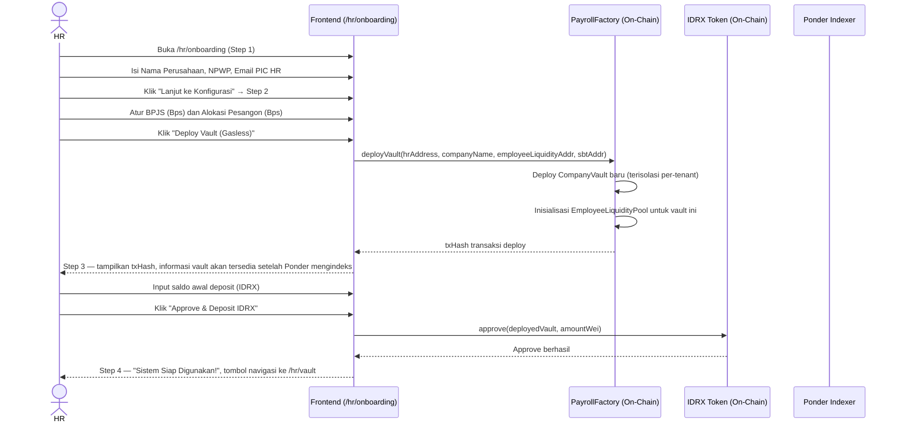

**Deskripsi Antarmuka:**

| Komponen | Tipe | Deskripsi |
|----------|------|-----------|
| Heading "Setup Vault Perusahaan" | Heading h1 | Judul wizard dengan sub-teks |
| Stepper (3 langkah) | Komponen navigasi progres | Tiga badge step: "Registrasi", "Konfigurasi", "Deposit"; badge aktif berwarna hitam, badge selesai berwarna abu muda |
| Step 1 — Nama Perusahaan | Input teks | Nama perusahaan (placeholder "PT Karya Bangsa") |
| Step 1 — NPWP | Input teks | NPWP 15 digit (format xx.xxx.xxx.x-xxx.xxx) |
| Step 1 — Email PIC HR | Input email | Email penanggung jawab HR |
| Step 1 — Alamat HR (read-only) | Panel info | Menampilkan `address` dari `useAuth()` yang akan menjadi `hr_authority` on-chain |
| Step 2 — BPJS (Bps) | Input angka | Basis poin BPJS; default 500 (= 5%); 100 Bps = 1% |
| Step 2 — Alokasi Pesangon (Bps) | Input angka | Default 200 (= 2%) |
| Step 2 — Panel info kontrak | Panel info | Menampilkan alamat PayrollFactory, SBT, dan EmployeeLiquidity yang disingkat |
| Step 2 — Tombol "Deploy Vault (Gasless)" | Button primer + ikon Rocket | Memanggil `deployVault()` via `useContractWrite`; disabled selama transaksi |
| Step 3 — txHash display | Panel info | Menampilkan hash transaksi deploy + tombol salin; teks informasi bahwa alamat vault akan tersedia setelah Ponder mengindeks |
| Step 3 — Input deposit awal | Input angka besar | Input jumlah IDRX dengan prefix "Rp"; placeholder "100000000" |
| Step 3 — Tombol "Approve & Deposit IDRX" | Button primer + ikon Banknote | Dua transaksi berurutan: approve IDRX lalu fundVault |
| Step 4 — Panel sukses | Centered panel | Ikon centang hijau besar, teks konfirmasi, tombol "Ke Dashboard HR" |

---

#### 3.B.5 Manajemen PHK (`/hr/phk`)

**Deskripsi:** Halaman manajemen proses Pemutusan Hubungan Kerja berbasis alur multi-tanda tangan dua tahap. HR mengajukan proposal PHK; Legal Officer menyetujuinya on-chain; setelah kedua tanda tangan terkumpul, HR dapat mengeksekusi PHK yang akan menghentikan stream dan melepaskan dana SeveranceVault karyawan.

**Aktor:** HR Admin, Legal Officer

**FR Terkait:** FR-PAYANA-301 (mengacu pada kelompok kebutuhan PHK multi-sig: `proposeTermination`, `approveTermination`, `executeTermination`)

**Alur Interaksi:**
```mermaid
sequenceDiagram
    actor HR
    actor Legal as Legal Officer
    participant FE as Frontend (/hr/phk)
    participant Ponder as Ponder Indexer
    participant Vault as CompanyVault (On-Chain)

    HR->>FE: Buka /hr/phk
    FE->>Ponder: GET /streams/{hrAddress} — ambil daftar stream aktif
    FE->>Ponder: GET /termination/{empAddress} — untuk setiap stream
    Ponder-->>FE: Proposal PHK yang ada (jika ada)
    FE-->>HR: Tampilkan kartu karyawan dengan status proposal

    HR->>FE: Klik "Buat Proposal PHK"
    HR->>FE: Pilih karyawan dari dropdown, isi alasan PHK
    FE->>FE: encodeReason(reason) → bytes32 hash
    FE->>Vault: proposeTermination(empAddress, reasonHash)
    Vault->>Vault: Catat proposal, status = "Proposed"; HR sudah sign
    Vault-->>FE: Transaksi berhasil
    FE-->>HR: Toast "Proposal PHK berhasil diajukan!"

    Note over Legal: Legal Officer login via /hr/phk (role = "legal")
    Legal->>FE: Lihat daftar proposal dengan status "Menunggu Persetujuan"
    Legal->>FE: Klik tombol "Approve (HR)" [dalam antarmuka ini digunakan oleh Legal]
    FE->>Vault: approveTermination(empAddress)
    Vault->>Vault: Verifikasi pemanggil memiliki LEGAL_ROLE, status → "Approved"
    Vault-->>FE: Transaksi berhasil
    FE-->>Legal: Kartu berubah → "Siap Dieksekusi"

    HR->>FE: Klik "Eksekusi PHK"
    FE->>Vault: executeTermination(empAddress)
    Vault->>Vault: Hentikan stream karyawan
    Vault->>Vault: Lepas dana SeveranceVault ke karyawan (sesuai formula UU Cipta Kerja)
    Vault->>Vault: Burn SBT karyawan via EmploymentSBT.burnSBT(empAddress)
    Vault-->>FE: Transaksi berhasil
    FE-->>HR: Toast "PHK berhasil dieksekusi."
```

**Deskripsi Antarmuka:**

| Komponen | Tipe | Deskripsi |
|----------|------|-----------|
| Heading "Proses Pemutusan Hubungan Kerja (PHK)" | Heading h1 | Judul dengan deskripsi "Multi-signature flow untuk menjamin pesangon on-chain dieksekusi dengan persetujuan Legal" |
| Tombol "Buat Proposal PHK" | Button primer | Membuka modal proposal PHK; ikon `ShieldAlert` |
| Kartu proposal PHK | Kartu interaktif | Per karyawan yang memiliki proposal aktif; menampilkan status badge (amber = menunggu, hijau = siap eksekusi), alamat wallet karyawan, jumlah pesangon, tanggal propose, dan panel status tanda tangan (HR Manager = Signed, Legal Officer = Pending/Signed) |
| Panel "Status Tanda Tangan" | Panel multi-sig | Dua baris: HR Manager (selalu Signed) dan Legal Officer (Pending atau Signed); tombol "Approve (HR)" tersedia untuk Legal Officer ketika status masih "Proposed" |
| Tombol "Eksekusi PHK" | Button primer | Muncul jika status proposal = "Approved" (kedua pihak sudah menandatangani); ikon `Play` |
| Modal "Buat Proposal PHK" | Modal form | Dropdown pilih karyawan (dari daftar stream aktif) dan textarea alasan PHK; alasan di-encode sebagai `bytes32` hash sebelum dikirim on-chain |

---

#### 3.B.6 Manajemen Vesting (`/hr/vesting`)

**Deskripsi:** Halaman pengelolaan program bonus retensi, reward masa percobaan, dan ESOP berbasis cliff vesting on-chain. HR dapat membuat vest baru dengan mengunci IDRX hingga tanggal cliff tertentu, serta membatalkan vest yang belum matang jika karyawan keluar sebelum waktunya.

**Aktor:** HR Admin

**FR Terkait:** FR-PAYANA-401 (mengacu pada kebutuhan cliff vesting: `createCliffVest`, `cancelCliffVest`)

**Alur Interaksi:**
```mermaid
sequenceDiagram
    actor HR
    participant FE as Frontend (/hr/vesting)
    participant Ponder as Ponder Indexer
    participant Vault as CompanyVault (On-Chain)

    HR->>FE: Buka /hr/vesting
    FE->>Ponder: GET /streams/{hrAddress} — ambil stream aktif
    loop Untuk setiap karyawan aktif
        FE->>Ponder: GET /vests/{empAddress}
        Ponder-->>FE: [{vestId, amount, cliffTs, status, vestType}]
    end
    FE-->>HR: Tampilkan ringkasan (total locked, vested, jumlah vest), pie chart, tabel vest

    HR->>FE: Klik "Buat Cliff Vest"
    HR->>FE: Pilih karyawan, tipe vest, jumlah IDRX, tanggal cliff
    FE->>FE: Konversi: amountWei = amount × 1e18; cliffTs = Unix timestamp dari tanggal
    FE->>Vault: createCliffVest(empAddress, amountWei, cliffTs, vestTypeNum)
    Vault->>Vault: Kunci dana dari vaultBalance ke mapping vest karyawan
    Vault-->>FE: Vest berhasil dibuat
    FE->>Ponder: Refresh data vest semua karyawan
    FE-->>HR: Toast "Cliff Vest berhasil dibuat!", tabel diperbarui

    alt HR klik ikon X (batalkan vest)
        HR->>FE: Konfirmasi "Batalkan vesting ini?"
        FE->>Vault: cancelCliffVest(empAddress, vestId)
        Vault->>Vault: Kembalikan dana ke vaultBalance, status → "Cancelled"
        Vault-->>FE: Transaksi berhasil
        FE-->>HR: Vest dihapus dari tabel
    end
```

**Deskripsi Antarmuka:**

| Komponen | Tipe | Deskripsi |
|----------|------|-----------|
| Heading "Manajemen Cliff Vesting" | Heading h1 | Judul dengan deskripsi singkat |
| Tombol "Buat Cliff Vest" | Button primer | Membuka modal pembuatan vest; ikon `Plus` |
| Kartu "Total Bonus Terkunci" | Stat card | Total IDRX (wei) dari semua vest berstatus "Locked" |
| Kartu "Siap Diklaim (Vested)" | Stat card | Total IDRX dari vest berstatus "Claimed" (sudah melebihi cliff date) |
| Kartu "Total Vest" | Stat card | Jumlah entri vest keseluruhan |
| Pie chart distribusi status | PieChart (recharts) | Donut chart: "Locked" (abu) vs "Claimed" (hijau); dengan legend dan tooltip rupiah |
| Tabel daftar vest | Tabel data | Kolom: Karyawan (alamat disingkat), Tipe Vest, Jumlah IDRX, Cliff Date (format id-ID), Status badge, Aksi (ikon X untuk batalkan jika Locked) |
| Modal "Buat Cliff Vesting" | Modal form | Dropdown karyawan, dropdown tipe vest (Bonus Retensi / Reward Masa Percobaan / ESOP), input jumlah IDRX, input tanggal cliff |

**Method/Algoritma:**

**Pada pembuatan vest:**
1. Tipe vest dipetakan ke angka: "Bonus Retensi" → 2 (Custom), "Masa Percobaan" → 2 (Custom), "ESOP" → 1 (Options).
2. `cliffTs = BigInt(Math.floor(new Date(cliffDate).getTime() / 1000))`.
3. Panggil `createCliffVest(empAddress, amountWei, cliffTs, vestTypeNum)`.

---

#### 3.B.7 Koperasi HR (`/hr/koperasi`)

**Deskripsi:** Halaman pemantauan (read-only untuk HR) atas kesehatan likuiditas pool koperasi karyawan perusahaan. Menampilkan total likuiditas tersedia, total pinjaman aktif, suku bunga pool, grafik pertumbuhan likuiditas, dan daftar pinjaman yang sedang berjalan beserta status jatuh tempo.

**Aktor:** HR Admin (mode baca saja)

**FR Terkait:** FR-PAYANA-501 (mengacu pada kebutuhan koperasi: `getPoolLiquidity`)

**Alur Interaksi:**
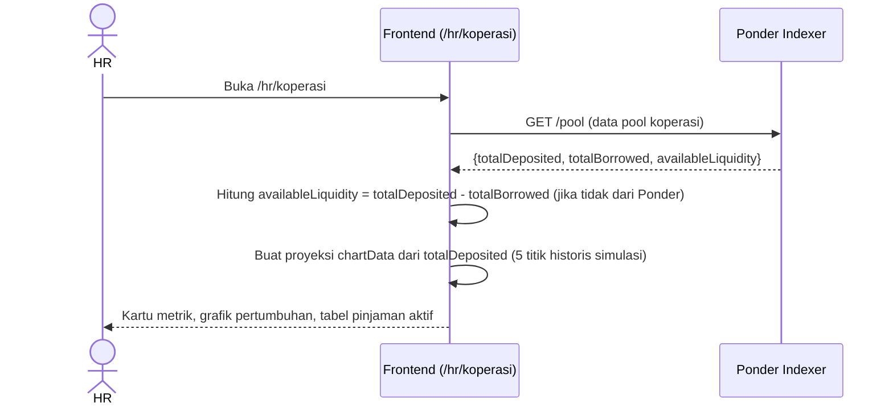

**Deskripsi Antarmuka:**

| Komponen | Tipe | Deskripsi |
|----------|------|-----------|
| Heading "Liquidity Pool Koperasi" | Heading h1 | Dengan badge "Mode: Read-only untuk HR" |
| Kartu "Total Likuiditas Tersedia" | Stat card | `availableLiquidity` = `totalDeposited − totalBorrowed` |
| Kartu "Total Pinjaman Aktif" | Stat card | `totalBorrowed` dari Ponder |
| Kartu "Suku Bunga Pool (Yield)" | Stat card | Default 1,5% per bulan (150 Bps); ikon `TrendingUp` |
| Grafik pertumbuhan likuiditas | LineChart (recharts) | 5 titik proyeksi pertumbuhan dari data historis simulasi berbasis `totalDeposited` |
| Tabel "Daftar Pinjaman Aktif" | Tabel data | Kolom: Peminjam (alamat disingkat), Jumlah Pinjaman, Jatuh Tempo, Status (badge "Overdue" merah dengan ikon `AlertTriangle` jika melewati `dueTs`) |

---

#### 3.B.8 Laporan Kepatuhan (`/hr/compliance`)

**Deskripsi:** Halaman rekonsiliasi bulanan untuk BPJS dan PPh21. HR memilih bulan, sistem menarik ringkasan compliance dari backend (total akumulasi, rincian pajak dan asuransi, detail per karyawan), dan HR dapat mengunduh laporan dalam format CSV yang sudah didekripsi PII-nya.

**Aktor:** HR Admin

**FR Terkait:** FR-PAYANA-208 (mengacu pada kebutuhan compliance export)

**Alur Interaksi:**
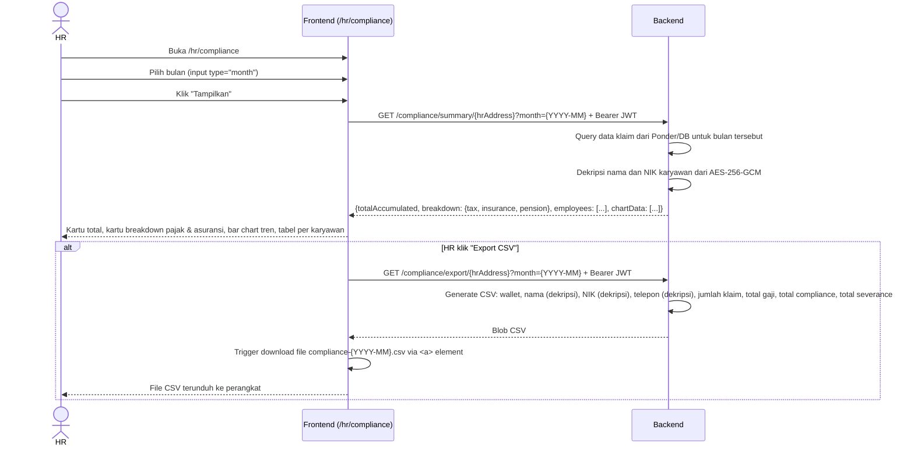

**Deskripsi Antarmuka:**

| Komponen | Tipe | Deskripsi |
|----------|------|-----------|
| Heading "Laporan Kepatuhan (Compliance)" | Heading h1 | Dengan deskripsi "Akumulasi otomatis potongan pajak dan asuransi dari klaim EWA karyawan" |
| Input bulan | Input type="month" | Pemilih bulan dan tahun; default bulan berjalan |
| Tombol "Tampilkan" | Button sekunder | Submit form untuk fetch data; disabled selama loading |
| Tombol "Export CSV" | Button primer | Fetch blob CSV dari backend; disabled jika summary belum ada |
| Banner peringatan | Alert amber | Mengingatkan bahwa transfer ke DJP/BPJS dilakukan secara manual; menyebut `ComplianceVault` |
| Kartu "Total Akumulasi Bulan Ini" | Stat card besar (2 kolom) | Total dana compliance seluruh karyawan bulan tersebut |
| Kartu "Total Pajak (Taxes)" | Stat card | `breakdown.tax` dari backend |
| Kartu "Asuransi & Pensiun" | Stat card | `breakdown.insurance + breakdown.pension` |
| Bar chart "Tren Potongan Bulanan" | BarChart stacked (recharts) | Tiga layer: pension (hijau muda), insurance (hijau), tax (hijau tua); dari `chartData` backend |
| Tabel "Rincian Per Karyawan" | Tabel data | Kolom: Karyawan (wallet disingkat), Total Claim EWA, Potongan Pajak, Asuransi / Pensiun |

---

#### 3.B.9 Pengaturan HR (`/hr/settings`)

**Deskripsi:** Halaman konfigurasi multi-tab untuk parameter operasional vault perusahaan. Terdiri dari empat tab: (1) Profil & Branding, (2) Pajak & Kepatuhan (konfigurasi pos potongan dinamis), (3) Aturan EWA & Koperasi, (4) Akses & Multi-Sig (manajemen alamat Legal Officer).

**Aktor:** HR Admin

**FR Terkait:** FR-PAYANA-204 (`setCompanyConfig`), FR-PAYANA-106 (resolusi Legal Officer)

**Alur Interaksi:**
```mermaid
sequenceDiagram
    actor HR
    participant FE as Frontend (/hr/settings)
    participant Vault as CompanyVault (On-Chain)

    HR->>FE: Buka /hr/settings, pilih tab "Pajak & Kepatuhan"
    HR->>FE: Lihat daftar pos potongan (BPJS Kesehatan, BPJS Ketenagakerjaan)
    HR->>FE: Tambah pos potongan baru (nama, tipe, persentase)
    FE-->>HR: Tabel pos potongan diperbarui; total Compliance Bps dihitung ulang

    HR->>FE: Klik "Simpan Konfigurasi"
    FE->>Vault: setCompanyConfig(bpjsBps, pph21Bps, lowBalanceThresholdBps)
    Vault-->>FE: Konfigurasi tersimpan on-chain
    FE-->>HR: Konfirmasi "Pengaturan berhasil disimpan."

    HR->>FE: Pilih tab "Akses & Multi-Sig"
    HR->>FE: Input alamat Legal Officer baru
    HR->>FE: Klik "Update"
    FE->>Vault: [Perlu dikonfirmasi — fungsi update LEGAL_ROLE on-chain]
    Vault-->>FE: Role Legal Officer diperbarui
```

**Deskripsi Antarmuka:**

| Komponen | Tipe | Deskripsi |
|----------|------|-----------|
| Heading "Pengaturan Perusahaan (SaaS)" | Heading h1 | Dengan deskripsi tab-tab yang tersedia |
| Sidebar navigasi tab | Menu vertikal | Empat item: "Profil & Branding" (ikon Building2), "Pajak & Kepatuhan" (ikon Scale), "Aturan EWA & Yield" (ikon Settings2), "Akses & Multi-Sig" (ikon Users); tab aktif disorot |
| Tab "Profil & Branding" | Form | Input Nama Perusahaan (Tenant), Dropdown Negara Operasi (Indonesia/US/Singapore/Custom — mengubah template potongan default), dan URL Logo |
| Tab "Pajak & Kepatuhan" | Tabel + tombol tambah | Daftar pos potongan dengan kolom Nama, Tipe, Persentase, Aksi (hapus); total `complianceBps` dihitung otomatis dan ditampilkan; modal tambah pos potongan baru (Nama, Tipe Tax/Insurance/Pension, Persentase) |
| Tab "Aturan EWA & Koperasi" | Form | Slider "Batas Maksimal Kasbon (EWA Limit)" 10%–100% (step 5%), dan input number "Yield Likuiditas Koperasi" dalam persentase per bulan |
| Tab "Akses & Multi-Sig" | Panel list | Kartu "Legal Officer Address" (input wallet + tombol Update) dan kartu "Primary HR Address" (read-only, badge "Owner") |

---

#### 3.B.10 Jejak Audit HR (`/hr/audit`)

**Deskripsi:** Halaman block explorer internal yang menampilkan seluruh event on-chain yang diindeks oleh Ponder Indexer untuk perusahaan bersangkutan. HR dapat mencari berdasarkan tipe event, hash transaksi, atau detail mutasi, serta membuka transaksi di Basescan via tautan eksternal.

**Aktor:** HR Admin

**FR Terkait:** FR-PAYANA-601 (mengacu pada kebutuhan audit log)

**Alur Interaksi:**
```mermaid
sequenceDiagram
    actor HR
    participant FE as Frontend (/hr/audit)
    participant Ponder as Ponder Indexer

    HR->>FE: Buka /hr/audit
    FE-->>HR: Tampilkan data audit log (saat ini statis dari kode; integrasi Ponder direncanakan)
    HR->>FE: Ketik query di search bar
    FE->>FE: Filter filteredLogs berdasarkan type, txHash, atau details (case-insensitive)
    FE-->>HR: Tabel log diperbarui secara langsung (client-side filtering)
    HR->>FE: Klik ikon ExternalLink pada baris log
    FE-->>HR: Navigasi ke Basescan (simulasi; href="#")
```

**Deskripsi Antarmuka:**

| Komponen | Tipe | Deskripsi |
|----------|------|-----------|
| Heading "Web3 Audit Log" | Heading h1 | Deskripsi "Penjelajah Blok internal; semua catatan mutasi ditarik dari node blockchain via Ponder Indexer" |
| Indikator "Ponder Sync" | Badge animasi | Titik hijau berkedip (animate-ping) dan teks nomor blok terakhir yang terindeks |
| Kartu "Total Event Terindeks" | Stat card | Jumlah total event yang terindeks (saat ini data statis) |
| Kartu "Network Latency" | Stat card | Latensi jaringan dalam milidetik |
| Kartu "Integritas Data" | Stat card gelap | Pernyataan "Data Immutable & Valid secara Kriptografis" |
| Search bar | Input teks | Filter real-time berdasarkan tipe event, hash transaksi, atau deskripsi detail |
| Tabel "Log Transaksi Smart Contract" | Tabel data | Kolom: Tx Hash (tautan biru), Tipe Event (badge uppercase), Block & Waktu (nomor blok + timestamp), Detail Mutasi (teks terpotong), Explorer (ikon ExternalLink) |
| Tombol "Muat Lebih Banyak Log" | Button teks | Pagination (fungsionalitas perlu dikonfirmasi dengan implementasi Ponder) |

---

#### 3.B.11 Persetujuan Reimbursement HR (`/hr/reimburse`)

**Deskripsi:** Halaman tinjauan dan persetujuan klaim penggantian biaya operasional (reimbursement) yang diajukan oleh karyawan. HR dapat menerima atau menolak setiap klaim; persetujuan akan mentransfer IDRX ke dompet karyawan.

**Aktor:** HR Admin

**FR Terkait:** [Perlu dikonfirmasi — fitur reimbursement belum terhubung ke smart contract on-chain dalam implementasi saat ini]

**Alur Interaksi:**
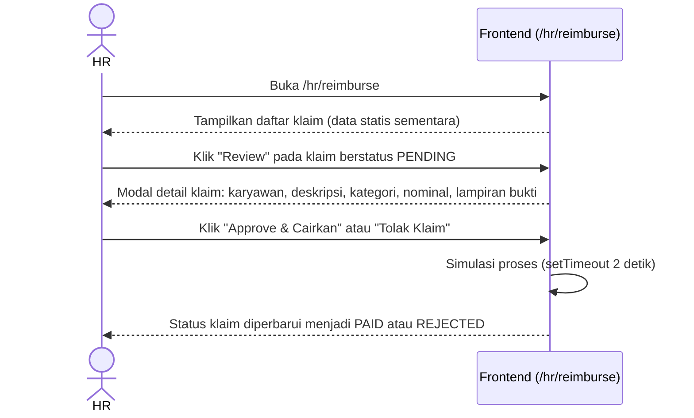

**Deskripsi Antarmuka:**

| Komponen | Tipe | Deskripsi |
|----------|------|-----------|
| Heading "Persetujuan Reimbursement" | Heading h1 | Deskripsi "Persetujuan akan langsung mentransfer IDRX ke dompet karyawan" |
| Kartu "Total Reimburse Dicairkan (Bulan Ini)" | Stat card lebar | Jumlah total klaim yang sudah dibayarkan bulan ini |
| Kartu "Menunggu Review" | Stat card amber | Jumlah klaim berstatus PENDING |
| Tabel "Daftar Klaim" | Tabel data | Kolom: Karyawan (nama), Deskripsi (judul + tanggal), Kategori, Nominal, Aksi/Status |
| Tombol "Review" | Button primer | Muncul untuk klaim PENDING; membuka modal detail |
| Badge PAID / REJECTED | Badge status | Muncul untuk klaim yang sudah diproses |
| Modal "Review Klaim Pengeluaran" | Modal detail + aksi | Panel detail klaim (karyawan, deskripsi, kategori, nominal) + panel lampiran bukti + dua tombol (Tolak Klaim merah, Approve & Cairkan hijau) |

---

#### 3.B.12 Bounty & Reward Pool HR (`/hr/bounty`)

**Deskripsi:** Halaman manajemen program insentif berbasis penyelesaian misi (bounty). HR dapat membuat bounty baru dengan mengunci dana IDRX dari vault ke BountyVault, menetapkan jumlah hadiah per klaim dan batas maksimal penerima. Karyawan yang menyelesaikan misi mengklaim hadiahnya melalui portal karyawan.

**Aktor:** HR Admin

**FR Terkait:** [Perlu dikonfirmasi — fitur bounty belum terhubung ke smart contract on-chain dalam implementasi saat ini]

**Alur Interaksi:**
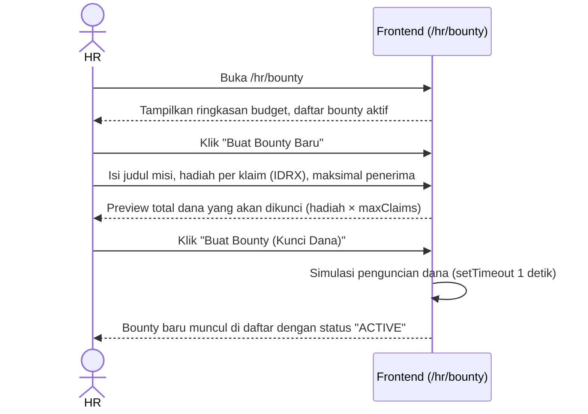

**Deskripsi Antarmuka:**

| Komponen | Tipe | Deskripsi |
|----------|------|-----------|
| Heading "Bounty & Reward Pool" | Heading h1 | Deskripsi "Buat misi (bounty) dengan hadiah IDRX untuk memotivasi karyawan" |
| Tombol "Buat Bounty Baru" | Button primer + ikon Trophy | Membuka modal pembuatan bounty |
| Kartu "Total Budget Terkunci" | Stat card | Total IDRX yang terkunci di BountyVault |
| Kartu "Bounty Aktif" | Stat card | Jumlah bounty berstatus "ACTIVE" |
| Kartu "Telah Diklaim (Sukses)" | Stat card hijau | Jumlah total klaim berhasil |
| Tabel "Daftar Misi (Bounty Board)" | Tabel data | Kolom: Judul Misi, Hadiah (IDR), Progress Klaim (klaim / maxClaims), Status badge |
| Modal "Buat Bounty Baru" | Modal form | Input judul misi, hadiah per klaim (IDR auto-format), maksimal penerima; preview total dana yang akan dikunci; tombol "Buat Bounty (Kunci Dana)" |

---

#### 3.B.13 Persetujuan Cuti & Kehadiran HR (`/hr/attendance`)

**Deskripsi:** Halaman manajemen pengajuan cuti dan kehadiran karyawan. HR dapat menerima atau menolak pengajuan cuti; persetujuan Unpaid Leave secara otomatis memicu transaksi on-chain untuk menjeda stream EWA karyawan selama periode cuti.

**Aktor:** HR Admin

**FR Terkait:** FR-PAYANA-205 (`pauseStream` — dipicu oleh persetujuan Unpaid Leave)

**Alur Interaksi:**
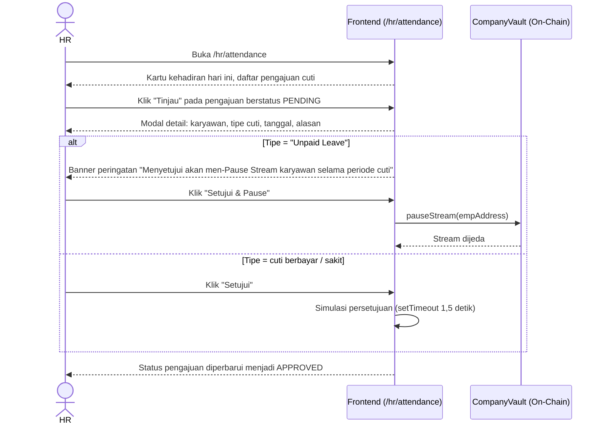

**Deskripsi Antarmuka:**

| Komponen | Tipe | Deskripsi |
|----------|------|-----------|
| Heading "Persetujuan Cuti & Kehadiran" | Heading h1 | Deskripsi "Unpaid Leave yang disetujui akan menghentikan aliran EWA secara otomatis" |
| Kartu "Karyawan Hadir Hari Ini" | Stat card | Jumlah karyawan hadir dari total karyawan |
| Kartu "Menunggu Persetujuan" | Stat card amber | Jumlah pengajuan berstatus PENDING |
| Tabel "Daftar Pengajuan Cuti" | Tabel data | Kolom: Karyawan (nama + alasan disingkat), Tipe Cuti, Tanggal, Status/Aksi |
| Tombol "Tinjau" | Button primer | Membuka modal detail pengajuan |
| Modal "Tinjau Pengajuan Cuti" | Modal detail + aksi | Detail pengajuan; banner amber khusus untuk Unpaid Leave yang menjelaskan efek pauseStream; dua tombol (Tolak merah, Setujui/Setujui & Pause hijau) |


### 3.C Portal Karyawan

---

#### 3.C.1 Dashboard EWA (`/employee/ewa`)

**Deskripsi:** Halaman utama karyawan untuk memantau saldo gaji terakumulasi secara real-time dan melakukan penarikan gaji (Earned Wage Access) melalui transaksi gasless ERC-4337. Halaman ini juga menampilkan ringkasan saldo dompet IDRX, pratinjau vesting aktif berikutnya, dan lima klaim EWA terakhir sebagai riwayat aktivitas singkat.

**Aktor:** Karyawan

**FR Terkait:** FR-PAYANA-401, FR-PAYANA-402, FR-PAYANA-403, FR-PAYANA-404, FR-PAYANA-405

**Alur Interaksi:**

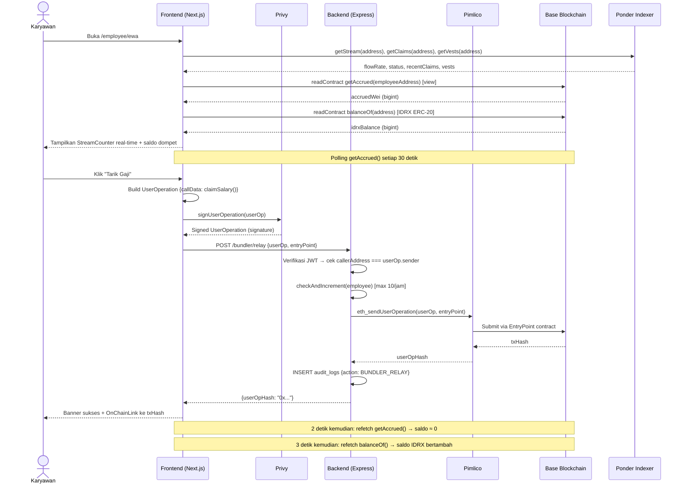

**Deskripsi Antarmuka:**

| Komponen | Tipe | Deskripsi |
|----------|------|-----------|
| Kartu EWA Terminal (gelap) | Card | Kartu latar hitam (#1C1917) menampilkan `StreamCounter` animasi yang menaik setiap detik berdasarkan `flowRate` dan `accruedWei`; label "Live EWA Accrual" |
| Indikator Status Stream | Badge | Titik hijau beranimasi + label "Streaming Aktif" atau status stream lainnya dari Ponder |
| Flow Rate Display | Teks monospace | Menampilkan laju akrual dalam format `+X.XXXXXX IDRX/det` dihitung dari `flowRate / 1e18` |
| Progress Bar Akrual | Bar | Bilah kemajuan visual proporsi saldo terakumulasi |
| Tombol "Tarik Gaji" | Button | Dinonaktifkan jika `accruedWei === 0` atau transaksi sedang diproses; menampilkan spinner saat `isPending` |
| Label Gasless | Teks kecil | Keterangan "Gasless via ERC-4337 Paymaster" di bawah tombol |
| Banner Sukses | Alert | Muncul 5 detik setelah klaim berhasil; berisi link `OnChainLink` ke txHash |
| Grafik Akrual Bulan Ini | AreaChart (Recharts) | Visualisasi tren akrual menggunakan data statis untuk MVP |
| Kartu Smart Account | Card | Menampilkan saldo IDRX via `balanceOf`, alamat dompet disingkat, tombol pintas ke Transfer dan Bounty |
| Kartu Bonus Vesting | Card | Menampilkan vest berikutnya (status `Locked`) beserta tanggal cliff dan progress bar; link ke `/employee/vesting` |
| Kartu Aktivitas Terakhir | List | Lima klaim EWA terakhir dari `ponder.getClaims(address)`, setiap item menampilkan tanggal dan jumlah `netToEmployee` |

**Method/Algoritma:**

**Pada load halaman:**
1. Panggil `ponder.getStream(address)`, `ponder.getClaims(address)`, dan `ponder.getVests(address)` secara paralel via `Promise.all`.
2. Panggil `getAccrued(employeeAddress)` via `publicClient.readContract` ke `CompanyVault`.
3. Panggil `balanceOf(address)` via `publicClient.readContract` ke kontrak IDRX ERC-20.
4. Tampilkan `StreamCounter` dengan prop `flowRateWei` dan `seedWei = accruedWei`; komponen ini menghitung `seed + flowRate × elapsedSeconds` setiap milidetik secara lokal.

**Formula kalkulasi akrual (dari kontrak):**
```
accrued = settledBalance + (flowRate × (block.timestamp − lastWithdrawnTs))
```

**Polling:**
- `getAccrued()` dipanggil ulang setiap **30 detik** melalui `setInterval` untuk menyinkronkan nilai `seedWei` agar `StreamCounter` tidak menyimpang terlalu jauh dari nilai on-chain.

**Pada klik "Tarik Gaji":**
1. Panggil `write({functionName: 'claimSalary', args: []})` via hook `useContractWrite`.
2. Hook mengemas transaksi sebagai UserOperation ERC-4337, menandatanganinya via Privy, lalu mengirim ke `POST /bundler/relay`.
3. Backend memverifikasi JWT, memeriksa rate limit (max 10/jam per alamat), dan meneruskan ke Pimlico.
4. Setelah konfirmasi: `txHash` ditampilkan via `OnChainLink`, `getAccrued()` dan `balanceOf()` di-refetch setelah penundaan 2–3 detik.

---

#### 3.C.2 Pesangon Karyawan (`/employee/severance`)

**Deskripsi:** Halaman read-only yang menampilkan saldo dana pesangon karyawan yang terakumulasi secara otomatis dari setiap klaim gaji (2% dari total klaim). Karyawan dapat memantau jumlah dana yang terkunci, status pesangon, estimasi kontribusi bulanan, dan grafik pertumbuhan historis. Dana hanya dapat dicairkan melalui proses PHK resmi dua pihak (HR + Legal Officer).

**Aktor:** Karyawan

**FR Terkait:** FR-PAYANA-401, FR-PAYANA-504, FR-PAYANA-506

**Alur Interaksi:**

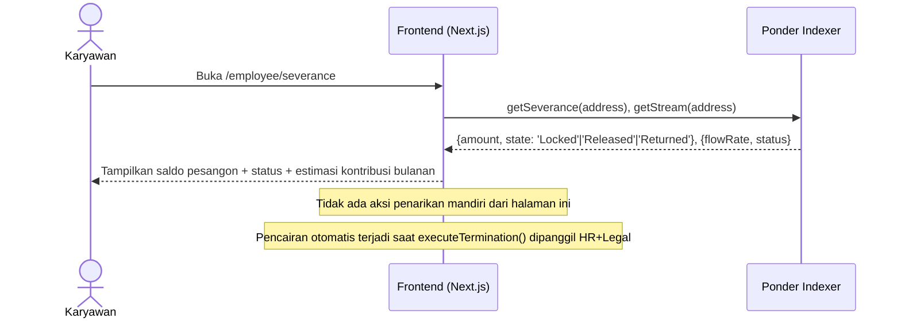

**Deskripsi Antarmuka:**

| Komponen | Tipe | Deskripsi |
|----------|------|-----------|
| Saldo Pesangon Terakumulasi | Heading besar | Jumlah IDRX terkunci ditampilkan dalam format `IDRXAmount`, font serif ukuran 6xl |
| Badge Status | Badge | Tiga state: `LOCKED` (abu-abu), `RELEASED` (hijau), `RETURNED` (amber); masing-masing dengan ikon gembok |
| Grafik Bar Historis | BarChart (Recharts) | Estimasi akrual 5 bulan terakhir dikalkulasikan dari `totalAmount / 5` secara progresif |
| Estimasi Kontribusi Bulanan | Teks info | Dihitung: `flowRate × 2_592_000 × 833 / 10_000` (≈ 8,33% dari gaji bulanan, mewakili `DEFAULT_SEVERANCE_BPS` 200 bps dari porsi gaji bersih) |
| Kartu Perlindungan Karyawan | Info card | Penjelasan dasar hukum UU Cipta Kerja Pasal 156 dan mekanisme escrow on-chain |

**Method/Algoritma:**

**Estimasi kontribusi bulanan:**
```
SECONDS_PER_MONTH = 2_592_000
SEVERANCE_BPS = 833  // ≈ 8.33% representasi konservatif dari total gaji
estimatedMonthlyContrib = (flowRate × SECONDS_PER_MONTH × SEVERANCE_BPS) / 10_000
```

Nilai ini merupakan estimasi frontend dan bukan nilai kontrak yang sebenarnya. Nilai aktual on-chain menggunakan `DEFAULT_SEVERANCE_BPS = 200` (2% dari net setelah split).

---

#### 3.C.3 Vesting Karyawan (`/employee/vesting`)

**Deskripsi:** Halaman yang menampilkan seluruh cliff vest (bonus retensi, masa percobaan, ESOP) milik karyawan beserta status, nilai, tanggal cliff, dan countdown waktu tersisa. Karyawan dapat mengklaim vest yang sudah jatuh tempo melalui fungsi `claimCliffVest()`.

**Aktor:** Karyawan

**FR Terkait:** FR-PAYANA-602, FR-PAYANA-604, FR-PAYANA-605

**Alur Interaksi:**

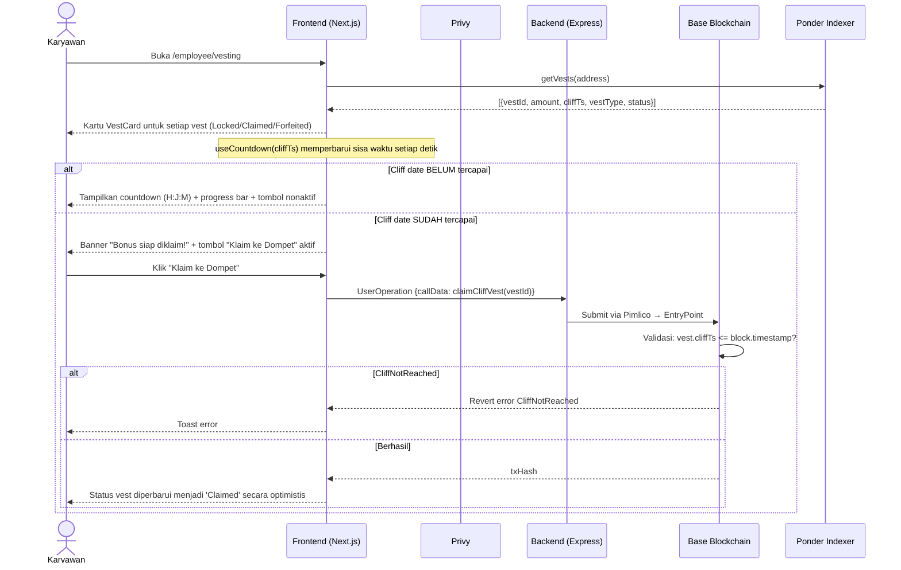

**Deskripsi Antarmuka:**

| Komponen | Tipe | Deskripsi |
|----------|------|-----------|
| `VestCard` | Card | Kartu per vest; latar disesuaikan status: putih (Locked), hijau (Claimed), merah (Forfeited) |
| Badge Tipe Vest | Badge | Menampilkan `vest.vestType` (mis. "Bonus Retensi") atau "VESTED" / "FORFEITED" |
| Jumlah Vest | Heading | Format `IDRXAmount` dalam font serif 4xl |
| Countdown | Info box | `H H : JJ J : MM M` jika cliff belum tercapai; dihitung via hook `useCountdown(cliffTs)` |
| Banner "Siap Diklaim" | Alert hijau | Ditampilkan ketika `block.timestamp > cliffTs && status === 'Locked'` |
| Progress Bar Cliff | Bar | Estimasi progres: `(now - startTs) / (cliffTs - startTs) × 100`, asumsi cliff = 1 tahun |
| Tanggal Cliff | Teks | Format lokal Indonesia, mis. "15 Jun 2026" |
| Tombol "Klaim ke Dompet" | Button hitam | Aktif hanya jika `canClaim = status === 'Locked' && cliffPassed`; spinner saat `isPending` |
| Tombol "Sudah Diklaim" | Button nonaktif hijau | Ditampilkan jika `status === 'Claimed'` |
| Tombol "Hangus" | Button nonaktif merah | Ditampilkan jika `status === 'Forfeited'` |
| State kosong | Empty state | Ikon gift + teks "Tidak ada data vesting." jika array `vests` kosong |

**Method/Algoritma:**

**Hook `useCountdown(cliffTs)`:**
1. Setiap detik, hitung `remaining = Number(cliffTs) - Math.floor(Date.now() / 1000)`.
2. Turunkan nilai `days`, `hours`, `mins`, `secs` dari `remaining`.
3. Kembalikan `{remaining, days, hours, mins, secs}`.

**Logika klaim `handleClaim(vest)`:**
1. Panggil `write({functionName: 'claimCliffVest', args: [BigInt(vest.vestId)]})`.
2. Jika kontrak mengembalikan error `CliffNotReached`, hook `useTxToast` menampilkan toast error.
3. Jika berhasil: perbarui state `vests` secara optimistis — set `status = 'Claimed'` untuk vest yang diklaim.

**Error yang ditangani:**

| Error Kontrak | Kondisi Pemicu | Respons Frontend |
|--------------|----------------|-----------------|
| `CliffNotReached` | `block.timestamp < vest.cliffTs` | Toast error: cliff date belum tercapai |
| `VestAlreadySettled` | Vest sudah `Claimed` atau `Forfeited` | Toast error: vest sudah tidak aktif |
| `VestNotFound` | `vestId` tidak valid | Toast error |

---

#### 3.C.4 Koperasi Karyawan (`/employee/koperasi`)

**Deskripsi:** Halaman koperasi likuiditas internal karyawan (closed-loop). Karyawan dapat mengajukan pinjaman dari pool koperasi perusahaan dengan kolateral berbasis stream gaji, melunasi pinjaman secara manual, mendepositkan IDRX sebagai penyedia likuiditas untuk mendapatkan yield, dan menarik simpanan beserta bunga. Kalkulator pinjaman interaktif menampilkan estimasi total pengembalian berdasarkan bunga pool.

**Aktor:** Karyawan

**FR Terkait:** FR-PAYANA-701, FR-PAYANA-702, FR-PAYANA-703, FR-PAYANA-704, FR-PAYANA-705

**Alur Interaksi:**

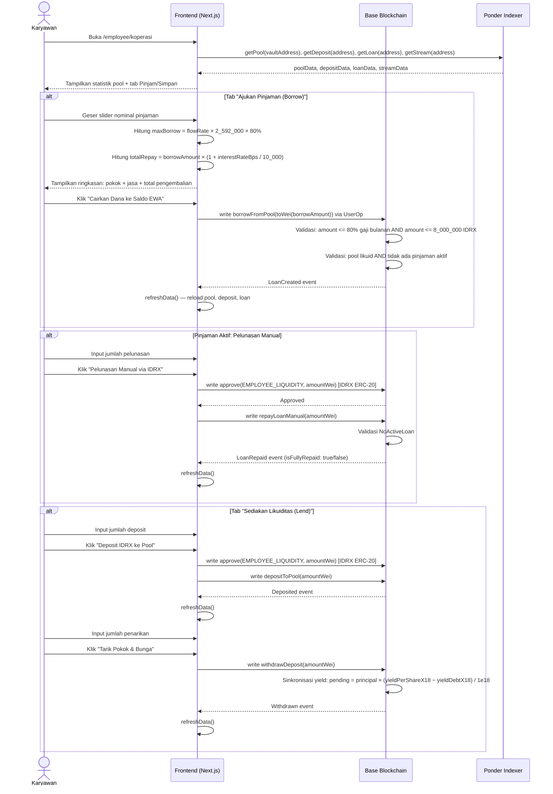

**Deskripsi Antarmuka:**

| Komponen | Tipe | Deskripsi |
|----------|------|-----------|
| Banner Statistik Pool | Grid 3 kolom | Total Deposited, Tersedia (totalDeposited − totalLoansOutstanding), Bunga APY |
| Tab Switcher | Tab | Dua tab: "Ajukan Pinjaman (Borrow)" dan "Sediakan Likuiditas (Lend)" |
| Kalkulator Pinjaman | Card + Slider | Input nominal pinjaman (min Rp 100K, maks 80% gaji bulanan); slider interaktif |
| Ringkasan Kalkulator | Summary box | Pokok, jasa koperasi (`interestRateBps / 100` %), total pengembalian |
| Tombol "Cairkan Dana" | Button hitam | Dinonaktifkan jika `borrowAmount > maxBorrow` atau `isPending` |
| Catatan Cicilan Otomatis | Teks kecil | "Cicilan akan dipotong otomatis dari aliran gaji bulan depan" |
| Kartu Status Pinjaman (gelap) | Card | Menampilkan sisa pokok pinjaman, progress pelunasan, input pelunasan manual, tombol pelunasan |
| Progress Pelunasan | Bar merah | `repaidAmount / (principal + interest) × 100` |
| Kartu Portofolio Yield | Card gelap | Total deposit aktif, bunga terkumpul, status kontrak, tombol tarik |
| Input Deposit | Number input | Jumlah dalam Rupiah; perlu `approve` terlebih dahulu sebelum `depositToPool` |
| Input Penarikan | Number input | Jumlah yang ingin ditarik; dibatasi oleh `poolAvailable` |
| Informasi Pemotongan Otomatis | Alert amber | Penjelasan mekanisme `autoRepay` — 20% dari setiap klaim gaji disapu untuk cicilan |

**Method/Algoritma:**

**Kalkulasi batas pinjaman maksimum:**
```
SECONDS_PER_MONTH = 2_592_000
monthlySalary = (flowRate / 1e18) × SECONDS_PER_MONTH
maxBorrow = floor(monthlySalary × 0.8)
```

**Kalkulasi total pengembalian:**
```
interest = borrowAmount × (interestRateBps / 10_000)
totalRepay = borrowAmount + interest
```

**Kalkulasi sisa pinjaman:**
```
loanOutstanding = max(0, principal + interest − repaidAmount)
loanProgress = min(100, (repaidAmount / (principal + interest)) × 100)
```

**Kalkulasi ketersediaan pool:**
```
poolAvailable = max(0, totalDeposited − totalLoansOutstanding)
```

**Alur approve + deposit/repay:**
1. Panggil `write({functionName: 'approve', args: [CONTRACTS.EMPLOYEE_LIQUIDITY, amountWei]})` pada kontrak IDRX ERC-20.
2. Setelah konfirmasi, panggil `write({functionName: 'depositToPool' | 'repayLoanManual', args: [amountWei]})`.
3. Panggil `refreshData()` untuk muat ulang data pool, deposit, dan pinjaman.

**Error yang ditangani:**

| Error Kontrak | Kondisi Pemicu | Respons Frontend |
|--------------|----------------|-----------------|
| `ActiveLoanExists` | Meminjam saat sudah ada pinjaman aktif | Toast error via `useTxToast` |
| `LoanLimitExceeded` | Melebihi 80% gaji bulanan atau 8.000.000 IDRX | Toast error |
| `InsufficientPoolLiquidity` | Pool tidak cukup untuk pinjaman | Toast error |
| `NoActiveLoan` | Melunasi tanpa pinjaman aktif | Toast error |
| `NothingToWithdraw` | Menarik tanpa deposito | Toast error |

---

#### 3.C.5 Transfer IDRX (`/employee/transfer`)

**Deskripsi:** Halaman untuk mengirim saldo IDRX dari Smart Account karyawan ke alamat dompet EVM lainnya secara langsung on-chain. Transfer bersifat gasless via Paymaster ERC-4337. Halaman ini hanya mendukung transfer on-chain; konversi ke rekening bank (off-ramp) berada di luar ruang lingkup sistem.

**Aktor:** Karyawan

**FR Terkait:** FR-PAYANA-401, FR-PAYANA-403

**Alur Interaksi:**

```mermaid
sequenceDiagram
    actor Karyawan
    participant FE as Frontend (Next.js)
    participant BE as Backend (Express)
    participant Base as Base Blockchain

    Karyawan->>FE: Buka /employee/transfer
    FE->>Base: readContract balanceOf(address) [IDRX ERC-20]
    Base-->>FE: idrxBalance
    FE-->>Karyawan: Tampilkan saldo IDRX tersedia

    Karyawan->>FE: Input alamat tujuan (0x...)
    FE->>FE: isAddress(recipientAddress) → validasi format EVM
    alt Alamat tidak valid
        FE-->>Karyawan: Error "Alamat tidak valid. Harus berformat 0x..."
    end

    Karyawan->>FE: Input jumlah transfer (atau klik "Max")
    Karyawan->>FE: Klik "Kirim On-Chain Sekarang"
    FE->>BE: UserOperation {callData: IDRX.transfer(recipient, amountWei)}
    BE->>Base: Submit via Pimlico → EntryPoint
    Base-->>FE: txHash
    FE-->>Karyawan: Banner sukses + OnChainLink ke txHash
    FE->>FE: Tambahkan ke riwayat transfer lokal
    Note over FE,Base: 3 detik kemudian: refetch balanceOf()
```

**Deskripsi Antarmuka:**

| Komponen | Tipe | Deskripsi |
|----------|------|-----------|
| Kartu Saldo Tersedia | Card | Menampilkan saldo IDRX via `balanceOf`; label "Dana dijamin 1:1 oleh Rupiah" |
| Form Alamat Tujuan | Text input monospace | Placeholder "0x..."; validasi real-time via `isAddress` dari viem |
| Pesan Error Alamat | Teks merah | "Alamat tidak valid. Harus berformat 0x..." |
| Input Jumlah Transfer | Number input besar | Prefix "Rp"; tombol "Max" untuk mengisi saldo penuh |
| Ringkasan Biaya | Summary box | Gas Fee: Gratis (Disponsori Paymaster); Estimasi Waktu: < 30 Detik |
| Total Dikirim | Teks besar | Jumlah yang dimasukkan dalam format Rupiah |
| Tombol "Kirim On-Chain" | Button putih | Dinonaktifkan jika form tidak valid atau `isPending` |
| Banner Sukses | Alert hijau | Menampilkan `OnChainLink` ke txHash setelah transfer berhasil |
| Riwayat Transfer | List | Daftar transfer sesi ini (state lokal); setiap item: tanggal, alamat tujuan disingkat, jumlah, link explorer |
| Info Off-Ramp | Alert biru | Penjelasan bahwa konversi ke rekening bank tidak tersedia dalam sistem |

**Method/Algoritma:**

**Validasi alamat:**
```typescript
import { isAddress } from "viem";
const valid = isAddress(recipientAddress);
// Menolak jika tidak dimulai "0x" atau panjang tidak 42 karakter
```

**Kalkulasi jumlah dalam wei:**
```typescript
const toWei = (amount: number) => BigInt(Math.round(amount * 1e18));
const amountWei = toWei(Number(amount));
```

**Eksekusi transfer:**
1. Panggil `write({address: CONTRACTS.IDRX_ERC20, functionName: 'transfer', args: [recipientAddress, amountWei]})`.
2. Fungsi `transfer` adalah fungsi standar ERC-20 yang dipanggil langsung dari Smart Account karyawan.
3. Tidak diperlukan langkah `approve` karena karyawan adalah pemilik token.
4. Setelah berhasil: tambahkan ke riwayat transfer lokal, refresh `balanceOf` setelah 3 detik.

---

#### 3.C.6 Audit Log Karyawan (`/employee/audit`)

> **Catatan Implementasi:** Fitur pada halaman ini belum terhubung ke smart contract on-chain pada versi MVP. Fungsionalitas yang ditandai `[Perlu dikonfirmasi]` direncanakan diimplementasikan pada sprint berikutnya setelah integrasi antarmuka dasar selesai.


**Deskripsi:** Halaman penjelajah blok personal karyawan yang menampilkan riwayat seluruh transaksi on-chain terkait akun karyawan, divalidasi langsung dari data yang telah diindeks Ponder. Karyawan dapat mencari transaksi berdasarkan tipe event, txHash, atau detail mutasi.

**Aktor:** Karyawan

**FR Terkait:** FR-PAYANA-401, FR-PAYANA-402

**Alur Interaksi:**

```mermaid
sequenceDiagram
    actor Karyawan
    participant FE as Frontend (Next.js)
    participant Ponder as Ponder Indexer

    Karyawan->>FE: Buka /employee/audit
    FE-->>Karyawan: Tampilkan tabel transaksi (data sementara dalam MVP)
    Note over FE,Ponder: [Perlu dikonfirmasi] Integrasi Ponder untuk query event per alamat belum terhubung di page.tsx
    Karyawan->>FE: Input kata kunci di kolom pencarian
    FE->>FE: filter auditLogs berdasarkan type, txHash, atau details
    FE-->>Karyawan: Tampilkan baris yang cocok
```

**Deskripsi Antarmuka:**

| Komponen | Tipe | Deskripsi |
|----------|------|-----------|
| Header Status Node | Badge | Indikator "Base Goerli: Block #XXXXXXX" dengan titik hijau beranimasi |
| Kolom Pencarian | Text input | Cari berdasarkan tipe event, txHash, atau detail mutasi |
| Label Tervalidasi | Header | "Transaksi Tervalidasi" dengan ikon `ShieldCheck` |
| Tabel Transaksi | Table | Kolom: Tx Hash, Tipe Event, Block & Waktu, Detail Mutasi, Explorer |
| Tx Hash | Teks biru monospace | Dapat diklik; mengarah ke block explorer |
| Badge Tipe Event | Badge abu | Tipe: `Withdrawal`, `BountyClaim`, `Transfer_OnChain`, `StreamCreated` |
| Block & Waktu | Teks dua baris | Nomor blok dan waktu dalam format lokal Indonesia |
| Tombol Explorer | Icon button | Membuka transaksi di block explorer eksternal |
| State kosong | Teks | "Tidak ada log transaksi yang cocok dengan pencarian Anda." |

**Catatan Implementasi:**

Pada implementasi MVP saat ini (`/employee/audit/page.tsx`), data audit log masih berupa data statis hardcoded dengan empat entri contoh. Integrasi ke Ponder Indexer untuk mengambil event per alamat karyawan secara dinamis **[Perlu dikonfirmasi]** belum diimplementasikan di halaman ini. Sumber data yang dimaksud ke depannya adalah query Ponder yang mengembalikan event `SalaryClaimed`, `CliffVestClaimed`, `LoanCreated`, dan `Transfer` yang terkait dengan alamat karyawan yang sedang login.

---

#### 3.C.7 Pengaturan Karyawan (`/employee/settings`)

> **Catatan Implementasi:** Fitur pada halaman ini belum terhubung ke smart contract on-chain pada versi MVP. Fungsionalitas yang ditandai `[Perlu dikonfirmasi]` direncanakan diimplementasikan pada sprint berikutnya setelah integrasi antarmuka dasar selesai.


**Deskripsi:** Halaman pengelolaan profil dan keamanan karyawan. Karyawan dapat memperbarui nomor telepon, mengelola keamanan akun (ubah password, status 2FA), dan melihat/memperbarui alamat Smart Account ERC-4337 yang terhubung. Nama lengkap dan email perusahaan dikunci dan hanya dapat diubah oleh HR.

**Aktor:** Karyawan

**FR Terkait:** FR-PAYANA-101, FR-PAYANA-102

**Alur Interaksi:**

```mermaid
sequenceDiagram
    actor Karyawan
    participant FE as Frontend (Next.js)
    participant BE as Backend (Express)

    Karyawan->>FE: Buka /employee/settings
    FE-->>Karyawan: Tampilkan data profil (nama, email dikunci; telepon dapat diedit)

    Karyawan->>FE: Edit nomor telepon → Klik "Simpan Perubahan"
    FE->>BE: [Perlu dikonfirmasi] PATCH /profile {phone}
    BE-->>FE: Konfirmasi pembaruan

    Karyawan->>FE: Klik "Ganti Dompet" pada kartu Smart Account
    FE-->>Karyawan: Form input alamat wallet baru (0x...)
    Karyawan->>FE: Input alamat baru → Submit
    FE->>FE: Validasi: dimulai "0x" dan panjang >= 40 karakter
    FE->>BE: [Perlu dikonfirmasi] Simpan alamat wallet baru ke profil off-chain
    FE-->>Karyawan: Konfirmasi pembaruan setelah 1,5 detik simulasi
```

**Deskripsi Antarmuka:**

| Komponen | Tipe | Deskripsi |
|----------|------|-----------|
| Kolom Nama Lengkap | Input nonaktif | Read-only; catatan "*Nama dikunci oleh HR sesuai dokumen legal." |
| Kolom Email Perusahaan | Input nonaktif | Read-only dengan ikon `Mail` |
| Kolom Nomor Telepon | Input aktif | Dapat diedit oleh karyawan |
| Tombol "Simpan Perubahan" | Button hitam | Menyimpan perubahan data pribadi yang dapat diedit |
| Kartu Password | Row | Menampilkan "Terakhir diubah N bulan lalu" + tombol "Ubah" |
| Kartu 2FA | Row | Badge "Aktif" hijau; menggunakan aplikasi Authenticator |
| Kartu Smart Account (gelap) | Card | Menampilkan alamat wallet aktif dalam format monospace; badge "ERC-4337" |
| Tombol "Ganti Dompet" | Button | Membuka form input alamat baru |
| Form Ganti Wallet | Form | Input teks `0x...`; tombol Batal dan Simpan |
| Kartu SBT Identity | Card | Menampilkan informasi Soulbound Token (ERC-5192) yang terikat; badge "Token Valid" biru |

**Catatan Implementasi:**

Pada implementasi MVP saat ini, logika pembaruan data menggunakan `setTimeout` simulasi tanpa koneksi ke backend nyata. Integrasi ke endpoint backend untuk menyimpan perubahan profil off-chain (sesuai UU PDP 2022 yang melarang penyimpanan PII on-chain) **[Perlu dikonfirmasi]** belum terhubung di halaman ini. Data sensitif seperti NIK tidak ditampilkan di halaman ini; hanya nama, email, dan nomor telepon yang terekspos di antarmuka.

---

#### 3.C.8 Reimbursement Karyawan (`/employee/reimburse`)

> **Catatan Implementasi:** Fitur pada halaman ini belum terhubung ke smart contract on-chain pada versi MVP. Fungsionalitas yang ditandai `[Perlu dikonfirmasi]` direncanakan diimplementasikan pada sprint berikutnya setelah integrasi antarmuka dasar selesai.


**Deskripsi:** Halaman pengajuan klaim penggantian biaya operasional (reimbursement). Karyawan dapat membuat tiket reimburse baru dengan melampirkan deskripsi, kategori, nominal, dan bukti struk. Tiket yang disetujui HR akan dicairkan via Smart Contract. Halaman menampilkan ringkasan statistik dan daftar semua tiket beserta statusnya.

**Aktor:** Karyawan

**FR Terkait:** [Perlu dikonfirmasi — fitur ini tidak terdefinisi dalam kelompok FR SKPL yang ada; kemungkinan masuk dalam cakupan Modul Dashboard (F)]

**Alur Interaksi:**

```mermaid
sequenceDiagram
    actor Karyawan
    participant FE as Frontend (Next.js)
    participant BE as Backend (Express)

    Karyawan->>FE: Buka /employee/reimburse
    FE-->>Karyawan: Tampilkan statistik (Total Klaim, Pending, Paid) + tabel tiket

    Karyawan->>FE: Klik "Buat Pengajuan Baru"
    FE-->>Karyawan: Modal form reimburse terbuka

    Karyawan->>FE: Isi deskripsi, kategori, nominal, upload struk
    Karyawan->>FE: Klik "Kirim Tiket Reimburse"
    FE->>BE: [Perlu dikonfirmasi] POST /reimburse {title, amount, category, receipt}
    FE->>FE: Tambahkan tiket baru ke state lokal dengan status PENDING (simulasi 1 detik)
    FE-->>Karyawan: Modal tertutup; tiket muncul di tabel

    Note over FE: HR mereview tiket di portal HR
    Note over FE: Saat disetujui HR → status berubah ke PAID + txHash on-chain dicatat
```

**Deskripsi Antarmuka:**

| Komponen | Tipe | Deskripsi |
|----------|------|-----------|
| Kartu "Total Klaim Bulan Ini" | Card gelap | Agregat nominal semua klaim bulan berjalan dalam format Rupiah |
| Kartu "Menunggu Review HR" | Card | Jumlah tiket berstatus `PENDING` |
| Kartu "Telah Dicairkan" | Card | Jumlah tiket berstatus `PAID` |
| Tombol "Buat Pengajuan Baru" | Button hitam | Membuka modal form pengajuan |
| Tabel Tiket | Table | Kolom: Rincian Transaksi, Kategori, Nominal, Status & TX |
| Badge Status | Badge | `PENDING` (amber), `PAID` (hijau), `REJECTED` (merah) |
| Hash Transaksi | Teks monospace kecil | Ditampilkan di bawah badge PAID jika txHash tersedia |
| Modal Form | Modal | Field: Deskripsi, Kategori (select), Nominal (Rp), Upload Struk (drag-and-drop) |
| Area Upload Struk | Dropzone | Mendukung PNG, JPG, PDF maksimal 5 MB |

**Kategori reimburse yang tersedia:**
- Transportasi
- Makan / Konsumsi
- Akomodasi / Hotel
- Perlengkapan Kantor
- Lainnya

---

#### 3.C.9 Bounty dan Tip Sesama Karyawan (`/employee/bounty`)

> **Catatan Implementasi:** Fitur pada halaman ini belum terhubung ke smart contract on-chain pada versi MVP. Fungsionalitas yang ditandai `[Perlu dikonfirmasi]` direncanakan diimplementasikan pada sprint berikutnya setelah integrasi antarmuka dasar selesai.


**Deskripsi:** Halaman dua fitur: (1) papan misi bounty tempat karyawan dapat mengklaim hadiah IDRX atas penyelesaian tugas ekstra yang ditetapkan perusahaan, dan (2) fitur Peer Tipping untuk mengirim apresiasi langsung dalam bentuk IDRX ke sesama karyawan via Smart Contract.

**Aktor:** Karyawan

**FR Terkait:** [Perlu dikonfirmasi — fitur ini tidak terdefinisi dalam kelompok FR SKPL yang ada; kemungkinan termasuk dalam pengembangan fitur lanjutan]

**Alur Interaksi:**

```mermaid
sequenceDiagram
    actor Karyawan
    participant FE as Frontend (Next.js)
    participant BE as Backend (Express)
    participant Base as Base Blockchain

    Karyawan->>FE: Buka /employee/bounty
    FE-->>Karyawan: Tab "Misi Bounty" + daftar kartu bounty (ACTIVE/COMPLETED)

    alt Tab Misi Bounty
        Karyawan->>FE: Klik "Klaim Misi" pada bounty aktif
        FE-->>Karyawan: Modal "Serahkan Bukti Misi" terbuka
        Karyawan->>FE: Input URL bukti penyelesaian → Submit
        FE->>BE: [Perlu dikonfirmasi] POST /bounty/claim {bountyId, evidenceUrl}
        FE->>FE: Kuota klaim berkurang; status berubah ke COMPLETED jika kuota habis (simulasi)
        FE-->>Karyawan: Modal tertutup
    end

    alt Tab Kirim Tip
        Karyawan->>FE: Pilih penerima dari dropdown karyawan
        Karyawan->>FE: Input nominal tip dan pesan opsional
        Karyawan->>FE: Klik "Konfirmasi Transfer"
        FE->>Base: [Perlu dikonfirmasi] write IDRX.transfer(recipientAddress, amountWei) via UserOp
        FE->>FE: Reset form setelah simulasi 1,5 detik
        FE-->>Karyawan: Konfirmasi transfer
    end
```

**Deskripsi Antarmuka:**

| Komponen | Tipe | Deskripsi |
|----------|------|-----------|
| Tab Switcher | Tab | "Misi Bounty" dan "Kirim Tip" |
| Kartu Bounty Epic | Card gelap | Latar hitam dengan efek blur amber; badge ACTIVE dengan bintang; tombol "Klaim Misi" amber |
| Kartu Bounty Rare | Card indigo | Latar gradien indigo terang; badge ACTIVE hijau |
| Kartu Bounty Common | Card putih | Latar putih; badge COMPLETED jika kuota habis |
| Sisa Kuota | Badge | "Sisa Kuota: N/M" di pojok kanan atas setiap kartu |
| Hadiah Misi | Teks besar serif | Nilai reward dalam Rupiah |
| Modal Bukti Misi | Modal | Field URL input untuk bukti penyelesaian; tombol "Kirim Klaim ke HR" |
| Form Kirim Tip | Panel dua kolom | Kiri: ikon gift + deskripsi; Kanan: dropdown penerima, input nominal, textarea pesan |
| Tombol "Konfirmasi Transfer" | Button gradien biru-indigo | Dinonaktifkan jika penerima atau nominal belum diisi |

---

#### 3.C.10 Kehadiran dan Cuti (`/employee/attendance`)

> **Catatan Implementasi:** Fitur pada halaman ini belum terhubung ke smart contract on-chain pada versi MVP. Fungsionalitas yang ditandai `[Perlu dikonfirmasi]` direncanakan diimplementasikan pada sprint berikutnya setelah integrasi antarmuka dasar selesai.


**Deskripsi:** Halaman pencatatan kehadiran harian (clock in/out) dan pengajuan cuti. Karyawan dapat absen masuk dan keluar, memantau riwayat kehadiran tiga bulan terakhir melalui visualisasi heatmap, melihat sisa kuota cuti tahunan, dan mengajukan berbagai tipe cuti. Pengajuan Unpaid Leave otomatis memicu sinyal jeda pada stream EWA karyawan.

**Aktor:** Karyawan

**FR Terkait:** [Perlu dikonfirmasi — fitur kehadiran tidak terdefinisi dalam kelompok FR SKPL yang ada; integrasi dengan `pauseStream()` merupakan perilaku yang disebutkan di antarmuka tetapi belum terkonfirmasi di kontrak]

**Alur Interaksi:**

```mermaid
sequenceDiagram
    actor Karyawan
    participant FE as Frontend (Next.js)
    participant BE as Backend (Express)
    participant Base as Base Blockchain

    Karyawan->>FE: Buka /employee/attendance
    FE-->>Karyawan: Jam server WIB real-time (update setiap detik) + tombol Clock In/Out

    Karyawan->>FE: Klik "Clock In Sekarang"
    FE->>BE: [Perlu dikonfirmasi] POST /attendance/clock-in {timestamp, geolocation}
    FE->>FE: setIsClockedIn(true); simpan clockInTime
    FE-->>Karyawan: Status berubah: "Anda sudah absen masuk pada HH:MM"

    Karyawan->>FE: Klik "Clock Out Sekarang"
    FE->>BE: [Perlu dikonfirmasi] POST /attendance/clock-out {timestamp}
    FE->>FE: setIsClockedIn(false)
    FE-->>Karyawan: Status kembali normal

    Karyawan->>FE: Klik "Ajukan Cuti Baru"
    FE-->>Karyawan: Modal form pengajuan cuti terbuka
    Karyawan->>FE: Pilih tipe, tanggal mulai-selesai, alasan → Submit
    FE->>BE: [Perlu dikonfirmasi] POST /leave {type, startDate, endDate, reason}
    FE->>FE: Tambahkan ke daftar cuti lokal dengan status PENDING
    FE-->>Karyawan: Modal tertutup; pengajuan muncul di tabel

    Note over FE,Base: Unpaid Leave → sistem [Perlu dikonfirmasi] mengirim sinyal pause ke CompanyVault.pauseStream()
```

**Deskripsi Antarmuka:**

| Komponen | Tipe | Deskripsi |
|----------|------|-----------|
| Widget Clock In/Out | Card gelap | Jam server WIB diperbarui setiap detik; badge "GPS Synced" |
| Tombol Clock In | Button putih | Berubah menjadi tombol merah "Clock Out" saat karyawan sudah absen masuk |
| Heatmap Kehadiran | Grid kotak warna | 120 kotak mewakili ~3 bulan; warna: biru (hadir), merah (absen), amber (cuti), kosong (weekend) |
| Kartu Sisa Cuti Tahunan | Card abu | Menampilkan sisa jatah cuti dalam hari; tombol "Ajukan Cuti Baru" |
| Kartu Informasi Unpaid Leave | Card amber | Penjelasan bahwa Unpaid Leave akan memicu jeda stream EWA |
| Tabel Riwayat Pengajuan Cuti | Table | Kolom: Tipe Cuti, Tanggal Pelaksanaan, Status HR |
| Badge Status Cuti | Badge | `APPROVED` (hijau), `PENDING` (amber), `REJECTED` (merah) |
| Modal Form Cuti | Modal | Field: Tipe Cuti (Sakit/Tahunan/Unpaid), Tanggal Mulai, Tanggal Selesai, Alasan |

**Tipe cuti yang tersedia:**
- Sakit (Dengan Surat Dokter)
- Cuti Tahunan (Paid Leave)
- Cuti Di Luar Tanggungan (Unpaid)

---

### 3.D Portal Owner SaaS

---

#### 3.D.1 Dashboard Owner (`/owner`)

**Deskripsi:** Antarmuka administrasi eksklusif untuk Owner SaaS Payana (dikontrol via `OWNER_ADDRESS` environment variable). Owner dapat memantau metrik platform multi-tenant secara agregat, mengelola antrian registrasi HR baru (menyetujui atau menolak), memantau seluruh CompanyVault yang aktif on-chain, dan mengklaim protocol fee yang terakumulasi dari operasi koperasi.

**Aktor:** Owner SaaS

**FR Terkait:** FR-PAYANA-1001, FR-PAYANA-1002, FR-PAYANA-1003, FR-PAYANA-1004, FR-PAYANA-1005, FR-PAYANA-1006, FR-PAYANA-1007, FR-PAYANA-1008

**Alur Interaksi:**

```mermaid
sequenceDiagram
    actor Owner
    participant FE as Frontend (Next.js)
    participant BE as Backend (Express)
    participant Base as Base Blockchain
    participant Ponder as Ponder Indexer

    Owner->>FE: Buka /owner
    FE->>FE: Guard: cek address.toLowerCase() === OWNER_ADDRESS
    alt Bukan Owner
        FE-->>Owner: Redirect ke /login
    end

    FE->>BE: GET /registration/pending (Authorization: Bearer JWT)
    BE->>BE: requireOwner middleware — validasi JWT + OWNER_ADDRESS
    BE-->>FE: [{address, name, email, status, requestedAt}]
    FE->>Ponder: getCompanies()
    Ponder-->>FE: [{id: vaultAddress, name, status, vaultBalance}]
    FE-->>Owner: Tampilkan metrik TVL, Revenue, Klien Aktif, Paymaster balance

    alt Setujui Pendaftaran HR
        Owner->>FE: Klik tombol "Approve" pada baris pendaftar
        FE->>BE: PATCH /registration/{address}/approve (Bearer JWT)
        BE->>BE: requireOwner + update status ke 'approved' di DB
        BE-->>FE: Konfirmasi
        FE->>FE: fetchRegistrations() — refresh daftar
    end

    alt Tolak Pendaftaran HR
        Owner->>FE: Klik tombol "Tolak" pada baris pendaftar
        FE->>BE: DELETE /registration/{address} (Bearer JWT)
        BE->>BE: requireOwner + update status ke 'rejected' di DB
        BE-->>FE: Konfirmasi
        FE->>FE: fetchRegistrations() — refresh daftar
    end

    alt Klaim Protocol Fee
        Owner->>FE: Klik "Claim Protocol Fee (1%)"
        FE->>Base: [Perlu dikonfirmasi] write EmployeeLiquidityContract.claimProtocolFee()
        Base-->>FE: txHash
        FE-->>Owner: Konfirmasi klaim
    end

    alt Manage Vault (Suspend Tenant)
        Owner->>FE: Klik "Manage" pada kartu vault di daftar Tenant
        FE-->>Owner: Modal informasi vault + tombol "Suspend Tenant"
        Owner->>FE: Klik "Suspend Tenant"
        FE->>Base: [Perlu dikonfirmasi] write CompanyVault.freezeVault() atau PayrollFactory.emergencyFreezeAll()
        Base-->>FE: VaultFreeze event
    end
```

**Deskripsi Antarmuka:**

| Komponen | Tipe | Deskripsi |
|----------|------|-----------|
| Header "Payana Super Admin" | Heading + Badge | Label "God Mode" berwarna indigo di samping judul |
| Tombol "Claim Protocol Fee (1%)" | Button hijau-teal | Mengklaim akumulasi fee dari `EmployeeLiquidityContract` |
| Tombol "Keluar" | Button abu | Navigasi ke /login |
| Kartu TVL | Metric card | Total Value Locked seluruh vault; pertumbuhan bulan ini |
| Kartu Platform Revenue | Metric card | Pendapatan total dari lisensi SaaS dan yield cut |
| Kartu Klien Aktif | Metric card | Jumlah CompanyVault terdeploy dari `ponder.getCompanies()` |
| Kartu Gas Paymaster | Metric card gelap | Saldo ETH Paymaster; tombol "Top Up Paymaster" |
| Grafik Pertumbuhan Pendapatan | AreaChart (Recharts) | Data bulanan revenue platform; gradien warna indigo |
| Daftar Tenant On-Chain | Card list | Setiap perusahaan: nama, alamat vault (monospace, dipotong), status, saldo vault, tombol "Manage" |
| Panel Pendaftaran Karyawan | Section | Tab: Pending / Approved / Rejected; indikator jumlah pending |
| Baris Pendaftar | Row | Avatar ikon, nama, alamat (dengan tombol salin), email, waktu; tombol Approve/Tolak (hanya di tab Pending) |
| Tombol Refresh | Icon button | Memanggil ulang `fetchRegistrations()` |
| Modal Manage Vault | Modal | Info vault (alamat, status, network); catatan Owner tidak punya akses admin vault; tombol "Suspend Tenant" |

**Method/Algoritma:**

**Guard Owner:**
```typescript
const OWNER_ADDRESS = process.env.NEXT_PUBLIC_OWNER_ADDRESS?.toLowerCase() ?? "";
if (address.toLowerCase() !== OWNER_ADDRESS) router.replace("/login");
```

**Fetch pendaftaran:**
```typescript
// Dipanggil via useCallback; diulangi setiap kali token berubah
const rows = await registration.getPending(token);
setRegistrations(rows);
```

**Salin alamat:**
```typescript
navigator.clipboard.writeText(reg.address);
setCopiedAddr(reg.address);
setTimeout(() => setCopiedAddr(null), 2000);
```

**Metrik yang ditampilkan (sumber data):**

| Metrik | Sumber |
|--------|--------|
| TVL | [Perlu dikonfirmasi] Agregat `vaultBalance` dari seluruh CompanyVault via Ponder |
| Platform Revenue | [Perlu dikonfirmasi] Akumulasi platform fee dari PayrollFactory |
| Klien Aktif | `ponder.getCompanies().length` |
| Gas Paymaster | [Perlu dikonfirmasi] `publicClient.getBalance(PAYMASTER_ADDRESS)` |
| Data Revenue Chart | Data statis hardcoded pada MVP (5 bulan terakhir) |

---

### 3.E Portal Legal Officer

---

#### 3.E.1 Halaman Persetujuan PHK (`/hr/phk` — akses Legal Officer)

**Deskripsi:** Halaman yang diakses oleh Legal Officer untuk meninjau dan memberikan persetujuan terhadap proposal Pemutusan Hubungan Kerja (PHK) yang telah diajukan oleh HR Admin. Legal Officer adalah pihak kedua dalam mekanisme multi-tanda tangan on-chain; persetujuannya diperlukan sebelum eksekusi PHK dapat dilakukan. Halaman menampilkan daftar proposal yang menunggu persetujuan Legal, beserta detail karyawan, alasan PHK, snapshot flow rate, dan batas waktu kadaluarsa proposal.

**Aktor:** Legal Officer (pemegang `LEGAL_ROLE` on-chain)

**FR Terkait:** FR-PAYANA-502, FR-PAYANA-503, FR-PAYANA-504

**Alur Interaksi:**

```mermaid
sequenceDiagram
    actor LegalOfficer
    participant FE as Frontend (Next.js)
    participant Privy
    participant BE as Backend (Express)
    participant Base as Base Blockchain
    participant Ponder as Ponder Indexer

    LegalOfficer->>FE: Buka /hr/phk
    FE->>Ponder: getTerminationProposals(vaultAddress)
    Ponder-->>FE: [{employee, expiresAt, reasonHash, flowRateSnapshot, hrApproved, legalApproved}]
    FE-->>LegalOfficer: Daftar proposal PHK yang menunggu persetujuan Legal

    Note over FE: Hanya proposal dengan hrApproved=true & legalApproved=false yang ditampilkan

    LegalOfficer->>FE: Tinjau detail proposal (karyawan, alasan, gaji snapshot, waktu kadaluarsa)
    LegalOfficer->>FE: Klik "Setujui PHK"
    FE->>FE: Build UserOperation {callData: approveTermination(employeeAddress)}
    FE->>Privy: signUserOperation(userOp)
    Privy-->>FE: Signed UserOperation
    FE->>BE: POST /bundler/relay {userOp}
    BE->>Base: Submit via Pimlico → EntryPoint
    Base->>Base: Validasi hasRole(LEGAL_ROLE, msg.sender)
    Base->>Base: Validasi: proposal.expiresAt > block.timestamp?
    alt ProposalExpired
        Base-->>FE: Revert error ProposalExpired
        FE-->>LegalOfficer: Toast error: "Proposal telah kadaluarsa"
    end
    Base->>Base: Validasi: legalApproved == false?
    alt AlreadyApproved
        Base-->>FE: Revert error AlreadyApproved
        FE-->>LegalOfficer: Toast error: "Persetujuan sudah diberikan sebelumnya"
    end
    Base->>Base: proposal.legalApproved = true
    Base-->>FE: TerminationApproved event
    FE-->>LegalOfficer: Notifikasi sukses; proposal dipindahkan ke status "Siap Dieksekusi"

    Note over FE,Base: Setelah legalApproved=true, HR dapat memanggil executeTermination()
```

**Deskripsi Antarmuka:**

| Komponen | Tipe | Deskripsi |
|----------|------|-----------|
| Header Halaman | Heading | "Daftar Proposal PHK" atau "Persetujuan Pemutusan Hubungan Kerja" |
| Daftar Proposal | Card list | Setiap proposal menampilkan: nama karyawan, alamat, snapshot gaji bulanan (dari `flowRateSnapshot × 2_592_000 / 1e18`), tanggal kadaluarsa, status persetujuan HR |
| Badge Status | Badge | `Menunggu Legal` (amber) atau `Siap Dieksekusi` (hijau setelah legalApproved=true) |
| Countdown Kadaluarsa | Teks | Sisa waktu sebelum proposal kadaluarsa (7 hari sejak HR mengajukan) |
| Alasan PHK | Teks | Hash alasan ditampilkan sebagai referensi; alasan lengkap disimpan off-chain |
| Tombol "Setujui PHK" | Button | Memicu transaksi `approveTermination(employeeAddress)` via gasless relay |
| Tombol "Lihat Detail" | Button sekunder | [Perlu dikonfirmasi] Menampilkan informasi tambahan stream dan riwayat karyawan |
| State kosong | Teks | "Tidak ada proposal PHK yang menunggu persetujuan." |

**Method/Algoritma:**

**Validasi on-chain dalam `approveTermination(employee)`:**
```solidity
// Kontrak CompanyVault
function approveTermination(address employee) external {
    TerminationProposal storage proposal = terminations[employee];
    if (proposal.expiresAt == 0) revert TerminationNotFound();
    if (block.timestamp >= proposal.expiresAt) revert ProposalExpired();

    if (hasRole(LEGAL_ROLE, msg.sender)) {
        if (proposal.legalApproved) revert AlreadyApproved();
        proposal.legalApproved = true;
    } else {
        revert Unauthorized();
    }

    emit TerminationApproved(employee, msg.sender);
}
```

**Kalkulasi estimasi pesangon (untuk ditampilkan):**
```
monthlyGross = flowRateSnapshot × 2_592_000  // dalam wei IDRX
tenureMonths = (block.timestamp − startTs) / 2_592_000
multiplier   = PayrollMath.severanceMultiplier(tenureMonths)
statutory    = multiplier × monthlyGross
```
Nilai ini ditampilkan sebagai estimasi informasional kepada Legal Officer agar dapat menilai kewajaran proposal sebelum memberikan persetujuan.

**Masa berlaku proposal:**
- Setiap proposal PHK memiliki batas waktu `TERMINATION_EXPIRY = 7 days` yang ditetapkan saat HR memanggil `proposeTermination()`.
- Jika Legal Officer tidak menyetujui sebelum kadaluarsa, proposal menjadi tidak berlaku dan HR harus membuat proposal baru.

**Error yang ditangani:**

| Error Kontrak | Kondisi Pemicu | Respons Frontend |
|--------------|----------------|-----------------|
| `ProposalExpired` | `block.timestamp >= proposal.expiresAt` | Toast error: "Proposal PHK telah kadaluarsa. HR perlu membuat proposal baru." |
| `AlreadyApproved` | Legal Officer sudah menyetujui proposal yang sama | Toast error: "Persetujuan sudah diberikan sebelumnya untuk proposal ini." |
| `TerminationNotFound` | `proposal.expiresAt == 0` — tidak ada proposal aktif | Toast error: "Proposal tidak ditemukan untuk karyawan ini." |
| `Unauthorized` | Pemanggil tidak memegang `LEGAL_ROLE` | Toast error: "Akun Anda tidak memiliki hak Legal Officer pada vault ini." |

**Catatan Implementasi:**

Halaman `/hr/phk` dalam kode frontend yang ada menggabungkan akses HR dan Legal Officer dalam satu route. Pemisahan tampilan antara aksi HR (proposeTermination) dan aksi Legal Officer (approveTermination) dilakukan berdasarkan deteksi role on-chain melalui hook `useRole`. Antarmuka khusus Legal Officer hanya menampilkan tombol "Setujui PHK" dan menyembunyikan tombol "Ajukan PHK" yang merupakan aksi HR. [Perlu dikonfirmasi] Apakah terdapat halaman terpisah `/legal/phk` yang direncanakan untuk akses Legal Officer eksklusif dalam versi mendatang.


## 4. Perancangan Data

### 4.1 Entity Relationship Diagram — On-Chain (Smart Contract State)

State on-chain Payana tersebar di empat kontrak Solidity yang masing-masing memiliki scope tanggung jawab yang tegas. `PayrollFactory` hanya menyimpan registry tenant (mapping `companyVaults` dan array `allVaults`). `CompanyVault` menyimpan seluruh state payroll per perusahaan melalui lima mapping utama dan beberapa state variable. `EmployeeLiquidityContract` menyimpan state pool koperasi melalui tiga mapping. `EmploymentSBT` menyimpan record sertifikat employment per token ID dan per karyawan. Diagram berikut merepresentasikan hubungan antar entitas data on-chain berdasarkan struct dan mapping aktual yang ditemukan dalam kode sumber.

```mermaid
erDiagram
    PayrollFactory {
        address IDRX "immutable — token ERC-20"
        mapping_address_to_address companyVaults "hr_address => vault_address"
        address[] allVaults "array semua vault"
    }

    CompanyVault {
        address IDRX "immutable"
        address hrAuthority "immutable"
        address liquidityContract "ref ke ELC"
        address sbtContract "ref ke EmploymentSBT"
        address factory "ref ke PayrollFactory"
        string companyName
        VaultStatus status "Active|Paused|Frozen"
        uint16 bpjsBps
        uint16 pph21Bps
        uint16 severanceBps
        uint16 lowBalanceThresholdBps
        uint256 vestCounter
        uint256 totalFlowRate
        uint256 vaultBalance
        uint256 complianceBalance
    }

    EmployeeStream {
        uint256 flowRate "IDRX wei per detik"
        uint256 startTs "timestamp pembuatan stream"
        uint256 lastWithdrawnTs "timestamp klaim terakhir"
        uint256 settledBalance "akrual tersimpan saat pause/rate update"
        StreamStatus status "Inactive|Active|Paused|Cancelled"
        uint16 employeeBps "split ke karyawan"
        uint16 complianceBps "split ke compliance"
        uint16 severanceBps "split ke severance"
    }

    SeveranceVault {
        uint256 amount "total IDRX terakumulasi"
        SeveranceState state "Locked|Returned|Released"
        uint256 tenureMonths "bulan kerja pada klaim terakhir"
        uint256 lastUpdatedTs
    }

    TerminationProposal {
        address employee
        bool hrApproved
        bool legalApproved
        uint256 expiresAt "block.timestamp + 7 days"
        bytes32 reasonHash "keccak256 alasan PHK"
        uint256 flowRateSnapshot "flowRate saat proposal"
    }

    CliffVest {
        address employee
        uint256 amount "IDRX wei terkunci"
        uint256 cliffTs "unix timestamp unlock"
        VestType vestType "RSU|Options|Custom"
        VestStatus status "Locked|Claimed|Forfeited"
    }

    Pool {
        uint256 totalDeposited "total principal semua lender"
        uint256 totalLoansOutstanding "total pinjaman aktif"
        uint16 interestRateBps "bunga per LOAN_TERM (150 = 1.5%)"
        bool initialized
        uint256 yieldPerShareX18 "indeks yield kumulatif scaled 1e18"
    }

    LenderDeposit {
        address companyAddress "pool key (vault address)"
        uint256 principal "principal yang distake"
        uint256 yieldEarned "yield terealisasi pending penarikan"
        uint256 depositedTs
        uint256 yieldDebtX18 "snapshot yieldPerShareX18 saat deposit"
    }

    LoanRecord {
        address companyAddress
        uint256 principal "jumlah pinjaman"
        uint256 interest "bunga pre-computed saat borrow"
        uint256 repaidAmount "total telah dilunasi"
        uint256 dueTs "block.timestamp + 30 days"
        LoanStatus status "Active|Repaid|Defaulted"
    }

    EmploymentRecord {
        address hrAuthority "HR yang memulai stream"
        string companyName "nama perusahaan saat mint"
        uint256 startTs "timestamp mint token"
    }

    PayrollFactory ||--o{ CompanyVault : "deploys"
    CompanyVault ||--o{ EmployeeStream : "employeeStreams[address]"
    CompanyVault ||--o{ SeveranceVault : "severanceVaults[address]"
    CompanyVault ||--o{ TerminationProposal : "terminations[address]"
    CompanyVault ||--o{ CliffVest : "cliffVests[address][vestId]"
    EmployeeLiquidityContract ||--o{ Pool : "pools[company]"
    EmployeeLiquidityContract ||--o{ LenderDeposit : "lenderDeposits[lender]"
    EmployeeLiquidityContract ||--o{ LoanRecord : "loanRecords[borrower]"
    EmploymentSBT ||--o{ EmploymentRecord : "employmentRecords[tokenId]"
```

**Keterangan Entitas On-Chain:**

**EmployeeStream** *(mapping: `employeeStreams[address]` di `CompanyVault`)*

| Field | Tipe Solidity | Deskripsi |
|-------|---------------|-----------|
| flowRate | `uint256` | Laju gaji dalam IDRX wei per detik; diset oleh HR saat `startStream()` dan dapat diperbarui via `updateFlowRate()`. |
| startTs | `uint256` | Unix timestamp saat stream pertama kali dibuat; digunakan untuk menghitung `tenureMonths` pesangon. |
| lastWithdrawnTs | `uint256` | Unix timestamp klaim terakhir atau settlement terakhir; basis perhitungan akrual: `flowRate × (block.timestamp - lastWithdrawnTs)`. |
| settledBalance | `uint256` | Saldo IDRX yang sudah di-settle dan dikunci saat stream dijeda (`pauseStream`) atau flow rate diperbarui (`updateFlowRate`), agar akrual historis tidak hilang. |
| status | `StreamStatus` | Enum: `Inactive` (belum terdaftar), `Active` (berjalan), `Paused` (dijeda HR), `Cancelled` (dihentikan permanen). |
| splits.employeeBps | `uint16` | Persentase split untuk karyawan dalam basis points (default: 9300 = 93%). |
| splits.complianceBps | `uint16` | Persentase split untuk sub-pool kepatuhan (default: 500 = 5%). |
| splits.severanceBps | `uint16` | Persentase split untuk vault pesangon (default: 200 = 2%). |

**SeveranceVault** *(mapping: `severanceVaults[address]` di `CompanyVault`)*

| Field | Tipe Solidity | Deskripsi |
|-------|---------------|-----------|
| amount | `uint256` | Total IDRX wei yang telah terakumulasi dari 2% setiap klaim gaji. |
| state | `SeveranceState` | Enum: `Locked` (aktif bekerja), `Returned` (dikembalikan ke vault saat resign), `Released` (dicairkan ke karyawan saat PHK). |
| tenureMonths | `uint256` | Durasi kerja dalam bulan yang diperbarui setiap klaim; digunakan oleh `PayrollMath.severanceMultiplier()` untuk kalkulasi pesangon UU Cipta Kerja. |
| lastUpdatedTs | `uint256` | Unix timestamp update terakhir pada vault pesangon; diperbarui setiap `claimSalary()`. |

**TerminationProposal** *(mapping: `terminations[address]` di `CompanyVault`)*

| Field | Tipe Solidity | Deskripsi |
|-------|---------------|-----------|
| employee | `address` | Alamat wallet karyawan yang diajukan PHK. |
| hrApproved | `bool` | Selalu `true` pada saat proposal dibuat (HR auto-approve); tidak dapat diubah kembali. |
| legalApproved | `bool` | Diset menjadi `true` oleh pemegang `LEGAL_ROLE` melalui `approveTermination()`. |
| expiresAt | `uint256` | Unix timestamp batas waktu proposal (`block.timestamp + 7 days`); proposal tidak dapat dieksekusi setelah waktu ini. |
| reasonHash | `bytes32` | `keccak256` dari string alasan PHK; alasan lengkap disimpan off-chain, hash-nya disimpan on-chain untuk audit trail. |
| flowRateSnapshot | `uint256` | Flow rate karyawan pada saat proposal dibuat; digunakan untuk menghitung gaji bulanan dalam kalkulasi pesangon statutory. |

**CliffVest** *(mapping: `cliffVests[address][uint256]` di `CompanyVault`)*

| Field | Tipe Solidity | Deskripsi |
|-------|---------------|-----------|
| employee | `address` | Alamat wallet penerima vest. |
| amount | `uint256` | Jumlah IDRX wei yang dikunci dalam vest; diambil dari `vaultBalance` saat pembuatan. |
| cliffTs | `uint256` | Unix timestamp minimum sebelum karyawan dapat mengklaim (`claimCliffVest()`). |
| vestType | `VestType` | Enum: `RSU`, `Options`, `Custom` — klasifikasi jenis vest. |
| status | `VestStatus` | Enum: `Locked` (sedang berjalan), `Claimed` (telah dicairkan), `Forfeited` (dibatalkan/hangus). |

**Pool** *(mapping: `pools[address]` di `EmployeeLiquidityContract`)*

| Field | Tipe Solidity | Deskripsi |
|-------|---------------|-----------|
| totalDeposited | `uint256` | Total principal IDRX yang disetor seluruh lender ke pool ini. |
| totalLoansOutstanding | `uint256` | Total principal yang sedang dipinjam oleh borrower aktif; `totalDeposited - totalLoansOutstanding` = likuiditas tersedia. |
| interestRateBps | `uint16` | Tingkat bunga per `LOAN_TERM` (30 hari) dalam basis points; default 150 (1,5%). |
| initialized | `bool` | Flag yang mencegah duplikasi inisialisasi pool yang sama. |
| yieldPerShareX18 | `uint256` | Indeks yield kumulatif scaled 1e18; diperbarui setiap kali pinjaman lunas; digunakan untuk lazy accounting yield lender. |

**LenderDeposit** *(mapping: `lenderDeposits[address]` di `EmployeeLiquidityContract`)*

| Field | Tipe Solidity | Deskripsi |
|-------|---------------|-----------|
| companyAddress | `address` | Alamat `CompanyVault` — kunci pool tempat lender menyetor dana. |
| principal | `uint256` | Jumlah IDRX wei yang saat ini distake oleh lender di pool. |
| yieldEarned | `uint256` | Yield yang telah terealisasi (dimaterialisasi oleh `_syncYield()`) dan belum ditarik. |
| depositedTs | `uint256` | Unix timestamp deposit pertama; digunakan untuk mendeteksi apakah record sudah ada. |
| yieldDebtX18 | `uint256` | Snapshot `pool.yieldPerShareX18` pada saat lender terakhir disync; yield pending = `principal × (current - debt) / 1e18`. |

**LoanRecord** *(mapping: `loanRecords[address]` di `EmployeeLiquidityContract`)*

| Field | Tipe Solidity | Deskripsi |
|-------|---------------|-----------|
| companyAddress | `address` | Pool dari mana pinjaman berasal. |
| principal | `uint256` | Jumlah IDRX yang dipinjam (tidak termasuk bunga). |
| interest | `uint256` | Bunga yang pre-computed saat borrow: `principal × interestRateBps / 10000`. |
| repaidAmount | `uint256` | Total IDRX yang sudah dikembalikan (principal + interest gabungan). |
| dueTs | `uint256` | Jatuh tempo: `block.timestamp + LOAN_TERM` (30 hari) saat borrow. |
| status | `LoanStatus` | Enum: `Active` (sedang berjalan), `Repaid` (lunas), `Defaulted` (dilikuidasi paksa). |

**EmploymentRecord** *(mapping: `employmentRecords[uint256]` di `EmploymentSBT`)*

| Field | Tipe Solidity | Deskripsi |
|-------|---------------|-----------|
| hrAuthority | `address` | Alamat HR yang menginisiasi stream dan mint SBT. |
| companyName | `string` | Nama perusahaan pada saat SBT diterbitkan; disimpan on-chain untuk metadata token. |
| startTs | `uint256` | `block.timestamp` saat `mint()` dipanggil — merepresentasikan tanggal mulai bekerja yang terverifikasi on-chain. |

### 4.2 Entity Relationship Diagram — Off-Chain (PostgreSQL)

Data off-chain Payana disimpan dalam skema `app` di PostgreSQL, terpisah dari skema `public` yang dikelola Ponder. Seluruh tabel dalam skema `app` didefinisikan menggunakan Drizzle ORM di file `backend/src/db/schema.ts`. Skema ini dirancang untuk menyimpan data yang: (a) mengandung PII yang wajib diproteksi sesuai UU PDP 2022, (b) memerlukan state yang mutable dan cepat diakses (sesi, rate limit), atau (c) merupakan log yang perlu disimpan secara off-chain untuk efisiensi (audit trail backend, deduplication webhook).

```mermaid
erDiagram
    employees {
        text address PK "wallet address lowercase"
        text name "AES-256-GCM encrypted"
        text nik "AES-256-GCM encrypted NIK 16 digit"
        text phone "AES-256-GCM encrypted"
        timestamp created_at
        timestamp updated_at
    }

    sessions {
        text jti PK "JWT Unique Identifier"
        text address "wallet address FK ke employees"
        timestamp expires_at
        timestamp created_at
    }

    audit_logs {
        bigint id PK "auto-increment identity"
        text action "BUNDLER_RELAY|COMPLIANCE_EXPORT|LOAN_LIQUIDATED"
        text actor "alamat HR atau karyawan"
        text tx_hash "null jika belum on-chain"
        text meta "JSON string konteks tambahan"
        timestamp created_at
    }

    rate_limits {
        text employee_address PK
        integer claim_count "jumlah klaim dalam window"
        timestamp window_start "awal rolling 1-jam window"
    }

    webhook_events {
        text id PK "Alchemy webhook event ID"
        text type "jenis event Alchemy"
        boolean processed
        timestamp received_at
    }

    pending_registrations {
        text address PK "wallet address calon HR"
        text email "opsional"
        text name "nama dari form onboarding"
        text hr_address "HR yang akan menangani"
        text status "pending|approved|rejected"
        timestamp requested_at
        timestamp updated_at
    }

    employees ||--o{ sessions : "address"
    employees ||--o{ rate_limits : "address"
```

**Keterangan Tabel Off-Chain:**

**employees** *(skema app, tabel off-chain PII)*

| Kolom | Tipe PostgreSQL | Constraint | Deskripsi |
|-------|-----------------|------------|-----------|
| address | `text` | PRIMARY KEY | Alamat wallet karyawan dalam format lowercase; berfungsi sebagai identifier lintas sistem (on-chain dan off-chain). |
| name | `text` | NOT NULL | Nama lengkap karyawan terenkripsi AES-256-GCM sebelum penyimpanan; plaintext hanya ada saat transit di backend setelah dekripsi. |
| nik | `text` | NOT NULL | NIK 16 digit terenkripsi AES-256-GCM; validasi 16 digit numerik dilakukan sebelum enkripsi. |
| phone | `text` | NOT NULL | Nomor telepon terenkripsi AES-256-GCM. |
| created_at | `timestamp` | NOT NULL, DEFAULT now() | Timestamp pertama kali profil karyawan didaftarkan. |
| updated_at | `timestamp` | NOT NULL, DEFAULT now() | Timestamp pembaruan terakhir profil; diperbarui setiap `PATCH /auth/profile`. |

**sessions** *(skema app, manajemen sesi JWT)*

| Kolom | Tipe PostgreSQL | Constraint | Deskripsi |
|-------|-----------------|------------|-----------|
| jti | `text` | PRIMARY KEY | Nilai JWT Identifier unik yang disisipkan dalam setiap refresh token; digunakan untuk pencabutan sesi individual tanpa invalidasi semua token milik pengguna. |
| address | `text` | NOT NULL | Alamat wallet pemegang sesi; digunakan untuk memeriksa kesesuaian antara refresh token dan pengguna yang mengajukan pembaruan. |
| expires_at | `timestamp` | NOT NULL | Waktu kadaluarsa refresh token (7 hari dari penerbitan); baris yang melewati waktu ini dapat dibersihkan secara berkala. |
| created_at | `timestamp` | NOT NULL, DEFAULT now() | Timestamp penerbitan sesi. |

**audit_logs** *(skema app, jejak audit off-chain yang immutable)*

| Kolom | Tipe PostgreSQL | Constraint | Deskripsi |
|-------|-----------------|------------|-----------|
| id | `bigint` | PRIMARY KEY, GENERATED ALWAYS AS IDENTITY | Auto-increment integer; tidak boleh diisi manual untuk menjaga integritas urutan. |
| action | `text` | NOT NULL | Kategori aksi backend: `BUNDLER_RELAY` (penerusan UserOperation), `COMPLIANCE_EXPORT` (ekspor laporan), `LOAN_LIQUIDATED` (likuidasi pinjaman koperasi). |
| actor | `text` | NOT NULL | Alamat wallet HR atau karyawan yang melakukan aksi. |
| tx_hash | `text` | NULLABLE | Hash transaksi on-chain jika aksi menghasilkan transaksi; `null` untuk aksi yang belum mencapai finality. |
| meta | `text` | NULLABLE | JSON string berisi konteks tambahan (contoh: jumlah IDRX, parameter ekspor, detail UserOperation). |
| created_at | `timestamp` | NOT NULL, DEFAULT now() | Timestamp pencatatan log; bersifat insert-only, tidak pernah di-update. |

**rate_limits** *(skema app, pembatas frekuensi klaim EWA per FR-B02)*

| Kolom | Tipe PostgreSQL | Constraint | Deskripsi |
|-------|-----------------|------------|-----------|
| employee_address | `text` | PRIMARY KEY | Alamat wallet karyawan sebagai kunci; satu baris per karyawan. |
| claim_count | `integer` | NOT NULL, DEFAULT 0 | Jumlah klaim yang telah dilakukan dalam window waktu berjalan; direset ke 0 setelah window baru dimulai. |
| window_start | `timestamp` | NOT NULL, DEFAULT now() | Awal rolling 1-jam window; klaim ditolak jika `claim_count >= 10` dan `now() - window_start < 1 jam`. |

**webhook_events** *(skema app, deduplication webhook Alchemy)*

| Kolom | Tipe PostgreSQL | Constraint | Deskripsi |
|-------|-----------------|------------|-----------|
| id | `text` | PRIMARY KEY | ID unik yang diberikan Alchemy untuk setiap webhook event; digunakan untuk mencegah pemrosesan duplikat jika Alchemy mengirim event yang sama dua kali (at-least-once delivery). |
| type | `text` | NOT NULL | Jenis event Alchemy (misalnya `MINED_TRANSACTION`, `ADDRESS_ACTIVITY`). |
| processed | `boolean` | NOT NULL, DEFAULT false | Flag yang disetel `true` setelah backend selesai memproses event; event yang sudah diproses tidak akan diproses ulang. |
| received_at | `timestamp` | NOT NULL, DEFAULT now() | Timestamp penerimaan webhook di backend. |

**pending_registrations** *(skema app, antrian persetujuan HR baru)*

| Kolom | Tipe PostgreSQL | Constraint | Deskripsi |
|-------|-----------------|------------|-----------|
| address | `text` | PRIMARY KEY | Alamat wallet calon HR Admin yang mengajukan permohonan akses platform. |
| email | `text` | NULLABLE | Email kontak calon HR; opsional, tidak terenkripsi karena bukan NIK atau data kesehatan. |
| name | `text` | NULLABLE | Nama tampilan dari form onboarding. |
| hr_address | `text` | NULLABLE | Alamat HR eksisting yang akan menangani onboarding (untuk kasus referral). |
| status | `text` | NOT NULL, DEFAULT 'pending' | Status permohonan: `pending` (menunggu review), `approved` (disetujui Owner), `rejected` (ditolak). |
| requested_at | `timestamp with time zone` | NOT NULL, DEFAULT now() | Timestamp pengajuan permohonan. |
| updated_at | `timestamp with time zone` | NOT NULL, DEFAULT now() | Timestamp perubahan status terakhir (approved/rejected oleh Owner). |

### 4.3 Entity Relationship Diagram — Ponder Indexed

Data Ponder merupakan proyeksi relasional dari event blockchain yang diindeks secara real-time. Setiap tabel dalam skema ini didefinisikan menggunakan API `onchainTable` dari Ponder di file `ponder/ponder.schema.ts`. Tipe data yang digunakan adalah tipe Ponder native: `hex` untuk alamat Ethereum (disimpan sebagai string hex dengan prefiks `0x`), `bigint` untuk nilai moneter dan timestamp Unix, `text` untuk enum status, `integer` untuk nilai kecil seperti basis points, dan `boolean` untuk flag sederhana. Tabel-tabel ini diindeks secara otomatis oleh Ponder menggunakan index yang didefinisikan pada kolom yang sering dikueri (seperti `hr_authority` dan `employee`).

```mermaid
erDiagram
    company {
        hex id PK "hrAuthority address"
        text name
        text status "Active|Paused|Frozen"
        bigint vaultBalance
        bigint createdAt
    }

    employee_stream {
        hex id PK "employee address"
        hex hrAuthority
        bigint flowRate
        bigint startTs
        text status "Active|Paused|Cancelled"
        integer employeeBps
        integer complianceBps
        integer severanceBps
    }

    salary_claim {
        text id PK "txHash-logIndex"
        hex employee
        hex hr_authority
        bigint accrued
        bigint net_to_employee
        bigint to_compliance
        bigint to_severance
        bigint block_number
        bigint timestamp
    }

    severance_vault {
        hex id PK "employee address"
        hex hrAuthority
        bigint amount
        text state "Locked|Returned|Released"
        bigint lastUpdated
    }

    termination_proposal {
        hex id PK "employee address"
        hex hrAuthority
        boolean hrApproved
        boolean legalApproved
        bigint expiresAt
        bigint proposedAt
        bigint executedAt "null sampai dieksekusi"
    }

    cliff_vest {
        text id PK "employee-vestId"
        hex employee
        hex hrAuthority
        bigint vestId
        bigint amount
        bigint cliffTs
        text vestType "RSU|Options|Custom"
        text status "Locked|Claimed|Forfeited"
        bigint createdAt
    }

    compliance_vault {
        hex id PK "hrAuthority address"
        bigint accumulated
        bigint lastUpdated
    }

    liquidity_pool {
        hex id PK "companyAddress (vault address)"
        integer interestRateBps
        bigint totalDeposited
        bigint totalLoansOutstanding
        bigint createdAt
    }

    lender_deposit {
        hex id PK "lender address"
        hex company_address
        bigint principal
        bigint yield_earned
        bigint last_updated
    }

    loan_record {
        hex id PK "borrower address"
        hex company_address
        bigint principal
        bigint interest
        bigint repaid_amount
        bigint due_ts
        text status "Active|Repaid|Defaulted"
        bigint created_at
    }

    employment_certificate {
        hex id PK "employee address"
        bigint token_id
        hex hr_authority
        text company_name
        bigint issued_at
        bigint revoked_at "null = masih aktif"
        boolean active
    }

    low_balance_alert {
        text id PK "txHash-logIndex"
        hex hrAuthority
        bigint balance
        bigint monthlyNeed
        bigint timestamp
    }

    company ||--o{ employee_stream : "hrAuthority"
    company ||--o{ salary_claim : "hr_authority"
    company ||--o{ severance_vault : "hrAuthority"
    company ||--o{ termination_proposal : "hrAuthority"
    company ||--o{ cliff_vest : "hrAuthority"
    company ||--|| compliance_vault : "hrAuthority = id"
    company ||--|| liquidity_pool : "companyAddress = id"
    company ||--o{ lender_deposit : "company_address"
    company ||--o{ loan_record : "company_address"
    company ||--o{ employment_certificate : "hr_authority"
    company ||--o{ low_balance_alert : "hrAuthority"
    employee_stream ||--o{ salary_claim : "employee"
```

**Keterangan Tabel Ponder:**

**company** *(snapshot vault per perusahaan, diperbarui pada event VaultInitialized, VaultFunded, VaultWithdrawn, VaultPaused, VaultResumed, VaultFreeze)*

| Kolom | Tipe Ponder | Deskripsi |
|-------|-------------|-----------|
| id | `hex` (PK) | Alamat `hrAuthority` — kunci unik per perusahaan, konsisten dengan `PayrollFactory.companyVaults`. |
| name | `text` | Nama perusahaan yang diambil dari event `VaultInitialized`. |
| status | `text` | Status vault saat ini: `"Active"`, `"Paused"`, atau `"Frozen"`. |
| vaultBalance | `bigint` | Saldo bebas vault dalam IDRX wei; diperbarui setiap event yang mengubah `vaultBalance`. |
| createdAt | `bigint` | Unix timestamp blok saat vault di-deploy. |

**employee_stream** *(snapshot stream per karyawan, diperbarui pada StreamCreated, StreamPaused, StreamResumed, StreamCancelled, FlowRateUpdated)*

| Kolom | Tipe Ponder | Deskripsi |
|-------|-------------|-----------|
| id | `hex` (PK) | Alamat karyawan. |
| hrAuthority | `hex` | Alamat HR vault tempat karyawan terdaftar; diindeks untuk query per perusahaan. |
| flowRate | `bigint` | Flow rate aktif dalam IDRX wei per detik. |
| startTs | `bigint` | Unix timestamp pembuatan stream. |
| status | `text` | `"Active"`, `"Paused"`, atau `"Cancelled"`. |
| employeeBps | `integer` | Split karyawan dalam basis points (default 9300). Catatan: nilai ini adalah default 93/5/2 karena event `StreamCreated` tidak meng-emit persentase split aktual — lihat catatan indexer di technical-architecture.md. |
| complianceBps | `integer` | Split kepatuhan dalam basis points (default 500). |
| severanceBps | `integer` | Split pesangon dalam basis points (default 200). |

**salary_claim** *(satu baris per event SalaryClaimed, tidak pernah diperbarui)*

| Kolom | Tipe Ponder | Deskripsi |
|-------|-------------|-----------|
| id | `text` (PK) | Composite key `${txHash}-${logIndex}` untuk memastikan uniqueness antar event dalam satu transaksi. |
| employee | `hex` | Alamat karyawan yang mengklaim; diindeks. |
| hr_authority | `hex` | Alamat HR vault; diindeks; digunakan untuk kueri laporan kepatuhan per perusahaan. |
| accrued | `bigint` | Total IDRX akrual bruto yang ditarik dari vault. |
| net_to_employee | `bigint` | Jumlah aktual yang diterima karyawan setelah auto-repay koperasi dan split. |
| to_compliance | `bigint` | Porsi yang dialokasikan ke ComplianceVault. |
| to_severance | `bigint` | Porsi yang ditambahkan ke SeveranceVault karyawan. |
| block_number | `bigint` | Nomor blok transaksi; berguna untuk verifikasi urutan event. |
| timestamp | `bigint` | Unix timestamp blok transaksi. |

**severance_vault** *(snapshot per karyawan, diperbarui pada SalaryClaimed, SeveranceReleased, SeveranceReturned)*

| Kolom | Tipe Ponder | Deskripsi |
|-------|-------------|-----------|
| id | `hex` (PK) | Alamat karyawan. |
| hrAuthority | `hex` | Alamat HR vault. |
| amount | `bigint` | Saldo pesangon saat ini dalam IDRX wei. |
| state | `text` | `"Locked"` (aktif bekerja), `"Returned"` (dikembalikan saat resign), `"Released"` (dicairkan saat PHK). |
| lastUpdated | `bigint` | Unix timestamp update terakhir. |

**termination_proposal** *(snapshot per karyawan, diperbarui pada TerminationProposed, TerminationApproved, TerminationExecuted)*

| Kolom | Tipe Ponder | Deskripsi |
|-------|-------------|-----------|
| id | `hex` (PK) | Alamat karyawan yang diajukan PHK. |
| hrAuthority | `hex` | Alamat HR yang mengajukan. |
| hrApproved | `boolean` | Selalu `true` saat proposal dibuat. |
| legalApproved | `boolean` | Diset `true` setelah Legal Officer menyetujui. |
| expiresAt | `bigint` | Unix timestamp kadaluarsa proposal. |
| proposedAt | `bigint` | Unix timestamp pembuatan proposal. |
| executedAt | `bigint` | Unix timestamp eksekusi; `null` sampai `executeTermination()` dipanggil. |

**cliff_vest** *(satu baris per vest grant, diperbarui pada CliffVestCreated, CliffVestClaimed, CliffVestForfeited)*

| Kolom | Tipe Ponder | Deskripsi |
|-------|-------------|-----------|
| id | `text` (PK) | Composite key `${employee}-${vestId}`. |
| employee | `hex` | Alamat penerima vest; diindeks. |
| hrAuthority | `hex` | Alamat HR yang membuat vest. |
| vestId | `bigint` | ID vest auto-increment dari `vestCounter` di `CompanyVault`. |
| amount | `bigint` | Jumlah IDRX yang dikunci. |
| cliffTs | `bigint` | Unix timestamp minimum untuk klaim. |
| vestType | `text` | `"RSU"`, `"Options"`, atau `"Custom"`. |
| status | `text` | `"Locked"`, `"Claimed"`, atau `"Forfeited"`. |
| createdAt | `bigint` | Unix timestamp pembuatan vest. |

**compliance_vault** *(satu baris per perusahaan, diperbarui pada SalaryClaimed, ComplianceWithdrawn)*

| Kolom | Tipe Ponder | Deskripsi |
|-------|-------------|-----------|
| id | `hex` (PK) | Alamat `hrAuthority` (= alamat company vault). |
| accumulated | `bigint` | Total IDRX yang telah masuk ke compliance pool secara kumulatif. |
| lastUpdated | `bigint` | Unix timestamp pembaruan terakhir. |

**liquidity_pool** *(satu baris per perusahaan, diperbarui pada PoolInitialized dan event pool lainnya)*

| Kolom | Tipe Ponder | Deskripsi |
|-------|-------------|-----------|
| id | `hex` (PK) | Alamat `CompanyVault` yang menjadi kunci pool. |
| interestRateBps | `integer` | Tingkat bunga pool dalam basis points. |
| totalDeposited | `bigint` | Total principal yang disetor semua lender. |
| totalLoansOutstanding | `bigint` | Total principal yang sedang dipinjam. |
| createdAt | `bigint` | Unix timestamp inisialisasi pool. |

**lender_deposit** *(satu baris per lender, diperbarui pada Deposited, Withdrawn, YieldAccrued)*

| Kolom | Tipe Ponder | Deskripsi |
|-------|-------------|-----------|
| id | `hex` (PK) | Alamat lender. |
| company_address | `hex` | Pool tempat lender menyetor; diindeks. |
| principal | `bigint` | Principal saat ini yang distake. |
| yield_earned | `bigint` | Yield kumulatif yang terealisasi; direset ke 0 setiap event `Withdrawn`. |
| last_updated | `bigint` | Unix timestamp sync terakhir. |

**loan_record** *(satu baris per borrower, diperbarui pada LoanCreated, LoanRepaid, LoanDefaulted)*

| Kolom | Tipe Ponder | Deskripsi |
|-------|-------------|-----------|
| id | `hex` (PK) | Alamat borrower. |
| company_address | `hex` | Pool asal pinjaman; diindeks. |
| principal | `bigint` | Jumlah pinjaman. |
| interest | `bigint` | Bunga pre-computed: `principal × interestRateBps / 10000`. |
| repaid_amount | `bigint` | Total yang sudah dikembalikan. |
| due_ts | `bigint` | Jatuh tempo pinjaman. |
| status | `text` | `"Active"`, `"Repaid"`, atau `"Defaulted"`. |
| created_at | `bigint` | Unix timestamp pembuatan pinjaman. |

**employment_certificate** *(satu baris per karyawan, diperbarui pada event SBT Locked dan burn)*

| Kolom | Tipe Ponder | Deskripsi |
|-------|-------------|-----------|
| id | `hex` (PK) | Alamat karyawan pemegang sertifikat. |
| token_id | `bigint` | ID token ERC-721 yang diterbitkan. |
| hr_authority | `hex` | HR yang memulai stream; diindeks. |
| company_name | `text` | Nama perusahaan saat penerbitan sertifikat. |
| issued_at | `bigint` | Unix timestamp penerbitan (mint). |
| revoked_at | `bigint` | Unix timestamp pencabutan (burn); `null` = masih aktif. |
| active | `boolean` | `true` selama token belum dibakar. |

**low_balance_alert** *(satu baris per event LowVaultBalance)*

| Kolom | Tipe Ponder | Deskripsi |
|-------|-------------|-----------|
| id | `text` (PK) | Composite key `${txHash}-${logIndex}`. |
| hrAuthority | `hex` | Vault yang memicu alert; diindeks. |
| balance | `bigint` | Saldo bebas vault pada saat alert. |
| monthlyNeed | `bigint` | Total kebutuhan gaji bulanan (`totalFlowRate × 2.592.000 detik`) saat alert. |
| timestamp | `bigint` | Unix timestamp blok. |


## 5. Perancangan Komponen

Bagian ini merinci perancangan setiap komponen sistem Payana pada tingkat implementasi — meliputi smart contract, backend API, dan frontend. Setiap komponen diuraikan melalui diagram kelas, daftar lengkap state variable, event, custom error, serta algoritma langkah demi langkah untuk setiap fungsi publik yang signifikan. Perancangan ini berlandaskan prinsip CEI (Checks–Effects–Interactions) untuk keamanan reentrancy, pola Factory untuk isolasi tenant, dan pemisahan peran berbasis AccessControl OpenZeppelin.

---

### 5.1 Perancangan Smart Contract

Seluruh logika bisnis inti Payana diimplementasikan dalam tiga kontrak Solidity yang saling berinteraksi. `PayrollFactory` menerapkan pola Factory untuk mendeploy instansi `CompanyVault` yang sepenuhnya terisolasi per tenant B2B, sehingga tidak ada state atau dana yang digunakan bersama antar perusahaan. Setiap `CompanyVault` mewarisi `ReentrancyGuard` (proteksi reentrancy) dan `AccessControl` (manajemen peran HR_ROLE / LEGAL_ROLE) dari OpenZeppelin. Seluruh kalkulasi numerik — akrual stream, konversi flow rate, validasi split, dan penggali pesangon — didelegasikan ke library stateless `PayrollMath` yang dapat diuji secara independen. Token yang digunakan secara eksklusif di seluruh sistem adalah IDRX (18 desimal, 1 IDRX = 1 IDR).

#### 5.1.1 PayrollFactory

**Deskripsi:** `PayrollFactory` adalah titik masuk SaaS di tingkat protokol. Satu instansi factory dideploy per jaringan oleh operator Payana, dan berfungsi sebagai satu-satunya entitas yang berwenang mendeploy vault baru. Factory menyimpan pemetaan antara alamat HR dan alamat vault yang telah dideploy, serta menyediakan mekanisme pembekuan darurat global yang dapat membekukan semua vault sekaligus dalam satu transaksi.

**Diagram Kelas:**

```mermaid
classDiagram
    class PayrollFactory {
        +bytes32 SUPERADMIN_ROLE
        +address immutable IDRX
        +mapping(address => address) companyVaults
        +address[] allVaults
        +deployVault(address hrAuthority, string companyName, address liquidityContract, address sbtContract) address
        +emergencyFreezeAll()
        +getTotalVaults() uint256
    }
    PayrollFactory --|> AccessControl
    PayrollFactory ..> CompanyVault : deploys
```

**State Variables:**

| Variable | Tipe | Visibilitas | Deskripsi |
|----------|------|-------------|-----------|
| `SUPERADMIN_ROLE` | `bytes32` | `public constant` | Role operator protokol Payana; dihitung sebagai `keccak256("SUPERADMIN_ROLE")` |
| `IDRX` | `address` | `public immutable` | Alamat token IDRX ERC-20 yang diteruskan ke setiap vault yang dideploy |
| `companyVaults` | `mapping(address => address)` | `public` | Memetakan alamat HR ke alamat `CompanyVault` miliknya |
| `allVaults` | `address[]` | `public` | Daftar berurutan semua alamat vault yang pernah dideploy; digunakan oleh `emergencyFreezeAll` |

**Events:**

| Event | Parameter | Kapan Diemit |
|-------|-----------|--------------|
| `VaultDeployed` | `address indexed hrAuthority`, `address indexed vaultAddress`, `string companyName` | Setelah `deployVault()` berhasil mendeploy `CompanyVault` baru |

**Custom Errors:**

Factory tidak mendefinisikan custom error Solidity secara eksplisit; validasi menggunakan `require` dengan pesan string:

| Kondisi Revert | Pesan String |
|----------------|--------------|
| `hrAuthority == address(0)` | `"InvalidHRAddress"` |
| `companyVaults[hrAuthority] != address(0)` | `"HRAlreadyHasVault"` |

---

**`deployVault(address hrAuthority, string memory companyName, address liquidityContract, address sbtContract) → address`**

| Field | Detail |
|-------|--------|
| Visibilitas | `external` |
| Modifier | `onlyRole(SUPERADMIN_ROLE)` |
| Return | `address` — alamat `CompanyVault` yang baru dideploy |
| FR Terkait | FR-PAYANA-201 |

Algoritma:

1. **[Check]** Validasi `hrAuthority != address(0)` → revert `"InvalidHRAddress"` jika gagal.
2. **[Check]** Validasi `companyVaults[hrAuthority] == address(0)` → revert `"HRAlreadyHasVault"` jika HR sudah memiliki vault.
3. **[Effect]** Deploy `new CompanyVault(IDRX, hrAuthority, companyName, liquidityContract, sbtContract)`. Constructor vault secara otomatis menginisialisasi pool koperasi dan meng-grant peran kepada `hrAuthority`.
4. **[Effect]** Simpan `companyVaults[hrAuthority] = vaultAddress` dan `allVaults.push(vaultAddress)`.
5. **[Interaction]** Emit `VaultDeployed(hrAuthority, vaultAddress, companyName)`.
6. Return `vaultAddress`.

---

**`emergencyFreezeAll()`**

| Field | Detail |
|-------|--------|
| Visibilitas | `external` |
| Modifier | `onlyRole(SUPERADMIN_ROLE)` |
| Return | — |
| FR Terkait | FR-PAYANA-206 |

Algoritma:

1. **[Check]** Akses dikontrol oleh `onlyRole(SUPERADMIN_ROLE)` — hanya operator protokol.
2. **[Effect/Interaction]** Iterasi seluruh elemen `allVaults[]`, panggil `CompanyVault(allVaults[i]).freezeVault()` pada setiap iterasi.
3. Setiap vault mengubah statusnya menjadi `VaultStatus.Frozen` secara ireversibel dan memancarkan event `VaultFreeze` internal. Gas cost skala linier dengan jumlah vault yang telah dideploy.

---

**`getTotalVaults() → uint256`**

| Field | Detail |
|-------|--------|
| Visibilitas | `external view` |
| Modifier | — |
| Return | `uint256` — jumlah vault yang pernah dideploy |

Algoritma: Mengembalikan `allVaults.length` secara langsung. Tidak ada logika tambahan.

---

#### 5.1.2 CompanyVault

**Deskripsi:** `CompanyVault` adalah kontrak utama per-tenant yang mengimplementasikan seluruh logika bisnis penggajian: streaming gaji real-time dengan split otomatis 93/5/2, sub-pool kepatuhan (BPJS/PPh21), akumulasi dana pesangon karyawan, mekanisme PHK multi-sig dua pihak (HR + Legal), cliff vesting, dan integrasi dengan pool koperasi `EmployeeLiquidityContract`. Satu instansi dideploy per perusahaan B2B oleh `PayrollFactory`, sehingga tidak ada state yang dibagi antar-tenant.

**Diagram Kelas:**

```mermaid
classDiagram
    class CompanyVault {
        +bytes32 HR_ROLE
        +bytes32 LEGAL_ROLE
        +uint16 DEFAULT_EMPLOYEE_BPS = 9300
        +uint16 DEFAULT_COMPLIANCE_BPS = 500
        +uint16 DEFAULT_SEVERANCE_BPS = 200
        +uint256 TERMINATION_EXPIRY = 7 days
        +uint16 DEFAULT_POOL_RATE_BPS = 150
        +IERC20 immutable IDRX
        +address immutable hrAuthority
        +IEmployeeLiquidity liquidityContract
        +IEmploymentSBT sbtContract
        +address priceOracle
        +address factory
        +string companyName
        +VaultStatus status
        +uint16 bpjsBps
        +uint16 pph21Bps
        +uint16 severanceBps
        +uint16 lowBalanceThresholdBps
        +uint256 vestCounter
        +uint256 totalFlowRate
        +uint256 vaultBalance
        +uint256 complianceBalance
        +mapping(address => EmployeeStream) employeeStreams
        +mapping(address => SeveranceVault) severanceVaults
        +mapping(address => TerminationProposal) terminations
        +mapping(address => mapping(uint256 => CliffVest)) cliffVests
        +mapping(address => uint256) employeeComplianceAccumulated
        +fundVault(uint256 amount)
        +withdrawVault(uint256 amount, address recipient)
        +setCompanyConfig(uint16 bpjsBps, uint16 pph21Bps, uint16 lowBalanceThresholdBps)
        +pauseVault()
        +resumeVault()
        +freezeVault()
        +startStream(address employee, uint256 flowRate, uint16 empBps, uint16 compBps, uint16 sevBps)
        +pauseStream(address employee)
        +resumeStream(address employee)
        +updateFlowRate(address employee, uint256 newFlowRate)
        +updateStreamSplits(address employee, uint16 empBps, uint16 compBps, uint16 sevBps)
        +cancelStream(address employee)
        +claimSalary()
        +resignEmployee(address employee)
        +proposeTermination(address employee, bytes32 reasonHash)
        +approveTermination(address employee)
        +executeTermination(address employee)
        +withdrawCompliance(uint256 amount, address recipient)
        +createCliffVest(address employee, uint256 amount, uint256 cliffTs, VestType vestType)
        +claimCliffVest(uint256 vestId)
        +cancelCliffVest(address employee, uint256 vestId)
        +getAccrued(address employee) uint256
        +getVaultBalance() uint256
        +getSeveranceBalance(address employee) uint256
        +getStreamInfo(address employee) (address, uint256)
    }
    CompanyVault --|> AccessControl
    CompanyVault --|> ReentrancyGuard
    CompanyVault ..|> ICompanyVault
    CompanyVault ..> PayrollMath : uses
    CompanyVault ..> IEmployeeLiquidity : calls autoRepay
    CompanyVault ..> IEmploymentSBT : calls mint/revoke
```

**Enumerasi:**

| Enum | Nilai |
|------|-------|
| `VaultStatus` | `Uninitialized(0)`, `Active(1)`, `Paused(2)`, `Frozen(3)` |
| `StreamStatus` | `Inactive(0)`, `Active(1)`, `Paused(2)`, `Cancelled(3)` |
| `SeveranceState` | `Locked(0)`, `Returned(1)` — resign, `Released(2)` — PHK |
| `VestType` | `RSU(0)`, `Options(1)`, `Custom(2)` |
| `VestStatus` | `Locked(0)`, `Claimed(1)`, `Forfeited(2)` |

**Struct:**

| Struct | Field Utama | Keterangan |
|--------|-------------|------------|
| `SplitConfig` | `employeeBps`, `complianceBps`, `severanceBps` | Persentase split per stream; total harus 10.000 bps |
| `EmployeeStream` | `flowRate`, `startTs`, `lastWithdrawnTs`, `settledBalance`, `status`, `splits` | State lengkap satu stream gaji karyawan |
| `SeveranceVault` | `amount`, `state`, `tenureMonths`, `lastUpdatedTs` | Akumulasi pesangon per karyawan |
| `TerminationProposal` | `employee`, `hrApproved`, `legalApproved`, `expiresAt`, `reasonHash`, `flowRateSnapshot` | Proposal PHK yang memerlukan dua tanda tangan |
| `CliffVest` | `employee`, `amount`, `cliffTs`, `vestType`, `status` | Satu grant cliff vest yang terkunci hingga `cliffTs` |

**State Variables:**

| Variable | Tipe | Visibilitas | Deskripsi |
|----------|------|-------------|-----------|
| `HR_ROLE` | `bytes32` | `public constant` | Role administrator HR perusahaan |
| `LEGAL_ROLE` | `bytes32` | `public constant` | Role legal officer untuk persetujuan PHK |
| `DEFAULT_EMPLOYEE_BPS` | `uint16` | `public constant` | Porsi default karyawan: 9300 (93%) |
| `DEFAULT_COMPLIANCE_BPS` | `uint16` | `public constant` | Porsi default kepatuhan: 500 (5%) |
| `DEFAULT_SEVERANCE_BPS` | `uint16` | `public constant` | Porsi default pesangon: 200 (2%) |
| `TERMINATION_EXPIRY` | `uint256` | `public constant` | Waktu kedaluwarsa proposal PHK: 7 hari |
| `DEFAULT_POOL_RATE_BPS` | `uint16` | `public constant` | Bunga koperasi default: 150 (1,5% per 30 hari) |
| `IDRX` | `IERC20` | `public immutable` | Token IDRX ERC-20 yang digunakan seluruh operasi |
| `hrAuthority` | `address` | `public immutable` | Alamat HR wallet yang memiliki vault ini |
| `liquidityContract` | `IEmployeeLiquidity` | `public` | Referensi ke pool koperasi bersama |
| `sbtContract` | `IEmploymentSBT` | `public` | Referensi ke kontrak EmploymentSBT |
| `priceOracle` | `address` | `public` | Oracle harga opsional untuk fitur gaji dalam USD (future) |
| `factory` | `address` | `public` | Alamat PayrollFactory — otorisasi emergency freeze |
| `companyName` | `string` | `public` | Nama perusahaan on-chain untuk metadata SBT |
| `status` | `VaultStatus` | `public` | Status operasional vault saat ini |
| `bpjsBps` | `uint16` | `public` | Tarif iuran BPJS (informasional, dikonfigurasi HR) |
| `pph21Bps` | `uint16` | `public` | Tarif PPh21 (informasional, dikonfigurasi HR) |
| `severanceBps` | `uint16` | `public` | Override tarif pesangon (jika 0, pakai `DEFAULT_SEVERANCE_BPS`) |
| `lowBalanceThresholdBps` | `uint16` | `public` | Threshold peringatan saldo rendah dalam bps |
| `vestCounter` | `uint256` | `public` | Counter auto-increment ID vest; global lintas semua karyawan |
| `totalFlowRate` | `uint256` | `public` | Jumlah flow rate semua stream aktif (wei/detik) |
| `vaultBalance` | `uint256` | `public` | Saldo bebas vault untuk klaim gaji |
| `complianceBalance` | `uint256` | `public` | Dana BPJS/PPh21 yang terakumulasi menunggu penarikan HR |
| `employeeStreams` | `mapping(address => EmployeeStream)` | `public` | State stream per karyawan |
| `severanceVaults` | `mapping(address => SeveranceVault)` | `public` | State pesangon per karyawan |
| `terminations` | `mapping(address => TerminationProposal)` | `public` | Proposal PHK aktif per karyawan |
| `cliffVests` | `mapping(address => mapping(uint256 => CliffVest))` | `public` | Grant cliff vest: karyawan → vestId → CliffVest |
| `employeeComplianceAccumulated` | `mapping(address => uint256)` | `public` | Total kepatuhan seumur hidup per karyawan (audit trail) |

**Events:**

| Event | Parameter | Kapan Diemit |
|-------|-----------|--------------|
| `VaultInitialized` | `address indexed hrAuthority`, `string companyName` | Constructor vault, satu kali saat deploy |
| `VaultFunded` | `address indexed hrAuthority`, `uint256 amount` | `fundVault()` berhasil |
| `VaultWithdrawn` | `address indexed hrAuthority`, `uint256 amount`, `address recipient` | `withdrawVault()` berhasil |
| `VaultPaused` | `address indexed hrAuthority` | `pauseVault()` berhasil |
| `VaultResumed` | `address indexed hrAuthority` | `resumeVault()` berhasil |
| `VaultFreeze` | `address indexed hrAuthority` | `freezeVault()` berhasil |
| `LowVaultBalance` | `address indexed hrAuthority`, `uint256 balance`, `uint256 monthlyNeed` | Saldo vault turun di bawah threshold setelah operasi apa pun |
| `StreamCreated` | `address indexed hrAuthority`, `address indexed employee`, `uint256 flowRate` | `startStream()` berhasil |
| `StreamPaused` | `address indexed hrAuthority`, `address indexed employee` | `pauseStream()` berhasil |
| `StreamResumed` | `address indexed hrAuthority`, `address indexed employee` | `resumeStream()` berhasil |
| `FlowRateUpdated` | `address indexed hrAuthority`, `address indexed employee`, `uint256 oldRate`, `uint256 newRate` | `updateFlowRate()` berhasil |
| `StreamSplitsUpdated` | `address indexed hrAuthority`, `address indexed employee`, `uint16 empBps`, `uint16 compBps`, `uint16 sevBps` | `updateStreamSplits()` berhasil |
| `StreamCancelled` | `address indexed hrAuthority`, `address indexed employee` | `cancelStream()`, `resignEmployee()`, atau `executeTermination()` |
| `SalaryClaimed` | `address indexed hrAuthority`, `address indexed employee`, `uint256 totalAccrued`, `uint256 netToEmployee`, `uint256 toCompliance`, `uint256 toSeverance`, `uint256 timestamp` | `claimSalary()` berhasil |
| `SeveranceReleased` | `address indexed hrAuthority`, `address indexed employee`, `uint256 amount` | `executeTermination()` — pesangon ditransfer ke karyawan |
| `SeveranceReturned` | `address indexed hrAuthority`, `address indexed employee`, `uint256 amount` | `resignEmployee()` — saldo pesangon dikembalikan ke vault |
| `SeveranceShortfall` | `address indexed hrAuthority`, `address indexed employee`, `uint256 required`, `uint256 actual` | `executeTermination()` — vault tidak cukup menutupi pesangon statutori penuh |
| `TerminationProposed` | `address indexed hrAuthority`, `address indexed employee`, `uint256 expiresAt` | `proposeTermination()` berhasil |
| `TerminationApproved` | `address indexed employee`, `address indexed approver` | `approveTermination()` berhasil |
| `TerminationExecuted` | `address indexed hrAuthority`, `address indexed employee`, `uint256 timestamp` | `executeTermination()` selesai |
| `CliffVestCreated` | `address indexed hrAuthority`, `address indexed employee`, `uint256 vestId`, `uint256 amount`, `uint256 cliffTs`, `VestType vestType` | `createCliffVest()` berhasil |
| `CliffVestClaimed` | `address indexed employee`, `uint256 vestId`, `uint256 amount` | `claimCliffVest()` berhasil |
| `CliffVestForfeited` | `address indexed hrAuthority`, `address indexed employee`, `uint256 vestId`, `uint256 amount` | `cancelCliffVest()` atau `_forfeitAllVests()` internal |
| `ComplianceWithdrawn` | `address indexed hrAuthority`, `uint256 amount` | `withdrawCompliance()` berhasil |
| `EmploymentCertified` | `address indexed hrAuthority`, `address indexed employee`, `uint256 tokenId` | SBT berhasil dicetak saat `startStream()` |
| `EmploymentRevoked` | `address indexed hrAuthority`, `address indexed employee`, `uint256 tokenId` | SBT dicabut saat `resignEmployee()` atau `executeTermination()` |

**Custom Errors:**

| Error | Kondisi Pemicu |
|-------|----------------|
| `VaultFrozen` | Operasi dipanggil pada vault berstatus `Frozen` |
| `InsufficientVaultBalance` | `vaultBalance < amount` yang diminta |
| `StreamAlreadyActive` | `startStream()` dipanggil untuk karyawan yang streamnya sudah `Active` |
| `StreamNotActive` | Operasi stream dipanggil saat stream tidak dalam status yang diharapkan |
| `NotWhitelisted` | Karyawan mencoba klaim dengan status stream `Inactive` |
| `NothingToClaim` | `accrued == 0` saat `claimSalary()` dipanggil |
| `SplitInvalid` | Total bps tidak sama dengan 10.000 |
| `TerminationAlreadyProposed` | `proposeTermination()` dipanggil saat proposal belum kedaluwarsa |
| `TerminationNotFound` | `approveTermination()` atau `executeTermination()` tanpa proposal valid |
| `ProposalExpired` | Operasi terminasi pada proposal yang telah melewati `expiresAt` |
| `AlreadyApproved` | Role yang sama mencoba menyetujui proposal yang sudah disetujuinya |
| `NotVestedYet` | (reserved) |
| `AlreadyClaimed` | (reserved) |
| `VestNotFound` | `claimCliffVest()` atau `cancelCliffVest()` dengan `vestId` tidak valid |
| `SeveranceAlreadySettled` | `resignEmployee()` dipanggil pada karyawan yang pesangonnya sudah diselesaikan |
| `InsufficientComplianceBalance` | `withdrawCompliance()` melebihi `complianceBalance` |
| `CliffNotReached` | `claimCliffVest()` dipanggil sebelum `cliffTs` tercapai |
| `VestAlreadySettled` | `claimCliffVest()` atau `cancelCliffVest()` pada vest yang sudah `Claimed` atau `Forfeited` |
| `Unauthorized` | Pemanggil tidak memiliki peran yang diperlukan |

---

**Daftar Fungsi:**

---

**`fundVault(uint256 amount)`**

| Field | Detail |
|-------|--------|
| Visibilitas | `external` |
| Modifier | `onlyHR` |
| Return | — |
| FR Terkait | FR-PAYANA-202 |

Algoritma:

1. **[Check]** Modifier `onlyHR` memverifikasi `hasRole(HR_ROLE, msg.sender)`.
2. **[Interaction]** `IDRX.safeTransferFrom(msg.sender, address(this), amount)` — transfer IDRX dari dompet HR ke kontrak (memerlukan approval ERC-20 sebelumnya).
3. **[Effect]** `vaultBalance += amount`.
4. **[Effect]** Emit `VaultFunded(hrAuthority, amount)`.

---

**`withdrawVault(uint256 amount, address recipient)`**

| Field | Detail |
|-------|--------|
| Visibilitas | `external` |
| Modifier | `onlyHR`, `nonReentrant` |
| Return | — |
| FR Terkait | FR-PAYANA-203 |

Algoritma:

1. **[Check]** Modifier `onlyHR` dan `nonReentrant`.
2. **[Check]** `vaultBalance < amount` → revert `InsufficientVaultBalance`.
3. **[Effect]** `vaultBalance -= amount`.
4. **[Effect]** `_checkLowBalance()` — emit `LowVaultBalance` jika saldo melewati threshold.
5. **[Interaction]** `IDRX.safeTransfer(recipient, amount)`.
6. **[Effect]** Emit `VaultWithdrawn(hrAuthority, amount, recipient)`.

---

**`setCompanyConfig(uint16 _bpjsBps, uint16 _pph21Bps, uint16 _lowBalanceThresholdBps)`**

| Field | Detail |
|-------|--------|
| Visibilitas | `external` |
| Modifier | `onlyHR` |
| Return | — |
| FR Terkait | FR-PAYANA-204 |

Algoritma:

1. **[Check]** Modifier `onlyHR`.
2. **[Effect]** `bpjsBps = _bpjsBps`, `pph21Bps = _pph21Bps`, `lowBalanceThresholdBps = _lowBalanceThresholdBps`. Tidak ada validasi range — HR bertanggung jawab atas kewajaran nilai.

---

**`pauseVault()` dan `resumeVault()`**

| Field | Detail |
|-------|--------|
| Visibilitas | `external` |
| Modifier | `onlyHR` |
| FR Terkait | FR-PAYANA-205 |

`pauseVault()` Algoritma:
1. **[Check]** Jika `status == VaultStatus.Frozen` → revert `VaultFrozen`.
2. **[Effect]** `status = VaultStatus.Paused`.
3. **[Effect]** Emit `VaultPaused(hrAuthority)`.

`resumeVault()` Algoritma:
1. **[Check]** Jika `status == VaultStatus.Frozen` → revert `VaultFrozen`.
2. **[Effect]** `status = VaultStatus.Active`.
3. **[Effect]** Emit `VaultResumed(hrAuthority)`.

---

**`freezeVault()`**

| Field | Detail |
|-------|--------|
| Visibilitas | `external` |
| Modifier | — (pemeriksaan manual) |
| Return | — |
| FR Terkait | FR-PAYANA-206 |

Algoritma:

1. **[Check]** `msg.sender != factory && !hasRole(DEFAULT_ADMIN_ROLE, msg.sender)` → revert `Unauthorized`. Hanya factory (Payana operator) atau admin vault yang berwenang.
2. **[Effect]** `status = VaultStatus.Frozen`. Status Frozen bersifat ireversibel.
3. **[Effect]** Emit `VaultFreeze(hrAuthority)`.

---

**`startStream(address employee, uint256 flowRate, uint16 employeeSplitBps, uint16 complianceSplitBps, uint16 severanceSplitBps)`**

| Field | Detail |
|-------|--------|
| Visibilitas | `external` |
| Modifier | `onlyHR`, `vaultActive` |
| Return | — |
| FR Terkait | FR-PAYANA-301 |

Algoritma:

1. **[Check]** Modifier `onlyHR` dan `vaultActive` (status harus `Active`).
2. **[Check]** `PayrollMath.validateSplits(employeeSplitBps, complianceSplitBps, severanceSplitBps)` — total bps harus = 10.000 → revert `SplitInvalid` jika gagal.
3. **[Check]** `employeeStreams[employee].status == StreamStatus.Active` → revert `StreamAlreadyActive`.
4. **[Effect]** Tulis `employeeStreams[employee]` dengan `flowRate`, `startTs = block.timestamp`, `lastWithdrawnTs = block.timestamp`, `settledBalance = 0`, `status = Active`, dan `splits`.
5. **[Effect]** Inisialisasi `severanceVaults[employee]` dengan `amount = 0`, `state = Locked`, `tenureMonths = 0`.
6. **[Effect]** `totalFlowRate += flowRate`.
7. **[Effect]** Emit `StreamCreated(hrAuthority, employee, flowRate)`.
8. **[Interaction]** Panggil `sbtContract.mint(employee, companyName, msg.sender)` dengan `try/catch` — kegagalan mint tidak membatalkan stream. Jika berhasil, emit `EmploymentCertified`.

---

**`pauseStream(address employee)`**

| Field | Detail |
|-------|--------|
| Visibilitas | `external` |
| Modifier | `onlyHR` |
| Return | — |
| FR Terkait | FR-PAYANA-303 |

Algoritma:

1. **[Check]** `stream.status != StreamStatus.Active` → revert `StreamNotActive`.
2. **[Effect]** `stream.settledBalance += PayrollMath.calcAccrued(stream.flowRate, stream.lastWithdrawnTs)` — checkpoint akrual sebelum berhenti.
3. **[Effect]** `stream.lastWithdrawnTs = block.timestamp`.
4. **[Effect]** `stream.status = StreamStatus.Paused`.
5. **[Effect]** Emit `StreamPaused(hrAuthority, employee)`.

---

**`resumeStream(address employee)`**

| Field | Detail |
|-------|--------|
| Visibilitas | `external` |
| Modifier | `onlyHR` |
| Return | — |
| FR Terkait | FR-PAYANA-303 |

Algoritma:

1. **[Check]** `stream.status != StreamStatus.Paused` → revert `StreamNotActive`.
2. **[Effect]** `stream.lastWithdrawnTs = block.timestamp` — reset titik awal akrual.
3. **[Effect]** `stream.status = StreamStatus.Active`.
4. **[Effect]** Emit `StreamResumed(hrAuthority, employee)`.

---

**`updateFlowRate(address employee, uint256 newFlowRate)`**

| Field | Detail |
|-------|--------|
| Visibilitas | `external` |
| Modifier | `onlyHR` |
| Return | — |
| FR Terkait | FR-PAYANA-304 |

Algoritma:

1. **[Check]** `stream.status != StreamStatus.Active` → revert `StreamNotActive`.
2. **[Effect]** `stream.settledBalance += PayrollMath.calcAccrued(stream.flowRate, stream.lastWithdrawnTs)` — settle akrual di flow rate lama sebelum diubah.
3. **[Effect]** `stream.lastWithdrawnTs = block.timestamp`.
4. **[Effect]** `totalFlowRate = totalFlowRate - stream.flowRate + newFlowRate`.
5. **[Effect]** Simpan `oldRate = stream.flowRate`, lalu `stream.flowRate = newFlowRate`.
6. **[Effect]** Emit `FlowRateUpdated(hrAuthority, employee, oldRate, newFlowRate)`.

---

**`updateStreamSplits(address employee, uint16 employeeSplitBps, uint16 complianceSplitBps, uint16 severanceSplitBps)`**

| Field | Detail |
|-------|--------|
| Visibilitas | `external` |
| Modifier | `onlyHR` |
| Return | — |
| FR Terkait | FR-PAYANA-304 |

Algoritma:

1. **[Check]** `stream.status` bukan `Active` maupun `Paused` → revert `StreamNotActive`.
2. **[Check]** `PayrollMath.validateSplits(...)` → revert `SplitInvalid` jika total bukan 10.000.
3. **[Effect]** Jika stream `Active`: checkpoint `settledBalance` dan reset `lastWithdrawnTs` — akrual sebelumnya menggunakan split lama.
4. **[Effect]** Tulis `stream.splits` dengan nilai split baru.
5. **[Effect]** Emit `StreamSplitsUpdated(hrAuthority, employee, empBps, compBps, sevBps)`.

---

**`cancelStream(address employee)`**

| Field | Detail |
|-------|--------|
| Visibilitas | `external` |
| Modifier | `onlyHR` |
| Return | — |
| FR Terkait | FR-PAYANA-305 |

Algoritma:

1. **[Check]** `stream.status == Cancelled || stream.status == Inactive` → revert `StreamNotActive`.
2. **[Effect]** Jika stream `Active`: settle akrual, reset `lastWithdrawnTs`, `totalFlowRate -= stream.flowRate`.
3. **[Effect]** `stream.status = StreamStatus.Cancelled`. Akrual yang tersimpan di `settledBalance` tetap dapat diklaim oleh karyawan.
4. **[Effect]** Emit `StreamCancelled(hrAuthority, employee)`.

---

**`claimSalary()`**

| Field | Detail |
|-------|--------|
| Visibilitas | `external` |
| Modifier | `nonReentrant`, `vaultActive` |
| Pemanggil | Karyawan (employee) |
| Return | — |
| FR Terkait | FR-PAYANA-401 |

```mermaid
sequenceDiagram
    participant Employee
    participant CV as CompanyVault
    participant ELC as EmployeeLiquidityContract
    participant IDRX as IDRX Token

    Employee->>CV: claimSalary()
    CV->>CV: [Check] status == VaultStatus.Active (modifier vaultActive)
    CV->>CV: [Check] stream.status != Inactive → revert NotWhitelisted
    CV->>CV: [Check] stream.status != Paused → revert StreamNotActive
    CV->>CV: [Calc] accrued = settledBalance + calcAccrued(flowRate, lastWithdrawnTs)
    CV->>CV: [Check] accrued == 0 → revert NothingToClaim
    CV->>CV: [Check] vaultBalance >= accrued → revert InsufficientVaultBalance
    CV->>CV: [Effect] stream.settledBalance = 0
    CV->>CV: [Effect] stream.lastWithdrawnTs = block.timestamp
    CV->>CV: [Effect] vaultBalance -= accrued
    CV->>CV: [Effect] _checkLowBalance()
    CV->>ELC: autoRepay(employee, accrued) — sweep maks 20% untuk cicilan koperasi
    ELC-->>CV: repaid (jumlah yang diserap koperasi)
    CV->>CV: [Effect] net = accrued - repaid
    CV->>CV: [Effect] toEmployee = bpsOf(net, employeeBps) + dust rounding
    CV->>CV: [Effect] toCompliance = bpsOf(net, complianceBps)
    CV->>CV: [Effect] toSeverance = bpsOf(net, severanceBps)
    CV->>CV: [Effect] complianceBalance += toCompliance
    CV->>CV: [Effect] employeeComplianceAccumulated[employee] += toCompliance
    CV->>CV: [Effect] severanceVaults[employee].amount += toSeverance
    CV->>CV: [Effect] severanceVaults[employee].tenureMonths = (now - startTs) / SECONDS_PER_MONTH
    CV->>IDRX: [Interaction] safeTransfer(liquidityContract, repaid) — jika repaid > 0
    CV->>IDRX: [Interaction] safeTransfer(employee, toEmployee) — jika toEmployee > 0
    CV->>CV: emit SalaryClaimed(hrAuthority, employee, accrued, toEmployee, toCompliance, toSeverance, timestamp)
```

Algoritma Detail:

1. **[Check]** `vaultActive` — `status == VaultStatus.Active`.
2. **[Check]** `stream.status == StreamStatus.Inactive` → revert `NotWhitelisted`.
3. **[Check]** `stream.status == StreamStatus.Paused` → revert `StreamNotActive`.
4. **[Calc]** Jika stream `Active`: `accrued = stream.settledBalance + PayrollMath.calcAccrued(stream.flowRate, stream.lastWithdrawnTs)`. Jika `Cancelled`: `accrued = stream.settledBalance`.
5. **[Check]** `accrued == 0` → revert `NothingToClaim`.
6. **[Check]** `vaultBalance < accrued` → revert `InsufficientVaultBalance`.
7. **[Effect]** `stream.settledBalance = 0`, `stream.lastWithdrawnTs = block.timestamp`, `vaultBalance -= accrued`, `_checkLowBalance()`.
8. **[Interaction]** Panggil `liquidityContract.autoRepay(msg.sender, accrued)` → mendapatkan `repaid` (0 jika tidak ada pinjaman aktif).
9. **[Effect]** Hitung distribusi: `net = accrued - repaid`; `toCompliance = bpsOf(net, complianceBps)`; `toSeverance = bpsOf(net, severanceBps)`; `toEmployee = net - toCompliance - toSeverance` (dust rounding diserap ke porsi karyawan).
10. **[Effect]** `complianceBalance += toCompliance`, `employeeComplianceAccumulated[employee] += toCompliance`, `severanceVaults[employee].amount += toSeverance`, update `tenureMonths`.
11. **[Interaction]** Transfer: `IDRX.safeTransfer(liquidityContract, repaid)` jika `repaid > 0`, lalu `IDRX.safeTransfer(employee, toEmployee)` jika `toEmployee > 0`.
12. **[Effect]** Emit `SalaryClaimed(...)`.

---

**`resignEmployee(address employee)`**

| Field | Detail |
|-------|--------|
| Visibilitas | `external` |
| Modifier | `onlyHR`, `nonReentrant` |
| Return | — |
| FR Terkait | FR-PAYANA-501 |

Algoritma:

1. **[Check]** `stream.status == StreamStatus.Inactive` → revert `NotWhitelisted`.
2. **[Check]** `sv.state != SeveranceState.Locked` → revert `SeveranceAlreadySettled`.
3. **[Effect]** Jika stream `Active`: checkpoint `settledBalance`, reset `lastWithdrawnTs`, `totalFlowRate -= stream.flowRate`.
4. **[Effect]** `stream.status = StreamStatus.Cancelled`.
5. **[Effect]** Ambil `amount = sv.amount`, set `sv.amount = 0`, `sv.state = SeveranceState.Returned`. Saldo pesangon dikembalikan ke `vaultBalance` (bukan ditransfer ke karyawan — ini pengunduran diri, bukan PHK).
6. **[Effect]** `_forfeitAllVests(employee)` — semua cliff vest yang `Locked` dikembalikan ke vault.
7. **[Interaction]** `_revokeSBT(employee)` — SBT dicabut via `try/catch`.
8. **[Effect]** Emit `StreamCancelled`, `SeveranceReturned(hrAuthority, employee, amount)`.

---

**`proposeTermination(address employee, bytes32 reasonHash)`**

| Field | Detail |
|-------|--------|
| Visibilitas | `external` |
| Modifier | `onlyHR` |
| Return | — |
| FR Terkait | FR-PAYANA-601 |

Algoritma:

1. **[Check]** `stream.status == StreamStatus.Inactive` → revert `NotWhitelisted`.
2. **[Check]** `existing.expiresAt != 0 && block.timestamp < existing.expiresAt` → revert `TerminationAlreadyProposed` (proposal sebelumnya masih aktif).
3. **[Effect]** Tulis proposal baru: `hrApproved = true` (HR otomatis menyetujui dengan mengusulkan), `legalApproved = false`, `expiresAt = block.timestamp + 7 days`, `flowRateSnapshot = stream.flowRate`.
4. **[Effect]** Emit `TerminationProposed(hrAuthority, employee, expiresAt)`.

---

**`approveTermination(address employee)`**

| Field | Detail |
|-------|--------|
| Visibilitas | `external` |
| Modifier | — (pemeriksaan manual peran) |
| Return | — |
| FR Terkait | FR-PAYANA-602 |

Algoritma:

1. **[Check]** `proposal.expiresAt == 0` → revert `TerminationNotFound`.
2. **[Check]** `block.timestamp >= proposal.expiresAt` → revert `ProposalExpired`.
3. **[Check]** Identifikasi peran pemanggil:
   - Jika `HR_ROLE`: `proposal.hrApproved == true` → revert `AlreadyApproved`; set `proposal.hrApproved = true`.
   - Jika `LEGAL_ROLE`: `proposal.legalApproved == true` → revert `AlreadyApproved`; set `proposal.legalApproved = true`.
   - Selain itu → revert `Unauthorized`.
4. **[Effect]** Emit `TerminationApproved(employee, msg.sender)`.

---

**`executeTermination(address employee)`**

| Field | Detail |
|-------|--------|
| Visibilitas | `external` |
| Modifier | `validTermination(employee)`, `nonReentrant` |
| Return | — |
| FR Terkait | FR-PAYANA-603 |

```mermaid
sequenceDiagram
    participant Caller
    participant CV as CompanyVault
    participant Math as PayrollMath
    participant SBT as EmploymentSBT
    participant IDRX as IDRX Token

    Caller->>CV: executeTermination(employee)
    CV->>CV: [Check] validTermination — hrApproved && legalApproved && !expired
    CV->>CV: [Effect] Jika stream Active: checkpoint settledBalance, totalFlowRate -= flowRate
    CV->>CV: [Effect] stream.status = Cancelled
    CV->>CV: [Calc] monthlyGross = flowRateSnapshot × 2_592_000
    CV->>Math: severanceMultiplier(sv.tenureMonths)
    Math-->>CV: multiplier (1–9 berdasarkan masa kerja)
    CV->>CV: [Calc] statutory = multiplier × monthlyGross
    CV->>CV: [Calc] topUp = max(0, min(statutory - accumulated, vaultBalance))
    CV->>CV: [Check] statutory > accumulated + vaultBalance → hasShortfall = true
    CV->>CV: [Effect] vaultBalance -= topUp
    CV->>CV: [Effect] amount = accumulated + topUp; sv.amount = 0; sv.state = Released
    CV->>CV: [Effect] _forfeitAllVests(employee) — semua vest Locked dikembalikan ke vault
    CV->>SBT: [Interaction] revoke(employee) via _revokeSBT() dengan try/catch
    CV->>CV: [Effect] delete terminations[employee]
    CV->>IDRX: [Interaction] safeTransfer(employee, amount)
    CV->>CV: emit StreamCancelled, SeveranceReleased(hrAuthority, employee, amount)
    CV->>CV: emit SeveranceShortfall (hanya jika hasShortfall == true)
    CV->>CV: emit TerminationExecuted(hrAuthority, employee, timestamp)
```

Algoritma Detail:

1. **[Check]** Modifier `validTermination`: `hrApproved && legalApproved` harus keduanya `true`; `block.timestamp < expiresAt`.
2. **[Effect]** Jika stream `Active`: checkpoint `settledBalance`, `totalFlowRate -= flowRate`. Set `stream.status = Cancelled`.
3. **[Calc]** `monthlyGross = flowRateSnapshot × PayrollMath.SECONDS_PER_MONTH (2_592_000)`.
4. **[Calc]** `statutory = PayrollMath.severanceMultiplier(sv.tenureMonths) × monthlyGross`.
5. **[Calc]** Jika `accumulated < statutory`: `shortfall = statutory - accumulated`. Jika `shortfall <= vaultBalance`: `topUp = shortfall`. Jika tidak (vault tidak cukup): `topUp = vaultBalance`, `hasShortfall = true`.
6. **[Effect]** `vaultBalance -= topUp`. `amount = accumulated + topUp`. `sv.amount = 0`, `sv.state = Released`.
7. **[Effect]** `_forfeitAllVests(employee)`.
8. **[Interaction]** `_revokeSBT(employee)`.
9. **[Effect]** `delete terminations[employee]`.
10. **[Interaction]** `IDRX.safeTransfer(employee, amount)`.
11. **[Effect]** Emit `StreamCancelled`, `SeveranceReleased`, dan jika `hasShortfall`: `SeveranceShortfall`. Emit `TerminationExecuted`.

---

**`withdrawCompliance(uint256 amount, address recipient)`**

| Field | Detail |
|-------|--------|
| Visibilitas | `external` |
| Modifier | `onlyHR`, `nonReentrant` |
| Return | — |
| FR Terkait | FR-PAYANA-208 |

Algoritma:

1. **[Check]** `complianceBalance < amount` → revert `InsufficientComplianceBalance`.
2. **[Effect]** `complianceBalance -= amount`.
3. **[Interaction]** `IDRX.safeTransfer(recipient, amount)`.
4. **[Effect]** Emit `ComplianceWithdrawn(hrAuthority, amount)`.

---

**`createCliffVest(address employee, uint256 amount, uint256 cliffTs, VestType vestType)`**

| Field | Detail |
|-------|--------|
| Visibilitas | `external` |
| Modifier | `onlyHR` |
| Return | — |
| FR Terkait | FR-PAYANA-701 |

Algoritma:

1. **[Check]** `cliffTs <= block.timestamp` → revert `"CliffInPast"`.
2. **[Check]** `vaultBalance < amount` → revert `InsufficientVaultBalance`.
3. **[Effect]** `vestId = vestCounter++` (auto-increment global).
4. **[Effect]** Tulis `cliffVests[employee][vestId]` dengan data vest dan `status = Locked`.
5. **[Effect]** `vaultBalance -= amount` — dana berpindah dari free pool ke "bucket" vest.
6. **[Effect]** `_checkLowBalance()`.
7. **[Effect]** Emit `CliffVestCreated(hrAuthority, employee, vestId, amount, cliffTs, vestType)`.

---

**`claimCliffVest(uint256 vestId)`**

| Field | Detail |
|-------|--------|
| Visibilitas | `external` |
| Modifier | `nonReentrant` |
| Pemanggil | Karyawan (benefisiari vest) |
| Return | — |
| FR Terkait | FR-PAYANA-702 |

Algoritma:

1. **[Check]** `vest.cliffTs == 0` → revert `VestNotFound`.
2. **[Check]** `vest.status != VestStatus.Locked` → revert `VestAlreadySettled`.
3. **[Check]** `block.timestamp < vest.cliffTs` → revert `CliffNotReached`.
4. **[Effect]** `amount = vest.amount`, `vest.amount = 0`, `vest.status = VestStatus.Claimed`.
5. **[Interaction]** `IDRX.safeTransfer(msg.sender, amount)`.
6. **[Effect]** Emit `CliffVestClaimed(employee, vestId, amount)`.

---

**`cancelCliffVest(address employee, uint256 vestId)`**

| Field | Detail |
|-------|--------|
| Visibilitas | `external` |
| Modifier | `onlyHR` |
| Return | — |
| FR Terkait | FR-PAYANA-703 |

Algoritma:

1. **[Check]** `vest.cliffTs == 0` → revert `VestNotFound`.
2. **[Check]** `vest.status != VestStatus.Locked` → revert `VestAlreadySettled`.
3. **[Effect]** `amount = vest.amount`, `vest.amount = 0`, `vest.status = VestStatus.Forfeited`.
4. **[Effect]** `vaultBalance += amount` — dana kembali ke free pool.
5. **[Effect]** Emit `CliffVestForfeited(hrAuthority, employee, vestId, amount)`.

---

**`getAccrued(address employee) → uint256`**

| Field | Detail |
|-------|--------|
| Visibilitas | `external view` |
| Modifier | — |
| Return | `uint256` — total IDRX yang telah terakrual dan belum diklaim |

Formula kalkulasi:

```
Jika status == Inactive || Paused || Cancelled:
    accrued = settledBalance[employee]

Jika status == Active:
    accrued = settledBalance[employee]
            + (flowRate × (block.timestamp - lastWithdrawnTs))
```

Penjelasan komponen:
- `settledBalance[employee]` — akrual yang telah di-checkpoint (saat pause, update flow rate, atau update split) namun belum ditransfer.
- `flowRate` — IDRX wei per detik yang terakrual sejak `lastWithdrawnTs`.
- `(block.timestamp - lastWithdrawnTs)` — durasi streaming sejak klaim atau checkpoint terakhir.
- Untuk stream `Paused` atau `Cancelled`, tidak ada akrual baru — hanya `settledBalance` yang tersisa.

---

**`getVaultBalance() → uint256`**

Mengembalikan `vaultBalance` secara langsung. Nilai ini tidak mencakup `complianceBalance` maupun saldo dalam cliff vest — hanya dana bebas yang tersedia untuk klaim gaji.

---

**`getSeveranceBalance(address employee) → uint256`**

Mengembalikan `severanceVaults[employee].amount` — total dana pesangon yang terakumulasi dari potongan 2% setiap klaim gaji, belum termasuk potensi top-up dari vault saat PHK dieksekusi.

---

**`getStreamInfo(address employee) → (address vaultAddress, uint256 flowRate)`**

Mengembalikan `(address(this), employeeStreams[employee].flowRate)`. `vaultAddress` digunakan oleh `EmployeeLiquidityContract` sebagai kunci lookup pool koperasi untuk menentukan pool mana tempat karyawan terdaftar.

---

#### 5.1.3 PayrollMath (Library)

**Deskripsi:** `PayrollMath` adalah Solidity library stateless yang mengenkapsulasi seluruh logika perhitungan numerik sistem Payana. Tidak memiliki state maupun storage — semua fungsi bersifat `internal pure` atau `internal view`. Dapat diuji secara independen tanpa deploy kontrak utama.

**Konstanta:**

| Konstanta | Nilai | Deskripsi |
|-----------|-------|-----------|
| `SECONDS_PER_MONTH` | `2_592_000` | 30 × 24 × 3600 detik; basis konversi gaji bulanan ke flow rate per detik |
| `BPS_DENOMINATOR` | `10_000` | Penyebut basis point untuk kalkulasi persentase |

**Fungsi:**

---

**`calcAccrued(uint256 flowRate, uint256 lastWithdrawnTs) → uint256 accrued`**

Menghitung total IDRX yang terakrual sejak timestamp klaim terakhir.

```
Jika block.timestamp <= lastWithdrawnTs: return 0
accrued = flowRate × (block.timestamp - lastWithdrawnTs)
```

Guard `block.timestamp <= lastWithdrawnTs` mencegah underflow jika `lastWithdrawnTs` berada di masa depan (kondisi tepi yang ditangani secara defensif).

---

**`monthlyToFlowRate(uint256 monthlySalary) → uint256 flowRate`**

Mengkonversi gaji bulanan bruto (dalam IDRX wei) ke flow rate per detik.

```
flowRate = monthlySalary / SECONDS_PER_MONTH
         = monthlySalary / 2_592_000
```

Contoh: gaji Rp 5.000.000 = `5_000_000e18` IDRX → `flowRate ≈ 1_929_012_345_679_012_345` wei/detik.

---

**`bpsOf(uint256 amount, uint256 bps) → uint256 result`**

Menghitung porsi `amount` berdasarkan `bps` basis point.

```
result = (amount × bps) / 10_000
```

Contoh: `bpsOf(1_000_000e18, 9300) = 930_000e18` (93% dari 1 juta IDRX).

---

**`validateSplits(uint16 employeeBps, uint16 complianceBps, uint16 severanceBps) → bool valid`**

Memvalidasi bahwa tiga porsi split berjumlah tepat 10.000 basis point.

```
valid = (employeeBps + complianceBps + severanceBps) == 10_000
```

Default yang valid: `9300 + 500 + 200 = 10_000`.

---

**`severanceMultiplier(uint256 tenureMonths) → uint256 multiplier`**

Mengembalikan penggali jumlah gaji bulanan yang menjadi hak pesangon karyawan sesuai UU Cipta Kerja Pasal 156.

| Masa Kerja (bulan) | Penggali (× gaji bulanan bruto) |
|--------------------|---------------------------------|
| < 12 | 1 |
| 12 – 23 | 2 |
| 24 – 35 | 3 |
| 36 – 47 | 4 |
| 48 – 59 | 5 |
| 60 – 71 | 6 |
| 72 – 83 | 7 |
| 84 – 95 | 8 |
| ≥ 96 | 9 |

Implementasi menggunakan rantai `if` berurutan tanpa tabel lookup, sehingga gas cost konstan O(1). Nilai `tenureMonths` dihitung dari `(block.timestamp - stream.startTs) / SECONDS_PER_MONTH` pada saat `claimSalary()` terakhir dieksekusi, lalu disimpan di `severanceVaults[employee].tenureMonths`.

Formula pesangon total dalam `executeTermination()`:

```
monthlyGross = flowRateSnapshot × SECONDS_PER_MONTH
statutory    = severanceMultiplier(tenureMonths) × monthlyGross
amount       = min(accumulated + topUp, statutory)
             dimana topUp = max(0, min(statutory - accumulated, vaultBalance))
```

Jika `accumulated` (akumulasi potongan 2% dari klaim gaji karyawan) sudah mencukupi `statutory`, tidak ada top-up. Jika kurang dan vault memiliki saldo cukup, kekurangan ditambahkan dari `vaultBalance`. Jika vault juga tidak cukup, dibayar sebesar yang tersedia dan event `SeveranceShortfall` diemit sebagai peringatan audit.


#### 5.1.3 EmployeeLiquidityContract

**Deskripsi:** `EmployeeLiquidityContract` mengimplementasikan koperasi karyawan berbasis on-chain (_Koperasi Karyawan_) dalam ekosistem Payana. Kontrak ini menyediakan pool likuiditas tertutup (_closed-loop_) per perusahaan di mana karyawan dapat menyetor IDRX sebagai pemberi pinjaman (_lender_), meminjam sebagai uang muka gaji (_salary advance_), dan menerima hasil (_yield_) dari bunga pinjaman yang dibayar. Setiap pool dikunci per CompanyVault untuk kepatuhan terhadap regulasi OJK. Auto-repayment dilakukan secara otomatis oleh CompanyVault ketika karyawan melakukan `claimSalary()` — sebesar 20% dari nominal klaim disapu (_swept_) ke cicilan pinjaman aktif.

**Diagram Kelas:**

```mermaid
classDiagram
    class EmployeeLiquidityContract {
        +IERC20 IDRX
        +address payrollContract
        +address protocolTreasury
        +uint256 totalProtocolFee
        +mapping pools
        +mapping lenderDeposits
        +mapping loanRecords
        +bytes32 OPS_ROLE
        +bytes32 PAYROLL_ROLE
        +uint256 MAX_LOAN_BPS = 8000
        +uint256 GRACE_PERIOD = 7 days
        +uint256 LOAN_TERM = 30 days
        +uint256 REPAY_FRACTION_BPS = 2000
        +uint256 MINIMUM_DEPOSIT = 100
        +uint256 PROTOCOL_FEE_BPS = 100
        +setPayrollContract(address)
        +claimProtocolFee()
        +initializePool(address, uint16)
        +depositToPool(uint256)
        +depositToPoolFor(address, uint256)
        +withdrawDeposit(uint256)
        +borrowFromPool(uint256)
        +borrowFromPoolFor(address, uint256, uint256)
        +repayLoanManual(uint256)
        +autoRepay(address, uint256) uint256
        +liquidateLoan(address)
        +getLoanBalance(address) (uint256, uint256, uint256)
        +getPoolLiquidity(address) (uint256, uint256)
        +getDepositBalance(address) (uint256, uint256)
    }

    class Pool {
        +uint256 totalDeposited
        +uint256 totalLoansOutstanding
        +uint16 interestRateBps
        +bool initialized
        +uint256 yieldPerShareX18
    }

    class LenderDeposit {
        +address companyAddress
        +uint256 principal
        +uint256 yieldEarned
        +uint256 depositedTs
        +uint256 yieldDebtX18
    }

    class LoanRecord {
        +address companyAddress
        +uint256 principal
        +uint256 interest
        +uint256 repaidAmount
        +uint256 dueTs
        +LoanStatus status
    }

    class LoanStatus {
        <<enumeration>>
        None
        Active
        Repaid
        Defaulted
    }

    EmployeeLiquidityContract "1" --> "*" Pool : pools[companyAddress]
    EmployeeLiquidityContract "1" --> "*" LenderDeposit : lenderDeposits[lender]
    EmployeeLiquidityContract "1" --> "*" LoanRecord : loanRecords[borrower]
    LoanRecord --> LoanStatus
```

**State Variables:**

| Nama | Tipe | Visibilitas | Keterangan |
|------|------|-------------|------------|
| `IDRX` | `IERC20` | `public immutable` | Token ERC-20 IDRX yang digunakan untuk semua operasi pool |
| `payrollContract` | `address` | `public` | Alamat CompanyVault aktif yang memegang `PAYROLL_ROLE` |
| `protocolTreasury` | `address` | `public` | Alamat treasury protokol penerima biaya 1% |
| `totalProtocolFee` | `uint256` | `public` | Akumulasi biaya protokol yang tersedia untuk diklaim admin |
| `pools` | `mapping(address => Pool)` | `public` | State pool per CompanyVault |
| `lenderDeposits` | `mapping(address => LenderDeposit)` | `public` | Rekaman deposit per lender |
| `loanRecords` | `mapping(address => LoanRecord)` | `public` | Rekaman pinjaman per borrower (satu aktif sekaligus) |
| `OPS_ROLE` | `bytes32` | `public constant` | Role untuk wallet backend operasional (force-liquidate) |
| `PAYROLL_ROLE` | `bytes32` | `public constant` | Role yang diberikan ke CompanyVault untuk memanggil `autoRepay()` |
| `MAX_LOAN_BPS` | `uint256` | `public constant` | Batas pinjaman maksimum: 8000 BPS = 80% gaji bulanan |
| `GRACE_PERIOD` | `uint256` | `public constant` | Grace period sebelum likuidasi diizinkan: 7 hari |
| `LOAN_TERM` | `uint256` | `public constant` | Jangka waktu pinjaman standar: 30 hari |
| `REPAY_FRACTION_BPS` | `uint256` | `public constant` | Persentase auto-repayment dari klaim gaji: 2000 BPS = 20% |
| `MINIMUM_DEPOSIT` | `uint256` | `public constant` | Jumlah deposit minimum untuk mencegah dust deposit: 100 wei |
| `PROTOCOL_FEE_BPS` | `uint256` | `public constant` | Biaya protokol dari bunga: 100 BPS = 1% |

**Events:**

| Event | Parameter | Keterangan |
|-------|-----------|------------|
| `PoolInitialized` | `address indexed companyAddress, uint16 interestRateBps` | Dipancarkan saat pool baru diinisialisasi |
| `Deposited` | `address indexed lender, uint256 amount` | Dipancarkan saat lender menyetor IDRX ke pool |
| `Withdrawn` | `address indexed lender, uint256 amount, uint256 yield` | Dipancarkan saat lender menarik principal dan yield |
| `YieldAccrued` | `address indexed lender, uint256 amount` | Dipancarkan saat yield lender dimaterialisasi (re-deposit atau sebelum withdraw) |
| `LoanCreated` | `address indexed borrower, uint256 principal, uint256 interest, uint256 dueTs` | Dipancarkan saat pinjaman baru dibuat |
| `LoanRepaid` | `address indexed borrower, uint256 amount, bool fullyRepaid` | Dipancarkan pada setiap pembayaran cicilan |
| `LoanDefaulted` | `address indexed borrower, uint256 outstanding` | Dipancarkan saat pinjaman dilikuidasi karena gagal bayar |

**Custom Errors:**

| Error | Kondisi |
|-------|---------|
| `PoolAlreadyInitialized()` | Pool untuk companyAddress sudah pernah diinisialisasi |
| `PoolNotInitialized()` | Pool untuk companyAddress belum diinisialisasi |
| `InsufficientPoolLiquidity()` | Likuiditas pool tidak cukup untuk memenuhi permintaan borrow/withdraw |
| `LoanLimitExceeded()` | Jumlah pinjaman melebihi 80% gaji bulanan atau batas keras 8.000.000 IDRX |
| `ActiveLoanExists()` | Borrower masih memiliki pinjaman aktif; hanya satu pinjaman sekaligus |
| `NoActiveLoan()` | Tidak ada pinjaman aktif untuk dibayar atau dilikuidasi |
| `GracePeriodNotExpired()` | Grace period 7 hari belum berakhir; likuidasi belum boleh dilakukan |
| `NothingToWithdraw()` | Lender tidak memiliki deposit atau saldo untuk ditarik |
| `NotPoolMember()` | (Didefinisikan namun tidak digunakan pada implementasi saat ini) |

---

**Daftar Fungsi:**

**`constructor(address _idrx, address _admin, address _treasury)`**

| Field | Detail |
|-------|--------|
| Visibilitas | `public` |
| Modifier | — |

Menginisialisasi kontrak dengan token IDRX, admin wallet, dan treasury. Memberikan `DEFAULT_ADMIN_ROLE` ke `_admin`.

---

**`setPayrollContract(address _payrollContract)`**

| Field | Detail |
|-------|--------|
| Visibilitas | `external` |
| Modifier | `onlyRole(DEFAULT_ADMIN_ROLE)` |

Mendaftarkan atau memigrasikan alamat CompanyVault. Mencabut `PAYROLL_ROLE` dari vault lama (jika ada) dan memberikan ke vault baru.

---

**`initializePool(address companyAddress, uint16 interestRateBps)`**

| Field | Detail |
|-------|--------|
| Visibilitas | `external` |
| Modifier | `DEFAULT_ADMIN_ROLE` atau `PAYROLL_ROLE` |
| FR Terkait | FR-E01 |

Membuat entri pool baru untuk sebuah perusahaan. Biasanya dipanggil dari konstruktor CompanyVault. Memancarkan `PoolInitialized`. Revert dengan `PoolAlreadyInitialized` jika pool sudah ada.

---

**`depositToPool(uint256 amount)`**

| Field | Detail |
|-------|--------|
| Visibilitas | `external` |
| Modifier | `nonReentrant` |
| FR Terkait | FR-E02 |

Menyetor IDRX ke pool perusahaan caller. Pada deposit pertama: meresolvasi pool melalui `CompanyVault.getStreamInfo(caller)` untuk menentukan `companyAddress`. Pada deposit berikutnya: menggunakan `companyAddress` yang tersimpan di `LenderDeposit`. Sebelum menambah principal, yield yang tertunda disinkronisasi terlebih dahulu untuk mencegah dilusi yield.

**Algoritma:**
1. Validasi `amount >= MINIMUM_DEPOSIT`
2. Jika deposit pertama: panggil `IPayrollRef.getStreamInfo(msg.sender)` untuk mendapatkan pool key
3. Jika deposit ulang: sinkronisasi yield tertunda via `_syncYield()`
4. `safeTransferFrom(msg.sender, address(this), amount)`
5. Tambahkan ke `dep.principal` dan `pool.totalDeposited`
6. Emit `Deposited`

---

**`depositToPoolFor(address companyAddress, uint256 amount)`**

| Field | Detail |
|-------|--------|
| Visibilitas | `external` |
| Modifier | `nonReentrant`, `poolExists(companyAddress)` |
| FR Terkait | FR-E02 |

Jalur eksplisit untuk deposit ke pool tertentu berdasarkan alamat vault — melewati pencarian stream. Berguna saat frontend sudah menyimpan `vaultAddress`. Logika deposit identik dengan `depositToPool()` via `_doDeposit()`.

---

**`withdrawDeposit(uint256 amount)`**

| Field | Detail |
|-------|--------|
| Visibilitas | `external` |
| Modifier | `nonReentrant` |
| FR Terkait | FR-E02 |

Menarik principal dan yield yang telah terakumulasi dari pool. Mengikuti pola CEI (Checks-Effects-Interactions): sinkronisasi yield → validasi likuiditas tersedia → update state → transfer token.

**Algoritma:**
1. Revert `NothingToWithdraw` jika tidak ada deposit
2. Sinkronisasi yield via `_syncYield()`; emit `YieldAccrued` jika ada yield baru
3. Periksa `pool.totalDeposited - pool.totalLoansOutstanding >= amount`; revert `InsufficientPoolLiquidity` jika tidak
4. Catat `yieldToSend = dep.yieldEarned`
5. Kurangi `dep.principal`, set `dep.yieldEarned = 0`, kurangi `pool.totalDeposited`
6. `safeTransfer(msg.sender, amount + yieldToSend)`
7. Emit `Withdrawn`

---

**`borrowFromPool(uint256 amount)`**

| Field | Detail |
|-------|--------|
| Visibilitas | `external` |
| Modifier | `nonReentrant` |
| FR Terkait | FR-E03 |

Meminjam IDRX dari pool perusahaan sebagai uang muka gaji. Meresolvasi pool dan mendapatkan `flowRate` melalui `IPayrollRef.getStreamInfo()`. Batas pinjaman dihitung sebagai 80% dari `flowRate × SECONDS_PER_MONTH`.

**Algoritma:**
1. Validasi `amount > 0` dan `payrollContract != address(0)`
2. Panggil `getStreamInfo(msg.sender)` → dapatkan `hrAuthority` dan `flowRate`
3. Hitung `expectedMonthlySalary = flowRate × SECONDS_PER_MONTH`
4. Delegasikan ke `_doBorrow(hrAuthority, amount, expectedMonthlySalary)`

---

**`borrowFromPoolFor(address companyAddress, uint256 amount, uint256 expectedMonthlySalary)`**

| Field | Detail |
|-------|--------|
| Visibilitas | `external` |
| Modifier | `onlyOps`, `nonReentrant`, `poolExists(companyAddress)` |

Pinjaman administratif oleh OPS_ROLE untuk intervensi manual atau pengujian. Cap 80% tetap diberlakukan melalui `expectedMonthlySalary` yang dipasok caller.

---

**`repayLoanManual(uint256 amount)`**

| Field | Detail |
|-------|--------|
| Visibilitas | `external` |
| Modifier | `nonReentrant` |
| FR Terkait | FR-E03 |

Pembayaran cicilan secara manual oleh borrower. Caller harus terlebih dahulu melakukan `approve()` IDRX ke kontrak ini. Mendelegasikan ke `_applyRepayment()` yang menangani pembayaran parsial dan penutupan pinjaman.

**Algoritma:**
1. Revert `NoActiveLoan` jika tidak ada pinjaman aktif
2. `safeTransferFrom(msg.sender, address(this), amount)`
3. Panggil `_applyRepayment(msg.sender, loan, amount)`

---

**`autoRepay(address employee, uint256 accrued)`**

| Field | Detail |
|-------|--------|
| Visibilitas | `external` |
| Modifier | `onlyPayroll`, `nonReentrant` |
| Return | `uint256 repaid` — jumlah IDRX yang diaplikasikan ke pinjaman |
| FR Terkait | FR-E04 |

Dipanggil oleh CompanyVault pada setiap `claimSalary()` untuk melakukan auto-repayment dari pinjaman aktif karyawan. Menyapu hingga 20% (`REPAY_FRACTION_BPS`) dari nominal klaim ke cicilan pinjaman. Mengembalikan 0 jika tidak ada pinjaman aktif. CompanyVault bertanggung jawab memotong nilai `repaid` dari gaji bersih karyawan.

```mermaid
sequenceDiagram
    participant CV as CompanyVault
    participant ELC as EmployeeLiquidityContract
    participant IDRX as IDRX Token

    CV->>ELC: autoRepay(employee, claimedAmount)
    ELC->>ELC: [Check] loan.status == Active? Jika tidak → return 0
    ELC->>ELC: [Check] outstanding = principal + interest - repaidAmount
    ELC->>ELC: [Effect] fraction = claimedAmount × 2000 / 10_000 (20%)
    ELC->>ELC: [Effect] repaid = min(fraction, outstanding)
    ELC->>ELC: [Delegate] _applyRepayment(employee, loan, repaid)
    Note over ELC: Di dalam _applyRepayment:
    ELC->>ELC: [Effect] loan.repaidAmount += repaid
    alt Pinjaman Lunas (repaidAmount >= principal + interest)
        ELC->>ELC: [Effect] pool.totalLoansOutstanding -= principal
        ELC->>ELC: [Effect] fee = interest × 1% (PROTOCOL_FEE_BPS)
        ELC->>ELC: [Effect] netInterest = interest - fee
        ELC->>ELC: [Effect] totalProtocolFee += fee
        ELC->>ELC: [Effect] pool.yieldPerShareX18 += netInterest × 1e18 / totalDeposited
        ELC->>ELC: [Effect] loan.status = Repaid
    end
    ELC->>ELC: emit LoanRepaid(employee, repaid, fullyRepaid)
    ELC-->>CV: repaid
```

---

**`liquidateLoan(address borrower)`**

| Field | Detail |
|-------|--------|
| Visibilitas | `external` |
| Modifier | `onlyOps` |
| FR Terkait | FR-E03 (Should Have) |

Force-menutup pinjaman yang melewati batas waktu plus grace period 7 hari. Kerugian outstanding disosialisasikan ke seluruh lender secara proporsional dengan mengurangi `pool.totalDeposited`. Pinjaman ditandai `Defaulted`.

**Algoritma:**
1. Revert `NoActiveLoan` jika tidak ada pinjaman aktif
2. Revert `GracePeriodNotExpired` jika `block.timestamp <= loan.dueTs + GRACE_PERIOD`
3. Hitung `outstanding = principal + interest - repaidAmount`
4. Kurangi `pool.totalLoansOutstanding -= loan.principal`
5. Kurangi `pool.totalDeposited -= outstanding` (dilusi proporsional ke semua lender)
6. Set `loan.status = Defaulted`
7. Emit `LoanDefaulted(borrower, outstanding)`

---

**`claimProtocolFee()`**

| Field | Detail |
|-------|--------|
| Visibilitas | `external` |
| Modifier | `onlyRole(DEFAULT_ADMIN_ROLE)` |

Mentransfer seluruh biaya protokol yang terakumulasi di `totalProtocolFee` ke alamat `protocolTreasury`. Reset `totalProtocolFee` ke 0.

---

**`getLoanBalance(address borrower)`**

| Field | Detail |
|-------|--------|
| Visibilitas | `external view` |
| Return | `(uint256 principal, uint256 interest, uint256 repaid)` |

Mengembalikan status pinjaman saat ini: principal awal, bunga pre-komputed, dan total yang sudah dibayar.

---

**`getPoolLiquidity(address companyAddress)`**

| Field | Detail |
|-------|--------|
| Visibilitas | `external view` |
| Return | `(uint256 total, uint256 available)` |

Mengembalikan total principal yang disetorkan dan likuiditas idle (tidak dipinjam) untuk sebuah pool.

---

**`getDepositBalance(address lender)`**

| Field | Detail |
|-------|--------|
| Visibilitas | `external view` |
| Return | `(uint256 amount, uint256 yieldEarned)` |

Mengembalikan principal lender dan total yield (yang sudah dimaterialisasi + yield tertunda yang belum disinkronisasi). Menghitung yield tertunda secara inline tanpa menulis ke storage — aman untuk dipanggil off-chain.

**Formula yield tertunda:** `pending = principal × (pool.yieldPerShareX18 - dep.yieldDebtX18) / 1e18`

---

#### 5.1.4 EmploymentSBT

**Deskripsi:** `EmploymentSBT` adalah Soulbound Token (SBT) berbasis ERC-721 yang mengimplementasikan standar ERC-5192 (Minimal Soulbound NFT) sebagai sertifikat ketenagakerjaan on-chain. Token ini dicetak (_mint_) secara otomatis oleh CompanyVault ketika stream gaji karyawan dimulai (`startStream()`), dan dibakar (_burn_) saat karyawan mengundurkan diri atau mengalami PHK (`stopStream()`). Token tidak dapat dipindahtangankan antar dompet — semua transfer peer-to-peer di-revert — sehingga satu karyawan hanya bisa memegang satu token aktif pada satu waktu. Metadata ketenagakerjaan (nama perusahaan, waktu mulai, alamat HR) disimpan on-chain dalam `employmentRecords`.

**Diagram Kelas:**

```mermaid
classDiagram
    class EmploymentSBT {
        +bytes32 MINTER_ROLE
        -uint256 _tokenIdCounter
        -string _baseTokenURI
        +mapping employmentRecords
        +mapping employeeTokenId
        +mint(address, string, address) uint256
        +revoke(address)
        +locked(uint256) bool
        +setBaseURI(string)
        +supportsInterface(bytes4) bool
        #_update(address, uint256, address) address
        #_baseURI() string
    }

    class EmploymentRecord {
        +address hrAuthority
        +string companyName
        +uint256 startTs
    }

    class ERC721 {
        <<OpenZeppelin>>
    }

    class IERC5192 {
        <<Interface>>
        +locked(uint256) bool
        +Locked(uint256)
        +Unlocked(uint256)
    }

    class AccessControl {
        <<OpenZeppelin>>
    }

    EmploymentSBT --|> ERC721
    EmploymentSBT --|> IERC5192
    EmploymentSBT --|> AccessControl
    EmploymentSBT "1" --> "*" EmploymentRecord : employmentRecords[tokenId]
```

**State Variables:**

| Nama | Tipe | Visibilitas | Keterangan |
|------|------|-------------|------------|
| `MINTER_ROLE` | `bytes32` | `public constant` | Role yang diperlukan untuk memanggil `mint()` dan `revoke()` |
| `_tokenIdCounter` | `uint256` | `private` | Auto-increment counter; mulai dari 1 (0 = sentinel "tidak ada token") |
| `_baseTokenURI` | `string` | `private` | Base URI untuk metadata token, dapat diperbarui via `setBaseURI()` |
| `employmentRecords` | `mapping(uint256 => EmploymentRecord)` | `public` | Data ketenagakerjaan on-chain per token ID |
| `employeeTokenId` | `mapping(address => uint256)` | `public` | Token ID aktif per alamat karyawan (0 = tidak punya token) |

**Events:**

| Event | Parameter | Sumber | Keterangan |
|-------|-----------|--------|------------|
| `Locked` | `uint256 indexed tokenId` | IERC5192 | Dipancarkan saat token dicetak — menyatakan token tidak dapat ditransfer |
| `Transfer` | (dari ERC-721 standar) | ERC721 | Dipancarkan pada mint dan burn |

**Custom Errors:**

| Error | Kondisi |
|-------|---------|
| `AlreadyHasToken(address employee)` | Karyawan sudah memiliki token aktif; tidak boleh mint kedua |
| `NoTokenFound(address employee)` | Tidak ada token aktif untuk dicabut/dibakar |
| `SoulboundTransferNotAllowed()` | Transfer peer-to-peer diblokir; token bersifat soulbound |

---

**Daftar Fungsi:**

**`constructor(address admin, string memory baseURI)`**

| Field | Detail |
|-------|--------|
| Nama Token | `"Finley Employment Certificate"` |
| Symbol | `"FEMP"` |

Menginisialisasi kontrak ERC-721 dengan nama dan simbol token, memberikan `DEFAULT_ADMIN_ROLE` ke `admin`, dan menetapkan `_baseTokenURI`.

---

**`mint(address employee, string calldata companyName, address hrAuthority)`**

| Field | Detail |
|-------|--------|
| Visibilitas | `external` |
| Modifier | `onlyRole(MINTER_ROLE)` |
| Return | `uint256 tokenId` |
| FR Terkait | FR-A02 |

Mencetak sertifikat ketenagakerjaan untuk karyawan baru. Dipanggil secara eksklusif oleh `CompanyVault.startStream()`. Menyimpan `EmploymentRecord` on-chain dan memancarkan event `Locked` sesuai spesifikasi ERC-5192.

**Algoritma:**
1. Revert `AlreadyHasToken` jika `employeeTokenId[employee] != 0`
2. Increment `_tokenIdCounter`; `tokenId = _tokenIdCounter`
3. Set `employeeTokenId[employee] = tokenId`
4. Simpan `employmentRecords[tokenId] = { hrAuthority, companyName, startTs: block.timestamp }`
5. Panggil `_mint(employee, tokenId)` (memancarkan `Transfer(address(0), employee, tokenId)`)
6. Emit `Locked(tokenId)` — wajib per ERC-5192

---

**`revoke(address employee)`**

| Field | Detail |
|-------|--------|
| Visibilitas | `external` |
| Modifier | `onlyRole(MINTER_ROLE)` |
| FR Terkait | FR-A03 |

Mencabut dan membakar sertifikat ketenagakerjaan karyawan saat pengunduran diri atau PHK. Menghapus entri `employeeTokenId` dan `employmentRecords`.

**Algoritma:**
1. Ambil `tokenId = employeeTokenId[employee]`; revert `NoTokenFound` jika 0
2. `delete employeeTokenId[employee]`
3. `delete employmentRecords[tokenId]`
4. Panggil `_burn(tokenId)` (memancarkan `Transfer(employee, address(0), tokenId)`)

---

**`locked(uint256 tokenId)`**

| Field | Detail |
|-------|--------|
| Visibilitas | `external view` |
| Return | `bool` — selalu `true` untuk token yang ada |

Implementasi wajib dari IERC5192. Semua token yang diterbitkan kontrak ini bersifat permanen terkunci. Revert via `_requireOwned` jika token tidak ada (sudah dibakar atau belum dicetak).

---

**`_update(address to, uint256 tokenId, address auth)`**

| Field | Detail |
|-------|--------|
| Visibilitas | `internal override` |
| Return | `address` |

Override hook internal dari OpenZeppelin ERC-721 untuk mengimplementasikan sifat soulbound. Logika filter:

- Jika `from == address(0)`: **mint** — diizinkan (tidak ada pemilik sebelumnya)
- Jika `to == address(0)`: **burn** — diizinkan (token dikembalikan ke nol)
- Jika `from != address(0) && to != address(0)`: **transfer peer-to-peer** — revert `SoulboundTransferNotAllowed`

Dengan demikian, satu-satunya operasi yang mengubah kepemilikan token hanyalah mint dan burn.

---

**`setBaseURI(string calldata newBaseURI)`**

| Field | Detail |
|-------|--------|
| Visibilitas | `external` |
| Modifier | `onlyRole(DEFAULT_ADMIN_ROLE)` |

Memperbarui base URI metadata token (misalnya migrasi dari server terpusat ke IPFS). URI baru harus diakhiri dengan `/`.

---

**`supportsInterface(bytes4 interfaceId)`**

| Field | Detail |
|-------|--------|
| Visibilitas | `public view override` |

Mendeklarasikan dukungan untuk `IERC5192` (interface ID `0xb45a3c0e`) selain ERC-721 dan AccessControl standar.

---

#### 5.1.5 IDRXPriceOracle

**Deskripsi:** `IDRXPriceOracle` adalah kontrak oracle harga berbasis Chainlink yang menyediakan kurs IDR/USD secara real-time untuk kebutuhan tampilan treasury dalam denominasi USD di ekosistem Payana. Kontrak membungkus `AggregatorV3Interface` Chainlink dengan validasi staleness (data basi) dan mengekspos konversi dua arah antara USD dan IDRX.

**Diagram Kelas:**

```mermaid
classDiagram
    class IDRXPriceOracle {
        +AggregatorV3Interface priceFeed
        +setPriceFeed(address)
        +getLatestRate() uint256
        +getIDRXPriceInUSD() uint256
        +convertUSDtoIDRX(uint256) uint256
        +convertIDRXtoUSD(uint256) uint256
    }

    class AggregatorV3Interface {
        <<Interface>>
        +decimals() uint8
        +latestRoundData() (uint80, int256, uint256, uint256, uint80)
    }

    class Ownable {
        <<OpenZeppelin>>
    }

    IDRXPriceOracle --|> Ownable
    IDRXPriceOracle --> AggregatorV3Interface : priceFeed
```

**State Variables:**

| Nama | Tipe | Visibilitas | Keterangan |
|------|------|-------------|------------|
| `priceFeed` | `AggregatorV3Interface` | `public` | Alamat Chainlink price feed untuk pasangan IDR/USD |

**Events:**

| Event | Parameter | Keterangan |
|-------|-----------|------------|
| `PriceFeedUpdated` | `address indexed oldFeed, address indexed newFeed` | Dipancarkan saat admin mengganti alamat price feed |

---

**Daftar Fungsi:**

**`constructor(address _priceFeed, address _owner)`**

Menginisialisasi kontrak dengan alamat Chainlink price feed dan owner. Revert jika `_priceFeed` adalah `address(0)`.

---

**`setPriceFeed(address _priceFeed)`**

| Field | Detail |
|-------|--------|
| Visibilitas | `external` |
| Modifier | `onlyOwner` |

Mengganti alamat Chainlink price feed (misalnya saat migrasi jaringan). Memancarkan `PriceFeedUpdated`.

---

**`getLatestRate()`**

| Field | Detail |
|-------|--------|
| Visibilitas | `public view` |
| Return | `uint256` — kurs IDR/USD dengan 8 desimal (contoh: 16.000 × 10^8) |

Mengambil kurs terbaru dari Chainlink dengan tiga validasi:

| Validasi | Kondisi Revert | Keterangan |
|----------|----------------|------------|
| Nilai positif | `answer <= 0` | `"OracleNegativeRate"` |
| Data segar | `answeredInRound < roundId` | `"OracleStaleData"` |
| Round lengkap | `updatedAt == 0` | `"OracleRoundIncomplete"` |

---

**`getIDRXPriceInUSD()`**

| Field | Detail |
|-------|--------|
| Visibilitas | `external view` |
| Return | `uint256` — harga 1 IDRX dalam USD dengan 18 desimal |

**Formula:** `(10^26) / rate`

Derivasi: 1 IDRX ≈ 1 IDR; harga 1 IDR dalam USD (8 desimal dari Chainlink) adalah `10^8 / rate`; diskalakan ke 18 desimal menjadi `10^26 / rate`.

---

**`convertUSDtoIDRX(uint256 usdAmount)`**

| Field | Detail |
|-------|--------|
| Visibilitas | `external view` |
| Return | `uint256` — jumlah IDRX setara dengan 18 desimal |

**Formula:** `(usdAmount × rate) / 10^8`

---

**`convertIDRXtoUSD(uint256 idrxAmount)`**

| Field | Detail |
|-------|--------|
| Visibilitas | `external view` |
| Return | `uint256` — jumlah USD setara dengan 18 desimal |

**Formula:** `(idrxAmount × 10^8) / rate`

---

### 5.2 Perancangan Backend API

Backend Payana dibangun menggunakan framework **Express 5** dengan TypeScript dan berjalan pada port 3001. Stack middleware mencakup `helmet` (HTTP security headers), `cors` (cross-origin), dan `express.json()`. Khusus untuk rute `/webhook`, body parser dikonfigurasi sebagai `express.raw()` terlebih dahulu agar verifikasi tanda tangan HMAC-SHA256 dapat dilakukan terhadap raw body sebelum parsing JSON. Autentikasi JWT diimplementasikan melalui middleware `requireAuth` yang memvalidasi Bearer token dan menandai sesi sebagai aktif melalui tabel `sessions` di database — mendukung revokasi stateless. Router dikelompokkan dalam lima modul: `/auth`, `/bundler`, `/compliance`, `/webhook`, dan `/registration`. Dokumentasi API tersedia secara otomatis di endpoint `/api-docs` via Swagger UI. Dua layanan background berjalan sejak startup: `startLiquidationCron` (setiap 6 jam) dan `startPaymasterMonitor` (setiap 15 menit). WebSocket server dilampirkan ke port HTTP yang sama dan digunakan untuk broadcast event real-time ke frontend.

---

#### 5.2.1 Grup Autentikasi (`/auth`)

**`POST /auth/login`**

| Field | Detail |
|-------|--------|
| Method | POST |
| Auth | Tidak diperlukan |
| FR Terkait | FR-PAYANA-101 |
| Middleware | — |

Request Body:
```json
{
  "address": "0x1234...abcd",
  "message": "Sign in to Payana\nTimestamp: 1748736000",
  "signature": "0xabcd...1234"
}
```

Response (200 OK):
```json
{
  "accessToken": "eyJhbGciOiJIUzI1NiJ9...",
  "refreshToken": "eyJhbGciOiJIUzI1NiJ9...",
  "address": "0x1234...abcd"
}
```

Response Error:
| Status | Kode | Kondisi |
|--------|------|---------|
| 400 | `BAD_REQUEST` | Field `address`, `message`, atau `signature` kosong, atau timestamp tidak ditemukan dalam message |
| 400 | `BAD_REQUEST` | Signature tidak terbentuk dengan benar (malformed) |
| 401 | `UNAUTHORIZED` | Timestamp dalam message kedaluwarsa (selisih > 300 detik dari waktu server) |
| 401 | `UNAUTHORIZED` | Verifikasi EIP-191 gagal — recovered address tidak cocok |
| 500 | `INTERNAL_ERROR` | Gagal menyimpan sesi ke database |

Algoritma:
1. Validasi body: `address`, `message`, `signature` tidak boleh kosong → 400 jika gagal
2. Ekstrak timestamp dari message via regex `/Timestamp:\s*(\d+)/` → 400 jika tidak ditemukan
3. Periksa `|Math.floor(Date.now()/1000) - timestamp| > 300` → 401 jika melewati batas
4. Panggil `verifyMessage({ address, message, signature })` dari viem (EIP-191 personal_sign)
5. Jika verifikasi gagal → 401
6. Normalisasi `address.toLowerCase()`; buat JTI unik via `crypto.randomUUID()`
7. Insert rekaman sesi ke tabel `sessions` dengan `expiresAt = now + 7 hari`
8. Sign `accessToken` (exp: 900 detik) dan `refreshToken` (exp: 604.800 detik)
9. Return `{ accessToken, refreshToken, address }`

---

**`POST /auth/refresh`**

| Field | Detail |
|-------|--------|
| Method | POST |
| Auth | Tidak diperlukan (refresh token di body) |
| Middleware | — |

Request Body:
```json
{
  "refreshToken": "eyJhbGciOiJIUzI1NiJ9..."
}
```

Response (200 OK):
```json
{
  "accessToken": "eyJhbGciOiJIUzI1NiJ9..."
}
```

Response Error:
| Status | Kode | Kondisi |
|--------|------|---------|
| 400 | `BAD_REQUEST` | Field `refreshToken` kosong |
| 401 | `UNAUTHORIZED` | Refresh token tidak valid, kadaluarsa, atau sesi sudah dicabut di database |

Algoritma:
1. Validasi `refreshToken` tidak kosong → 400
2. Verifikasi `jwt.verify(refreshToken, JWT_REFRESH_SECRET)` → 401 jika gagal
3. Query tabel `sessions` menggunakan `jti` dari payload → 401 jika tidak ditemukan
4. Periksa `session.expiresAt > now` → 401 jika kedaluwarsa
5. Sign dan return `accessToken` baru (exp: 900 detik) dengan JTI yang sama

---

**`POST /auth/logout`**

| Field | Detail |
|-------|--------|
| Method | POST |
| Auth | Bearer JWT (requireAuth) |
| Middleware | `requireAuth` |

Response (200 OK):
```json
{
  "message": "Successfully logged out and session revoked"
}
```

Response Error:
| Status | Kode | Kondisi |
|--------|------|---------|
| 401 | `UNAUTHORIZED` | Token tidak valid atau tidak ada |
| 500 | `INTERNAL_ERROR` | Gagal menghapus sesi dari database |

Algoritma:
1. Middleware `requireAuth` memvalidasi JWT dan melampirkan `req.auth.jti`
2. Hapus baris sesi dari tabel `sessions` berdasarkan `jti`
3. Return pesan sukses

---

**`POST /auth/profile`**

| Field | Detail |
|-------|--------|
| Method | POST |
| Auth | Bearer JWT (requireAuth) |
| Middleware | `requireAuth` |
| FR Terkait | NFR (Enkripsi PII) |

Request Body:
```json
{
  "name": "Budi Santoso",
  "nik": "3578012345670001",
  "phone": "08123456789"
}
```

Response (200 OK):
```json
{
  "success": true,
  "message": "Employee profile encrypted and saved successfully"
}
```

Response Error:
| Status | Kode | Kondisi |
|--------|------|---------|
| 400 | `BAD_REQUEST` | Field `name`, `nik`, atau `phone` kosong |
| 400 | `BAD_REQUEST` | NIK bukan tepat 16 digit numerik |
| 500 | `INTERNAL_ERROR` | Gagal menyimpan profil ke database |

Algoritma:
1. Validasi `name`, `nik`, `phone` tidak kosong → 400
2. Validasi NIK: `/^\d{16}$/` → 400 jika gagal
3. Enkripsi `name`, `nik`, dan `phone` menggunakan AES-256-GCM (`encrypt()`)
4. Upsert ke tabel `employees` berdasarkan `address` (caller dari JWT)
5. Return sukses

---

**`GET /auth/profile`**

| Field | Detail |
|-------|--------|
| Method | GET |
| Auth | Bearer JWT (requireAuth) |
| Middleware | `requireAuth` |

Response (200 OK):
```json
{
  "address": "0x1234...abcd",
  "name": "Budi Santoso",
  "nik": "3578012345670001",
  "phone": "08123456789",
  "createdAt": "2025-01-01T00:00:00.000Z",
  "updatedAt": "2025-05-01T00:00:00.000Z"
}
```

Response Error:
| Status | Kode | Kondisi |
|--------|------|---------|
| 404 | `NOT_FOUND` | Profil karyawan belum terdaftar |
| 500 | `INTERNAL_ERROR` | Gagal dekripsi atau pengambilan data |

Algoritma:
1. Query tabel `employees` berdasarkan `address` (dari JWT)
2. Jika tidak ditemukan → 404
3. Dekripsi `name`, `nik`, `phone` menggunakan AES-256-GCM (`decrypt()`)
4. Return data profil beserta timestamps

---

#### 5.2.2 Grup Bundler Relay (`/bundler`)

Seluruh endpoint di grup ini memerlukan autentikasi JWT via middleware `requireAuth` yang terpasang di level router di `index.ts`.

**`POST /bundler/relay`**

| Field | Detail |
|-------|--------|
| Method | POST |
| Auth | Bearer JWT (requireAuth) |
| FR Terkait | FR-B01, FR-B02 |
| Middleware | `requireAuth` (level router) |

Request Body:
```json
{
  "userOp": {
    "sender": "0xSmartAccountAddress",
    "nonce": "0x1",
    "callData": "0xabcd...",
    "preVerificationGas": "0x5208",
    "maxFeePerGas": "0x...",
    "maxPriorityFeePerGas": "0x...",
    "signature": "0xabcd..."
  },
  "entryPoint": "0x5FF137D4b0FDCD49DcA30c7CF57E578a026d2789"
}
```

Response (200 OK):
```json
{
  "userOpHash": "0xabcd...1234"
}
```

Response Error:
| Status | Kode | Kondisi |
|--------|------|---------|
| 400 | `BAD_REQUEST` | `userOp.sender` tidak ada dalam body |
| 401 | `UNAUTHORIZED` | Token JWT tidak valid |
| 403 | `FORBIDDEN` | Alamat JWT tidak cocok dengan `userOp.sender` (anti-relay attack) |
| 429 | `TOO_MANY_REQUESTS` | Rate limit terlampaui (maks 10 klaim/jam per karyawan) |
| 502 | `BAD_GATEWAY` | Pimlico bundler menolak UserOperation atau tidak dapat dihubungi |
| 500 | `INTERNAL_ERROR` | `BUNDLER_RPC_URL` tidak dikonfigurasi |

Algoritma:
1. Validasi `userOp.sender` tidak kosong → 400
2. Normalisasi `employee = userOp.sender.toLowerCase()`
3. Periksa `callerAddress (dari JWT) === employee` → 403 jika tidak cocok (mencegah relay UserOp milik orang lain)
4. Panggil `checkAndIncrement(employee)` (rate limiter berbasis Redis/DB) → 429 jika batas terlampaui
5. Forward ke Pimlico via JSON-RPC: `eth_sendUserOperation([userOp, entryPoint])`
6. Jika Pimlico mengembalikan `result.error` → 502
7. Simpan audit log ke tabel `auditLogs` dengan action `"BUNDLER_RELAY"`
8. Return `{ userOpHash }`

---

**`GET /bundler/status/:userOpHash`**

| Field | Detail |
|-------|--------|
| Method | GET |
| Auth | Bearer JWT (requireAuth) |
| Parameter | `userOpHash` — hash UserOperation ERC-4337 |

Response (200 OK):
```json
{
  "receipt": {
    "userOpHash": "0xabcd...",
    "success": true,
    "actualGasUsed": "0x...",
    "receipt": { ... }
  }
}
```

Response Error:
| Status | Kode | Kondisi |
|--------|------|---------|
| 502 | `BAD_GATEWAY` | Gagal menghubungi Pimlico untuk mengambil receipt |

Algoritma:
1. Ambil `userOpHash` dari URL parameter
2. Kirim request JSON-RPC ke Pimlico: `eth_getUserOperationReceipt([userOpHash])`
3. Return `{ receipt: data.result }` (null jika UserOp belum dieksekusi)

---

#### 5.2.3 Grup Compliance (`/compliance`)

Seluruh endpoint di grup ini memerlukan autentikasi JWT via middleware `requireAuth`. Data diambil dari tabel `salary_claim` yang diindeks oleh Ponder (indexer on-chain event).

**`GET /compliance/export/:hr?month=YYYY-MM`**

| Field | Detail |
|-------|--------|
| Method | GET |
| Auth | Bearer JWT (requireAuth) |
| Parameter | `hr` — alamat HR/CompanyVault |
| Query | `month` — format `YYYY-MM` (wajib) |
| FR Terkait | FR-C03 |
| Response Type | `text/csv` |

Response (200 OK): File CSV dengan header:
```
employee_address,employee_name,employee_nik,employee_phone,claim_count,total_accrued_idrx,compliance_bpjs_idrx,severance_idrx
```

Response Error:
| Status | Kode | Kondisi |
|--------|------|---------|
| 400 | `BAD_REQUEST` | Query param `month` tidak ada atau bukan format `YYYY-MM` |
| 403 | `FORBIDDEN` | Caller mencoba mengekspor data perusahaan lain |
| 404 | `NOT_FOUND` | Tidak ada klaim pada periode yang diminta |
| 500 | `INTERNAL_ERROR` | Gagal query Ponder atau dekripsi PII |

Algoritma:
1. Normalisasi `hrAddress = req.params.hr.toLowerCase()`
2. Validasi caller JWT sama dengan `hrAddress` → 403 jika berbeda
3. Validasi format `month` → 400 jika gagal
4. Hitung `from` dan `to` (Unix timestamp awal dan akhir bulan)
5. Query tabel `salary_claim` via raw SQL Postgres: GROUP BY employee, filter by `hr_authority` dan rentang timestamp
6. Jika hasilnya kosong → 404
7. Ambil profil karyawan dari tabel `employees` (Drizzle ORM) berdasarkan daftar alamat
8. Dekripsi `name`, `nik`, `phone` per karyawan; tangkap error dekripsi per-karyawan
9. Bangun CSV string; set header `Content-Disposition: attachment; filename=...`
10. Insert audit log dengan action `"COMPLIANCE_EXPORT"`
11. Return CSV

---

**`GET /compliance/summary/:hr?month=YYYY-MM`**

| Field | Detail |
|-------|--------|
| Method | GET |
| Auth | Bearer JWT (requireAuth) |
| Parameter | `hr` — alamat HR/CompanyVault |
| Query | `month` — format `YYYY-MM` (wajib) |

Response (200 OK):
```json
{
  "month": "2025-01",
  "hrAddress": "0xhr...",
  "employeeCount": "15",
  "totalAccrued": "150000000000000000000000",
  "totalCompliance": "7500000000000000000000",
  "totalSeverance": "3000000000000000000000",
  "rows": [
    {
      "employee": "0x...",
      "claim_count": "4",
      "total_accrued": "10000000000000000000000",
      "total_compliance": "500000000000000000000",
      "total_severance": "200000000000000000000"
    }
  ]
}
```

Response Error:
| Status | Kode | Kondisi |
|--------|------|---------|
| 400 | `BAD_REQUEST` | Format `month` tidak valid |
| 403 | `FORBIDDEN` | Caller mencoba melihat data perusahaan lain |
| 500 | `INTERNAL_ERROR` | Gagal query database |

Algoritma:
1. Validasi caller dan format `month` (sama dengan `/export`)
2. Query agregasi: `COUNT(DISTINCT employee)`, `SUM(accrued)`, `SUM(to_compliance)`, `SUM(to_severance)`
3. Query per-karyawan (tanpa dekripsi PII — untuk ringkasan by alamat)
4. Return JSON gabungan

---

#### 5.2.4 Grup Registrasi (`/registration`)

Grup ini menggunakan autentikasi campuran: `/request` dan `/status/:address` bersifat publik, sedangkan endpoint manajemen memerlukan JWT plus middleware `requireOwner` yang memvalidasi bahwa caller adalah alamat `OWNER_ADDRESS` dari environment variable.

**`POST /registration/request`**

| Field | Detail |
|-------|--------|
| Method | POST |
| Auth | Tidak diperlukan (publik) |
| Middleware | — |

Request Body:
```json
{
  "address": "0x1234...abcd",
  "email": "karyawan@email.com",
  "name": "Budi Santoso"
}
```

Response (200 OK):
```json
{ "ok": true }
```

Response Error:
| Status | Kondisi |
|--------|---------|
| 400 | Field `address` tidak ada atau bukan string |
| 500 | Gagal insert ke database |

Algoritma:
1. Validasi `address` tidak kosong dan bertipe string → 400
2. Upsert ke tabel `pendingRegistrations` (conflict update pada `address`): simpan `email`, `name`, `updatedAt`
3. Return `{ ok: true }`

---

**`GET /registration/status/:address`**

| Field | Detail |
|-------|--------|
| Method | GET |
| Auth | Tidak diperlukan (publik) |
| Parameter | `address` — alamat wallet karyawan |

Response (200 OK):
```json
{
  "status": "pending",
  "requestedAt": "2025-05-01T00:00:00.000Z"
}
```

Nilai `status` yang mungkin: `"none"` (belum terdaftar), `"pending"`, `"approved"`, `"rejected"`.

---

**`GET /registration/pending`**

| Field | Detail |
|-------|--------|
| Method | GET |
| Auth | Bearer JWT + `requireOwner` |
| Middleware | `requireAuth`, `requireOwner` |

Mengembalikan seluruh daftar pendaftaran yang tersimpan, diurutkan berdasarkan `requestedAt`. Hanya dapat diakses oleh owner protokol.

Response (200 OK): Array rekaman `pendingRegistrations`.

---

**`PATCH /registration/:address/approve`**

| Field | Detail |
|-------|--------|
| Method | PATCH |
| Auth | Bearer JWT + `requireOwner` |
| Middleware | `requireAuth`, `requireOwner` |
| Parameter | `address` — alamat yang akan disetujui |

Mengubah status registrasi menjadi `"approved"` dan memperbarui `updatedAt`.

Response (200 OK): `{ "ok": true }`

---

**`DELETE /registration/:address`**

| Field | Detail |
|-------|--------|
| Method | DELETE |
| Auth | Bearer JWT + `requireOwner` |
| Middleware | `requireAuth`, `requireOwner` |
| Parameter | `address` — alamat yang akan ditolak |

Mengubah status registrasi menjadi `"rejected"` (soft-reject, data tidak dihapus dari database).

Response (200 OK): `{ "ok": true }`

---

#### 5.2.5 Grup Webhook (`/webhook`)

Endpoint webhook menggunakan parser `express.raw()` khusus untuk mempertahankan raw body yang diperlukan oleh verifikasi HMAC. Tidak memerlukan JWT.

**`POST /webhook/alchemy`**

| Field | Detail |
|-------|--------|
| Method | POST |
| Auth | HMAC-SHA256 via header `x-alchemy-signature` |
| Middleware | `express.raw()` + JSON parser manual |
| Header Wajib | `x-alchemy-signature: <hmac_hex>` |

Response (200 OK):
```json
{ "status": "ok", "logsProcessed": 2 }
```

atau jika duplikat:
```json
{ "status": "already_processed" }
```

Response Error:
| Status | Kode | Kondisi |
|--------|------|---------|
| 401 | `UNAUTHORIZED` | HMAC tidak cocok dengan `ALCHEMY_WEBHOOK_KEY` |

Algoritma:
1. Ambil `x-alchemy-signature` dari header request
2. Verifikasi: `HMAC-SHA256(ALCHEMY_WEBHOOK_KEY, rawBody) === signature` → 401 jika tidak cocok
   (Di lingkungan development tanpa `ALCHEMY_WEBHOOK_KEY`, verifikasi dilewati)
3. Periksa tabel `webhookEvents` berdasarkan `webhookId` untuk deduplication
4. Jika sudah diproses → return `{ status: "already_processed" }`
5. Insert rekaman baru ke `webhookEvents` dengan `processed: false`
6. Iterasi semua log dalam `payload.event.data.block.logs`
7. Untuk setiap log, cocokkan `topic[0]` dengan topic hash yang dikomputed:

   | Topic Hash | Event | Tindakan |
   |------------|-------|----------|
   | `keccak256("LowVaultBalance(address,uint256,uint256)")` | `LowVaultBalance` | Decode ABI → insert audit log → broadcast WebSocket `LOW_VAULT_BALANCE` |
   | `keccak256("SalaryClaimed(address,uint256,uint256,uint256,uint256,uint256)")` | `SalaryClaimed` | Decode ABI → broadcast WebSocket `SALARY_CLAIMED` |

8. Update `webhookEvents.processed = true`
9. Return `{ status: "ok", logsProcessed: N }`

**Decoding `LowVaultBalance`:**
- `topics[1]` (indexed) → `hrAuthority = "0x" + topics[1].slice(26)`
- `data` → ABI-decode `(uint256 balance, uint256 monthlyNeed)`

**Decoding `SalaryClaimed`:**
- `topics[1]` (indexed) → `employee = "0x" + topics[1].slice(26)`
- `data` → ABI-decode `(uint256 accrued, uint256 netToEmployee, uint256 toCompliance, uint256 toSeverance, uint256 timestamp)`

---

#### 5.2.6 Layanan Background

Backend menjalankan dua layanan background yang diinisialisasi saat server pertama kali di-start.

**Liquidation Cron (`startLiquidationCron`)**

| Properti | Detail |
|----------|--------|
| Jadwal | Setiap 6 jam (`0 */6 * * *`) |
| Peran | Backend OPS wallet dengan `OPS_ROLE` di `EmployeeLiquidityContract` |
| Sumber Data | Tabel `loan_record` yang diindeks Ponder |

Alur kerja:
1. Query tabel `loan_record` Ponder via raw SQL: cari semua pinjaman `status = 'Active'` dengan `due_ts < (now - grace_period)` (7 hari dalam detik)
2. Untuk setiap borrower yang teridentifikasi overdue:
   a. Buat `WalletClient` menggunakan `OPS_PRIVATE_KEY` dari environment
   b. Panggil `liquidateLoan(borrower)` pada `LIQUIDITY_CONTRACT_ADDRESS`
   c. Tunggu transaction receipt via `waitForTransactionReceipt`
   d. Insert audit log ke tabel `auditLogs` dengan action `"LOAN_LIQUIDATED"` dan `txHash`
3. Error per-borrower dicatat dan tidak menghentikan iterasi

**Paymaster Monitor (`startPaymasterMonitor`)**

| Properti | Detail |
|----------|--------|
| Jadwal | Setiap 15 menit (`*/15 * * * *`) + satu kali saat startup |
| Threshold | `PAYMASTER_ALERT_THRESHOLD_ETH` (default: 0.05 ETH) |

Alur kerja:
1. Ambil saldo ETH dari `PAYMASTER_ADDRESS` via `publicClient.getBalance()`
2. Jika `balance >= threshold` → selesai (tidak ada tindakan)
3. Jika `balance < threshold`:
   a. Insert audit log ke tabel `auditLogs` dengan action `"PAYMASTER_LOW_BALANCE"` beserta detail saldo
   b. Kirim notifikasi ke `OPS_ALERT_WEBHOOK_URL` via HTTP POST (misalnya Slack webhook)
   c. Jika `OPS_ALERT_WEBHOOK_URL` tidak dikonfigurasi → log warning, hanya catat audit log

---

#### 5.2.7 Layanan WebSocket

Backend menyediakan layanan WebSocket yang dilampirkan ke port HTTP yang sama (port 3001) menggunakan library `ws`. WebSocket server dibuat setelah `app.listen()` berhasil dan meneruskan referensi `http.Server` ke `createWsServer()`.

**Arsitektur:**

```mermaid
sequenceDiagram
    participant FE as Frontend (Browser)
    participant WS as WebSocket Server (ws://host:3001)
    participant WH as Webhook Handler
    participant BC as Blockchain (Alchemy)

    FE->>WS: Koneksi WebSocket (ws://host:3001)
    WS-->>FE: Koneksi diterima (log IP + jumlah klien)
    BC->>WH: POST /webhook/alchemy (on-chain event)
    WH->>WH: Verifikasi HMAC + decode log
    WH->>WS: broadcast("LOW_VAULT_BALANCE" | "SALARY_CLAIMED", payload)
    WS->>FE: JSON { type, payload } ke semua klien dengan readyState OPEN
```

**Tipe Pesan:**

| Tipe (`WsMessageType`) | Pemicu | Payload | Konsumen |
|------------------------|--------|---------|----------|
| `LOW_VAULT_BALANCE` | Event `LowVaultBalance` on-chain | `{ hrAuthority, balance, monthlyNeed, txHash }` | Dashboard HR |
| `SALARY_CLAIMED` | Event `SalaryClaimed` on-chain | `{ employee, accrued, netToEmployee, toCompliance, toSeverance, timestamp, txHash }` | Dashboard Karyawan |

**Format Pesan:**
```json
{
  "type": "SALARY_CLAIMED",
  "payload": {
    "employee": "0x1234...abcd",
    "accrued": "10000000000000000000000",
    "netToEmployee": "9300000000000000000000",
    "toCompliance": "500000000000000000000",
    "toSeverance": "200000000000000000000",
    "timestamp": "1748736000",
    "txHash": "0xabcd...1234"
  }
}
```

**Karakteristik implementasi:**
- Tidak ada autentikasi pada level WebSocket (koneksi anonim diterima dari semua origin)
- Broadcast bersifat global — semua klien yang terhubung menerima semua event tanpa filtering per wallet atau vault
- Fungsi `broadcast()` aman dipanggil sebelum `createWsServer()` — akan log warning dan no-op
- Error per-socket dicatat ke konsol tanpa menjatuhkan seluruh server

**Keterbatasan dan Rencana Peningkatan:**

Implementasi WebSocket pada versi MVP bersifat global broadcast tanpa autentikasi di level koneksi. Risiko ini dimitigasi oleh fakta bahwa event yang dikirim hanya memuat 	xHash dan status konfirmasi — bukan data keuangan sensitif — sementara nilai gaji aktual diambil terpisah via getAccrued() on-chain dengan verifikasi address. Pada sprint berikutnya, WebSocket direncanakan diperbarui dengan mekanisme subscription berbasis aultAddress sehingga setiap klien hanya menerima event yang relevan untuk vault perusahaannya.

**Ringkasan Layanan Backend:**

Seluruh komponen backend Payana — Auth Service, Bundler Relay, Compliance Service, Webhook Handler, layanan background (cron), dan WebSocket server — berjalan dalam satu proses Node.js/Express. Integrasi antar layanan dilakukan melalui pemanggilan fungsi langsung (in-process), sesuai skala MVP. Titik koordinasi utama adalah Webhook Handler yang menerima notifikasi Alchemy, memperbarui status di database, lalu mengbroadcast konfirmasi ke frontend melalui WebSocket dalam satu alur sinkron.

---

### 5.3 Perancangan Frontend

Lapisan antarmuka pengguna Payana dibangun di atas Next.js 16.2.6 dengan App Router dan React 19, menggunakan TypeScript secara penuh. Integrasi blockchain dilakukan melalui dua lapisan: viem sebagai klien RPC tingkat rendah untuk pembacaan kontrak (`publicClient`) dan penulisan transaksi (`walletClient`), serta wagmi-compatible Privy SDK yang menyediakan embedded wallet berbasis Wallet-as-a-Service (WaaS) sehingga karyawan tidak perlu menyimpan seed phrase sendiri. Seluruh transaksi gasless karyawan melewati mekanisme ERC-4337 Account Abstraction dengan Pimlico sebagai bundler dan backend Payana sebagai relay Paymaster. State manajemen global tidak menggunakan library tambahan — sebagai gantinya, tiga custom hook (`useAuth`, `useRole`, `useContractWrite`) dan satu context (`TxToastContext`) mencukupi seluruh kebutuhan state Web3 aplikasi.

#### 5.3.1 Komponen Utama

**`IDRXAmount`**
| Field | Detail |
|-------|--------|
| Props | `wei: bigint \| string \| undefined`, `className?: string`, `showLabel?: boolean` |
| State | Tidak ada state internal |
| Hook yang digunakan | Tidak ada (murni presentasi) |
| Digunakan di | `StreamCounter`, seluruh halaman yang menampilkan saldo IDRX |

Deskripsi: Komponen presentasi yang mengonversi nilai wei (18 desimal) menjadi format Rupiah Indonesia menggunakan fungsi `formatIDRX()` dari `lib/wallet.ts`. Fungsi tersebut melakukan pembagian integer `wei / 10^18` lalu memformat hasilnya dengan `toLocaleString("id-ID")` sehingga separator ribuan menggunakan titik sesuai standar Indonesia, kemudian menambahkan prefiks `Rp`. Jika prop `showLabel` aktif, sufiks `IDRX` ditampilkan dengan warna `#A39171`. Komponen mengembalikan `null` jika `wei` bernilai `undefined` atau `null`.

---

**`StreamCounter`**
| Field | Detail |
|-------|--------|
| Props | `flowRateWei: bigint \| string` dan `seedWei: bigint \| string` (mode seed), atau `flowRate: bigint \| string` dan `startTs: number \| string` (mode startTs); `className?: string` |
| State | `accrued: bigint` — nilai akrual yang diperbarui setiap 100 ms |
| Hook yang digunakan | `useState`, `useEffect` |
| Digunakan di | `/employee/ewa` — penghitung real-time gaji yang sudah diperoleh |

Deskripsi: Komponen animasi yang mensimulasikan akrual gaji real-time di sisi klien. Mendukung dua mode inisialisasi: mode seed (diberikan nilai akrual awal eksplisit beserta flow rate) dan mode startTs (menghitung nilai awal dari selisih `Date.now()/1000 - startTs` dikalikan flow rate). Setelah inisialisasi, sebuah `setInterval` berjalan setiap 100 ms dan menambahkan `flowRateBig / 10` ke state `accrued`, mensimulasikan penambahan 1/10 detik gaji per tick. Nilai yang ditampilkan dirender melalui komponen `IDRXAmount`. Interval dibersihkan saat unmount atau saat flow rate berubah menjadi nol.

---

**`VaultStatusBadge`**
| Field | Detail |
|-------|--------|
| Props | `status: "Active" \| "Paused" \| "Frozen"` |
| State | Tidak ada state internal |
| Hook yang digunakan | Tidak ada |
| Digunakan di | `/hr/vault`, `/owner` — tampilan status vault perusahaan |

Deskripsi: Komponen badge status vault yang merender indikator titik berwarna dan label teks. Konfigurasi warna dipetakan melalui konstanta `CONFIG`: `Active` menggunakan warna hijau (`bg-green-500`), `Paused` menggunakan kuning (`bg-yellow-400`), dan `Frozen` menggunakan merah (`bg-red-500`). Komponen bersifat murni dan tidak memiliki state maupun efek samping.

---

**`OnChainLink`**
| Field | Detail |
|-------|--------|
| Props | `hash?: string`, `address?: string`, `type?: "tx" \| "address"`, `label?: string`, `children?: React.ReactNode` |
| State | Tidak ada state internal |
| Hook yang digunakan | Tidak ada |
| Digunakan di | Seluruh halaman yang menampilkan hash transaksi atau alamat kontrak |

Deskripsi: Komponen tautan eksternal yang menghasilkan URL Basescan Sepolia (`https://sepolia.basescan.org/{tx|address}/{value}`). Jika `type` adalah `"tx"`, segmen URL menggunakan `tx`; selainnya menggunakan `address`. Jika tidak ada `children` atau `label`, komponen menampilkan versi singkat nilai hash/address dalam format `0x1234…abcd` menggunakan font monospace. Tautan selalu dibuka di tab baru dengan atribut `rel="noopener noreferrer"` untuk keamanan.

---

**`TxToast`**
| Field | Detail |
|-------|--------|
| Props | Tidak ada |
| State | Dibaca dari `TxToastContext` via `useTxToast()` |
| Hook yang digunakan | `useTxToast` |
| Digunakan di | `Providers` — di-render sekali di layout root |

Deskripsi: Komponen notifikasi transaksi yang merender daftar `Toast` aktif dari context di posisi `fixed bottom-6 right-6`. Setiap toast dirender oleh sub-komponen `ToastItem` yang menampilkan ikon berbeda berdasarkan tipe: spinner animasi untuk `pending`, centang hijau untuk `success`, dan silang merah untuk `error`. Komponen mengembalikan `null` jika tidak ada toast aktif.

---

**`TxToastProvider`**
| Field | Detail |
|-------|--------|
| Props | `children: ReactNode` |
| State | `toasts: Toast[]` — daftar notifikasi aktif |
| Hook yang digunakan | `useState`, `useCallback` |
| Digunakan di | `Providers` — membungkus seluruh aplikasi |

Deskripsi: Provider context untuk sistem notifikasi transaksi. Mengekspos empat fungsi melalui `TxToastContext`: `addToast` (menambah toast baru dan mengembalikan ID unik berbasis `Math.random().toString(36)`), `removeToast` (menghapus toast berdasarkan ID), `updateToast` (memperbarui pesan dan tipe toast yang sudah ada), dan `toast` (alias untuk `addToast`). Toast bertipe `success` atau `error` dihapus secara otomatis setelah 5000 ms menggunakan `setTimeout`.

---

**`Modal`**
| Field | Detail |
|-------|--------|
| Props | `isOpen: boolean`, `onClose: () => void`, `title: string`, `description?: string`, `children: ReactNode` |
| State | Tidak ada state internal (dikontrol sepenuhnya oleh parent) |
| Hook yang digunakan | `useEffect` (mengunci scroll body), `motion` dari Framer Motion |
| Digunakan di | Seluruh halaman yang membutuhkan dialog konfirmasi (PHK, klaim vest, deposit koperasi) |

Deskripsi: Komponen modal generik yang dikontrol (controlled component) dengan animasi masuk dan keluar menggunakan `AnimatePresence` dan `motion.div` dari Framer Motion. Ketika `isOpen` menjadi `true`, `document.body.style.overflow` diset ke `"hidden"` untuk mencegah scroll di belakang modal. Backdrop semi-transparan menutup modal saat diklik; klik di dalam konten modal dihentikan propagasinya menggunakan `stopPropagation`. Konten modal dapat di-scroll secara vertikal jika melebihi `max-h-[90vh]`.

---

**`Providers`**
| Field | Detail |
|-------|--------|
| Props | `children: ReactNode` |
| State | Tidak ada state internal |
| Hook yang digunakan | Tidak ada |
| Digunakan di | `layout.tsx` root — membungkus seluruh aplikasi |

Deskripsi: Komponen wrapper yang menyusun dua provider secara bertingkat: `PrivyProvider` (paling luar) mengkonfigurasi Privy SDK dengan `appId` dari environment variable `NEXT_PUBLIC_PRIVY_APP_ID`, metode login email dan wallet, serta opsi `embeddedWallets.createOnLogin: "users-without-wallets"` untuk membuat embedded wallet secara otomatis bagi pengguna baru. Di dalam `PrivyProvider` terdapat `TxToastProvider` yang menyediakan context notifikasi transaksi. Komponen `TxToast` (tampilan notifikasi) dirender sebagai sibling dari `{children}` di dalam `TxToastProvider`.

---

**`VaultScene`**
| Field | Detail |
|-------|--------|
| Props | Tidak ada prop yang diekspor |
| State | Internal Three.js/WebGL state |
| Hook yang digunakan | `useFrame`, `useMemo`, `useRef`, `useEffect`, `useState` dari React dan `@react-three/fiber` |
| Digunakan di | Landing page (`/`) — elemen visual hero |

Deskripsi: Komponen visual three-dimensional yang merender efek "glyph rain" (teks karakter ASCII yang mengalir) menggunakan WebGL via `@react-three/fiber` dan Three.js. Karakter diambil dari string `CHARS = " .'` `` ` `` `-_~:;=+<>!ixX$I0#@"` dan dirender ke atlas tekstur pada `<canvas>`. Komponen menggunakan `EffectComposer` dari `@react-three/postprocessing` untuk efek post-processing visual. Bersifat murni dekoratif dan tidak berinteraksi dengan state Web3.

#### 5.3.2 Custom Hook Web3

**`useAuth`**
| Field | Detail |
|-------|--------|
| Parameter | Tidak ada |
| Return | `{ address: string \| null, token: string \| null, isReady: boolean, login: () => void, logout: () => Promise<void> }` |
| Kontrak/API yang di-query | `POST /auth/login`, `POST /auth/refresh` (Backend) |
| Cache/polling | Tidak ada polling; token disimpan di state React dan refresh token di `localStorage` dengan key `payana_refresh_token` |
| Digunakan di | `useRole`, `useContractWrite`, semua halaman terproteksi |

Algoritma:
1. Hook membaca state Privy (`ready`, `authenticated`, `wallets`) menggunakan `usePrivy()` dan `useWallets()`.
2. Wallet yang digunakan diprioritaskan: embedded wallet Privy (`walletClientType === "privy"`) diutamakan; jika tidak ada, fallback ke wallet pertama yang tersedia.
3. Saat `authenticated` menjadi `true` dan wallet tersedia, hook membangun pesan bertanda tangan: `"Sign in to Payana\nTimestamp: {unix_seconds}"`.
4. Hook memanggil `wallet.switchChain(84532)` untuk memastikan chain Base Sepolia, lalu meminta tanda tangan EIP-191 via `provider.request({ method: "personal_sign" })`.
5. Tanda tangan dikirim ke `POST /auth/login` bersama `address`, `message`, dan `timestamp`.
6. Jika berhasil, `accessToken` disimpan di state React (tidak di localStorage) dan `refreshToken` disimpan di `localStorage`.
7. Saat logout, state direset, `localStorage` dibersihkan, dan `privyLogout()` dipanggil.
8. Fungsi `refreshToken` tersedia untuk digunakan oleh interceptor HTTP jika access token kedaluwarsa.

---

**`useRole`**
| Field | Detail |
|-------|--------|
| Parameter | Tidak ada |
| Return | `{ role: "hr" \| "employee" \| "legal" \| null, vaultAddress: \`0x${string}\` \| null, isLoading: boolean }` |
| Kontrak/API yang di-query | `PayrollFactory.companyVaults(address)` (on-chain read), `ponder.getStream(address)` (Ponder API), `ponder.getCompanies()` (Ponder API), `CompanyVault.hasRole(LEGAL_ROLE_HASH, address)` (on-chain read) |
| Cache/polling | Cache Map tingkat modul (`const cache = new Map<string, RoleState>()`) — persisten selama sesi browser, direset hanya saat page refresh |
| Digunakan di | Layout guard di setiap grup route (`/hr/*`, `/employee/*`, `/owner`), halaman login |

Algoritma (urutan resolusi role):
1. Jika `address` bernilai null (belum login), kembalikan `{ role: null, vaultAddress: null, isLoading: false }`.
2. Periksa cache Map modul — jika address sudah pernah diresolvasi, kembalikan hasil cache langsung tanpa query ulang.
3. Resolusi dimulai: set `isLoading: true`.
4. **Cek HR:** Panggil `PayrollFactory.companyVaults(address)` via `publicClient.readContract`. Jika hasilnya bukan `zeroAddress`, address adalah HR; simpan ke cache dan kembalikan `{ role: "hr", vaultAddress: vault }`.
5. **Cek Employee:** Panggil `ponder.getStream(address)`. Jika stream ditemukan dan statusnya `"Active"` atau `"Paused"`, resolusi `hrAuthority`-nya menjadi vault via `PayrollFactory.companyVaults(stream.hrAuthority)`. Kembalikan `{ role: "employee", vaultAddress }`.
6. **Cek Legal:** Ambil semua perusahaan via `ponder.getCompanies()`. Iterasi setiap perusahaan, resolusi vault-nya, lalu panggil `CompanyVault.hasRole(LEGAL_ROLE_HASH, address)`. Jika ada vault yang mengembalikan `true`, kembalikan `{ role: "legal", vaultAddress: candidateVault }`.
7. Jika tidak ada role yang cocok, kembalikan `{ role: null, vaultAddress: null }` dan simpan ke cache.
8. Konstanta `LEGAL_ROLE_HASH` dihitung sekali di tingkat modul: `keccak256(toHex("LEGAL_ROLE"))` menggunakan viem.
9. Efek menggunakan flag `cancelled` untuk mencegah state update pada komponen yang sudah di-unmount.

---

**`useContractWrite`**
| Field | Detail |
|-------|--------|
| Parameter | Tidak ada (konfigurasi transaksi diberikan saat memanggil fungsi `write()`) |
| Return | `{ write: (params: WriteContractParams) => Promise<\`0x${string}\`>, isPending: boolean, error: Error \| null }` |
| Kontrak/API yang di-query | Kontrak mana pun yang spesifikasinya diberikan via `WriteContractParams` (`address`, `abi`, `functionName`, `args`) |
| Cache/polling | Tidak ada |
| Digunakan di | Semua halaman yang membutuhkan penulisan ke kontrak: `/hr/vault`, `/hr/employees`, `/hr/phk`, `/employee/ewa`, `/employee/vesting` |

Algoritma:
1. Hook mendapatkan daftar wallet dari `useWallets()`. Wallet Privy (embedded) diprioritaskan.
2. Saat `write(params)` dipanggil, hook memvalidasi ketersediaan wallet; jika tidak ada, melempar error.
3. Toast "Waiting for signature…" (tipe `pending`) ditampilkan via `addToast()` dari `useTxToast`.
4. Hook memanggil `wallet.switchChain(BASE_SEPOLIA.id)` untuk memastikan chain yang benar.
5. `createWalletClient` dari viem dibuat dengan `custom(provider)` sebagai transport, menggunakan provider Ethereum dari `wallet.getEthereumProvider()`.
6. Alamat akun pertama diambil via `walletClient.getAddresses()`.
7. Toast diperbarui menjadi "Broadcasting transaction…" sebelum memanggil `walletClient.writeContract(params)`.
8. Jika transaksi berhasil, toast diperbarui menjadi "Transaction confirmed" (tipe `success`) dan hash dikembalikan.
9. Jika gagal, error ditangkap, pesan error (dipotong 80 karakter) ditampilkan di toast sebagai `error`, dan error dilempar ulang ke pemanggil.

---

**`useTxToast`**
| Field | Detail |
|-------|--------|
| Parameter | Tidak ada |
| Return | `{ toasts: Toast[], toast: fn, addToast: fn, removeToast: fn, updateToast: fn }` |
| Kontrak/API yang di-query | Tidak ada (state management murni) |
| Cache/polling | Tidak ada |
| Digunakan di | `useContractWrite`, `TxToast`, komponen yang membutuhkan notifikasi manual |

Algoritma:
1. Hook mencoba membaca `TxToastContext` via `useContext`. 
2. Jika context tersedia (artinya hook digunakan di dalam `TxToastProvider`), hook mengembalikan nilai context dengan tambahan alias `toast: ctx.addToast`.
3. Jika context tidak tersedia (digunakan di luar provider), hook membuat state lokal sendiri menggunakan `useState<Toast[]>([])` sebagai fallback.
4. Fungsi `localAdd` menghasilkan ID unik berbasis `Math.random().toString(36).slice(2)`, menambahkan toast ke array, dan menjadwalkan auto-remove setelah 5000 ms untuk tipe `success` atau `error`.
5. Fungsi `localUpdate` memperbarui toast yang ada berdasarkan ID dan menjadwalkan auto-remove yang sama.

#### 5.3.3 Integrasi Privy dan ERC-4337

Privy SDK diinisialisasi di komponen `Providers` yang membungkus seluruh aplikasi di `layout.tsx` root. Konfigurasi `embeddedWallets.createOnLogin: "users-without-wallets"` memastikan bahwa setiap pengguna baru yang login via email secara otomatis mendapatkan embedded wallet yang kunci privatnya dikelola oleh secure enclave Privy menggunakan arsitektur MPC (Multi-Party Computation). Karyawan tidak pernah berinteraksi langsung dengan kunci privat maupun seed phrase.

Alur autentikasi dimulai dari hook `useAuth`: setelah Privy mengautentikasi pengguna, hook secara otomatis meminta tanda tangan EIP-191 dari embedded wallet (tanpa popup konfirmasi karena wallet sepenuhnya dikontrol programatik) dan mengirimkannya ke backend untuk diverifikasi. Backend menghasilkan JWT access token (15 menit) dan refresh token (7 hari) yang digunakan untuk mengotentikasi seluruh permintaan selanjutnya.

Untuk transaksi on-chain oleh HR (deposit vault, manajemen stream, PHK), hook `useContractWrite` membuat `walletClient` viem dan memanggil `walletClient.writeContract()` yang meminta tanda tangan dari embedded wallet Privy. Untuk transaksi gasless karyawan (klaim gaji EWA via `claimSalary()`), alur berbeda: frontend membangun UserOperation ERC-4337, menandatanganinya via Privy, lalu mengirimkannya ke backend Payana yang bertindak sebagai relay sebelum meneruskan ke Pimlico bundler.

Sequence diagram alur EWA gasless end-to-end:
```mermaid
sequenceDiagram
    actor Karyawan
    participant FE as Frontend (Next.js)
    participant Privy
    participant BE as Backend (Express)
    participant Pimlico
    participant Base as Base Blockchain
    participant Alchemy

    Karyawan->>FE: Klik "Tarik Gaji"
    FE->>Base: getAccrued(employeeAddress) [readContract via viem]
    Base-->>FE: accrued (uint256 wei)
    FE->>FE: Build UserOperation: callData=claimSalary(), sender=smartAccount, nonce
    FE->>Privy: signUserOperation(userOp) [silent — tanpa popup]
    Privy-->>FE: signature
    FE->>BE: POST /bundler/relay {userOp, Authorization: Bearer JWT}
    BE->>BE: requireAuth middleware → verifikasi JWT
    BE->>BE: Validasi userOp.sender === JWT.address → tolak jika tidak cocok
    BE->>BE: rateLimiter → cek rate_limits table (max 10/jam)
    BE->>Pimlico: eth_sendUserOperation(userOp, entryPointAddress)
    Pimlico->>Base: Submit via EntryPoint.handleOps()
    Base->>Base: Eksekusi claimSalary() pada CompanyVault
    Base-->>Pimlico: Transaction hash
    Pimlico-->>BE: userOpHash
    BE-->>FE: {userOpHash: "0x..."}
    Base->>Alchemy: Event SalaryClaimed emitted → webhook trigger
    Alchemy->>BE: POST /webhook/alchemy (HMAC-SHA256 header)
    BE->>BE: Verifikasi HMAC → parse event → update DB
    BE->>FE: WebSocket.send({event: "SalaryClaimed", txHash, amount})
    FE-->>Karyawan: Toast notifikasi sukses + saldo reset ke 0
```

---

## 6. Perancangan Keamanan

Keamanan sistem Payana dirancang secara berlapis (defense-in-depth) mencakup tiga lapisan: keamanan smart contract di atas blockchain Base Sepolia, keamanan backend Express.js, dan keamanan lapisan frontend. Setiap lapisan menerapkan mekanisme yang saling melengkapi sehingga kompromi pada satu lapisan tidak secara otomatis mengakibatkan kompromi pada lapisan lain.

### 6.1 Keamanan Smart Contract

Seluruh kontrak Payana ditulis dalam Solidity ^0.8.26 yang secara default melakukan pemeriksaan overflow/underflow aritmetika. Kontrak menggunakan library OpenZeppelin v5.6.1 sebagai fondasi keamanan yang telah diaudit. Pola utama yang diterapkan adalah Checks-Effects-Interactions (CEI) pada setiap fungsi yang melakukan transfer token, combined dengan `nonReentrant` modifier untuk perlindungan berlapis.

| Mekanisme | Implementasi | Kontrak | Fungsi yang Diproteksi | Tujuan |
|-----------|--------------|---------|------------------------|--------|
| Reentrancy Guard | `nonReentrant` modifier (OZ ReentrancyGuard) | CompanyVault | `claimSalary()`, `withdrawVault()`, `executeTermination()`, `claimCliffVest()`, `withdrawCompliance()`, `resignEmployee()` | Mencegah reentrancy attack pada fungsi transfer token |
| Role-Based Access Control | `AccessControl` (OZ) — role `HR_ROLE`, `LEGAL_ROLE`, `DEFAULT_ADMIN_ROLE`, `SUPERADMIN_ROLE`, `MINTER_ROLE` | Semua kontrak | Semua fungsi admin | Membatasi pemanggil berdasarkan role hash keccak256 |
| CEI Pattern | Checks → Effects → Interactions — state diperbarui sebelum transfer eksternal | CompanyVault | `claimSalary()`, `executeTermination()`, `claimCliffVest()` | State diperbarui sebelum transfer eksternal sehingga reentrancy tidak dapat mengeksploitasi state lama |
| Custom Errors | `error VaultFrozen()`, `error InsufficientVaultBalance()`, dst. | Semua kontrak | Semua revert path | Gas-efisien dibanding `require(cond, "string")`, identifikasi kegagalan lebih mudah |
| Soulbound Lock | Override `_update()` — revert jika `from != address(0) && to != address(0)` | EmploymentSBT | Semua fungsi transfer ERC-721 | Hanya mint (`from=0x0`) dan burn (`to=0x0`) yang diizinkan; transfer peer-to-peer selalu revert dengan `SoulboundTransferNotAllowed` |
| Split Validation | `PayrollMath.validateSplits(employeeBps, complianceBps, severanceBps)` — memvalidasi jumlah == 10.000 bps | CompanyVault | `startStream()`, `updateStreamSplits()` | Mencegah pembayaran over/under — total split selalu tepat 100% |
| SafeERC20 | `SafeERC20.safeTransfer()` dan `safeTransferFrom()` (OZ) | CompanyVault | Semua transfer IDRX | Menangani return value ERC-20 non-standard; revert jika transfer gagal |
| Termination Expiry | `expiresAt = block.timestamp + TERMINATION_EXPIRY (7 hari)` | CompanyVault | `approveTermination()`, `executeTermination()` | Proposal PHK yang tidak disetujui dalam 7 hari otomatis tidak valid; modifier `validTermination` memverifikasi ini |
| PHK Multi-Sig | `hrApproved && legalApproved` keduanya harus `true` sebelum eksekusi | CompanyVault | `executeTermination()` | Mencegah PHK sepihak oleh HR; Legal Officer harus menyetujui secara independen |
| Emergency Freeze | `freezeVault()` — hanya dapat dipanggil oleh `factory` atau `DEFAULT_ADMIN_ROLE` | CompanyVault | Semua fungsi operasional | Status `Frozen` memblokir semua operasi vault; tidak dapat di-resume oleh HR |
| One-Vault-Per-HR | `require(companyVaults[hrAuthority] == address(0), "HRAlreadyHasVault")` | PayrollFactory | `deployVault()` | Mencegah duplikasi vault per tenant |
| Settled Balance on Pause | `stream.settledBalance += calcAccrued(...)` sebelum pause/rate-change | CompanyVault | `pauseStream()`, `updateFlowRate()`, `updateStreamSplits()` | Memastikan akrual yang sudah terjadi tidak hilang saat rate atau status stream berubah |

### 6.2 Keamanan Backend

Backend Express.js mengimplementasikan keamanan berlapis untuk melindungi endpoint terproteksi, data pribadi karyawan (PII), dan infrastruktur Paymaster dari penyalahgunaan.

| Mekanisme | Implementasi | Endpoint/Layer | Tujuan |
|-----------|--------------|----------------|--------|
| JWT Authentication | `requireAuth` middleware — memverifikasi HS256 JWT dari header `Authorization: Bearer`, kemudian memvalidasi JTI di tabel `sessions` PostgreSQL | Semua endpoint terproteksi | Verifikasi identitas pengguna; mendukung revokasi token stateful |
| EIP-191 Login Verification | `verifyMessage()` dari viem — memverifikasi tanda tangan `personal_sign` di `POST /auth/login` | POST /auth/login | Memastikan hanya pemilik wallet yang dapat login; tidak ada password yang perlu disimpan |
| Replay Protection | Timestamp check: `|Date.now()/1000 - msgTimestamp| <= 300s` (5 menit toleransi) | POST /auth/login | Mencegah replay attack — pesan tanda tangan lama tidak dapat digunakan kembali |
| Rate Limiting | Tabel `rate_limits` PostgreSQL — `MAX_CLAIMS_PER_HOUR` (default 10) per wallet, jendela waktu 1 jam bergulir | POST /bundler/relay | Mencegah abuse Paymaster sponsorship oleh satu karyawan |
| HMAC-SHA256 Webhook Validation | Header `x-alchemy-signature` diverifikasi menggunakan `createHmac("sha256", ALCHEMY_WEBHOOK_KEY)` | POST /webhook/alchemy | Memastikan keaslian event yang diterima berasal dari Alchemy, bukan pihak ketiga yang memalsukan payload |
| AES-256-GCM PII Encryption | `crypto.createCipheriv("aes-256-gcm", key, iv)` — format ciphertext: `iv_hex:authTag_hex:ciphertext_hex`; kunci 32 byte di-derive via SHA-256 dari `ENCRYPTION_KEY` env var | POST /auth/profile, GET /auth/profile | Enkripsi nama, NIK, dan nomor telepon karyawan sebelum disimpan ke database; data PII tidak pernah tersimpan dalam plaintext |
| UserOperation Sender Validation | `callerAddress !== employee` → 403 Forbidden | POST /bundler/relay | Mencegah relay UserOperation milik orang lain — JWT address harus cocok dengan `userOp.sender` |
| Webhook Deduplication | Tabel `webhook_events` — cek `existing?.processed` sebelum memproses; `onConflictDoNothing()` saat insert | POST /webhook/alchemy | Mencegah proses event duplikat yang dapat menyebabkan notifikasi ganda atau inkonsistensi data |
| JTI Session Tracking | Setiap sesi memiliki UUID unik (`jti`) yang disimpan di tabel `sessions`; logout menghapus record sesi | POST /auth/logout, requireAuth middleware | Mendukung revokasi token secara instan — token yang dicuri dapat di-invalidasi tanpa menunggu expiry |
| Access Token Short-Lived | TTL access token = 15 menit; refresh token = 7 hari | POST /auth/refresh | Membatasi dampak pencurian access token; diperbaharui secara diam-diam via `refreshToken()` di `useAuth` |
| Owner-Only Admin Endpoint | `requireOwner` middleware — memvalidasi `JWT.address === OWNER_ADDRESS` (env var) | Endpoint admin platform | Memastikan operasi platform-level (freeze global, konfigurasi fee) hanya dapat diakses oleh operator Payana |
| Audit Log | Setiap relay bundler dicatat di tabel `auditLogs` dengan `actor`, `txHash`, dan metadata | POST /bundler/relay | Jejak audit yang immutable untuk investigasi penyalahgunaan |
| WebSocket Broadcast One-Way | Server hanya melakukan `broadcast()` ke klien; tidak ada handler untuk pesan masuk dari klien | WebSocket (`/ws`) | Mencegah klien menginjeksi pesan atau mempengaruhi state server via WebSocket |

### 6.3 Keamanan Frontend

| Mekanisme | Implementasi | Tujuan |
|-----------|--------------|--------|
| Embedded Wallet | Privy SDK — kunci privat tersimpan di secure enclave Privy menggunakan MPC; karyawan tidak pernah melihat seed phrase | Karyawan tidak perlu menyimpan atau mengelola kunci privat sendiri; risiko phishing seed phrase tereliminasi |
| Silent Signing untuk ERC-4337 | `privy.signUserOperation()` — penandatanganan UserOperation tanpa popup konfirmasi per transaksi | UX gasless yang mulus; pengguna tidak terganggu popup konfirmasi berulang untuk setiap klaim gaji |
| Role-Based Route Guard | Layout komponen di setiap grup route (`/hr/*`, `/employee/*`, `/owner`) + `useRole` hook → redirect ke `/login` atau halaman unauthorized jika role tidak sesuai | Mencegah akses ke halaman yang bukan haknya — karyawan tidak dapat mengakses dashboard HR |
| Module-Level Role Cache | `const cache = new Map<string, RoleState>()` di tingkat modul `useRole.ts` — bukan `localStorage` atau `sessionStorage` | Tidak dapat dimanipulasi via browser console (`localStorage.setItem`, dll.); cache direset saat page refresh |
| Access Token Hanya di Memory | JWT access token disimpan di React state (`useState<string | null>`), bukan `localStorage` | Mencegah pencurian token via XSS dari skrip pihak ketiga yang membaca `localStorage` |
| Refresh Token di localStorage | Hanya refresh token yang disimpan di `localStorage` dengan key `payana_refresh_token` | Refresh token berumur panjang (7 hari) disimpan secara terpisah dari access token; dapat di-invalidasi server-side via JTI lookup |
| Chain Validation Sebelum Transaksi | `wallet.switchChain(84532)` (Base Sepolia) dipanggil sebelum setiap transaksi di `useContractWrite` dan `useAuth` | Mencegah transaksi yang tidak sengaja dikirim ke chain yang salah |
| noopener noreferrer pada Tautan Eksternal | `rel="noopener noreferrer"` pada semua tautan Basescan di `OnChainLink` | Mencegah tab baru mengakses `window.opener` (tabnapping attack) |

---

## A. Lampiran

### A.1 Daftar Singkatan

| Singkatan | Kepanjangan |
|-----------|-------------|
| SKPL | Spesifikasi Kebutuhan Perangkat Lunak |
| DPPL | Deskripsi Perancangan Perangkat Lunak |
| FR | Functional Requirement (Kebutuhan Fungsional) |
| NFR | Non-Functional Requirement (Kebutuhan Non-Fungsional) |
| UC | Use Case |
| IDRX | Indonesian Rupiah Token (stablecoin ERC-20 berpegged IDR) |
| EWA | Earned Wage Access |
| SBT | Soulbound Token |
| FHE | Fully Homomorphic Encryption |
| PHK | Pemutusan Hubungan Kerja |
| JWT | JSON Web Token |
| JTI | JWT ID (identifikasi unik per sesi JWT, digunakan untuk revokasi) |
| EOA | Externally Owned Account |
| EIP | Ethereum Improvement Proposal |
| ERC | Ethereum Request for Comments |
| AES | Advanced Encryption Standard |
| GCM | Galois/Counter Mode (mode operasi enkripsi simetrik dengan autentikasi) |
| IV | Initialization Vector (vektor inisialisasi untuk enkripsi simetrik) |
| ABI | Application Binary Interface (antarmuka biner kontrak Solidity) |
| API | Application Programming Interface |
| REST | Representational State Transfer |
| RPC | Remote Procedure Call |
| L2 | Layer 2 (solusi skalabilitas blockchain di atas Ethereum) |
| SaaS | Software as a Service |
| WaaS | Wallet as a Service (layanan pengelolaan wallet berbasis cloud, contoh: Privy) |
| HR | Human Resources |
| NIK | Nomor Induk Kependudukan |
| PII | Personally Identifiable Information (Data Pribadi yang Dapat Mengidentifikasi) |
| UU PDP | Undang-Undang Pelindungan Data Pribadi (UU No. 27 Tahun 2022) |
| BPJS | Badan Penyelenggara Jaminan Sosial |
| PPh21 | Pajak Penghasilan Pasal 21 |
| MPC | Multi-Party Computation |
| APM | Application Performance Monitoring |
| RTO | Recovery Time Objective |
| RPO | Recovery Point Objective |
| SSO | Single Sign-On |
| HSM | Hardware Security Module |
| TPS | Transactions Per Second |
| KYC | Know Your Customer |
| OJK | Otoritas Jasa Keuangan |
| DJP | Direktorat Jenderal Pajak |
| CEI | Checks-Effects-Interactions (pola keamanan kontrak Solidity) |
| EntryPoint | Kontrak ERC-4337 yang menjadi titik masuk eksekusi UserOperation di blockchain |
| UserOp | UserOperation — struktur data ERC-4337 yang merepresentasikan transaksi yang disponsori Paymaster |
| HMAC | Hash-based Message Authentication Code |
| BPS | Basis Points (satuan persentase; 1 bps = 0,01%; 10.000 bps = 100%) |

### A.2 Pemetaan FR ke Komponen Implementasi

Tabel berikut merupakan matriks ketertelusuran (traceability matrix) yang memetakan seluruh kebutuhan fungsional dari dokumen SKPL ke komponen implementasi aktual: smart contract, endpoint backend, dan halaman frontend.

| FR | Deskripsi Singkat | Smart Contract | Backend Endpoint | Halaman Frontend |
|----|-------------------|----------------|------------------|------------------|
| FR-PAYANA-101 | Login EIP-191 | — | POST /auth/login | /login |
| FR-PAYANA-102 | Refresh token | — | POST /auth/refresh | — |
| FR-PAYANA-103 | Logout | — | POST /auth/logout | — |
| FR-PAYANA-104 | Update profil PII | — | POST /auth/profile | /employee/settings, /hr/settings |
| FR-PAYANA-105 | Ambil profil | — | GET /auth/profile | Dashboard pages |
| FR-PAYANA-106 | Resolusi role | PayrollFactory.companyVaults() | — | /login (useRole hook) |
| FR-PAYANA-107 | Daftar HR baru | — | POST /registration/request | /onboarding |
| FR-PAYANA-108 | Lihat antrian HR | — | GET /registration/pending | /owner |
| FR-PAYANA-109 | Approve/reject HR | — | PATCH /registration/:address/approve | /owner |
| FR-PAYANA-201 | Deploy vault | PayrollFactory.deployVault() | — | /owner |
| FR-PAYANA-202 | Deposit IDRX | CompanyVault.fundVault() | — | /hr/vault |
| FR-PAYANA-203 | Tarik saldo vault | CompanyVault.withdrawVault() | — | /hr/vault |
| FR-PAYANA-204 | Konfigurasi vault | CompanyVault.setCompanyConfig() | — | /hr/settings |
| FR-PAYANA-205 | Pause/resume vault | CompanyVault.pauseVault() / resumeVault() | — | /hr/vault |
| FR-PAYANA-206 | Emergency freeze | PayrollFactory.emergencyFreezeAll() | — | /owner |
| FR-PAYANA-207 | Peringatan saldo rendah | CompanyVault._checkLowBalance() | POST /webhook/alchemy (handler) | /hr/vault |
| FR-PAYANA-208 | Tarik dana compliance | CompanyVault.withdrawCompliance() | — | /hr/compliance |
| FR-PAYANA-301 | Aktivasi stream | CompanyVault.startStream() | — | /hr/onboarding |
| FR-PAYANA-302 | Jeda stream | CompanyVault.pauseStream() | — | /hr/employees/[id] |
| FR-PAYANA-303 | Lanjutkan stream | CompanyVault.resumeStream() | — | /hr/employees/[id] |
| FR-PAYANA-304 | Update flow rate | CompanyVault.updateFlowRate() | — | /hr/employees/[id] |
| FR-PAYANA-305 | Update splits | CompanyVault.updateStreamSplits() | — | /hr/employees/[id] |
| FR-PAYANA-306 | Batalkan stream | CompanyVault.cancelStream() | — | /hr/employees/[id] |
| FR-PAYANA-401 | Klaim gaji EWA | CompanyVault.claimSalary() | POST /bundler/relay | /employee/ewa |
| FR-PAYANA-402 | Kalkulasi akrual | CompanyVault.getAccrued() | — | /employee/ewa |
| FR-PAYANA-403 | Gasless relay ERC-4337 | EntryPoint.handleOps() | POST /bundler/relay | /employee/ewa |
| FR-PAYANA-404 | Rate limit klaim | — | POST /bundler/relay (rate_limits table) | — |
| FR-PAYANA-405 | Status transaksi | — | GET /bundler/status/:hash | /employee/ewa |
| FR-PAYANA-501 | Propose PHK | CompanyVault.proposeTermination() | — | /hr/phk |
| FR-PAYANA-502 | Approve PHK | CompanyVault.approveTermination() | — | /hr/phk (Legal view) |
| FR-PAYANA-503 | Eksekusi PHK | CompanyVault.executeTermination() | — | /hr/phk |
| FR-PAYANA-504 | Hitung pesangon | PayrollMath.severanceMultiplier() | — | /hr/phk |
| FR-PAYANA-505 | Resign | CompanyVault.resignEmployee() | — | /hr/employees/[id] |
| FR-PAYANA-506 | Pencairan pesangon otomatis | CompanyVault.executeTermination() | — | /employee/severance |
| FR-PAYANA-601 | Buat cliff vest | CompanyVault.createCliffVest() | — | /hr/vesting |
| FR-PAYANA-602 | Klaim vest | CompanyVault.claimCliffVest() | — | /employee/vesting |
| FR-PAYANA-603 | Batalkan vest | CompanyVault.cancelCliffVest() | — | /hr/vesting |
| FR-PAYANA-604 | Lihat jadwal vest | CompanyVault.cliffVests (public mapping) | — | /hr/vesting, /employee/vesting |
| FR-PAYANA-605 | Multi vest paralel | CompanyVault.createCliffVest() (vestCounter) | — | /hr/vesting |
| FR-PAYANA-701 | Deposit koperasi | EmployeeLiquidityContract.depositToPool() | — | /employee/koperasi |
| FR-PAYANA-702 | Tarik simpanan | EmployeeLiquidityContract.withdrawDeposit() | — | /employee/koperasi |
| FR-PAYANA-703 | Ajukan pinjaman | EmployeeLiquidityContract.borrowFromPool() | — | /employee/koperasi |
| FR-PAYANA-704 | Auto-repay cicilan | EmployeeLiquidityContract.autoRepay() | — | /employee/ewa (otomatis) |
| FR-PAYANA-705 | Manual repay | EmployeeLiquidityContract.repayLoanManual() | — | /employee/koperasi |
| FR-PAYANA-706 | Portfolio koperasi | EmployeeLiquidityContract.getPoolLiquidity() | — | /hr/koperasi |
| FR-PAYANA-801 | Akumulasi compliance | CompanyVault.claimSalary() (otomatis, split complianceBps) | — | — |
| FR-PAYANA-802 | Konfigurasi tarif BPJS/PPh | CompanyVault.setCompanyConfig() | — | /hr/settings |
| FR-PAYANA-803 | Tarik dana compliance | CompanyVault.withdrawCompliance() | — | /hr/compliance |
| FR-PAYANA-804 | Download laporan CSV | — | GET /compliance/export/:hr | /hr/compliance |
| FR-PAYANA-805 | Status compliance | CompanyVault.employeeComplianceAccumulated | GET /compliance/summary/:hr | /hr/compliance |
| FR-PAYANA-901 | Mint SBT saat onboard | EmploymentSBT.mint() | — | /hr/onboarding (otomatis via startStream) |
| FR-PAYANA-902 | Metadata SBT | EmploymentSBT.employmentRecords | — | /employee (profil) |
| FR-PAYANA-903 | Revoke SBT saat offboard | EmploymentSBT.revoke() | — | /hr/phk, /hr/employees (resign) |
| FR-PAYANA-904 | Lihat SBT di wallet | EmploymentSBT.employeeTokenId | — | /employee (dashboard) |
| FR-PAYANA-905 | Verifikasi SBT publik | EmploymentSBT (public view functions) | — | Public verifier |
| FR-PAYANA-1001 | Deploy vault baru | PayrollFactory.deployVault() | — | /owner |
| FR-PAYANA-1002 | Monitor platform | PayrollFactory.getTotalVaults() | Ponder API | /owner |
| FR-PAYANA-1003 | Tarik fee koperasi | EmployeeLiquidityContract.claimProtocolFee() | — | /owner |
| FR-PAYANA-1004 | Emergency freeze semua | PayrollFactory.emergencyFreezeAll() | — | /owner |
| FR-PAYANA-1005 | Suspend klien | — | Backend blocklist (pending_registrations) | /owner |
| FR-PAYANA-1006 | Konfigurasi platform fee | PayrollFactory.setPlatformFee() | — | /owner |
| FR-PAYANA-1007 | Potong platform fee | CompanyVault.claimSalary() (otomatis) | — | /employee/ewa |
| FR-PAYANA-1008 | Tarik platform fee | protocolTreasury ERC-20 balance | — | /owner |
| FR-PAYANA-1101 | Simpan gaji FHE | ConfidentialCompanyVault (Sprint 7) | — | [Perlu dikonfirmasi] |
| FR-PAYANA-1102 | Set gaji terenkripsi | ConfidentialCompanyVault (Sprint 7) | — | [Perlu dikonfirmasi] |
| FR-PAYANA-1103 | Dekripsi mandiri | Inco Lightning viewing key (Sprint 7) | — | [Perlu dikonfirmasi] |
| FR-PAYANA-1104 | Agregasi homomorfik | Inco Lightning FHE (Sprint 7) | — | [Perlu dikonfirmasi] |
| FR-PAYANA-1105 | Delegated viewing key | Inco Lightning (Sprint 7) | — | [Perlu dikonfirmasi] |

### A.3 Alamat Kontrak Ter-Deploy

> Jaringan: Base Sepolia (Chain ID: 84532) — Deployment 26 Mei 2026, blok #41981117

| Kontrak | Alamat |
|---------|--------|
| PayrollFactory | 0x0B4BDD8fF3f9a76CA67bD16d3b25A0922A3D1Fb5 |
| EmployeeLiquidityContract | 0x50fcAc62A081a6212BF947298a18BdC6d1BFde4A |
| EmploymentSBT | 0x009a7A5E0aFC42BE1b28d5b1907F6A32b1602e3E |
| IDRX (Token) | 0x18Bc5bcC660cf2B9cE3cd51a404aFe1a0cBD3C22 |


