# DESKRIPSI PERANCANGAN PERANGKAT LUNAK
# Payana — Sistem Payroll Terdesentralisasi Berbasis Smart Contract

**Nomor Dokumen:** DPPL-PAYANA-2026

**Disusun oleh:**
Bonaventura Octavito
210711233

Program Studi Informatika
Fakultas Teknologi Industri
Universitas Atma Jaya Yogyakarta

---

## Daftar Revisi

| Revisi | Deskripsi | Ditulis oleh | Diperiksa oleh | Disetujui oleh |
|--------|-----------|--------------|----------------|----------------|
| A | Dokumen awal | Bonaventura Octavito | - | - |
| B | Revisi berdasarkan kode aktual per Juni 2026, pembaruan alamat kontrak redeployment 2026-06-04 | Bonaventura Octavito | - | - |
| C | Ekspansi rinci Bab 3 (Antarmuka), Bab 5.1 (Smart Contract), Bab 5.2 (Backend API), dan Bab 5.3 (Frontend); penambahan diagram alur, tabel antarmuka, dan algoritma per fungsi | Bonaventura Octavito | - | - |
| D | Penambahan kelas diagram seluruh smart contract (Bab 2.2), Physical Data Model (Bab 4.4), dan tabel dekomposisi data untuk semua tabel off-chain, Ponder indexed, dan struct on-chain (Bab 4.5–4.7); pembaruan nomor dokumen dan metadata; tanggal: 2026-06-10 | Bonaventura Octavito | - | - |
| E | Restrukturisasi bab sesuai template UAJY, reformatkan deskripsi kelas dan atribut ke format Input/Output/Deskripsi, pemindahan Bab 5.2/5.3/6 ke lampiran | Bonaventura Octavito | - | - |
| F | Sinkronisasi dengan SKPL Revisi B: penambahan referensi FR-PAYANA-1201–1203 (Kelompok L) pada seluruh fungsi `IDRXPriceOracle` (Bab 2.2.2.5); penegasan status kontrak sebagai rancangan yang belum di-deploy maupun terintegrasi ke `CompanyVault` per Juni 2026 | Bonaventura Octavito | - | - |
| G | Sinkronisasi dengan SKPL Revisi C: penghapusan total `IDRXPriceOracle` (FR-PAYANA-1201–1203, subbab 2.2.2.5) dari class diagram, deskripsi kelas, dan ruang lingkup (Bab 1.2) — kontrak dihapus dari kodebase karena IDRX dirancang 1:1 terhadap Rupiah; penghapusan atribut mati `priceOracle` dari class diagram `CompanyVault` | Bonaventura Octavito | - | - |

---

## 1. Pendahuluan

### 1.1 Tujuan Penulisan Dokumen

Dokumen Deskripsi Perancangan Perangkat Lunak (DPPL) ini disusun untuk mendefinisikan secara rinci rancangan arsitektur, komponen, antarmuka, data, dan keamanan dari sistem **Payana** — sebuah platform penggajian (payroll) terdesentralisasi berbasis teknologi blockchain yang dikembangkan sebagai proyek penelitian skripsi pada Program Studi Informatika, Universitas Atma Jaya Yogyakarta.

DPPL berfungsi sebagai jembatan formal antara dokumen Spesifikasi Kebutuhan Perangkat Lunak (SKPL) dengan implementasi aktual. Setiap kebutuhan fungsional (FR-PAYANA-xxx) yang tercantum dalam SKPL dipetakan ke komponen perancangan konkret pada dokumen ini, sehingga keterlacakan (traceability) antara kebutuhan dan rancangan dapat dipertahankan secara menyeluruh.

Tujuan penulisan dokumen ini mencakup:

1. Mendokumentasikan rancangan arsitektur empat lapisan sistem Payana (Smart Contract, Ponder Indexer, Backend API, dan Frontend) beserta interaksi antar-lapisan.
2. Menyediakan spesifikasi rinci setiap komponen perancangan: struktur smart contract Solidity, endpoint REST API backend, skema basis data off-chain dan on-chain terindeks, serta komponen antarmuka frontend.
3. Memetakan seluruh kebutuhan fungsional dari SKPL ke komponen implementasi yang sesuai, sebagai dasar verifikasi keterlacakan.
4. Menjadi acuan teknis bagi pengembang, penguji, dan dosen pembimbing dalam mengevaluasi kesesuaian implementasi dengan rancangan.

### 1.2 Ruang Lingkup

Payana adalah platform perangkat lunak berbasis web yang menyediakan layanan penggajian real-time terdesentralisasi untuk perusahaan berskala 50 hingga 500 karyawan di Indonesia. Sistem beroperasi di atas jaringan blockchain **Base** (Ethereum Layer-2) menggunakan stablecoin **IDRX** (ERC-20 berpegged Rupiah) sebagai medium pembayaran gaji.

DPPL ini mencakup rancangan dari komponen-komponen berikut:

1. **Tiga smart contract inti** yang sudah di-deploy dan beroperasi: `PayrollFactory`, `CompanyVault`, `EmploymentSBT`; serta satu **ekstensi opsional aktif** `ConfidentialCompanyVault` (FHE).
2. **Backend REST API** berbasis Express yang menangani autentikasi EIP-191, relay UserOperation ERC-4337, pelaporan kepatuhan, registrasi tenant, webhook Alchemy, dan layanan background (kasbon, pemantauan Paymaster, WebSocket).
3. **Ponder Indexer** yang mengindeks event on-chain ke PostgreSQL skema `public`.
4. **Frontend Next.js** yang menyajikan empat portal: Autentikasi/Onboarding, Portal HR, Portal Karyawan, dan Portal Owner SaaS.

Rancangan yang berada **di luar ruang lingkup** dokumen ini mengikuti batasan SKPL: integrasi HRIS pihak ketiga, fiat on/off ramp, payroll multi-chain, ESOP secondary market, notifikasi push mobile native, stealth addresses, dan private streaming rate on-chain.

### 1.3 Definisi, Akronim, dan Singkatan

| Istilah | Definisi |
|---------|----------|
| Smart Contract | Program yang dieksekusi otomatis di blockchain tanpa intervensi pihak terpusat. |
| Vault | Kontrak penyimpanan dana perusahaan (`CompanyVault`), terisolasi per tenant. |
| flowRate | Laju akrual gaji dalam satuan IDRX wei per detik. |
| EWA | Earned Wage Access — akses gaji yang sudah diperoleh sebelum tanggal gajian. |
| SBT | Soulbound Token — token non-transferable (ERC-5192). |
| FHE | Fully Homomorphic Encryption — komputasi atas data terenkripsi (Inco Lightning). |
| CEI | Checks-Effects-Interactions — pola keamanan smart contract. |
| BPS | Basis Points — 1 bps = 0,01%; 10.000 bps = 100%. |
| PHK | Pemutusan Hubungan Kerja. |
| Factory Pattern | Pola di mana `PayrollFactory` men-deploy `CompanyVault` per tenant. |
| Paymaster | Kontrak ERC-4337 yang mensponsori biaya gas transaksi karyawan. |
| UserOperation | Objek transaksi abstraksi akun (ERC-4337). |
| Ponder | Framework indeksasi event blockchain ke PostgreSQL. |
| Privy | Wallet-as-a-Service (WaaS) untuk embedded wallet berbasis email. |

#### 1.3.1 Akronim dan Singkatan

| Akronim | Kepanjangan |
|---------|-------------|
| DPPL | Deskripsi Perancangan Perangkat Lunak |
| SKPL | Spesifikasi Kebutuhan Perangkat Lunak |
| FR | Functional Requirement |
| ERC | Ethereum Request for Comments |
| EIP | Ethereum Improvement Proposal |
| JWT | JSON Web Token |
| JTI | JWT ID (klaim identifikasi unik token) |
| AES-GCM | Advanced Encryption Standard - Galois/Counter Mode |
| HMAC | Hash-based Message Authentication Code |
| ERD | Entity Relationship Diagram |
| PII | Personally Identifiable Information |
| L2 | Layer 2 |
| ORM | Object-Relational Mapping |
| ABI | Application Binary Interface |
| ACL | Access Control List |


### 1.4 Referensi

1. SKPL Payana (Revisi B), Spesifikasi Kebutuhan Perangkat Lunak Payana, Bonaventura Octavito, 2026.
2. IEEE Std 1016-2009, IEEE Standard for Information Technology — Systems Design — Software Design Descriptions, IEEE, 2009.
3. EIP-191: Signed Data Standard, Ethereum Improvement Proposal, Ethereum Foundation, 2016.
4. EIP-721 / EIP-5192, Non-Fungible Token Standard / Minimal Soulbound NFTs, Ethereum Foundation.
5. EIP-4337: Account Abstraction Using Alt Mempool, Ethereum Improvement Proposal, Ethereum Foundation, 2021.
6. OpenZeppelin Contracts v5, AccessControl, ReentrancyGuard, SafeERC20, ERC721, OpenZeppelin, 2024.
7. Undang-Undang Nomor 6 Tahun 2023 tentang Cipta Kerja (Pasal 156 Formula Pesangon), Pemerintah Republik Indonesia, 2023.
8. Undang-Undang Nomor 27 Tahun 2022 tentang Pelindungan Data Pribadi, Pemerintah Republik Indonesia, 2022.
9. Inco Lightning v1 Documentation, FHE Co-processor, Inco Network, 2024.
10. Base Network Developer Documentation, Base L2 (Chain ID 84532 / 8453), Coinbase, 2024.
11. Foundry Book, Toolkit Kompilasi dan Deployment Smart Contract, Paradigm, 2024.

---

## 2. Perancangan Sistem

### 2.1 Perancangan Arsitektur

#### 2.1.1 Overview Sistem

Sistem Payana dibangun di atas empat lapisan arsitektur yang saling bergantung, dilengkapi sejumlah layanan eksternal. Lapisan paling fundamental adalah Smart Contract di jaringan Base; di atasnya berdiri Ponder Indexer yang membaca event on-chain; lapisan Backend API menangani autentikasi, relay gasless, dan logika off-chain; dan lapisan Frontend menyajikan antarmuka pengguna per peran.

#### 2.1.2 Arsitektur Perangkat Lunak

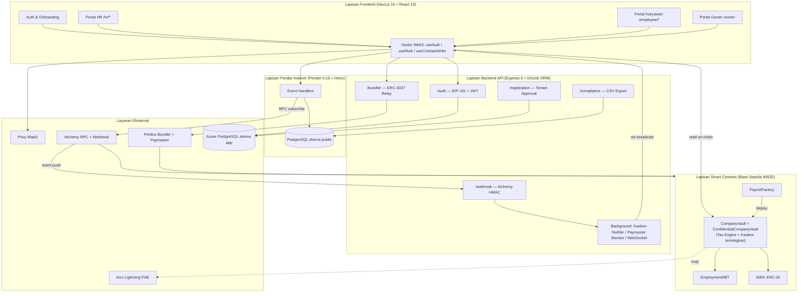

**Narasi Alur EWA Gasless End-to-End.** Ketika seorang karyawan menekan tombol "Tarik Gaji", frontend memanggil hook `useAuth` untuk memastikan sesi JWT aktif (atau melakukan tanda tangan EIP-191 baru melalui embedded wallet Privy). Karyawan kemudian menandatangani sebuah `UserOperation` ERC-4337 yang berisi calldata `claimSalary()`. UserOperation tersebut dikirim ke endpoint `POST /bundler/relay`. Backend memeriksa batas laju klaim (maksimum 10 per jam per karyawan) lalu meneruskan UserOperation ke Pimlico Bundler tanpa decode calldata tambahan — enforcement otoritatif (kecocokan JWT/sender, selektor, dan target) berada di `CompanyVault._validatePaymasterUserOp()` on-chain yang dipanggil EntryPoint saat validasi (lihat KI-004 di `KNOWN_ISSUES.md`). Pimlico melampirkan sponsor Paymaster dan mengirimkannya ke `EntryPoint` contract di Base. Kontrak `CompanyVault.claimSalary()` mengeksekusi distribusi atomik (platform fee → cicilan kasbon jika ada → PPh21/BPJS → severance → sisa ke karyawan), memancarkan event `SalaryClaimed` dan `PlatformFeePaid`. Alchemy mendeteksi event tersebut dan mengirimkannya ke `POST /webhook/alchemy`; backend memverifikasi tanda tangan HMAC, mencatat audit log, dan mem-broadcast pesan `SALARY_CLAIMED` melalui WebSocket ke dashboard karyawan, yang langsung menampilkan konfirmasi real-time. Secara paralel, Ponder mengindeks event tersebut ke tabel `salary_claim` untuk keperluan historis dan pelaporan kepatuhan.

### 2.2 Perancangan Rinci

#### 2.2.1 Kelas Diagram

Berikut adalah diagram kelas seluruh smart contract Payana:

```mermaid
classDiagram
    direction TB

    %% ── Library ──────────────────────────────────────────────────────────────
    class PayrollMath {
        <<library>>
        +uint256 SECONDS_PER_MONTH
        +uint256 BPS_DENOMINATOR
        +calcAccrued(uint256 flowRate, uint256 elapsed) uint256
        +monthlyToFlowRate(uint256 monthly) uint256
        +bpsOf(uint256 amount, uint256 bps) uint256
        +severanceMultiplier(uint256 tenureMonths) uint256
        +validateSplits(uint16 emp, uint16 comp, uint16 sev) bool
    }

    %% ── Enumerations ─────────────────────────────────────────────────────────
    class VaultStatus {
        <<enumeration>>
        Uninitialized
        Active
        Paused
        Frozen
    }

    class StreamStatus {
        <<enumeration>>
        Inactive
        Active
        Paused
        Cancelled
    }

    class SeveranceState {
        <<enumeration>>
        Locked
        Returned
        Released
    }

    class VestType {
        <<enumeration>>
        Retention
        Probation
        ESOP
    }

    class VestStatus {
        <<enumeration>>
        Locked
        Claimed
        Forfeited
    }

    class LoanStatus {
        <<enumeration>>
        None
        Active
        Repaid
        Defaulted
    }

    %% ── PayrollFactory ───────────────────────────────────────────────────────
    class PayrollFactory {
        +bytes32 SUPERADMIN_ROLE
        +uint16 MAX_PLATFORM_FEE_BPS
        +address immutable IDRX
        +address protocolTreasury
        +uint16 platformFeeBps
        +mapping companyVaults
        +address[] allVaults
        +setPlatformFee(uint16 newFeeBps)
        +setProtocolTreasury(address treasury)
        +deployVault(address hr, string name, address liq, address sbt) address
        +emergencyFreezeAll()
        +getTotalVaults() uint256
    }

    %% ── CompanyVault ─────────────────────────────────────────────────────────
    class EmployeeStream {
        <<struct>>
        +uint256 flowRate
        +uint256 startTs
        +uint256 lastWithdrawnTs
        +uint256 settledBalance
        +StreamStatus status
        +uint16 severanceBps
    }

    class SalaryAdvance {
        <<struct>>
        +uint256 amount
        +uint256 repaid
        +uint256 requestedAt
        +AdvanceStatus status
    }

    class SeveranceVault {
        <<struct>>
        +uint256 amount
        +SeveranceState state
        +uint256 tenureMonths
        +uint256 lastUpdatedTs
    }

    class TerminationProposal {
        <<struct>>
        +address employee
        +bool hrApproved
        +bool legalApproved
        +uint256 expiresAt
        +bytes32 reasonHash
        +uint256 flowRateSnapshot
    }

    class CliffVest {
        <<struct>>
        +address employee
        +uint256 amount
        +uint256 cliffTs
        +VestType vestType
        +VestStatus status
    }

    class CompanyVault {
        +bytes32 HR_ROLE
        +bytes32 LEGAL_ROLE
        +uint256 TERMINATION_EXPIRY
        +uint256 MAX_ADVANCE_BPS
        +uint256 ADVANCE_REPAY_BPS
        +IERC20 immutable IDRX
        +address immutable hrAuthority
        +IEmploymentSBT sbtContract
        +address factory
        +string companyName
        +VaultStatus status
        +uint16 bpjsBps
        +uint16 pph21Bps
        +uint16 lowBalanceThresholdBps
        +uint256 vestCounter
        +uint256 totalFlowRate
        +uint256 vaultBalance
        +uint256 complianceBalance
        +mapping employeeStreams
        +mapping severanceVaults
        +mapping terminations
        +mapping cliffVests
        +mapping employeeComplianceAccumulated
        +mapping salaryAdvances
        +fundVault(uint256 amount)
        +withdrawVault(uint256 amount, address recipient)
        +setCompanyConfig(uint16 bpjs, uint16 pph21, uint16 threshold)
        +pauseVault()
        +resumeVault()
        +freezeVault()
        +startStream(address employee, uint256 flowRate, uint16 severanceSplitBps)
        +pauseStream(address employee)
        +resumeStream(address employee)
        +updateFlowRate(address employee, uint256 newFlowRate)
        +updateStreamSplits(address employee, uint16 severanceSplitBps)
        +cancelStream(address employee)
        +claimSalary()
        +requestAdvance(uint256 amount)
        +approveAdvance(address employee)
        +rejectAdvance(address employee)
        +resignEmployee(address employee)
        +proposeTermination(address employee, bytes32 reasonHash)
        +approveTermination(address employee)
        +executeTermination(address employee)
        +cancelProposal(address employee)
        +withdrawCompliance(uint256 amount, address recipient)
        +createCliffVest(address employee, uint256 amount, uint256 cliffTs, VestType vestType)
        +claimCliffVest(uint256 vestId)
        +cancelCliffVest(address employee, uint256 vestId)
        +getAccrued(address employee) uint256
        +getVaultBalance() uint256
        +getSeveranceBalance(address employee) uint256
        +getStreamInfo(address employee) address_uint256
        -_forfeitAllVests(address employee)
        -_checkLowBalance()
        -_revokeSBT(address employee)
    }

    %% ── ConfidentialCompanyVault ─────────────────────────────────────────────
    class ConfidentialCompanyVault {
        +mapping encryptedSalaries
        +mapping hasEncryptedSalary
        +mapping auditorExpiry
        +address[] _encryptedEmployeeList
        +mapping _inEncryptedList
        +setEncryptedSalary(address employee, bytes ciphertext) payable
        +getEncryptedSalary(address employee) euint256
        +aggregateTotalPayroll() euint256
        +grantViewingKey(address auditor, uint256 expiresAt)
        +isAuditorActive(address auditor) bool
        +revokeAuditorAccess(address auditor)
        +encryptedEmployeeCount() uint256
        +encryptedEmployeeAt(uint256 index) address
    }

    %% ── EmploymentSBT ────────────────────────────────────────────────────────
    class EmploymentRecord {
        <<struct>>
        +address hrAuthority
        +string companyName
        +uint256 startTs
    }

    class EmploymentSBT {
        +bytes32 MINTER_ROLE
        -uint256 _tokenIdCounter
        -string _baseTokenURI
        +mapping employmentRecords
        +mapping employeeTokenId
        +mint(address to, string companyName, address hrAuthority) uint256
        +revoke(address employee)
        +locked(uint256 tokenId) bool
        +setBaseURI(string uri)
        +supportsInterface(bytes4 interfaceId) bool
        -_update(address to, uint256 tokenId, address auth) address
        -_baseURI() string
    }

    %% ── Inheritance ──────────────────────────────────────────────────────────
    CompanyVault --|> ICompanyVault : implements
    CompanyVault --|> ReentrancyGuard : extends
    CompanyVault --|> AccessControl : extends
    ConfidentialCompanyVault --|> CompanyVault : extends
    EmploymentSBT --|> ERC721 : extends
    EmploymentSBT --|> IERC5192 : implements
    EmploymentSBT --|> AccessControl : extends
    PayrollFactory --|> AccessControl : extends

    %% ── Composition (structs owned by contract) ──────────────────────────────
    CompanyVault *-- EmployeeStream : contains
    CompanyVault *-- SeveranceVault : contains
    CompanyVault *-- TerminationProposal : contains
    CompanyVault *-- CliffVest : contains
    CompanyVault *-- SalaryAdvance : contains
    EmploymentSBT *-- EmploymentRecord : contains

    %% ── Associations (contract references) ──────────────────────────────────
    PayrollFactory ..> CompanyVault : deploys
    CompanyVault ..> EmploymentSBT : calls mint and revoke
    CompanyVault ..> PayrollMath : uses

    %% ── Enum usage ───────────────────────────────────────────────────────────
    CompanyVault ..> VaultStatus : uses
    CompanyVault ..> StreamStatus : uses
    CompanyVault ..> SeveranceState : uses
    CompanyVault ..> VestType : uses
    CompanyVault ..> VestStatus : uses
    CompanyVault ..> AdvanceStatus : uses
```


#### 2.2.2 Deskripsi Kelas dan Atribut


Seluruh kontrak dikompilasi dengan Solidity 0.8.26 dan OpenZeppelin Contracts v5. Seluruh nilai moneter dinyatakan dalam IDRX (18 desimal, 1 IDRX = 1 IDR). Pustaka `PayrollMath` menyediakan konstanta `SECONDS_PER_MONTH`, fungsi `calcAccrued(flowRate, lastTs)`, `bpsOf(amount, bps)`, `validateSplits(...)`, dan `severanceMultiplier(tenureMonths)`.

Pola keamanan yang diterapkan secara konsisten:

- **Checks-Effects-Interactions (CEI):** seluruh perubahan state dilakukan sebelum transfer eksternal.
- **ReentrancyGuard:** modifier `nonReentrant` pada fungsi yang mentransfer IDRX.
- **AccessControl berbasis peran:** modifier per peran (`onlyHR`, `onlyOps`, `onlyPayroll`, `onlyRole`).
- **SafeERC20:** `safeTransfer`/`safeTransferFrom` untuk seluruh perpindahan token.
- **Custom errors:** revert hemat gas dengan pesan terstruktur.

##### 2.2.2.1 PayrollFactory

Kontrak entry-point SaaS yang men-deploy `CompanyVault` terisolasi per tenant (Factory Pattern). Mewarisi `AccessControl`.

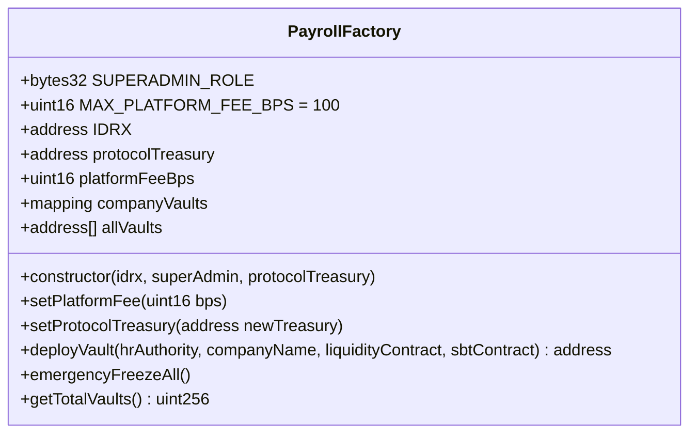

**State Variables:** `IDRX` (immutable), `protocolTreasury`, `platformFeeBps`, `companyVaults` (HR → vault), `allVaults` (array seluruh vault).

**Events:** `VaultDeployed(hrAuthority, vaultAddress, companyName)`, `PlatformFeeUpdated(newBps)`, `ProtocolTreasuryUpdated(newTreasury)`.

**[deployVault(hrAuthority, companyName, liquidityContract, sbtContract)]**
| | |
|---|---|
| Input | hrAuthority: address, companyName: string, liquidityContract: address, sbtContract: address |
| Output | `address` (alamat vault baru) |
| Deskripsi | external; modifier `onlyRole(SUPERADMIN_ROLE)`; sesuai FR-PAYANA-201, FR-PAYANA-1001 |

**Algoritma (Check → Effect → Interaction):**

1. **Check:** tolak `hrAuthority == address(0)` (`InvalidHRAddress`); tolak jika `companyVaults[hrAuthority] != 0` (`HRAlreadyHasVault`).
2. **Effect/Interaction:** deploy `new CompanyVault(IDRX, hrAuthority, companyName, liquidityContract, sbtContract)`.
3. **Effect:** catat alamat ke `companyVaults[hrAuthority]` dan `allVaults.push(vault)`.
4. **Effect:** emit `VaultDeployed(hrAuthority, vault, companyName)`; kembalikan alamat vault.

**[setPlatformFee(bps)]**
| | |
|---|---|
| Input | newFeeBps: uint16 |
| Output | - |
| Deskripsi | external; modifier `onlyRole(SUPERADMIN_ROLE)`; sesuai FR-PAYANA-1006 |

**Algoritma:** Check `bps <= MAX_PLATFORM_FEE_BPS (100)` (`FeeTooHigh`); set `platformFeeBps = bps`; emit `PlatformFeeUpdated`.

**[setProtocolTreasury(newTreasury)]**
| | |
|---|---|
| Input | newTreasury: address |
| Output | - |
| Deskripsi | external; modifier `onlyRole(SUPERADMIN_ROLE)`; sesuai FR-PAYANA-1008 |

**Algoritma:** Check `newTreasury != address(0)`; set `protocolTreasury`; emit `ProtocolTreasuryUpdated`. Memungkinkan migrasi ke multisig.

**[emergencyFreezeAll()]**
| | |
|---|---|
| Input | - |
| Output | - |
| Deskripsi | external; modifier `onlyRole(SUPERADMIN_ROLE)`; sesuai FR-PAYANA-1004 |

**Algoritma:** Iterasi `allVaults`; untuk setiap vault panggil `freezeVault()`. Biaya gas linear terhadap jumlah vault.

**[getTotalVaults()]**
| | |
|---|---|
| Input | - |
| Output | `uint256` |
| Deskripsi | external view; sesuai FR-PAYANA-1002 |

**Algoritma:** Kembalikan `allVaults.length`.

##### 2.2.2.2 CompanyVault

Kontrak payroll per perusahaan: streaming gaji, split 93/5/2, PHK multi-sig, cliff vesting, dan kepatuhan. Mewarisi `ICompanyVault`, `ReentrancyGuard`, `AccessControl`.

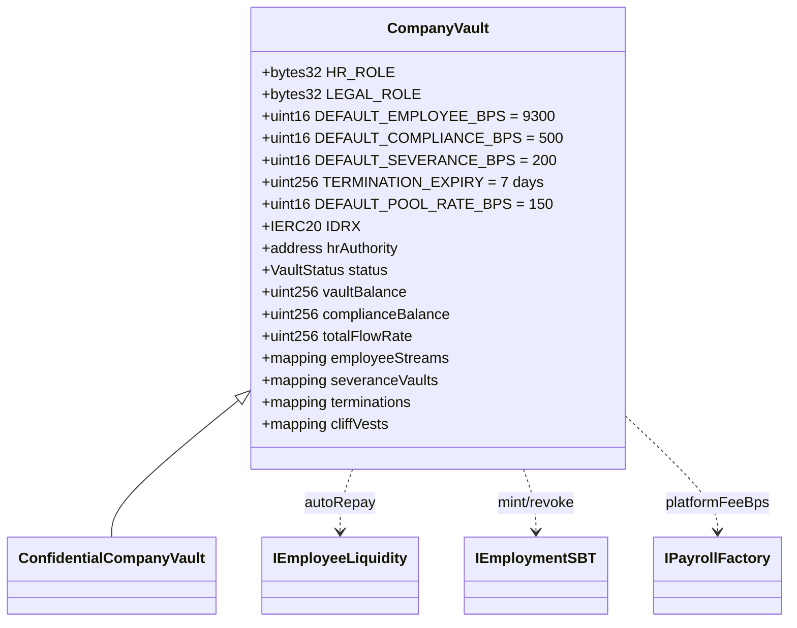

**Konstanta:** `DEFAULT_EMPLOYEE_BPS=9300`, `DEFAULT_COMPLIANCE_BPS=500`, `DEFAULT_SEVERANCE_BPS=200`, `TERMINATION_EXPIRY=7 days`, `DEFAULT_POOL_RATE_BPS=150`.

**Custom Errors:** `VaultFrozen`, `InsufficientVaultBalance`, `StreamAlreadyActive`, `StreamNotActive`, `NotWhitelisted`, `NothingToClaim`, `SplitInvalid`, `TerminationAlreadyProposed`, `TerminationNotFound`, `ProposalExpired`, `AlreadyApproved`, `NotVestedYet`, `AlreadyClaimed`, `VestNotFound`, `SeveranceAlreadySettled`, `InsufficientComplianceBalance`, `CliffNotReached`, `VestAlreadySettled`, `Unauthorized`, `NoActiveProposal`.

**Modifier:** `onlyHR` (cek `HR_ROLE`), `vaultActive` (status harus `Active`), `validTermination(employee)` (hrApproved && legalApproved && belum kadaluarsa).

**[constructor(idrx, hrAuthority, companyName, sbtContract, entryPoint)]**
| | |
|---|---|
| Input | idrx: address, hrAuthority: address, companyName: string, sbtContract: address, entryPoint: address |
| Output | - |
| Deskripsi | internal; dipanggil oleh `PayrollFactory.deployVault()` untuk inisialisasi vault baru |

Algoritma: Disetel oleh `PayrollFactory`. Set `IDRX`, `factory=msg.sender`, `hrAuthority`, `companyName`, `status=Active`, `sbtContract`. Berikan `DEFAULT_ADMIN_ROLE`, `HR_ROLE`, dan `LEGAL_ROLE` ke `hrAuthority`. Emit `VaultInitialized`.

**[fundVault(amount)]**
| | |
|---|---|
| Input | amount: uint256 |
| Output | - |
| Deskripsi | external override; modifier `onlyHR`; sesuai FR-PAYANA-202 |

**Algoritma:** `safeTransferFrom(msg.sender, this, amount)`; `vaultBalance += amount`; emit `VaultFunded`.

**[withdrawVault(amount, recipient)]**
| | |
|---|---|
| Input | amount: uint256, recipient: address |
| Output | - |
| Deskripsi | external override; modifier `onlyHR nonReentrant`; sesuai FR-PAYANA-203 |

**Algoritma (CEI):**

1. **Check:** `vaultBalance >= amount` (`InsufficientVaultBalance`).
2. **Effect:** `vaultBalance -= amount`; panggil `_checkLowBalance()`.
3. **Interaction:** `safeTransfer(recipient, amount)`; emit `VaultWithdrawn`.

**[setCompanyConfig(bpjsBps, pph21Bps, lowBalanceThresholdBps)]**
| | |
|---|---|
| Input | bpjsBps: uint16, pph21Bps: uint16, lowBalanceThresholdBps: uint16 |
| Output | - |
| Deskripsi | external override; modifier `onlyHR`; sesuai FR-PAYANA-204, FR-PAYANA-802 |

**Algoritma:** Set `bpjsBps`, `pph21Bps`, `lowBalanceThresholdBps`. Nilai BPJS/PPh21 bersifat informatif (tidak memengaruhi split langsung).

**[pauseVault() / resumeVault() / freezeVault()]**
| | |
|---|---|
| Input | - |
| Output | - |
| Deskripsi | external override; modifier `pauseVault`/`resumeVault`: `onlyHR`; `freezeVault`: factory atau `DEFAULT_ADMIN_ROLE`; sesuai FR-PAYANA-205, FR-PAYANA-206 |

**Algoritma:**

- `pauseVault`: tolak jika `status == Frozen`; set `status = Paused`; emit `VaultPaused`.
- `resumeVault`: tolak jika `status == Frozen`; set `status = Active`; emit `VaultResumed`.
- `freezeVault`: hanya `factory` atau pemegang `DEFAULT_ADMIN_ROLE` (`Unauthorized`); set `status = Frozen` (irreversible); emit `VaultFreeze`.

**[startStream(employee, flowRate, employeeSplitBps, complianceSplitBps, severanceSplitBps)]**
| | |
|---|---|
| Input | employee: address, flowRate: uint256, employeeSplitBps: uint16, complianceSplitBps: uint16, severanceSplitBps: uint16 |
| Output | - |
| Deskripsi | external override; modifier `onlyHR vaultActive`; sesuai FR-PAYANA-301, FR-PAYANA-901 |

**Alur Interaksi:**

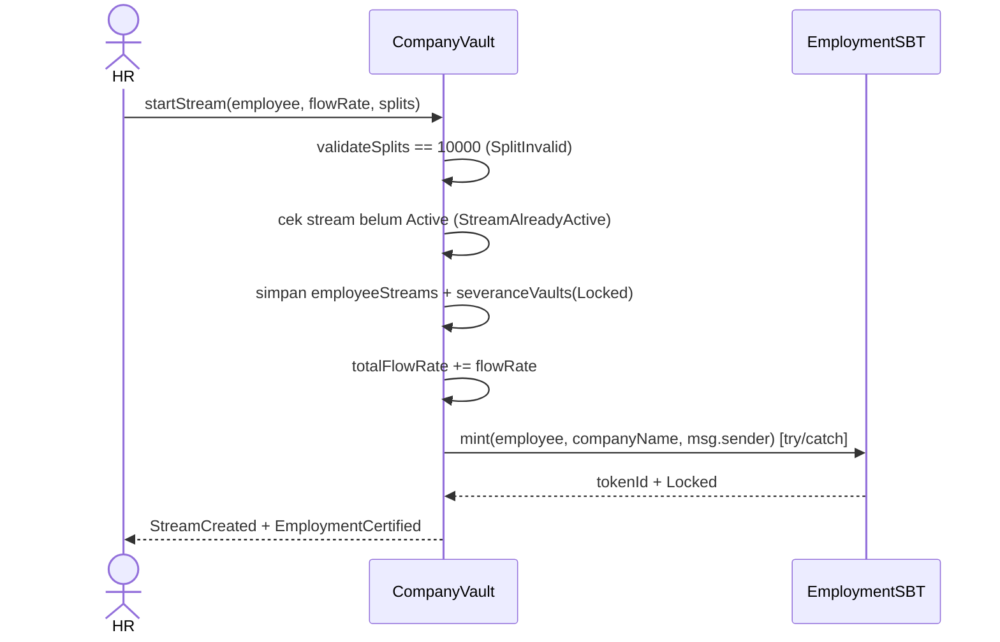

**Algoritma:**

1. **Check:** `PayrollMath.validateSplits(...)` harus total 10.000 bps (`SplitInvalid`); stream belum `Active` (`StreamAlreadyActive`).
2. **Effect:** buat `EmployeeStream` (status `Active`, `startTs/lastWithdrawnTs = now`, `settledBalance=0`, splits); buat `SeveranceVault` (`Locked`); `totalFlowRate += flowRate`.
3. **Effect:** emit `StreamCreated`.
4. **Interaction:** `sbtContract.mint(employee, companyName, msg.sender)` (try/catch); emit `EmploymentCertified` jika berhasil.

**[pauseStream / resumeStream / updateFlowRate / updateStreamSplits / cancelStream]**
| | |
|---|---|
| Input | employee: address (+ parameter tambahan sesuai fungsi) |
| Output | - |
| Deskripsi | external override; modifier `onlyHR`; sesuai FR-PAYANA-302 s.d. FR-PAYANA-306 |

**Algoritma:**

- `pauseStream(employee)`: stream harus `Active` (`StreamNotActive`); settle `settledBalance += calcAccrued(flowRate, lastWithdrawnTs)`; `lastWithdrawnTs = now`; set `Paused`; emit `StreamPaused`.
- `resumeStream(employee)`: stream harus `Paused`; `lastWithdrawnTs = now`; set `Active`; emit `StreamResumed`.
- `updateFlowRate(employee, newFlowRate)`: stream harus `Active`; settle dahulu pada rate lama; `totalFlowRate = totalFlowRate - old + new`; set `flowRate = newFlowRate`; emit `FlowRateUpdated`.
- `updateStreamSplits(employee, ...)`: stream `Active`/`Paused`; validasi split = 10.000; settle jika `Active`; set splits baru; emit `StreamSplitsUpdated`.
- `cancelStream(employee)`: tolak jika sudah `Cancelled`/`Inactive`; jika `Active` settle dan kurangi `totalFlowRate`; set `Cancelled`; emit `StreamCancelled`.

**[claimSalary()]**
| | |
|---|---|
| Input | - |
| Output | - |
| Deskripsi | external override; modifier `nonReentrant vaultActive`; sesuai FR-PAYANA-401, FR-PAYANA-1007 |

**Alur Interaksi:**

```mermaid
sequenceDiagram
    actor E as Karyawan
    participant V as CompanyVault
    participant F as PayrollFactory
    participant T as protocolTreasury
    E->>V: claimSalary()
    V->>V: hitung accrued (settled + live)
    V->>V: cek accrued>0 & vaultBalance>=accrued
    V->>V: Effects: settledBalance=0, vaultBalance-=accrued, _checkLowBalance()
    V->>F: platformFeeBps()
    F-->>V: feeBps
    V->>V: net = accrued - platformCut
    V->>V: kasbonRepaid = _autoRepayAdvance(employee, net); net -= kasbonRepaid
    V->>V: hitung PPh21 (TER/override) + BPJS -> toCompliance; toSeverance = bpsOf(net, severanceBps)
    V->>V: toEmployee = net - toCompliance - toSeverance
    V->>T: safeTransfer(platformCut) + PlatformFeePaid
    V->>E: safeTransfer(toEmployee)
    V-->>E: SalaryClaimed(..., kasbonRepaid)
    V-->>E: TaxWithheld(pph21Amount, bpjsAmount)
```

**Algoritma (CEI):**

1. **Check:** stream tidak `Inactive` (`NotWhitelisted`) dan tidak `Paused` (`StreamNotActive`).
2. **Check:** hitung `accrued = settledBalance + calcAccrued(flowRate, lastWithdrawnTs)` (atau hanya `settledBalance` bila tidak aktif); tolak `accrued == 0` (`NothingToClaim`) dan `vaultBalance < accrued` (`InsufficientVaultBalance`).
3. **Effect:** `settledBalance = 0`; perbarui `lastWithdrawnTs` jika aktif; `vaultBalance -= accrued`; `_checkLowBalance()`.
4. **Effect:** hitung `platformCut = bpsOf(accrued, feeBps)` jika `feeBps > 0`; `net = accrued - platformCut`.
5. **Effect:** `kasbonRepaid = _autoRepayAdvance(msg.sender, net)` — memotong `min(20% net, sisa kasbon)` jika kasbon berstatus `Active`; `net -= kasbonRepaid`; `vaultBalance += kasbonRepaid` (dana kembali ke pool payroll).
6. **Effect:** `effectivePph21Bps = pph21Bps > 0 ? pph21Bps : PayrollMath.calcPPh21TerBps(annualGross)`; `toCompliance = bpsOf(net, effectivePph21Bps + bpjsBps)`; `toSeverance = bpsOf(net, severanceBps)`; `toEmployee = net - toCompliance - toSeverance` (dust ke karyawan).
7. **Effect:** tambah `complianceBalance` dan `employeeComplianceAccumulated`; tambah `severanceVaults.amount`; perbarui `tenureMonths = (now - startTs)/SECONDS_PER_MONTH`.
8. **Interaction:** `safeTransfer(platformCut)` ke treasury (+`PlatformFeePaid`), `safeTransfer(toEmployee)` ke karyawan; emit `SalaryClaimed(..., kasbonRepaid)` dan `TaxWithheld(pph21Amount, bpjsAmount)`.

**[resignEmployee(employee)]**
| | |
|---|---|
| Input | employee: address |
| Output | - |
| Deskripsi | external override; modifier `onlyHR nonReentrant`; sesuai FR-PAYANA-505 |

**Algoritma:**

1. **Check:** stream tidak `Inactive` (`NotWhitelisted`); severance harus `Locked` (`SeveranceAlreadySettled`).
2. **Effect:** settle stream jika `Active`, kurangi `totalFlowRate`, set `Cancelled`.
3. **Effect:** pesangon dikembalikan ke `vaultBalance` (bukan ke karyawan); set state `Returned`.
4. **Interaction:** `_forfeitAllVests(employee)`; `_revokeSBT(employee)`; emit `StreamCancelled` + `SeveranceReturned`.

**[proposeTermination(employee, reasonHash)]**
| | |
|---|---|
| Input | employee: address, reasonHash: bytes32 |
| Output | - |
| Deskripsi | external override; modifier `onlyHR`; sesuai FR-PAYANA-501 |

**Algoritma:**

1. **Check:** stream tidak `Inactive` (`NotWhitelisted`); tidak ada proposal aktif yang belum kadaluarsa (`TerminationAlreadyProposed`).
2. **Effect:** buat `TerminationProposal` (`hrApproved=true`, `legalApproved=false`, `expiresAt=now+7 days`, `reasonHash`, `flowRateSnapshot=flowRate`); emit `TerminationProposed`.

**[approveTermination(employee)]**
| | |
|---|---|
| Input | employee: address |
| Output | - |
| Deskripsi | external override; modifier — (cek peran internal); sesuai FR-PAYANA-502 |

**Algoritma:**

1. **Check:** proposal ada (`TerminationNotFound`) dan belum kadaluarsa (`ProposalExpired`).
2. **Effect:** jika pemanggil `HR_ROLE` set `hrApproved` (tolak ganda `AlreadyApproved`); jika `LEGAL_ROLE` set `legalApproved`; selain itu `Unauthorized`; emit `TerminationApproved`.

**[executeTermination(employee)]**
| | |
|---|---|
| Input | employee: address |
| Output | - |
| Deskripsi | external override; modifier `validTermination(employee) nonReentrant`; sesuai FR-PAYANA-503, FR-PAYANA-504, FR-PAYANA-506 |

**Alur Interaksi:**

```mermaid
sequenceDiagram
    actor HR
    participant V as CompanyVault
    participant SBT as EmploymentSBT
    participant E as Karyawan
    HR->>V: executeTermination(employee)
    V->>V: validTermination (hr & legal approved, belum kadaluarsa)
    V->>V: settle stream + totalFlowRate -= flowRate; status Cancelled
    V->>V: statutory = severanceMultiplier(tenureMonths) * (snapshot * SECONDS_PER_MONTH)
    alt accumulated < statutory
        V->>V: topUp dari vaultBalance (atau parsial + SeveranceShortfall)
    end
    V->>V: amount = accumulated + topUp; state Released
    V->>V: _forfeitAllVests + delete proposal
    V->>SBT: revoke(employee) [try/catch]
    V->>E: safeTransfer(amount)
    V-->>HR: SeveranceReleased + TerminationExecuted
```

**Algoritma (CEI):**

1. **Check:** modifier `validTermination` memastikan kedua persetujuan dan belum kadaluarsa.
2. **Effect:** settle stream jika `Active`, kurangi `totalFlowRate`, set `Cancelled`.
3. **Effect:** hitung `monthlyGross = flowRateSnapshot * SECONDS_PER_MONTH`; `statutory = severanceMultiplier(tenureMonths) * monthlyGross`.
4. **Effect:** jika `accumulated < statutory`, ambil `topUp` dari `vaultBalance`; jika tidak cukup, `topUp = vaultBalance` (parsial, `hasShortfall=true`); `vaultBalance -= topUp`.
5. **Effect:** `amount = accumulated + topUp`; set `state = Released`; `_forfeitAllVests(employee)`; `_revokeSBT(employee)`; `delete terminations[employee]`.
6. **Interaction:** `safeTransfer(employee, amount)`; emit `StreamCancelled`, `SeveranceReleased`, `SeveranceShortfall` (jika ada), `TerminationExecuted`.

**[cancelProposal(employee)]**
| | |
|---|---|
| Input | employee: address |
| Output | - |
| Deskripsi | external override; modifier `onlyHR`; sesuai FR-PAYANA-501 |

**Algoritma:** Check proposal masih aktif (hrApproved && !legalApproved && belum kadaluarsa) (`NoActiveProposal`); `delete terminations[employee]`; emit `TerminationCancelled`.

**[withdrawCompliance(amount, recipient)]**
| | |
|---|---|
| Input | amount: uint256, recipient: address |
| Output | - |
| Deskripsi | external override; modifier `onlyHR nonReentrant`; sesuai FR-PAYANA-803 |

**Algoritma (CEI):** Check `complianceBalance >= amount` (`InsufficientComplianceBalance`); `complianceBalance -= amount`; `safeTransfer(recipient, amount)`; emit `ComplianceWithdrawn`.

**[createCliffVest(employee, amount, cliffTs, vestType)]**
| | |
|---|---|
| Input | employee: address, amount: uint256, cliffTs: uint256, vestType: VestType |
| Output | - |
| Deskripsi | external override; modifier `onlyHR`; sesuai FR-PAYANA-601, FR-PAYANA-605 |

**Algoritma:**

1. **Check:** `cliffTs > now` (`"CliffInPast"`); `vaultBalance >= amount` (`InsufficientVaultBalance`).
2. **Effect:** `vestId = vestCounter++`; simpan `CliffVest` (`Locked`); `vaultBalance -= amount`; `_checkLowBalance()`; emit `CliffVestCreated`.

**[claimCliffVest(vestId)]**
| | |
|---|---|
| Input | vestId: uint256 |
| Output | - |
| Deskripsi | external override; modifier `nonReentrant`; sesuai FR-PAYANA-602 |

**Algoritma (CEI):**

1. **Check:** vest ada (`VestNotFound`); status `Locked` (`VestAlreadySettled`); `now >= cliffTs` (`CliffNotReached`).
2. **Effect:** `amount = vest.amount`; `vest.amount = 0`; `status = Claimed`.
3. **Interaction:** `safeTransfer(msg.sender, amount)`; emit `CliffVestClaimed`.

**[cancelCliffVest(employee, vestId)]**
| | |
|---|---|
| Input | employee: address, vestId: uint256 |
| Output | - |
| Deskripsi | external override; modifier `onlyHR`; sesuai FR-PAYANA-603 |

**Algoritma:** Check vest ada dan `Locked`; set `amount=0`, status `Forfeited`; `vaultBalance += amount`; emit `CliffVestForfeited`.

**Fungsi Internal**

- `_forfeitAllVests(employee)`: iterasi `0..vestCounter`; setiap vest `Locked` dengan `amount>0` di-forfeit dan dikembalikan ke `vaultBalance` (O(vestCounter)).
- `_checkLowBalance()`: no-op jika `totalFlowRate==0`; hitung `monthlyNeed = totalFlowRate * SECONDS_PER_MONTH` dan `threshold = bpsOf(monthlyNeed, lowBalanceThresholdBps)`; emit `LowVaultBalance` jika `vaultBalance < threshold`.
- `_revokeSBT(employee)`: jika ada `tokenId`, panggil `sbtContract.revoke(employee)` (try/catch); emit `EmploymentRevoked`.

**Fungsi View**

| Fungsi | Return | FR Terkait |
|--------|--------|-----------|
| `getAccrued(employee)` | saldo terakumulasi (settled + live) | FR-PAYANA-402 |
| `getVaultBalance()` | `vaultBalance` | FR-PAYANA-202 |
| `getSeveranceBalance(employee)` | `severanceVaults[employee].amount` | FR-PAYANA-506 |
| `getStreamInfo(employee)` | `(address(this), flowRate)` — dipakai frontend untuk hitung limit kasbon (80% gaji bulanan) | FR-PAYANA-704 |

##### 2.2.2.3 Mesin Pajak & Kasbon (terintegrasi di CompanyVault)

Sejak Gen8, `EmployeeLiquidityContract` (pool koperasi closed-loop) dihapus total dari kodebase. Fungsinya digantikan oleh dua kapabilitas baru yang terintegrasi langsung di `CompanyVault`: (1) perhitungan PPh21/BPJS otomatis saat `claimSalary()` (lihat 2.2.2.2), dan (2) fasilitas kasbon (`SalaryAdvance`) yang dananya bersumber langsung dari `vaultBalance` perusahaan — bukan pool lender pihak ketiga.

**Konstanta terkait:** `MAX_ADVANCE_BPS = 8000` (80% dari gaji bulanan), `ADVANCE_REPAY_BPS = 2000` (20% dari net setiap klaim).

**Custom Errors:** `AdvancePendingExists`, `ActiveAdvanceExists`, `NoAdvancePending`, `AdvanceAmountTooHigh`.

**[requestAdvance(amount)]**
| | |
|---|---|
| Input | amount: uint256 |
| Output | - |
| Deskripsi | external override; modifier `vaultActive`; sesuai FR-PAYANA-704 |

**Algoritma:**

1. **Check:** stream pemanggil `Active` (`StreamNotActive`); tidak ada `SalaryAdvance` berstatus `Pending` (`AdvancePendingExists`) atau `Active` (`ActiveAdvanceExists`).
2. **Check:** `monthlyGross = flowRate * SECONDS_PER_MONTH`; `maxAdvance = bpsOf(monthlyGross, MAX_ADVANCE_BPS)`; tolak jika `amount > maxAdvance` (`AdvanceAmountTooHigh`).
3. **Effect:** `salaryAdvances[msg.sender] = {amount, repaid: 0, requestedAt: now, status: Pending}`; emit `AdvanceRequested`.

**[approveAdvance(employee)]**
| | |
|---|---|
| Input | employee: address |
| Output | - |
| Deskripsi | external override; modifier `onlyHR nonReentrant`; sesuai FR-PAYANA-705 |

**Algoritma (CEI):**

1. **Check:** status `Pending` (`NoAdvancePending`); `vaultBalance >= adv.amount` (`InsufficientVaultBalance`).
2. **Effect:** status = `Active`; `vaultBalance -= adv.amount`; `_checkLowBalance()`.
3. **Interaction:** `safeTransfer(employee, adv.amount)`; emit `AdvanceApproved`.

**[rejectAdvance(employee)]**
| | |
|---|---|
| Input | employee: address |
| Output | - |
| Deskripsi | external override; modifier `onlyHR`; sesuai FR-PAYANA-705 |

**Algoritma:** Check status `Pending` (`NoAdvancePending`); `delete salaryAdvances[employee]`; emit `AdvanceRejected`.

**[_autoRepayAdvance(employee, available) — internal]**

Dipanggil dari dalam `claimSalary()` (lihat 2.2.2.2, langkah 5). Bukan fungsi publik.

**Algoritma:**

1. **Check:** jika status bukan `Active`, kembalikan 0.
2. **Effect:** `outstanding = adv.amount - adv.repaid`; `maxRepay = bpsOf(available, ADVANCE_REPAY_BPS)`; `repaid = min(outstanding, maxRepay)`; `adv.repaid += repaid`.
3. **Effect:** jika `adv.amount - adv.repaid == 0`, `delete salaryAdvances[employee]` (status implisit menjadi `Repaid`); emit `AdvanceRepaid(employee, repaid, remaining)`. Nilai `repaid` dikembalikan ke `claimSalary()` yang menambahkannya kembali ke `vaultBalance`.

**Catatan siklus hidup:** pada `resignEmployee()` dan `executeTermination()`, `salaryAdvances[employee]` dihapus tanpa penagihan lebih lanjut atas sisa kasbon (bad debt — trade-off desain MVP yang disengaja; pesangon yang telah terakumulasi tetap dapat diklaim penuh oleh karyawan, lihat FR-PAYANA-706).

##### 2.2.2.4 EmploymentSBT

Sertifikat ketenagakerjaan Soulbound (ERC-5192). Mewarisi `ERC721`, `IERC5192`, `AccessControl`. Nama token: "Finley Employment Certificate" (FEMP).

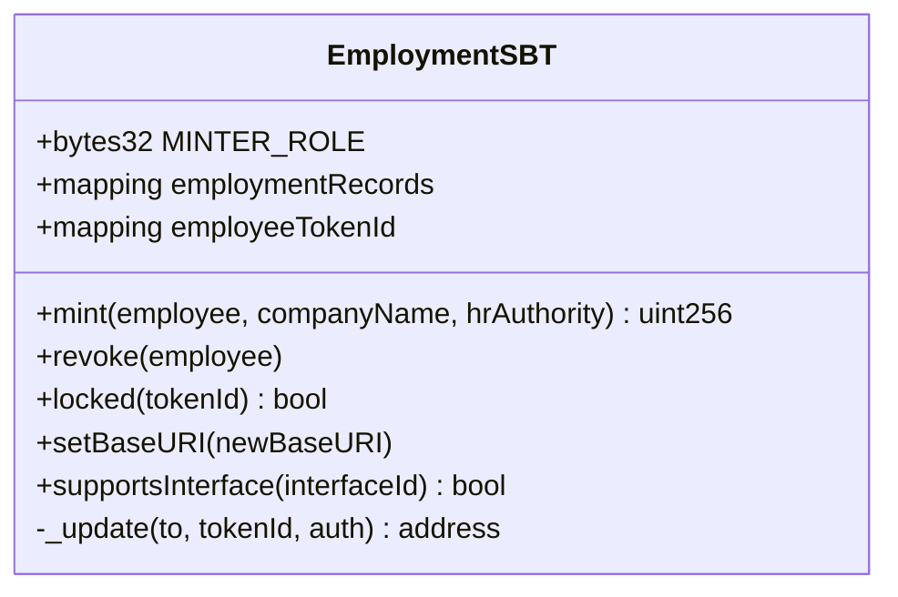

**Custom Errors:** `AlreadyHasToken(employee)`, `NoTokenFound(employee)`, `SoulboundTransferNotAllowed`.

**[mint(employee, companyName, hrAuthority)]**
| | |
|---|---|
| Input | employee: address, companyName: string, hrAuthority: address |
| Output | uint256 (tokenId) |
| Deskripsi | external; modifier `onlyRole(MINTER_ROLE)`; sesuai FR-901, FR-902 |

Algoritma: Tolak jika sudah punya token (`AlreadyHasToken`); tokenId monoton mulai 1; simpan `EmploymentRecord{hrAuthority, companyName, startTs}`; emit `Locked(tokenId)`; kembalikan tokenId.

**[revoke(employee)]**
| | |
|---|---|
| Input | employee: address |
| Output | - |
| Deskripsi | external; modifier `onlyRole(MINTER_ROLE)`; sesuai FR-903 |

Algoritma: Hapus `employeeTokenId` dan `employmentRecords`; burn token.

**[locked(tokenId)]**
| | |
|---|---|
| Input | tokenId: uint256 |
| Output | bool |
| Deskripsi | external view; sesuai FR-905 |

Algoritma: Selalu `true` (ERC-5192).

**[setBaseURI(newBaseURI)]**
| | |
|---|---|
| Input | newBaseURI: string |
| Output | - |
| Deskripsi | external; modifier `onlyRole(DEFAULT_ADMIN_ROLE)` |

Algoritma: Perbarui base URI metadata.

**[supportsInterface(interfaceId)]**
| | |
|---|---|
| Input | interfaceId: bytes4 |
| Output | bool |
| Deskripsi | public view; sesuai FR-905 |

Algoritma: Deklarasi dukungan `IERC5192`.

**[_update(to, tokenId, auth)] [internal]**
| | |
|---|---|
| Input | to: address, tokenId: uint256, auth: address |
| Output | address |
| Deskripsi | internal override; sesuai FR-905 |

Algoritma: Blokir transfer P2P (`SoulboundTransferNotAllowed`); hanya mint (from=0) dan burn (to=0) diizinkan.

> **Catatan:** Subbab IDRXPriceOracle (sebelumnya 2.2.2.5, FR-PAYANA-1201–1203/SKPL Kelompok L) telah dihapus pada Revisi G — kontrak dihapus total dari kodebase karena IDRX dirancang 1:1 terhadap Rupiah, sehingga price oracle tidak punya kasus penggunaan nyata.

##### 2.2.2.5 ConfidentialCompanyVault (Ekstensi FHE)

Ekstensi opsional `CompanyVault` yang menyimpan gaji sebagai ciphertext `euint256` Inco Lightning. Lapisan streaming tetap plaintext; hanya nominal gaji yang dienkripsi.

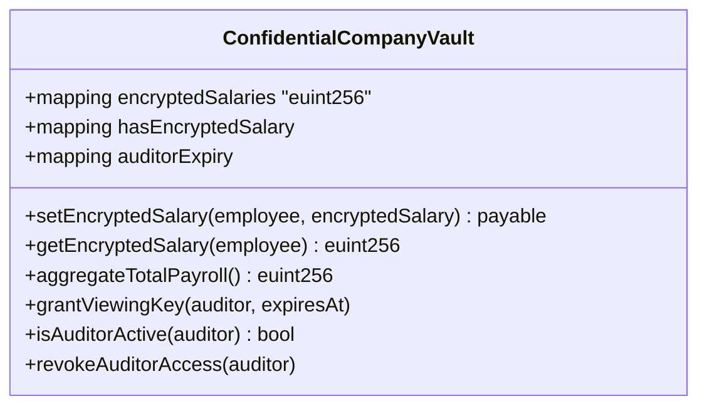

**[setEncryptedSalary(employee, ciphertext)]**
| | |
|---|---|
| Input | employee: address, ciphertext: bytes |
| Output | - |
| Deskripsi | external payable; modifier `onlyHR`; sesuai FR-1102 |

Algoritma: Bayar `inco.getFee()`; verifikasi input proof via `newEuint256(msg.sender)`; beri ACL ke contract/HR/karyawan; emit `EncryptedSalarySet` tanpa plaintext.

**[getEncryptedSalary(employee)]**
| | |
|---|---|
| Input | employee: address |
| Output | euint256 (handle ciphertext) |
| Deskripsi | external view; sesuai FR-1103 |

Algoritma: Hanya karyawan sendiri atau HR; kembalikan handle ciphertext untuk dekripsi client-side.

**[aggregateTotalPayroll()]**
| | |
|---|---|
| Input | - |
| Output | euint256 |
| Deskripsi | external; sesuai FR-1104 |

Algoritma: Penjumlahan homomorfik O(n) via `.add()`; ACL hasil ke HR.

**[grantViewingKey(auditor, expiresAt)]**
| | |
|---|---|
| Input | auditor: address, expiresAt: uint256 |
| Output | - |
| Deskripsi | external; modifier `onlyHR`; sesuai FR-1105 |

Algoritma: Beri ACL Inco ke auditor dengan batas waktu Solidity-level (`auditorExpiry`).

**[isAuditorActive(auditor)]**
| | |
|---|---|
| Input | auditor: address |
| Output | bool |
| Deskripsi | external view; sesuai FR-1105 |

Algoritma: `now < auditorExpiry[auditor]`.

**[revokeAuditorAccess(auditor)]**
| | |
|---|---|
| Input | auditor: address |
| Output | - |
| Deskripsi | external; modifier `onlyHR`; sesuai FR-1105 |

Algoritma: Set `auditorExpiry[auditor]=0`.

---


### 2.3 Perancangan Data

#### 2.3.1 Dekomposisi Data


Data dalam sistem Payana didistribusikan ke dalam tiga lapisan penyimpanan yang saling melengkapi:

1. **On-Chain (Solidity storage di Base Sepolia).** Menyimpan seluruh state finansial dan logika bisnis inti: saldo vault, konfigurasi stream per karyawan (`employeeStreams`), vault pesangon (`severanceVaults`), proposal PHK (`terminations`), cliff vest (`cliffVests`), kasbon (`salaryAdvances`), serta gaji terenkripsi (`encryptedSalaries`). State on-chain bersifat immutable dan menjadi sumber kebenaran (source of truth) untuk semua nilai moneter.

2. **Off-Chain PostgreSQL (skema `app`, Azure Indonesia Central).** Menyimpan data yang tidak boleh atau tidak efisien disimpan on-chain: sesi JWT (`sessions`), profil PII karyawan terenkripsi AES-256-GCM (`employees`), audit log backend (`audit_logs`), deduplikasi event webhook (`webhook_events`), counter rate limit (`rate_limits`), catatan kasbon sisi backend (`salary_advances`), dan antrian registrasi tenant (`pending_registrations`). Penyimpanan PII off-chain merupakan pemenuhan UU PDP No. 27/2022.

3. **Ponder Indexed PostgreSQL (skema `public`).** Menyimpan salinan terindeks dari event on-chain dalam bentuk tabel relasional yang dapat dikueri cepat: `company`, `employee_stream`, `salary_claim`, `severance_vault`, `termination_proposal`, `cliff_vest`, `compliance_vault`, `salary_advance`, `employment_certificate`, `platform_fee_payment`, `encrypted_salary`, `auditor_grant`, dan `low_balance_alert`. Lapisan ini menghindarkan frontend dan backend dari kebutuhan iterasi RPC langsung untuk pembacaan agregat.

##### ERD On-Chain (Solidity Structs & Mappings)

State on-chain disimpan dalam struct dan mapping pada masing-masing kontrak. Diagram berikut menggambarkan relasi konseptual antar entitas on-chain (kunci pemetaan adalah alamat Ethereum).

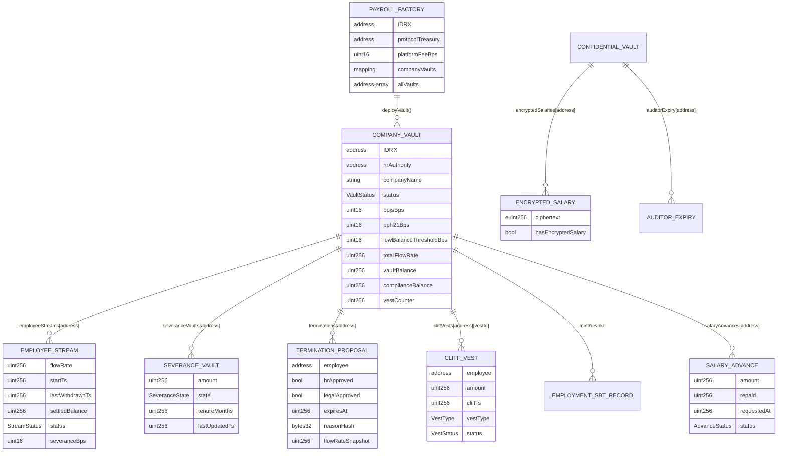

**Catatan Enumerasi On-Chain:**

- `VaultStatus`: Uninitialized, Active, Paused, Frozen.
- `StreamStatus`: Inactive, Active, Paused, Cancelled.
- `SeveranceState`: Locked, Returned, Released.
- `VestType`: Retention, Probation, ESOP.
- `VestStatus`: Locked, Claimed, Forfeited.
- `AdvanceStatus`: None, Pending, Active. Tidak ada nilai enum terpisah untuk "Rejected"/"Repaid" — `rejectAdvance()` dan pelunasan penuh via `_autoRepayAdvance()` sama-sama melakukan `delete salaryAdvances[employee]`, yang mengembalikan status ke `None` secara on-chain. Status "Rejected"/"Repaid" yang ditampilkan di UI berasal dari riwayat event (`AdvanceRejected`/`AdvanceRepaid`) yang diindeks off-chain oleh Ponder, bukan dari pembacaan langsung state kontrak saat ini.

##### ERD Off-Chain (PostgreSQL — skema `app`)

Tabel off-chain dikelola Drizzle ORM dalam skema `app`. Tabel-tabel ini independen (tidak ada foreign key relasional formal antar tabel; keterhubungan logis melalui kolom `address`).

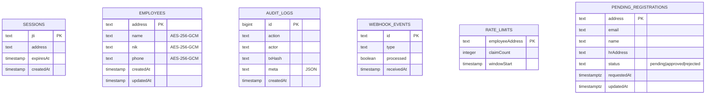

**Rincian Tabel Off-Chain:**

| Tabel | Kolom Kunci | Tujuan | FR Terkait |
|-------|-------------|--------|-----------|
| `sessions` | `jti` (PK) | Revocation JWT berbasis JTI | FR-102, 103 |
| `employees` | `address` (PK) | Penyimpanan PII terenkripsi | FR-104, 105 |
| `audit_logs` | `id` (PK, identity) | Audit trail backend immutable | FR-1002 |
| `webhook_events` | `id` (PK) | Deduplikasi event Alchemy | FR-405 |
| `rate_limits` | `employeeAddress` (PK) | Counter klaim per jam | FR-404 |
| `pending_registrations` | `address` (PK) | Antrian persetujuan tenant | FR-107, 108, 109 |

##### ERD Ponder Indexed (PostgreSQL — skema `public`)

Tabel terindeks Ponder direpresentasikan dengan `onchainTable`. Kolom yang dipakai langsung oleh SQL backend (mis. `salary_claim`) di-pin secara eksplisit ke snake_case agar kompatibel dengan kueri SQL mentah pada backend compliance dan liquidation.

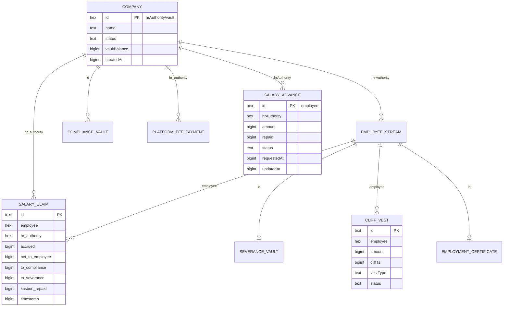

**Rincian Tabel Ponder Indexed:**

| Tabel | Kunci | Sumber Event | Dipakai oleh |
|-------|-------|--------------|--------------|
| `company` | `id` (vault/HR) | `VaultDeployed`, `VaultInitialized` | `useRole`, `/owner`, `/hr/onboarding` |
| `employee_stream` | `employee` | `StreamCreated`, `FlowRate/Splits/Status` | `/hr/employees`, `/employee/ewa` |
| `salary_claim` | `id` | `SalaryClaimed` | `/compliance/*`, `/employee/audit` |
| `severance_vault` | `id` | `SeveranceReleased/Returned` | `/employee/severance` |
| `cliff_vest` | `id` | `CliffVestCreated/Claimed/Forfeited` | `/hr/vesting`, `/employee/vesting` |
| `salary_advance` | `employee` | `AdvanceRequested/Approved/Rejected/Repaid` | `/hr/kasbon`, `/employee/kasbon` |
| `platform_fee_payment` | `id` | `PlatformFeePaid` | `/owner` |
| `employment_certificate` | `id` | `EmploymentCertified/Revoked` | `/verify` |
| `encrypted_salary` | `employee` | `EncryptedSalarySet` | portal FHE |
| `low_balance_alert` | `id` | `LowVaultBalance` | `/hr/vault` |

---

##### Dekomposisi Data — Off-Chain (Skema `app`)

Tabel-tabel berikut adalah bagian dari skema PostgreSQL `app` yang dikelola oleh Drizzle ORM. Semua data PII dienkripsi dengan AES-256-GCM sebelum disimpan.

**Tabel `sessions`**

| Nama Field | Tipe Data | Null | Konstrain | Range Nilai | Default | Keterangan |
|------------|-----------|------|-----------|-------------|---------|------------|
| `jti` | `text` | NOT NULL | PRIMARY KEY | UUID v4 | — | JWT unique identifier; digunakan untuk revokasi token |
| `address` | `text` | NOT NULL | — | Hex 0x + 40 char | — | Wallet address karyawan/HR (lowercase) |
| `expires_at` | `timestamp` | NOT NULL | — | > created_at | — | Waktu kedaluwarsa token JWT |
| `created_at` | `timestamp` | NOT NULL | — | — | `now()` | Waktu token dibuat |

**Tabel `employees`**

| Nama Field | Tipe Data | Null | Konstrain | Range Nilai | Default | Keterangan |
|------------|-----------|------|-----------|-------------|---------|------------|
| `address` | `text` | NOT NULL | PRIMARY KEY | Hex 0x + 40 char | — | Wallet address karyawan (lowercase) |
| `name` | `text` | NOT NULL | — | — | — | Nama lengkap, terenkripsi AES-256-GCM |
| `nik` | `text` | NOT NULL | — | 16 digit | — | Nomor Induk Kependudukan, terenkripsi AES-256-GCM |
| `phone` | `text` | NOT NULL | — | — | — | Nomor telepon, terenkripsi AES-256-GCM |
| `created_at` | `timestamp` | NOT NULL | — | — | `now()` | Waktu record dibuat |
| `updated_at` | `timestamp` | NOT NULL | — | — | `now()` | Waktu record terakhir diperbarui |

**Tabel `audit_logs`**

| Nama Field | Tipe Data | Null | Konstrain | Range Nilai | Default | Keterangan |
|------------|-----------|------|-----------|-------------|---------|------------|
| `id` | `bigint` | NOT NULL | PRIMARY KEY GENERATED ALWAYS AS IDENTITY | ≥ 1 | auto | Auto-increment log ID |
| `action` | `text` | NOT NULL | — | `BUNDLER_RELAY` \| `COMPLIANCE_EXPORT` \| dll. | — | Jenis aksi yang diaudit |
| `actor` | `text` | NOT NULL | — | Hex 0x + 40 char | — | Alamat wallet pelaku (HR atau karyawan) |
| `tx_hash` | `text` | NULL | — | Hex 0x + 64 char | `NULL` | Hash transaksi on-chain (null jika belum on-chain) |
| `meta` | `text` | NULL | — | JSON string | `NULL` | Konteks tambahan dalam format JSON |
| `created_at` | `timestamp` | NOT NULL | — | — | `now()` | Waktu log dicatat |

**Tabel `webhook_events`**

| Nama Field | Tipe Data | Null | Konstrain | Range Nilai | Default | Keterangan |
|------------|-----------|------|-----------|-------------|---------|------------|
| `id` | `text` | NOT NULL | PRIMARY KEY | — | — | Alchemy webhook event ID (digunakan untuk deduplikasi) |
| `type` | `text` | NOT NULL | — | — | — | Tipe event Alchemy (mis. `ADDRESS_ACTIVITY`) |
| `processed` | `boolean` | NOT NULL | — | `true` \| `false` | `false` | Flag apakah event sudah diproses |
| `received_at` | `timestamp` | NOT NULL | — | — | `now()` | Waktu event diterima backend |

**Tabel `rate_limits`**

| Nama Field | Tipe Data | Null | Konstrain | Range Nilai | Default | Keterangan |
|------------|-----------|------|-----------|-------------|---------|------------|
| `employee_address` | `text` | NOT NULL | PRIMARY KEY | Hex 0x + 40 char | — | Alamat karyawan (lowercase) |
| `claim_count` | `integer` | NOT NULL | — | ≥ 0 | `0` | Jumlah klaim dalam jendela aktif (maks 10 per jam) |
| `window_start` | `timestamp` | NOT NULL | — | — | `now()` | Waktu mulai jendela 1 jam saat ini |

**Tabel `pending_registrations`**

| Nama Field | Tipe Data | Null | Konstrain | Range Nilai | Default | Keterangan |
|------------|-----------|------|-----------|-------------|---------|------------|
| `address` | `text` | NOT NULL | PRIMARY KEY | Hex 0x + 40 char | — | Wallet address calon tenant HR (lowercase) |
| `email` | `text` | NULL | — | Format email | `NULL` | Alamat email kontak (opsional) |
| `name` | `text` | NULL | — | — | `NULL` | Nama tampilan dari form onboarding |
| `hr_address` | `text` | NULL | — | Hex 0x + 40 char | `NULL` | Alamat HR yang memproses registrasi |
| `status` | `text` | NOT NULL | — | `pending` \| `approved` \| `rejected` | `'pending'` | Status persetujuan registrasi |
| `requested_at` | `timestamptz` | NOT NULL | — | — | `now()` | Waktu pengajuan registrasi |
| `updated_at` | `timestamptz` | NOT NULL | — | — | `now()` | Waktu status terakhir diperbarui |

---

##### Dekomposisi Data — Ponder Indexed (Skema `public`)

Tabel-tabel berikut dikelola secara otomatis oleh Ponder 0.16 melalui `onchainTable` berdasarkan event yang diindeks dari Base Sepolia. Tipe `hex` merujuk pada string alamat Ethereum (0x + 40 char). Tipe `bigint` merujuk pada `BigInt` PostgreSQL untuk representasi nilai wei dan Unix timestamp.

**Tabel `company`**

| Nama Field | Tipe Data | Null | Konstrain | Range Nilai | Default | Keterangan |
|------------|-----------|------|-----------|-------------|---------|------------|
| `id` | `hex` | NOT NULL | PRIMARY KEY | Hex 0x + 40 char | — | Alamat `hrAuthority` / key unik per perusahaan |
| `name` | `text` | NOT NULL | — | — | — | Nama perusahaan yang didaftarkan saat deploy vault |
| `status` | `text` | NOT NULL | — | `Active` \| `Paused` \| `Frozen` | — | Status vault saat ini |
| `vault_balance` | `bigint` | NOT NULL | — | ≥ 0 | — | Saldo vault IDRX (wei) |
| `created_at` | `bigint` | NOT NULL | — | ≥ 0 | — | Unix timestamp saat vault di-deploy |

**Tabel `employee_stream`**

| Nama Field | Tipe Data | Null | Konstrain | Range Nilai | Default | Keterangan |
|------------|-----------|------|-----------|-------------|---------|------------|
| `id` | `hex` | NOT NULL | PRIMARY KEY | Hex 0x + 40 char | — | Alamat karyawan |
| `hr_authority` | `hex` | NOT NULL | — | Hex 0x + 40 char | — | Alamat HR / vault yang mengelola stream |
| `flow_rate` | `bigint` | NOT NULL | — | ≥ 0 | — | IDRX wei per detik yang mengalir ke karyawan |
| `start_ts` | `bigint` | NOT NULL | — | ≥ 0 | — | Unix timestamp saat stream dimulai |
| `status` | `text` | NOT NULL | — | `Active` \| `Paused` \| `Cancelled` | — | Status stream saat ini |
| `employee_bps` | `integer` | NOT NULL | — | 0–10000 | — | Porsi karyawan dalam basis poin |
| `compliance_bps` | `integer` | NOT NULL | — | 0–10000 | — | Porsi kepatuhan (BPJS/PPh21) dalam basis poin |
| `severance_bps` | `integer` | NOT NULL | — | 0–10000 | — | Porsi dana pesangon dalam basis poin |

**Tabel `salary_claim`**

| Nama Field | Tipe Data | Null | Konstrain | Range Nilai | Default | Keterangan |
|------------|-----------|------|-----------|-------------|---------|------------|
| `id` | `text` | NOT NULL | PRIMARY KEY | `${txHash}-${logIndex}` | — | ID unik klaim gaji per event log |
| `employee` | `hex` | NOT NULL | — | Hex 0x + 40 char | — | Alamat karyawan yang mengklaim |
| `hr_authority` | `hex` | NOT NULL | — | Hex 0x + 40 char | — | Alamat HR vault sumber |
| `accrued` | `bigint` | NOT NULL | — | ≥ 0 | — | Total IDRX wei yang terakrual pada klaim ini |
| `net_to_employee` | `bigint` | NOT NULL | — | ≥ 0 | — | IDRX wei yang dikirim ke wallet karyawan |
| `to_compliance` | `bigint` | NOT NULL | — | ≥ 0 | — | IDRX wei yang dialokasikan ke compliance vault |
| `to_severance` | `bigint` | NOT NULL | — | ≥ 0 | — | IDRX wei yang ditambahkan ke severance vault |
| `kasbon_repaid` | `bigint` | NOT NULL | — | ≥ 0 | `0` | IDRX wei yang dipotong sebagai cicilan kasbon pada klaim ini |
| `block_number` | `bigint` | NOT NULL | — | ≥ 0 | — | Nomor blok saat event ter-emit |
| `timestamp` | `bigint` | NOT NULL | — | ≥ 0 | — | Unix timestamp klaim |

**Tabel `severance_vault`**

| Nama Field | Tipe Data | Null | Konstrain | Range Nilai | Default | Keterangan |
|------------|-----------|------|-----------|-------------|---------|------------|
| `id` | `hex` | NOT NULL | PRIMARY KEY | Hex 0x + 40 char | — | Alamat karyawan |
| `hr_authority` | `hex` | NOT NULL | — | Hex 0x + 40 char | — | Alamat HR vault pemilik dana pesangon |
| `amount` | `bigint` | NOT NULL | — | ≥ 0 | — | Saldo pesangon IDRX wei |
| `state` | `text` | NOT NULL | — | `Locked` \| `Returned` \| `Released` | — | Status dana pesangon |
| `last_updated` | `bigint` | NOT NULL | — | ≥ 0 | — | Unix timestamp pembaruan terakhir |

**Tabel `termination_proposal`**

| Nama Field | Tipe Data | Null | Konstrain | Range Nilai | Default | Keterangan |
|------------|-----------|------|-----------|-------------|---------|------------|
| `id` | `hex` | NOT NULL | PRIMARY KEY | Hex 0x + 40 char | — | Alamat karyawan yang diusulkan PHK |
| `hr_authority` | `hex` | NOT NULL | — | Hex 0x + 40 char | — | Alamat HR pengusul |
| `hr_approved` | `boolean` | NOT NULL | — | `true` \| `false` | — | Status persetujuan HR |
| `legal_approved` | `boolean` | NOT NULL | — | `true` \| `false` | — | Status persetujuan Legal |
| `expires_at` | `bigint` | NOT NULL | — | > proposed_at | — | Unix timestamp kadaluarsa proposal (+ 7 hari) |
| `proposed_at` | `bigint` | NOT NULL | — | ≥ 0 | — | Unix timestamp pengajuan proposal |
| `executed_at` | `bigint` | NULL | — | > proposed_at | `NULL` | Unix timestamp eksekusi PHK (null jika belum) |
| `cancelled` | `boolean` | NOT NULL | — | `true` \| `false` | — | Flag apakah proposal dibatalkan |

**Tabel `cliff_vest`**

| Nama Field | Tipe Data | Null | Konstrain | Range Nilai | Default | Keterangan |
|------------|-----------|------|-----------|-------------|---------|------------|
| `id` | `text` | NOT NULL | PRIMARY KEY | `${employee}-${vestId}` | — | ID unik vest |
| `employee` | `hex` | NOT NULL | — | Hex 0x + 40 char | — | Alamat karyawan penerima |
| `hr_authority` | `hex` | NOT NULL | — | Hex 0x + 40 char | — | Alamat HR pembuat vest |
| `vest_id` | `bigint` | NOT NULL | — | ≥ 0 | — | ID vest unik dalam vault (counter) |
| `amount` | `bigint` | NOT NULL | — | ≥ 0 | — | IDRX wei yang terkunci dalam vest |
| `cliff_ts` | `bigint` | NOT NULL | — | > created_at | — | Unix timestamp saat vest dapat diklaim |
| `vest_type` | `text` | NOT NULL | — | `Retention` \| `Probation` \| `ESOP` | — | Jenis vest |
| `status` | `text` | NOT NULL | — | `Locked` \| `Claimed` \| `Forfeited` | — | Status vest saat ini |
| `created_at` | `bigint` | NOT NULL | — | ≥ 0 | — | Unix timestamp pembuatan vest |

**Tabel `compliance_vault`**

| Nama Field | Tipe Data | Null | Konstrain | Range Nilai | Default | Keterangan |
|------------|-----------|------|-----------|-------------|---------|------------|
| `id` | `hex` | NOT NULL | PRIMARY KEY | Hex 0x + 40 char | — | Alamat `hrAuthority` / satu per perusahaan |
| `accumulated` | `bigint` | NOT NULL | — | ≥ 0 | — | Total akumulasi dana compliance IDRX wei |
| `last_updated` | `bigint` | NOT NULL | — | ≥ 0 | — | Unix timestamp pembaruan terakhir |

**Tabel `salary_advance`**

| Nama Field | Tipe Data | Null | Konstrain | Range Nilai | Default | Keterangan |
|------------|-----------|------|-----------|-------------|---------|------------|
| `id` | `hex` | NOT NULL | PRIMARY KEY | Hex 0x + 40 char | — | Alamat karyawan pengaju kasbon |
| `hr_authority` | `hex` | NOT NULL | — | Hex 0x + 40 char | — | Alamat HR vault sumber dana |
| `amount` | `bigint` | NOT NULL | — | ≥ 0 | — | Jumlah kasbon yang disetujui IDRX wei |
| `repaid` | `bigint` | NOT NULL | — | ≥ 0 | `0` | Jumlah yang sudah dilunasi via auto-repay IDRX wei |
| `status` | `text` | NOT NULL | — | `Pending` \| `Active` \| `Rejected` \| `Repaid` | — | Status kasbon (diturunkan dari riwayat event, lihat catatan `AdvanceStatus`) |
| `requested_at` | `bigint` | NOT NULL | — | ≥ 0 | — | Unix timestamp pengajuan |
| `updated_at` | `bigint` | NOT NULL | — | ≥ 0 | — | Unix timestamp update status terakhir |

**Tabel `employment_certificate`**

| Nama Field | Tipe Data | Null | Konstrain | Range Nilai | Default | Keterangan |
|------------|-----------|------|-----------|-------------|---------|------------|
| `id` | `hex` | NOT NULL | PRIMARY KEY | Hex 0x + 40 char | — | Alamat karyawan pemegang SBT |
| `token_id` | `bigint` | NOT NULL | — | ≥ 1 | — | ID token ERC-721 SBT |
| `hr_authority` | `hex` | NOT NULL | — | Hex 0x + 40 char | — | Alamat HR penerbit sertifikat |
| `company_name` | `text` | NOT NULL | — | — | — | Nama perusahaan saat penerbitan |
| `issued_at` | `bigint` | NOT NULL | — | ≥ 0 | — | Unix timestamp penerbitan SBT |
| `revoked_at` | `bigint` | NULL | — | > issued_at | `NULL` | Unix timestamp pencabutan SBT (null = masih aktif) |
| `active` | `boolean` | NOT NULL | — | `true` \| `false` | — | Status aktif sertifikat |

**Tabel `platform_fee_payment`**

| Nama Field | Tipe Data | Null | Konstrain | Range Nilai | Default | Keterangan |
|------------|-----------|------|-----------|-------------|---------|------------|
| `id` | `text` | NOT NULL | PRIMARY KEY | `${txHash}-${logIndex}` | — | ID unik per event pembayaran fee |
| `hr_authority` | `hex` | NOT NULL | — | Hex 0x + 40 char | — | Alamat HR vault sumber fee |
| `employee` | `hex` | NOT NULL | — | Hex 0x + 40 char | — | Alamat karyawan yang memicu klaim |
| `amount` | `bigint` | NOT NULL | — | ≥ 0 | — | Jumlah platform fee IDRX wei |
| `timestamp` | `bigint` | NOT NULL | — | ≥ 0 | — | Unix timestamp pembayaran |

**Tabel `encrypted_salary`**

| Nama Field | Tipe Data | Null | Konstrain | Range Nilai | Default | Keterangan |
|------------|-----------|------|-----------|-------------|---------|------------|
| `id` | `hex` | NOT NULL | PRIMARY KEY | Hex 0x + 40 char | — | Alamat karyawan pemilik gaji terenkripsi |
| `hr_authority` | `hex` | NOT NULL | — | Hex 0x + 40 char | — | Alamat HR yang menetapkan gaji FHE |
| `set_at` | `bigint` | NOT NULL | — | ≥ 0 | — | Unix timestamp pertama kali gaji dienkripsi |
| `updated_at` | `bigint` | NOT NULL | — | ≥ 0 | — | Unix timestamp pembaruan ciphertext terakhir |

**Tabel `auditor_grant`**

| Nama Field | Tipe Data | Null | Konstrain | Range Nilai | Default | Keterangan |
|------------|-----------|------|-----------|-------------|---------|------------|
| `id` | `text` | NOT NULL | PRIMARY KEY | `${hrAuthority}-${auditor}` | — | ID unik grant per pasang HR–auditor |
| `hr_authority` | `hex` | NOT NULL | — | Hex 0x + 40 char | — | Alamat HR pemberi akses audit |
| `auditor` | `hex` | NOT NULL | — | Hex 0x + 40 char | — | Alamat auditor penerima akses FHE |
| `expires_at` | `bigint` | NOT NULL | — | > granted_at | — | Unix timestamp kadaluarsa akses |
| `granted_at` | `bigint` | NOT NULL | — | ≥ 0 | — | Unix timestamp pemberian akses |
| `active` | `boolean` | NOT NULL | — | `true` \| `false` | — | Status aktif grant |

**Tabel `low_balance_alert`**

| Nama Field | Tipe Data | Null | Konstrain | Range Nilai | Default | Keterangan |
|------------|-----------|------|-----------|-------------|---------|------------|
| `id` | `text` | NOT NULL | PRIMARY KEY | `${txHash}-${logIndex}` | — | ID unik per event alert |
| `hr_authority` | `hex` | NOT NULL | — | Hex 0x + 40 char | — | Alamat HR vault yang memicu alert |
| `balance` | `bigint` | NOT NULL | — | ≥ 0 | — | Saldo vault IDRX wei saat alert ter-emit |
| `monthly_need` | `bigint` | NOT NULL | — | ≥ 0 | — | Estimasi kebutuhan payroll bulanan IDRX wei |
| `timestamp` | `bigint` | NOT NULL | — | ≥ 0 | — | Unix timestamp alert |

---

##### Dekomposisi Data — On-Chain (Solidity Structs)

Bagian ini mendokumentasikan struct Solidity yang mendefinisikan state storage dalam smart contract. Kolom "Null" dan "Default" mengacu pada nilai awal variabel Solidity (uninitialized = zero value).

**Struct `EmployeeStream` (CompanyVault)**

| Nama Field | Tipe Data | Null | Konstrain | Range Nilai | Default | Keterangan |
|------------|-----------|------|-----------|-------------|---------|------------|
| `flowRate` | `uint256` | NOT NULL | ≥ 0 | ≥ 0 | `0` | IDRX wei per detik; hasil konversi gaji bulanan |
| `startTs` | `uint256` | NOT NULL | ≥ 0 | Unix timestamp | `0` | Block.timestamp saat stream dimulai |
| `lastWithdrawnTs` | `uint256` | NOT NULL | ≥ 0 | ≥ startTs | `0` | Timestamp klaim atau settle terakhir |
| `settledBalance` | `uint256` | NOT NULL | ≥ 0 | ≥ 0 | `0` | Akrual tersimpan saat pause/cancel stream |
| `status` | `StreamStatus` | NOT NULL | — | `Inactive`\|`Active`\|`Paused`\|`Cancelled` | `Inactive` | Status stream saat ini |
| `severanceBps` | `uint16` | NOT NULL | 0–10000 | 0–10000 | `200` | Porsi severance per klaim (basis poin). PPh21/BPJS tidak lagi bagian dari struct ini — dihitung dinamis di `claimSalary()` dari `pph21Bps`/`bpjsBps` level-vault (lihat FR-PAYANA-701/702). |

**Struct `SalaryAdvance` (CompanyVault)**

| Nama Field | Tipe Data | Null | Konstrain | Range Nilai | Default | Keterangan |
|------------|-----------|------|-----------|-------------|---------|------------|
| `amount` | `uint256` | NOT NULL | ≥ 0 | ≥ 0 | `0` | Total kasbon yang disetujui IDRX wei |
| `repaid` | `uint256` | NOT NULL | ≤ amount | ≥ 0 | `0` | Total yang sudah dilunasi via auto-repay IDRX wei |
| `requestedAt` | `uint256` | NOT NULL | ≥ 0 | Unix timestamp | `0` | Block.timestamp saat pengajuan |
| `status` | `AdvanceStatus` | NOT NULL | — | `None`\|`Pending`\|`Active` | `None` | Status on-chain (lihat catatan `AdvanceStatus` di atas — "Rejected"/"Repaid" hanya ada di level event/off-chain) |

**Struct `SeveranceVault` (CompanyVault)**

| Nama Field | Tipe Data | Null | Konstrain | Range Nilai | Default | Keterangan |
|------------|-----------|------|-----------|-------------|---------|------------|
| `amount` | `uint256` | NOT NULL | ≥ 0 | ≥ 0 | `0` | Total pesangon terakumulasi IDRX wei |
| `state` | `SeveranceState` | NOT NULL | — | `Locked`\|`Returned`\|`Released` | `Locked` | Status dana pesangon |
| `tenureMonths` | `uint256` | NOT NULL | ≥ 0 | ≥ 0 | `0` | Masa kerja dalam bulan saat klaim terakhir |
| `lastUpdatedTs` | `uint256` | NOT NULL | ≥ 0 | Unix timestamp | `0` | Block.timestamp pembaruan terakhir |

**Struct `TerminationProposal` (CompanyVault)**

| Nama Field | Tipe Data | Null | Konstrain | Range Nilai | Default | Keterangan |
|------------|-----------|------|-----------|-------------|---------|------------|
| `employee` | `address` | NOT NULL | ≠ address(0) | Hex 0x + 40 char | `address(0)` | Alamat karyawan yang diusulkan PHK |
| `hrApproved` | `bool` | NOT NULL | — | `true`\|`false` | `true` | Selalu `true` saat proposal dibuat oleh HR |
| `legalApproved` | `bool` | NOT NULL | — | `true`\|`false` | `false` | Di-set `true` oleh LEGAL_ROLE via `approveTermination()` |
| `expiresAt` | `uint256` | NOT NULL | > block.timestamp saat dibuat | Unix timestamp | `0` | `block.timestamp + TERMINATION_EXPIRY (7 days)` |
| `reasonHash` | `bytes32` | NOT NULL | — | keccak256 hash | `bytes32(0)` | Hash keccak256 dari alasan PHK (off-chain document) |
| `flowRateSnapshot` | `uint256` | NOT NULL | ≥ 0 | ≥ 0 | `0` | Flow rate saat proposal diajukan (untuk hitung pesangon) |

**Struct `CliffVest` (CompanyVault)**

| Nama Field | Tipe Data | Null | Konstrain | Range Nilai | Default | Keterangan |
|------------|-----------|------|-----------|-------------|---------|------------|
| `employee` | `address` | NOT NULL | ≠ address(0) | Hex 0x + 40 char | `address(0)` | Alamat karyawan penerima vest |
| `amount` | `uint256` | NOT NULL | > 0 | ≥ 0 | `0` | IDRX wei yang terkunci dalam vest |
| `cliffTs` | `uint256` | NOT NULL | > block.timestamp saat dibuat | Unix timestamp | `0` | Block.timestamp saat vest boleh diklaim |
| `vestType` | `VestType` | NOT NULL | — | `Retention`\|`Probation`\|`ESOP` | `Retention` | Jenis vest |
| `status` | `VestStatus` | NOT NULL | — | `Locked`\|`Claimed`\|`Forfeited` | `Locked` | Status vest |

**Struct `EmploymentRecord` (EmploymentSBT)**

| Nama Field | Tipe Data | Null | Konstrain | Range Nilai | Default | Keterangan |
|------------|-----------|------|-----------|-------------|---------|------------|
| `hrAuthority` | `address` | NOT NULL | ≠ address(0) | Hex 0x + 40 char | `address(0)` | Alamat HR yang menerbitkan sertifikat |
| `companyName` | `string` | NOT NULL | — | — | `""` | Nama perusahaan saat penerbitan SBT |
| `startTs` | `uint256` | NOT NULL | ≥ 0 | Unix timestamp | `0` | Block.timestamp saat stream karyawan dimulai |

---

#### 2.3.2 Physical Data Model


Berikut adalah Physical Data Model sistem Payana:

```mermaid
erDiagram

    %% ════════════════════════════════════════════════════════════════
    %% PONDER SCHEMA (public) — on-chain indexed tables
    %% ════════════════════════════════════════════════════════════════

    company {
        hex id PK
        text name
        text status
        bigint vaultBalance
        bigint createdAt
    }

    employee_stream {
        hex id PK
        hex hrAuthority FK
        bigint flowRate
        bigint startTs
        text status
        int severanceBps
    }

    salary_claim {
        text id PK
        hex employee FK
        hex hr_authority FK
        bigint accrued
        bigint net_to_employee
        bigint to_compliance
        bigint to_severance
        bigint kasbon_repaid
        bigint pph21_amount
        bigint bpjs_amount
        bigint block_number
        bigint timestamp
    }

    severance_vault {
        hex id PK
        hex hrAuthority FK
        bigint amount
        text state
        bigint lastUpdated
    }

    termination_proposal {
        hex id PK
        hex hrAuthority FK
        boolean hrApproved
        boolean legalApproved
        bigint expiresAt
        bigint proposedAt
        bigint executedAt
        boolean cancelled
    }

    cliff_vest {
        text id PK
        hex employee FK
        hex hrAuthority FK
        bigint vestId
        bigint amount
        bigint cliffTs
        text vestType
        text status
        bigint createdAt
    }

    compliance_vault {
        hex id PK
        bigint accumulated
        bigint lastUpdated
    }

    salary_advance {
        hex id PK
        hex hrAuthority FK
        bigint amount
        bigint repaid
        text status
        bigint requestedAt
        bigint updatedAt
    }

    employment_certificate {
        hex id PK
        bigint token_id
        hex hr_authority FK
        text company_name
        bigint issued_at
        bigint revoked_at
        boolean active
    }

    platform_fee_payment {
        text id PK
        hex hr_authority FK
        hex employee
        bigint amount
        bigint timestamp
    }

    encrypted_salary {
        hex id PK
        hex hr_authority FK
        bigint set_at
        bigint updated_at
    }

    auditor_grant {
        text id PK
        hex hr_authority FK
        hex auditor
        bigint expires_at
        bigint granted_at
        boolean active
    }

    low_balance_alert {
        text id PK
        hex hrAuthority FK
        bigint balance
        bigint monthlyNeed
        bigint timestamp
    }

    %% ════════════════════════════════════════════════════════════════
    %% APP SCHEMA (app) — off-chain backend tables
    %% ════════════════════════════════════════════════════════════════

    rate_limits {
        text employee_address PK
        int claim_count
        timestamp window_start
    }

    audit_logs {
        bigint id PK
        text action
        text actor
        text tx_hash
        text meta
        timestamp created_at
    }

    webhook_events {
        text id PK
        text type
        boolean processed
        timestamp received_at
    }

    employees {
        text address PK
        text name
        text nik
        text phone
        timestamp created_at
        timestamp updated_at
    }

    sessions {
        text jti PK
        text address FK
        timestamp expires_at
        timestamp created_at
    }

    pending_registrations {
        text address PK
        text email
        text name
        text hr_address
        text status
        timestamptz requested_at
        timestamptz updated_at
    }

    %% ════════════════════════════════════════════════════════════════
    %% RELATIONS
    %% ════════════════════════════════════════════════════════════════

    company ||--o{ employee_stream : "has"
    company ||--o{ severance_vault : "holds"
    company ||--o{ termination_proposal : "initiates"
    company ||--o{ cliff_vest : "grants"
    company ||--o{ salary_claim : "pays"
    company ||--o| compliance_vault : "owns"
    company ||--o{ salary_advance : "grants"
    company ||--o{ employment_certificate : "issues"
    company ||--o{ platform_fee_payment : "incurs"
    company ||--o{ encrypted_salary : "stores"
    company ||--o{ auditor_grant : "delegates"
    company ||--o{ low_balance_alert : "triggers"

    employee_stream ||--o{ salary_claim : "generates"
    employee_stream ||--o| severance_vault : "accrues"
    employee_stream ||--o| employment_certificate : "certifies"
    employee_stream ||--o| rate_limits : "limits"

    employees ||--o| sessions : "authenticates"
    employees ||--o{ salary_claim : "receives"
    employees ||--o| rate_limits : "tracked_by"
```

---


### 2.4 Perancangan Antarmuka


Frontend Payana menyajikan empat portal yang dipisahkan berdasarkan hasil resolusi peran (hook `useRole`). Routing dilakukan dengan App Router Next.js, dan setiap portal dilindungi oleh role guard berbasis peran on-chain.

| Portal | Prefiks URL | Aktor | Mekanisme Deteksi Peran |
|--------|-------------|-------|--------------------------|
| Autentikasi & Onboarding | `/`, `/login`, `/onboarding`, `/verify` | Publik / calon HR | Belum terautentikasi atau belum memiliki peran |
| Portal HR | `/hr/*` | HR Admin | `PayrollFactory.companyVaults(address) != 0` |
| Portal Karyawan | `/employee/*` | Karyawan | Stream aktif/paused di Ponder |
| Portal Owner SaaS | `/owner` | Owner SaaS | `address == NEXT_PUBLIC_OWNER_ADDRESS` |
| Portal Legal Officer | (memanfaatkan `/hr/phk`) | Legal Officer | `CompanyVault.hasRole(LEGAL_ROLE, address)` |

Urutan prioritas deteksi peran (sesuai FR-PAYANA-106): Owner → HR → Legal → Karyawan. Pengguna yang tidak memenuhi kriteria peran apa pun diarahkan ke halaman onboarding.

---


Bab ini merinci rancangan antarmuka pengguna Payana per portal. Setiap halaman dideskripsikan beserta rute App Router, fungsi utama, aktor pengakses, kebutuhan fungsional terkait, alur interaksi (sequence diagram), deskripsi komponen antarmuka, serta method/algoritma utama yang menggerakkan halaman tersebut. Seluruh halaman menggunakan komponen Shadcn/UI di atas Tailwind CSS 4, animasi `framer-motion`, grafik `recharts`, dan ikon `lucide-react`.

Setiap halaman mengikuti satu dari dua pola interaksi on-chain:

1. **Pola tulis langsung (`useContractWrite`)** untuk aksi HR, Owner, dan Legal. Transaksi ditandatangani dan biaya gasnya dibayar oleh wallet pengguna melalui embedded wallet Privy. Hook melakukan `switchChain(84532)` sebelum penandatanganan, lalu memanggil `walletClient.writeContract`.
2. **Pola relay gasless (ERC-4337)** yang dikhususkan untuk `claimSalary()` karyawan. UserOperation ditandatangani secara silent oleh Privy lalu direlay melalui `POST /bundler/relay` dan disponsori Paymaster.

Pembacaan data terbagi menjadi dua sumber: (a) pembacaan agregat historis melalui klien `ponder` di `lib/api.ts`, dan (b) pembacaan nilai real-time on-chain (mis. `getAccrued`) melalui `publicClient.readContract` (viem).

#### 2.4.1 Halaman Autentikasi dan Onboarding

##### 2.4.1.1 Halaman Landing (`/`)

**Deskripsi:** Halaman pemasaran publik yang memperkenalkan proposisi nilai Payana (penggajian real-time, gasless, zero Web3 knowledge) dan menyediakan jalur masuk ke aplikasi.
**Aktor:** Publik (tanpa autentikasi).
**FR Terkait:** — (halaman informatif; pendukung FR-PAYANA-101).

**Alur Interaksi:**

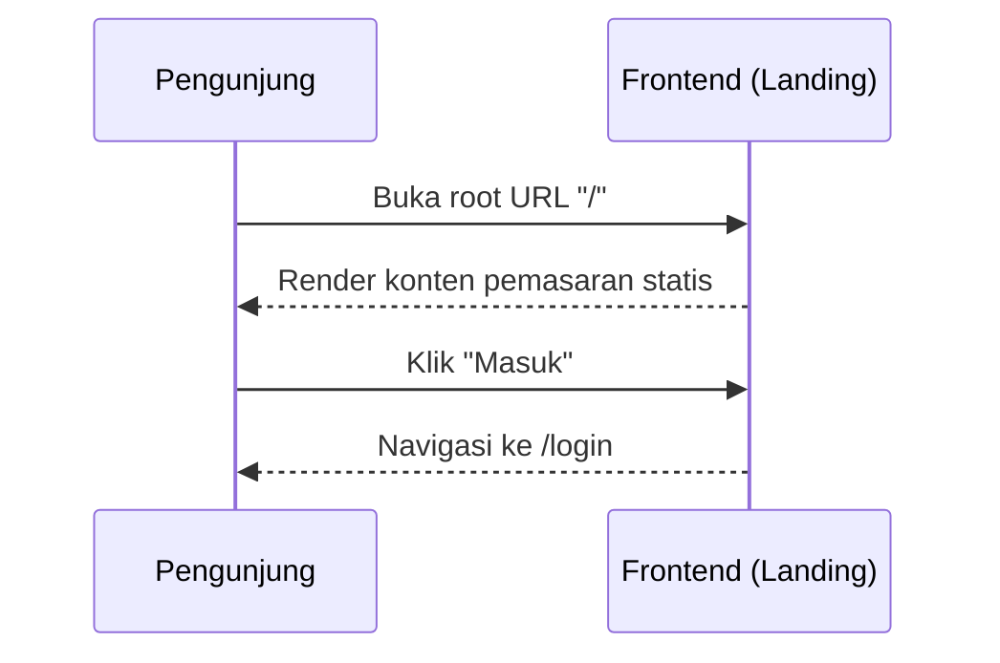

**Deskripsi Antarmuka:**

| Komponen | Tipe | Deskripsi |
|----------|------|-----------|
| Hero Section | Section statis | Headline proposisi nilai dan ringkasan fitur Payana. |
| Tombol "Masuk" | Tautan (`<Link>`) | Mengarahkan ke `/login`. |
| Bagian Fitur | Grid kartu | Menjelaskan EWA real-time, gasless, dan kepatuhan otomatis. |

**Method/Algoritma Utama:**

1. Render konten statis tanpa pemanggilan kontrak atau backend.
2. Saat tombol "Masuk" ditekan, navigasi App Router ke `/login`.

##### 2.4.1.2 Halaman Login (`/login`)

**Deskripsi:** Autentikasi tanpa kata sandi berbasis tanda tangan kriptografi EIP-191 menggunakan embedded wallet Privy.
**Aktor:** Seluruh pengguna (HR, Karyawan, Legal, Owner).
**FR Terkait:** FR-PAYANA-101, FR-PAYANA-102, FR-PAYANA-106.

**Alur Interaksi:**

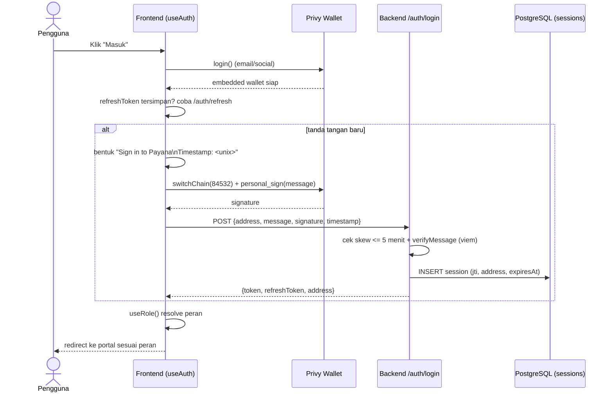

**Deskripsi Antarmuka:**

| Komponen | Tipe | Deskripsi |
|----------|------|-----------|
| Tombol "Masuk" | Tombol | Memicu `login()` Privy (modal email/social). |
| Indikator status | Teks/spinner | Menampilkan progres "menandatangani" dan "memverifikasi". |
| Redirect handler | Efek samping | Mengarahkan ke portal berdasarkan hasil `useRole`. |

**Method/Algoritma Utama:**

1. Panggil `login()` Privy; tunggu `authenticated` dan ketersediaan `walletAddress`.
2. Jika ada `payana_refresh_token` di `localStorage`, coba `POST /auth/refresh` terlebih dahulu untuk menghindari tanda tangan ulang.
3. Jika refresh gagal, bentuk pesan `Sign in to Payana\nTimestamp: <unix_seconds>`, panggil `switchChain(84532)`, lalu `personal_sign`.
4. Kirim `{address, message, signature, timestamp}` ke `POST /auth/login`; simpan `token` (akses) dan `refreshToken`.
5. Jalankan `useRole()` untuk menentukan peran dan mengarahkan ke `/owner`, `/hr/*`, `/hr/phk` (Legal), atau `/employee/*`.

##### 2.4.1.3 Halaman Onboarding HR (`/onboarding`)

**Deskripsi:** Formulir pengajuan permohonan akses platform bagi calon HR Admin, lengkap dengan pemantauan status persetujuan.
**Aktor:** Calon HR Admin.
**FR Terkait:** FR-PAYANA-107.

**Alur Interaksi:**

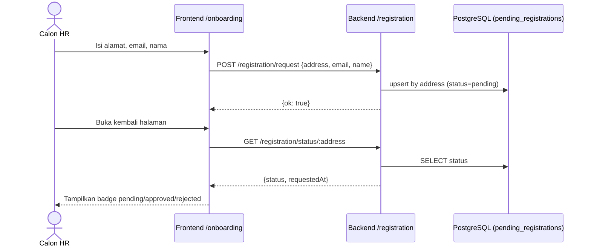

**Deskripsi Antarmuka:**

| Komponen | Tipe | Deskripsi |
|----------|------|-----------|
| Input alamat dompet | Field teks | Alamat EVM calon HR. |
| Input email | Field email | Email PIC HR. |
| Input nama | Field teks | Nama PIC/perusahaan. |
| Tombol "Ajukan" | Tombol | Memanggil `registration.submit`. |
| Badge status | Komponen status | Menampilkan `pending`/`approved`/`rejected`/`none`. |

**Method/Algoritma Utama:**

1. Validasi field tidak kosong; submit ke `POST /registration/request` (upsert by address).
2. Polling/`GET /registration/status/:address` untuk menampilkan status terkini.
3. Jika status `approved`, arahkan pengguna untuk login dan melanjutkan deployment vault (dilakukan oleh Owner pada `/owner`).

##### 2.4.1.4 Halaman Verifikasi SBT (`/verify`)

**Deskripsi:** Verifikasi publik keaslian Sertifikat Ketenagakerjaan (Employment SBT) oleh pihak ketiga.
**Aktor:** Publik (verifikator eksternal, mis. bank, calon pemberi kerja).
**FR Terkait:** FR-PAYANA-905, FR-PAYANA-904.

**Alur Interaksi:**

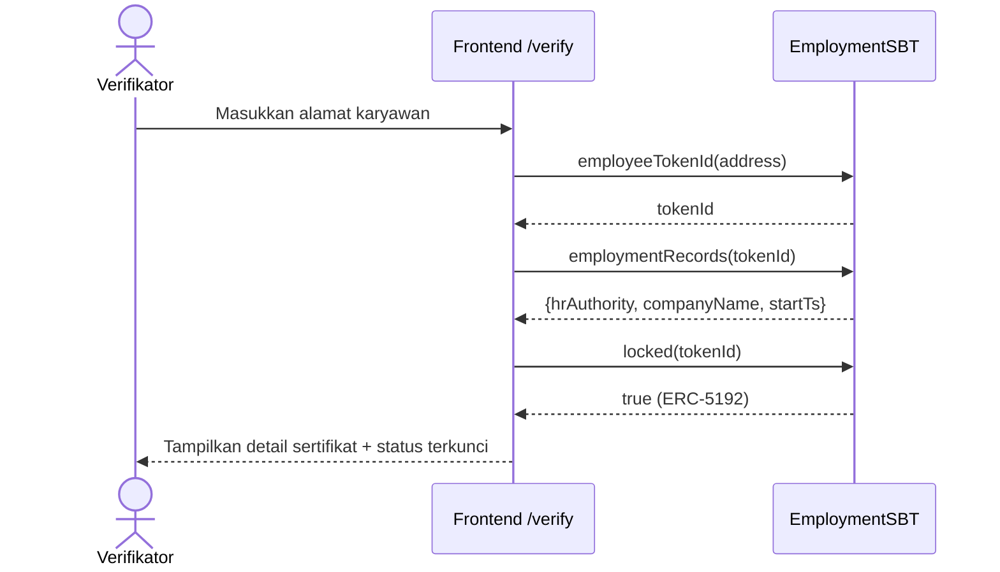

**Deskripsi Antarmuka:**

| Komponen | Tipe | Deskripsi |
|----------|------|-----------|
| Input alamat | Field teks | Alamat dompet karyawan yang diverifikasi. |
| Kartu sertifikat | Panel hasil | Menampilkan `companyName`, `startTs`, `hrAuthority`. |
| Badge "Soulbound" | Indikator | Menegaskan token non-transferable (`locked == true`). |

**Method/Algoritma Utama:**

1. Baca `employeeTokenId(address)`; jika 0, tampilkan "sertifikat tidak ditemukan".
2. Baca `employmentRecords(tokenId)` untuk metadata perusahaan dan tanggal mulai.
3. Baca `locked(tokenId)` (selalu `true`) untuk mengonfirmasi sifat soulbound.

#### 2.4.2 Portal HR (`/hr/*`)

Seluruh halaman portal HR dibungkus oleh layout `hr/layout.tsx` yang menyediakan navigasi sisi dan role guard berbasis `useRole`. Pengguna yang bukan HR diarahkan keluar dari portal ini.

##### 2.4.2.1 Dashboard HR Onboarding (`/hr/onboarding`)

**Deskripsi:** Wizard tiga langkah untuk men-deploy `CompanyVault`, mengonfigurasi parameter potongan (BPS), dan melakukan deposit awal IDRX.
**Aktor:** HR Admin.
**FR Terkait:** FR-PAYANA-201, FR-PAYANA-202, FR-PAYANA-901.

**Alur Interaksi:**

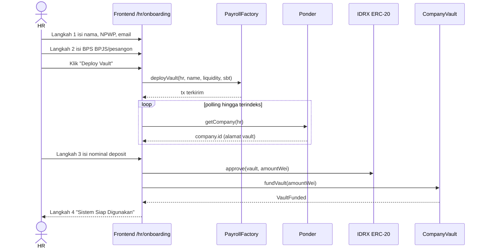

**Deskripsi Antarmuka:**

| Komponen | Tipe | Deskripsi |
|----------|------|-----------|
| Stepper | Indikator langkah | Empat tahap: Registrasi, Konfigurasi, Deposit, Selesai. |
| Input Nama Perusahaan / NPWP / Email | Field teks | Metadata perusahaan; nama digunakan untuk metadata SBT. |
| Input BPS BPJS / Pesangon | Field angka | Konfigurasi potongan (informatif untuk `setCompanyConfig`). |
| Tombol "Deploy Vault" | Tombol tulis | Memanggil `PayrollFactory.deployVault`. |
| Kartu alamat vault | Panel hasil | Menampilkan alamat vault terindeks + tombol salin. |
| Input Deposit (IDRX) | Field angka | Nominal deposit awal. |
| Tombol "Approve & Deposit" | Tombol tulis | Memanggil `approve` lalu `fundVault`. |

**Method/Algoritma Utama:**

1. `handleDeploy`: panggil `deployVault(address, companyName, EMPLOYMENT_SBT)` via `useContractWrite`.
2. Polling `ponder.getCompany(address)` hingga 20 kali (interval 3 detik) sampai alamat vault terindeks; simpan ke `deployedVault`.
3. `handleDeposit`: konversi nominal ke wei (`BigInt(amount) * 1e18`), panggil `approve(deployedVault, amountWei)` pada IDRX, lalu `fundVault(amountWei)` pada vault.
4. Tampilkan langkah selesai dengan tautan ke `/hr/vault`.

##### 2.4.2.2 Manajemen Karyawan (`/hr/employees` dan `/hr/employees/[id]`)

**Deskripsi:** Daftar seluruh karyawan beserta status stream, flow rate, dan saldo terakumulasi; halaman detail menyediakan kontrol penuh atas stream individual.
**Aktor:** HR Admin.
**FR Terkait:** FR-PAYANA-301 s.d. FR-PAYANA-306, FR-PAYANA-505.

**Alur Interaksi:**

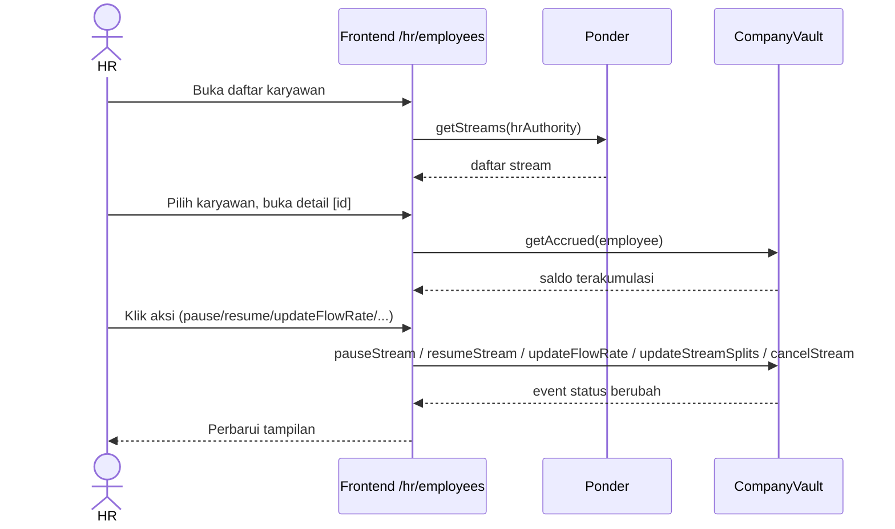

**Deskripsi Antarmuka:**

| Komponen | Tipe | Deskripsi |
|----------|------|-----------|
| Tabel karyawan | Tabel data | Kolom alamat, status, flow rate, saldo terakumulasi. |
| Badge status stream | Indikator | Active / Paused / Cancelled / Inactive. |
| Kontrol stream | Grup tombol | `pauseStream`, `resumeStream`, `updateFlowRate`, `updateStreamSplits`, `cancelStream`. |
| Input flow rate / split | Field angka | Nilai baru untuk pembaruan stream. |
| Tombol Resign | Tombol tulis | `resignEmployee(employee)` (pesangon kembali ke vault). |

**Method/Algoritma Utama:**

1. Muat daftar via `ponder.getStreams(hrAuthority)`; render tabel.
2. Pada detail `[id]`, baca `getAccrued(employee)` on-chain untuk saldo real-time.
3. Aksi kontrol memanggil fungsi kontrak terkait melalui `useContractWrite`; validasi split = 10.000 bps sebelum `updateStreamSplits`.

##### 2.4.2.3 Manajemen Vault (`/hr/vault`)

**Deskripsi:** Manajemen treasury perusahaan: pemantauan saldo, peringatan saldo rendah real-time, deposit, dan penarikan.
**Aktor:** HR Admin.
**FR Terkait:** FR-PAYANA-202, FR-PAYANA-203, FR-PAYANA-205, FR-PAYANA-207.

**Alur Interaksi:**

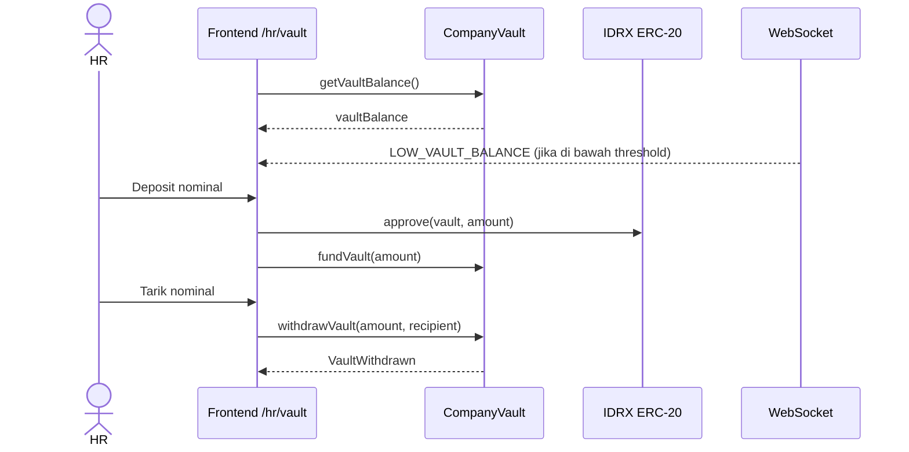

**Deskripsi Antarmuka:**

| Komponen | Tipe | Deskripsi |
|----------|------|-----------|
| Kartu saldo vault | Panel data | Menampilkan `vaultBalance` dan estimasi burn rate bulanan. |
| Banner peringatan | Alert real-time | Muncul saat pesan WebSocket `LOW_VAULT_BALANCE` diterima. |
| Form deposit | Field + tombol | `approve` lalu `fundVault(amount)`. |
| Form penarikan | Field + tombol | `withdrawVault(amount, recipient)`. |
| Tombol pause/resume vault | Tombol tulis | `pauseVault()` / `resumeVault()`. |

**Method/Algoritma Utama:**

1. Baca `getVaultBalance()` dan `totalFlowRate` untuk estimasi kebutuhan bulanan.
2. Berlangganan WebSocket; tampilkan banner saat tipe `LOW_VAULT_BALANCE` diterima.
3. Deposit: `approve(vault, amount)` → `fundVault(amount)`. Penarikan: `withdrawVault(amount, recipient)`.

##### 2.4.2.4 Reimburse HR (`/hr/reimburse`)

**Deskripsi:** Manajemen klaim reimbursement yang diajukan karyawan: daftar, persetujuan, dan pencatatan pembayaran.
**Aktor:** HR Admin.
**FR Terkait:** — (fitur pelengkap antarmuka tingkat aplikasi).

**Alur Interaksi:**

```mermaid
sequenceDiagram
    actor HR
    participant FE as Frontend /hr/reimburse
    HR->>FE: Tinjau klaim masuk
    HR->>FE: Setujui/tolak klaim
    FE-->>HR: Perbarui status klaim
```

**Deskripsi Antarmuka:**

| Komponen | Tipe | Deskripsi |
|----------|------|-----------|
| Daftar klaim | Tabel data | Keterangan, jumlah, status, bukti. |
| Tombol setujui/tolak | Grup tombol | Memutuskan klaim reimbursement. |

**Method/Algoritma Utama:**

1. Muat daftar klaim reimbursement tingkat aplikasi.
2. Aksi persetujuan/penolakan memperbarui status klaim dan mencatat pembayaran.

##### 2.4.2.5 Bounty HR (`/hr/bounty`)

**Deskripsi:** Manajemen program bounty/insentif kinerja: pembuatan papan bounty, penetapan hadiah IDRX, dan pencatatan klaim disetujui.
**Aktor:** HR Admin.
**FR Terkait:** — (fitur pelengkap antarmuka tingkat aplikasi).

**Alur Interaksi:**

```mermaid
sequenceDiagram
    actor HR
    participant FE as Frontend /hr/bounty
    HR->>FE: Buat bounty + hadiah IDRX
    HR->>FE: Tinjau klaim penyelesaian
    FE-->>HR: Tandai bounty terbayar
```

**Deskripsi Antarmuka:**

| Komponen | Tipe | Deskripsi |
|----------|------|-----------|
| Form bounty | Field + tombol | Judul, deskripsi tugas, hadiah IDRX. |
| Daftar bounty | Tabel data | Status: terbuka/diklaim/selesai. |

**Method/Algoritma Utama:**

1. Buat papan bounty dengan hadiah IDRX.
2. Tinjau klaim penyelesaian dan catat pembayaran hadiah.

##### 2.4.2.6 Compliance HR (`/hr/compliance`)

**Deskripsi:** Laporan kepatuhan BPJS/PPh21: pratinjau ringkasan bulanan, unduhan CSV, dan penarikan akumulasi dana kepatuhan.
**Aktor:** HR Admin.
**FR Terkait:** FR-PAYANA-801, FR-PAYANA-803, FR-PAYANA-804, FR-PAYANA-805.

**Alur Interaksi:**

```mermaid
sequenceDiagram
    actor HR
    participant FE as Frontend /hr/compliance
    participant BE as Backend /compliance
    participant PO as Ponder (salary_claim)
    participant V as CompanyVault
    HR->>FE: Pilih bulan
    FE->>BE: GET /compliance/summary/:hr?month=YYYY-MM
    BE->>PO: SUM(accrued/compliance/severance)
    PO-->>BE: agregat + rincian
    BE-->>FE: ringkasan JSON
    HR->>FE: Unduh CSV
    FE->>BE: GET /compliance/export/:hr?month=YYYY-MM
    BE-->>FE: file CSV (PII didekripsi)
    HR->>FE: Tarik dana kepatuhan
    FE->>V: withdrawCompliance(amount, recipient)
    V-->>FE: ComplianceWithdrawn
```

**Deskripsi Antarmuka:**

| Komponen | Tipe | Deskripsi |
|----------|------|-----------|
| Pemilih bulan | Input bulan | Format `YYYY-MM`. |
| Kartu ringkasan | Panel data | Total accrued, compliance (BPJS/PPh21), severance, jumlah karyawan. |
| Tombol Unduh CSV | Tombol | Memanggil `GET /compliance/export`. |
| Form tarik kepatuhan | Field + tombol | `withdrawCompliance(amount, recipient)` ke agen pajak. |

**Method/Algoritma Utama:**

1. Ambil ringkasan via `backend.getComplianceSummary(hr, month, token)`.
2. Tombol unduh memanggil endpoint export; berkas CSV dikembalikan sebagai attachment.
3. Penarikan memanggil `withdrawCompliance(amount, recipient)` (hanya `complianceBalance`).

##### 2.4.2.7 Kasbon HR (`/hr/kasbon`)

**Deskripsi:** Daftar pengajuan kasbon karyawan (Pending/Active/Rejected/Repaid), tombol setujui/tolak, dan riwayat pemotongan pajak (PPh21 + BPJS) per klaim gaji.
**Aktor:** HR Admin.
**FR Terkait:** FR-PAYANA-703, FR-PAYANA-705.

**Alur Interaksi:**

```mermaid
sequenceDiagram
    actor HR
    participant FE as Frontend /hr/kasbon
    participant PO as Ponder
    participant V as CompanyVault
    FE->>PO: getSalaryAdvances(vaultAddress)
    PO-->>FE: salary_advance[] (Pending/Active/Rejected/Repaid)
    alt HR menyetujui
        HR->>FE: Klik "Setujui"
        FE->>V: approveAdvance(employee)
        V-->>FE: event AdvanceApproved
    else HR menolak
        HR->>FE: Klik "Tolak"
        FE->>V: rejectAdvance(employee)
        V-->>FE: event AdvanceRejected
    end
    FE-->>HR: Tampilkan status kasbon terkini + riwayat TaxWithheld
```

**Deskripsi Antarmuka:**

| Komponen | Tipe | Deskripsi |
|----------|------|-----------|
| Tabel kasbon Pending | Tabel data | Daftar pengajuan menunggu persetujuan, dengan tombol Setujui/Tolak per baris. |
| Tabel riwayat kasbon | Tabel data | Kasbon `Active`/`Rejected`/`Repaid` beserta sisa yang harus dilunasi. |
| Panel riwayat pajak | Panel data | Ringkasan `TaxWithheld` (PPh21 + BPJS) per klaim gaji, terindeks Ponder. |

**Method/Algoritma Utama:**

1. Baca `ponder.getSalaryAdvances(vaultAddress)` untuk daftar kasbon terindeks (status diturunkan dari riwayat event, lihat catatan `AdvanceStatus`).
2. Tombol Setujui memanggil `approveAdvance(employee)`; Tolak memanggil `rejectAdvance(employee)`.
3. Render riwayat `TaxWithheld` per karyawan dari data Ponder untuk transparansi potongan pajak.

##### 2.4.2.8 Vesting HR (`/hr/vesting`)

**Deskripsi:** Manajemen cliff vest: pembuatan vest baru bertipe Retention/Probation/ESOP dan pembatalan vest yang belum matang.
**Aktor:** HR Admin.
**FR Terkait:** FR-PAYANA-601, FR-PAYANA-603, FR-PAYANA-604, FR-PAYANA-605.

**Alur Interaksi:**

```mermaid
sequenceDiagram
    actor HR
    participant FE as Frontend /hr/vesting
    participant PO as Ponder (cliff_vest)
    participant V as CompanyVault
    FE->>PO: getVests(employee)
    PO-->>FE: daftar vest
    HR->>FE: Buat vest baru
    FE->>V: createCliffVest(employee, amount, cliffTs, vestType)
    V-->>FE: CliffVestCreated
    HR->>FE: Batalkan vest
    FE->>V: cancelCliffVest(employee, vestId)
    V-->>FE: CliffVestForfeited
```

**Deskripsi Antarmuka:**

| Komponen | Tipe | Deskripsi |
|----------|------|-----------|
| Form vest baru | Field + dropdown | Alamat karyawan, jumlah, tanggal cliff, tipe vest. |
| Dropdown tipe vest | Select | Retention / Probation / ESOP. |
| Daftar vest | Tabel data | Jumlah, cliff, status (Locked/Claimed/Forfeited). |
| Tombol batalkan | Tombol tulis | `cancelCliffVest(employee, vestId)`. |

**Method/Algoritma Utama:**

1. Validasi `cliffTs` di masa depan dan saldo vault mencukupi.
2. Panggil `createCliffVest(employee, amount, cliffTs, vestType)`.
3. Daftar vest dibaca dari `ponder.getVests`; pembatalan memanggil `cancelCliffVest`.

##### 2.4.2.9 PHK (`/hr/phk`)

**Deskripsi:** Antrian dan alur PHK multi-tanda tangan (HR mengajukan, Legal menyetujui, HR mengeksekusi), termasuk pembatalan proposal.
**Aktor:** HR Admin dan Legal Officer (mode terbatas).
**FR Terkait:** FR-PAYANA-501, FR-PAYANA-502, FR-PAYANA-503, FR-PAYANA-504.

**Alur Interaksi:**

```mermaid
sequenceDiagram
    actor HR
    actor Legal as Legal Officer
    participant V as CompanyVault
    HR->>V: proposeTermination(employee, reasonHash)
    V->>V: hrApproved=true, expiresAt=+7 hari, snapshot flowRate
    V-->>HR: TerminationProposed
    Legal->>V: approveTermination(employee)
    V->>V: legalApproved=true (cek LEGAL_ROLE)
    V-->>Legal: TerminationApproved
    HR->>V: executeTermination(employee)
    V->>V: hitung pesangon (UU Cipta Kerja) + top-up
    V->>V: revoke SBT + forfeit vest + cancel stream
    V-->>HR: SeveranceReleased + TerminationExecuted
```

**Deskripsi Antarmuka:**

| Komponen | Tipe | Deskripsi |
|----------|------|-----------|
| Form proposal | Field + tombol | Alamat karyawan + alasan (di-hash jadi `reasonHash`). |
| Daftar proposal | Tabel data | Status `hrApproved`/`legalApproved`, kadaluarsa. |
| Tombol setujui (Legal) | Tombol tulis | `approveTermination(employee)`. |
| Tombol eksekusi | Tombol tulis | `executeTermination(employee)`. |
| Tombol batalkan | Tombol tulis | `cancelProposal(employee)` sebelum disetujui Legal. |

**Method/Algoritma Utama:**

1. HR: hash alasan ke `reasonHash` (keccak256), panggil `proposeTermination(employee, reasonHash)`.
2. Legal: panggil `approveTermination(employee)` (memerlukan `LEGAL_ROLE`).
3. HR: panggil `executeTermination(employee)` (memerlukan kedua persetujuan dan belum kadaluarsa).
4. Pembatalan memanggil `cancelProposal(employee)` selama belum disetujui Legal.

##### 2.4.2.10 Audit HR (`/hr/audit`)

**Deskripsi:** Riwayat aksi backend yang relevan dengan perusahaan (relay, ekspor kepatuhan, likuidasi, platform fee, peringatan saldo).
**Aktor:** HR Admin.
**FR Terkait:** FR-PAYANA-1002.

**Alur Interaksi:**

```mermaid
sequenceDiagram
    actor HR
    participant FE as Frontend /hr/audit
    participant BE as Backend (audit_logs)
    FE->>BE: Ambil audit log perusahaan
    BE-->>FE: daftar {action, actor, txHash, meta, createdAt}
    FE-->>HR: Render riwayat aksi
```

**Deskripsi Antarmuka:**

| Komponen | Tipe | Deskripsi |
|----------|------|-----------|
| Tabel audit | Tabel data | Aksi (`BUNDLER_RELAY`, `COMPLIANCE_EXPORT`, `LOAN_LIQUIDATED`, `PLATFORM_FEE_PAID`, `LOW_VAULT_BALANCE_ALERT`), waktu, hash. |
| Tautan transaksi | OnChainLink | Tautan ke Basescan untuk `txHash`. |

**Method/Algoritma Utama:**

1. Ambil entri `audit_logs` yang aktor/metanya terkait perusahaan HR.
2. Render tabel terurut waktu dengan tautan transaksi.

##### 2.4.2.11 Pengaturan HR (`/hr/settings`)

**Deskripsi:** Konfigurasi parameter vault: BPS BPJS, BPS PPh21, dan threshold peringatan saldo rendah.
**Aktor:** HR Admin.
**FR Terkait:** FR-PAYANA-204, FR-PAYANA-802.

**Alur Interaksi:**

```mermaid
sequenceDiagram
    actor HR
    participant FE as Frontend /hr/settings
    participant V as CompanyVault
    HR->>FE: Atur bpjsBps, pph21Bps, threshold
    FE->>V: setCompanyConfig(bpjsBps, pph21Bps, lowBalanceThresholdBps)
    V-->>FE: konfigurasi tersimpan
    FE-->>HR: Konfirmasi
```

**Deskripsi Antarmuka:**

| Komponen | Tipe | Deskripsi |
|----------|------|-----------|
| Input BPJS Bps | Field angka | Tarif BPJS (informatif). |
| Input PPh21 Bps | Field angka | Tarif PPh21 (informatif). |
| Input Threshold Bps | Field angka | Ambang peringatan saldo rendah. |
| Tombol Simpan | Tombol tulis | `setCompanyConfig(...)`. |

**Method/Algoritma Utama:**

1. Baca konfigurasi saat ini dari kontrak untuk prapengisian form.
2. Panggil `setCompanyConfig(bpjsBps, pph21Bps, lowBalanceThresholdBps)` via `useContractWrite`.

#### 2.4.3 Portal Karyawan (`/employee/*`)

Seluruh halaman portal karyawan dibungkus oleh layout `employee/layout.tsx` dengan navigasi sisi karyawan dan role guard `useRole`. Karyawan diidentifikasi melalui stream aktif/paused pada Ponder.

##### 2.4.3.1 EWA Dashboard (`/employee/ewa`)

**Deskripsi:** Halaman utama karyawan yang menampilkan saldo gaji terakumulasi real-time, saldo Smart Account, vesting mendatang, dan riwayat klaim; menyediakan tombol "Tarik Gaji" gasless.
**Aktor:** Karyawan.
**FR Terkait:** FR-PAYANA-401, FR-PAYANA-402, FR-PAYANA-403, FR-PAYANA-405.

**Alur Interaksi:**

```mermaid
sequenceDiagram
    actor E as Karyawan
    participant FE as Frontend /employee/ewa
    participant PO as Ponder
    participant V as CompanyVault
    participant IDRX as IDRX ERC-20
    FE->>PO: getStream / getClaims / getVests
    PO-->>FE: data stream, klaim, vest
    FE->>V: getAccrued(address)
    V-->>FE: saldo terakumulasi (seed counter)
    loop tiap 10 detik (NFR-10)
        FE->>V: getAccrued(address)
        V-->>FE: nilai terbaru
    end
    E->>FE: Klik "Tarik Gaji"
    FE->>V: claimSalary() (jalur gasless ERC-4337)
    V-->>FE: txHash + SalaryClaimed
    FE->>IDRX: balanceOf(address) (refresh)
    FE-->>E: Banner "Dana EWA berhasil ditarik"
```

**Deskripsi Antarmuka:**

| Komponen | Tipe | Deskripsi |
|----------|------|-----------|
| Kartu EWA gelap | Panel utama | `StreamCounter` real-time + flow rate per detik + status streaming. |
| Tombol "Tarik Gaji" | Tombol tulis | Memicu `claimSalary()` (gasless); nonaktif jika `accruedWei == 0`. |
| Kartu Smart Account | Panel data | Saldo IDRX (`balanceOf`) + alamat ringkas. |
| Kartu Bonus Vesting | Panel data | Vest `Locked` terdekat + progress bar. |
| Aktivitas Terakhir | Daftar | Lima klaim terakhir dari `getClaims`. |
| Banner sukses | Alert + OnChainLink | Konfirmasi klaim + tautan transaksi. |

**Method/Algoritma Utama:**

1. Muat paralel `ponder.getStream`, `ponder.getClaims`, `ponder.getVests`; baca `balanceOf` IDRX.
2. `fetchAccrued`: baca `getAccrued(address)` on-chain sebagai seed `StreamCounter`; polling tiap 10 detik (NFR-10).
3. `handleClaim`: panggil `claimSalary()` melalui jalur write (gasless), tampilkan banner sukses, lalu refresh `getAccrued` dan `balanceOf`.

##### 2.4.3.2 Reimburse Karyawan (`/employee/reimburse`)

**Deskripsi:** Formulir pengajuan reimbursement dan pemantauan status persetujuan HR.
**Aktor:** Karyawan.
**FR Terkait:** — (fitur pelengkap antarmuka tingkat aplikasi).

**Alur Interaksi:**

```mermaid
sequenceDiagram
    actor E as Karyawan
    participant FE as Frontend /employee/reimburse
    E->>FE: Isi keterangan, jumlah, unggah bukti
    FE-->>E: Ajukan klaim
    E->>FE: Pantau status persetujuan
```

**Deskripsi Antarmuka:**

| Komponen | Tipe | Deskripsi |
|----------|------|-----------|
| Form klaim | Field + unggah | Keterangan biaya, jumlah IDRX, bukti. |
| Daftar status | Tabel data | Status persetujuan HR. |

**Method/Algoritma Utama:**

1. Submit klaim reimbursement tingkat aplikasi.
2. Pantau status persetujuan dari HR.

##### 2.4.3.3 Bounty Karyawan (`/employee/bounty`)

**Deskripsi:** Daftar program bounty yang tersedia beserta tombol klaim hadiah IDRX setelah tugas selesai.
**Aktor:** Karyawan.
**FR Terkait:** — (fitur pelengkap antarmuka tingkat aplikasi).

**Alur Interaksi:**

```mermaid
sequenceDiagram
    actor E as Karyawan
    participant FE as Frontend /employee/bounty
    E->>FE: Lihat daftar bounty
    E->>FE: Klaim hadiah setelah tugas selesai
    FE-->>E: Status klaim diperbarui
```

**Deskripsi Antarmuka:**

| Komponen | Tipe | Deskripsi |
|----------|------|-----------|
| Daftar bounty | Grid kartu | Judul, deskripsi, hadiah IDRX. |
| Tombol klaim | Tombol | Mengajukan klaim penyelesaian. |

**Method/Algoritma Utama:**

1. Muat daftar bounty terbuka.
2. Ajukan klaim hadiah; tunggu verifikasi HR.

##### 2.4.3.4 Kasbon Karyawan (`/employee/kasbon`)

**Deskripsi:** Status kasbon aktif beserta sisa yang harus dilunasi, tombol pengajuan kasbon baru, dan rincian potongan PPh21/BPJS pada setiap klaim gaji.
**Aktor:** Karyawan.
**FR Terkait:** FR-PAYANA-703, FR-PAYANA-704, FR-PAYANA-706.

**Alur Interaksi:**

```mermaid
sequenceDiagram
    actor E as Karyawan
    participant FE as Frontend /employee/kasbon
    participant PO as Ponder
    participant V as CompanyVault
    FE->>PO: getSalaryAdvance(employee) / getStream(employee)
    PO-->>FE: status kasbon, sisa, riwayat TaxWithheld
    E->>FE: Ajukan kasbon (<= 80% gaji bulanan)
    FE->>V: requestAdvance(amount) — gasless via Paymaster
    V-->>FE: event AdvanceRequested
    FE-->>E: Refresh status kasbon (Pending)
```

**Deskripsi Antarmuka:**

| Komponen | Tipe | Deskripsi |
|----------|------|-----------|
| Kartu status kasbon | Panel data | Status saat ini (Pending/Active/Rejected/Repaid), jumlah, dan sisa yang harus dilunasi. |
| Input nominal pengajuan | Field | Nominal kasbon; dibatasi `maxAdvance` (80% dari estimasi gaji bulanan). |
| Indikator pelunasan | Progress bar | `repaid / amount`. |
| Panel riwayat pajak | Panel data | Rincian `TaxWithheld` (PPh21 + BPJS) per klaim gaji. |
| Tombol aksi | Tombol tulis | `requestAdvance(amount)`. |

**Method/Algoritma Utama:**

1. Muat paralel `getSalaryAdvance(employee)` dan `getStream(employee)` dari Ponder.
2. Hitung `maxAdvance = floor(monthlySalary * 0.8)` dengan `monthlySalary = (flowRate/1e18) * 2.592.000`.
3. Tombol ajukan memanggil `requestAdvance(amount)` (gasless, ditandatangani Privy), lalu `refreshData`.
4. Render riwayat `TaxWithheld` dari data Ponder untuk transparansi potongan pajak per klaim.

##### 2.4.3.5 Vesting Karyawan (`/employee/vesting`)

**Deskripsi:** Daftar cliff vest milik karyawan beserta tombol klaim setelah cliff tercapai.
**Aktor:** Karyawan.
**FR Terkait:** FR-PAYANA-602, FR-PAYANA-604.

**Alur Interaksi:**

```mermaid
sequenceDiagram
    actor E as Karyawan
    participant FE as Frontend /employee/vesting
    participant PO as Ponder (cliff_vest)
    participant V as CompanyVault
    FE->>PO: getVests(address)
    PO-->>FE: daftar vest + status
    E->>FE: Klik klaim (cliff tercapai)
    FE->>V: claimCliffVest(vestId)
    V-->>FE: CliffVestClaimed + transfer IDRX
    FE-->>E: Perbarui status menjadi Claimed
```

**Deskripsi Antarmuka:**

| Komponen | Tipe | Deskripsi |
|----------|------|-----------|
| Daftar vest | Tabel/grid | Jumlah terkunci, tanggal cliff, tipe, status. |
| Badge status | Indikator | Locked / Claimed / Forfeited. |
| Tombol klaim | Tombol tulis | `claimCliffVest(vestId)`; aktif hanya setelah cliff. |

**Method/Algoritma Utama:**

1. Muat `ponder.getVests(address)`; tampilkan status dan tanggal cliff.
2. Tombol klaim aktif jika `block.timestamp >= cliffTs` dan status `Locked`.
3. Panggil `claimCliffVest(vestId)`; perbarui status.

##### 2.4.3.6 Transfer (`/employee/transfer`)

**Deskripsi:** Transfer IDRX dari Smart Account karyawan ke alamat EVM eksternal menggunakan fungsi standar ERC-20.
**Aktor:** Karyawan.
**FR Terkait:** FR-PAYANA-401 (pendukung pencairan).

**Alur Interaksi:**

```mermaid
sequenceDiagram
    actor E as Karyawan
    participant FE as Frontend /employee/transfer
    participant IDRX as IDRX ERC-20
    E->>FE: Isi alamat tujuan + nominal
    FE->>IDRX: balanceOf(address) (validasi saldo)
    E->>FE: Konfirmasi transfer
    FE->>IDRX: transfer(recipient, amountWei)
    IDRX-->>FE: Transfer event
    FE-->>E: Konfirmasi pengiriman
```

**Deskripsi Antarmuka:**

| Komponen | Tipe | Deskripsi |
|----------|------|-----------|
| Input alamat tujuan | Field teks | Alamat EVM eksternal (mis. MetaMask/bursa). |
| Input nominal | Field angka | Jumlah IDRX yang dikirim. |
| Kartu saldo | Panel data | Saldo IDRX terkini. |
| Tombol kirim | Tombol tulis | `transfer(recipient, amountWei)`. |

**Method/Algoritma Utama:**

1. Baca `balanceOf(address)` untuk validasi kecukupan saldo.
2. Konversi nominal ke wei; panggil `transfer(recipient, amountWei)` pada IDRX.

##### 2.4.3.7 Pesangon (`/employee/severance`)

**Deskripsi:** Tampilan saldo pesangon yang terakumulasi on-chain (2% dari setiap klaim) beserta status dan estimasi besaran berdasarkan masa kerja.
**Aktor:** Karyawan.
**FR Terkait:** FR-PAYANA-505, FR-PAYANA-506.

**Alur Interaksi:**

```mermaid
sequenceDiagram
    actor E as Karyawan
    participant FE as Frontend /employee/severance
    participant V as CompanyVault
    participant PO as Ponder (severance_vault)
    FE->>V: getSeveranceBalance(address)
    V-->>FE: amount terakumulasi
    FE->>PO: severance_vault (state, tenureMonths)
    PO-->>FE: status + masa kerja
    FE-->>E: Tampilkan saldo + estimasi pesangon
```

**Deskripsi Antarmuka:**

| Komponen | Tipe | Deskripsi |
|----------|------|-----------|
| Kartu saldo pesangon | Panel data | `getSeveranceBalance(address)`. |
| Badge status | Indikator | Locked / Released / Returned. |
| Estimasi pesangon | Panel info | Estimasi berdasarkan masa kerja (UU Cipta Kerja). |

**Method/Algoritma Utama:**

1. Baca `getSeveranceBalance(address)` on-chain dan `severance_vault` terindeks.
2. Tampilkan status (Locked/Released/Returned) dan estimasi statutori berdasarkan `tenureMonths`.

##### 2.4.3.8 Audit Karyawan (`/employee/audit`)

**Deskripsi:** Riwayat klaim gaji dan transaksi kasbon milik karyawan yang login.
**Aktor:** Karyawan.
**FR Terkait:** FR-PAYANA-1002 (transparansi pribadi).

**Alur Interaksi:**

```mermaid
sequenceDiagram
    actor E as Karyawan
    participant FE as Frontend /employee/audit
    participant PO as Ponder
    FE->>PO: getClaims(address)
    PO-->>FE: riwayat klaim
    FE-->>E: Render daftar transaksi
```

**Deskripsi Antarmuka:**

| Komponen | Tipe | Deskripsi |
|----------|------|-----------|
| Tabel riwayat | Tabel data | Klaim gaji + transaksi kasbon, waktu, jumlah IDRX. |
| Tautan transaksi | OnChainLink | Tautan Basescan per transaksi. |

**Method/Algoritma Utama:**

1. Ambil `ponder.getClaims(address)`; render terurut waktu.
2. Sertakan tautan transaksi ke Basescan.

##### 2.4.3.9 Pengaturan Karyawan (`/employee/settings`)

**Deskripsi:** Pembaruan profil PII karyawan (nama, NIK 16 digit, telepon) yang disimpan terenkripsi.
**Aktor:** Karyawan.
**FR Terkait:** FR-PAYANA-104, FR-PAYANA-105.

**Alur Interaksi:**

```mermaid
sequenceDiagram
    actor E as Karyawan
    participant FE as Frontend /employee/settings
    participant BE as Backend /auth/profile
    participant DB as PostgreSQL (employees, AES-GCM)
    FE->>BE: GET /auth/profile (Bearer JWT)
    BE->>DB: SELECT + decrypt
    BE-->>FE: {name, nik, phone}
    E->>FE: Perbarui field
    FE->>BE: POST /auth/profile {name, nik, phone}
    BE->>DB: encrypt (AES-256-GCM) + upsert
    BE-->>FE: {success: true}
```

**Deskripsi Antarmuka:**

| Komponen | Tipe | Deskripsi |
|----------|------|-----------|
| Input nama | Field teks | Nama lengkap. |
| Input NIK | Field teks | Harus tepat 16 digit numerik. |
| Input telepon | Field teks | Nomor telepon. |
| Tombol simpan | Tombol | `POST /auth/profile`. |

**Method/Algoritma Utama:**

1. Ambil profil terkini via `backend.getProfile(token)`; prapengisian form.
2. Validasi NIK 16 digit; submit `POST /auth/profile` (server mengenkripsi AES-256-GCM).

#### 2.4.4 Portal Owner SaaS (`/owner`)

**Deskripsi:** Dashboard agregat operator platform: TVL, jumlah tenant aktif, estimasi pendapatan platform fee, antrian registrasi HR, serta konfigurasi platform fee dan fungsi darurat.
**Aktor:** Owner SaaS.
**FR Terkait:** FR-PAYANA-1002, FR-PAYANA-1004, FR-PAYANA-1006, FR-PAYANA-1008, FR-PAYANA-108, FR-PAYANA-109.

**Alur Interaksi:**

```mermaid
sequenceDiagram
    actor O as Owner
    participant FE as Frontend /owner
    participant BE as Backend /registration
    participant PO as Ponder
    participant F as PayrollFactory
    FE->>FE: Owner guard (address == OWNER_ADDRESS)
    FE->>BE: GET /registration/pending (Bearer JWT)
    BE-->>FE: antrian registrasi
    FE->>PO: getCompanies / getPlatformFees
    PO-->>FE: tenant + estimasi pendapatan
    O->>FE: Setujui registrasi
    FE->>BE: PATCH /registration/:address/approve
    O->>FE: Tolak registrasi
    FE->>BE: DELETE /registration/:address
    O->>FE: Set platform fee / freeze
    FE->>F: setPlatformFee(bps) / emergencyFreezeAll()
```

**Deskripsi Antarmuka:**

| Komponen | Tipe | Deskripsi |
|----------|------|-----------|
| Kartu metrik | Panel data | TVL, jumlah tenant (`getCompanies`/`getTotalVaults`), estimasi fee. |
| Grafik pendapatan | AreaChart | Tren pendapatan platform. |
| Tab registrasi | Tab + tabel | Pending / Approved / Rejected. |
| Tombol setujui/tolak | Grup tombol | `approve` / `reject` registrasi. |
| Form platform fee | Field + tombol | `setPlatformFee(bps)` (maks 100 bps). |
| Tombol freeze darurat | Tombol tulis | `emergencyFreezeAll()`. |

**Method/Algoritma Utama:**

1. Owner guard: bandingkan `address` dengan `NEXT_PUBLIC_OWNER_ADDRESS`; jika tidak cocok, redirect ke `/login`.
2. Muat `registration.getPending(token)` dan `ponder.getCompanies()`/`ponder.getPlatformFees()`.
3. `handleApprove`/`handleReject` memanggil endpoint registrasi lalu refresh.
4. Konfigurasi fee via `setPlatformFee(bps)`; pembekuan via `emergencyFreezeAll()`.

#### 2.4.5 Portal Legal Officer

**Deskripsi:** Legal Officer tidak memiliki prefiks rute tersendiri; perannya difokuskan pada persetujuan PHK melalui antarmuka `/hr/phk` dalam mode terbatas.
**Aktor:** Legal Officer.
**FR Terkait:** FR-PAYANA-502.

**Alur Interaksi:**

```mermaid
sequenceDiagram
    actor Legal as Legal Officer
    participant FE as Frontend /hr/phk (mode Legal)
    participant V as CompanyVault
    FE->>FE: useRole deteksi LEGAL_ROLE pada vault
    FE-->>Legal: Tampilkan hanya proposal menunggu persetujuan
    Legal->>V: approveTermination(employee)
    V-->>Legal: TerminationApproved
```

**Deskripsi Antarmuka:**

| Komponen | Tipe | Deskripsi |
|----------|------|-----------|
| Daftar proposal menunggu | Tabel data | Hanya proposal yang `legalApproved == false`. |
| Tombol setujui | Tombol tulis | `approveTermination(employee)`. |

**Method/Algoritma Utama:**

1. `useRole` mengiterasi `getCompanies()` dan memeriksa `hasRole(LEGAL_ROLE, address)` per vault.
2. Pada mode Legal, antarmuka hanya menampilkan proposal menunggu dan tombol `approveTermination`.
3. Legal Officer tidak dapat mengajukan proposal, mengelola stream, atau mengakses treasury.

---


---

## A. Lampiran A — Informasi Tambahan

### A.1 Daftar Singkatan

| Singkatan | Kepanjangan |
|-----------|-------------|
| DPPL | Deskripsi Perancangan Perangkat Lunak |
| SKPL | Spesifikasi Kebutuhan Perangkat Lunak |
| FR | Functional Requirement |
| EWA | Earned Wage Access |
| SBT | Soulbound Token |
| FHE | Fully Homomorphic Encryption |
| PHK | Pemutusan Hubungan Kerja |
| CEI | Checks-Effects-Interactions |
| BPS | Basis Points |
| JWT | JSON Web Token |
| JTI | JWT ID |
| AES-GCM | Advanced Encryption Standard - Galois/Counter Mode |
| HMAC | Hash-based Message Authentication Code |
| ERC | Ethereum Request for Comments |
| EIP | Ethereum Improvement Proposal |
| ACL | Access Control List |
| PII | Personally Identifiable Information |
| RPC | Remote Procedure Call |
| L2 | Layer 2 |

### A.2 Pemetaan FR ke Komponen Implementasi

| FR | Smart Contract | Backend Endpoint | Frontend Page/Hook |
|----|----------------|------------------|--------------------|
| FR-PAYANA-101 | — | POST /auth/login | /login, useAuth |
| FR-PAYANA-102 | — | POST /auth/refresh | useAuth |
| FR-PAYANA-103 | — | POST /auth/logout | useAuth |
| FR-PAYANA-104 | — | POST /auth/profile | /employee/settings |
| FR-PAYANA-105 | — | GET /auth/profile | /employee/settings |
| FR-PAYANA-106 | PayrollFactory.companyVaults, CompanyVault.hasRole | — | useRole |
| FR-PAYANA-107 | — | POST /registration/request, GET /registration/status | /onboarding |
| FR-PAYANA-108 | — | GET /registration/pending | /owner |
| FR-PAYANA-109 | — | PATCH/DELETE /registration/:address | /owner |
| FR-PAYANA-201 | PayrollFactory.deployVault | — | /owner, /hr/onboarding |
| FR-PAYANA-202 | CompanyVault.fundVault | — | /hr/vault |
| FR-PAYANA-203 | CompanyVault.withdrawVault | — | /hr/vault |
| FR-PAYANA-204 | CompanyVault.setCompanyConfig | — | /hr/settings |
| FR-PAYANA-205 | CompanyVault.pauseVault/resumeVault | — | /hr/vault |
| FR-PAYANA-206 | PayrollFactory.emergencyFreezeAll, CompanyVault.freezeVault | — | /owner |
| FR-PAYANA-207 | CompanyVault._checkLowBalance (LowVaultBalance) | webhook → WS LOW_VAULT_BALANCE | /hr/vault |
| FR-PAYANA-208 | CompanyVault.withdrawCompliance | — | /hr/compliance |
| FR-PAYANA-301 | CompanyVault.startStream | — | /hr/onboarding |
| FR-PAYANA-302 | CompanyVault.pauseStream | — | /hr/employees/[id] |
| FR-PAYANA-303 | CompanyVault.resumeStream | — | /hr/employees/[id] |
| FR-PAYANA-304 | CompanyVault.updateFlowRate | — | /hr/employees/[id] |
| FR-PAYANA-305 | CompanyVault.updateStreamSplits | — | /hr/employees/[id] |
| FR-PAYANA-306 | CompanyVault.cancelStream | — | /hr/employees/[id] |
| FR-PAYANA-401 | CompanyVault.claimSalary | POST /bundler/relay | /employee/ewa |
| FR-PAYANA-402 | CompanyVault.getAccrued | — | /employee/ewa |
| FR-PAYANA-403 | (EntryPoint via Pimlico) | POST /bundler/relay | useContractWrite/EWA |
| FR-PAYANA-404 | — | POST /bundler/relay (rateLimiter) | /employee/ewa |
| FR-PAYANA-405 | — | GET /bundler/status/:hash | /employee/ewa |
| FR-PAYANA-501 | CompanyVault.proposeTermination, cancelProposal | — | /hr/phk |
| FR-PAYANA-502 | CompanyVault.approveTermination | — | /hr/phk (Legal) |
| FR-PAYANA-503 | CompanyVault.executeTermination | — | /hr/phk |
| FR-PAYANA-504 | PayrollMath.severanceMultiplier | — | /hr/phk |
| FR-PAYANA-505 | CompanyVault.resignEmployee | — | /hr/employees/[id], /employee/severance |
| FR-PAYANA-506 | CompanyVault.executeTermination (SeveranceReleased) | — | /employee/severance |
| FR-PAYANA-601 | CompanyVault.createCliffVest | — | /hr/vesting |
| FR-PAYANA-602 | CompanyVault.claimCliffVest | — | /employee/vesting |
| FR-PAYANA-603 | CompanyVault.cancelCliffVest / _forfeitAllVests | — | /hr/vesting |
| FR-PAYANA-604 | CompanyVault.cliffVests (view) | — | /hr/vesting, /employee/vesting |
| FR-PAYANA-605 | CompanyVault.vestCounter, VestType | — | /hr/vesting |
| FR-PAYANA-701 | PayrollMath.calcPPh21TerBps (via claimSalary) | — | /hr/compliance, /employee/kasbon |
| FR-PAYANA-702 | CompanyVault.claimSalary (bpjsBps cut) | — | /hr/compliance |
| FR-PAYANA-703 | event TaxWithheld (indexed) | Ponder handler | /hr/compliance, /employee/kasbon |
| FR-PAYANA-704 | CompanyVault.requestAdvance | — | /employee/kasbon |
| FR-PAYANA-705 | CompanyVault.approveAdvance / rejectAdvance | — | /hr/kasbon |
| FR-PAYANA-706 | CompanyVault.claimSalary (_autoRepayAdvance) | — | /employee/kasbon |
| FR-PAYANA-801 | CompanyVault.claimSalary (complianceBalance) | — | /hr/compliance |
| FR-PAYANA-802 | CompanyVault.setCompanyConfig | — | /hr/settings |
| FR-PAYANA-803 | CompanyVault.withdrawCompliance | — | /hr/compliance |
| FR-PAYANA-804 | — | GET /compliance/export/:hr | /hr/compliance |
| FR-PAYANA-805 | — | GET /compliance/summary/:hr | /hr/compliance |
| FR-PAYANA-901 | EmploymentSBT.mint (via startStream) | — | /hr/onboarding |
| FR-PAYANA-902 | EmploymentSBT.employmentRecords | — | /employee (SBT card) |
| FR-PAYANA-903 | EmploymentSBT.revoke (via _revokeSBT) | — | — |
| FR-PAYANA-904 | EmploymentSBT.employeeTokenId/employmentRecords | — | /employee dashboard, /verify |
| FR-PAYANA-905 | EmploymentSBT.locked/supportsInterface | — | /verify |
| FR-PAYANA-1001 | PayrollFactory.deployVault | — | /owner |
| FR-PAYANA-1002 | PayrollFactory.getTotalVaults | — | /owner, /hr/audit |
| FR-PAYANA-1003 | PayrollFactory.setPlatformFee / setProtocolTreasury | — | /owner |
| FR-PAYANA-1004 | PayrollFactory.emergencyFreezeAll | — | /owner |
| FR-PAYANA-1005 | — | (blocklist sesi — backend) | /owner |
| FR-PAYANA-1006 | PayrollFactory.setPlatformFee | — | /owner |
| FR-PAYANA-1007 | CompanyVault.claimSalary (platformCut) | — | — |
| FR-PAYANA-1008 | (transfer ke protocolTreasury) | webhook → WS PLATFORM_FEE_PAID | /owner (ponder.getPlatformFees) |
| FR-PAYANA-1101 | ConfidentialCompanyVault.encryptedSalaries | — | /hr (FHE) |
| FR-PAYANA-1102 | ConfidentialCompanyVault.setEncryptedSalary | webhook → WS ENCRYPTED_SALARY_SET | /hr (FHE) |
| FR-PAYANA-1103 | ConfidentialCompanyVault.getEncryptedSalary | — | /employee (FHE) |
| FR-PAYANA-1104 | ConfidentialCompanyVault.aggregateTotalPayroll | — | /hr (FHE) |
| FR-PAYANA-1105 | ConfidentialCompanyVault.grantViewingKey | — | /hr (FHE) |

### A.3 Alamat Kontrak Ter-Deploy

Jaringan: **Base Sepolia**, Chain ID **84532**. Redeployment Gen8 (cutover Koperasi → Tax Engine + Kasbon).

| Kontrak | Alamat |
|---------|--------|
| PayrollFactory | `0xF62dF08b38c6Fbde33E24208BA044907475ca815` |
| EmploymentSBT | `0x8dA9B60814536364daF77a82cb56B31226De4B62` |
| MockIDRX (ERC-20) | `0x0996e627cE22C4FE2D5c4788b159a83C065D6d09` |
| ConfidentialCompanyVault (Demo) | `0x4560968670Dd852dACd73c7B8748695eC427e203` |
| Admin/Treasury | `0x906B34db1a8DD333ff9a84255e4AEc13C054f120` |

> `EmployeeLiquidityContract` tidak lagi dideploy sejak Gen8 — fungsinya digantikan oleh fitur kasbon terintegrasi di `CompanyVault`.

Catatan: `CompanyVault` per tenant tidak memiliki alamat tetap karena di-deploy dinamis oleh `PayrollFactory.deployVault()`; alamatnya dapat diresolusi melalui `companyVaults(hrAuthority)`.

---

*Bersambung ke Lampiran A.4–A.8 (pelengkap rinci Subbab 2.2.2, Lampiran B, Lampiran C, dan Subbab 2.4).*

### A.4 Katalog Struktur Data On-Chain

Bagian ini merinci seluruh struct, enum, dan mapping yang menjadi state on-chain, sebagai pelengkap deskripsi fungsional pada Subbab 2.2.2.

#### A.4.1 Struct CompanyVault

| Struct | Field | Tipe | Keterangan |
|--------|-------|------|------------|
| `EmployeeStream` | `flowRate` | uint256 | IDRX wei per detik. |
| | `startTs` | uint256 | Timestamp pembuatan stream (basis perhitungan masa kerja). |
| | `lastWithdrawnTs` | uint256 | Timestamp klaim/settle terakhir. |
| | `settledBalance` | uint256 | Saldo akrual yang sudah di-settle saat pause/update rate. |
| | `status` | StreamStatus | Inactive/Active/Paused/Cancelled. |
| | `severanceBps` | uint16 | Porsi severance per klaim; PPh21/BPJS dihitung dinamis di level vault, bukan bagian struct ini. |
| `SeveranceVault` | `amount` | uint256 | Total IDRX pesangon terakumulasi. |
| | `state` | SeveranceState | Locked/Returned/Released. |
| | `tenureMonths` | uint256 | Masa kerja di klaim terakhir (perhitungan UU Cipta Kerja). |
| | `lastUpdatedTs` | uint256 | Timestamp pembaruan terakhir. |
| `TerminationProposal` | `employee` | address | Karyawan yang diusulkan PHK. |
| | `hrApproved` | bool | True saat HR mengajukan. |
| | `legalApproved` | bool | Diset oleh pemegang `LEGAL_ROLE`. |
| | `expiresAt` | uint256 | Kadaluarsa otomatis setelah `TERMINATION_EXPIRY` (7 hari). |
| | `reasonHash` | bytes32 | keccak256 alasan PHK (alasan lengkap off-chain). |
| | `flowRateSnapshot` | uint256 | Flow rate saat proposal (untuk perhitungan pesangon statutori). |
| `CliffVest` | `employee` | address | Penerima vest. |
| | `amount` | uint256 | IDRX wei terkunci. |
| | `cliffTs` | uint256 | Timestamp setelahnya vest dapat diklaim. |
| | `vestType` | VestType | Retention/Probation/ESOP. |
| | `status` | VestStatus | Locked/Claimed/Forfeited. |

**Mapping CompanyVault:** `employeeStreams[address]`, `severanceVaults[address]`, `terminations[address]`, `cliffVests[address][vestId]`, `employeeComplianceAccumulated[address]`, `salaryAdvances[address]`.

#### A.4.2 Struct SalaryAdvance (CompanyVault, Gen8)

| Struct | Field | Tipe | Keterangan |
|--------|-------|------|------------|
| `SalaryAdvance` | `amount` | uint256 | Total kasbon yang disetujui. |
| | `repaid` | uint256 | Total sudah dilunasi via auto-repay. |
| | `requestedAt` | uint256 | Timestamp pengajuan. |
| | `status` | AdvanceStatus | None/Pending/Active (lihat catatan `AdvanceStatus`, §2.3.1). |

> `EmployeeLiquidityContract` dan struct `Pool`/`LenderDeposit`/`LoanRecord` sudah tidak ada sejak Gen8, digantikan oleh `SalaryAdvance` di atas.

#### A.4.3 Enum Lengkap

| Enum | Nilai | Kontrak |
|------|-------|---------|
| `VaultStatus` | Uninitialized, Active, Paused, Frozen | CompanyVault |
| `StreamStatus` | Inactive, Active, Paused, Cancelled | CompanyVault |
| `SeveranceState` | Locked, Returned, Released | CompanyVault |
| `VestType` | Retention, Probation, ESOP | CompanyVault |
| `VestStatus` | Locked, Claimed, Forfeited | CompanyVault |
| `AdvanceStatus` | None, Pending, Active | CompanyVault |

### A.5 Spesifikasi Pustaka PayrollMath

`PayrollMath` adalah pustaka `pure`/`view` tanpa state, menyediakan perhitungan inti payroll. Konstanta: `SECONDS_PER_MONTH = 2.592.000` (30 hari), `BPS_DENOMINATOR = 10.000`.

| Fungsi | Tipe | Algoritma | FR Terkait |
|--------|------|-----------|-----------|
| `calcAccrued(flowRate, lastWithdrawnTs)` | internal view | Jika `now <= lastWithdrawnTs` kembalikan 0; selain itu `flowRate * (now - lastWithdrawnTs)`. | FR-402 |
| `monthlyToFlowRate(monthlySalary)` | internal pure | `monthlySalary / SECONDS_PER_MONTH`. | FR-301 |
| `bpsOf(amount, bps)` | internal pure | `(amount * bps) / 10000`. | FR-401, 1007 |
| `severanceMultiplier(tenureMonths)` | internal pure | Tabel berjenjang UU Cipta Kerja Pasal 156 (lihat di bawah). | FR-504 |
| `validateSplits(empBps, compBps, sevBps)` | internal pure | True jika jumlah ketiganya == 10.000. | FR-301, 305 |

**Tabel `severanceMultiplier` (pengali gaji bulanan):**

| Masa Kerja (bulan) | Pengali |
|--------------------|---------|
| < 12 | 1 |
| 12–23 | 2 |
| 24–35 | 3 |
| 36–47 | 4 |
| 48–59 | 5 |
| 60–71 | 6 |
| 72–83 | 7 |
| 84–95 | 8 |
| >= 96 | 9 |

Pesangon statutori = `severanceMultiplier(tenureMonths) * (flowRateSnapshot * SECONDS_PER_MONTH)`.

### A.6 Katalog Event On-Chain

Tabel berikut memetakan event ke pemicu fungsi, konsumen indeksasi (Ponder), dan/atau handler webhook backend.

| Event | Kontrak | Dipancarkan oleh | Konsumen |
|-------|---------|------------------|----------|
| `VaultDeployed` | PayrollFactory | `deployVault` | Ponder `company`, `/owner` |
| `PlatformFeeUpdated` | PayrollFactory | `setPlatformFee` | Ponder |
| `ProtocolTreasuryUpdated` | PayrollFactory | `setProtocolTreasury` | Ponder |
| `VaultInitialized` | CompanyVault | constructor | Ponder `company` |
| `VaultFunded` / `VaultWithdrawn` | CompanyVault | `fundVault` / `withdrawVault` | Ponder, `/hr/vault` |
| `VaultPaused` / `VaultResumed` / `VaultFreeze` | CompanyVault | `pauseVault`/`resumeVault`/`freezeVault` | Ponder |
| `StreamCreated` | CompanyVault | `startStream` | Ponder `employee_stream` |
| `StreamPaused`/`StreamResumed`/`StreamCancelled` | CompanyVault | kontrol stream | Ponder `employee_stream` |
| `FlowRateUpdated` / `StreamSplitsUpdated` | CompanyVault | `updateFlowRate`/`updateStreamSplits` | Ponder |
| `SalaryClaimed` | CompanyVault | `claimSalary` | Ponder `salary_claim`, webhook → WS `SALARY_CLAIMED` |
| `PlatformFeePaid` | CompanyVault | `claimSalary` | webhook → WS `PLATFORM_FEE_PAID`, `/owner` |
| `LowVaultBalance` | CompanyVault | `_checkLowBalance` | webhook → WS `LOW_VAULT_BALANCE`, `/hr/vault` |
| `TerminationProposed`/`TerminationApproved`/`TerminationExecuted`/`TerminationCancelled` | CompanyVault | alur PHK | Ponder `termination_proposal`, `/hr/phk` |
| `SeveranceReleased`/`SeveranceReturned`/`SeveranceShortfall` | CompanyVault | `executeTermination`/`resignEmployee` | Ponder `severance_vault`, `/employee/severance` |
| `CliffVestCreated`/`CliffVestClaimed`/`CliffVestForfeited` | CompanyVault | alur vesting | Ponder `cliff_vest` |
| `ComplianceWithdrawn` | CompanyVault | `withdrawCompliance` | Ponder, `/hr/compliance` |
| `EmploymentCertified`/`EmploymentRevoked` | CompanyVault | mint/revoke SBT | Ponder `employment_certificate` |
| `AdvanceRequested` | CompanyVault | `requestAdvance` | Ponder `salary_advance` |
| `AdvanceApproved`/`AdvanceRejected` | CompanyVault | `approveAdvance`/`rejectAdvance` | Ponder `salary_advance` |
| `AdvanceRepaid` | CompanyVault | `_autoRepayAdvance` (dipanggil dari `claimSalary`) | Ponder `salary_advance` |
| `TaxWithheld` | CompanyVault | `claimSalary` (PPh21 + BPJS) | Ponder, `/hr/compliance` |
| `Locked` | EmploymentSBT | `mint` | `/verify` (ERC-5192) |
| `EncryptedSalarySet` | ConfidentialCompanyVault | `setEncryptedSalary` | webhook → WS `ENCRYPTED_SALARY_SET` |

### A.7 Matriks Peran dan Otorisasi

| Peran | Kontrak/Lapisan | Hak Akses |
|-------|-----------------|-----------|
| `SUPERADMIN_ROLE` | PayrollFactory | `deployVault`, `setPlatformFee`, `setProtocolTreasury`, `emergencyFreezeAll`. |
| `DEFAULT_ADMIN_ROLE` | CompanyVault | Diberikan ke `hrAuthority`; mengelola peran lain; `freezeVault`. |
| `HR_ROLE` | CompanyVault | Manajemen stream, vault, kepatuhan, vesting, proposal PHK. |
| `LEGAL_ROLE` | CompanyVault | `approveTermination` (tanda tangan kedua PHK). |
| `MINTER_ROLE` | EmploymentSBT | `mint`/`revoke` (dipegang `CompanyVault`). |
| Owner SaaS | Backend/Frontend | `requireOwner` (registrasi); akses `/owner`. |

---

*Bersambung ke Lampiran A.8 (detail implementasi halaman frontend).*

### A.8 Detail Implementasi Halaman Frontend

Bagian ini merinci variabel state React, komputasi turunan, aturan validasi, dan pemanggilan data aktual per halaman, sebagai pelengkap deskripsi pada Subbab 2.4. Seluruh detail diturunkan langsung dari implementasi kode.

#### A.8.1 /hr/onboarding (Wizard Setup Vault)

**State React:** `step` (1–4), `companyName`, `npwp`, `email`, `bpjs` (default "500"), `severance` (default "200"), `depositAmount`, `deployedVault`, `copied`.

**Langkah & Aksi:**

| Langkah | Aksi | Pemanggilan |
|---------|------|-------------|
| 1 Registrasi | Validasi `companyName && npwp && email` | — |
| 2 Konfigurasi | Tampilkan alamat kontrak (`PAYROLL_FACTORY`, `EMPLOYMENT_SBT`) | — |
| 2→3 Deploy | `handleDeploy` | `write(deployVault(address, companyName, EMPLOYMENT_SBT))` |
| (polling) | 20× interval 3 detik | `ponder.getCompany(address)` hingga `company.id != 0x0` |
| 3 Deposit | `handleDeposit` | `write(approve(deployedVault, amountWei))` → `write(fundVault(amountWei))` |
| 4 Selesai | Tautan ke `/hr/vault` | — |

**Konversi:** `amountWei = BigInt(amount.replace(/\D/g,"")) * BigInt(1e18)`.

#### A.8.2 /employee/ewa (EWA Dashboard)

**State React:** `flowRate`, `streamStatus`, `accruedWei`, `idrxBalance`, `recentClaims`, `upcomingVest`, `loading`, `showSuccess`, `successTxHash`.

**Pemanggilan data:** `Promise.all([ponder.getStream, ponder.getClaims, ponder.getVests])` + `publicClient.readContract(balanceOf)` + `fetchAccrued()`.

**Komputasi turunan:**

- `fetchAccrued`: `getAccrued(address)` → seed `StreamCounter`; polling `setInterval(fetchAccrued, 10_000)` (NFR-10).
- Flow rate tampilan: `(Number(BigInt(flowRate)) / 1e18).toFixed(6)` IDRX/det.
- `getVestProgress(cliffTs)`: estimasi asumsi mulai 6 bulan sebelum cliff; `clamp((elapsed/total)*100, 0, 100)`.
- Tombol "Tarik Gaji" nonaktif jika `accruedWei === null || accruedWei === 0n`.

**handleClaim:** `write(claimSalary())` → set `successTxHash`, banner 5 detik → refresh `getAccrued` (2 dtk) dan `balanceOf` (3 dtk).

#### A.8.3 /employee/kasbon (Uang Muka Gaji)

**State React:** `advanceAmount` (default 1.000.000), `advance`, `stream`, `taxHistory`, `loading`.

**Pemanggilan data:** `Promise.all([getSalaryAdvance(address), getStream(address), getTaxWithheldHistory(address)])`.

**Komputasi turunan:**

- `maxAdvance = floor(monthlySalary * 0.8)` dengan `monthlySalary = (flowRate/1e18) * 2.592.000`; fallback 4.000.000.
- `advanceOutstanding = max(0, amount - repaid)`.
- `advanceProgress = min(100, round(repaid / amount * 100))`.
- `toWei(amount) = BigInt(round(amount * 1e18))`.

**Aksi:** `requestAdvance(amount)` (gasless via Paymaster) — diikuti `refreshData()`.

#### A.8.4 /hr/vault (Treasury)

**State React:** `company`, `streams`, `claims`, `isLoading`, `fetchError`, `isTopUpOpen`, `isConfigOpen`, `topUpAmount`, `withdrawAmount`, `withdrawAddress`, `isWithdrawOpen`.

**Pemanggilan data:** `Promise.all([ponder.getCompany(address), ponder.getStreams(address)])`.

**Komputasi turunan:**

- `burnRatePerMonth = Σ flowRate` (stream berstatus `Active`).
- `burnRateMonthly = burnRatePerMonth * 2.592.000`.
- `vaultBalanceWei = BigInt(company.vaultBalance)`.
- `monthsLeft = (vaultBalanceWei / burnRateMonthly).toFixed(1)` atau "∞" jika burn 0.

**Aksi:** modal top-up (`approve` + `fundVault`), modal withdraw (`withdrawVault(amount, recipient)`), modal config (`setCompanyConfig`). Komponen `VaultStatusBadge` menampilkan status vault.

#### A.8.5 /hr/employees (Manajemen Karyawan)

**State React:** `streams`, `searchQuery`, `statusFilter` ("Semua Status"), `isAddOpen`, `actionLoadingId`, `newEmp` ({address, salary}), `pending`.

**Pemanggilan data:** `ponder.getStreams(address)` untuk daftar; `registration.getPending(token)` untuk antrian karyawan yang menunggu.

**Logika:** filter daftar berdasarkan `searchQuery` dan `statusFilter`; `StreamCounter` per baris untuk saldo real-time; modal tambah memanggil `startStream` (gaji dikonversi ke flowRate). Tautan ke `/hr/employees/[id]` untuk detail.

#### A.8.6 /hr/phk (PHK Multi-Sig)

**State React:** `streams`, `terminations` (map alamat→proposal), `isProposeOpen`, `newProposal` ({empAddress, reason}), `actionLoadingAddr`.

**Pemanggilan data:** `ponder.getStreams(address)` (filter status != "Cancelled"); untuk tiap karyawan `ponder.getTermination(empAddr)` membangun `terminations` map.

**Logika:**

- `encodeReason(reason) = keccak256(toHex(reason))` → `reasonHash`.
- Aksi propose: `proposeTermination(empAddress, encodeReason(reason))`.
- Aksi approve (Legal): `approveTermination(empAddress)`.
- Aksi execute: `executeTermination(empAddress)`.
- `empAddr = stream.id.split("-")[1]` (id Ponder berformat `companyHr-employee`).

#### A.8.7 /hr/vesting (Cliff Vesting)

**State React:** `streams`, `vests` (agregat lintas karyawan), `isAddOpen`, `newVest` ({empAddress, type, amount, cliffDate}).

**Pemetaan tipe vest:** `VEST_TYPE_MAP = { "Bonus Retensi": 0 (Retention), "Masa Percobaan": 1 (Probation), "ESOP": 2 }`.

**Pemanggilan data:** `getStreams(address)` (filter aktif) → untuk tiap karyawan `getVests(empAddr)` dikumpulkan ke `vests` dengan `empAddress`.

**Aksi:** `createCliffVest(empAddress, amountWei, cliffTs, vestType)` (cliffTs dari `cliffDate`); `cancelCliffVest(empAddress, vestId)`. Visualisasi `PieChart` (recharts) per tipe vest.

#### A.8.8 /hr/compliance (Kepatuhan)

**State React:** `selectedMonth` (default bulan berjalan `YYYY-MM`), `summary`, `isLoading`, `fetchError`.

**Logika:**

- `handleFetch`: `backend.getComplianceSummary(address, selectedMonth, token)`.
- `handleExportCsv`: `fetch(BACKEND_URL/compliance/export/:address?month=...)` dengan Bearer JWT; unduh `blob` sebagai `compliance-<bulan>.csv`.
- `totalCompliance = Number(BigInt(summary.totalCompliance))/1e18`; `totalAccrued` serupa.
- Visualisasi `BarChart` (recharts) untuk rincian per karyawan.

#### A.8.9 /employee/severance (Pesangon)

**State React:** `severance` ({id, amount, state}), `stream`, `loading`.

**Pemanggilan data:** `Promise.all([ponder.getSeverance(address), ponder.getStream(address)])`.

**Pemetaan status (`STATE_STYLES`):** `Locked` (abu), `Released` (emerald), `Returned` (amber) — masing-masing dengan badge dan ikon. Visualisasi `BarChart` estimasi pesangon.

#### A.8.10 /employee/settings (Profil PII)

**State React:** `name`, `nik`, `phone`, `isSaving`, `saveMsg`, `isLoading`.

**Logika:**

- Prapengisian: `backend.getProfile(token)` saat mount.
- Validasi: `nik` harus cocok `^\d{16}$` (pesan "NIK harus tepat 16 digit angka").
- `handleSave`: `backend.updateProfile({name, nik, phone}, token)`; pesan sukses/gagal.
- `shortAddr = address.slice(0,8) + "..." + address.slice(-6)`.

#### A.8.11 /owner (Owner SaaS)

**State React:** `regTab` ("pending"/"approved"/"rejected"), `registrations`, `companies`, `regLoading`, `actionLoading`, `isDeployOpen`, `selectedTenant`, `isProcessing`, `copiedAddr`.

**Logika:**

- **Owner guard:** redirect ke `/login` jika `!address` atau `address.toLowerCase() != OWNER_ADDRESS`.
- `fetchRegistrations`: `registration.getPending(token)`.
- `fetchCompanies`: `ponder.getCompanies()`.
- `handleApprove(addr)`: `registration.approve(addr, token)` → refresh.
- `handleReject(addr)`: `registration.reject(addr, token)` → refresh.
- `formatRupiah` via `Intl.NumberFormat("id-ID", {style:"currency", currency:"IDR"})`; visualisasi `AreaChart` pendapatan.

#### A.8.12 Ringkasan Pola Antarmuka Lintas Halaman

| Pola | Implementasi |
|------|--------------|
| Loading skeleton | `animate-pulse` pada placeholder selama `loading/isLoading` true. |
| Penanganan kosong | Teks "Tidak ada data" saat hasil kueri kosong. |
| Notifikasi transaksi | `useTxToast` (pending → success/error, auto-dismiss 5 detik). |
| Format nominal | Komponen `IDRXAmount` (1 IDRX = 1 IDR). |
| Saldo real-time | Komponen `StreamCounter` dengan polling 10 detik. |
| Tautan on-chain | Komponen `OnChainLink` ke Basescan. |
| Animasi | `framer-motion` (`initial/animate`, `AnimatePresence`). |
| Visualisasi | `recharts` (AreaChart, BarChart, PieChart). |

---

*Dokumen DPPL Payana — Revisi E, Juni 2026 (akhir dokumen, termasuk pelengkap A.4–A.8).*

---

## B. Lampiran B — Perancangan Backend API


Backend Express 5 mengekspos REST API. Middleware global: `helmet`, `cors` (origin dibatasi `FRONTEND_URL`), `express.json` (kecuali `/webhook` yang menggunakan `express.raw` untuk verifikasi HMAC). Endpoint terproteksi memakai middleware `requireAuth` (Bearer JWT) dan, untuk endpoint Owner, `requireOwner`.

| Grup | Mount | Proteksi |
|------|-------|----------|
| `/auth` | publik | login/refresh publik; profile/logout butuh JWT |
| `/bundler` | `requireAuth` | JWT wajib |
| `/compliance` | `requireAuth` | JWT wajib + kepemilikan data |
| `/registration` | campuran | `/request` & `/status` publik; lainnya JWT + Owner |
| `/webhook` | HMAC Alchemy | tanpa JWT |

### B.1 Grup Autentikasi (`/auth`)

**[POST /auth/login]**
| | |
|---|---|
| Input | - |
| Output | - |
| Deskripsi | ; sesuai FR-PAYANA-101 |

**Request Body:**

```json
{
  "address": "0xabc...123",
  "message": "Sign in to Payana\nTimestamp: 1733500000",
  "signature": "0x9f8c...",
  "timestamp": "1733500000"
}
```

**Response 200:**

```json
{
  "accessToken": "eyJhbGciOi...",
  "refreshToken": "eyJhbGciOi...",
  "address": "0xabc...123"
}
```

**Tabel Error:**

| Kode | Error | Penyebab |
|------|-------|----------|
| 400 | BAD_REQUEST | `address`/`message`/`signature` kosong, atau pesan tanpa `Timestamp:`, atau tanda tangan malformed |
| 401 | UNAUTHORIZED | Skew waktu > ±5 menit, atau verifikasi tanda tangan gagal |
| 500 | INTERNAL_ERROR | Gagal menyimpan sesi |

**Algoritma:**

1. Validasi field; ekstrak `Timestamp:` dari pesan dengan regex.
2. Tolak jika `|now - msgTs| > 300` detik (replay protection).
3. `verifyMessage` (viem) terhadap `{address, message, signature}`; tolak jika tidak valid.
4. Buat `jti = randomUUID()`, `expiresAt = now + 7 hari`; `INSERT` sesi ke tabel `sessions`.
5. Terbitkan `accessToken` (15 menit) dan `refreshToken` (7 hari) via `jwt.sign({address, jti})`.

**[POST /auth/refresh]**
| | |
|---|---|
| Input | - |
| Output | - |
| Deskripsi | ; sesuai FR-PAYANA-102 |

**Request Body:** `{ "refreshToken": "eyJhbGciOi..." }`

**Response 200:** `{ "accessToken": "eyJhbGciOi..." }`

**Tabel Error:**

| Kode | Error | Penyebab |
|------|-------|----------|
| 400 | BAD_REQUEST | `refreshToken` kosong |
| 401 | UNAUTHORIZED | Sesi (jti) telah dicabut/kadaluarsa, atau token invalid |
| 500 | INTERNAL_ERROR | JWT secret tidak terkonfigurasi |

**Algoritma:**

1. `jwt.verify(refreshToken, refreshSecret)` → `{address, jti}`.
2. Validasi sesi `jti` masih ada dan belum kadaluarsa di tabel `sessions`.
3. Terbitkan `accessToken` baru (15 menit) dengan `{address, jti}` yang sama.

**[POST /auth/logout]**
| | |
|---|---|
| Input | - |
| Output | - |
| Deskripsi | ; sesuai FR-PAYANA-103 |

**Response 200:** `{ "message": "Successfully logged out and session revoked" }`

**Algoritma:** Hapus sesi berdasarkan `jti` dari token (`DELETE FROM sessions WHERE jti = ?`). Revocation bersifat deterministik.

**[POST /auth/profile]**
| | |
|---|---|
| Input | - |
| Output | - |
| Deskripsi | ; sesuai FR-PAYANA-104 |

**Request Body:** `{ "name": "Budi Santoso", "nik": "3201234567890123", "phone": "08123456789" }`

**Response 200:** `{ "success": true, "message": "Employee profile encrypted and saved successfully" }`

**Tabel Error:**

| Kode | Error | Penyebab |
|------|-------|----------|
| 400 | BAD_REQUEST | Field kosong atau NIK bukan 16 digit numerik |
| 500 | INTERNAL_ERROR | Gagal menyimpan |

**Algoritma:**

1. Validasi `name`, `nik`, `phone` tidak kosong; `nik` harus cocok `^\d{16}$`.
2. Enkripsi ketiganya dengan `encrypt()` (AES-256-GCM).
3. Upsert (`onConflictDoUpdate` by `address`) ke tabel `employees` dengan `updatedAt = now`.

**[GET /auth/profile]**
| | |
|---|---|
| Input | - |
| Output | - |
| Deskripsi | ; sesuai FR-PAYANA-105 |

**Response 200:**

```json
{
  "address": "0xabc...123",
  "name": "Budi Santoso",
  "nik": "3201234567890123",
  "phone": "08123456789",
  "createdAt": "2026-01-01T00:00:00.000Z",
  "updatedAt": "2026-06-01T00:00:00.000Z"
}
```

**Tabel Error:** 404 NOT_FOUND (profil tidak ada); 500 INTERNAL_ERROR (gagal dekripsi/baca).

**Algoritma:** Ambil baris `employees` milik caller; dekripsi `name/nik/phone` via `decrypt()`; kembalikan plaintext.

### B.2 Grup Bundler Relay (`/bundler`)

**[POST /bundler/relay]**
| | |
|---|---|
| Input | - |
| Output | - |
| Deskripsi | ; sesuai FR-PAYANA-403, FR-PAYANA-404 |

**Request Body:**

```json
{
  "userOp": {
    "sender": "0xabc...123",
    "nonce": "0x1",
    "callData": "0x5b7e8209",
    "preVerificationGas": "0x...",
    "maxFeePerGas": "0x...",
    "maxPriorityFeePerGas": "0x...",
    "signature": "0x..."
  },
  "entryPoint": "0x5FF137D4b0FDCD49DcA30c7CF57E578a026d2789"
}
```

**Response 200:** `{ "userOpHash": "0x7d2a..." }`

**Tabel Error:**

| Kode | Error | Penyebab |
|------|-------|----------|
| 400 | BAD_REQUEST | `userOp.sender` hilang |
| 403 | FORBIDDEN | Alamat JWT ≠ `userOp.sender`, atau selektor calldata bukan `0x5b7e8209` |
| 429 | TOO_MANY_REQUESTS | Melebihi 10 klaim/jam |
| 502 | BAD_GATEWAY | Bundler menolak atau tidak dapat dihubungi |
| 500 | INTERNAL_ERROR | `BUNDLER_RPC_URL` tidak terkonfigurasi |

**Algoritma:**

1. Validasi `userOp.sender` ada; ambil `employee = sender.toLowerCase()`.
2. **Gerbang kepemilikan:** alamat JWT harus sama dengan `employee` (`403`).
3. **Whitelist selektor:** `callData[0..10] == 0x5b7e8209` (`claimSalary()`); selain itu `403`.
4. **Rate limit:** `checkAndIncrement(employee)`; jika false `429`.
5. Teruskan `eth_sendUserOperation` ke Pimlico (`BUNDLER_RPC_URL`); jika error `502`.
6. Catat `BUNDLER_RELAY` di `audit_logs`; kembalikan `userOpHash`. Mendukung EntryPoint v0.6 dan v0.7.

**[GET /bundler/status/:userOpHash]**
| | |
|---|---|
| Input | - |
| Output | - |
| Deskripsi | ; sesuai FR-PAYANA-405 |

**Response 200:** `{ "receipt": { ... } }` (atau `null` jika belum tersedia).

**Algoritma:** Panggil `eth_getUserOperationReceipt` ke bundler; kembalikan `receipt`. Polling oleh frontend.

### B.3 Grup Compliance (`/compliance`)

**[GET /compliance/export/:hr?month=YYYY-MM]**
| | |
|---|---|
| Input | - |
| Output | - |
| Deskripsi | ; sesuai FR-PAYANA-804 |

**Response 200:** Berkas CSV (`Content-Type: text/csv`, attachment). Header kolom:

```
employee_address,employee_name,employee_nik,employee_phone,claim_count,total_accrued_idrx,compliance_bpjs_idrx,severance_idrx
```

**Tabel Error:**

| Kode | Error | Penyebab |
|------|-------|----------|
| 403 | FORBIDDEN | Alamat JWT ≠ `:hr` |
| 400 | BAD_REQUEST | `month` tidak ber-format `YYYY-MM` |
| 404 | NOT_FOUND | Tidak ada klaim pada periode |
| 500 | INTERNAL_ERROR | Kegagalan kueri |

**Algoritma:**

1. Verifikasi `callerAddress == :hr` (`403`); validasi `month`.
2. Hitung rentang `[from, to)` Unix dari bulan.
3. Kueri SQL `salary_claim` (`GROUP BY employee`: `COUNT(*)`, `SUM(accrued)`, `SUM(to_compliance)`, `SUM(to_severance)`).
4. Ambil profil dari `employees`; dekripsi `name/nik/phone`; bangun baris CSV (escape nama mengandung koma).
5. Catat `COMPLIANCE_EXPORT` di `audit_logs`; kirim CSV.

**[GET /compliance/summary/:hr?month=YYYY-MM]**
| | |
|---|---|
| Input | - |
| Output | - |
| Deskripsi | ; sesuai FR-PAYANA-805 |

**Response 200:**

```json
{
  "month": "2026-05",
  "hrAddress": "0xhr...",
  "employeeCount": "12",
  "totalAccrued": "150000000000000000000000",
  "totalCompliance": "7500000000000000000000",
  "totalSeverance": "3000000000000000000000",
  "rows": [
    { "employee": "0xemp...", "claim_count": "20", "total_accrued": "...", "total_compliance": "...", "total_severance": "..." }
  ]
}
```

**Tabel Error:** 403 FORBIDDEN; 400 BAD_REQUEST; 500 INTERNAL_ERROR.

**Algoritma:** Verifikasi kepemilikan; jalankan agregat total (`COUNT(DISTINCT employee)`, `SUM(...)`) dan rincian per karyawan dari `salary_claim`; kembalikan JSON.

### B.4 Grup Registrasi (`/registration`)

**[POST /registration/request]**
| | |
|---|---|
| Input | - |
| Output | - |
| Deskripsi | ; sesuai FR-PAYANA-107 |

**Request Body:** `{ "address": "0xhr...", "email": "hr@co.com", "name": "PT Karya" }`

**Response 200:** `{ "ok": true }`

**Tabel Error:** 400 (`address` hilang); 500 (db error).

**Algoritma:** Upsert (`onConflictDoUpdate` by `address`) ke `pending_registrations` dengan status default `pending`.

**[GET /registration/status/:address]**
| | |
|---|---|
| Input | - |
| Output | - |
| Deskripsi | ; sesuai FR-PAYANA-107 |

**Response 200:** `{ "status": "pending", "requestedAt": "..." }` atau `{ "status": "none" }`.

**Algoritma:** Ambil baris by `address`; kembalikan status (`none` jika tidak ada).

**[GET /registration/pending]**
| | |
|---|---|
| Input | - |
| Output | - |
| Deskripsi | ; sesuai FR-PAYANA-108 |

**Response 200:** Array baris `pending_registrations` terurut `requestedAt`.

**Algoritma:** `requireOwner` memverifikasi alamat JWT terhadap `OWNER_ADDRESS`; kembalikan seluruh antrian.

**[PATCH /registration/:address/approve]**
| | |
|---|---|
| Input | - |
| Output | - |
| Deskripsi | ; sesuai FR-PAYANA-109 |

**Response 200:** `{ "ok": true }`

**Algoritma:** Set `status = "approved"`, `updatedAt = now` untuk `address`.

**[DELETE /registration/:address]**
| | |
|---|---|
| Input | - |
| Output | - |
| Deskripsi | ; sesuai FR-PAYANA-109 |

**Response 200:** `{ "ok": true }`

**Algoritma:** Set `status = "rejected"` (soft reject, tidak menghapus baris).

### B.5 Grup Webhook (`/webhook`)

**[POST /webhook/alchemy]**
| | |
|---|---|
| Input | - |
| Output | - |
| Deskripsi | ; sesuai FR-PAYANA-207, FR-PAYANA-405, FR-PAYANA-1008, FR-PAYANA-1102 |

**Request Body (ringkas):**

```json
{
  "webhookId": "wh_abc123",
  "type": "GRAPHQL",
  "event": { "data": { "block": { "logs": [ { "topics": ["0x..."], "data": "0x...", "address": "0x...", "transactionHash": "0x..." } ] } } }
}
```

**Response 200:** `{ "status": "ok", "logsProcessed": 1 }` atau `{ "status": "already_processed" }`.

**Tabel Error:** 401 UNAUTHORIZED (tanda tangan HMAC tidak valid).

**Algoritma:**

1. Verifikasi `x-alchemy-signature` dengan HMAC-SHA256 + `timingSafeEqual`.
2. Deduplikasi via `webhook_events` (lewati jika sudah `processed`); upsert id.
3. Untuk setiap log, cocokkan `topics[0]` dengan topic hash kanonik dan tangani:
   - `LowVaultBalance` → audit `LOW_VAULT_BALANCE_ALERT` + broadcast `LOW_VAULT_BALANCE`.
   - `SalaryClaimed` → broadcast `SALARY_CLAIMED`.
   - `PlatformFeePaid` → audit `PLATFORM_FEE_PAID` + broadcast `PLATFORM_FEE_PAID`.
   - `EncryptedSalarySet` → audit `ENCRYPTED_SALARY_SET` + broadcast `ENCRYPTED_SALARY_SET` (tanpa plaintext).
4. Tandai event `processed = true`.

### B.6 Layanan Background

> `liquidation.ts` (Liquidation Cron) dihapus sejak Gen8 bersamaan dengan `EmployeeLiquidityContract` — kasbon tidak memiliki mekanisme likuidasi paksa; sisa kasbon yang belum lunas dihapus sebagai bad debt saat `resignEmployee()`/`executeTermination()` (lihat FR-PAYANA-706).

**[Paymaster Monitor (`paymasterMonitor.ts`)]**
| | |
|---|---|
| Input | - |
| Output | - |
| Deskripsi | ; sesuai NFR (anggaran Paymaster) |

**Algoritma:**

1. Baca saldo ETH `PAYMASTER_ADDRESS` (`getBalance`).
2. Jika `>= ALERT_THRESHOLD` (default 0,05 ETH), berhenti.
3. Jika di bawah ambang, catat `PAYMASTER_LOW_BALANCE` dan kirim alert ke `OPS_ALERT_WEBHOOK_URL`.

### B.7 Layanan WebSocket (`wsServer.ts`)

`WebSocketServer` dilampirkan ke server HTTP yang sama (`ws://host:PORT`). Fungsi `broadcast(type, payload)` mengirim pesan JSON ke seluruh klien `OPEN`.

| Tipe | Pemicu | Tujuan Dashboard |
|------|--------|------------------|
| `LOW_VAULT_BALANCE` | event `LowVaultBalance` | HR (`/hr/vault`) |
| `SALARY_CLAIMED` | event `SalaryClaimed` | Karyawan (`/employee/ewa`) |
| `PLATFORM_FEE_PAID` | event `PlatformFeePaid` | Owner (`/owner`) |
| `ENCRYPTED_SALARY_SET` | event `EncryptedSalarySet` | HR (FHE) |

**Algoritma `broadcast`:** Jika server belum dibuat, no-op + peringatan. Jika ada, serialisasi `{type, payload}` dan kirim ke setiap klien dengan `readyState == OPEN`.

### B.8 Layanan Pendukung

- **`encryption.ts`:** `encrypt(text)` menghasilkan `iv_hex:authTag_hex:ciphertext_hex` (AES-256-GCM, IV 12-byte acak, kunci SHA-256 dari `ENCRYPTION_KEY`); `decrypt(cipherText)` membalik proses dengan verifikasi auth tag.
- **`rateLimiter.ts`:** `checkAndIncrement(addr)` mengelola jendela 1 jam per karyawan di tabel `rate_limits`; reset jendela jika kedaluwarsa; tolak jika `claimCount >= MAX_CLAIMS` (default 10).

---


---

## C. Lampiran C — Perancangan Frontend


Frontend dibangun dengan Next.js 16 (App Router), React 19, Tailwind CSS 4, Shadcn/UI, wagmi 2.15, viem 2.47, dan Privy `@privy-io/react-auth` 2.10. Pembacaan on-chain memakai `publicClient` (viem) terhadap kontrak di `CONTRACTS`; pembacaan agregat memakai Ponder via `lib/api.ts`.

### C.1 Klien Data (`lib/api.ts`)

`lib/api.ts` mengekspos tiga klien:

| Klien | Method Utama | Sumber | Dipakai di |
|-------|--------------|--------|-----------|
| `ponder` | `getCompany`, `getCompanies`, `getStream`, `getStreams`, `getClaims`, `getVests`, `getPool`, `getDeposit`, `getLoan`, `getPlatformFees`, `getEncryptedSalaries`, `getAuditorGrants` | Ponder GraphQL/REST | seluruh portal |
| `backend` | `getComplianceSummary`, `getProfile`, `updateProfile` | Backend REST + JWT | `/hr/compliance`, `/employee/settings` |
| `registration` | `submit`, `getStatus`, `getPending`, `approve`, `reject` | Backend `/registration` | `/onboarding`, `/owner` |

### C.2 Custom Hook Web3

**[useAuth (`hooks/useAuth.ts`)]**
| | |
|---|---|
| Input | - |
| Output | `{ address, token, isReady, login, logout }` |
| Deskripsi |  |

**Algoritma:**

1. Pilih wallet Privy (`walletClientType === "privy"`) atau fallback wallet pertama; set `address`.
2. Pada autentikasi tanpa token, coba `payana_refresh_token` di `localStorage` via `POST /auth/refresh`.
3. Jika refresh gagal, bentuk pesan ber-timestamp, `switchChain(84532)`, `personal_sign`, lalu `POST /auth/login`; simpan `token` + `refreshToken`.
4. `logout`: bersihkan token/address, hapus refresh token, panggil `privyLogout()`.
5. Guard `isSigningIn` (useRef) mencegah loop tanda tangan ganda.

**[useRole (`hooks/useRole.ts`)]**
| | |
|---|---|
| Input | - |
| Output | `{ role, vaultAddress, isLoading }` |
| Deskripsi |  |

**Algoritma (FR-PAYANA-106, prioritas Owner → HR → Legal → Karyawan):**

1. Cache `Map` per alamat; kembalikan jika ada.
2. **Owner:** jika `address == NEXT_PUBLIC_OWNER_ADDRESS` → `owner`.
3. **HR:** `companyVaults(address) != 0` → `hr` dengan `vaultAddress`.
4. **Legal:** iterasi `getCompanies()`, resolusi vault tiap company, cek `hasRole(LEGAL_ROLE, address)` → `legal`.
5. **Karyawan:** `ponder.getStream(address)` dengan status `Active`/`Paused` → `employee` (resolusi `vaultAddress` dari `hrAuthority`).
6. Jika tidak ada → `role = null` (diarahkan ke onboarding).

**[useContractWrite (`hooks/useContractWrite.ts`)]**
| | |
|---|---|
| Input | - |
| Output | `{ write, isPending, error }` |
| Deskripsi |  |

**Algoritma:**

1. Pilih wallet Privy; jika tidak ada lempar `"No wallet connected"`.
2. `switchChain(BASE_SEPOLIA.id)`; buat `walletClient` dengan transport `custom(provider)`.
3. Tampilkan toast "Waiting for signature…" → "Broadcasting transaction…".
4. `writeContract({account, address, abi, functionName, args})`; kembalikan `hash`.
5. Pada error, set `error` dan toast pesan terpotong; lempar ulang.

**[useTxToast (`hooks/useTxToast.ts`)]**
| | |
|---|---|
| Input | - |
| Output | `{ toasts, toast, addToast, removeToast, updateToast }` |
| Deskripsi |  |

**Algoritma:** Jika dalam `TxToastContext`, gunakan provider; jika tidak, kelola state lokal. `addToast` menghasilkan id acak; toast `success`/`error` otomatis hilang setelah 5 detik; `updateToast` memperbarui pesan/tipe berdasarkan id.

### C.3 Komponen Bersama (`components/shared`)

| Komponen | Props Utama | Return/Render | Dipakai di |
|----------|-------------|---------------|-----------|
| `StreamCounter` | `flowRateWei`, `seedWei` | Penghitung saldo real-time per detik | `/employee/ewa` |
| `IDRXAmount` | `wei` | Format nominal IDRX (1 IDRX = 1 IDR) | seluruh portal |
| `OnChainLink` | `hash`, `type` | Tautan ke Basescan | EWA, audit |
| `Modal` | `isOpen`, `onClose` | Dialog overlay | `/owner` (deploy/approve) |
| Vault Balance Card | `vaultBalance`, threshold | Kartu saldo + indikator rendah | `/hr/vault` |

**Algoritma `StreamCounter`:** Mulai dari `seedWei` (hasil `getAccrued`); tambahkan `flowRateWei` per detik melalui interval; resinkronisasi dengan seed terbaru saat parent melakukan polling 10 detik (NFR-10).

### C.4 Integrasi Privy dan ERC-4337

Diagram urutan EWA gasless end-to-end menggabungkan Privy (tanda tangan silent), backend relay, Pimlico Bundler, dan webhook konfirmasi real-time.

```mermaid
sequenceDiagram
    actor E as Karyawan
    participant FE as Frontend EWA
    participant PV as Privy Embedded Wallet
    participant BE as Backend /bundler/relay
    participant PM as Pimlico Bundler + Paymaster
    participant EP as EntryPoint (Base)
    participant V as CompanyVault
    participant AL as Alchemy Webhook
    participant WS as WebSocket

    E->>FE: Klik "Tarik Gaji"
    FE->>FE: bangun UserOperation (callData=claimSalary 0x5b7e8209)
    FE->>PV: sign UserOperation (silent)
    PV-->>FE: signature
    FE->>BE: POST /bundler/relay {userOp, entryPoint} (Bearer JWT)
    BE->>BE: cek JWT.address == userOp.sender
    BE->>BE: cek selektor == claimSalary()
    BE->>BE: checkAndIncrement (<=10/jam)
    BE->>PM: eth_sendUserOperation
    PM->>EP: handleOps (Paymaster sponsor gas)
    EP->>V: claimSalary()
    V->>V: split 93/5/2 + autoRepay + platformFee
    V-->>EP: emit SalaryClaimed + PlatformFeePaid
    BE-->>FE: {userOpHash}
    AL->>BE: POST /webhook/alchemy (event SalaryClaimed)
    BE->>BE: verifikasi HMAC + audit log
    BE->>WS: broadcast SALARY_CLAIMED
    WS-->>FE: pesan real-time
    FE-->>E: tampilkan konfirmasi klaim
```

Catatan: untuk aksi HR/Owner/Legal (mis. `startStream`, `proposeTermination`, `fundVault`), frontend memakai jalur `useContractWrite` standar (transaksi ditandatangani dan dibayar gas oleh wallet pengguna), bukan jalur relay gasless yang dikhususkan untuk `claimSalary()` karyawan.

---


---

## D. Lampiran D — Perancangan Keamanan


### D.1 Keamanan Smart Contract

1. **Pola CEI (Checks-Effects-Interactions):** `claimSalary()`, `withdrawDeposit()`, `executeTermination()`, dan `withdrawVault()` melakukan seluruh perubahan state sebelum transfer eksternal untuk mencegah reentrancy.
2. **ReentrancyGuard:** modifier `nonReentrant` pada fungsi yang melakukan transfer IDRX (`claimSalary`, `withdrawVault`, `executeTermination`, `resignEmployee`, `withdrawCompliance`, `claimCliffVest`, `approveAdvance`).
3. **AccessControl Berbasis Peran:** `SUPERADMIN_ROLE` (Factory), `HR_ROLE` & `LEGAL_ROLE` (Vault), `MINTER_ROLE` (SBT), `OPS_ROLE` & `PAYROLL_ROLE` (Liquidity). Setiap fungsi sensitif dilindungi modifier peran.
4. **Multi-Sig PHK:** PHK memerlukan dua tanda tangan berurutan (HR via `proposeTermination`, Legal via `approveTermination`) dengan kadaluarsa 7 hari, mencegah PHK sewenang-wenang.
5. **SafeERC20:** seluruh transfer IDRX memakai `safeTransfer`/`safeTransferFrom`.
6. **Pausable/Freeze:** `pauseVault`/`resumeVault` untuk jeda operasional; `freezeVault`/`emergencyFreezeAll` untuk pembekuan permanen (irreversible) sebagai respons eksploitasi.
7. **Validasi Input:** `validateSplits` memastikan total split = 10.000 bps; cap pinjaman 80% gaji dan 8.000.000 IDRX; cap platform fee 100 bps; cliff harus di masa depan.
8. **try/catch Defensif:** mint/revoke SBT dan inisialisasi pool dibungkus try/catch agar kegagalan dependensi tidak membatalkan operasi inti.
9. **Privasi via FHE:** `ConfidentialCompanyVault` menyimpan gaji sebagai `euint256` dengan ACL Inco; tidak ada plaintext di calldata, storage, atau event.

### D.2 Keamanan Backend

1. **JWT + JTI:** access token 15 menit, refresh token 7 hari; setiap sesi memiliki `jti` tersimpan di tabel `sessions` sehingga logout/revocation bersifat deterministik (bukan sekadar bergantung kadaluarsa).
2. **AES-256-GCM untuk PII:** nama, NIK, dan telepon dienkripsi dengan IV acak 12-byte dan auth tag (format `iv:tag:ciphertext`); kunci diturunkan via SHA-256 dari `ENCRYPTION_KEY` (UU PDP).
3. **Verifikasi EIP-191:** `verifyMessage` (viem) + replay protection ±5 menit berdasarkan `Timestamp` dalam pesan.
4. **HMAC Webhook:** verifikasi `x-alchemy-signature` dengan `timingSafeEqual` untuk mencegah brute-force timing.
5. **Gerbang Relay Bundler:** validasi kepemilikan Smart Account (JWT == sender), whitelist selektor `claimSalary()`, dan rate-limit 10/jam untuk melindungi anggaran Paymaster.
6. **Otorisasi Granular:** endpoint compliance dan registration memverifikasi kepemilikan data (HR hanya data sendiri) dan peran Owner (`requireOwner`).
7. **Helmet & CORS:** header keamanan HTTP dan pembatasan origin ke `FRONTEND_URL`.

### D.3 Keamanan Frontend

1. **Privy WaaS:** kunci privat dikelola Privy (embedded wallet); pengguna tidak menyimpan seed phrase. Penandatanganan dilakukan secara silent untuk klaim gaji.
2. **Role Guard:** `useRole` menentukan peran dari kondisi on-chain; akses portal dibatasi sesuai peran, dengan prioritas Owner → HR → Legal → Karyawan.
3. **Token Refresh:** `useAuth` menyimpan refresh token di `localStorage` dan mencoba `/auth/refresh` sebelum meminta tanda tangan ulang, mengurangi friksi sekaligus menjaga umur access token pendek.
4. **Pemisahan Chain:** seluruh interaksi dipaksa ke Base Sepolia (`switchChain(84532)`) sebelum penandatanganan untuk mencegah salah jaringan.

---

