# DESKRIPSI PERANCANGAN PERANGKAT LUNAK
# Payana — Sistem Payroll Terdesentralisasi Berbasis Smart Contract

**Nomor Dokumen:** DPPL-PAYANA-2026

**Disusun oleh:**
Bonaventura Octavito
210711233

Program Studi Informatika
Fakultas Teknologi Industri
Universitas Atma Jaya Yogyakarta

---

## Daftar Revisi

| Revisi | Deskripsi | Ditulis oleh | Diperiksa oleh | Disetujui oleh |
|--------|-----------|--------------|----------------|----------------|
| A | Dokumen awal | Bonaventura Octavito | - | - |
| B | Revisi berdasarkan kode aktual per Juni 2026, pembaruan alamat kontrak redeployment 2026-06-04 | Bonaventura Octavito | - | - |
| C | Ekspansi rinci Bab 3 (Antarmuka), Bab 5.1 (Smart Contract), Bab 5.2 (Backend API), dan Bab 5.3 (Frontend); penambahan diagram alur, tabel antarmuka, dan algoritma per fungsi | Bonaventura Octavito | - | - |
| D | Penambahan kelas diagram seluruh smart contract (Bab 2.2), Physical Data Model (Bab 4.4), dan tabel dekomposisi data untuk semua tabel off-chain, Ponder indexed, dan struct on-chain (Bab 4.5–4.7); pembaruan nomor dokumen dan metadata; tanggal: 2026-06-10 | Bonaventura Octavito | - | - |
| E | Restrukturisasi bab sesuai template UAJY, reformatkan deskripsi kelas dan atribut ke format Input/Output/Deskripsi, pemindahan Bab 5.2/5.3/6 ke lampiran | Bonaventura Octavito | - | - |
| F | Sinkronisasi dengan SKPL Revisi B: penambahan referensi FR-PAYANA-1201–1203 (Kelompok L) pada seluruh fungsi `IDRXPriceOracle` (Bab 2.2.2.5); penegasan status kontrak sebagai rancangan yang belum di-deploy maupun terintegrasi ke `CompanyVault` per Juni 2026 | Bonaventura Octavito | - | - |
| G | Sinkronisasi dengan SKPL Revisi C: penghapusan total `IDRXPriceOracle` (FR-PAYANA-1201–1203, subbab 2.2.2.5) dari class diagram, deskripsi kelas, dan ruang lingkup (Bab 1.2) — kontrak dihapus dari kodebase karena IDRX dirancang 1:1 terhadap Rupiah; penghapusan atribut mati `priceOracle` dari class diagram `CompanyVault` | Bonaventura Octavito | - | - |

---

> ## [FLAG-BANDING-DOCX-LAMA] Perbandingan dengan `DESKRIPSI PENGEMBANGAN PERANGKAT LUNAK.docx`
>
> **Dibuat 2026-07-13** untuk membantu menyinkronkan `docs/DESKRIPSI PENGEMBANGAN PERANGKAT LUNAK.docx`
> (docx lama, ~58K karakter teks, ekstrak dari `word/document.xml`) dengan isi `DPPL.md` ini
> (~209K karakter, sumber kebenaran saat ini). **Docx lama tertinggal minimal 7 revisi**
> (bahkan masih memuat `IDRXPriceOracle` secara penuh di §2.2.2.5, padahal Daftar Revisi di
> docx lama sendiri — butir F & G — sudah bilang kontrak itu dihapus; docx-nya sendiri tidak
> konsisten dengan log revisinya).
>
> **Ringkasan temuan (prioritas dari besar ke kecil):**
>
> 1. **§2.4 "Perancangan Antar Muka" pada docx lama BELUM DIISI SAMA SEKALI** — isinya masih
>    contoh boilerplate template UAJY ("Antar muka Kelola Data Pengguna", field "Role pengguna,
>    nama pengguna, username, password, No telepon"). Seluruh isi §2.4 `DPPL.md` ini (baris
>    1795–3055, ~30 halaman: setiap halaman per portal HR/Karyawan/Owner lengkap dengan sequence
>    diagram, tabel komponen, dan algoritma) **belum pernah dipindahkan ke docx sama sekali.**
>    Ini bagian terbesar yang perlu disalin manual.
> 2. **Lampiran A–D pada docx lama TIDAK ADA.** Dokumen docx berhenti tepat setelah §2.4 (boilerplate
>    kosong di atas) — padahal §1.5 "Ikhtisar Dokumen" docx lama sendiri menjanjikan Bab 3
>    (Antarmuka), Bab 4 (Data), Bab 5 (Komponen: smart contract/backend/frontend), Bab 6
>    (Keamanan), dan Lampiran. Isi yang setara sudah ada di `DPPL.md` sebagai:
>    - **Lampiran A** (baris 3056): daftar singkatan, pemetaan FR→komponen, alamat kontrak
>      ter-deploy, katalog struct on-chain, spesifikasi `PayrollMath`, katalog event, matriks
>      peran/otorisasi, detail implementasi halaman frontend.
>    - **Lampiran B** (baris 3500): spesifikasi lengkap 16 grup route Backend API (`/auth`,
>      `/bundler`, `/compliance`, `/registration`, `/invitations`, `/termination`, `/webhook`,
>      layanan background, `/reimburse`, `/bounty`, `/notifications`, `/payslip`, `/tax-cert`,
>      `/employment-letter`, `/directory`, `/company-settings`) — **sama sekali tidak ada di
>      docx lama** (bahkan modul lama seperti `/auth`, `/bundler`, `/webhook` yang sudah eksis
>      sejak versi awal tidak pernah didokumentasikan detail endpoint-nya di docx).
>    - **Lampiran C** (baris 4101): perancangan frontend (klien data, custom hook Web3, komponen
>      bersama, integrasi Privy/ERC-4337) — tidak ada di docx lama.
>    - **Lampiran D** (baris 4230): perancangan keamanan smart contract/backend/frontend — tidak
>      ada di docx lama.
> 3. **§2.2.2 Deskripsi Kelas — 3 dari 6 kontrak di docx lama sudah tidak ada di kodebase:**
>    - `2.2.2.3 EmployeeLiquidityContract` (pool koperasi closed-loop) — **hapus seluruh subbab
>      ini.** Kontrak dan filenya sudah dihapus total; digantikan fitur kasbon terintegrasi di
>      `CompanyVault` (lihat §2.2.2.3 versi `DPPL.md` saat ini, "Mesin Pajak & Kasbon").
>    - `2.2.2.5 IDRXPriceOracle` — **hapus seluruh subbab ini** (docx lama sendiri sudah bilang
>      ini seharusnya dihapus di Revisi G, tapi isinya masih ada — kemungkinan versi yang
>      disalin/di-export salah/lupa disinkron).
>    - `2.2.2.6 ConfidentialCompanyVault (Ekstensi FHE)` — **hapus seluruh subbab ini.** File
>      source `ConfidentialCompanyVault.sol` sudah tidak ada di `finley-payroll/src/` (hanya
>      sisa artifact build lama).
>    - `2.2.2.1 PayrollFactory` dan `2.2.2.2 CompanyVault` — **kontrak masih ada, tapi detail
>      perlu diperbarui:** `deployVault(...)` di docx lama masih punya parameter `liquidityContract`
>      yang sudah tidak ada (signature sekarang `deployVault(hrAuthority, companyName,
>      sbtContract)`, 3 parameter — lihat `DPPL.md` §2.4.2.1); konstanta/custom error `CompanyVault`
>      di docx lama masih mencantumkan galat terkait koperasi tanpa kasbon (`MAX_ADVANCE_BPS`,
>      `ADVANCE_REPAY_BPS`, `AdvancePendingExists`, `ActiveAdvanceExists`, `NoAdvancePending`,
>      `AdvanceAmountTooHigh` belum ada di docx lama; error/konstanta koperasi lama seperti pool
>      rate perlu dihapus).
>    - `2.2.2.4 EmploymentSBT` — kemungkinan besar masih relevan strukturnya, tapi belum
>      diverifikasi detail terhadap kode terkini pada perbandingan ini — cek ulang saat mengedit.
> 4. **§1.2 Ruang Lingkup** docx lama masih menyebut "Lima smart contract inti beserta satu
>    ekstensi: PayrollFactory, CompanyVault, EmployeeLiquidityContract, EmploymentSBT,
>    IDRXPriceOracle, dan ConfidentialCompanyVault (ekstensi FHE)" — **perlu direvisi menjadi
>    tiga kontrak** (PayrollFactory, CompanyVault, EmploymentSBT) sesuai `DPPL.md` §1.2 saat ini.
>    Juga masih menyebut backend menangani "likuidasi" (liquidation cron, sudah dihapus
>    bersamaan `EmployeeLiquidityContract`) sebagai salah satu layanan background.
> 5. **§2.3 Perancangan Data (ERD)** docx lama masih memuat tabel/entitas yang sudah tidak ada:
>    `pools`, `lenderDeposits`, `loanRecords` (on-chain, storage koperasi), dan
>    `liquidity_pool`, `lender_deposit`, `loan_record`, `encrypted_salary`, `auditor_grant`
>    (Ponder indexed) — **hapus semua**, ganti dengan `salary_advance`/`salaryAdvances` (kasbon).
>    Docx lama juga belum punya tabel-tabel off-chain baru yang sudah ada di `DPPL.md` §2.3 saat
>    ini: `reimbursement_claims`, `bounties`, `bounty_claims`, `company_settings`, `tips`,
>    `suspended_clients`, `compliance_reconciliations`, `salary_advances`, `phk_reasons`,
>    `notifications`, `employee_profiles`, `employment_letters` — semuanya perlu ditambahkan.
> 6. **Bagian yang aman/relatif tidak berubah** (bisa dipakai sebagai basis, tinggal cek detail
>    kecil): §1.1 Tujuan Penulisan, §1.3 Definisi/Akronim (tambahkan istilah baru seperti
>    "Kasbon" bila belum ada), §1.4 Referensi (masih relevan, tambahkan referensi POJK 77/2016
>    bila docx SKPL terbaru menambahkannya), §2.1 Perancangan Arsitektur narasi umum (perlu
>    disesuaikan kalimat yang menyebut "auto-repay koperasi" → "auto-repay kasbon").
>
> **Saran urutan pengerjaan saat mengedit docx:** (1) hapus 3 subbab kontrak yang sudah tidak
> ada + perbaiki §1.2 ruang lingkup — ini cepat dan langsung menghilangkan sebagian besar
> kontradiksi; (2) tempel ulang §2.3 ERD dari `DPPL.md`; (3) tempel seluruh §2.4 dari `DPPL.md`
> (paling panjang, tapi mekanis — copy-paste per halaman); (4) tempel Lampiran A–D dari
> `DPPL.md` (juga panjang tapi mekanis). Setelah itu docx akan align penuh dengan `DPPL.md`.

---

## 1. Pendahuluan

### 1.1 Tujuan Penulisan Dokumen

Dokumen Deskripsi Perancangan Perangkat Lunak (DPPL) ini disusun untuk mendefinisikan secara rinci rancangan arsitektur, komponen, antarmuka, data, dan keamanan dari sistem **Payana** — sebuah platform penggajian (payroll) terdesentralisasi berbasis teknologi blockchain yang dikembangkan sebagai proyek penelitian skripsi pada Program Studi Informatika, Universitas Atma Jaya Yogyakarta.

DPPL berfungsi sebagai jembatan formal antara dokumen Spesifikasi Kebutuhan Perangkat Lunak (SKPL) dengan implementasi aktual. Setiap kebutuhan fungsional (FR-PAYANA-xxx) yang tercantum dalam SKPL dipetakan ke komponen perancangan konkret pada dokumen ini, sehingga keterlacakan (traceability) antara kebutuhan dan rancangan dapat dipertahankan secara menyeluruh.

Tujuan penulisan dokumen ini mencakup:

1. Mendokumentasikan rancangan arsitektur empat lapisan sistem Payana (Smart Contract, Ponder Indexer, Backend API, dan Frontend) beserta interaksi antar-lapisan.
2. Menyediakan spesifikasi rinci setiap komponen perancangan: struktur smart contract Solidity, endpoint REST API backend, skema basis data off-chain dan on-chain terindeks, serta komponen antarmuka frontend.
3. Memetakan seluruh kebutuhan fungsional dari SKPL ke komponen implementasi yang sesuai, sebagai dasar verifikasi keterlacakan.
4. Menjadi acuan teknis bagi pengembang, penguji, dan dosen pembimbing dalam mengevaluasi kesesuaian implementasi dengan rancangan.

### 1.2 Ruang Lingkup

Payana adalah platform perangkat lunak berbasis web yang menyediakan layanan penggajian real-time terdesentralisasi untuk perusahaan berskala 50 hingga 500 karyawan di Indonesia. Sistem beroperasi di atas jaringan blockchain **Base** (Ethereum Layer-2) menggunakan stablecoin **IDRX** (ERC-20 berpegged Rupiah) sebagai medium pembayaran gaji.

DPPL ini mencakup rancangan dari komponen-komponen berikut:

1. **Tiga smart contract inti** yang sudah di-deploy dan beroperasi: `PayrollFactory`, `CompanyVault`, `EmploymentSBT`.
2. **Backend REST API** berbasis Express yang menangani autentikasi EIP-191, relay UserOperation ERC-4337, pelaporan kepatuhan, registrasi tenant, webhook Alchemy, dan layanan background (kasbon, pemantauan Paymaster, WebSocket).
3. **Ponder Indexer** yang mengindeks event on-chain ke PostgreSQL skema `public`.
4. **Frontend Next.js** yang menyajikan empat portal: Autentikasi/Onboarding, Portal HR, Portal Karyawan, dan Portal Owner SaaS.

Rancangan yang berada **di luar ruang lingkup** dokumen ini mengikuti batasan SKPL: integrasi HRIS pihak ketiga, fiat on/off ramp, payroll multi-chain, ESOP secondary market, notifikasi push mobile native, stealth addresses, dan private streaming rate on-chain.

### 1.3 Definisi, Akronim, dan Singkatan

| Istilah | Definisi |
|---------|----------|
| Smart Contract | Program yang dieksekusi otomatis di blockchain tanpa intervensi pihak terpusat. |
| Vault | Kontrak penyimpanan dana perusahaan (`CompanyVault`), terisolasi per tenant. |
| flowRate | Laju akrual gaji dalam satuan IDRX wei per detik. |
| EWA | Earned Wage Access — akses gaji yang sudah diperoleh sebelum tanggal gajian. |
| SBT | Soulbound Token — token non-transferable (ERC-5192). |
| CEI | Checks-Effects-Interactions — pola keamanan smart contract. |
| BPS | Basis Points — 1 bps = 0,01%; 10.000 bps = 100%. |
| PHK | Pemutusan Hubungan Kerja. |
| Factory Pattern | Pola di mana `PayrollFactory` men-deploy `CompanyVault` per tenant. |
| Paymaster | Kontrak ERC-4337 yang mensponsori biaya gas transaksi karyawan. |
| UserOperation | Objek transaksi abstraksi akun (ERC-4337). |
| Ponder | Framework indeksasi event blockchain ke PostgreSQL. |
| Privy | Wallet-as-a-Service (WaaS) untuk embedded wallet berbasis email. |

#### 1.3.1 Akronim dan Singkatan

| Akronim | Kepanjangan |
|---------|-------------|
| DPPL | Deskripsi Perancangan Perangkat Lunak |
| SKPL | Spesifikasi Kebutuhan Perangkat Lunak |
| FR | Functional Requirement |
| ERC | Ethereum Request for Comments |
| EIP | Ethereum Improvement Proposal |
| JWT | JSON Web Token |
| JTI | JWT ID (klaim identifikasi unik token) |
| AES-GCM | Advanced Encryption Standard - Galois/Counter Mode |
| HMAC | Hash-based Message Authentication Code |
| ERD | Entity Relationship Diagram |
| PII | Personally Identifiable Information |
| L2 | Layer 2 |
| ORM | Object-Relational Mapping |
| ABI | Application Binary Interface |
| ACL | Access Control List |


### 1.4 Referensi

1. SKPL Payana (Revisi B), Spesifikasi Kebutuhan Perangkat Lunak Payana, Bonaventura Octavito, 2026.
2. IEEE Std 1016-2009, IEEE Standard for Information Technology — Systems Design — Software Design Descriptions, IEEE, 2009.
3. EIP-191: Signed Data Standard, Ethereum Improvement Proposal, Ethereum Foundation, 2016.
4. EIP-721 / EIP-5192, Non-Fungible Token Standard / Minimal Soulbound NFTs, Ethereum Foundation.
5. EIP-4337: Account Abstraction Using Alt Mempool, Ethereum Improvement Proposal, Ethereum Foundation, 2021.
6. OpenZeppelin Contracts v5, AccessControl, ReentrancyGuard, SafeERC20, ERC721, OpenZeppelin, 2024.
7. Undang-Undang Nomor 6 Tahun 2023 tentang Cipta Kerja (Pasal 156 Formula Pesangon), Pemerintah Republik Indonesia, 2023.
8. Undang-Undang Nomor 27 Tahun 2022 tentang Pelindungan Data Pribadi, Pemerintah Republik Indonesia, 2022.
9. Base Network Developer Documentation, Base L2 (Chain ID 84532 / 8453), Coinbase, 2024.
10. Foundry Book, Toolkit Kompilasi dan Deployment Smart Contract, Paradigm, 2024.

---

## 2. Perancangan Sistem

### 2.1 Perancangan Arsitektur

#### 2.1.1 Overview Sistem

Sistem Payana dibangun di atas empat lapisan arsitektur yang saling bergantung, dilengkapi sejumlah layanan eksternal. Lapisan paling fundamental adalah Smart Contract di jaringan Base; di atasnya berdiri Ponder Indexer yang membaca event on-chain; lapisan Backend API menangani autentikasi, relay gasless, dan logika off-chain; dan lapisan Frontend menyajikan antarmuka pengguna per peran.

#### 2.1.2 Arsitektur Perangkat Lunak

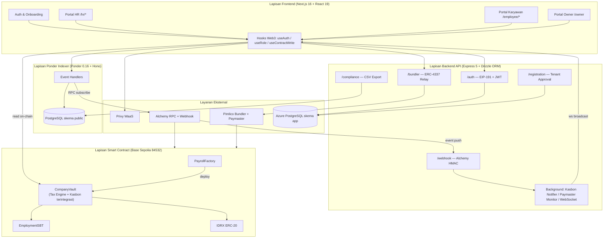

**Narasi Alur EWA Gasless End-to-End.** Ketika seorang karyawan menekan tombol "Tarik Gaji", frontend memanggil hook `useAuth` untuk memastikan sesi JWT aktif (atau melakukan tanda tangan EIP-191 baru melalui embedded wallet Privy). Karyawan kemudian menandatangani sebuah `UserOperation` ERC-4337 yang berisi calldata `claimSalary()`. UserOperation tersebut dikirim ke endpoint `POST /bundler/relay`. Backend memeriksa batas laju klaim (maksimum 10 per jam per karyawan) lalu meneruskan UserOperation ke Pimlico Bundler tanpa decode calldata tambahan — enforcement otoritatif (kecocokan JWT/sender, selektor, dan target) berada di `CompanyVault._validatePaymasterUserOp()` on-chain yang dipanggil EntryPoint saat validasi (lihat KI-004 di `KNOWN_ISSUES.md`). Pimlico melampirkan sponsor Paymaster dan mengirimkannya ke `EntryPoint` contract di Base. Kontrak `CompanyVault.claimSalary()` mengeksekusi distribusi atomik (platform fee → cicilan kasbon jika ada → PPh21/BPJS → severance → sisa ke karyawan), memancarkan event `SalaryClaimed` dan `PlatformFeePaid`. Alchemy mendeteksi event tersebut dan mengirimkannya ke `POST /webhook/alchemy`; backend memverifikasi tanda tangan HMAC, mencatat audit log, dan mem-broadcast pesan `SALARY_CLAIMED` melalui WebSocket ke dashboard karyawan, yang langsung menampilkan konfirmasi real-time. Secara paralel, Ponder mengindeks event tersebut ke tabel `salary_claim` untuk keperluan historis dan pelaporan kepatuhan.

### 2.2 Perancangan Rinci

> **[FLAG-BANDING-DOCX-LAMA]** Di docx lama, subbab kontrak ada 6: PayrollFactory, CompanyVault,
> `EmployeeLiquidityContract`, EmploymentSBT, `IDRXPriceOracle`, `ConfidentialCompanyVault`.
> Hapus 3 yang di-italic — sudah tidak ada di kodebase. Lihat ringkasan lengkap di flag atas
> dokumen (setelah Daftar Revisi).

#### 2.2.1 Kelas Diagram

Berikut adalah diagram kelas seluruh smart contract Payana:

```mermaid
classDiagram
    direction TB

    %% ── Library ──────────────────────────────────────────────────────────────
    class PayrollMath {
        <<library>>
        +uint256 SECONDS_PER_MONTH
        +uint256 BPS_DENOMINATOR
        +calcAccrued(uint256 flowRate, uint256 elapsed) uint256
        +monthlyToFlowRate(uint256 monthly) uint256
        +bpsOf(uint256 amount, uint256 bps) uint256
        +severanceMultiplier(uint256 tenureMonths) uint256
        +validateSplits(uint16 emp, uint16 comp, uint16 sev) bool
    }

    %% ── Enumerations ─────────────────────────────────────────────────────────
    class VaultStatus {
        <<enumeration>>
        Uninitialized
        Active
        Paused
        Frozen
    }

    class StreamStatus {
        <<enumeration>>
        Inactive
        Active
        Paused
        Cancelled
    }

    class SeveranceState {
        <<enumeration>>
        Locked
        Returned
        Released
    }

    class VestType {
        <<enumeration>>
        Retention
        Probation
        ESOP
    }

    class VestStatus {
        <<enumeration>>
        Locked
        Claimed
        Forfeited
    }

    class LoanStatus {
        <<enumeration>>
        None
        Active
        Repaid
        Defaulted
    }

    %% ── PayrollFactory ───────────────────────────────────────────────────────
    class PayrollFactory {
        +bytes32 SUPERADMIN_ROLE
        +uint16 MAX_PLATFORM_FEE_BPS
        +address immutable IDRX
        +address protocolTreasury
        +uint16 platformFeeBps
        +mapping companyVaults
        +address[] allVaults
        +setPlatformFee(uint16 newFeeBps)
        +setProtocolTreasury(address treasury)
        +deployVault(address hr, string name, address liq, address sbt) address
        +emergencyFreezeAll()
        +getTotalVaults() uint256
    }

    %% ── CompanyVault ─────────────────────────────────────────────────────────
    class EmployeeStream {
        <<struct>>
        +uint256 flowRate
        +uint256 startTs
        +uint256 lastWithdrawnTs
        +uint256 settledBalance
        +StreamStatus status
        +uint16 severanceBps
    }

    class SalaryAdvance {
        <<struct>>
        +uint256 amount
        +uint256 repaid
        +uint256 requestedAt
        +AdvanceStatus status
    }

    class SeveranceVault {
        <<struct>>
        +uint256 amount
        +SeveranceState state
        +uint256 tenureMonths
        +uint256 lastUpdatedTs
    }

    class TerminationProposal {
        <<struct>>
        +address employee
        +bool hrApproved
        +bool legalApproved
        +uint256 expiresAt
        +bytes32 reasonHash
        +uint256 flowRateSnapshot
    }

    class CliffVest {
        <<struct>>
        +address employee
        +uint256 amount
        +uint256 cliffTs
        +VestType vestType
        +VestStatus status
    }

    class CompanyVault {
        +bytes32 HR_ROLE
        +bytes32 LEGAL_ROLE
        +uint256 TERMINATION_EXPIRY
        +uint256 MAX_ADVANCE_BPS
        +uint256 ADVANCE_REPAY_BPS
        +IERC20 immutable IDRX
        +address immutable hrAuthority
        +IEmploymentSBT sbtContract
        +address factory
        +string companyName
        +VaultStatus status
        +uint16 bpjsBps
        +uint16 pph21Bps
        +uint16 lowBalanceThresholdBps
        +uint256 vestCounter
        +uint256 totalFlowRate
        +uint256 vaultBalance
        +uint256 complianceBalance
        +mapping employeeStreams
        +mapping severanceVaults
        +mapping terminations
        +mapping cliffVests
        +mapping employeeComplianceAccumulated
        +mapping salaryAdvances
        +fundVault(uint256 amount)
        +withdrawVault(uint256 amount, address recipient)
        +setCompanyConfig(uint16 bpjs, uint16 pph21, uint16 threshold)
        +pauseVault()
        +resumeVault()
        +freezeVault()
        +startStream(address employee, uint256 flowRate, uint16 severanceSplitBps)
        +pauseStream(address employee)
        +resumeStream(address employee)
        +updateFlowRate(address employee, uint256 newFlowRate)
        +updateStreamSplits(address employee, uint16 severanceSplitBps)
        +cancelStream(address employee)
        +claimSalary()
        +requestAdvance(uint256 amount)
        +approveAdvance(address employee)
        +rejectAdvance(address employee)
        +resignEmployee(address employee)
        +proposeTermination(address employee, bytes32 reasonHash)
        +approveTermination(address employee)
        +executeTermination(address employee)
        +cancelProposal(address employee)
        +withdrawCompliance(uint256 amount, address recipient)
        +createCliffVest(address employee, uint256 amount, uint256 cliffTs, VestType vestType)
        +claimCliffVest(uint256 vestId)
        +cancelCliffVest(address employee, uint256 vestId)
        +getAccrued(address employee) uint256
        +getVaultBalance() uint256
        +getSeveranceBalance(address employee) uint256
        +getStreamInfo(address employee) address_uint256
        -_forfeitAllVests(address employee)
        -_checkLowBalance()
        -_revokeSBT(address employee)
    }

    %% ── EmploymentSBT ────────────────────────────────────────────────────────
    class EmploymentRecord {
        <<struct>>
        +address hrAuthority
        +string companyName
        +uint256 startTs
    }

    class EmploymentSBT {
        +bytes32 MINTER_ROLE
        -uint256 _tokenIdCounter
        -string _baseTokenURI
        +mapping employmentRecords
        +mapping employeeTokenId
        +mint(address to, string companyName, address hrAuthority) uint256
        +revoke(address employee)
        +locked(uint256 tokenId) bool
        +setBaseURI(string uri)
        +supportsInterface(bytes4 interfaceId) bool
        -_update(address to, uint256 tokenId, address auth) address
        -_baseURI() string
    }

    %% ── Inheritance ──────────────────────────────────────────────────────────
    CompanyVault --|> ICompanyVault : implements
    CompanyVault --|> ReentrancyGuard : extends
    CompanyVault --|> AccessControl : extends
    EmploymentSBT --|> ERC721 : extends
    EmploymentSBT --|> IERC5192 : implements
    EmploymentSBT --|> AccessControl : extends
    PayrollFactory --|> AccessControl : extends

    %% ── Composition (structs owned by contract) ──────────────────────────────
    CompanyVault *-- EmployeeStream : contains
    CompanyVault *-- SeveranceVault : contains
    CompanyVault *-- TerminationProposal : contains
    CompanyVault *-- CliffVest : contains
    CompanyVault *-- SalaryAdvance : contains
    EmploymentSBT *-- EmploymentRecord : contains

    %% ── Associations (contract references) ──────────────────────────────────
    PayrollFactory ..> CompanyVault : deploys
    CompanyVault ..> EmploymentSBT : calls mint and revoke
    CompanyVault ..> PayrollMath : uses

    %% ── Enum usage ───────────────────────────────────────────────────────────
    CompanyVault ..> VaultStatus : uses
    CompanyVault ..> StreamStatus : uses
    CompanyVault ..> SeveranceState : uses
    CompanyVault ..> VestType : uses
    CompanyVault ..> VestStatus : uses
    CompanyVault ..> AdvanceStatus : uses
```


#### 2.2.2 Deskripsi Kelas dan Atribut


Seluruh kontrak dikompilasi dengan Solidity 0.8.26 dan OpenZeppelin Contracts v5. Seluruh nilai moneter dinyatakan dalam IDRX (18 desimal, 1 IDRX = 1 IDR). Pustaka `PayrollMath` menyediakan konstanta `SECONDS_PER_MONTH`, fungsi `calcAccrued(flowRate, lastTs)`, `bpsOf(amount, bps)`, `validateSplits(...)`, dan `severanceMultiplier(tenureMonths)`.

Pola keamanan yang diterapkan secara konsisten:

- **Checks-Effects-Interactions (CEI):** seluruh perubahan state dilakukan sebelum transfer eksternal.
- **ReentrancyGuard:** modifier `nonReentrant` pada fungsi yang mentransfer IDRX.
- **AccessControl berbasis peran:** modifier per peran (`onlyHR`, `onlyOps`, `onlyPayroll`, `onlyRole`).
- **SafeERC20:** `safeTransfer`/`safeTransferFrom` untuk seluruh perpindahan token.
- **Custom errors:** revert hemat gas dengan pesan terstruktur.

##### 2.2.2.1 PayrollFactory

Kontrak entry-point SaaS yang men-deploy `CompanyVault` terisolasi per tenant (Factory Pattern). Mewarisi `AccessControl`.

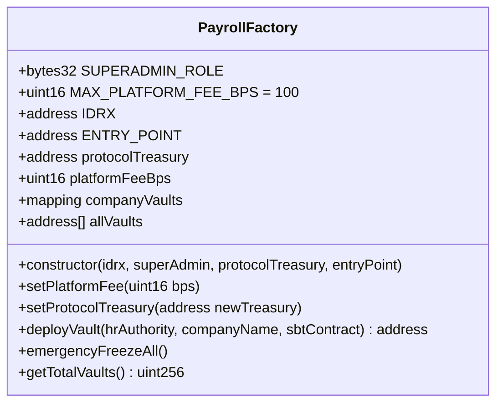

**State Variables:** `IDRX` (immutable), `ENTRY_POINT` (immutable, canonical ERC-4337 EntryPoint v0.7 — diteruskan ke setiap vault yang di-deploy), `protocolTreasury`, `platformFeeBps`, `companyVaults` (HR → vault), `allVaults` (array seluruh vault).

**Events:** `VaultDeployed(hrAuthority, vaultAddress, companyName)`, `PlatformFeeUpdated(newBps)`, `ProtocolTreasuryUpdated(newTreasury)`.

**[deployVault(hrAuthority, companyName, sbtContract)]**
| | |
|---|---|
| Input | hrAuthority: address, companyName: string, sbtContract: address |
| Output | `address` (alamat vault baru) |
| Deskripsi | external; callable oleh `hrAuthority` itu sendiri ATAU pemegang `SUPERADMIN_ROLE` (dicek via `require` inline, bukan modifier `onlyRole`); sesuai FR-PAYANA-201, FR-PAYANA-1001 |

**Algoritma (Check → Effect → Interaction):**

1. **Check:** tolak jika `msg.sender != hrAuthority` dan bukan pemegang `SUPERADMIN_ROLE` (`OnlyHRorSuperAdmin`); tolak `hrAuthority == address(0)` (`InvalidHRAddress`); tolak jika `companyVaults[hrAuthority] != 0` (`HRAlreadyHasVault`).
2. **Effect/Interaction:** deploy `new CompanyVault(IDRX, hrAuthority, companyName, sbtContract, ENTRY_POINT)`.
3. **Effect:** catat alamat ke `companyVaults[hrAuthority]` dan `allVaults.push(vault)`.
4. **Effect:** emit `VaultDeployed(hrAuthority, vault, companyName)`; kembalikan alamat vault.

**[setPlatformFee(bps)]**
| | |
|---|---|
| Input | newFeeBps: uint16 |
| Output | - |
| Deskripsi | external; modifier `onlyRole(SUPERADMIN_ROLE)`; sesuai FR-PAYANA-1006 |

**Algoritma:** Check `bps <= MAX_PLATFORM_FEE_BPS (100)` (`FeeTooHigh`); set `platformFeeBps = bps`; emit `PlatformFeeUpdated`.

**[setProtocolTreasury(newTreasury)]**
| | |
|---|---|
| Input | newTreasury: address |
| Output | - |
| Deskripsi | external; modifier `onlyRole(SUPERADMIN_ROLE)`; sesuai FR-PAYANA-1008 |

**Algoritma:** Check `newTreasury != address(0)`; set `protocolTreasury`; emit `ProtocolTreasuryUpdated`. Memungkinkan migrasi ke multisig.

**[emergencyFreezeAll()]**
| | |
|---|---|
| Input | - |
| Output | - |
| Deskripsi | external; modifier `onlyRole(SUPERADMIN_ROLE)`; sesuai FR-PAYANA-1004 |

**Algoritma:** Iterasi `allVaults`; untuk setiap vault panggil `freezeVault()`. Biaya gas linear terhadap jumlah vault.

**[getTotalVaults()]**
| | |
|---|---|
| Input | - |
| Output | `uint256` |
| Deskripsi | external view; sesuai FR-PAYANA-1002 |

**Algoritma:** Kembalikan `allVaults.length`.

##### 2.2.2.2 CompanyVault

Kontrak payroll per perusahaan: streaming gaji, split 93/5/2, PHK multi-sig, cliff vesting, dan kepatuhan. Mewarisi `ICompanyVault`, `ReentrancyGuard`, `AccessControl`.

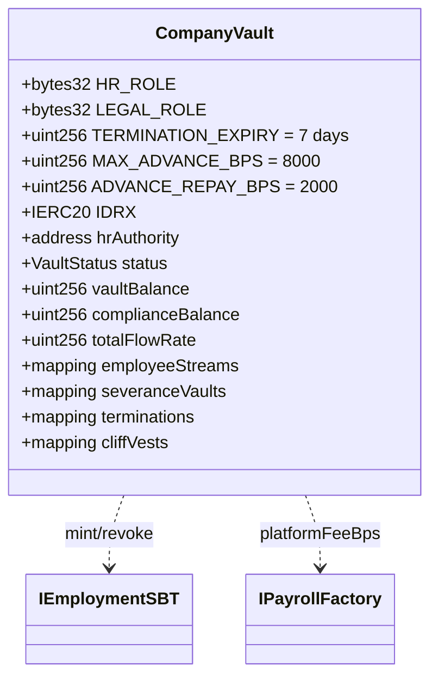

**Konstanta:** `TERMINATION_EXPIRY=7 days`, `MAX_ADVANCE_BPS=8000` (80%), `ADVANCE_REPAY_BPS=2000` (20%).

**Custom Errors:** `VaultFrozen`, `InsufficientVaultBalance`, `StreamAlreadyActive`, `StreamNotActive`, `NotWhitelisted`, `NothingToClaim`, `SplitInvalid`, `TerminationAlreadyProposed`, `TerminationNotFound`, `ProposalExpired`, `AlreadyApproved`, `NotVestedYet`, `AlreadyClaimed`, `VestNotFound`, `SeveranceAlreadySettled`, `InsufficientComplianceBalance`, `CliffNotReached`, `VestAlreadySettled`, `Unauthorized`, `NoActiveProposal`.

**Modifier:** `onlyHR` (cek `HR_ROLE`), `vaultActive` (status harus `Active`), `validTermination(employee)` (hrApproved && legalApproved && belum kadaluarsa).

**[constructor(idrx, hrAuthority, companyName, sbtContract, entryPoint)]**
| | |
|---|---|
| Input | idrx: address, hrAuthority: address, companyName: string, sbtContract: address, entryPoint: address |
| Output | - |
| Deskripsi | internal; dipanggil oleh `PayrollFactory.deployVault()` untuk inisialisasi vault baru |

Algoritma: Disetel oleh `PayrollFactory`. Set `IDRX`, `factory=msg.sender`, `hrAuthority`, `companyName`, `status=Active`, `sbtContract`. Berikan `DEFAULT_ADMIN_ROLE`, `HR_ROLE`, dan `LEGAL_ROLE` ke `hrAuthority`. Emit `VaultInitialized`.

**[fundVault(amount)]**
| | |
|---|---|
| Input | amount: uint256 |
| Output | - |
| Deskripsi | external override; modifier `onlyHR`; sesuai FR-PAYANA-202 |

**Algoritma:** `safeTransferFrom(msg.sender, this, amount)`; `vaultBalance += amount`; emit `VaultFunded`.

**[withdrawVault(amount, recipient)]**
| | |
|---|---|
| Input | amount: uint256, recipient: address |
| Output | - |
| Deskripsi | external override; modifier `onlyHR nonReentrant`; sesuai FR-PAYANA-203 |

**Algoritma (CEI):**

1. **Check:** `vaultBalance >= amount` (`InsufficientVaultBalance`).
2. **Effect:** `vaultBalance -= amount`; panggil `_checkLowBalance()`.
3. **Interaction:** `safeTransfer(recipient, amount)`; emit `VaultWithdrawn`.

**[setCompanyConfig(bpjsBps, pph21Bps, lowBalanceThresholdBps)]**
| | |
|---|---|
| Input | bpjsBps: uint16, pph21Bps: uint16, lowBalanceThresholdBps: uint16 |
| Output | - |
| Deskripsi | external override; modifier `onlyHR`; sesuai FR-PAYANA-204, FR-PAYANA-802 |

**Algoritma:** Set `bpjsBps`, `pph21Bps`, `lowBalanceThresholdBps`. Nilai BPJS/PPh21 bersifat informatif (tidak memengaruhi split langsung).

**[pauseVault() / resumeVault() / freezeVault()]**
| | |
|---|---|
| Input | - |
| Output | - |
| Deskripsi | external override; modifier `pauseVault`/`resumeVault`: `onlyHR`; `freezeVault`: factory atau `DEFAULT_ADMIN_ROLE`; sesuai FR-PAYANA-205, FR-PAYANA-206 |

**Algoritma:**

- `pauseVault`: tolak jika `status == Frozen`; set `status = Paused`; emit `VaultPaused`.
- `resumeVault`: tolak jika `status == Frozen`; set `status = Active`; emit `VaultResumed`.
- `freezeVault`: hanya `factory` atau pemegang `DEFAULT_ADMIN_ROLE` (`Unauthorized`); set `status = Frozen` (irreversible); emit `VaultFreeze`.

**[startStream(employee, flowRate, severanceSplitBps)]**
| | |
|---|---|
| Input | employee: address, flowRate: uint256, severanceSplitBps: uint16 |
| Output | - |
| Deskripsi | external override; modifier `onlyHR vaultActive`; sesuai FR-PAYANA-301, FR-PAYANA-901 |

**Alur Interaksi:**

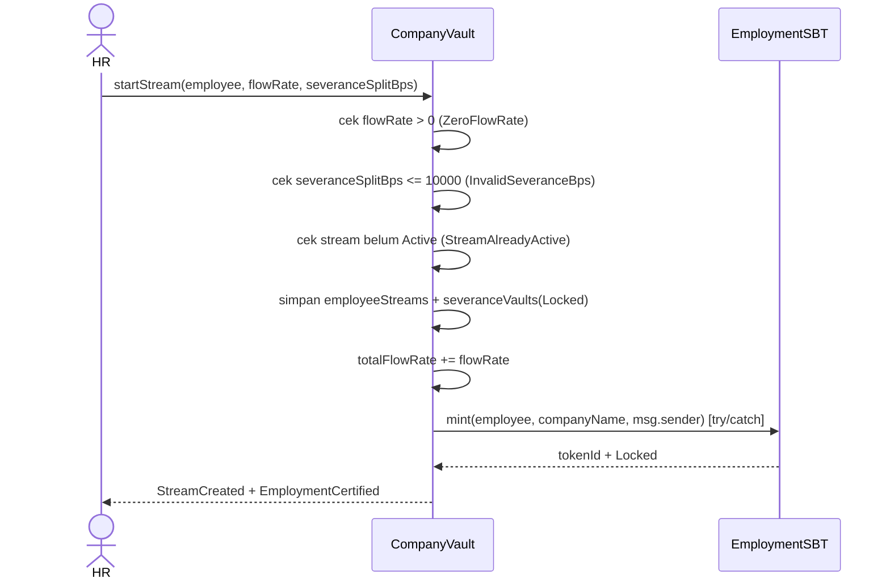

**Algoritma:**

1. **Check:** `flowRate > 0` (`ZeroFlowRate`); `severanceSplitBps <= 10_000` (`InvalidSeveranceBps`); stream belum `Active` (`StreamAlreadyActive`).
2. **Effect:** buat `EmployeeStream` (status `Active`, `startTs/lastWithdrawnTs = now`, `settledBalance=0`, `severanceBps=severanceSplitBps`); buat `SeveranceVault` (`Locked`); `totalFlowRate += flowRate`.
3. **Effect:** emit `StreamCreated`.
4. **Interaction:** `sbtContract.mint(employee, companyName, msg.sender)` (try/catch); emit `EmploymentCertified` jika berhasil.

**[pauseStream / resumeStream / updateFlowRate / updateStreamSplits / cancelStream]**
| | |
|---|---|
| Input | employee: address (+ parameter tambahan sesuai fungsi) |
| Output | - |
| Deskripsi | external override; modifier `onlyHR`; sesuai FR-PAYANA-302 s.d. FR-PAYANA-306 |

**Algoritma:**

- `pauseStream(employee)`: stream harus `Active` (`StreamNotActive`); settle `settledBalance += calcAccrued(flowRate, lastWithdrawnTs)`; `lastWithdrawnTs = now`; set `Paused`; emit `StreamPaused`.
- `resumeStream(employee)`: stream harus `Paused`; `lastWithdrawnTs = now`; set `Active`; emit `StreamResumed`.
- `updateFlowRate(employee, newFlowRate)`: stream harus `Active`; settle dahulu pada rate lama; `totalFlowRate = totalFlowRate - old + new`; set `flowRate = newFlowRate`; emit `FlowRateUpdated`.
- `updateStreamSplits(employee, ...)`: stream `Active`/`Paused`; validasi split = 10.000; settle jika `Active`; set splits baru; emit `StreamSplitsUpdated`.
- `cancelStream(employee)`: tolak jika sudah `Cancelled`/`Inactive`; jika `Active` settle dan kurangi `totalFlowRate`; set `Cancelled`; emit `StreamCancelled`.

**[claimSalary()]**
| | |
|---|---|
| Input | - |
| Output | - |
| Deskripsi | external override; modifier `nonReentrant vaultActive`; sesuai FR-PAYANA-401, FR-PAYANA-1007 |

**Alur Interaksi:**

```mermaid
sequenceDiagram
    actor E as Karyawan
    participant V as CompanyVault
    participant F as PayrollFactory
    participant T as protocolTreasury
    E->>V: claimSalary()
    V->>V: hitung accrued (settled + live)
    V->>V: cek accrued>0 & vaultBalance>=accrued
    V->>V: Effects: settledBalance=0, vaultBalance-=accrued, _checkLowBalance()
    V->>F: platformFeeBps()
    F-->>V: feeBps
    V->>V: net = accrued - platformCut
    V->>V: kasbonRepaid = _autoRepayAdvance(employee, net); net -= kasbonRepaid
    V->>V: hitung PPh21 (TER/override) + BPJS -> toCompliance; toSeverance = bpsOf(net, severanceBps)
    V->>V: toEmployee = net - toCompliance - toSeverance
    V->>T: safeTransfer(platformCut) + PlatformFeePaid
    V->>E: safeTransfer(toEmployee)
    V-->>E: SalaryClaimed(..., kasbonRepaid)
    V-->>E: TaxWithheld(pph21Amount, bpjsAmount)
```

**Algoritma (CEI):**

1. **Check:** stream tidak `Inactive` (`NotWhitelisted`) dan tidak `Paused` (`StreamNotActive`).
2. **Check:** hitung `accrued = settledBalance + calcAccrued(flowRate, lastWithdrawnTs)` (atau hanya `settledBalance` bila tidak aktif); tolak `accrued == 0` (`NothingToClaim`) dan `vaultBalance < accrued` (`InsufficientVaultBalance`).
3. **Effect:** `settledBalance = 0`; perbarui `lastWithdrawnTs` jika aktif; `vaultBalance -= accrued`; `_checkLowBalance()`.
4. **Effect:** hitung `platformCut = bpsOf(accrued, feeBps)` jika `feeBps > 0`; `net = accrued - platformCut`.
5. **Effect:** `kasbonRepaid = _autoRepayAdvance(msg.sender, net)` — memotong `min(20% net, sisa kasbon)` jika kasbon berstatus `Active`; `net -= kasbonRepaid`; `vaultBalance += kasbonRepaid` (dana kembali ke pool payroll).
6. **Effect:** `effectivePph21Bps = pph21Bps > 0 ? pph21Bps : PayrollMath.calcPPh21TerBps(annualGross)`; `toCompliance = bpsOf(net, effectivePph21Bps + bpjsBps)`; `toSeverance = bpsOf(net, severanceBps)`; `toEmployee = net - toCompliance - toSeverance` (dust ke karyawan).
7. **Effect:** tambah `complianceBalance` dan `employeeComplianceAccumulated`; tambah `severanceVaults.amount`; perbarui `tenureMonths = (now - startTs)/SECONDS_PER_MONTH`.
8. **Interaction:** `safeTransfer(platformCut)` ke treasury (+`PlatformFeePaid`), `safeTransfer(toEmployee)` ke karyawan; emit `SalaryClaimed(..., kasbonRepaid)` dan `TaxWithheld(pph21Amount, bpjsAmount)`.

**[resignEmployee(employee)]**
| | |
|---|---|
| Input | employee: address |
| Output | - |
| Deskripsi | external override; modifier `onlyHR nonReentrant`; sesuai FR-PAYANA-505 |

**Algoritma:**

1. **Check:** stream tidak `Inactive` (`NotWhitelisted`); severance harus `Locked` (`SeveranceAlreadySettled`).
2. **Effect:** settle stream jika `Active`, kurangi `totalFlowRate`, set `Cancelled`.
3. **Effect:** pesangon dikembalikan ke `vaultBalance` (bukan ke karyawan); set state `Returned`.
4. **Interaction:** `_forfeitAllVests(employee)`; `_revokeSBT(employee)`; emit `StreamCancelled` + `SeveranceReturned`.

**[proposeTermination(employee, reasonHash)]**
| | |
|---|---|
| Input | employee: address, reasonHash: bytes32 |
| Output | - |
| Deskripsi | external override; modifier `onlyHR`; sesuai FR-PAYANA-501 |

**Algoritma:**

1. **Check:** stream tidak `Inactive` (`NotWhitelisted`); tidak ada proposal aktif yang belum kadaluarsa (`TerminationAlreadyProposed`).
2. **Effect:** buat `TerminationProposal` (`hrApproved=true`, `legalApproved=false`, `expiresAt=now+7 days`, `reasonHash`, `flowRateSnapshot=flowRate`); emit `TerminationProposed`.

**[approveTermination(employee)]**
| | |
|---|---|
| Input | employee: address |
| Output | - |
| Deskripsi | external override; modifier — (cek peran internal); sesuai FR-PAYANA-502 |

**Algoritma:**

1. **Check:** proposal ada (`TerminationNotFound`) dan belum kadaluarsa (`ProposalExpired`).
2. **Effect:** jika pemanggil `HR_ROLE` set `hrApproved` (tolak ganda `AlreadyApproved`); jika `LEGAL_ROLE` set `legalApproved`; selain itu `Unauthorized`; emit `TerminationApproved`.

**[executeTermination(employee)]**
| | |
|---|---|
| Input | employee: address |
| Output | - |
| Deskripsi | external override; modifier `validTermination(employee) nonReentrant`; sesuai FR-PAYANA-503, FR-PAYANA-504, FR-PAYANA-506 |

**Alur Interaksi:**

```mermaid
sequenceDiagram
    actor HR
    participant V as CompanyVault
    participant SBT as EmploymentSBT
    participant E as Karyawan
    HR->>V: executeTermination(employee)
    V->>V: validTermination (hr & legal approved, belum kadaluarsa)
    V->>V: settle stream + totalFlowRate -= flowRate; status Cancelled
    V->>V: statutory = severanceMultiplier(tenureMonths) * (snapshot * SECONDS_PER_MONTH)
    alt accumulated < statutory
        V->>V: topUp dari vaultBalance (atau parsial + SeveranceShortfall)
    end
    V->>V: amount = accumulated + topUp; state Released
    V->>V: _forfeitAllVests + delete proposal
    V->>SBT: revoke(employee) [try/catch]
    V->>E: safeTransfer(amount)
    V-->>HR: SeveranceReleased + TerminationExecuted
```

**Algoritma (CEI):**

1. **Check:** modifier `validTermination` memastikan kedua persetujuan dan belum kadaluarsa.
2. **Effect:** settle stream jika `Active`, kurangi `totalFlowRate`, set `Cancelled`.
3. **Effect:** hitung `monthlyGross = flowRateSnapshot * SECONDS_PER_MONTH`; `statutory = severanceMultiplier(tenureMonths) * monthlyGross`.
4. **Effect:** jika `accumulated < statutory`, ambil `topUp` dari `vaultBalance`; jika tidak cukup, `topUp = vaultBalance` (parsial, `hasShortfall=true`); `vaultBalance -= topUp`.
5. **Effect:** `amount = accumulated + topUp`; set `state = Released`; `_forfeitAllVests(employee)`; `_revokeSBT(employee)`; `delete terminations[employee]`.
6. **Interaction:** `safeTransfer(employee, amount)`; emit `StreamCancelled`, `SeveranceReleased`, `SeveranceShortfall` (jika ada), `TerminationExecuted`.

**[cancelProposal(employee)]**
| | |
|---|---|
| Input | employee: address |
| Output | - |
| Deskripsi | external override; modifier `onlyHR`; sesuai FR-PAYANA-501 |

**Algoritma:** Check proposal masih aktif (hrApproved && !legalApproved && belum kadaluarsa) (`NoActiveProposal`); `delete terminations[employee]`; emit `TerminationCancelled`.

**[withdrawCompliance(amount, recipient)]**
| | |
|---|---|
| Input | amount: uint256, recipient: address |
| Output | - |
| Deskripsi | external override; modifier `onlyHR nonReentrant`; sesuai FR-PAYANA-803 |

**Algoritma (CEI):** Check `complianceBalance >= amount` (`InsufficientComplianceBalance`); `complianceBalance -= amount`; `safeTransfer(recipient, amount)`; emit `ComplianceWithdrawn`.

**[createCliffVest(employee, amount, cliffTs, vestType)]**
| | |
|---|---|
| Input | employee: address, amount: uint256, cliffTs: uint256, vestType: VestType |
| Output | - |
| Deskripsi | external override; modifier `onlyHR`; sesuai FR-PAYANA-601, FR-PAYANA-605 |

**Algoritma:**

1. **Check:** `cliffTs > now` (`"CliffInPast"`); `vaultBalance >= amount` (`InsufficientVaultBalance`).
2. **Effect:** `vestId = vestCounter++`; simpan `CliffVest` (`Locked`); `vaultBalance -= amount`; `_checkLowBalance()`; emit `CliffVestCreated`.

**[claimCliffVest(vestId)]**
| | |
|---|---|
| Input | vestId: uint256 |
| Output | - |
| Deskripsi | external override; modifier `nonReentrant`; sesuai FR-PAYANA-602 |

**Algoritma (CEI):**

1. **Check:** vest ada (`VestNotFound`); status `Locked` (`VestAlreadySettled`); `now >= cliffTs` (`CliffNotReached`).
2. **Effect:** `amount = vest.amount`; `vest.amount = 0`; `status = Claimed`.
3. **Interaction:** `safeTransfer(msg.sender, amount)`; emit `CliffVestClaimed`.

**[cancelCliffVest(employee, vestId)]**
| | |
|---|---|
| Input | employee: address, vestId: uint256 |
| Output | - |
| Deskripsi | external override; modifier `onlyHR`; sesuai FR-PAYANA-603 |

**Algoritma:** Check vest ada dan `Locked`; set `amount=0`, status `Forfeited`; `vaultBalance += amount`; emit `CliffVestForfeited`.

**Fungsi Internal**

- `_forfeitAllVests(employee)`: iterasi `0..vestCounter`; setiap vest `Locked` dengan `amount>0` di-forfeit dan dikembalikan ke `vaultBalance` (O(vestCounter)).
- `_checkLowBalance()`: no-op jika `totalFlowRate==0`; hitung `monthlyNeed = totalFlowRate * SECONDS_PER_MONTH` dan `threshold = bpsOf(monthlyNeed, lowBalanceThresholdBps)`; emit `LowVaultBalance` jika `vaultBalance < threshold`.
- `_revokeSBT(employee)`: jika ada `tokenId`, panggil `sbtContract.revoke(employee)` (try/catch); emit `EmploymentRevoked`.

**Fungsi View**

| Fungsi | Return | FR Terkait |
|--------|--------|-----------|
| `getAccrued(employee)` | saldo terakumulasi (settled + live) | FR-PAYANA-402 |
| `getVaultBalance()` | `vaultBalance` | FR-PAYANA-202 |
| `getSeveranceBalance(employee)` | `severanceVaults[employee].amount` | FR-PAYANA-506 |
| `getStreamInfo(employee)` | `(address(this), flowRate)` — dipakai frontend untuk hitung limit kasbon (80% gaji bulanan) | FR-PAYANA-704 |

##### 2.2.2.3 Mesin Pajak & Kasbon (terintegrasi di CompanyVault)

Modul ini menyediakan dua kapabilitas yang terintegrasi langsung di `CompanyVault`: (1) perhitungan PPh21/BPJS otomatis saat `claimSalary()` (lihat 2.2.2.2), dan (2) fasilitas kasbon (`SalaryAdvance`) yang dananya bersumber langsung dari `vaultBalance` perusahaan — bukan pool lender pihak ketiga.

**Konstanta terkait:** `MAX_ADVANCE_BPS = 8000` (80% dari gaji bulanan), `ADVANCE_REPAY_BPS = 2000` (20% dari net setiap klaim).

**Custom Errors:** `AdvancePendingExists`, `ActiveAdvanceExists`, `NoAdvancePending`, `AdvanceAmountTooHigh`.

**[requestAdvance(amount)]**
| | |
|---|---|
| Input | amount: uint256 |
| Output | - |
| Deskripsi | external override; modifier `vaultActive`; sesuai FR-PAYANA-704 |

**Algoritma:**

1. **Check:** stream pemanggil `Active` (`StreamNotActive`); tidak ada `SalaryAdvance` berstatus `Pending` (`AdvancePendingExists`) atau `Active` (`ActiveAdvanceExists`).
2. **Check:** `monthlyGross = flowRate * SECONDS_PER_MONTH`; `maxAdvance = bpsOf(monthlyGross, MAX_ADVANCE_BPS)`; tolak jika `amount > maxAdvance` (`AdvanceAmountTooHigh`).
3. **Effect:** `salaryAdvances[msg.sender] = {amount, repaid: 0, requestedAt: now, status: Pending}`; emit `AdvanceRequested`.

**[approveAdvance(employee)]**
| | |
|---|---|
| Input | employee: address |
| Output | - |
| Deskripsi | external override; modifier `onlyHR nonReentrant`; sesuai FR-PAYANA-705 |

**Algoritma (CEI):**

1. **Check:** status `Pending` (`NoAdvancePending`); `vaultBalance >= adv.amount` (`InsufficientVaultBalance`).
2. **Effect:** status = `Active`; `vaultBalance -= adv.amount`; `_checkLowBalance()`.
3. **Interaction:** `safeTransfer(employee, adv.amount)`; emit `AdvanceApproved`.

**[rejectAdvance(employee)]**
| | |
|---|---|
| Input | employee: address |
| Output | - |
| Deskripsi | external override; modifier `onlyHR`; sesuai FR-PAYANA-705 |

**Algoritma:** Check status `Pending` (`NoAdvancePending`); `delete salaryAdvances[employee]`; emit `AdvanceRejected`.

**[_autoRepayAdvance(employee, available) — internal]**

Dipanggil dari dalam `claimSalary()` (lihat 2.2.2.2, langkah 5). Bukan fungsi publik.

**Algoritma:**

1. **Check:** jika status bukan `Active`, kembalikan 0.
2. **Effect:** `outstanding = adv.amount - adv.repaid`; `maxRepay = bpsOf(available, ADVANCE_REPAY_BPS)`; `repaid = min(outstanding, maxRepay)`; `adv.repaid += repaid`.
3. **Effect:** jika `adv.amount - adv.repaid == 0`, `delete salaryAdvances[employee]` (status implisit menjadi `Repaid`); emit `AdvanceRepaid(employee, repaid, remaining)`. Nilai `repaid` dikembalikan ke `claimSalary()` yang menambahkannya kembali ke `vaultBalance`.

**Catatan siklus hidup:** pada `resignEmployee()` dan `executeTermination()`, `salaryAdvances[employee]` dihapus tanpa penagihan lebih lanjut atas sisa kasbon (bad debt — trade-off desain MVP yang disengaja; pesangon yang telah terakumulasi tetap dapat diklaim penuh oleh karyawan, lihat FR-PAYANA-706).

##### 2.2.2.4 EmploymentSBT

Sertifikat ketenagakerjaan Soulbound (ERC-5192). Mewarisi `ERC721`, `IERC5192`, `AccessControl`. Nama token: "Finley Employment Certificate" (FEMP).

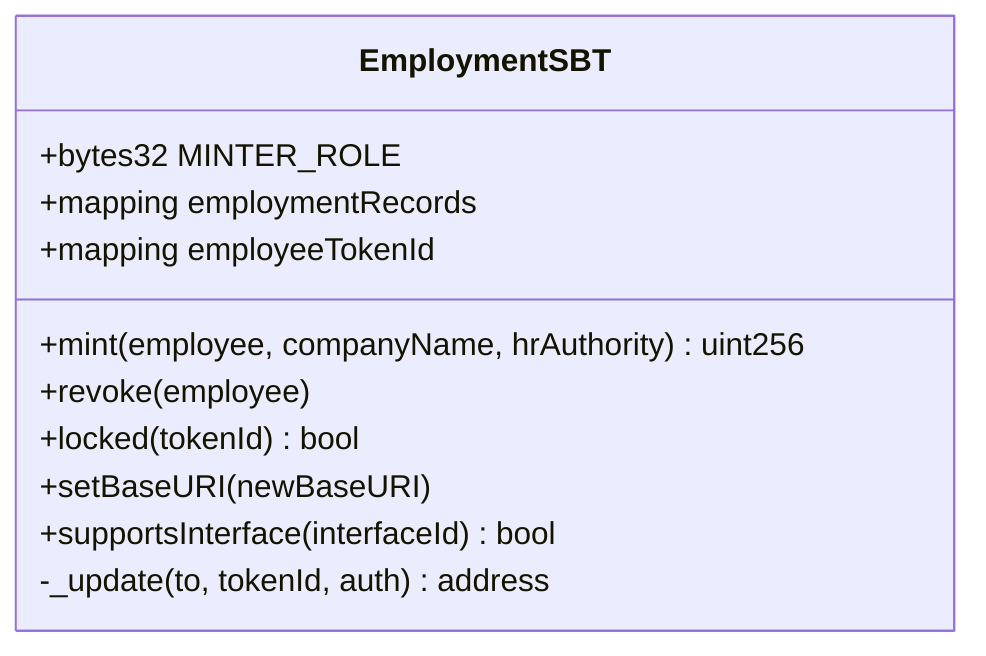

**Custom Errors:** `AlreadyHasToken(employee)`, `NoTokenFound(employee)`, `SoulboundTransferNotAllowed`.

**[mint(employee, companyName, hrAuthority)]**
| | |
|---|---|
| Input | employee: address, companyName: string, hrAuthority: address |
| Output | uint256 (tokenId) |
| Deskripsi | external; modifier `onlyRole(MINTER_ROLE)`; sesuai FR-901, FR-902 |

Algoritma: Tolak jika sudah punya token (`AlreadyHasToken`); tokenId monoton mulai 1; simpan `EmploymentRecord{hrAuthority, companyName, startTs}`; emit `Locked(tokenId)`; kembalikan tokenId.

**[revoke(employee)]**
| | |
|---|---|
| Input | employee: address |
| Output | - |
| Deskripsi | external; modifier `onlyRole(MINTER_ROLE)`; sesuai FR-903 |

Algoritma: Hapus `employeeTokenId` dan `employmentRecords`; burn token.

**[locked(tokenId)]**
| | |
|---|---|
| Input | tokenId: uint256 |
| Output | bool |
| Deskripsi | external view; sesuai FR-905 |

Algoritma: Selalu `true` (ERC-5192).

**[setBaseURI(newBaseURI)]**
| | |
|---|---|
| Input | newBaseURI: string |
| Output | - |
| Deskripsi | external; modifier `onlyRole(DEFAULT_ADMIN_ROLE)` |

Algoritma: Perbarui base URI metadata.

**[supportsInterface(interfaceId)]**
| | |
|---|---|
| Input | interfaceId: bytes4 |
| Output | bool |
| Deskripsi | public view; sesuai FR-905 |

Algoritma: Deklarasi dukungan `IERC5192`.

**[_update(to, tokenId, auth)] [internal]**
| | |
|---|---|
| Input | to: address, tokenId: uint256, auth: address |
| Output | address |
| Deskripsi | internal override; sesuai FR-905 |

Algoritma: Blokir transfer P2P (`SoulboundTransferNotAllowed`); hanya mint (from=0) dan burn (to=0) diizinkan.

### 2.3 Perancangan Data

> **[FLAG-BANDING-DOCX-LAMA]** ERD di docx lama masih punya tabel koperasi (`pools`,
> `lenderDeposits`, `loanRecords`, `liquidity_pool`, `lender_deposit`, `loan_record`) dan FHE
> (`encrypted_salary`, `auditor_grant`) — ganti dengan `salary_advance`/`salaryAdvances`, dan
> tambahkan tabel off-chain baru yang belum ada di docx lama (reimburse, bounty, company
> settings, tips, suspended clients, compliance reconciliation, phk reasons, notifications,
> employee profiles, employment letters). Detail lengkap di flag atas dokumen.

#### 2.3.1 Dekomposisi Data


Data dalam sistem Payana didistribusikan ke dalam tiga lapisan penyimpanan yang saling melengkapi:

1. **On-Chain (Solidity storage di Base Sepolia).** Menyimpan seluruh state finansial dan logika bisnis inti: saldo vault, konfigurasi stream per karyawan (`employeeStreams`), vault pesangon (`severanceVaults`), proposal PHK (`terminations`), cliff vest (`cliffVests`), serta kasbon (`salaryAdvances`). State on-chain bersifat immutable dan menjadi sumber kebenaran (source of truth) untuk semua nilai moneter.

2. **Off-Chain PostgreSQL (skema `app`, Azure Indonesia Central).** Menyimpan data yang tidak boleh atau tidak efisien disimpan on-chain: sesi JWT (`sessions`), profil PII karyawan terenkripsi AES-256-GCM (`employees`), audit log backend (`audit_logs`), deduplikasi event webhook (`webhook_events`), counter rate limit (`rate_limits`), catatan kasbon sisi backend (`salary_advances`), dan antrian registrasi tenant (`pending_registrations`). Penyimpanan PII off-chain merupakan pemenuhan UU PDP No. 27/2022.

3. **Ponder Indexed PostgreSQL (skema `public`).** Menyimpan salinan terindeks dari event on-chain dalam bentuk tabel relasional yang dapat dikueri cepat: `company`, `employee_stream`, `salary_claim`, `severance_vault`, `termination_proposal`, `cliff_vest`, `compliance_vault`, `salary_advance`, `employment_certificate`, `platform_fee_payment`, dan `low_balance_alert`. Lapisan ini menghindarkan frontend dan backend dari kebutuhan iterasi RPC langsung untuk pembacaan agregat.

##### ERD On-Chain (Solidity Structs & Mappings)

State on-chain disimpan dalam struct dan mapping pada masing-masing kontrak. Diagram berikut menggambarkan relasi konseptual antar entitas on-chain (kunci pemetaan adalah alamat Ethereum).

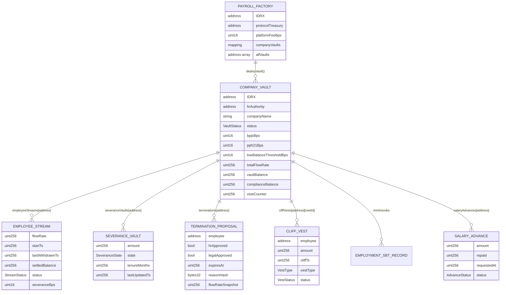

**Catatan Enumerasi On-Chain:**

- `VaultStatus`: Uninitialized, Active, Paused, Frozen.
- `StreamStatus`: Inactive, Active, Paused, Cancelled.
- `SeveranceState`: Locked, Returned, Released.
- `VestType`: Retention, Probation, ESOP.
- `VestStatus`: Locked, Claimed, Forfeited.
- `AdvanceStatus`: None, Pending, Active. Tidak ada nilai enum terpisah untuk "Rejected"/"Repaid" — `rejectAdvance()` dan pelunasan penuh via `_autoRepayAdvance()` sama-sama melakukan `delete salaryAdvances[employee]`, yang mengembalikan status ke `None` secara on-chain. Status "Rejected"/"Repaid" yang ditampilkan di UI berasal dari riwayat event (`AdvanceRejected`/`AdvanceRepaid`) yang diindeks off-chain oleh Ponder, bukan dari pembacaan langsung state kontrak saat ini.

##### ERD Off-Chain (PostgreSQL — skema `app`)

Tabel off-chain dikelola Drizzle ORM dalam skema `app`. Tabel-tabel ini independen (tidak ada foreign key relasional formal antar tabel; keterhubungan logis melalui kolom `address`).

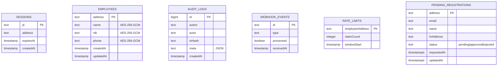

**Rincian Tabel Off-Chain:**

| Tabel | Kolom Kunci | Tujuan | FR Terkait |
|-------|-------------|--------|-----------|
| `sessions` | `jti` (PK) | Revocation JWT berbasis JTI | FR-102, 103 |
| `employees` | `address` (PK) | Penyimpanan PII terenkripsi | FR-104, 105 |
| `audit_logs` | `id` (PK, identity) | Audit trail backend immutable | FR-1002 |
| `webhook_events` | `id` (PK) | Deduplikasi event Alchemy | FR-405 |
| `rate_limits` | `employeeAddress` (PK) | Counter klaim per jam | FR-404 |
| `pending_registrations` | `address` (PK) | Antrian persetujuan tenant | FR-107, 108, 109 |

##### ERD Ponder Indexed (PostgreSQL — skema `public`)

Tabel terindeks Ponder direpresentasikan dengan `onchainTable`. Kolom yang dipakai langsung oleh SQL backend (mis. `salary_claim`) di-pin secara eksplisit ke snake_case agar kompatibel dengan kueri SQL mentah pada backend compliance dan liquidation.

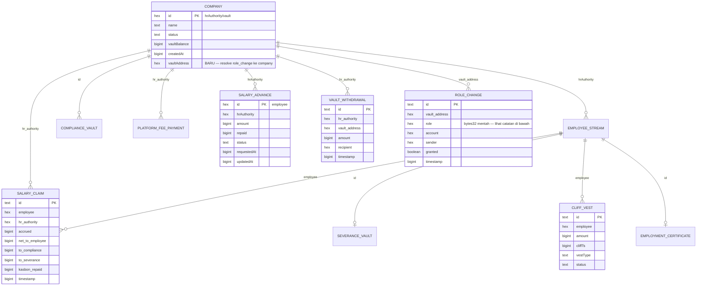

**Rincian Tabel Ponder Indexed:**

| Tabel | Kunci | Sumber Event | Dipakai oleh |
|-------|-------|--------------|--------------|
| `company` | `id` (vault/HR) | `VaultDeployed`, `VaultInitialized` | `useRole`, `/owner`, `/hr/onboarding` |
| `employee_stream` | `employee` | `StreamCreated`, `FlowRate/Splits/Status` | `/hr/employees`, `/employee/ewa` |
| `salary_claim` | `id` | `SalaryClaimed` | `/compliance/*`, `/employee/audit` |
| `severance_vault` | `id` | `SeveranceReleased/Returned` | `/employee/severance` |
| `cliff_vest` | `id` | `CliffVestCreated/Claimed/Forfeited` | `/hr/vesting`, `/employee/vesting` |
| `salary_advance` | `employee` | `AdvanceRequested/Approved/Rejected/Repaid` | `/hr/kasbon`, `/employee/kasbon` |
| `platform_fee_payment` | `id` | `PlatformFeePaid` | `/owner` |
| `employment_certificate` | `id` | `EmploymentCertified/Revoked` | `/verify` |
| `low_balance_alert` | `id` | `LowVaultBalance` | `/hr/vault` |
| `vault_withdrawal` | `id` | `VaultWithdrawn` `[BARU]` | `anomalyDetector.ts` (lihat Lampiran B.6) |
| `role_change` | `id` | `RoleGranted`/`RoleRevoked` `[BARU]` | `anomalyDetector.ts` (lihat Lampiran B.6) |

> **Catatan (`role_change.role`):** disimpan sebagai hash `bytes32` mentah — `keccak256("HR_ROLE")` = `0xfd70517941c75212b0f9013e45c47a37d6d983c5304288c7af285f2ea40cbba7`, `keccak256("LEGAL_ROLE")` = `0xb9f13ecb5e7f0f859c44b76b3a163e504787b446da95a26bf75e53e1ff4a1e0e`, `DEFAULT_ADMIN_ROLE` = `bytes32(0)`. Interpretasi nama peran dilakukan di `anomalyDetector.ts` (`roleName()`), bukan di handler Ponder — menjaga handler tetap sebagai mirror event yang dumb dan reliable.
>
> **Catatan (`RoleGranted`/`RoleRevoked`):** kedua event ini adalah event bawaan `AccessControl` OpenZeppelin yang diwarisi `CompanyVault` — sudah diemit sejak kontrak pertama kali di-deploy, hanya saja sebelumnya tidak ada di ABI yang dipakai Ponder (`abis/PayrollContractAbi.ts`) sehingga tidak pernah diindeks. Menambahkannya adalah perubahan murni di lapisan indexing, **tidak memerlukan redeploy kontrak** — backfill otomatis mengindeks ulang seluruh riwayat `RoleGranted` sejak `startBlock`, termasuk grant `HR_ROLE`/`DEFAULT_ADMIN_ROLE` awal saat setiap vault pertama kali dibuat.

---

##### Dekomposisi Data — Off-Chain (Skema `app`)

Tabel-tabel berikut adalah bagian dari skema PostgreSQL `app` yang dikelola oleh Drizzle ORM. Semua data PII dienkripsi dengan AES-256-GCM sebelum disimpan.

**Tabel `sessions`**

| Nama Field | Tipe Data | Null | Konstrain | Range Nilai | Default | Keterangan |
|------------|-----------|------|-----------|-------------|---------|------------|
| `jti` | `text` | NOT NULL | PRIMARY KEY | UUID v4 | — | JWT unique identifier; digunakan untuk revokasi token |
| `address` | `text` | NOT NULL | — | Hex 0x + 40 char | — | Wallet address karyawan/HR (lowercase) |
| `expires_at` | `timestamp` | NOT NULL | — | > created_at | — | Waktu kedaluwarsa token JWT |
| `created_at` | `timestamp` | NOT NULL | — | — | `now()` | Waktu token dibuat |

**Tabel `employees`**

| Nama Field | Tipe Data | Null | Konstrain | Range Nilai | Default | Keterangan |
|------------|-----------|------|-----------|-------------|---------|------------|
| `address` | `text` | NOT NULL | PRIMARY KEY | Hex 0x + 40 char | — | Wallet address karyawan (lowercase) |
| `name` | `text` | NOT NULL | — | — | — | Nama lengkap, terenkripsi AES-256-GCM |
| `nik` | `text` | NOT NULL | — | 16 digit | — | Nomor Induk Kependudukan, terenkripsi AES-256-GCM |
| `phone` | `text` | NOT NULL | — | — | — | Nomor telepon, terenkripsi AES-256-GCM |
| `created_at` | `timestamp` | NOT NULL | — | — | `now()` | Waktu record dibuat |
| `updated_at` | `timestamp` | NOT NULL | — | — | `now()` | Waktu record terakhir diperbarui |

**Tabel `audit_logs`**

| Nama Field | Tipe Data | Null | Konstrain | Range Nilai | Default | Keterangan |
|------------|-----------|------|-----------|-------------|---------|------------|
| `id` | `bigint` | NOT NULL | PRIMARY KEY GENERATED ALWAYS AS IDENTITY | ≥ 1 | auto | Auto-increment log ID |
| `action` | `text` | NOT NULL | — | `BUNDLER_RELAY` \| `COMPLIANCE_EXPORT` \| dll. | — | Jenis aksi yang diaudit |
| `actor` | `text` | NOT NULL | — | Hex 0x + 40 char | — | Alamat wallet pelaku (HR atau karyawan) |
| `tx_hash` | `text` | NULL | — | Hex 0x + 64 char | `NULL` | Hash transaksi on-chain (null jika belum on-chain) |
| `meta` | `text` | NULL | — | JSON string | `NULL` | Konteks tambahan dalam format JSON |
| `created_at` | `timestamp` | NOT NULL | — | — | `now()` | Waktu log dicatat |

**Tabel `webhook_events`**

| Nama Field | Tipe Data | Null | Konstrain | Range Nilai | Default | Keterangan |
|------------|-----------|------|-----------|-------------|---------|------------|
| `id` | `text` | NOT NULL | PRIMARY KEY | — | — | Alchemy webhook event ID (digunakan untuk deduplikasi) |
| `type` | `text` | NOT NULL | — | — | — | Tipe event Alchemy (mis. `ADDRESS_ACTIVITY`) |
| `processed` | `boolean` | NOT NULL | — | `true` \| `false` | `false` | Flag apakah event sudah diproses |
| `received_at` | `timestamp` | NOT NULL | — | — | `now()` | Waktu event diterima backend |

**Tabel `rate_limits`**

| Nama Field | Tipe Data | Null | Konstrain | Range Nilai | Default | Keterangan |
|------------|-----------|------|-----------|-------------|---------|------------|
| `employee_address` | `text` | NOT NULL | PRIMARY KEY | Hex 0x + 40 char | — | Alamat karyawan (lowercase) |
| `claim_count` | `integer` | NOT NULL | — | ≥ 0 | `0` | Jumlah klaim dalam jendela aktif (maks 10 per jam) |
| `window_start` | `timestamp` | NOT NULL | — | — | `now()` | Waktu mulai jendela 1 jam saat ini |

**Tabel `pending_registrations`**

| Nama Field | Tipe Data | Null | Konstrain | Range Nilai | Default | Keterangan |
|------------|-----------|------|-----------|-------------|---------|------------|
| `address` | `text` | NOT NULL | PRIMARY KEY | Hex 0x + 40 char | — | Wallet address calon tenant HR (lowercase) |
| `email` | `text` | NULL | — | Format email | `NULL` | Alamat email kontak (opsional) |
| `name` | `text` | NULL | — | — | `NULL` | Nama tampilan dari form onboarding |
| `hr_address` | `text` | NULL | — | Hex 0x + 40 char | `NULL` | Alamat HR yang memproses registrasi |
| `status` | `text` | NOT NULL | — | `pending` \| `approved` \| `rejected` | `'pending'` | Status persetujuan registrasi |
| `requested_at` | `timestamptz` | NOT NULL | — | — | `now()` | Waktu pengajuan registrasi |
| `updated_at` | `timestamptz` | NOT NULL | — | — | `now()` | Waktu status terakhir diperbarui |

**Tabel `employee_invitations`** `[BARU — invitation-only registration, lihat SKPL UC-18]`

> Menutup celah keamanan/integritas data di mana employee sebelumnya dapat memilih `hrAddress`
> bebas dari dropdown tak terfilter di `/onboarding`. Sekarang `POST /registration/request` untuk
> `type:"employee"` **wajib** menyertakan `inviteToken` yang valid, belum dipakai, belum
> kedaluwarsa — `hrAddress` di-resolve server-side dari baris ini, tidak pernah diambil dari
> input client.

| Nama Field | Tipe Data | Null | Konstrain | Range Nilai | Default | Keterangan |
|------------|-----------|------|-----------|-------------|---------|------------|
| `token` | `text` | NOT NULL | PRIMARY KEY | Token acak sulit ditebak | — | Dibagikan via `/onboarding?invite=<token>` |
| `hr_address` | `text` | NOT NULL | — | Hex 0x + 40 char | — | HR pembuat undangan (diisi dari caller, bukan input) |
| `email` | `text` | NULL | — | Format email | `NULL` | Referensi opsional — email calon karyawan yang dituju HR |
| `name` | `text` | NULL | — | — | `NULL` | Referensi opsional — nama calon karyawan yang dituju HR |
| `status` | `text` | NOT NULL | — | `pending` \| `used` \| `revoked` | `'pending'` | Status token |
| `used_by_address` | `text` | NULL | — | Hex 0x + 40 char | `NULL` | Terisi begitu ada employee yang registrasi dengan token ini |
| `expires_at` | `timestamptz` | NOT NULL | — | — | — | Token kedaluwarsa 7 hari setelah dibuat |
| `created_at` | `timestamptz` | NOT NULL | — | — | `now()` | Waktu token dibuat |
| `used_at` | `timestamptz` | NULL | — | — | `NULL` | Waktu token dipakai |

**Endpoint terkait (`backend/src/routes/invitations.ts`):**

| Method & Path | Auth | Deskripsi |
|---|---|---|
| `POST /invitations` | HR (JWT) | Membuat token baru; `hrAddress` diisi dari caller, `expiresAt = now + 7 hari`. |
| `GET /invitations/:token` | Publik | Dipakai `/onboarding?invite=<token>` untuk resolve `hrAddress`/`companyName` sebelum menampilkan form; menolak jika tidak ditemukan/kedaluwarsa/sudah dipakai/dicabut. |
| `GET /invitations/hr/:hrAddress` | HR (JWT, harus sesuai) | Riwayat undangan yang pernah dibuat HR tersebut. |
| `PATCH /invitations/:token/revoke` | HR (JWT, harus pemilik) | Mencabut token yang belum dipakai (`status pending → revoked`); token yang sudah `revoked`/`used` tidak bisa dipakai lagi. |

---

**Tabel `reimbursement_claims`** `[BARU — lihat SKPL UC-19, FR-PAYANA-1101/1102]`

| Nama Field | Tipe Data | Null | Konstrain | Range Nilai | Default | Keterangan |
|------------|-----------|------|-----------|-------------|---------|------------|
| `id` | `bigint` | NOT NULL | PRIMARY KEY, identity | — | auto-increment | ID klaim |
| `employee_address` | `text` | NOT NULL | — | Hex 0x + 40 char | — | Karyawan pengaju |
| `hr_address` | `text` | NOT NULL | — | Hex 0x + 40 char | — | HR yang meninjau |
| `category` | `text` | NOT NULL | — | — | — | Kategori biaya (mis. "Transport") |
| `amount` | `text` | NOT NULL | — | IDRX wei (string) | — | Disimpan string untuk hindari presisi bigint |
| `date` | `text` | NOT NULL | — | `YYYY-MM-DD` | — | Tanggal biaya terjadi |
| `description` | `text` | NOT NULL | — | — | — | Keterangan klaim |
| `receipt_url` | `text` | NULL | — | URL | `NULL` | Bukti pendukung (opsional) |
| `status` | `text` | NOT NULL | — | `pending` \| `approved` \| `rejected` | `'pending'` | Status peninjauan |
| `tx_hash` | `text` | NULL | — | Hex 0x + 64 char | `NULL` | Terisi begitu `approved` — transfer IDRX terverifikasi |
| `requested_at` | `timestamptz` | NOT NULL | — | — | `now()` | Waktu pengajuan |
| `reviewed_at` | `timestamptz` | NULL | — | — | `NULL` | Waktu ditinjau HR |

**Tabel `bounties`** `[BARU — lihat SKPL UC-20, FR-PAYANA-1201]`

| Nama Field | Tipe Data | Null | Konstrain | Range Nilai | Default | Keterangan |
|------------|-----------|------|-----------|-------------|---------|------------|
| `id` | `bigint` | NOT NULL | PRIMARY KEY, identity | — | auto-increment | ID bounty |
| `hr_address` | `text` | NOT NULL | — | Hex 0x + 40 char | — | HR pembuat |
| `title` | `text` | NOT NULL | — | — | — | Judul bounty |
| `description` | `text` | NOT NULL | — | — | — | Deskripsi tugas |
| `reward_idrx` | `text` | NOT NULL | — | IDRX wei (string) | — | Hadiah per klaim |
| `quota` | `integer` | NOT NULL | — | ≥ 1 | — | Jumlah klaim maksimum yang dapat disetujui |
| `claimed_count` | `integer` | NOT NULL | — | ≥ 0 | `0` | Jumlah klaim yang sudah disetujui/dibayar |
| `status` | `text` | NOT NULL | — | `open` \| `closed` | `'open'` | Otomatis `closed` saat `claimed_count == quota` |
| `created_at` | `timestamptz` | NOT NULL | — | — | `now()` | Waktu dibuat |

**Tabel `bounty_claims`** `[BARU — lihat SKPL UC-20, FR-PAYANA-1201/1202]`

| Nama Field | Tipe Data | Null | Konstrain | Range Nilai | Default | Keterangan |
|------------|-----------|------|-----------|-------------|---------|------------|
| `id` | `bigint` | NOT NULL | PRIMARY KEY, identity | — | auto-increment | ID klaim |
| `bounty_id` | `bigint` | NOT NULL | FK → `bounties.id` | — | — | Bounty yang diklaim |
| `employee_address` | `text` | NOT NULL | — | Hex 0x + 40 char | — | Karyawan pengklaim |
| `proof_url` | `text` | NOT NULL | — | URL | — | Bukti penyelesaian tugas |
| `status` | `text` | NOT NULL | — | `pending` \| `approved` \| `rejected` \| `paid` | `'pending'` | Status klaim |
| `paid_tx_hash` | `text` | NULL | — | Hex 0x + 64 char | `NULL` | Terisi begitu `paid` — transfer IDRX terverifikasi |
| `submitted_at` | `timestamptz` | NOT NULL | — | — | `now()` | Waktu klaim diajukan |

**Tabel `tips`** `[BARU — lihat SKPL UC-20, FR-PAYANA-1203]`

| Nama Field | Tipe Data | Null | Konstrain | Range Nilai | Default | Keterangan |
|------------|-----------|------|-----------|-------------|---------|------------|
| `id` | `bigint` | NOT NULL | PRIMARY KEY, identity | — | auto-increment | ID tip |
| `from_address` | `text` | NOT NULL | — | Hex 0x + 40 char | — | Pengirim |
| `to_address` | `text` | NOT NULL | — | Hex 0x + 40 char | — | Penerima |
| `amount` | `text` | NOT NULL | — | IDRX wei (string) | — | Jumlah tip |
| `message` | `text` | NULL | — | — | `NULL` | Pesan opsional |
| `tx_hash` | `text` | NOT NULL | — | Hex 0x + 64 char | — | Transfer sudah terjadi on-chain sebelum dicatat (bukan diverifikasi backend seperti reimburse/bounty) |
| `created_at` | `timestamptz` | NOT NULL | — | — | `now()` | Waktu dicatat |

**Tabel `notifications`** `[BARU — lihat SKPL UC-21, FR-PAYANA-1301]`

| Nama Field | Tipe Data | Null | Konstrain | Range Nilai | Default | Keterangan |
|------------|-----------|------|-----------|-------------|---------|------------|
| `id` | `bigint` | NOT NULL | PRIMARY KEY, identity | — | auto-increment | ID notifikasi |
| `recipient_address` | `text` | NOT NULL | — | Hex 0x + 40 char | — | Penerima |
| `type` | `text` | NOT NULL | — | mis. `KASBON_APPROVED`, `REIMBURSE_PAID`, `REIMBURSE_REJECTED` | — | Jenis peristiwa |
| `title` | `text` | NOT NULL | — | — | — | Judul notifikasi |
| `body` | `text` | NOT NULL | — | — | — | Isi notifikasi |
| `read` | `boolean` | NOT NULL | — | — | `false` | Status telah dibaca |
| `meta` | `text` | NULL | — | JSON string | `NULL` | Konteks tambahan (mis. `txHash`, `amount`) |
| `created_at` | `timestamptz` | NOT NULL | — | — | `now()` | Waktu diterbitkan |

**Tabel `employee_profiles`** `[BARU — lihat SKPL UC-25, FR-PAYANA-1701]`

| Nama Field | Tipe Data | Null | Konstrain | Range Nilai | Default | Keterangan |
|------------|-----------|------|-----------|-------------|---------|------------|
| `address` | `text` | NOT NULL | PRIMARY KEY | Hex 0x + 40 char | — | Karyawan (lowercase) |
| `hr_address` | `text` | NOT NULL | — | Hex 0x + 40 char | — | Perusahaan karyawan tsb |
| `department` | `text` | NULL | — | mis. "Engineering" | `NULL` | Departemen |
| `position` | `text` | NULL | — | mis. "Software Engineer" | `NULL` | Jabatan |
| `updated_at` | `timestamptz` | NOT NULL | — | — | `now()` | Waktu terakhir diperbarui |

**Tabel `employment_letters`** `[BARU — lihat SKPL UC-24, FR-PAYANA-1601]`

| Nama Field | Tipe Data | Null | Konstrain | Range Nilai | Default | Keterangan |
|------------|-----------|------|-----------|-------------|---------|------------|
| `id` | `bigint` | NOT NULL | PRIMARY KEY, identity | — | auto-increment | ID permohonan |
| `employee_address` | `text` | NOT NULL | — | Hex 0x + 40 char | — | Pemohon |
| `hr_address` | `text` | NOT NULL | — | Hex 0x + 40 char | — | HR yang meninjau |
| `purpose` | `text` | NOT NULL | — | `KPR` \| `Kredit` \| `Visa` \| `Umum` \| `Lainnya` | — | Tujuan penggunaan surat |
| `status` | `text` | NOT NULL | — | `pending` \| `approved` \| `rejected` | `'pending'` | Status peninjauan |
| `notes` | `text` | NULL | — | — | `NULL` | Catatan HR / alasan penolakan |
| `requested_at` | `timestamptz` | NOT NULL | — | — | `now()` | Waktu pengajuan |
| `reviewed_at` | `timestamptz` | NULL | — | — | `NULL` | Waktu ditinjau |

**Tabel `company_settings`** `[BARU — lihat SKPL UC-26, FR-PAYANA-1801]`

| Nama Field | Tipe Data | Null | Konstrain | Range Nilai | Default | Keterangan |
|------------|-----------|------|-----------|-------------|---------|------------|
| `hr_address` | `text` | NOT NULL | PRIMARY KEY | Hex 0x + 40 char | — | HR pemilik pengaturan |
| `name` | `text` | NULL | — | — | `NULL` | Nama tampilan perusahaan |
| `country` | `text` | NULL | — | — | `NULL` | Negara |
| `logo_url` | `text` | NULL | — | URL | `NULL` | Logo perusahaan |
| `ewa_limit_bps` | `integer` | NULL | — | 0–10000 | `NULL` | Batas EWA (basis poin, kosmetik/preferensi) |
| `yield_rate_bps` | `integer` | NULL | — | 0–10000 | `NULL` | Tarif yield (kosmetik/preferensi) |
| `legal_address` | `text` | NULL | — | Hex 0x + 40 char | `NULL` | Cermin tampilan dari `LEGAL_ROLE` on-chain — bukan sumber otoritatif |
| `updated_at` | `timestamptz` | NOT NULL | — | — | `now()` | Waktu terakhir diperbarui |

**Tabel `suspended_clients`** `[BARU — lihat FR-PAYANA-1005]`

| Nama Field | Tipe Data | Null | Konstrain | Range Nilai | Default | Keterangan |
|------------|-----------|------|-----------|-------------|---------|------------|
| `hr_address` | `text` | NOT NULL | PRIMARY KEY | Hex 0x + 40 char | — | HR yang disuspend (lowercase) |
| `reason` | `text` | NULL | — | — | `NULL` | Alasan suspend, mis. "Menunggak biaya SaaS bulan Juni" |
| `suspended_by` | `text` | NOT NULL | — | Hex 0x + 40 char | — | Alamat Owner yang men-suspend |
| `suspended_at` | `timestamptz` | NOT NULL | — | — | `now()` | Waktu suspend |

> **Catatan:** blocklist murni sisi backend — tidak menyentuh status vault on-chain (vault tetap `Active`, karyawan tetap bisa klaim gaji normal). Dicek di `/auth/login` dan di dalam middleware `requireAuth`.

**Tabel `compliance_reconciliations`** `[BARU — lihat FR-PAYANA-805]`

| Nama Field | Tipe Data | Null | Konstrain | Range Nilai | Default | Keterangan |
|------------|-----------|------|-----------|-------------|---------|------------|
| `hr_address` | `text` | NOT NULL | PRIMARY KEY (composite dengan `month`) | Hex 0x + 40 char | — | HR pelapor (lowercase) |
| `month` | `text` | NOT NULL | PRIMARY KEY (composite dengan `hr_address`) | `YYYY-MM` | — | Bulan pelaporan |
| `bpjs_paid` | `text` | NOT NULL | — | IDRX wei (string) | — | Jumlah BPJS yang disetor |
| `pph21_paid` | `text` | NOT NULL | — | IDRX wei (string) | — | Jumlah PPh21 yang disetor |
| `notes` | `text` | NULL | — | — | `NULL` | Catatan HR |
| `recorded_at` | `timestamptz` | NOT NULL | — | — | `now()` | Waktu dicatat |

> **Catatan:** tidak ada API pemerintah untuk verifikasi otomatis di MVP — ini sisi "dikonfirmasi manual oleh HR" dari rekonsiliasi; sisi lain adalah estimasi `complianceBalance`/`employeeComplianceAccumulated` on-chain yang dibaca live oleh frontend. Selisih di-diff di UI, bukan di backend — tabel ini hanya menyimpan apa yang HR konfirmasi sudah benar-benar disetor.

**Tabel `salary_advances`** `[BARU — catatan + audit trail kasbon sisi backend, berbeda dari tabel `salary_advance` Ponder]`

| Nama Field | Tipe Data | Null | Konstrain | Range Nilai | Default | Keterangan |
|------------|-----------|------|-----------|-------------|---------|------------|
| `employee_address` | `text` | NOT NULL | PRIMARY KEY | Hex 0x + 40 char | — | Karyawan pengaju (lowercase) |
| `hr_address` | `text` | NOT NULL | — | Hex 0x + 40 char | — | HR/perusahaan (lowercase) |
| `vault_address` | `text` | NOT NULL | — | Hex 0x + 40 char | — | Alamat `CompanyVault` |
| `amount` | `text` | NOT NULL | — | IDRX wei (string) | — | Jumlah kasbon diajukan |
| `note` | `text` | NULL | — | — | `NULL` | Catatan opsional dari karyawan |
| `status` | `text` | NOT NULL | — | `Pending` \| `Active` \| `Rejected` | `'Pending'` | Status |
| `tx_hash_request` | `text` | NULL | — | Hex 0x + 64 char | `NULL` | Tx hash `requestAdvance()` on-chain |
| `requested_at` | `timestamptz` | NOT NULL | — | — | `now()` | Waktu pengajuan |
| `updated_at` | `timestamptz` | NOT NULL | — | — | `now()` | Waktu update terakhir |

> **Catatan:** data finansial (jumlah, status) sepenuhnya on-chain dan diindeks real-time via Ponder (tabel `salary_advance`). Tabel ini hanya menambahkan hal yang tak bisa hidup on-chain: catatan opsional karyawan + jejak audit sisi backend. Primary key alamat karyawan — hanya satu kasbon aktif per karyawan (dipaksa kontrak `CompanyVault`).

**Tabel `phk_reasons`** `[BARU — lihat modul PHK/Termination]`

| Nama Field | Tipe Data | Null | Konstrain | Range Nilai | Default | Keterangan |
|------------|-----------|------|-----------|-------------|---------|------------|
| `employee_address` | `text` | NOT NULL | PRIMARY KEY | Hex 0x + 40 char | — | Karyawan yang diusulkan PHK (lowercase) |
| `hr_address` | `text` | NOT NULL | — | Hex 0x + 40 char | — | HR pengusul (lowercase) |
| `reason` | `text` | NOT NULL | — | — | — | Alasan PHK (plaintext) |
| `created_at` | `timestamptz` | NOT NULL | — | — | `now()` | Waktu diajukan |

> **Catatan:** on-chain `proposeTermination()` hanya menyimpan `keccak256(reason)` (hemat gas + hindari PII di chain) — plaintext-nya disimpan di sini supaya Legal Officer punya konteks sebelum approve, bukan approve buta hanya berdasarkan alamat. Di-key per alamat karyawan; re-propose (setelah cancel/expiry) menimpa baris ini.

**Tabel `anomaly_alerts`** `[BARU — lihat SKPL Kelompok H, FR-PAYANA-1901 s.d. 1904]`

| Nama Field | Tipe Data | Null | Konstrain | Range Nilai | Default | Keterangan |
|------------|-----------|------|-----------|-------------|---------|------------|
| `id` | `bigint` | NOT NULL | PRIMARY KEY, identity | — | auto-increment | ID alert |
| `hr_address` | `text` | NOT NULL | — | Hex 0x + 40 char | — | Perusahaan yang terdampak |
| `vault_address` | `text` | NOT NULL | — | Hex 0x + 40 char | — | Alamat `CompanyVault` terkait |
| `type` | `text` | NOT NULL | — | `SUSPICIOUS_WITHDRAWAL` \| `UNEXPECTED_ROLE_GRANT` \| `HIGH_FREQUENCY_ACTIVITY` | — | Jenis anomali |
| `severity` | `text` | NOT NULL | — | `medium` \| `high` \| `critical` | — | Tingkat keparahan |
| `title` | `text` | NOT NULL | — | — | — | Judul singkat untuk tampilan daftar |
| `detail` | `text` | NOT NULL | — | — | — | Penjelasan lengkap, termasuk angka/alamat spesifik |
| `meta` | `text` | NULL | — | JSON string | `NULL` | Konteks tambahan terstruktur (amount, recipient, role, dll.) |
| `tx_hash` | `text` | NULL | — | Hex 0x + 64 char | `NULL` | Transaksi on-chain yang memicu alert, jika ada |
| `resolved` | `boolean` | NOT NULL | — | `true` \| `false` | `false` | Sudah ditinjau Owner atau belum |
| `detected_at` | `timestamptz` | NOT NULL | — | — | `now()` | Waktu anomali terdeteksi |
| `resolved_at` | `timestamptz` | NULL | — | — | `NULL` | Waktu ditandai selesai |

> **Catatan:** Slip Gaji (Payslip, UC-22/FR-1601) dan Bukti Potong Pajak (Tax Cert, UC-23/FR-1701)
> TIDAK memiliki tabel tersendiri — keduanya murni membaca dan mengagregasi tabel `salary_claim`
> yang sudah diindeks Ponder (lihat subbab berikut), dikombinasikan dengan `employees` untuk
> nama/NIK terdekripsi.

---

##### Dekomposisi Data — Ponder Indexed (Skema `public`)

Tabel-tabel berikut dikelola secara otomatis oleh Ponder 0.16 melalui `onchainTable` berdasarkan event yang diindeks dari Base Sepolia. Tipe `hex` merujuk pada string alamat Ethereum (0x + 40 char). Tipe `bigint` merujuk pada `BigInt` PostgreSQL untuk representasi nilai wei dan Unix timestamp.

**Tabel `company`**

| Nama Field | Tipe Data | Null | Konstrain | Range Nilai | Default | Keterangan |
|------------|-----------|------|-----------|-------------|---------|------------|
| `id` | `hex` | NOT NULL | PRIMARY KEY | Hex 0x + 40 char | — | Alamat `hrAuthority` / key unik per perusahaan |
| `name` | `text` | NOT NULL | — | — | — | Nama perusahaan yang didaftarkan saat deploy vault |
| `status` | `text` | NOT NULL | — | `Active` \| `Paused` \| `Frozen` | — | Status vault saat ini |
| `vault_balance` | `bigint` | NOT NULL | — | ≥ 0 | — | Saldo vault IDRX (wei) |
| `created_at` | `bigint` | NOT NULL | — | ≥ 0 | — | Unix timestamp saat vault di-deploy |
| `vault_address` | `hex` | NULL | — | Hex 0x + 40 char | `NULL` | `[BARU]` Alamat kontrak `CompanyVault` — dipakai `role_change` untuk resolve balik ke company (lihat FR-PAYANA-1901 s.d. 1904) |

**Tabel `employee_stream`**

| Nama Field | Tipe Data | Null | Konstrain | Range Nilai | Default | Keterangan |
|------------|-----------|------|-----------|-------------|---------|------------|
| `id` | `hex` | NOT NULL | PRIMARY KEY | Hex 0x + 40 char | — | Alamat karyawan |
| `hr_authority` | `hex` | NOT NULL | — | Hex 0x + 40 char | — | Alamat HR / vault yang mengelola stream |
| `flow_rate` | `bigint` | NOT NULL | — | ≥ 0 | — | IDRX wei per detik yang mengalir ke karyawan |
| `start_ts` | `bigint` | NOT NULL | — | ≥ 0 | — | Unix timestamp saat stream dimulai |
| `status` | `text` | NOT NULL | — | `Active` \| `Paused` \| `Cancelled` | — | Status stream saat ini |
| `employee_bps` | `integer` | NOT NULL | — | 0–10000 | — | Porsi karyawan dalam basis poin |
| `compliance_bps` | `integer` | NOT NULL | — | 0–10000 | — | Porsi kepatuhan (BPJS/PPh21) dalam basis poin |
| `severance_bps` | `integer` | NOT NULL | — | 0–10000 | — | Porsi dana pesangon dalam basis poin |

**Tabel `salary_claim`**

| Nama Field | Tipe Data | Null | Konstrain | Range Nilai | Default | Keterangan |
|------------|-----------|------|-----------|-------------|---------|------------|
| `id` | `text` | NOT NULL | PRIMARY KEY | `${txHash}-${logIndex}` | — | ID unik klaim gaji per event log |
| `employee` | `hex` | NOT NULL | — | Hex 0x + 40 char | — | Alamat karyawan yang mengklaim |
| `hr_authority` | `hex` | NOT NULL | — | Hex 0x + 40 char | — | Alamat HR vault sumber |
| `accrued` | `bigint` | NOT NULL | — | ≥ 0 | — | Total IDRX wei yang terakrual pada klaim ini |
| `net_to_employee` | `bigint` | NOT NULL | — | ≥ 0 | — | IDRX wei yang dikirim ke wallet karyawan |
| `to_compliance` | `bigint` | NOT NULL | — | ≥ 0 | — | IDRX wei yang dialokasikan ke compliance vault |
| `to_severance` | `bigint` | NOT NULL | — | ≥ 0 | — | IDRX wei yang ditambahkan ke severance vault |
| `kasbon_repaid` | `bigint` | NOT NULL | — | ≥ 0 | `0` | IDRX wei yang dipotong sebagai cicilan kasbon pada klaim ini |
| `block_number` | `bigint` | NOT NULL | — | ≥ 0 | — | Nomor blok saat event ter-emit |
| `timestamp` | `bigint` | NOT NULL | — | ≥ 0 | — | Unix timestamp klaim |

**Tabel `severance_vault`**

| Nama Field | Tipe Data | Null | Konstrain | Range Nilai | Default | Keterangan |
|------------|-----------|------|-----------|-------------|---------|------------|
| `id` | `hex` | NOT NULL | PRIMARY KEY | Hex 0x + 40 char | — | Alamat karyawan |
| `hr_authority` | `hex` | NOT NULL | — | Hex 0x + 40 char | — | Alamat HR vault pemilik dana pesangon |
| `amount` | `bigint` | NOT NULL | — | ≥ 0 | — | Saldo pesangon IDRX wei |
| `state` | `text` | NOT NULL | — | `Locked` \| `Returned` \| `Released` | — | Status dana pesangon |
| `last_updated` | `bigint` | NOT NULL | — | ≥ 0 | — | Unix timestamp pembaruan terakhir |

**Tabel `termination_proposal`**

| Nama Field | Tipe Data | Null | Konstrain | Range Nilai | Default | Keterangan |
|------------|-----------|------|-----------|-------------|---------|------------|
| `id` | `hex` | NOT NULL | PRIMARY KEY | Hex 0x + 40 char | — | Alamat karyawan yang diusulkan PHK |
| `hr_authority` | `hex` | NOT NULL | — | Hex 0x + 40 char | — | Alamat HR pengusul |
| `hr_approved` | `boolean` | NOT NULL | — | `true` \| `false` | — | Status persetujuan HR |
| `legal_approved` | `boolean` | NOT NULL | — | `true` \| `false` | — | Status persetujuan Legal |
| `expires_at` | `bigint` | NOT NULL | — | > proposed_at | — | Unix timestamp kadaluarsa proposal (+ 7 hari) |
| `proposed_at` | `bigint` | NOT NULL | — | ≥ 0 | — | Unix timestamp pengajuan proposal |
| `executed_at` | `bigint` | NULL | — | > proposed_at | `NULL` | Unix timestamp eksekusi PHK (null jika belum) |
| `cancelled` | `boolean` | NOT NULL | — | `true` \| `false` | — | Flag apakah proposal dibatalkan |

**Tabel `cliff_vest`**

| Nama Field | Tipe Data | Null | Konstrain | Range Nilai | Default | Keterangan |
|------------|-----------|------|-----------|-------------|---------|------------|
| `id` | `text` | NOT NULL | PRIMARY KEY | `${employee}-${vestId}` | — | ID unik vest |
| `employee` | `hex` | NOT NULL | — | Hex 0x + 40 char | — | Alamat karyawan penerima |
| `hr_authority` | `hex` | NOT NULL | — | Hex 0x + 40 char | — | Alamat HR pembuat vest |
| `vest_id` | `bigint` | NOT NULL | — | ≥ 0 | — | ID vest unik dalam vault (counter) |
| `amount` | `bigint` | NOT NULL | — | ≥ 0 | — | IDRX wei yang terkunci dalam vest |
| `cliff_ts` | `bigint` | NOT NULL | — | > created_at | — | Unix timestamp saat vest dapat diklaim |
| `vest_type` | `text` | NOT NULL | — | `Retention` \| `Probation` \| `ESOP` | — | Jenis vest |
| `status` | `text` | NOT NULL | — | `Locked` \| `Claimed` \| `Forfeited` | — | Status vest saat ini |
| `created_at` | `bigint` | NOT NULL | — | ≥ 0 | — | Unix timestamp pembuatan vest |

**Tabel `compliance_vault`**

| Nama Field | Tipe Data | Null | Konstrain | Range Nilai | Default | Keterangan |
|------------|-----------|------|-----------|-------------|---------|------------|
| `id` | `hex` | NOT NULL | PRIMARY KEY | Hex 0x + 40 char | — | Alamat `hrAuthority` / satu per perusahaan |
| `accumulated` | `bigint` | NOT NULL | — | ≥ 0 | — | Total akumulasi dana compliance IDRX wei |
| `last_updated` | `bigint` | NOT NULL | — | ≥ 0 | — | Unix timestamp pembaruan terakhir |

**Tabel `salary_advance`**

| Nama Field | Tipe Data | Null | Konstrain | Range Nilai | Default | Keterangan |
|------------|-----------|------|-----------|-------------|---------|------------|
| `id` | `hex` | NOT NULL | PRIMARY KEY | Hex 0x + 40 char | — | Alamat karyawan pengaju kasbon |
| `hr_authority` | `hex` | NOT NULL | — | Hex 0x + 40 char | — | Alamat HR vault sumber dana |
| `amount` | `bigint` | NOT NULL | — | ≥ 0 | — | Jumlah kasbon yang disetujui IDRX wei |
| `repaid` | `bigint` | NOT NULL | — | ≥ 0 | `0` | Jumlah yang sudah dilunasi via auto-repay IDRX wei |
| `status` | `text` | NOT NULL | — | `Pending` \| `Active` \| `Rejected` \| `Repaid` | — | Status kasbon (diturunkan dari riwayat event, lihat catatan `AdvanceStatus`) |
| `requested_at` | `bigint` | NOT NULL | — | ≥ 0 | — | Unix timestamp pengajuan |
| `updated_at` | `bigint` | NOT NULL | — | ≥ 0 | — | Unix timestamp update status terakhir |

**Tabel `employment_certificate`**

| Nama Field | Tipe Data | Null | Konstrain | Range Nilai | Default | Keterangan |
|------------|-----------|------|-----------|-------------|---------|------------|
| `id` | `hex` | NOT NULL | PRIMARY KEY | Hex 0x + 40 char | — | Alamat karyawan pemegang SBT |
| `token_id` | `bigint` | NOT NULL | — | ≥ 1 | — | ID token ERC-721 SBT |
| `hr_authority` | `hex` | NOT NULL | — | Hex 0x + 40 char | — | Alamat HR penerbit sertifikat |
| `company_name` | `text` | NOT NULL | — | — | — | Nama perusahaan saat penerbitan |
| `issued_at` | `bigint` | NOT NULL | — | ≥ 0 | — | Unix timestamp penerbitan SBT |
| `revoked_at` | `bigint` | NULL | — | > issued_at | `NULL` | Unix timestamp pencabutan SBT (null = masih aktif) |
| `active` | `boolean` | NOT NULL | — | `true` \| `false` | — | Status aktif sertifikat |

**Tabel `platform_fee_payment`**

| Nama Field | Tipe Data | Null | Konstrain | Range Nilai | Default | Keterangan |
|------------|-----------|------|-----------|-------------|---------|------------|
| `id` | `text` | NOT NULL | PRIMARY KEY | `${txHash}-${logIndex}` | — | ID unik per event pembayaran fee |
| `hr_authority` | `hex` | NOT NULL | — | Hex 0x + 40 char | — | Alamat HR vault sumber fee |
| `employee` | `hex` | NOT NULL | — | Hex 0x + 40 char | — | Alamat karyawan yang memicu klaim |
| `amount` | `bigint` | NOT NULL | — | ≥ 0 | — | Jumlah platform fee IDRX wei |
| `timestamp` | `bigint` | NOT NULL | — | ≥ 0 | — | Unix timestamp pembayaran |

**Tabel `low_balance_alert`**

| Nama Field | Tipe Data | Null | Konstrain | Range Nilai | Default | Keterangan |
|------------|-----------|------|-----------|-------------|---------|------------|
| `id` | `text` | NOT NULL | PRIMARY KEY | `${txHash}-${logIndex}` | — | ID unik per event alert |
| `hr_authority` | `hex` | NOT NULL | — | Hex 0x + 40 char | — | Alamat HR vault yang memicu alert |
| `balance` | `bigint` | NOT NULL | — | ≥ 0 | — | Saldo vault IDRX wei saat alert ter-emit |
| `monthly_need` | `bigint` | NOT NULL | — | ≥ 0 | — | Estimasi kebutuhan payroll bulanan IDRX wei |
| `timestamp` | `bigint` | NOT NULL | — | ≥ 0 | — | Unix timestamp alert |

**Tabel `vault_withdrawal`** `[BARU — lihat SKPL Kelompok H, FR-PAYANA-1901]`

| Nama Field | Tipe Data | Null | Konstrain | Range Nilai | Default | Keterangan |
|------------|-----------|------|-----------|-------------|---------|------------|
| `id` | `text` | NOT NULL | PRIMARY KEY | `${txHash}-${logIndex}` | — | ID unik per event penarikan |
| `hr_authority` | `hex` | NOT NULL | — | Hex 0x + 40 char | — | Perusahaan pemilik vault |
| `vault_address` | `hex` | NOT NULL | — | Hex 0x + 40 char | — | Alamat kontrak `CompanyVault` |
| `amount` | `bigint` | NOT NULL | — | ≥ 0 | — | Jumlah IDRX wei yang ditarik |
| `recipient` | `hex` | NOT NULL | — | Hex 0x + 40 char | — | Alamat penerima dana |
| `block_number` | `bigint` | NOT NULL | — | ≥ 0 | — | Nomor blok event |
| `timestamp` | `bigint` | NOT NULL | — | ≥ 0 | — | Unix timestamp event |

> **Catatan:** sebelum penambahan tabel ini, `VaultWithdrawn` hanya memicu resync `company.vault_balance` (lihat `syncVaultBalance()`) — tidak ada riwayat per-penarikan. Tabel ini murni aditif; tidak mengubah perilaku handler yang sudah ada.

**Tabel `role_change`** `[BARU — lihat SKPL Kelompok H, FR-PAYANA-1902]`

| Nama Field | Tipe Data | Null | Konstrain | Range Nilai | Default | Keterangan |
|------------|-----------|------|-----------|-------------|---------|------------|
| `id` | `text` | NOT NULL | PRIMARY KEY | `${txHash}-${logIndex}` | — | ID unik per event perubahan peran |
| `vault_address` | `hex` | NOT NULL | — | Hex 0x + 40 char | — | Alamat kontrak `CompanyVault` |
| `role` | `hex` | NOT NULL | — | `bytes32` | — | Hash peran mentah — lihat catatan interpretasi di §Dekomposisi Data — Ponder Indexed |
| `account` | `hex` | NOT NULL | — | Hex 0x + 40 char | — | Alamat yang diberi/dicabut peran |
| `sender` | `hex` | NOT NULL | — | Hex 0x + 40 char | — | Alamat pemanggil `grantRole`/`revokeRole` |
| `granted` | `boolean` | NOT NULL | — | `true` \| `false` | — | `true` = `RoleGranted`, `false` = `RoleRevoked` |
| `block_number` | `bigint` | NOT NULL | — | ≥ 0 | — | Nomor blok event |
| `timestamp` | `bigint` | NOT NULL | — | ≥ 0 | — | Unix timestamp event |

---

##### Dekomposisi Data — On-Chain (Solidity Structs)

Bagian ini mendokumentasikan struct Solidity yang mendefinisikan state storage dalam smart contract. Kolom "Null" dan "Default" mengacu pada nilai awal variabel Solidity (uninitialized = zero value).

**Struct `EmployeeStream` (CompanyVault)**

| Nama Field | Tipe Data | Null | Konstrain | Range Nilai | Default | Keterangan |
|------------|-----------|------|-----------|-------------|---------|------------|
| `flowRate` | `uint256` | NOT NULL | ≥ 0 | ≥ 0 | `0` | IDRX wei per detik; hasil konversi gaji bulanan |
| `startTs` | `uint256` | NOT NULL | ≥ 0 | Unix timestamp | `0` | Block.timestamp saat stream dimulai |
| `lastWithdrawnTs` | `uint256` | NOT NULL | ≥ 0 | ≥ startTs | `0` | Timestamp klaim atau settle terakhir |
| `settledBalance` | `uint256` | NOT NULL | ≥ 0 | ≥ 0 | `0` | Akrual tersimpan saat pause/cancel stream |
| `status` | `StreamStatus` | NOT NULL | — | `Inactive`\|`Active`\|`Paused`\|`Cancelled` | `Inactive` | Status stream saat ini |
| `severanceBps` | `uint16` | NOT NULL | 0–10000 | 0–10000 | `200` | Porsi severance per klaim (basis poin). PPh21/BPJS tidak lagi bagian dari struct ini — dihitung dinamis di `claimSalary()` dari `pph21Bps`/`bpjsBps` level-vault (lihat FR-PAYANA-701/702). |

**Struct `SalaryAdvance` (CompanyVault)**

| Nama Field | Tipe Data | Null | Konstrain | Range Nilai | Default | Keterangan |
|------------|-----------|------|-----------|-------------|---------|------------|
| `amount` | `uint256` | NOT NULL | ≥ 0 | ≥ 0 | `0` | Total kasbon yang disetujui IDRX wei |
| `repaid` | `uint256` | NOT NULL | ≤ amount | ≥ 0 | `0` | Total yang sudah dilunasi via auto-repay IDRX wei |
| `requestedAt` | `uint256` | NOT NULL | ≥ 0 | Unix timestamp | `0` | Block.timestamp saat pengajuan |
| `status` | `AdvanceStatus` | NOT NULL | — | `None`\|`Pending`\|`Active` | `None` | Status on-chain (lihat catatan `AdvanceStatus` di atas — "Rejected"/"Repaid" hanya ada di level event/off-chain) |

**Struct `SeveranceVault` (CompanyVault)**

| Nama Field | Tipe Data | Null | Konstrain | Range Nilai | Default | Keterangan |
|------------|-----------|------|-----------|-------------|---------|------------|
| `amount` | `uint256` | NOT NULL | ≥ 0 | ≥ 0 | `0` | Total pesangon terakumulasi IDRX wei |
| `state` | `SeveranceState` | NOT NULL | — | `Locked`\|`Returned`\|`Released` | `Locked` | Status dana pesangon |
| `tenureMonths` | `uint256` | NOT NULL | ≥ 0 | ≥ 0 | `0` | Masa kerja dalam bulan saat klaim terakhir |
| `lastUpdatedTs` | `uint256` | NOT NULL | ≥ 0 | Unix timestamp | `0` | Block.timestamp pembaruan terakhir |

**Struct `TerminationProposal` (CompanyVault)**

| Nama Field | Tipe Data | Null | Konstrain | Range Nilai | Default | Keterangan |
|------------|-----------|------|-----------|-------------|---------|------------|
| `employee` | `address` | NOT NULL | ≠ address(0) | Hex 0x + 40 char | `address(0)` | Alamat karyawan yang diusulkan PHK |
| `hrApproved` | `bool` | NOT NULL | — | `true`\|`false` | `true` | Selalu `true` saat proposal dibuat oleh HR |
| `legalApproved` | `bool` | NOT NULL | — | `true`\|`false` | `false` | Di-set `true` oleh LEGAL_ROLE via `approveTermination()` |
| `expiresAt` | `uint256` | NOT NULL | > block.timestamp saat dibuat | Unix timestamp | `0` | `block.timestamp + TERMINATION_EXPIRY (7 days)` |
| `reasonHash` | `bytes32` | NOT NULL | — | keccak256 hash | `bytes32(0)` | Hash keccak256 dari alasan PHK (off-chain document) |
| `flowRateSnapshot` | `uint256` | NOT NULL | ≥ 0 | ≥ 0 | `0` | Flow rate saat proposal diajukan (untuk hitung pesangon) |

**Struct `CliffVest` (CompanyVault)**

| Nama Field | Tipe Data | Null | Konstrain | Range Nilai | Default | Keterangan |
|------------|-----------|------|-----------|-------------|---------|------------|
| `employee` | `address` | NOT NULL | ≠ address(0) | Hex 0x + 40 char | `address(0)` | Alamat karyawan penerima vest |
| `amount` | `uint256` | NOT NULL | > 0 | ≥ 0 | `0` | IDRX wei yang terkunci dalam vest |
| `cliffTs` | `uint256` | NOT NULL | > block.timestamp saat dibuat | Unix timestamp | `0` | Block.timestamp saat vest boleh diklaim |
| `vestType` | `VestType` | NOT NULL | — | `Retention`\|`Probation`\|`ESOP` | `Retention` | Jenis vest |
| `status` | `VestStatus` | NOT NULL | — | `Locked`\|`Claimed`\|`Forfeited` | `Locked` | Status vest |

**Struct `EmploymentRecord` (EmploymentSBT)**

| Nama Field | Tipe Data | Null | Konstrain | Range Nilai | Default | Keterangan |
|------------|-----------|------|-----------|-------------|---------|------------|
| `hrAuthority` | `address` | NOT NULL | ≠ address(0) | Hex 0x + 40 char | `address(0)` | Alamat HR yang menerbitkan sertifikat |
| `companyName` | `string` | NOT NULL | — | — | `""` | Nama perusahaan saat penerbitan SBT |
| `startTs` | `uint256` | NOT NULL | ≥ 0 | Unix timestamp | `0` | Block.timestamp saat stream karyawan dimulai |

---

#### 2.3.2 Physical Data Model


Berikut adalah Physical Data Model sistem Payana:

```mermaid
erDiagram

    %% ════════════════════════════════════════════════════════════════
    %% PONDER SCHEMA (public) — on-chain indexed tables
    %% ════════════════════════════════════════════════════════════════

    company {
        hex id PK
        text name
        text status
        bigint vaultBalance
        bigint createdAt
    }

    employee_stream {
        hex id PK
        hex hrAuthority FK
        bigint flowRate
        bigint startTs
        text status
        int severanceBps
    }

    salary_claim {
        text id PK
        hex employee FK
        hex hr_authority FK
        bigint accrued
        bigint net_to_employee
        bigint to_compliance
        bigint to_severance
        bigint kasbon_repaid
        bigint pph21_amount
        bigint bpjs_amount
        bigint block_number
        bigint timestamp
    }

    severance_vault {
        hex id PK
        hex hrAuthority FK
        bigint amount
        text state
        bigint lastUpdated
    }

    termination_proposal {
        hex id PK
        hex hrAuthority FK
        boolean hrApproved
        boolean legalApproved
        bigint expiresAt
        bigint proposedAt
        bigint executedAt
        boolean cancelled
    }

    cliff_vest {
        text id PK
        hex employee FK
        hex hrAuthority FK
        bigint vestId
        bigint amount
        bigint cliffTs
        text vestType
        text status
        bigint createdAt
    }

    compliance_vault {
        hex id PK
        bigint accumulated
        bigint lastUpdated
    }

    salary_advance {
        hex id PK
        hex hrAuthority FK
        bigint amount
        bigint repaid
        text status
        bigint requestedAt
        bigint updatedAt
    }

    employment_certificate {
        hex id PK
        bigint token_id
        hex hr_authority FK
        text company_name
        bigint issued_at
        bigint revoked_at
        boolean active
    }

    platform_fee_payment {
        text id PK
        hex hr_authority FK
        hex employee
        bigint amount
        bigint timestamp
    }

    low_balance_alert {
        text id PK
        hex hrAuthority FK
        bigint balance
        bigint monthlyNeed
        bigint timestamp
    }

    %% ════════════════════════════════════════════════════════════════
    %% APP SCHEMA (app) — off-chain backend tables
    %% ════════════════════════════════════════════════════════════════

    rate_limits {
        text employee_address PK
        int claim_count
        timestamp window_start
    }

    audit_logs {
        bigint id PK
        text action
        text actor
        text tx_hash
        text meta
        timestamp created_at
    }

    webhook_events {
        text id PK
        text type
        boolean processed
        timestamp received_at
    }

    employees {
        text address PK
        text name
        text nik
        text phone
        timestamp created_at
        timestamp updated_at
    }

    sessions {
        text jti PK
        text address FK
        timestamp expires_at
        timestamp created_at
    }

    pending_registrations {
        text address PK
        text email
        text name
        text hr_address
        text status
        timestamptz requested_at
        timestamptz updated_at
    }

    %% ════════════════════════════════════════════════════════════════
    %% RELATIONS
    %% ════════════════════════════════════════════════════════════════

    company ||--o{ employee_stream : "has"
    company ||--o{ severance_vault : "holds"
    company ||--o{ termination_proposal : "initiates"
    company ||--o{ cliff_vest : "grants"
    company ||--o{ salary_claim : "pays"
    company ||--o| compliance_vault : "owns"
    company ||--o{ salary_advance : "grants"
    company ||--o{ employment_certificate : "issues"
    company ||--o{ platform_fee_payment : "incurs"
    company ||--o{ low_balance_alert : "triggers"

    employee_stream ||--o{ salary_claim : "generates"
    employee_stream ||--o| severance_vault : "accrues"
    employee_stream ||--o| employment_certificate : "certifies"
    employee_stream ||--o| rate_limits : "limits"

    employees ||--o| sessions : "authenticates"
    employees ||--o{ salary_claim : "receives"
    employees ||--o| rate_limits : "tracked_by"
```

---


### 2.4 Perancangan Antarmuka

> **[FLAG-BANDING-DOCX-LAMA]** Bagian §2.4 di docx lama **belum diisi sama sekali** — masih
> boilerplate contoh template UAJY ("Antar muka Kelola Data Pengguna"). Seluruh isi §2.4 di
> bawah ini (sampai Lampiran A) perlu disalin manual ke docx — bagian terpanjang dari proses
> sinkronisasi ini. Detail di flag atas dokumen (setelah Daftar Revisi).

Frontend Payana menyajikan tiga portal yang dipisahkan berdasarkan hasil resolusi peran (hook `useRole`, tipe `Role = "owner" | "hr" | "employee" | "terminated" | null`). Routing dilakukan dengan App Router Next.js, dan setiap portal dilindungi oleh role guard (`useRoleGuard`) berbasis peran on-chain.

| Portal | Prefiks URL | Aktor | Mekanisme Deteksi Peran |
|--------|-------------|-------|--------------------------|
| Autentikasi & Onboarding | `/`, `/login`, `/onboarding`, `/verify` | Publik / calon HR | Belum terautentikasi atau belum memiliki peran |
| Portal HR | `/hr/*` (termasuk `/hr/phk` — lihat catatan LEGAL_ROLE di bawah) | HR Admin | `PayrollFactory.companyVaults(address) != 0` |
| Portal Karyawan | `/employee/*` | Karyawan | Stream aktif/paused di Ponder |
| Portal Owner SaaS | `/owner` | Owner SaaS | `address == NEXT_PUBLIC_OWNER_ADDRESS` |

Urutan prioritas deteksi peran (`useRole.ts`, `resolveRole()`): Owner → HR → Karyawan (via stream aktif) → Karyawan diberhentikan (`terminated`, via riwayat termination yang sudah dieksekusi). **Tidak ada cabang pemeriksaan `LEGAL_ROLE`** — lihat §2.4.5 untuk penjelasan lengkap kenapa portal "Legal Officer" terpisah tidak eksis di frontend meski `LEGAL_ROLE` adalah peran `AccessControl` yang genuinely terpisah on-chain. Pengguna yang tidak memenuhi kriteria peran apa pun (termasuk pemegang `LEGAL_ROLE` yang bukan juga `HR_ROLE`) diarahkan ke halaman onboarding.

---


Bab ini merinci rancangan antarmuka pengguna Payana per portal. Setiap halaman dideskripsikan beserta rute App Router, fungsi utama, aktor pengakses, kebutuhan fungsional terkait, alur interaksi (sequence diagram), deskripsi komponen antarmuka, serta method/algoritma utama yang menggerakkan halaman tersebut. Seluruh halaman menggunakan komponen Shadcn/UI di atas Tailwind CSS 4, animasi `framer-motion`, grafik `recharts`, dan ikon `lucide-react`.

Setiap halaman mengikuti satu dari dua pola interaksi on-chain:

1. **Pola tulis langsung (`useContractWrite`)** untuk aksi HR dan Owner (termasuk langkah persetujuan `LEGAL_ROLE` pada PHK, yang dijalankan lewat sesi HR Admin — lihat §2.4.5). Transaksi ditandatangani dan biaya gasnya dibayar oleh wallet pengguna melalui embedded wallet Privy. Hook melakukan `switchChain(84532)` sebelum penandatanganan, lalu memanggil `walletClient.writeContract`.
2. **Pola relay gasless (ERC-4337)** yang dikhususkan untuk `claimSalary()` karyawan. UserOperation ditandatangani secara silent oleh Privy lalu direlay melalui `POST /bundler/relay` dan disponsori Paymaster.

Pembacaan data terbagi menjadi dua sumber: (a) pembacaan agregat historis melalui klien `ponder` di `lib/api.ts`, dan (b) pembacaan nilai real-time on-chain (mis. `getAccrued`) melalui `publicClient.readContract` (viem).

#### 2.4.1 Halaman Autentikasi dan Onboarding

##### 2.4.1.1 Halaman Landing (`/`)

**Deskripsi:** Halaman pemasaran publik yang memperkenalkan proposisi nilai Payana (penggajian real-time, gasless, zero Web3 knowledge) dan menyediakan jalur masuk ke aplikasi.
**Aktor:** Publik (tanpa autentikasi).
**FR Terkait:** — (halaman informatif; pendukung FR-PAYANA-101).

**Alur Interaksi:**

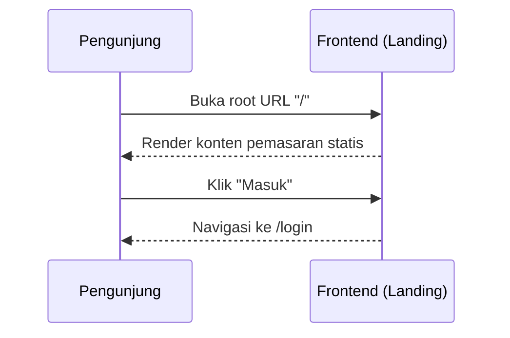

**Deskripsi Antarmuka:**

| Komponen | Tipe | Deskripsi |
|----------|------|-----------|
| Hero Section | Section statis | Headline proposisi nilai dan ringkasan fitur Payana. |
| Tombol "Masuk" | Tautan (`<Link>`) | Mengarahkan ke `/login`. |
| Bagian Fitur | Grid kartu | Menjelaskan EWA real-time, gasless, dan kepatuhan otomatis. |

**Method/Algoritma Utama:**

1. Render konten statis tanpa pemanggilan kontrak atau backend.
2. Saat tombol "Masuk" ditekan, navigasi App Router ke `/login`.

##### 2.4.1.2 Halaman Login (`/login`)

**Deskripsi:** Autentikasi tanpa kata sandi berbasis tanda tangan kriptografi EIP-191 menggunakan embedded wallet Privy.
**Aktor:** Seluruh pengguna (HR Admin, Karyawan, Owner SaaS).
**FR Terkait:** FR-PAYANA-101, FR-PAYANA-102, FR-PAYANA-106.

**Alur Interaksi:**

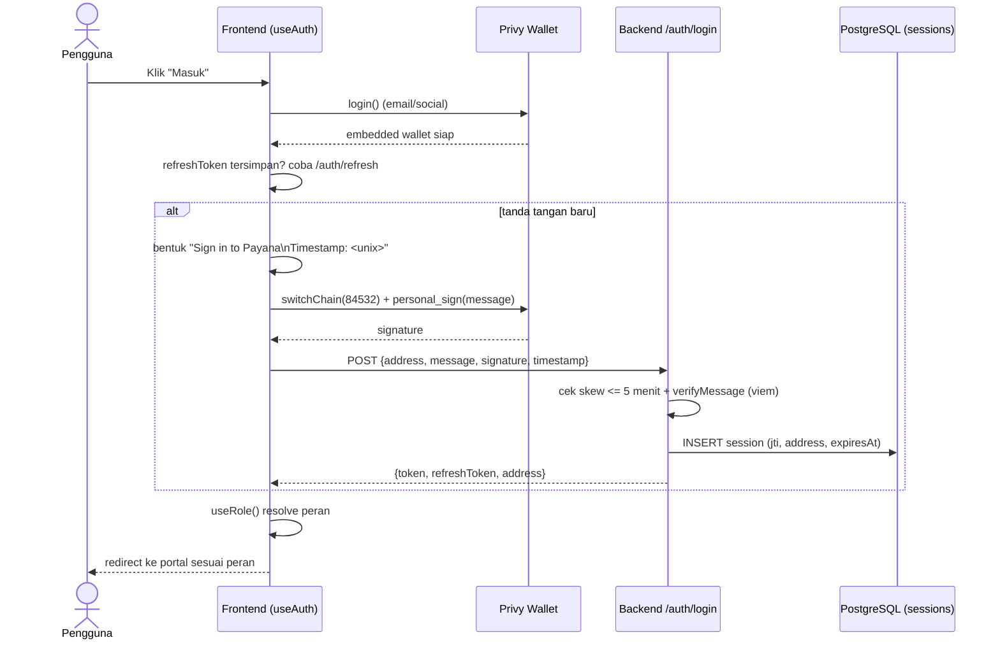

**Deskripsi Antarmuka:**

| Komponen | Tipe | Deskripsi |
|----------|------|-----------|
| Tombol "Masuk" | Tombol | Memicu `login()` Privy (modal email/social). |
| Indikator status | Teks/spinner | Menampilkan progres "menandatangani" dan "memverifikasi". |
| Redirect handler | Efek samping | Mengarahkan ke portal berdasarkan hasil `useRole`. |

**Method/Algoritma Utama:**

1. Panggil `login()` Privy; tunggu `authenticated` dan ketersediaan `walletAddress`.
2. Jika ada `payana_refresh_token` di `localStorage`, coba `POST /auth/refresh` terlebih dahulu untuk menghindari tanda tangan ulang.
3. Jika refresh gagal, bentuk pesan `Sign in to Payana\nTimestamp: <unix_seconds>`, panggil `switchChain(84532)`, lalu `personal_sign`.
4. Kirim `{address, message, signature, timestamp}` ke `POST /auth/login`; simpan `token` (akses) dan `refreshToken`.
5. Jalankan `useRole()` untuk menentukan peran dan mengarahkan ke `/owner`, `/hr/vault` (termasuk akses ke `/hr/phk` untuk langkah persetujuan LEGAL_ROLE, lihat §2.4.5), atau `/employee/ewa`.

##### 2.4.1.3 Halaman Onboarding Karyawan (`/onboarding`) — invitation-only

> **[Diperbaiki]** Subbab ini sebelumnya mendeskripsikan `/onboarding` sebagai formulir
> registrasi HR/company (arsitektur lama, sebelum invitation-only). Sejak perubahan arsitektur
> registrasi karyawan (lihat SKPL UC-18, PDHUPL AU-02-02/06..09), `/onboarding` adalah halaman
> **karyawan**, bukan HR — registrasi company sekarang ada di `/hr/onboarding` (lihat 2.4.2.1).

**Deskripsi:** Halaman registrasi karyawan yang **wajib** diakses melalui link undangan berisi `inviteToken` (`?invite=<token>`) yang dibuat oleh HR — tidak ada lagi jalur "pilih perusahaan bebas" dari dropdown tak terfilter. `hrAddress` di-resolve server-side dari token, tidak pernah diambil langsung dari input karyawan.
**Aktor:** Calon Karyawan.
**FR Terkait:** FR-PAYANA-107.

**Alur Interaksi:**

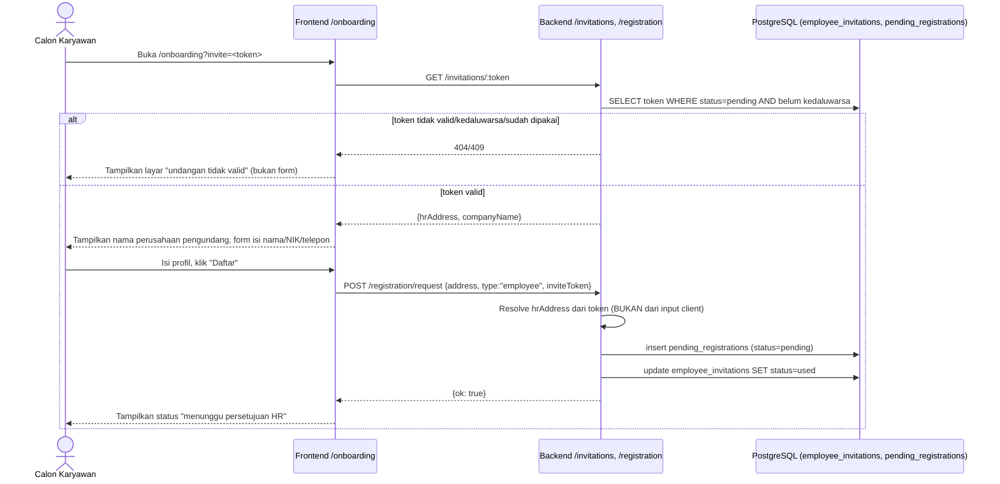

**Deskripsi Antarmuka:**

| Komponen | Tipe | Deskripsi |
|----------|------|-----------|
| Layar "undangan tidak valid" | Panel blokir | Ditampilkan jika `?invite=` tidak ada, tidak ditemukan, sudah dipakai, atau kedaluwarsa — tidak ada fallback ke form pilih-perusahaan. |
| Nama perusahaan pengundang | Teks read-only | Diambil dari `hrAddress` hasil resolve token, ditampilkan agar karyawan yakin mendaftar ke perusahaan yang benar. |
| Input nama / NIK / telepon | Field teks | Profil dasar karyawan (NIK harus 16 digit, divalidasi di `POST /auth/profile` setelah akun disetujui). |
| Tombol "Daftar" | Tombol | Memanggil `POST /registration/request` dengan `inviteToken` disertakan otomatis dari query param. |
| Badge status | Komponen status | Menampilkan `pending`/`approved`/`rejected`. |

**Method/Algoritma Utama:**

1. Baca `inviteToken` dari query param `?invite=`; jika tidak ada, tampilkan layar blokir langsung (tidak render form).
2. `GET /invitations/:token` — validasi token ada, `status=pending`, belum melewati `expiresAt` (7 hari). Jika gagal, tampilkan layar blokir dengan alasan spesifik.
3. Jika valid, submit `POST /registration/request {address, type:"employee", inviteToken}` — backend me-resolve `hrAddress` dari token, lalu menandai token `used` (sekali pakai, tidak bisa dipakai ulang oleh pendaftar lain).
4. Polling/`GET /registration/status/:address` untuk menampilkan status terkini setelah submit.

##### 2.4.1.4 Halaman Verifikasi SBT (`/verify`)

**Deskripsi:** Verifikasi publik keaslian Sertifikat Ketenagakerjaan (Employment SBT) oleh pihak ketiga.
**Aktor:** Publik (verifikator eksternal, mis. bank, calon pemberi kerja).
**FR Terkait:** FR-PAYANA-905, FR-PAYANA-904.

**Alur Interaksi:**

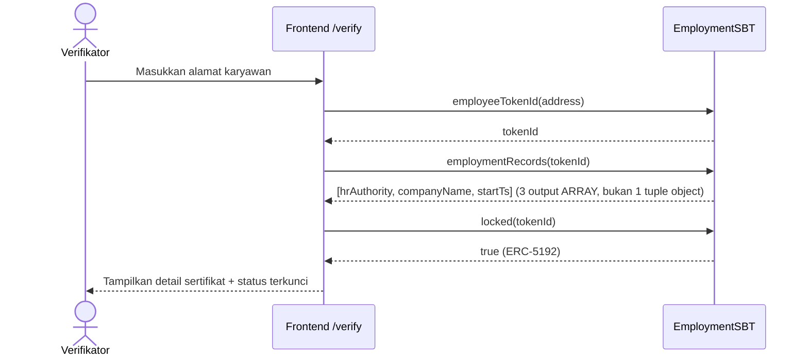

> **[Diperbaiki — ditemukan lewat klik UI sungguhan, lihat PDHUPL AU-14-01]** ABI
> `employmentRecords` sebelumnya dideklarasikan di frontend sebagai satu output tuple/objek
> `{hrAuthority, companyName, startTs}`. Getter Solidity otomatis untuk
> `mapping(uint256 => Struct) public` yang struct-nya punya field `string` (di sini
> `companyName`) sebenarnya mem-flatten menjadi **3 output terpisah** (dikonfirmasi langsung via
> `cast call employmentRecords(uint256)(address,string,uint256)` terhadap kontrak live), bukan
> satu tuple — viem mengembalikan hasil multi-output sebagai **array**, bukan objek. ABI di
> `frontend/src/app/verify/page.tsx` sudah diperbaiki menjadi 3 output bernama, dan destructuring
> diubah dari `const {hrAuthority, companyName, startTs} = record` menjadi
> `const [hrAuthority, companyName, startTs] = record`. Sebelum fix ini, klik "Verifikasi" di
> `/verify` gagal dengan `IntegerOutOfRangeError`.

**Deskripsi Antarmuka:**

| Komponen | Tipe | Deskripsi |
|----------|------|-----------|
| Input alamat | Field teks | Alamat dompet karyawan yang diverifikasi. |
| Kartu sertifikat | Panel hasil | Menampilkan `companyName`, `startTs`, `hrAuthority`. |
| Badge "Soulbound" | Indikator | Menegaskan token non-transferable (`locked == true`). |

**Method/Algoritma Utama:**

1. Baca `employeeTokenId(address)`; jika 0, tampilkan "sertifikat tidak ditemukan".
2. Baca `employmentRecords(tokenId)` — hasil berupa **array 3 elemen** `[hrAuthority, companyName, startTs]` (destructuring array, bukan objek) untuk metadata perusahaan dan tanggal mulai.
3. Baca `locked(tokenId)` (selalu `true`) untuk mengonfirmasi sifat soulbound.

#### 2.4.2 Portal HR (`/hr/*`)

Seluruh halaman portal HR dibungkus oleh layout `hr/layout.tsx` yang menyediakan navigasi sisi dan role guard berbasis `useRole`. Pengguna yang bukan HR diarahkan keluar dari portal ini.

##### 2.4.2.1 Dashboard HR Onboarding (`/hr/onboarding`)

> Signature saat ini: `deployVault(hrAuthority, companyName, sbtContract)`, 3 parameter. Lihat
> SKPL UC-18 untuk spesifikasi penuh alur registrasi company yang mendahului wizard ini.

**Deskripsi:** Wizard yang mencakup registrasi profil company (ditinjau Owner SaaS, lihat UC-18) diikuti deploy `CompanyVault`, konfigurasi parameter potongan (BPS), dan deposit awal IDRX.
**Aktor:** HR Admin.
**FR Terkait:** FR-PAYANA-107, FR-PAYANA-108, FR-PAYANA-109, FR-PAYANA-201, FR-PAYANA-202, FR-PAYANA-901.

**Alur Interaksi:**

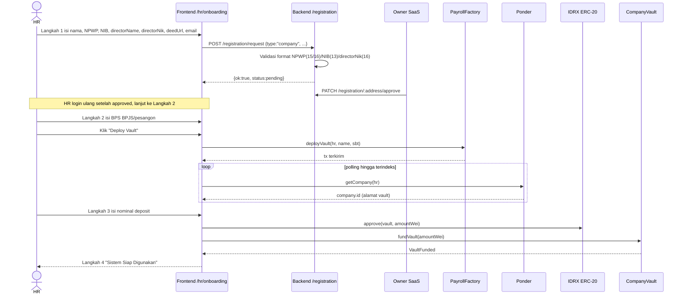

**Deskripsi Antarmuka:**

| Komponen | Tipe | Deskripsi |
|----------|------|-----------|
| Stepper | Indikator langkah | Empat tahap: Registrasi, Konfigurasi, Deposit, Selesai. |
| Input Nama Perusahaan / NPWP / NIB / Nama & NIK Direktur / Dokumen Akta / Email | Field teks | Metadata perusahaan untuk peninjauan Owner (UC-18); NPWP/NIB/NIK Direktur divalidasi format server-side, opsional saat submit tapi harus valid jika diisi. Nama digunakan untuk metadata SBT. |
| Input BPS BPJS / Pesangon | Field angka | Konfigurasi potongan (informatif untuk `setCompanyConfig`). |
| Tombol "Deploy Vault" | Tombol tulis | Memanggil `PayrollFactory.deployVault(hrAuthority, companyName, sbtContract)` — hanya aktif setelah registrasi company disetujui Owner. |
| Kartu alamat vault | Panel hasil | Menampilkan alamat vault terindeks + tombol salin. |
| Input Deposit (IDRX) | Field angka | Nominal deposit awal. |
| Tombol "Approve & Deposit" | Tombol tulis | Memanggil `approve` lalu `fundVault`. |

**Method/Algoritma Utama:**

1. `handleDeploy`: panggil `deployVault(address, companyName, EMPLOYMENT_SBT)` via `useContractWrite`.
2. Polling `ponder.getCompany(address)` hingga 20 kali (interval 3 detik) sampai alamat vault terindeks; simpan ke `deployedVault`.
3. `handleDeposit`: konversi nominal ke wei (`BigInt(amount) * 1e18`), panggil `approve(deployedVault, amountWei)` pada IDRX, lalu `fundVault(amountWei)` pada vault.
4. Tampilkan langkah selesai dengan tautan ke `/hr/vault`.

##### 2.4.2.2 Manajemen Karyawan (`/hr/employees` dan `/hr/employees/[id]`)

**Deskripsi:** Daftar seluruh karyawan beserta status stream, flow rate, dan saldo terakumulasi; halaman detail menyediakan kontrol penuh atas stream individual.
**Aktor:** HR Admin.
**FR Terkait:** FR-PAYANA-301 s.d. FR-PAYANA-306, FR-PAYANA-505.

**Alur Interaksi:**

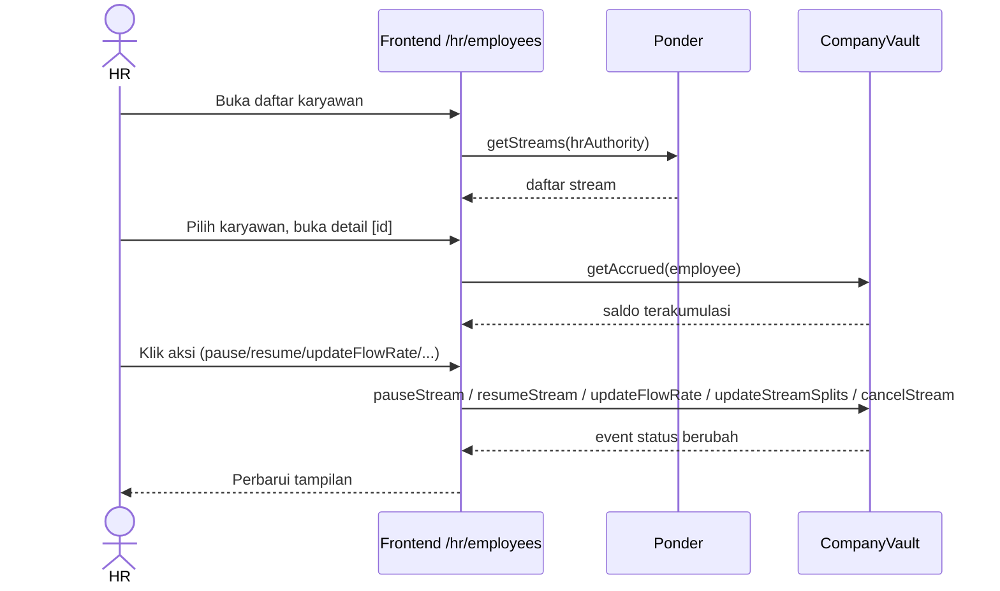

**Deskripsi Antarmuka:**

| Komponen | Tipe | Deskripsi |
|----------|------|-----------|
| Tabel karyawan | Tabel data | Kolom alamat, status, flow rate, saldo terakumulasi. |
| Badge status stream | Indikator | Active / Paused / Cancelled / Inactive. |
| Kontrol stream | Grup tombol | `pauseStream`, `resumeStream`, `updateFlowRate`, `updateStreamSplits`, `cancelStream`. |
| Input flow rate / split | Field angka | Nilai baru untuk pembaruan stream. |
| Tombol Resign | Tombol tulis | `resignEmployee(employee)` (pesangon kembali ke vault). |

**Method/Algoritma Utama:**

1. Muat daftar via `ponder.getStreams(hrAuthority)`; render tabel.
2. Pada detail `[id]`, baca `getAccrued(employee)` on-chain untuk saldo real-time.
3. Aksi kontrol memanggil fungsi kontrak terkait melalui `useContractWrite`; validasi split = 10.000 bps sebelum `updateStreamSplits`.

##### 2.4.2.3 Manajemen Vault (`/hr/vault`)

**Deskripsi:** Manajemen treasury perusahaan: pemantauan saldo, peringatan saldo rendah real-time, deposit, dan penarikan.
**Aktor:** HR Admin.
**FR Terkait:** FR-PAYANA-202, FR-PAYANA-203, FR-PAYANA-205, FR-PAYANA-207.

**Alur Interaksi:**

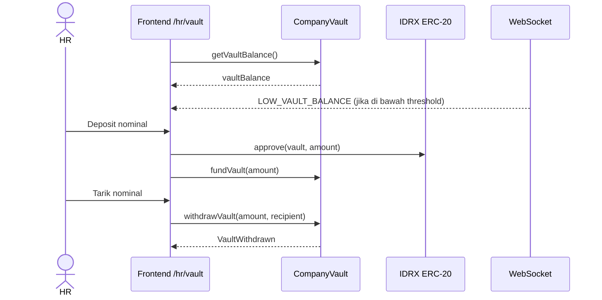

**Deskripsi Antarmuka:**

| Komponen | Tipe | Deskripsi |
|----------|------|-----------|
| Kartu saldo vault | Panel data | Menampilkan `vaultBalance` dan estimasi burn rate bulanan. |
| Banner peringatan | Alert real-time | Muncul saat pesan WebSocket `LOW_VAULT_BALANCE` diterima. |
| Form deposit | Field + tombol | `approve` lalu `fundVault(amount)`. |
| Form penarikan | Field + tombol | `withdrawVault(amount, recipient)`. |
| Tombol pause/resume vault | Tombol tulis | `pauseVault()` / `resumeVault()`. |

**Method/Algoritma Utama:**

1. Baca `getVaultBalance()` dan `totalFlowRate` untuk estimasi kebutuhan bulanan.
2. Berlangganan WebSocket; tampilkan banner saat tipe `LOW_VAULT_BALANCE` diterima.
3. Deposit: `approve(vault, amount)` → `fundVault(amount)`. Penarikan: `withdrawVault(amount, recipient)`.

##### 2.4.2.4 Reimburse HR (`/hr/reimburse`)

**Deskripsi:** Manajemen klaim reimbursement yang diajukan karyawan: daftar, persetujuan, dan pencatatan pembayaran.
**Aktor:** HR Admin.
**FR Terkait:** — (fitur pelengkap antarmuka tingkat aplikasi).

**Alur Interaksi:**

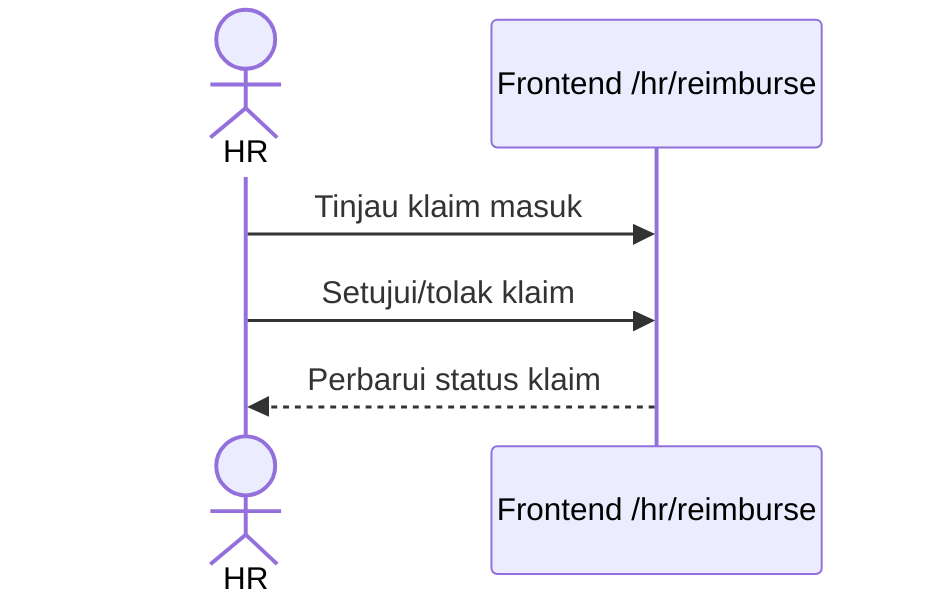

**Deskripsi Antarmuka:**

| Komponen | Tipe | Deskripsi |
|----------|------|-----------|
| Daftar klaim | Tabel data | Keterangan, jumlah, status, bukti. |
| Tombol setujui/tolak | Grup tombol | Memutuskan klaim reimbursement. |

**Method/Algoritma Utama:**

1. Muat daftar klaim reimbursement tingkat aplikasi.
2. Aksi persetujuan/penolakan memperbarui status klaim dan mencatat pembayaran.

##### 2.4.2.5 Bounty HR (`/hr/bounty`)

**Deskripsi:** Manajemen program bounty/insentif kinerja: pembuatan papan bounty, penetapan hadiah IDRX, dan pencatatan klaim disetujui.
**Aktor:** HR Admin.
**FR Terkait:** — (fitur pelengkap antarmuka tingkat aplikasi).

**Alur Interaksi:**

```mermaid
sequenceDiagram
    actor HR
    participant FE as Frontend /hr/bounty
    HR->>FE: Buat bounty + hadiah IDRX
    HR->>FE: Tinjau klaim penyelesaian
    FE-->>HR: Tandai bounty terbayar
```

**Deskripsi Antarmuka:**

| Komponen | Tipe | Deskripsi |
|----------|------|-----------|
| Form bounty | Field + tombol | Judul, deskripsi tugas, hadiah IDRX. |
| Daftar bounty | Tabel data | Status: terbuka/diklaim/selesai. |

**Method/Algoritma Utama:**

1. Buat papan bounty dengan hadiah IDRX.
2. Tinjau klaim penyelesaian dan catat pembayaran hadiah.

##### 2.4.2.6 Compliance HR (`/hr/compliance`)

**Deskripsi:** Laporan kepatuhan BPJS/PPh21: pratinjau ringkasan bulanan, unduhan CSV, dan penarikan akumulasi dana kepatuhan.
**Aktor:** HR Admin.
**FR Terkait:** FR-PAYANA-801, FR-PAYANA-803, FR-PAYANA-804, FR-PAYANA-805.

**Alur Interaksi:**

```mermaid
sequenceDiagram
    actor HR
    participant FE as Frontend /hr/compliance
    participant BE as Backend /compliance
    participant PO as Ponder (salary_claim)
    participant V as CompanyVault
    HR->>FE: Pilih bulan
    FE->>BE: GET /compliance/summary/:hr?month=YYYY-MM
    BE->>PO: SUM(accrued/compliance/severance)
    PO-->>BE: agregat + rincian
    BE-->>FE: ringkasan JSON
    HR->>FE: Unduh CSV
    FE->>BE: GET /compliance/export/:hr?month=YYYY-MM
    BE-->>FE: file CSV (PII didekripsi)
    HR->>FE: Tarik dana kepatuhan
    FE->>V: withdrawCompliance(amount, recipient)
    V-->>FE: ComplianceWithdrawn
```

**Deskripsi Antarmuka:**

| Komponen | Tipe | Deskripsi |
|----------|------|-----------|
| Pemilih bulan | Input bulan | Format `YYYY-MM`. |
| Kartu ringkasan | Panel data | Total accrued, compliance (BPJS/PPh21), severance, jumlah karyawan. |
| Tombol Unduh CSV | Tombol | Memanggil `GET /compliance/export`. |
| Form tarik kepatuhan | Field + tombol | `withdrawCompliance(amount, recipient)` ke agen pajak. |

**Method/Algoritma Utama:**

1. Ambil ringkasan via `backend.getComplianceSummary(hr, month, token)`.
2. Tombol unduh memanggil endpoint export; berkas CSV dikembalikan sebagai attachment.
3. Penarikan memanggil `withdrawCompliance(amount, recipient)` (hanya `complianceBalance`).

##### 2.4.2.7 Kasbon HR (`/hr/kasbon`)

**Deskripsi:** Daftar pengajuan kasbon karyawan (Pending/Active/Rejected/Repaid), tombol setujui/tolak, dan riwayat pemotongan pajak (PPh21 + BPJS) per klaim gaji.
**Aktor:** HR Admin.
**FR Terkait:** FR-PAYANA-703, FR-PAYANA-705.

**Alur Interaksi:**

```mermaid
sequenceDiagram
    actor HR
    participant FE as Frontend /hr/kasbon
    participant PO as Ponder
    participant V as CompanyVault
    FE->>PO: getSalaryAdvances(vaultAddress)
    PO-->>FE: salary_advance[] (Pending/Active/Rejected/Repaid)
    alt HR menyetujui
        HR->>FE: Klik "Setujui"
        FE->>V: approveAdvance(employee)
        V-->>FE: event AdvanceApproved
    else HR menolak
        HR->>FE: Klik "Tolak"
        FE->>V: rejectAdvance(employee)
        V-->>FE: event AdvanceRejected
    end
    FE-->>HR: Tampilkan status kasbon terkini + riwayat TaxWithheld
```

**Deskripsi Antarmuka:**

| Komponen | Tipe | Deskripsi |
|----------|------|-----------|
| Tabel kasbon Pending | Tabel data | Daftar pengajuan menunggu persetujuan, dengan tombol Setujui/Tolak per baris. |
| Tabel riwayat kasbon | Tabel data | Kasbon `Active`/`Rejected`/`Repaid` beserta sisa yang harus dilunasi. |
| Panel riwayat pajak | Panel data | Ringkasan `TaxWithheld` (PPh21 + BPJS) per klaim gaji, terindeks Ponder. |

**Method/Algoritma Utama:**

1. Baca `ponder.getSalaryAdvances(vaultAddress)` untuk daftar kasbon terindeks (status diturunkan dari riwayat event, lihat catatan `AdvanceStatus`).
2. Tombol Setujui memanggil `approveAdvance(employee)`; Tolak memanggil `rejectAdvance(employee)`.
3. Render riwayat `TaxWithheld` per karyawan dari data Ponder untuk transparansi potongan pajak.

##### 2.4.2.8 Vesting HR (`/hr/vesting`)

**Deskripsi:** Manajemen cliff vest: pembuatan vest baru bertipe Retention/Probation/ESOP dan pembatalan vest yang belum matang.
**Aktor:** HR Admin.
**FR Terkait:** FR-PAYANA-601, FR-PAYANA-603, FR-PAYANA-604, FR-PAYANA-605.

**Alur Interaksi:**

```mermaid
sequenceDiagram
    actor HR
    participant FE as Frontend /hr/vesting
    participant PO as Ponder (cliff_vest)
    participant V as CompanyVault
    FE->>PO: getVests(employee)
    PO-->>FE: daftar vest
    HR->>FE: Buat vest baru
    FE->>V: createCliffVest(employee, amount, cliffTs, vestType)
    V-->>FE: CliffVestCreated
    HR->>FE: Batalkan vest
    FE->>V: cancelCliffVest(employee, vestId)
    V-->>FE: CliffVestForfeited
```

**Deskripsi Antarmuka:**

| Komponen | Tipe | Deskripsi |
|----------|------|-----------|
| Form vest baru | Field + dropdown | Alamat karyawan, jumlah, tanggal cliff, tipe vest. |
| Dropdown tipe vest | Select | Retention / Probation / ESOP. |
| Daftar vest | Tabel data | Jumlah, cliff, status (Locked/Claimed/Forfeited). |
| Tombol batalkan | Tombol tulis | `cancelCliffVest(employee, vestId)`. |

**Method/Algoritma Utama:**

1. Validasi `cliffTs` di masa depan dan saldo vault mencukupi.
2. Panggil `createCliffVest(employee, amount, cliffTs, vestType)`.
3. Daftar vest dibaca dari `ponder.getVests`; pembatalan memanggil `cancelCliffVest`.

##### 2.4.2.9 PHK (`/hr/phk`)

**Deskripsi:** Antrian dan alur PHK multi-tanda tangan (HR mengajukan, lalu pemegang `LEGAL_ROLE` menyetujui, HR mengeksekusi), termasuk pembatalan proposal. Halaman ini satu-satunya UI untuk kedua langkah persetujuan — lihat §2.4.5 untuk penjelasan bahwa `LEGAL_ROLE` di-auto-grant ke HR Admin sendiri, sehingga kedua langkah dijalankan dari sesi HR Admin yang sama.
**Aktor:** HR Admin (menjalankan kedua langkah persetujuan: `HR_ROLE` dan `LEGAL_ROLE`).
**FR Terkait:** FR-PAYANA-501, FR-PAYANA-502, FR-PAYANA-503, FR-PAYANA-504.

**Alur Interaksi:**

```mermaid
sequenceDiagram
    actor HR as HR Admin
    participant V as CompanyVault
    HR->>V: proposeTermination(employee, reasonHash)
    V->>V: hrApproved=true, expiresAt=+7 hari, snapshot flowRate
    V-->>HR: TerminationProposed
    HR->>V: approveTermination(employee)
    V->>V: legalApproved=true (cek LEGAL_ROLE pada msg.sender)
    V-->>HR: TerminationApproved
    HR->>V: executeTermination(employee)
    V->>V: hitung pesangon (UU Cipta Kerja) + top-up
    V->>V: revoke SBT + forfeit vest + cancel stream
    V-->>HR: SeveranceReleased + TerminationExecuted
```

**Deskripsi Antarmuka:**

| Komponen | Tipe | Deskripsi |
|----------|------|-----------|
| Form proposal | Field + tombol | Alamat karyawan + alasan (di-hash jadi `reasonHash`). |
| Daftar proposal | Tabel data | Status `hrApproved`/`legalApproved`, kadaluarsa. |
| Tombol setujui (LEGAL_ROLE) | Tombol tulis | `approveTermination(employee)` — dipanggil dari sesi HR Admin yang sama, karena `LEGAL_ROLE`-nya digenggam HR itu sendiri. |
| Tombol eksekusi | Tombol tulis | `executeTermination(employee)`. |
| Tombol batalkan | Tombol tulis | `cancelProposal(employee)` sebelum langkah persetujuan LEGAL_ROLE dilakukan. |

**Method/Algoritma Utama:**

1. HR: hash alasan ke `reasonHash` (keccak256), panggil `proposeTermination(employee, reasonHash)`.
2. HR (sebagai pemegang `LEGAL_ROLE`): panggil `approveTermination(employee)` — kontrak memvalidasi `hasRole(LEGAL_ROLE, msg.sender)`, yang bernilai `true` untuk alamat HR karena auto-grant saat onboarding.
3. HR: panggil `executeTermination(employee)` (memerlukan kedua persetujuan dan belum kadaluarsa).
4. Pembatalan memanggil `cancelProposal(employee)` selama langkah persetujuan LEGAL_ROLE belum dilakukan.

**Catatan arsitektur:** Bila HR sebelumnya menetapkan `legalAddress` terpisah lewat `/hr/settings` (yang di-`grantRole(LEGAL_ROLE, legalAddress)` on-chain), alamat tersebut tetap dapat memanggil `approveTermination()` langsung terhadap kontrak dari luar aplikasi (mis. Etherscan). Namun karena `useRole()` tidak mendeteksi `LEGAL_ROLE` dan `useRoleGuard` pada layout `/hr/*` hanya meloloskan `role === "hr"`, alamat legal terpisah tersebut tidak bisa membuka halaman `/hr/phk` ini melalui produk — role guard akan mengarahkannya ke `/onboarding` sebelum sempat melihat antrian proposal.

##### 2.4.2.10 Audit HR (`/hr/audit`)

**Deskripsi:** Riwayat aksi backend yang relevan dengan perusahaan (relay, ekspor kepatuhan, likuidasi, platform fee, peringatan saldo).
**Aktor:** HR Admin.
**FR Terkait:** FR-PAYANA-1002.

**Alur Interaksi:**

```mermaid
sequenceDiagram
    actor HR
    participant FE as Frontend /hr/audit
    participant BE as Backend (audit_logs)
    FE->>BE: Ambil audit log perusahaan
    BE-->>FE: daftar {action, actor, txHash, meta, createdAt}
    FE-->>HR: Render riwayat aksi
```

**Deskripsi Antarmuka:**

| Komponen | Tipe | Deskripsi |
|----------|------|-----------|
| Tabel audit | Tabel data | Aksi (`BUNDLER_RELAY`, `COMPLIANCE_EXPORT`, `LOAN_LIQUIDATED`, `PLATFORM_FEE_PAID`, `LOW_VAULT_BALANCE_ALERT`), waktu, hash. |
| Tautan transaksi | OnChainLink | Tautan ke Basescan untuk `txHash`. |

**Method/Algoritma Utama:**

1. Ambil entri `audit_logs` yang aktor/metanya terkait perusahaan HR.
2. Render tabel terurut waktu dengan tautan transaksi.

##### 2.4.2.11 Pengaturan HR (`/hr/settings`)

> **[Diperbaiki]** Subbab ini sebelumnya hanya mendokumentasikan tab konfigurasi ON-CHAIN
> (`setCompanyConfig`). Halaman ini sebenarnya juga memiliki tab "Profil" dan "Aturan" yang
> murni OFF-CHAIN (`GET`/`PUT /company-settings`, lihat B.16/SKPL UC-26) — ditambahkan di bawah.

**Deskripsi:** Konfigurasi parameter vault ON-CHAIN (BPS BPJS, BPS PPh21, threshold peringatan saldo rendah) sekaligus preferensi branding OFF-CHAIN (nama tampilan, negara, logo, batas EWA, tarif yield) dalam satu halaman.
**Aktor:** HR Admin.
**FR Terkait:** FR-PAYANA-204, FR-PAYANA-802, FR-PAYANA-1801.

**Alur Interaksi (bagian on-chain):**

```mermaid
sequenceDiagram
    actor HR
    participant FE as Frontend /hr/settings
    participant V as CompanyVault
    HR->>FE: Atur bpjsBps, pph21Bps, threshold
    FE->>V: setCompanyConfig(bpjsBps, pph21Bps, lowBalanceThresholdBps)
    V-->>FE: konfigurasi tersimpan
    FE-->>HR: Konfirmasi
```

**Alur Interaksi (bagian off-chain — Profil & Aturan):**

```mermaid
sequenceDiagram
    actor HR
    participant FE as Frontend /hr/settings
    participant BE as Backend /company-settings
    FE->>BE: GET /company-settings
    BE-->>FE: {name, country, logoUrl, ewaLimitBps, yieldRateBps, legalAddress} atau null
    HR->>FE: Ubah nama/negara/logo (tab Profil) atau batas EWA/yield (tab Aturan)
    FE->>BE: PUT /company-settings {...}
    BE->>BE: Upsert by hrAddress
    BE-->>FE: Tersimpan
```

**Deskripsi Antarmuka:**

| Komponen | Tipe | Deskripsi |
|----------|------|-----------|
| Input BPJS Bps | Field angka | Tarif BPJS on-chain (informatif). |
| Input PPh21 Bps | Field angka | Tarif PPh21 on-chain (informatif). |
| Input Threshold Bps | Field angka | Ambang peringatan saldo rendah on-chain. |
| Tombol Simpan (on-chain) | Tombol tulis | `setCompanyConfig(...)`. |
| Tab "Profil" — Nama/Negara/Logo | Field teks | Off-chain, `company_settings.name/country/logoUrl`. |
| Tab "Aturan" — Batas EWA/Tarif Yield | Field angka (%) | Off-chain, `company_settings.ewaLimitBps/yieldRateBps` — dikonversi persen↔bps (×100). |
| Tombol Simpan (off-chain) | Tombol tulis | `PUT /company-settings`. |

**Method/Algoritma Utama:**

1. Baca konfigurasi saat ini dari kontrak untuk prapengisian form on-chain.
2. Panggil `setCompanyConfig(bpjsBps, pph21Bps, lowBalanceThresholdBps)` via `useContractWrite`.
3. `useCompanySettings()` memanggil `GET /company-settings` untuk prapengisian tab Profil/Aturan; `null` berarti belum pernah disimpan (field kosong).
4. Simpan tab Profil atau Aturan secara independen via `PUT /company-settings` (upsert parsial — hanya field yang diubah dikirim).

##### 2.4.2.12 Direktori Karyawan (`/hr/directory`) `[BARU]`

**Deskripsi:** Daftar seluruh karyawan perusahaan beserta departemen dan jabatan, dengan kemampuan meng-assign/memperbarui keduanya per karyawan.
**Aktor:** HR Admin.
**FR Terkait:** FR-PAYANA-1701.

**Alur Interaksi:**

```mermaid
sequenceDiagram
    actor HR
    participant FE as Frontend /hr/directory
    participant BE as Backend /directory
    HR->>FE: Buka /hr/directory
    FE->>BE: GET /directory/:hrAddress
    BE-->>FE: Daftar karyawan (nama, departemen, jabatan, status, flowRate)
    HR->>FE: Pilih karyawan, isi department/position
    FE->>BE: PATCH /directory/:address {department, position}
    BE-->>FE: Tersimpan
```

**Deskripsi Antarmuka:**

| Komponen | Tipe | Deskripsi |
|----------|------|-----------|
| Tabel direktori | Tabel data | Nama, departemen, jabatan, status stream, flow rate per karyawan. |
| Input Departemen / Jabatan | Field teks (inline edit) | Ditugaskan per baris karyawan. |

**Method/Algoritma Utama:**

1. `GET /directory/:hrAddress` memuat daftar karyawan (join data stream Ponder dengan `employee_profiles`).
2. `PATCH /directory/:address` menyimpan department/position; hasilnya langsung tercermin di baris tabel tanpa reload penuh.

##### 2.4.2.13 Surat Keterangan Kerja — HR (`/hr/employment-letters`) `[BARU]`

**Deskripsi:** Antrian permohonan surat keterangan kerja dari karyawan, dengan aksi setujui/tolak.
**Aktor:** HR Admin.
**FR Terkait:** FR-PAYANA-1601.

**Alur Interaksi:**

```mermaid
sequenceDiagram
    actor HR
    participant FE as Frontend /hr/employment-letters
    participant BE as Backend /employment-letter
    HR->>FE: Buka /hr/employment-letters
    FE->>BE: GET daftar permohonan pending
    BE-->>FE: Daftar {employeeAddress, purpose, requestedAt}
    HR->>FE: Klik Setujui/Tolak
    FE->>BE: PATCH /employment-letter/:id/approve|reject
    BE-->>FE: Status ter-update
```

**Deskripsi Antarmuka:**

| Komponen | Tipe | Deskripsi |
|----------|------|-----------|
| Daftar permohonan | Tabel data | Karyawan pemohon, tujuan (purpose), tanggal pengajuan, status. |
| Tombol Setujui/Tolak | Grup tombol | Memutuskan permohonan. |

**Method/Algoritma Utama:**

1. Muat daftar `employment_letters` milik `hrAddress` caller.
2. `PATCH /employment-letter/:id/approve|reject` mengubah status; karyawan dapat mengunduh dokumen setelah `approved`.

#### 2.4.3 Portal Karyawan (`/employee/*`)

Seluruh halaman portal karyawan dibungkus oleh layout `employee/layout.tsx` dengan navigasi sisi karyawan dan role guard `useRole`. Karyawan diidentifikasi melalui stream aktif/paused pada Ponder.

##### 2.4.3.1 EWA Dashboard (`/employee/ewa`)

**Deskripsi:** Halaman utama karyawan yang menampilkan saldo gaji terakumulasi real-time, saldo Smart Account, vesting mendatang, dan riwayat klaim; menyediakan tombol "Tarik Gaji" gasless.
**Aktor:** Karyawan.
**FR Terkait:** FR-PAYANA-401, FR-PAYANA-402, FR-PAYANA-403, FR-PAYANA-405.

**Alur Interaksi:**

```mermaid
sequenceDiagram
    actor E as Karyawan
    participant FE as Frontend /employee/ewa
    participant PO as Ponder
    participant V as CompanyVault
    participant IDRX as IDRX ERC-20
    FE->>PO: getStream / getClaims / getVests
    PO-->>FE: data stream, klaim, vest
    FE->>V: getAccrued(address)
    V-->>FE: saldo terakumulasi (seed counter)
    loop tiap 10 detik (NFR-10)
        FE->>V: getAccrued(address)
        V-->>FE: nilai terbaru
    end
    E->>FE: Klik "Tarik Gaji"
    FE->>V: claimSalary() (jalur gasless ERC-4337)
    V-->>FE: txHash + SalaryClaimed
    FE->>IDRX: balanceOf(address) (refresh)
    FE-->>E: Banner "Dana EWA berhasil ditarik"
```

**Deskripsi Antarmuka:**

| Komponen | Tipe | Deskripsi |
|----------|------|-----------|
| Kartu EWA gelap | Panel utama | `StreamCounter` real-time + flow rate per detik + status streaming. |
| Tombol "Tarik Gaji" | Tombol tulis | Memicu `claimSalary()` (gasless); nonaktif jika `accruedWei == 0`. |
| Kartu Smart Account | Panel data | Saldo IDRX (`balanceOf`) + alamat ringkas. |
| Kartu Bonus Vesting | Panel data | Vest `Locked` terdekat + progress bar. |
| Aktivitas Terakhir | Daftar | Lima klaim terakhir dari `getClaims`. |
| Banner sukses | Alert + OnChainLink | Konfirmasi klaim + tautan transaksi. |

**Method/Algoritma Utama:**

1. Muat paralel `ponder.getStream`, `ponder.getClaims`, `ponder.getVests`; baca `balanceOf` IDRX.
2. `fetchAccrued`: baca `getAccrued(address)` on-chain sebagai seed `StreamCounter`; polling tiap 10 detik (NFR-10).
3. `handleClaim`: panggil `claimSalary()` melalui jalur write (gasless), tampilkan banner sukses, lalu refresh `getAccrued` dan `balanceOf`.

##### 2.4.3.2 Reimburse Karyawan (`/employee/reimburse`)

**Deskripsi:** Formulir pengajuan reimbursement dan pemantauan status persetujuan HR.
**Aktor:** Karyawan.
**FR Terkait:** — (fitur pelengkap antarmuka tingkat aplikasi).

**Alur Interaksi:**

```mermaid
sequenceDiagram
    actor E as Karyawan
    participant FE as Frontend /employee/reimburse
    E->>FE: Isi keterangan, jumlah, unggah bukti
    FE-->>E: Ajukan klaim
    E->>FE: Pantau status persetujuan
```

**Deskripsi Antarmuka:**

| Komponen | Tipe | Deskripsi |
|----------|------|-----------|
| Form klaim | Field + unggah | Keterangan biaya, jumlah IDRX, bukti. |
| Daftar status | Tabel data | Status persetujuan HR. |

**Method/Algoritma Utama:**

1. Submit klaim reimbursement tingkat aplikasi.
2. Pantau status persetujuan dari HR.

##### 2.4.3.3 Bounty Karyawan (`/employee/bounty`)

**Deskripsi:** Daftar program bounty yang tersedia beserta tombol klaim hadiah IDRX setelah tugas selesai.
**Aktor:** Karyawan.
**FR Terkait:** — (fitur pelengkap antarmuka tingkat aplikasi).

**Alur Interaksi:**

```mermaid
sequenceDiagram
    actor E as Karyawan
    participant FE as Frontend /employee/bounty
    E->>FE: Lihat daftar bounty
    E->>FE: Klaim hadiah setelah tugas selesai
    FE-->>E: Status klaim diperbarui
```

**Deskripsi Antarmuka:**

| Komponen | Tipe | Deskripsi |
|----------|------|-----------|
| Daftar bounty | Grid kartu | Judul, deskripsi, hadiah IDRX. |
| Tombol klaim | Tombol | Mengajukan klaim penyelesaian. |

**Method/Algoritma Utama:**

1. Muat daftar bounty terbuka.
2. Ajukan klaim hadiah; tunggu verifikasi HR.

##### 2.4.3.4 Kasbon Karyawan (`/employee/kasbon`)

**Deskripsi:** Status kasbon aktif beserta sisa yang harus dilunasi, tombol pengajuan kasbon baru, dan rincian potongan PPh21/BPJS pada setiap klaim gaji.
**Aktor:** Karyawan.
**FR Terkait:** FR-PAYANA-703, FR-PAYANA-704, FR-PAYANA-706.

**Alur Interaksi:**

```mermaid
sequenceDiagram
    actor E as Karyawan
    participant FE as Frontend /employee/kasbon
    participant PO as Ponder
    participant V as CompanyVault
    FE->>PO: getSalaryAdvance(employee) / getStream(employee)
    PO-->>FE: status kasbon, sisa, riwayat TaxWithheld
    E->>FE: Ajukan kasbon (<= 80% gaji bulanan)
    FE->>V: requestAdvance(amount) — gasless via Paymaster
    V-->>FE: event AdvanceRequested
    FE-->>E: Refresh status kasbon (Pending)
```

**Deskripsi Antarmuka:**

| Komponen | Tipe | Deskripsi |
|----------|------|-----------|
| Kartu status kasbon | Panel data | Status saat ini (Pending/Active/Rejected/Repaid), jumlah, dan sisa yang harus dilunasi. |
| Input nominal pengajuan | Field | Nominal kasbon; dibatasi `maxAdvance` (80% dari estimasi gaji bulanan). |
| Indikator pelunasan | Progress bar | `repaid / amount`. |
| Panel riwayat pajak | Panel data | Rincian `TaxWithheld` (PPh21 + BPJS) per klaim gaji. |
| Tombol aksi | Tombol tulis | `requestAdvance(amount)`. |

**Method/Algoritma Utama:**

1. Muat paralel `getSalaryAdvance(employee)` dan `getStream(employee)` dari Ponder.
2. Hitung `maxAdvance = floor(monthlySalary * 0.8)` dengan `monthlySalary = (flowRate/1e18) * 2.592.000`.
3. Tombol ajukan memanggil `requestAdvance(amount)` (gasless, ditandatangani Privy), lalu `refreshData`.
4. Render riwayat `TaxWithheld` dari data Ponder untuk transparansi potongan pajak per klaim.

##### 2.4.3.5 Vesting Karyawan (`/employee/vesting`)

**Deskripsi:** Daftar cliff vest milik karyawan beserta tombol klaim setelah cliff tercapai.
**Aktor:** Karyawan.
**FR Terkait:** FR-PAYANA-602, FR-PAYANA-604.

**Alur Interaksi:**

```mermaid
sequenceDiagram
    actor E as Karyawan
    participant FE as Frontend /employee/vesting
    participant PO as Ponder (cliff_vest)
    participant V as CompanyVault
    FE->>PO: getVests(address)
    PO-->>FE: daftar vest + status
    E->>FE: Klik klaim (cliff tercapai)
    FE->>V: claimCliffVest(vestId)
    V-->>FE: CliffVestClaimed + transfer IDRX
    FE-->>E: Perbarui status menjadi Claimed
```

**Deskripsi Antarmuka:**

| Komponen | Tipe | Deskripsi |
|----------|------|-----------|
| Daftar vest | Tabel/grid | Jumlah terkunci, tanggal cliff, tipe, status. |
| Badge status | Indikator | Locked / Claimed / Forfeited. |
| Tombol klaim | Tombol tulis | `claimCliffVest(vestId)`; aktif hanya setelah cliff. |

**Method/Algoritma Utama:**

1. Muat `ponder.getVests(address)`; tampilkan status dan tanggal cliff.
2. Tombol klaim aktif jika `block.timestamp >= cliffTs` dan status `Locked`.
3. Panggil `claimCliffVest(vestId)`; perbarui status.

##### 2.4.3.6 Transfer (`/employee/transfer`)

**Deskripsi:** Transfer IDRX dari Smart Account karyawan ke alamat EVM eksternal menggunakan fungsi standar ERC-20.
**Aktor:** Karyawan.
**FR Terkait:** FR-PAYANA-401 (pendukung pencairan).

**Alur Interaksi:**

```mermaid
sequenceDiagram
    actor E as Karyawan
    participant FE as Frontend /employee/transfer
    participant IDRX as IDRX ERC-20
    E->>FE: Isi alamat tujuan + nominal
    FE->>IDRX: balanceOf(address) (validasi saldo)
    E->>FE: Konfirmasi transfer
    FE->>IDRX: transfer(recipient, amountWei)
    IDRX-->>FE: Transfer event
    FE-->>E: Konfirmasi pengiriman
```

**Deskripsi Antarmuka:**

| Komponen | Tipe | Deskripsi |
|----------|------|-----------|
| Input alamat tujuan | Field teks | Alamat EVM eksternal (mis. MetaMask/bursa). |
| Input nominal | Field angka | Jumlah IDRX yang dikirim. |
| Kartu saldo | Panel data | Saldo IDRX terkini. |
| Tombol kirim | Tombol tulis | `transfer(recipient, amountWei)`. |

**Method/Algoritma Utama:**

1. Baca `balanceOf(address)` untuk validasi kecukupan saldo.
2. Konversi nominal ke wei; panggil `transfer(recipient, amountWei)` pada IDRX.

##### 2.4.3.7 Pesangon (`/employee/severance`)

**Deskripsi:** Tampilan saldo pesangon yang terakumulasi on-chain (2% dari setiap klaim) beserta status dan estimasi besaran berdasarkan masa kerja.
**Aktor:** Karyawan.
**FR Terkait:** FR-PAYANA-505, FR-PAYANA-506.

**Alur Interaksi:**

```mermaid
sequenceDiagram
    actor E as Karyawan
    participant FE as Frontend /employee/severance
    participant V as CompanyVault
    participant PO as Ponder (severance_vault)
    FE->>V: getSeveranceBalance(address)
    V-->>FE: amount terakumulasi
    FE->>PO: severance_vault (state, tenureMonths)
    PO-->>FE: status + masa kerja
    FE-->>E: Tampilkan saldo + estimasi pesangon
```

**Deskripsi Antarmuka:**

| Komponen | Tipe | Deskripsi |
|----------|------|-----------|
| Kartu saldo pesangon | Panel data | `getSeveranceBalance(address)`. |
| Badge status | Indikator | Locked / Released / Returned. |
| Estimasi pesangon | Panel info | Estimasi berdasarkan masa kerja (UU Cipta Kerja). |

**Method/Algoritma Utama:**

1. Baca `getSeveranceBalance(address)` on-chain dan `severance_vault` terindeks.
2. Tampilkan status (Locked/Released/Returned) dan estimasi statutori berdasarkan `tenureMonths`.

##### 2.4.3.8 Audit Karyawan (`/employee/audit`)

**Deskripsi:** Riwayat klaim gaji dan transaksi kasbon milik karyawan yang login.
**Aktor:** Karyawan.
**FR Terkait:** FR-PAYANA-1002 (transparansi pribadi).

**Alur Interaksi:**

```mermaid
sequenceDiagram
    actor E as Karyawan
    participant FE as Frontend /employee/audit
    participant PO as Ponder
    FE->>PO: getClaims(address)
    PO-->>FE: riwayat klaim
    FE-->>E: Render daftar transaksi
```

**Deskripsi Antarmuka:**

| Komponen | Tipe | Deskripsi |
|----------|------|-----------|
| Tabel riwayat | Tabel data | Klaim gaji + transaksi kasbon, waktu, jumlah IDRX. |
| Tautan transaksi | OnChainLink | Tautan Basescan per transaksi. |

**Method/Algoritma Utama:**

1. Ambil `ponder.getClaims(address)`; render terurut waktu.
2. Sertakan tautan transaksi ke Basescan.

##### 2.4.3.9 Pengaturan Karyawan (`/employee/settings`)

**Deskripsi:** Pembaruan profil PII karyawan (nama, NIK 16 digit, telepon) yang disimpan terenkripsi.
**Aktor:** Karyawan.
**FR Terkait:** FR-PAYANA-104, FR-PAYANA-105.

**Alur Interaksi:**

```mermaid
sequenceDiagram
    actor E as Karyawan
    participant FE as Frontend /employee/settings
    participant BE as Backend /auth/profile
    participant DB as PostgreSQL (employees, AES-GCM)
    FE->>BE: GET /auth/profile (Bearer JWT)
    BE->>DB: SELECT + decrypt
    BE-->>FE: {name, nik, phone}
    E->>FE: Perbarui field
    FE->>BE: POST /auth/profile {name, nik, phone}
    BE->>DB: encrypt (AES-256-GCM) + upsert
    BE-->>FE: {success: true}
```

**Deskripsi Antarmuka:**

| Komponen | Tipe | Deskripsi |
|----------|------|-----------|
| Input nama | Field teks | Nama lengkap. |
| Input NIK | Field teks | Harus tepat 16 digit numerik. |
| Input telepon | Field teks | Nomor telepon. |
| Tombol simpan | Tombol | `POST /auth/profile`. |

**Method/Algoritma Utama:**

1. Ambil profil terkini via `backend.getProfile(token)`; prapengisian form.
2. Validasi NIK 16 digit; submit `POST /auth/profile` (server mengenkripsi AES-256-GCM).

##### 2.4.3.10 Notifikasi (`/employee/notifications`) `[BARU]`

**Deskripsi:** Daftar notifikasi peristiwa signifikan milik karyawan (maks 50 terbaru), dengan aksi tandai telah dibaca.
**Aktor:** Karyawan (endpoint juga dapat dipanggil HR, namun hanya karyawan yang punya halaman khusus di frontend saat ini).
**FR Terkait:** FR-PAYANA-1301.

**Alur Interaksi:**

```mermaid
sequenceDiagram
    actor EMP as Karyawan
    participant FE as Frontend /employee/notifications
    participant BE as Backend /notifications
    EMP->>FE: Buka halaman
    FE->>BE: GET /notifications
    BE-->>FE: Maks 50 notifikasi, urut terbaru
    EMP->>FE: Klik notifikasi / "Tandai semua dibaca"
    FE->>BE: PATCH /notifications/:id/read atau /read-all
    BE-->>FE: read = true
```

**Deskripsi Antarmuka:**

| Komponen | Tipe | Deskripsi |
|----------|------|-----------|
| Daftar notifikasi | List item | Judul, isi, waktu, indikator belum dibaca. |
| Tombol "Tandai semua dibaca" | Tombol | `PATCH /notifications/read-all`. |

**Method/Algoritma Utama:**

1. `GET /notifications` memuat maksimum 50 notifikasi terbaru milik caller.
2. Klik satu notifikasi memanggil `PATCH /notifications/:id/read`; tombol massal memanggil `/read-all`.

##### 2.4.3.11 Slip Gaji (`/employee/payslip`) `[BARU]`

**Deskripsi:** Rincian breakdown satu transaksi klaim gaji, ditampilkan sebagai slip gaji digital yang dapat dicetak/disimpan.
**Aktor:** Karyawan (HR terkait juga dapat mengakses via `claimId`).
**FR Terkait:** FR-PAYANA-1401.

**Alur Interaksi:**

```mermaid
sequenceDiagram
    actor EMP as Karyawan
    participant FE as Frontend /employee/payslip
    participant BE as Backend /payslip
    EMP->>FE: Pilih klaim dari riwayat
    FE->>BE: GET /payslip/:claimId
    BE-->>FE: Breakdown lengkap
    FE-->>EMP: Tampilkan slip, tombol cetak (window.print)
```

**Deskripsi Antarmuka:**

| Komponen | Tipe | Deskripsi |
|----------|------|-----------|
| Kartu breakdown | Panel hasil | Gaji bruto, potongan fee/kasbon/pajak/severance, gaji bersih. |
| Tombol Cetak | Tombol | `window.print()` — tidak ada generasi PDF sisi server. |

**Method/Algoritma Utama:**

1. `GET /payslip/:claimId` mengembalikan breakdown lengkap satu klaim.
2. Halaman dirender sebagai layout printable; unduh PDF dilakukan lewat dialog cetak browser.

##### 2.4.3.12 Bukti Potong Pajak (`/employee/tax-cert`) `[BARU]`

**Deskripsi:** Agregasi tahunan gaji dan potongan untuk keperluan pelaporan SPT pribadi karyawan.
**Aktor:** Karyawan.
**FR Terkait:** FR-PAYANA-1501.

**Alur Interaksi:**

```mermaid
sequenceDiagram
    actor EMP as Karyawan
    participant FE as Frontend /employee/tax-cert
    participant BE as Backend /tax-cert
    EMP->>FE: Pilih tahun pajak
    FE->>BE: GET /tax-cert/:year
    BE-->>FE: totalGrossAccrued, totalCompliance, totalSeverance, totalNet
    FE-->>EMP: Tampilkan agregat + breakdown bulanan
```

**Deskripsi Antarmuka:**

| Komponen | Tipe | Deskripsi |
|----------|------|-----------|
| Pemilih tahun | Dropdown | Tahun pajak (2020–2100). |
| Kartu agregat | Panel hasil | Total bruto, kepatuhan, severance, bersih untuk tahun tsb. |

**Method/Algoritma Utama:**

1. `GET /tax-cert/:year` mengagregasi `salary_claim` milik caller pada tahun tsb.
2. Validasi tahun di sisi backend (400 jika di luar 2020–2100).

##### 2.4.3.13 Surat Keterangan Kerja — Karyawan (`/employee/employment-letter`) `[BARU]`

**Deskripsi:** Formulir pengajuan permohonan surat keterangan kerja dan pemantauan status, serta pengunduhan dokumen setelah disetujui.
**Aktor:** Karyawan.
**FR Terkait:** FR-PAYANA-1601.

**Alur Interaksi:**

```mermaid
sequenceDiagram
    actor EMP as Karyawan
    participant FE as Frontend /employee/employment-letter
    participant BE as Backend /employment-letter
    EMP->>FE: Pilih tujuan (KPR/Kredit/Visa/Umum/Lainnya)
    FE->>BE: POST /employment-letter/request {hrAddress, purpose}
    BE-->>FE: Status pending
    Note over EMP,BE: (menunggu persetujuan HR)
    EMP->>FE: Cek status
    FE->>BE: GET status permohonan
    alt approved
        EMP->>FE: Unduh dokumen
        FE->>BE: GET /employment-letter/:id/document
        BE-->>FE: Dokumen
    end
```

**Deskripsi Antarmuka:**

| Komponen | Tipe | Deskripsi |
|----------|------|-----------|
| Pemilih tujuan | Dropdown | `KPR`\|`Kredit`\|`Visa`\|`Umum`\|`Lainnya`. |
| Badge status | Komponen status | `pending`/`approved`/`rejected`. |
| Tombol Unduh | Tombol | Aktif hanya jika `approved`. |

**Method/Algoritma Utama:**

1. Validasi `purpose` terhadap whitelist di sisi backend (400 jika di luar daftar).
2. Backend memverifikasi caller punya `employee_stream` `Active` di bawah `hrAddress` yang dituju (400 `NOT_EMPLOYEE` jika tidak).
3. Dokumen hanya dapat diunduh setelah `status: approved` (400 `NOT_APPROVED` jika belum).

#### 2.4.4 Portal Owner SaaS (`/owner`)

**Deskripsi:** Dashboard agregat operator platform: TVL, jumlah tenant aktif, estimasi pendapatan platform fee, antrian registrasi HR, serta konfigurasi platform fee dan fungsi darurat.
**Aktor:** Owner SaaS.
**FR Terkait:** FR-PAYANA-1002, FR-PAYANA-1004, FR-PAYANA-1006, FR-PAYANA-1008, FR-PAYANA-108, FR-PAYANA-109.

**Alur Interaksi:**

```mermaid
sequenceDiagram
    actor O as Owner
    participant FE as Frontend /owner
    participant BE as Backend /registration
    participant PO as Ponder
    participant F as PayrollFactory
    FE->>FE: Owner guard (address == OWNER_ADDRESS)
    FE->>BE: GET /registration/pending (Bearer JWT)
    BE-->>FE: antrian registrasi
    FE->>PO: getCompanies / getPlatformFees
    PO-->>FE: tenant + estimasi pendapatan
    O->>FE: Setujui registrasi
    FE->>BE: PATCH /registration/:address/approve
    O->>FE: Tolak registrasi
    FE->>BE: DELETE /registration/:address
    O->>FE: Set platform fee / freeze
    FE->>F: setPlatformFee(bps) / emergencyFreezeAll()
```

**Deskripsi Antarmuka:**

| Komponen | Tipe | Deskripsi |
|----------|------|-----------|
| Kartu metrik | Panel data | TVL, jumlah tenant (`getCompanies`/`getTotalVaults`), estimasi fee. |
| Grafik pendapatan | AreaChart | Tren pendapatan platform. |
| Tab registrasi | Tab + tabel | Pending / Approved / Rejected. |
| Tombol setujui/tolak | Grup tombol | `approve` / `reject` registrasi. |
| Form platform fee | Field + tombol | `setPlatformFee(bps)` (maks 100 bps). |
| Tombol freeze darurat | Tombol tulis | `emergencyFreezeAll()`. |

**Method/Algoritma Utama:**

1. Owner guard: bandingkan `address` dengan `NEXT_PUBLIC_OWNER_ADDRESS`; jika tidak cocok, redirect ke `/login`.
2. Muat `registration.getPending(token)` dan `ponder.getCompanies()`/`ponder.getPlatformFees()`.
3. `handleApprove`/`handleReject` memanggil endpoint registrasi lalu refresh.
4. Konfigurasi fee via `setPlatformFee(bps)`; pembekuan via `emergencyFreezeAll()`.

##### 2.4.4.1 Portal Owner — Keamanan Vault (`/owner/security`) `[BARU — lihat SKPL UC-27, FR-PAYANA-1901 s.d. 1904]`

**Deskripsi:** Daftar alert keamanan yang dihasilkan `anomalyDetector.ts` (lihat Lampiran B.6) lintas seluruh tenant — penarikan vault tidak wajar, perubahan peran tak terduga, dan aktivitas beruntun — dengan tab "Belum Ditangani"/"Semua" dan tombol tandai selesai per alert.
**Aktor:** Owner SaaS.
**FR Terkait:** FR-PAYANA-1901, FR-PAYANA-1902, FR-PAYANA-1903, FR-PAYANA-1904.

**Alur Interaksi:**

```mermaid
sequenceDiagram
    actor O as Owner
    participant FE as Frontend /owner/security
    participant BE as Backend /security
    FE->>BE: GET /security/alerts (Bearer JWT, refetch tiap 30s)
    BE-->>FE: daftar alert (belum ditangani dulu)
    O->>FE: Klik "Tandai Selesai"
    FE->>BE: PATCH /security/alerts/:id/resolve
    BE-->>FE: {ok: true}
    FE->>FE: invalidateQueries(["securityAlerts"]) — refetch
```

**Deskripsi Antarmuka:**

| Komponen | Tipe | Deskripsi |
|----------|------|-----------|
| Kartu ringkasan | Panel data | Jumlah alert belum ditangani. |
| Tab filter | Tab | "Belum Ditangani" / "Semua". |
| Kartu alert | Panel data | Badge severity (`medium`/`high`/`critical`), judul, detail, alamat vault (dengan salin), waktu, tautan BaseScan bila ada `txHash`. |
| Tombol tandai selesai | Tombol tulis | `PATCH /security/alerts/:id/resolve`, disembunyikan untuk alert yang sudah `resolved`. |

**Method/Algoritma Utama:**

1. `useSecurityAlerts(token)` — React Query, `refetchInterval: 30_000` (bukan WebSocket — alert juga sudah didorong sebagai notifikasi in-app terpisah untuk kebutuhan real-time, lihat B.6).
2. Filter client-side: `resolved === false` untuk tab default, seluruh array untuk tab "Semua".
3. `useResolveAlert(token)` — `PATCH` lalu `invalidateQueries(["securityAlerts"])`.

#### 2.4.5 Portal Legal Officer — TIDAK DIIMPLEMENTASIKAN (dokumentasi status & keterbatasan)

**Status:** Portal ini **tidak eksis** sebagai jalur produk terpisah. Bagian ini didokumentasikan secara eksplisit (bukan dihapus begitu saja) supaya perbedaan antara desain AccessControl on-chain dan implementasi frontend tercatat dengan jelas.

**Apa yang genuinely ada on-chain:** `CompanyVault` mendefinisikan `LEGAL_ROLE` sebagai peran `AccessControl` yang independen dari `HR_ROLE`. `approveTermination()` hanya memvalidasi `hasRole(LEGAL_ROLE, msg.sender)` — kontrak tidak peduli apakah pemanggil juga punya `HR_ROLE` atau tidak. HR dapat men-`grantRole(LEGAL_ROLE, legalAddress)` ke alamat mana pun lewat halaman `/hr/settings`.

**Apa yang TIDAK ada di frontend:**
1. `useRole.ts` (`resolveRole()`) tidak memiliki cabang pemeriksaan `hasRole(LEGAL_ROLE, address)` sama sekali — fungsi ini hanya mengecek Owner (env var), HR (`companyVaults`), dan Karyawan (stream Ponder). Sebuah alamat yang hanya punya `LEGAL_ROLE` (bukan `HR_ROLE`) akan selalu mendapat `role: null` dari hook ini.
2. `useRoleGuard` yang membungkus layout `/hr/*` (termasuk `/hr/phk`) hanya meloloskan `allowedRoles: ["hr"]`. Karena langkah 1 di atas tidak pernah menghasilkan `role: "legal"`, guard ini akan mengarahkan (`router.replace`) alamat legal terpisah tersebut ke `/onboarding` sebelum sempat merender antrian proposal PHK.
3. Tidak ada rute atau komponen UI berlabel "mode Legal" di manapun dalam `frontend/src/app/`.

**Konsekuensi:** Satu-satunya jalur bagi `approveTermination()` untuk benar-benar dipanggil adalah:
- (a) HR Admin memanggilnya dari sesi `/hr/phk` miliknya sendiri, memanfaatkan fakta bahwa `LEGAL_ROLE` di-auto-grant ke alamatnya sendiri saat onboarding (lihat §2.4.2.1 dan §2.4.2.9) — ini adalah jalur yang benar-benar berfungsi dan diuji (lihat PDHUPL AU-07-01); atau
- (b) alamat legal terpisah yang di-`grantRole` lewat `/hr/settings` memanggil kontrak secara langsung di luar aplikasi (mis. lewat Etherscan atau skrip `viem`/`ethers` manual) — secara teknis valid di level kontrak, tetapi tidak pernah dilatih/diuji melalui produk karena tidak ada UI untuknya.

**Rekomendasi pengembangan lanjutan** (di luar cakupan implementasi skripsi ini): tambahkan cabang `legal` pada `useRole.ts` (mengecek `hasRole(LEGAL_ROLE, address)` pada setiap `CompanyVault` yang dikenal — catatan performa: ini butuh cara mengenumerasi company tanpa iterasi penuh `getCompanies()`, mis. via index terbalik dari Ponder), lalu izinkan `role === "legal"` masuk ke `/hr/phk` dalam mode terbatas (hanya lihat & approve proposal, tanpa akses ke fungsi HR lain).

---


---

## A. Lampiran A — Informasi Tambahan

> **[FLAG-BANDING-DOCX-LAMA]** Lampiran A–D (sampai akhir dokumen ini) **tidak ada sama sekali**
> di docx lama — dokumen docx berhenti tepat setelah §2.4 yang masih kosong. Semua isi
> Lampiran A/B/C/D perlu ditambahkan baru ke docx. Detail di flag atas dokumen.

### A.1 Daftar Singkatan

| Singkatan | Kepanjangan |
|-----------|-------------|
| DPPL | Deskripsi Perancangan Perangkat Lunak |
| SKPL | Spesifikasi Kebutuhan Perangkat Lunak |
| FR | Functional Requirement |
| EWA | Earned Wage Access |
| SBT | Soulbound Token |
| PHK | Pemutusan Hubungan Kerja |
| CEI | Checks-Effects-Interactions |
| BPS | Basis Points |
| JWT | JSON Web Token |
| JTI | JWT ID |
| AES-GCM | Advanced Encryption Standard - Galois/Counter Mode |
| HMAC | Hash-based Message Authentication Code |
| ERC | Ethereum Request for Comments |
| EIP | Ethereum Improvement Proposal |
| ACL | Access Control List |
| PII | Personally Identifiable Information |
| RPC | Remote Procedure Call |
| L2 | Layer 2 |

### A.2 Pemetaan FR ke Komponen Implementasi

| FR | Smart Contract | Backend Endpoint | Frontend Page/Hook |
|----|----------------|------------------|--------------------|
| FR-PAYANA-101 | — | POST /auth/login | /login, useAuth |
| FR-PAYANA-102 | — | POST /auth/refresh | useAuth |
| FR-PAYANA-103 | — | POST /auth/logout | useAuth |
| FR-PAYANA-104 | — | POST /auth/profile | /employee/settings |
| FR-PAYANA-105 | — | GET /auth/profile | /employee/settings |
| FR-PAYANA-106 | PayrollFactory.companyVaults, CompanyVault.hasRole | — | useRole |
| FR-PAYANA-107 | — | POST /registration/request, GET /registration/status | /onboarding |
| FR-PAYANA-108 | — | GET /registration/pending | /owner |
| FR-PAYANA-109 | — | PATCH/DELETE /registration/:address | /owner |
| FR-PAYANA-201 | PayrollFactory.deployVault | — | /owner, /hr/onboarding |
| FR-PAYANA-202 | CompanyVault.fundVault | — | /hr/vault |
| FR-PAYANA-203 | CompanyVault.withdrawVault | — | /hr/vault |
| FR-PAYANA-204 | CompanyVault.setCompanyConfig | — | /hr/settings |
| FR-PAYANA-205 | CompanyVault.pauseVault/resumeVault | — | /hr/vault |
| FR-PAYANA-206 | PayrollFactory.emergencyFreezeAll, CompanyVault.freezeVault | — | /owner |
| FR-PAYANA-207 | CompanyVault._checkLowBalance (LowVaultBalance) | webhook → WS LOW_VAULT_BALANCE | /hr/vault |
| FR-PAYANA-208 | CompanyVault.withdrawCompliance | — | /hr/compliance |
| FR-PAYANA-301 | CompanyVault.startStream | — | /hr/onboarding |
| FR-PAYANA-302 | CompanyVault.pauseStream | — | /hr/employees/[id] |
| FR-PAYANA-303 | CompanyVault.resumeStream | — | /hr/employees/[id] |
| FR-PAYANA-304 | CompanyVault.updateFlowRate | — | /hr/employees/[id] |
| FR-PAYANA-305 | CompanyVault.updateStreamSplits | — | /hr/employees/[id] |
| FR-PAYANA-306 | CompanyVault.cancelStream | — | /hr/employees/[id] |
| FR-PAYANA-401 | CompanyVault.claimSalary | POST /bundler/relay | /employee/ewa |
| FR-PAYANA-402 | CompanyVault.getAccrued | — | /employee/ewa |
| FR-PAYANA-403 | (EntryPoint via Pimlico) | POST /bundler/relay | useContractWrite/EWA |
| FR-PAYANA-404 | — | POST /bundler/relay (rateLimiter) | /employee/ewa |
| FR-PAYANA-405 | — | GET /bundler/status/:hash | /employee/ewa |
| FR-PAYANA-501 | CompanyVault.proposeTermination, cancelProposal | — | /hr/phk |
| FR-PAYANA-502 | CompanyVault.approveTermination | — | /hr/phk (langkah LEGAL_ROLE, dijalankan dari sesi HR Admin — lihat §2.4.5) |
| FR-PAYANA-503 | CompanyVault.executeTermination | — | /hr/phk |
| FR-PAYANA-504 | PayrollMath.severanceMultiplier | — | /hr/phk |
| FR-PAYANA-505 | CompanyVault.resignEmployee | — | /hr/employees/[id], /employee/severance |
| FR-PAYANA-506 | CompanyVault.executeTermination (SeveranceReleased) | — | /employee/severance |
| FR-PAYANA-601 | CompanyVault.createCliffVest | — | /hr/vesting |
| FR-PAYANA-602 | CompanyVault.claimCliffVest | — | /employee/vesting |
| FR-PAYANA-603 | CompanyVault.cancelCliffVest / _forfeitAllVests | — | /hr/vesting |
| FR-PAYANA-604 | CompanyVault.cliffVests (view) | — | /hr/vesting, /employee/vesting |
| FR-PAYANA-605 | CompanyVault.vestCounter, VestType | — | /hr/vesting |
| FR-PAYANA-701 | PayrollMath.calcPPh21TerBps (via claimSalary) | — | /hr/compliance, /employee/kasbon |
| FR-PAYANA-702 | CompanyVault.claimSalary (bpjsBps cut) | — | /hr/compliance |
| FR-PAYANA-703 | event TaxWithheld (indexed) | Ponder handler | /hr/compliance, /employee/kasbon |
| FR-PAYANA-704 | CompanyVault.requestAdvance | — | /employee/kasbon |
| FR-PAYANA-705 | CompanyVault.approveAdvance / rejectAdvance | — | /hr/kasbon |
| FR-PAYANA-706 | CompanyVault.claimSalary (_autoRepayAdvance) | — | /employee/kasbon |
| FR-PAYANA-801 | CompanyVault.claimSalary (complianceBalance) | — | /hr/compliance |
| FR-PAYANA-802 | CompanyVault.setCompanyConfig | — | /hr/settings |
| FR-PAYANA-803 | CompanyVault.withdrawCompliance | — | /hr/compliance |
| FR-PAYANA-804 | — | GET /compliance/export/:hr | /hr/compliance |
| FR-PAYANA-805 | — | GET /compliance/summary/:hr | /hr/compliance |
| FR-PAYANA-901 | EmploymentSBT.mint (via startStream) | — | /hr/onboarding |
| FR-PAYANA-902 | EmploymentSBT.employmentRecords | — | /employee (SBT card) |
| FR-PAYANA-903 | EmploymentSBT.revoke (via _revokeSBT) | — | — |
| FR-PAYANA-904 | EmploymentSBT.employeeTokenId/employmentRecords | — | /employee dashboard, /verify |
| FR-PAYANA-905 | EmploymentSBT.locked/supportsInterface | — | /verify |
| FR-PAYANA-1001 | PayrollFactory.deployVault | — | /owner |
| FR-PAYANA-1002 | PayrollFactory.getTotalVaults | — | /owner, /hr/audit |
| FR-PAYANA-1003 | PayrollFactory.setPlatformFee / setProtocolTreasury | — | /owner |
| FR-PAYANA-1004 | PayrollFactory.emergencyFreezeAll | — | /owner |
| FR-PAYANA-1005 | — | (blocklist sesi — backend) | /owner |
| FR-PAYANA-1006 | PayrollFactory.setPlatformFee | — | /owner |
| FR-PAYANA-1007 | CompanyVault.claimSalary (platformCut) | — | — |
| FR-PAYANA-1008 | (transfer ke protocolTreasury) | webhook → WS PLATFORM_FEE_PAID | /owner (ponder.getPlatformFees) |

> **Catatan cakupan:** tabel di atas berhenti pada FR-PAYANA-1008 — FR-PAYANA-1101 s.d. 1801 (Kelompok G, M, N, O, P, Q, R, S di SKPL.md — huruf Kelompok sudah diselaraskan dengan huruf Modul di SKPL §1.2, jadi bukan lagi blok huruf berurutan) belum pernah dipetakan ke tabel ini, gap pre-existing yang tidak terkait perubahan pada revisi ini. FR-PAYANA-1901 s.d. 1904 (Kelompok H, ditambahkan bersamaan dokumen ini) dipetakan langsung di bawah agar tidak menambah gap baru.

| FR-PAYANA-1901 | CompanyVault (event `VaultWithdrawn`, dibaca via Ponder) | GET /security/alerts | /owner/security |
| FR-PAYANA-1902 | CompanyVault (event `RoleGranted`/`RoleRevoked`, dibaca via Ponder) | GET /security/alerts | /owner/security |
| FR-PAYANA-1903 | — (agregasi lintas `vault_withdrawal`/`role_change`) | GET /security/alerts | /owner/security |
| FR-PAYANA-1904 | — | GET /security/alerts, PATCH /security/alerts/:id/resolve | /owner/security |

### A.3 Alamat Kontrak Ter-Deploy

Jaringan: **Base Sepolia**, Chain ID **84532**. `PayrollFactory` sudah diganti (redeploy) setelah
ditemukan stale — lihat catatan di bawah; `CompanyVault`/`EmploymentSBT`/IDRX tidak berubah.

| Kontrak | Alamat |
|---------|--------|
| PayrollFactory | `0x73926c8abdbd2ebcc09f5e6af7def1bb3af156de` |
| EmploymentSBT | `0x8dA9B60814536364daF77a82cb56B31226De4B62` |
| MockIDRX (ERC-20) | `0x0996e627cE22C4FE2D5c4788b159a83C065D6d09` |
| Admin/Treasury | `0x906B34db1a8DD333ff9a84255e4AEc13C054f120` |

Catatan: `CompanyVault` per tenant tidak memiliki alamat tetap karena di-deploy dinamis oleh `PayrollFactory.deployVault()`; alamatnya dapat diresolusi melalui `companyVaults(hrAuthority)`.

> **[RESOLVED — sudah di-redeploy]** `PayrollFactory` lama (`0xF62dF08b38c6Fbde33E24208BA044907475ca815`)
> terkonfirmasi stale relatif terhadap `src/` (ukuran bytecode on-chain 24.535 byte vs. hasil
> kompilasi source terkini 24.142 byte) — `deployVault()` selalu revert instan (~500 gas, tanpa
> reason data) saat dipanggil terhadap alamat lama, dikonfirmasi lewat forked Foundry trace.
> Factory baru di atas di-deploy langsung dari `src/PayrollFactory.sol` saat ini
> (`testing-scripts/30-00-deploy-factory.mjs`, tx `0x3f1972d1671bf41c10ca9fe9a35766dfe48847caa3727d5740282043a68929b6`)
> dan sudah diverifikasi `deployVault()` berhasil end-to-end (dipakai untuk simulasi 30 karyawan,
> lihat PDHUPL_v2.md Bab 5). Seluruh konfigurasi (`backend/.env`, `ponder/.env`,
> `frontend/.env.local`, `finley-payroll/.env`, default fallback di kode, `testing-scripts/`)
> sudah diarahkan ke alamat baru ini. GitHub Actions secret
> `NEXT_PUBLIC_PAYROLL_FACTORY_ADDRESS` perlu diupdate manual oleh pemilik repo (CI tidak bisa
> diubah dari sini). **Dampak yang disengaja:** 2 `CompanyVault` yang terdaftar di factory lama
> (`0xB08e4Da71Dd928099842292F02cb9F4eCc9d83Cf`, `0x7AB177BeF3E14614a8786c7CF5d15Ff5B4290Ca6`,
> data dummy sesi testing sebelumnya, dikonfirmasi aman diorphan) tidak lagi bisa login sebagai
> HR (`authz.ts` mengecek `companyVaults()` di factory yang dikonfigurasi) dan tidak lagi
> diindeks Ponder — vault mereka sendiri tetap berfungsi normal on-chain bila diakses langsung
> lewat alamatnya, hanya tidak lagi dapat ditemukan/diautentikasi lewat factory baru.

> **[RESOLVED — vaultBalance drift di Ponder]** Ditemukan saat verifikasi manual AU-16-01
> (PDHUPL_v2.md Bab 5): `company.vaultBalance` yang diindeks Ponder drift ~27,4 juta IDRX lebih
> tinggi dari nilai on-chain asli. Root cause: dua event handler (`AdvanceApproved` — disbursement
> kasbon, `TerminationExecuted` — top-up severance) tidak pernah mengurangi `vaultBalance` di
> `ponder/src/PayrollContract.ts`, walau kontrak asli memang menguranginya di kedua kasus
> tersebut. Diperbaiki secara menyeluruh: seluruh 8 titik yang menyentuh `vaultBalance` diganti
> dari arithmetic manual (`+`/`-` berdasarkan `event.args`) menjadi resync langsung dari kontrak
> (`context.client.readContract` ke fungsi `vaultBalance()` pada `event.log.address`, di
> `event.block.number`) — pendekatan yang immun dari seluruh kelas bug "lupa update field
> turunan" ini untuk perubahan kontrak apa pun di masa depan. Diverifikasi: nilai Ponder pasca
> reindex cocok persis dengan pembacaan BaseScan langsung (`972494299743827160501553812` wei).
>
> Sebagai bagian dari verifikasi ini, kontrak `CompanyVault` yang di-deploy dinamis
> (`0xEc2B154789C3E7B393f2c9E4bfa06b6cfd57F096`, dipakai simulasi 30 karyawan) juga
> **diverifikasi di BaseScan** (sebelumnya tidak terverifikasi, sehingga tab "Read Contract"
> tidak tersedia untuk siapa pun yang ingin membandingkan data indexer vs. on-chain secara
> mandiri).

---

*Bersambung ke Lampiran A.4–A.8 (pelengkap rinci Subbab 2.2.2, Lampiran B, Lampiran C, dan Subbab 2.4).*

### A.4 Katalog Struktur Data On-Chain

Bagian ini merinci seluruh struct, enum, dan mapping yang menjadi state on-chain, sebagai pelengkap deskripsi fungsional pada Subbab 2.2.2.

#### A.4.1 Struct CompanyVault

| Struct | Field | Tipe | Keterangan |
|--------|-------|------|------------|
| `EmployeeStream` | `flowRate` | uint256 | IDRX wei per detik. |
| | `startTs` | uint256 | Timestamp pembuatan stream (basis perhitungan masa kerja). |
| | `lastWithdrawnTs` | uint256 | Timestamp klaim/settle terakhir. |
| | `settledBalance` | uint256 | Saldo akrual yang sudah di-settle saat pause/update rate. |
| | `status` | StreamStatus | Inactive/Active/Paused/Cancelled. |
| | `severanceBps` | uint16 | Porsi severance per klaim; PPh21/BPJS dihitung dinamis di level vault, bukan bagian struct ini. |
| `SeveranceVault` | `amount` | uint256 | Total IDRX pesangon terakumulasi. |
| | `state` | SeveranceState | Locked/Returned/Released. |
| | `tenureMonths` | uint256 | Masa kerja di klaim terakhir (perhitungan UU Cipta Kerja). |
| | `lastUpdatedTs` | uint256 | Timestamp pembaruan terakhir. |
| `TerminationProposal` | `employee` | address | Karyawan yang diusulkan PHK. |
| | `hrApproved` | bool | True saat HR mengajukan. |
| | `legalApproved` | bool | Diset oleh pemegang `LEGAL_ROLE`. |
| | `expiresAt` | uint256 | Kadaluarsa otomatis setelah `TERMINATION_EXPIRY` (7 hari). |
| | `reasonHash` | bytes32 | keccak256 alasan PHK (alasan lengkap off-chain). |
| | `flowRateSnapshot` | uint256 | Flow rate saat proposal (untuk perhitungan pesangon statutori). |
| `CliffVest` | `employee` | address | Penerima vest. |
| | `amount` | uint256 | IDRX wei terkunci. |
| | `cliffTs` | uint256 | Timestamp setelahnya vest dapat diklaim. |
| | `vestType` | VestType | Retention/Probation/ESOP. |
| | `status` | VestStatus | Locked/Claimed/Forfeited. |

**Mapping CompanyVault:** `employeeStreams[address]`, `severanceVaults[address]`, `terminations[address]`, `cliffVests[address][vestId]`, `employeeComplianceAccumulated[address]`, `salaryAdvances[address]`.

#### A.4.2 Struct SalaryAdvance (CompanyVault)

| Struct | Field | Tipe | Keterangan |
|--------|-------|------|------------|
| `SalaryAdvance` | `amount` | uint256 | Total kasbon yang disetujui. |
| | `repaid` | uint256 | Total sudah dilunasi via auto-repay. |
| | `requestedAt` | uint256 | Timestamp pengajuan. |
| | `status` | AdvanceStatus | None/Pending/Active (lihat catatan `AdvanceStatus`, §2.3.1). |

#### A.4.3 Enum Lengkap

| Enum | Nilai | Kontrak |
|------|-------|---------|
| `VaultStatus` | Uninitialized, Active, Paused, Frozen | CompanyVault |
| `StreamStatus` | Inactive, Active, Paused, Cancelled | CompanyVault |
| `SeveranceState` | Locked, Returned, Released | CompanyVault |
| `VestType` | Retention, Probation, ESOP | CompanyVault |
| `VestStatus` | Locked, Claimed, Forfeited | CompanyVault |
| `AdvanceStatus` | None, Pending, Active | CompanyVault |

### A.5 Spesifikasi Pustaka PayrollMath

`PayrollMath` adalah pustaka `pure`/`view` tanpa state, menyediakan perhitungan inti payroll. Konstanta: `SECONDS_PER_MONTH = 2.592.000` (30 hari), `BPS_DENOMINATOR = 10.000`.

| Fungsi | Tipe | Algoritma | FR Terkait |
|--------|------|-----------|-----------|
| `calcAccrued(flowRate, lastWithdrawnTs)` | internal view | Jika `now <= lastWithdrawnTs` kembalikan 0; selain itu `flowRate * (now - lastWithdrawnTs)`. | FR-402 |
| `monthlyToFlowRate(monthlySalary)` | internal pure | `monthlySalary / SECONDS_PER_MONTH`. | FR-301 |
| `bpsOf(amount, bps)` | internal pure | `(amount * bps) / 10000`. | FR-401, 1007 |
| `severanceMultiplier(tenureMonths)` | internal pure | Tabel berjenjang UU Cipta Kerja Pasal 156 (lihat di bawah). | FR-504 |
| `validateSplits(empBps, compBps, sevBps)` | internal pure | True jika jumlah ketiganya == 10.000. | FR-301, 305 |

**Tabel `severanceMultiplier` (pengali gaji bulanan):**

| Masa Kerja (bulan) | Pengali |
|--------------------|---------|
| < 12 | 1 |
| 12–23 | 2 |
| 24–35 | 3 |
| 36–47 | 4 |
| 48–59 | 5 |
| 60–71 | 6 |
| 72–83 | 7 |
| 84–95 | 8 |
| >= 96 | 9 |

Pesangon statutori = `severanceMultiplier(tenureMonths) * (flowRateSnapshot * SECONDS_PER_MONTH)`.

### A.6 Katalog Event On-Chain

Tabel berikut memetakan event ke pemicu fungsi, konsumen indeksasi (Ponder), dan/atau handler webhook backend.

| Event | Kontrak | Dipancarkan oleh | Konsumen |
|-------|---------|------------------|----------|
| `VaultDeployed` | PayrollFactory | `deployVault` | Ponder `company`, `/owner` |
| `PlatformFeeUpdated` | PayrollFactory | `setPlatformFee` | Ponder |
| `ProtocolTreasuryUpdated` | PayrollFactory | `setProtocolTreasury` | Ponder |
| `VaultInitialized` | CompanyVault | constructor | Ponder `company` |
| `VaultFunded` / `VaultWithdrawn` | CompanyVault | `fundVault` / `withdrawVault` | Ponder (`company.vault_balance` + `vault_withdrawal` `[BARU]`), `/hr/vault`, `anomalyDetector.ts` |
| `RoleGranted` / `RoleRevoked` | CompanyVault (bawaan `AccessControl`) | `grantRole`/`revokeRole` | Ponder `role_change` `[BARU]`, `anomalyDetector.ts` |
| `VaultPaused` / `VaultResumed` / `VaultFreeze` | CompanyVault | `pauseVault`/`resumeVault`/`freezeVault` | Ponder |
| `StreamCreated` | CompanyVault | `startStream` | Ponder `employee_stream` |
| `StreamPaused`/`StreamResumed`/`StreamCancelled` | CompanyVault | kontrol stream | Ponder `employee_stream` |
| `FlowRateUpdated` / `StreamSplitsUpdated` | CompanyVault | `updateFlowRate`/`updateStreamSplits` | Ponder |
| `SalaryClaimed` | CompanyVault | `claimSalary` | Ponder `salary_claim`, webhook → WS `SALARY_CLAIMED` |
| `PlatformFeePaid` | CompanyVault | `claimSalary` | webhook → WS `PLATFORM_FEE_PAID`, `/owner` |
| `LowVaultBalance` | CompanyVault | `_checkLowBalance` | webhook → WS `LOW_VAULT_BALANCE`, `/hr/vault` |
| `TerminationProposed`/`TerminationApproved`/`TerminationExecuted`/`TerminationCancelled` | CompanyVault | alur PHK | Ponder `termination_proposal`, `/hr/phk` |
| `SeveranceReleased`/`SeveranceReturned`/`SeveranceShortfall` | CompanyVault | `executeTermination`/`resignEmployee` | Ponder `severance_vault`, `/employee/severance` |
| `CliffVestCreated`/`CliffVestClaimed`/`CliffVestForfeited` | CompanyVault | alur vesting | Ponder `cliff_vest` |
| `ComplianceWithdrawn` | CompanyVault | `withdrawCompliance` | Ponder, `/hr/compliance` |
| `EmploymentCertified`/`EmploymentRevoked` | CompanyVault | mint/revoke SBT | Ponder `employment_certificate` |
| `AdvanceRequested` | CompanyVault | `requestAdvance` | Ponder `salary_advance` |
| `AdvanceApproved`/`AdvanceRejected` | CompanyVault | `approveAdvance`/`rejectAdvance` | Ponder `salary_advance` |
| `AdvanceRepaid` | CompanyVault | `_autoRepayAdvance` (dipanggil dari `claimSalary`) | Ponder `salary_advance` |
| `TaxWithheld` | CompanyVault | `claimSalary` (PPh21 + BPJS) | Ponder, `/hr/compliance` |
| `Locked` | EmploymentSBT | `mint` | `/verify` (ERC-5192) |

### A.7 Matriks Peran dan Otorisasi

| Peran | Kontrak/Lapisan | Hak Akses |
|-------|-----------------|-----------|
| `SUPERADMIN_ROLE` | PayrollFactory | `deployVault`, `setPlatformFee`, `setProtocolTreasury`, `emergencyFreezeAll`. |
| `DEFAULT_ADMIN_ROLE` | CompanyVault | Diberikan ke `hrAuthority`; mengelola peran lain; `freezeVault`. |
| `HR_ROLE` | CompanyVault | Manajemen stream, vault, kepatuhan, vesting, proposal PHK. |
| `LEGAL_ROLE` | CompanyVault | `approveTermination` (tanda tangan kedua PHK); **[Diperbaiki]** juga berhak baca `GET /termination/reason/:employeeAddress` dan `GET /auth/profile/by-address/:address` di backend (lihat catatan di bawah — sebelumnya keliru selalu 403). |
| `MINTER_ROLE` | EmploymentSBT | `mint`/`revoke` (dipegang `CompanyVault`). |
| Owner SaaS | Backend/Frontend | `requireOwner` (registrasi); akses `/owner`; `[BARU]` `GET`/`PATCH /security/alerts` (lihat A.2 FR-PAYANA-1901 s.d. 1904). |

> **[Temuan & Diperbaiki]** `canViewEmployeeData()` di `backend/src/services/authz.ts`
> sebelumnya HANYA mengecek `caller === hrAuthority`, sehingga pemegang `LEGAL_ROLE` on-chain
> selalu mendapat `403 Forbidden` saat mencoba membaca alasan PHK melalui
> `GET /termination/reason/:employeeAddress` — padahal komentar kode endpoint tersebut sendiri
> menyatakan seharusnya "HR-or-Legal", dan Legal memang butuh konteks alasan sebelum memberi
> persetujuan independennya (`approveTermination()`) sesuai desain persetujuan dua pihak (lihat
> A.4 Multi-Sig PHK). Diperbaiki dengan menambahkan pengecekan on-chain
> `hasRole(LEGAL_ROLE, caller)` terhadap `CompanyVault` milik `hrAuthority` terkait — perbaikan
> ini otomatis berlaku juga untuk `GET /auth/profile/by-address/:address` karena keduanya
> memanggil fungsi otorisasi yang sama. Diverifikasi via `testing-scripts/ku-06-termination-reason.mjs`
> (8 skenario: HR/employee sendiri/Legal berhasil baca, pihak tak berwenang & non-HR yang
> mencoba tulis ditolak 403).

---

*Bersambung ke Lampiran A.8 (detail implementasi halaman frontend).*

### A.8 Detail Implementasi Halaman Frontend

Bagian ini merinci variabel state React, komputasi turunan, aturan validasi, dan pemanggilan data aktual per halaman, sebagai pelengkap deskripsi pada Subbab 2.4. Seluruh detail diturunkan langsung dari implementasi kode.

#### A.8.1 /hr/onboarding (Wizard Setup Vault)

**State React:** `step` (1–4), `companyName`, `npwp`, `email`, `bpjs` (default "500"), `severance` (default "200"), `depositAmount`, `deployedVault`, `copied`.

**Langkah & Aksi:**

| Langkah | Aksi | Pemanggilan |
|---------|------|-------------|
| 1 Registrasi | Validasi `companyName && npwp && email` | — |
| 2 Konfigurasi | Tampilkan alamat kontrak (`PAYROLL_FACTORY`, `EMPLOYMENT_SBT`) | — |
| 2→3 Deploy | `handleDeploy` | `write(deployVault(address, companyName, EMPLOYMENT_SBT))` |
| (polling) | 20× interval 3 detik | `ponder.getCompany(address)` hingga `company.id != 0x0` |
| 3 Deposit | `handleDeposit` | `write(approve(deployedVault, amountWei))` → `write(fundVault(amountWei))` |
| 4 Selesai | Tautan ke `/hr/vault` | — |

**Konversi:** `amountWei = BigInt(amount.replace(/\D/g,"")) * BigInt(1e18)`.

#### A.8.2 /employee/ewa (EWA Dashboard)

**State React:** `flowRate`, `streamStatus`, `accruedWei`, `idrxBalance`, `recentClaims`, `upcomingVest`, `loading`, `showSuccess`, `successTxHash`.

**Pemanggilan data:** `Promise.all([ponder.getStream, ponder.getClaims, ponder.getVests])` + `publicClient.readContract(balanceOf)` + `fetchAccrued()`.

**Komputasi turunan:**

- `fetchAccrued`: `getAccrued(address)` → seed `StreamCounter`; polling `setInterval(fetchAccrued, 10_000)` (NFR-10).
- Flow rate tampilan: `(Number(BigInt(flowRate)) / 1e18).toFixed(6)` IDRX/det.
- `getVestProgress(cliffTs)`: estimasi asumsi mulai 6 bulan sebelum cliff; `clamp((elapsed/total)*100, 0, 100)`.
- Tombol "Tarik Gaji" nonaktif jika `accruedWei === null || accruedWei === 0n`.

**handleClaim:** `write(claimSalary())` → set `successTxHash`, banner 5 detik → refresh `getAccrued` (2 dtk) dan `balanceOf` (3 dtk).

#### A.8.3 /employee/kasbon (Uang Muka Gaji)

**State React:** `advanceAmount` (default 1.000.000), `advance`, `stream`, `taxHistory`, `loading`.

**Pemanggilan data:** `Promise.all([getSalaryAdvance(address), getStream(address), getTaxWithheldHistory(address)])`.

**Komputasi turunan:**

- `maxAdvance = floor(monthlySalary * 0.8)` dengan `monthlySalary = (flowRate/1e18) * 2.592.000`; fallback 4.000.000.
- `advanceOutstanding = max(0, amount - repaid)`.
- `advanceProgress = min(100, round(repaid / amount * 100))`.
- `toWei(amount) = BigInt(round(amount * 1e18))`.

**Aksi:** `requestAdvance(amount)` (gasless via Paymaster) — diikuti `refreshData()`.

#### A.8.4 /hr/vault (Treasury)

**State React:** `company`, `streams`, `claims`, `isLoading`, `fetchError`, `isTopUpOpen`, `isConfigOpen`, `topUpAmount`, `withdrawAmount`, `withdrawAddress`, `isWithdrawOpen`.

**Pemanggilan data:** `Promise.all([ponder.getCompany(address), ponder.getStreams(address)])`.

**Komputasi turunan:**

- `burnRatePerMonth = Σ flowRate` (stream berstatus `Active`).
- `burnRateMonthly = burnRatePerMonth * 2.592.000`.
- `vaultBalanceWei = BigInt(company.vaultBalance)`.
- `monthsLeft = (vaultBalanceWei / burnRateMonthly).toFixed(1)` atau "∞" jika burn 0.

**Aksi:** modal top-up (`approve` + `fundVault`), modal withdraw (`withdrawVault(amount, recipient)`), modal config (`setCompanyConfig`). Komponen `VaultStatusBadge` menampilkan status vault.

#### A.8.5 /hr/employees (Manajemen Karyawan)

**State React:** `streams`, `searchQuery`, `statusFilter` ("Semua Status"), `isAddOpen`, `actionLoadingId`, `newEmp` ({address, salary}), `pending`.

**Pemanggilan data:** `ponder.getStreams(address)` untuk daftar; `registration.getPending(token)` untuk antrian karyawan yang menunggu.

**Logika:** filter daftar berdasarkan `searchQuery` dan `statusFilter`; `StreamCounter` per baris untuk saldo real-time; modal tambah memanggil `startStream` (gaji dikonversi ke flowRate). Tautan ke `/hr/employees/[id]` untuk detail.

#### A.8.6 /hr/phk (PHK Multi-Sig)

**State React:** `streams`, `terminations` (map alamat→proposal), `isProposeOpen`, `newProposal` ({empAddress, reason}), `actionLoadingAddr`.

**Pemanggilan data:** `ponder.getStreams(address)` (filter status != "Cancelled"); untuk tiap karyawan `ponder.getTermination(empAddr)` membangun `terminations` map.

**Logika:**

- `encodeReason(reason) = keccak256(toHex(reason))` → `reasonHash`.
- Aksi propose: `proposeTermination(empAddress, encodeReason(reason))`.
- Aksi approve (Legal): `approveTermination(empAddress)`.
- Aksi execute: `executeTermination(empAddress)`.
- `empAddr = stream.id.split("-")[1]` (id Ponder berformat `companyHr-employee`).

#### A.8.7 /hr/vesting (Cliff Vesting)

**State React:** `streams`, `vests` (agregat lintas karyawan), `isAddOpen`, `newVest` ({empAddress, type, amount, cliffDate}).

**Pemetaan tipe vest:** `VEST_TYPE_MAP = { "Bonus Retensi": 0 (Retention), "Masa Percobaan": 1 (Probation), "ESOP": 2 }`.

**Pemanggilan data:** `getStreams(address)` (filter aktif) → untuk tiap karyawan `getVests(empAddr)` dikumpulkan ke `vests` dengan `empAddress`.

**Aksi:** `createCliffVest(empAddress, amountWei, cliffTs, vestType)` (cliffTs dari `cliffDate`); `cancelCliffVest(empAddress, vestId)`. Visualisasi `PieChart` (recharts) per tipe vest.

#### A.8.8 /hr/compliance (Kepatuhan)

**State React:** `selectedMonth` (default bulan berjalan `YYYY-MM`), `summary`, `isLoading`, `fetchError`.

**Logika:**

- `handleFetch`: `backend.getComplianceSummary(address, selectedMonth, token)`.
- `handleExportCsv`: `fetch(BACKEND_URL/compliance/export/:address?month=...)` dengan Bearer JWT; unduh `blob` sebagai `compliance-<bulan>.csv`.
- `totalCompliance = Number(BigInt(summary.totalCompliance))/1e18`; `totalAccrued` serupa.
- Visualisasi `BarChart` (recharts) untuk rincian per karyawan.

#### A.8.9 /employee/severance (Pesangon)

**State React:** `severance` ({id, amount, state}), `stream`, `loading`.

**Pemanggilan data:** `Promise.all([ponder.getSeverance(address), ponder.getStream(address)])`.

**Pemetaan status (`STATE_STYLES`):** `Locked` (abu), `Released` (emerald), `Returned` (amber) — masing-masing dengan badge dan ikon. Visualisasi `BarChart` estimasi pesangon.

#### A.8.10 /employee/settings (Profil PII)

**State React:** `name`, `nik`, `phone`, `isSaving`, `saveMsg`, `isLoading`.

**Logika:**

- Prapengisian: `backend.getProfile(token)` saat mount.
- Validasi: `nik` harus cocok `^\d{16}$` (pesan "NIK harus tepat 16 digit angka").
- `handleSave`: `backend.updateProfile({name, nik, phone}, token)`; pesan sukses/gagal.
- `shortAddr = address.slice(0,8) + "..." + address.slice(-6)`.

#### A.8.11 /owner (Owner SaaS)

**State React:** `regTab` ("pending"/"approved"/"rejected"), `registrations`, `companies`, `regLoading`, `actionLoading`, `isDeployOpen`, `selectedTenant`, `isProcessing`, `copiedAddr`.

**Logika:**

- **Owner guard:** redirect ke `/login` jika `!address` atau `address.toLowerCase() != OWNER_ADDRESS`.
- `fetchRegistrations`: `registration.getPending(token)`.
- `fetchCompanies`: `ponder.getCompanies()`.
- `handleApprove(addr)`: `registration.approve(addr, token)` → refresh.
- `handleReject(addr)`: `registration.reject(addr, token)` → refresh.
- `formatRupiah` via `Intl.NumberFormat("id-ID", {style:"currency", currency:"IDR"})`; visualisasi `AreaChart` pendapatan.

#### A.8.12 Ringkasan Pola Antarmuka Lintas Halaman

| Pola | Implementasi |
|------|--------------|
| Loading skeleton | `animate-pulse` pada placeholder selama `loading/isLoading` true. |
| Penanganan kosong | Teks "Tidak ada data" saat hasil kueri kosong. |
| Notifikasi transaksi | `useTxToast` (pending → success/error, auto-dismiss 5 detik). |
| Format nominal | Komponen `IDRXAmount` (1 IDRX = 1 IDR). |
| Saldo real-time | Komponen `StreamCounter` dengan polling 10 detik. |
| Tautan on-chain | Komponen `OnChainLink` ke Basescan. |
| Animasi | `framer-motion` (`initial/animate`, `AnimatePresence`). |
| Visualisasi | `recharts` (AreaChart, BarChart, PieChart). |

---

*Dokumen DPPL Payana — Revisi E, Juni 2026 (akhir dokumen, termasuk pelengkap A.4–A.8).*

---

## B. Lampiran B — Perancangan Backend API


Backend Express 5 mengekspos REST API. Middleware global: `helmet`, `cors` (origin dibatasi `FRONTEND_URL`), `express.json` (kecuali `/webhook` yang menggunakan `express.raw` untuk verifikasi HMAC). Endpoint terproteksi memakai middleware `requireAuth` (Bearer JWT) dan, untuk endpoint Owner, `requireOwner`.

| Grup | Mount | Proteksi |
|------|-------|----------|
| `/auth` | publik | login/refresh publik; profile/logout butuh JWT |
| `/bundler` | `requireAuth` | JWT wajib |
| `/compliance` | `requireAuth` | JWT wajib + kepemilikan data |
| `/registration` | campuran | `/request` & `/status` publik; lainnya JWT + Owner |
| `/webhook` | HMAC Alchemy | tanpa JWT |

### B.1 Grup Autentikasi (`/auth`)

**[POST /auth/login]**
| | |
|---|---|
| Input | - |
| Output | - |
| Deskripsi | ; sesuai FR-PAYANA-101 |

**Request Body:**

```json
{
  "address": "0xabc...123",
  "message": "Sign in to Payana\nTimestamp: 1733500000",
  "signature": "0x9f8c...",
  "timestamp": "1733500000"
}
```

**Response 200:**

```json
{
  "accessToken": "eyJhbGciOi...",
  "refreshToken": "eyJhbGciOi...",
  "address": "0xabc...123"
}
```

**Tabel Error:**

| Kode | Error | Penyebab |
|------|-------|----------|
| 400 | BAD_REQUEST | `address`/`message`/`signature` kosong, atau pesan tanpa `Timestamp:`, atau tanda tangan malformed |
| 401 | UNAUTHORIZED | Skew waktu > ±5 menit, atau verifikasi tanda tangan gagal |
| 500 | INTERNAL_ERROR | Gagal menyimpan sesi |

**Algoritma:**

1. Validasi field; ekstrak `Timestamp:` dari pesan dengan regex.
2. Tolak jika `|now - msgTs| > 300` detik (replay protection).
3. `verifyMessage` (viem) terhadap `{address, message, signature}`; tolak jika tidak valid.
4. Buat `jti = randomUUID()`, `expiresAt = now + 7 hari`; `INSERT` sesi ke tabel `sessions`.
5. Terbitkan `accessToken` (15 menit) dan `refreshToken` (7 hari) via `jwt.sign({address, jti})`.

**[POST /auth/refresh]**
| | |
|---|---|
| Input | - |
| Output | - |
| Deskripsi | ; sesuai FR-PAYANA-102 |

**Request Body:** `{ "refreshToken": "eyJhbGciOi..." }`

**Response 200:** `{ "accessToken": "eyJhbGciOi..." }`

**Tabel Error:**

| Kode | Error | Penyebab |
|------|-------|----------|
| 400 | BAD_REQUEST | `refreshToken` kosong |
| 401 | UNAUTHORIZED | Sesi (jti) telah dicabut/kadaluarsa, atau token invalid |
| 500 | INTERNAL_ERROR | JWT secret tidak terkonfigurasi |

**Algoritma:**

1. `jwt.verify(refreshToken, refreshSecret)` → `{address, jti}`.
2. Validasi sesi `jti` masih ada dan belum kadaluarsa di tabel `sessions`.
3. Terbitkan `accessToken` baru (15 menit) dengan `{address, jti}` yang sama.

**[POST /auth/logout]**
| | |
|---|---|
| Input | - |
| Output | - |
| Deskripsi | ; sesuai FR-PAYANA-103 |

**Response 200:** `{ "message": "Successfully logged out and session revoked" }`

**Algoritma:** Hapus sesi berdasarkan `jti` dari token (`DELETE FROM sessions WHERE jti = ?`). Revocation bersifat deterministik.

**[POST /auth/profile]**
| | |
|---|---|
| Input | - |
| Output | - |
| Deskripsi | ; sesuai FR-PAYANA-104 |

**Request Body:** `{ "name": "Budi Santoso", "nik": "3201234567890123", "phone": "08123456789" }`

**Response 200:** `{ "success": true, "message": "Employee profile encrypted and saved successfully" }`

**Tabel Error:**

| Kode | Error | Penyebab |
|------|-------|----------|
| 400 | BAD_REQUEST | Field kosong atau NIK bukan 16 digit numerik |
| 500 | INTERNAL_ERROR | Gagal menyimpan |

**Algoritma:**

1. Validasi `name`, `nik`, `phone` tidak kosong; `nik` harus cocok `^\d{16}$`.
2. Enkripsi ketiganya dengan `encrypt()` (AES-256-GCM).
3. Upsert (`onConflictDoUpdate` by `address`) ke tabel `employees` dengan `updatedAt = now`.

**[GET /auth/profile]**
| | |
|---|---|
| Input | - |
| Output | - |
| Deskripsi | ; sesuai FR-PAYANA-105 |

**Response 200:**

```json
{
  "address": "0xabc...123",
  "name": "Budi Santoso",
  "nik": "3201234567890123",
  "phone": "08123456789",
  "createdAt": "2026-01-01T00:00:00.000Z",
  "updatedAt": "2026-06-01T00:00:00.000Z"
}
```

**Tabel Error:** 404 NOT_FOUND (profil tidak ada); 500 INTERNAL_ERROR (gagal dekripsi/baca).

**Algoritma:** Ambil baris `employees` milik caller; dekripsi `name/nik/phone` via `decrypt()`; kembalikan plaintext.

### B.2 Grup Bundler Relay (`/bundler`)

**[POST /bundler/relay]**
| | |
|---|---|
| Input | - |
| Output | - |
| Deskripsi | ; sesuai FR-PAYANA-403, FR-PAYANA-404 |

**Request Body:**

```json
{
  "userOp": {
    "sender": "0xabc...123",
    "nonce": "0x1",
    "callData": "0x5b7e8209",
    "preVerificationGas": "0x...",
    "maxFeePerGas": "0x...",
    "maxPriorityFeePerGas": "0x...",
    "signature": "0x..."
  },
  "entryPoint": "0x5FF137D4b0FDCD49DcA30c7CF57E578a026d2789"
}
```

**Response 200:** `{ "userOpHash": "0x7d2a..." }`

**Tabel Error:**

| Kode | Error | Penyebab |
|------|-------|----------|
| 400 | BAD_REQUEST | `userOp.sender` hilang |
| 403 | FORBIDDEN | Alamat JWT ≠ `userOp.sender`, atau selektor calldata bukan `0x5b7e8209` |
| 429 | TOO_MANY_REQUESTS | Melebihi 10 klaim/jam |
| 502 | BAD_GATEWAY | Bundler menolak atau tidak dapat dihubungi |
| 500 | INTERNAL_ERROR | `BUNDLER_RPC_URL` tidak terkonfigurasi |

**Algoritma:**

1. Validasi `userOp.sender` ada; ambil `employee = sender.toLowerCase()`.
2. **Gerbang kepemilikan:** alamat JWT harus sama dengan `employee` (`403`).
3. **Whitelist selektor:** `callData[0..10] == 0x5b7e8209` (`claimSalary()`); selain itu `403`.
4. **Rate limit:** `checkAndIncrement(employee)`; jika false `429`.
5. Teruskan `eth_sendUserOperation` ke Pimlico (`BUNDLER_RPC_URL`); jika error `502`.
6. Catat `BUNDLER_RELAY` di `audit_logs`; kembalikan `userOpHash`. Mendukung EntryPoint v0.6 dan v0.7.

**[GET /bundler/status/:userOpHash]**
| | |
|---|---|
| Input | - |
| Output | - |
| Deskripsi | ; sesuai FR-PAYANA-405 |

**Response 200:** `{ "receipt": { ... } }` (atau `null` jika belum tersedia).

**Algoritma:** Panggil `eth_getUserOperationReceipt` ke bundler; kembalikan `receipt`. Polling oleh frontend.

### B.3 Grup Compliance (`/compliance`)

**[GET /compliance/export/:hr?month=YYYY-MM]**
| | |
|---|---|
| Input | - |
| Output | - |
| Deskripsi | ; sesuai FR-PAYANA-804 |

**Response 200:** Berkas CSV (`Content-Type: text/csv`, attachment). Header kolom:

```
employee_address,employee_name,employee_nik,employee_phone,claim_count,total_accrued_idrx,compliance_bpjs_idrx,severance_idrx
```

**Tabel Error:**

| Kode | Error | Penyebab |
|------|-------|----------|
| 403 | FORBIDDEN | Alamat JWT ≠ `:hr` |
| 400 | BAD_REQUEST | `month` tidak ber-format `YYYY-MM` |
| 404 | NOT_FOUND | Tidak ada klaim pada periode |
| 500 | INTERNAL_ERROR | Kegagalan kueri |

**Algoritma:**

1. Verifikasi `callerAddress == :hr` (`403`); validasi `month`.
2. Hitung rentang `[from, to)` Unix dari bulan.
3. Kueri SQL `salary_claim` (`GROUP BY employee`: `COUNT(*)`, `SUM(accrued)`, `SUM(to_compliance)`, `SUM(to_severance)`).
4. Ambil profil dari `employees`; dekripsi `name/nik/phone`; bangun baris CSV (escape nama mengandung koma).
5. Catat `COMPLIANCE_EXPORT` di `audit_logs`; kirim CSV.

**[GET /compliance/summary/:hr?month=YYYY-MM]**
| | |
|---|---|
| Input | - |
| Output | - |
| Deskripsi | ; sesuai FR-PAYANA-805 |

**Response 200:**

```json
{
  "month": "2026-05",
  "hrAddress": "0xhr...",
  "employeeCount": "12",
  "totalAccrued": "150000000000000000000000",
  "totalCompliance": "7500000000000000000000",
  "totalSeverance": "3000000000000000000000",
  "rows": [
    { "employee": "0xemp...", "claim_count": "20", "total_accrued": "...", "total_compliance": "...", "total_severance": "..." }
  ]
}
```

**Tabel Error:** 403 FORBIDDEN; 400 BAD_REQUEST; 500 INTERNAL_ERROR.

**Algoritma:** Verifikasi kepemilikan; jalankan agregat total (`COUNT(DISTINCT employee)`, `SUM(...)`) dan rincian per karyawan dari `salary_claim`; kembalikan JSON.

### B.4 Grup Registrasi (`/registration`)

> **[Diperbaiki]** Seluruh subbab ini sebelumnya hanya mendokumentasikan registrasi company
> (tanpa NPWP/NIB/dst, tanpa jalur employee sama sekali). Diperbarui mengikuti implementasi
> `backend/src/routes/registration.ts` saat ini — lihat SKPL UC-18 untuk spesifikasi use case
> penuh, dan B.4a untuk grup endpoint `/invitations` yang menjadi prasyarat registrasi employee.

**[POST /registration/request]**
| | |
|---|---|
| Input | `address`, `email?`, `name?`, `type` (`"company"` \| `"employee"`, default `"employee"`); jika `type:"company"`: `npwp?`, `nib?`, `directorName?`, `directorNik?`, `deedUrl?`; jika `type:"employee"`: **`inviteToken` wajib**. |
| Output | `{ ok: true }` |
| Deskripsi | Company: simpan permohonan `pending`, tanpa `hrAddress`. Employee: `hrAddress` di-resolve dari `inviteToken` (bukan dari input client), token ditandai `used` setelah insert berhasil. Sesuai FR-PAYANA-107. |

**Request Body (company):** `{ "address": "0xhr...", "email": "hr@co.com", "name": "PT Karya", "type": "company", "npwp": "01.234.567.8-901.000", "nib": "1234567890123", "directorName": "Budi", "directorNik": "3201...", "deedUrl": "https://..." }`

**Request Body (employee):** `{ "address": "0xemp...", "email": "emp@co.com", "name": "Andi", "type": "employee", "inviteToken": "<token dari HR>" }`

**Response 200:** `{ "ok": true }`

**Tabel Error:** 400 (`address` hilang; NPWP bukan 15/16 digit; NIB bukan 13 digit; NIK Direktur bukan 16 digit; `type:"employee"` tanpa `inviteToken`); 404 (`inviteToken` tidak ditemukan); 409 (`inviteToken` sudah dipakai/kedaluwarsa/di-revoke); 500 (db error).

**Algoritma:** Untuk `type:"employee"`, validasi token (`status="pending"`, `expiresAt` belum lewat) di tabel `employee_invitations` lebih dulu, resolve `hrAddress` dari baris token tsb. Upsert (`onConflictDoUpdate` by `address`) ke `pending_registrations` — **selalu me-reset ulang `status` ke `pending`** pada re-submit (mis. pakai ulang invite link), supaya address yang sebelumnya `approved`/`rejected` tidak tersangkut status lama. Untuk employee, tandai token `used` setelah insert sukses (bukan sebelumnya, agar kegagalan DB tidak membakar token percuma).

**[GET /registration/status/:address]**
| | |
|---|---|
| Input | - |
| Output | - |
| Deskripsi | ; sesuai FR-PAYANA-107 |

**Response 200:** `{ "status": "pending", "requestedAt": "...", "name": "..." }` atau `{ "status": "none" }`.

**Algoritma:** Ambil baris by `address`; kembalikan status (`none` jika tidak ada). `name` disertakan agar wizard deploy vault HR bisa pre-fill nama yang sudah pernah diisi saat registrasi.

**[GET /registration/pending?type=company|employee]**
| | |
|---|---|
| Input | Query opsional `type` |
| Output | - |
| Deskripsi | Khusus Owner SaaS; sesuai FR-PAYANA-108 |

**Response 200:** Array baris `pending_registrations` terurut `requestedAt`, difilter `type` bila diberikan.

**Algoritma:** `requireOwner` memverifikasi alamat JWT terhadap `OWNER_ADDRESS`; kembalikan antrian (dashboard Owner sekarang hanya perlu `type=company` — antrian employee ditangani HR sendiri via endpoint di bawah).

**[GET /registration/pending/hr/:hrAddress]**
| | |
|---|---|
| Input | - |
| Output | - |
| Deskripsi | HR melihat antrian karyawannya sendiri; caller harus `=== hrAddress`. |

**Response 200:** Array baris `pending_registrations` bertipe `employee` milik `hrAddress` tsb, terurut `requestedAt`.

**Tabel Error:** 403 jika caller bukan `hrAddress` yang diminta.

**[PATCH /registration/:address/approve]**
| | |
|---|---|
| Input | - |
| Output | - |
| Deskripsi | Owner (semua tipe) atau HR pemilik (khusus tipe `employee`, `row.hrAddress === caller`); sesuai FR-PAYANA-109 |

**Response 200:** `{ "ok": true }`

**Tabel Error:** 403 (caller bukan Owner dan bukan HR pemilik registrasi tsb); 404 (registrasi tidak ditemukan).

**Algoritma:** `authorizeReview()` — jika caller `=== OWNER_ADDRESS`, selalu boleh; jika bukan, cek `row.type === "employee" && row.hrAddress === caller`, selain itu `403 Forbidden`. Set `status = "approved"`, `updatedAt = now`.

**[DELETE /registration/:address]**
| | |
|---|---|
| Input | - |
| Output | - |
| Deskripsi | Otorisasi identik dengan approve; sesuai FR-PAYANA-109 |

**Response 200:** `{ "ok": true }`

**Algoritma:** Set `status = "rejected"` (soft reject, tidak menghapus baris) via `authorizeReview()` yang sama.

---

### B.4a Grup Undangan Karyawan (`/invitations`) `[BARU — invitation-only registration]`

**[POST /invitations]**
| | |
|---|---|
| Input | `name?`, `email?` (HR, JWT) |
| Output | `{ token, hrAddress, expiresAt }` |
| Deskripsi | HR membuat token undangan baru; `hrAddress` selalu diisi dari caller JWT, tidak pernah dari input. Token berlaku 7 hari, sekali pakai. |

**[GET /invitations/:token]**
| | |
|---|---|
| Input | - (publik, tanpa auth) |
| Output | `{ hrAddress, companyName }` bila valid |
| Deskripsi | Dipanggil `/onboarding?invite=<token>` untuk menampilkan nama perusahaan pengundang sebelum karyawan mengisi form. |

**Tabel Error:** 404 (token tidak ada); 409 (`status` bukan `pending`, atau `expiresAt` sudah lewat).

**[GET /invitations/hr/:hrAddress]**
| | |
|---|---|
| Input | - |
| Output | - |
| Deskripsi | Riwayat undangan yang dibuat HR tsb; caller harus `=== hrAddress`. |

**[PATCH /invitations/:token/revoke]**
| | |
|---|---|
| Input | - (HR, JWT, harus pemilik) |
| Output | `{ ok: true }` |
| Deskripsi | Set `status = "revoked"` — hanya berhasil bila token masih `pending` (belum dipakai). |

---

### B.4b Grup Alasan PHK (`/termination`) `[BARU — dokumentasi paruh backend AU-06-03]`

> Melengkapi sisi on-chain `proposeTermination(employee, reasonHash)` (lihat A.3/2.4.2.x) — nilai
> `reasonHash` on-chain hanya `keccak256(reason)`, tidak bisa dibaca ulang menjadi teks. Grup
> endpoint ini menyimpan **alasan PHK dalam bentuk plaintext** secara off-chain agar pihak
> berwenang (HR, karyawan yang bersangkutan, dan Legal) dapat membacanya kembali.

**[POST /termination/reason]**
| | |
|---|---|
| Input | `employeeAddress`, `reason` (HR, JWT) |
| Output | `{ success: true }` |
| Deskripsi | HR menyimpan alasan PHK plaintext, dipanggil bersamaan dengan `proposeTermination()` on-chain. |

**Tabel Error:** 403 (caller bukan HR/bukan `hrAuthority` dari `employeeAddress` tsb).

**[GET /termination/reason/:employeeAddress]**
| | |
|---|---|
| Input | - |
| Output | `{ reason }` |
| Deskripsi | Dapat diakses HR yang bersangkutan, karyawan itu sendiri, **atau pemegang `LEGAL_ROLE` on-chain pada CompanyVault terkait** (lihat perbaikan otorisasi di A.7). |

**Tabel Error:** 403 (pihak tidak berwenang, dicek via `canViewEmployeeData()`).

**Algoritma:** `canViewEmployeeData(caller, hrAuthority)` — true bila `caller === hrAuthority` ATAU `caller === employeeAddress` ATAU `hasRole(LEGAL_ROLE, caller)` on-chain pada `CompanyVault` milik `hrAuthority`. Fungsi otorisasi ini dipakai bersama oleh `GET /auth/profile/by-address/:address`.

### B.5 Grup Webhook (`/webhook`)

**[POST /webhook/alchemy]**
| | |
|---|---|
| Input | - |
| Output | - |
| Deskripsi | Menerima push event on-chain dari Alchemy dan menangani tiga topic: `LowVaultBalance`, `SalaryClaimed`, `PlatformFeePaid` — sesuai FR-PAYANA-207, FR-PAYANA-405, FR-PAYANA-1008 (lihat `webhook.ts` `handleLog()` — hanya tiga topic ini yang dicocokkan; referensi FR-PAYANA-1102 pada revisi sebelumnya tidak sesuai kode dan telah dihapus). |

**Request Body (ringkas):**

```json
{
  "webhookId": "wh_abc123",
  "type": "GRAPHQL",
  "event": { "data": { "block": { "logs": [ { "topics": ["0x..."], "data": "0x...", "address": "0x...", "transactionHash": "0x..." } ] } } }
}
```

**Response 200:** `{ "status": "ok", "logsProcessed": 1 }` atau `{ "status": "already_processed" }`.

**Tabel Error:** 401 UNAUTHORIZED (tanda tangan HMAC tidak valid).

**Algoritma:**

1. Verifikasi `x-alchemy-signature` dengan HMAC-SHA256 + `timingSafeEqual`.
2. Deduplikasi via `webhook_events` (lewati jika sudah `processed`); upsert id.
3. Untuk setiap log, cocokkan `topics[0]` dengan topic hash kanonik dan tangani:
   - `LowVaultBalance` → audit `LOW_VAULT_BALANCE_ALERT` + broadcast `LOW_VAULT_BALANCE`.
   - `SalaryClaimed` → broadcast `SALARY_CLAIMED`.
   - `PlatformFeePaid` → audit `PLATFORM_FEE_PAID` + broadcast `PLATFORM_FEE_PAID`.
4. Tandai event `processed = true`.

### B.6 Layanan Background

> Kasbon tidak memiliki mekanisme likuidasi paksa; sisa kasbon yang belum lunas dihapus sebagai bad debt saat `resignEmployee()`/`executeTermination()` (lihat FR-PAYANA-706).

**[Paymaster Monitor (`paymasterMonitor.ts`)]**
| | |
|---|---|
| Input | - |
| Output | - |
| Deskripsi | ; sesuai NFR (anggaran Paymaster) |

**Algoritma:**

1. Baca saldo ETH `PAYMASTER_ADDRESS` (`getBalance`).
2. Jika `>= ALERT_THRESHOLD` (default 0,05 ETH), berhenti.
3. Jika di bawah ambang, catat `PAYMASTER_LOW_BALANCE` dan kirim alert ke `OPS_ALERT_WEBHOOK_URL`.

**[Anomaly Detector (`anomalyDetector.ts`)]** `[BARU — lihat SKPL Kelompok H, FR-PAYANA-1901 s.d. 1904]`
| | |
|---|---|
| Input | - |
| Output | Baris baru di `app.anomaly_alerts`; notifikasi in-app (`SECURITY_ANOMALY`) ke Owner SaaS |
| Deskripsi | Cron setiap 2 menit; memantau `vault_withdrawal`/`role_change` (Ponder) untuk pola konsisten dengan wallet HR yang dikompromikan. |

**Algoritma:**

1. Query `vault_withdrawal`/`role_change` untuk baris dengan `timestamp` lebih baru dari watermark siklus sebelumnya (watermark di-set ke waktu boot layanan, bukan 0 — backlog historis/onboarding tidak pernah memicu alert).
2. Evaluasi tiga detektor: penarikan tidak wajar (jumlah vs. rata-rata historis, atau penerima baru — termasuk kasus penarikan pertama tanpa histori sama sekali), perubahan peran tak terduga (`HR_ROLE`/`DEFAULT_ADMIN_ROLE`/`LEGAL_ROLE` ke alamat bukan `hrAuthority`), dan aktivitas beruntun (≥3 aksi sensitif dalam satu siklus).
3. Untuk setiap anomali, `insert` ke `app.anomaly_alerts` dan panggil `createNotification()` ke `OWNER_ADDRESS`.
4. Perbarui watermark ke waktu evaluasi saat ini.

### B.7 Layanan WebSocket (`wsServer.ts`)

`WebSocketServer` dilampirkan ke server HTTP yang sama (`ws://host:PORT`). Fungsi `broadcast(type, payload)` mengirim pesan JSON ke seluruh klien `OPEN`.

| Tipe | Pemicu | Tujuan Dashboard |
|------|--------|------------------|
| `LOW_VAULT_BALANCE` | event `LowVaultBalance` | HR (`/hr/vault`) |
| `SALARY_CLAIMED` | event `SalaryClaimed` | Karyawan (`/employee/ewa`) |
| `PLATFORM_FEE_PAID` | event `PlatformFeePaid` | Owner (`/owner`) |

**Algoritma `broadcast`:** Jika server belum dibuat, no-op + peringatan. Jika ada, serialisasi `{type, payload}` dan kirim ke setiap klien dengan `readyState == OPEN`.

### B.8 Layanan Pendukung

- **`encryption.ts`:** `encrypt(text)` menghasilkan `iv_hex:authTag_hex:ciphertext_hex` (AES-256-GCM, IV 12-byte acak, kunci SHA-256 dari `ENCRYPTION_KEY`); `decrypt(cipherText)` membalik proses dengan verifikasi auth tag.
- **`rateLimiter.ts`:** `checkAndIncrement(addr)` mengelola jendela 1 jam per karyawan di tabel `rate_limits`; reset jendela jika kedaluwarsa; tolak jika `claimCount >= MAX_CLAIMS` (default 10).

---

### B.9 Grup Reimburse (`/reimburse`) `[BARU — lihat SKPL UC-19, FR-PAYANA-1101/1102]`

**[POST /reimburse]**
| | |
|---|---|
| Input | `hrAddress`, `category`, `amount`, `description`, `receiptUrl?` (Karyawan, JWT) |
| Output | Baris `reimbursement_claims` yang baru dibuat (`status: "pending"`) |
| Deskripsi | Karyawan mengajukan klaim reimbursement; sesuai FR-PAYANA-1101. |

**Tabel Error:** 400 (field wajib hilang); 500 (db error).

**[GET /reimburse/me]** — Karyawan (JWT). Mengembalikan seluruh klaim milik `employeeAddress` caller, terurut `requestedAt`.

**[GET /reimburse/hr/:hrAddress]** — HR (JWT, harus `=== hrAddress`). Mengembalikan seluruh klaim milik perusahaan tsb.

**[PATCH /reimburse/:id/approve]**
| | |
|---|---|
| Input | `txHash` (HR, JWT) |
| Output | Baris klaim ter-update (`status: "approved"`) |
| Deskripsi | Sesuai FR-PAYANA-1102. |

**Tabel Error:** 400 (`txHash` bukan transfer IDRX yang sesuai — `TRANSFER_NOT_VERIFIED`); 403 (bukan HR pemilik — `hrAddress` klaim `!== caller`); 404 (klaim tidak ditemukan); 409 (`status` sudah bukan `pending` — `ALREADY_REVIEWED`).

**Algoritma:** `verifyIdrxTransfer(txHash, employeeAddress, amount)` membaca receipt transaksi on-chain dan memastikan benar-benar transfer IDRX sejumlah `amount` ke `employeeAddress`, sebelum status diubah. Begitu `approved`, `createNotification()` dipanggil untuk karyawan (`REIMBURSE_PAID`).

**[PATCH /reimburse/:id/reject]** — HR (JWT, harus pemilik). Set `status: "rejected"`; error 403/404/409 identik dengan approve, tanpa perlu `txHash`. Memicu notifikasi `REIMBURSE_REJECTED`.

---

### B.10 Grup Bounty & Tip (`/bounty`) `[BARU — lihat SKPL UC-20, FR-PAYANA-1201/1202/1203]`

**[POST /bounty]** — HR (JWT). Input `title`, `description`, `rewardIdrx`, `quota`. Membuat baris `bounties` (`status: "open"`). Sesuai FR-PAYANA-1201.

**[POST /bounty/:id/claim]** — Karyawan (JWT). Input `proofUrl`. Membuat baris `bounty_claims` (`status: "pending"`).

**Tabel Error:** 409 `BOUNTY_CLOSED` jika bounty sudah `status: "closed"` (kuota tercapai).

**[PATCH /bounty/claim/:id/approve\|reject]** — HR (JWT, pemilik bounty). Approve set `status: "approved"`; reject set `status: "rejected"`.

**[PATCH /bounty/claim/:id/paid]**
| | |
|---|---|
| Input | `txHash` (HR, JWT) |
| Output | Klaim `status: "paid"`, `paidTxHash` tersimpan |
| Deskripsi | Sesuai FR-PAYANA-1202. |

**Algoritma:** `verifyIdrxTransfer(txHash, employeeAddress, rewardIdrx)` sama seperti reimburse. Begitu `claimedCount` (dihitung dari jumlah klaim `paid`) mencapai `quota`, `bounties.status` di-set `closed` dalam transaksi DB yang sama — inilah sebabnya cabang error `QUOTA_REACHED` yang terpisah dari `BOUNTY_CLOSED` **tidak pernah tercapai** (lihat PDHUPL AU-22-02: dead code yang sudah dihapus dari kode, bukan hanya dari dokumentasi).

**[POST /bounty/tip]** — Karyawan (JWT). Input `toAddress`, `amount`, `txHash` (transfer sudah dilakukan independen oleh pengirim, backend hanya mencatat). Sesuai FR-PAYANA-1203.

**[GET /bounty/tips/:address]** — Mengembalikan seluruh tip di mana `address` adalah `fromAddress` ATAU `toAddress`.

---

### B.11 Grup Notifikasi (`/notifications`) `[BARU — lihat SKPL UC-21, FR-PAYANA-1301]`

**[GET /notifications]** — Pengguna (JWT). Mengembalikan maksimum 50 baris `notifications` milik `recipientAddress = caller`, terurut `createdAt DESC`. Sesuai FR-PAYANA-1301.

**[PATCH /notifications/:id/read]** — Set `read: true` untuk satu notifikasi.

**Tabel Error:** 403 (`recipientAddress !== caller` — `FORBIDDEN`); 404 (id tidak ada).

**[PATCH /notifications/read-all]** — Set `read: true` untuk seluruh notifikasi milik caller.

**Algoritma:** `createNotification(recipient, type, title, body, meta?)` dipanggil dari route lain (reimburse, bounty, kasbon, dst) sebagai side-effect, menginsert baris baru dan (lihat B.7) mendorong broadcast WebSocket ke klien yang sedang terhubung.

---

### B.12 Grup Slip Gaji (`/payslip`) `[BARU — lihat SKPL UC-22, FR-PAYANA-1401]`

**[GET /payslip/:claimId]**
| | |
|---|---|
| Input | `claimId` = `${txHash}-${logIndex}` (format Ponder) |
| Output | `{claimId, employee, employeeName, hrAuthority, companyName, period, claimedAt, breakdown: {grossAccrued, platformFee, kasbonRepaid, taxAndBpjs, severance, netToEmployee}}` |
| Deskripsi | Sesuai FR-PAYANA-1401. |

**Tabel Error:** 403 (caller bukan `employee` maupun `hr_authority` klaim tsb); 404 (claimId tidak ada di `salary_claim`).

**Algoritma:** Baca satu baris `salary_claim` dari skema Ponder by `id`; `platformFee` dihitung sebagai sisa (`accrued - compliance - severance - kasbonRepaid - net`) karena tidak disimpan sebagai kolom terpisah. Nama karyawan & perusahaan didekripsi/di-lookup dari `employees`/`company_settings`.

---

### B.13 Grup Bukti Potong Pajak (`/tax-cert`) `[BARU — lihat SKPL UC-23, FR-PAYANA-1501]`

**[GET /tax-cert/:year]** — Karyawan (JWT). Mengagregasi seluruh `salary_claim` milik caller pada tahun tsb: `totalGrossAccrued`, `totalCompliance`, `totalSeverance`, `totalNet`, plus breakdown bulanan. Sesuai FR-PAYANA-1501.

**[GET /tax-cert/hr/:employee/:year]** — HR (JWT). Agregasi yang sama untuk satu karyawan di perusahaannya.

**Tabel Error:** 400 (`year` di luar 2020–2100); 403 (caller bukan `hr_authority` dari `employee` tsb pada `salary_claim`).

---

### B.14 Grup Surat Keterangan Kerja (`/employment-letter`) `[BARU — lihat SKPL UC-24, FR-PAYANA-1601]`

**[POST /employment-letter/request]** — Karyawan (JWT). Input `hrAddress`, `purpose` (whitelist `KPR|Kredit|Visa|Umum|Lainnya`). Membuat baris `employment_letters` (`status: "pending"`). Sesuai FR-PAYANA-1601.

**Tabel Error:** 400 (`purpose` di luar whitelist); 400 `NOT_EMPLOYEE` (caller tidak punya `employee_stream` berstatus `Active` di bawah `hrAddress` tsb, dicek terhadap data Ponder).

**[PATCH /employment-letter/:id/approve\|reject]** — HR (JWT, pemilik). Approve set `status: "approved"`; reject set `status: "rejected"` dengan `notes` opsional.

**[GET /employment-letter/:id/document]** — Mengembalikan representasi dokumen (untuk dicetak/disimpan sebagai PDF di sisi klien).

**Tabel Error:** 400 `NOT_APPROVED` (status masih `pending`); 403 (bukan pemohon maupun HR terkait).

---

### B.15 Grup Direktori Karyawan (`/directory`) `[BARU — lihat SKPL UC-25, FR-PAYANA-1701]`

**[GET /directory/:hrAddress]** — HR (JWT, harus `=== hrAddress`). Mengembalikan seluruh karyawan perusahaan tsb (join data Ponder `employee_stream` dengan `employee_profiles` untuk `department`/`position`). Sesuai FR-PAYANA-1701.

**Tabel Error:** 403 (caller bukan `hrAddress` yang diminta).

**[PATCH /directory/:address]** — HR (JWT, harus HR dari karyawan tsb). Input `department?`, `position?`. Upsert ke `employee_profiles`.

**[GET /directory/me]** — Karyawan (JWT). Mengembalikan baris `employee_profiles` miliknya sendiri, mencerminkan perubahan terbaru dari HR.

---

### B.16 Grup Pengaturan Perusahaan (`/company-settings`) `[BARU — lihat SKPL UC-26, FR-PAYANA-1801]`

**[GET /company-settings]** — HR (JWT). Mengembalikan baris `company_settings` milik caller, atau `null` jika belum pernah disimpan. Sesuai FR-PAYANA-1801.

**[PUT /company-settings]** — Input `name?`, `country?`, `logoUrl?`, `ewaLimitBps?`, `yieldRateBps?`, `legalAddress?`. Upsert (`onConflictDoUpdate` by `hrAddress`).

---

### B.17 Grup Keamanan (`/security`) `[BARU — lihat SKPL UC-27, FR-PAYANA-1901 s.d. 1904]`

Seluruh endpoint di grup ini owner-only (`requireAuth` + `requireOwner`) — alert keamanan adalah sinyal platform-wide, bukan sumber daya per-tenant seperti kebanyakan grup lain di lampiran ini.

**[GET /security/alerts]**
| | |
|---|---|
| Input | - (Owner, JWT) |
| Output | Array `anomaly_alerts`, terurut `resolved` (belum ditangani dulu) lalu `detectedAt` menurun |
| Deskripsi | Sesuai FR-PAYANA-1904. |

**[PATCH /security/alerts/:id/resolve]**
| | |
|---|---|
| Input | - (Owner, JWT) |
| Output | `{ ok: true }` |
| Deskripsi | Set `resolved = true`, `resolvedAt = now()`. Tidak memicu tindakan on-chain apa pun — murni bookkeeping bahwa Owner sudah meninjau. |

**Tabel Error:** 403 (bukan Owner); 404 (`id` tidak ditemukan pada `PATCH`).

**Algoritma:** Baris `anomaly_alerts` ditulis oleh `anomalyDetector.ts` (§B.6), bukan oleh route ini — grup ini murni baca/update, tidak ada logika deteksi di lapisan HTTP.

---

## C. Lampiran C — Perancangan Frontend


Frontend dibangun dengan Next.js 16 (App Router), React 19, Tailwind CSS 4, Shadcn/UI, wagmi 2.15, viem 2.47, dan Privy `@privy-io/react-auth` 2.10. Pembacaan on-chain memakai `publicClient` (viem) terhadap kontrak di `CONTRACTS`; pembacaan agregat memakai Ponder via `lib/api.ts`.

### C.1 Klien Data (`lib/api.ts`)

`lib/api.ts` mengekspos tiga klien:

| Klien | Method Utama | Sumber | Dipakai di |
|-------|--------------|--------|-----------|
| `ponder` | `getCompany`, `getCompanies`, `getStream`, `getStreams`, `getClaims`, `getVests`, `getAdvance`, `getPlatformFees` | Ponder GraphQL/REST | seluruh portal |
| `backend` | `getComplianceSummary`, `getProfile`, `updateProfile` | Backend REST + JWT | `/hr/compliance`, `/employee/settings` |
| `registration` | `submit`, `getStatus`, `getPending`, `approve`, `reject` | Backend `/registration` | `/onboarding`, `/owner` |

### C.2 Custom Hook Web3

**[useAuth (`hooks/useAuth.ts`)]**
| | |
|---|---|
| Input | - |
| Output | `{ address, token, isReady, login, logout }` |
| Deskripsi |  |

**Algoritma:**

1. Pilih wallet Privy (`walletClientType === "privy"`) atau fallback wallet pertama; set `address`.
2. Pada autentikasi tanpa token, coba `payana_refresh_token` di `localStorage` via `POST /auth/refresh`.
3. Jika refresh gagal, bentuk pesan ber-timestamp, `switchChain(84532)`, `personal_sign`, lalu `POST /auth/login`; simpan `token` + `refreshToken`.
4. `logout`: bersihkan token/address, hapus refresh token, panggil `privyLogout()`.
5. Guard `isSigningIn` (useRef) mencegah loop tanda tangan ganda.

**[useRole (`hooks/useRole.ts`)]**
| | |
|---|---|
| Input | - |
| Output | `{ role, vaultAddress, hrAddress, isLoading }`, `role: "owner" \| "hr" \| "employee" \| "terminated" \| null` |
| Deskripsi | Dibangun di atas React Query (`useQuery`, keyed by `["role", address]`, `staleTime: 60_000`, `retry: 3`) — bukan cache `Map` module-level, karena code-splitting per-route App Router membuat state modul biasa tidak benar-benar singleton lintas navigasi. |

**Algoritma (FR-PAYANA-106, prioritas Owner → HR → Karyawan → Karyawan Diberhentikan):**

1. **Owner:** jika `address == NEXT_PUBLIC_OWNER_ADDRESS` (perbandingan env langsung, tidak bisa gagal karena RPC/indexer) → `owner`.
2. **HR:** `PayrollFactory.companyVaults(address) != zeroAddress` → `hr` dengan `vaultAddress = vault`, `hrAddress = address`.
3. **Karyawan:** `ponder.getStream(employeeLookupAddress)` (Smart Account address, fallback ke EOA) dengan status `Active`/`Paused` → `employee`, `vaultAddress` diresolusi dari `hrAuthority` milik stream tersebut.
4. **Karyawan Diberhentikan:** jika stream berstatus `Cancelled` DAN ada `termination` yang `executedAt` terisi dan belum `cancelled` → `terminated` (menampilkan UI severance, bukan dashboard employee biasa). Status `Cancelled` tanpa termination yang tereksekusi tidak dianggap `terminated` — bisa jadi sisa `migrateEmployeeAddress()` pada alamat lama.
5. Jika tidak ada kondisi di atas yang terpenuhi → `role = null` (diarahkan ke onboarding).

**Catatan penting:** algoritma ini **tidak memiliki cabang untuk `LEGAL_ROLE`** — tidak ada langkah yang memanggil `hasRole(LEGAL_ROLE, address)` di manapun dalam hook ini. Lihat §2.4.5 untuk pembahasan lengkap konsekuensinya (portal Legal Officer terpisah tidak dapat diakses lewat produk).

**[useContractWrite (`hooks/useContractWrite.ts`)]**
| | |
|---|---|
| Input | - |
| Output | `{ write, isPending, error }` |
| Deskripsi |  |

**Algoritma:**

1. Pilih wallet Privy; jika tidak ada lempar `"No wallet connected"`.
2. `switchChain(BASE_SEPOLIA.id)`; buat `walletClient` dengan transport `custom(provider)`.
3. Tampilkan toast "Waiting for signature…" → "Broadcasting transaction…".
4. `writeContract({account, address, abi, functionName, args})`; kembalikan `hash`.
5. Pada error, set `error` dan toast pesan terpotong; lempar ulang.

**[useTxToast (`hooks/useTxToast.ts`)]**
| | |
|---|---|
| Input | - |
| Output | `{ toasts, toast, addToast, removeToast, updateToast }` |
| Deskripsi |  |

**Algoritma:** Jika dalam `TxToastContext`, gunakan provider; jika tidak, kelola state lokal. `addToast` menghasilkan id acak; toast `success`/`error` otomatis hilang setelah 5 detik; `updateToast` memperbarui pesan/tipe berdasarkan id.

### C.3 Komponen Bersama (`components/shared`)

| Komponen | Props Utama | Return/Render | Dipakai di |
|----------|-------------|---------------|-----------|
| `StreamCounter` | `flowRateWei`, `seedWei` | Penghitung saldo real-time per detik | `/employee/ewa` |
| `IDRXAmount` | `wei` | Format nominal IDRX (1 IDRX = 1 IDR) | seluruh portal |
| `OnChainLink` | `hash`, `type` | Tautan ke Basescan | EWA, audit |
| `Modal` | `isOpen`, `onClose` | Dialog overlay | `/owner` (deploy/approve) |
| Vault Balance Card | `vaultBalance`, threshold | Kartu saldo + indikator rendah | `/hr/vault` |

**Algoritma `StreamCounter`:** Mulai dari `seedWei` (hasil `getAccrued`); tambahkan `flowRateWei` per detik melalui interval; resinkronisasi dengan seed terbaru saat parent melakukan polling 10 detik (NFR-10).

### C.4 Integrasi Privy dan ERC-4337

Diagram urutan EWA gasless end-to-end menggabungkan Privy (tanda tangan silent), backend relay, Pimlico Bundler, dan webhook konfirmasi real-time.

```mermaid
sequenceDiagram
    actor E as Karyawan
    participant FE as Frontend EWA
    participant PV as Privy Embedded Wallet
    participant BE as Backend /bundler/relay
    participant PM as Pimlico Bundler + Paymaster
    participant EP as EntryPoint (Base)
    participant V as CompanyVault
    participant AL as Alchemy Webhook
    participant WS as WebSocket

    E->>FE: Klik "Tarik Gaji"
    FE->>FE: bangun UserOperation (callData=claimSalary 0x5b7e8209)
    FE->>PV: sign UserOperation (silent)
    PV-->>FE: signature
    FE->>BE: POST /bundler/relay {userOp, entryPoint} (Bearer JWT)
    BE->>BE: cek JWT.address == userOp.sender
    BE->>BE: cek selektor == claimSalary()
    BE->>BE: checkAndIncrement (<=10/jam)
    BE->>PM: eth_sendUserOperation
    PM->>EP: handleOps (Paymaster sponsor gas)
    EP->>V: claimSalary()
    V->>V: split 93/5/2 + autoRepay + platformFee
    V-->>EP: emit SalaryClaimed + PlatformFeePaid
    BE-->>FE: {userOpHash}
    AL->>BE: POST /webhook/alchemy (event SalaryClaimed)
    BE->>BE: verifikasi HMAC + audit log
    BE->>WS: broadcast SALARY_CLAIMED
    WS-->>FE: pesan real-time
    FE-->>E: tampilkan konfirmasi klaim
```

Catatan: untuk aksi HR/Owner (mis. `startStream`, `proposeTermination`, `approveTermination`, `fundVault`), frontend memakai jalur `useContractWrite` standar (transaksi ditandatangani dan dibayar gas oleh wallet pengguna), bukan jalur relay gasless yang dikhususkan untuk `claimSalary()` karyawan.

---


---

## D. Lampiran D — Perancangan Keamanan


### D.1 Keamanan Smart Contract

1. **Pola CEI (Checks-Effects-Interactions):** `claimSalary()`, `approveAdvance()`, `executeTermination()`, dan `withdrawVault()` melakukan seluruh perubahan state sebelum transfer eksternal untuk mencegah reentrancy.
2. **ReentrancyGuard:** modifier `nonReentrant` pada fungsi yang melakukan transfer IDRX (`claimSalary`, `withdrawVault`, `executeTermination`, `resignEmployee`, `withdrawCompliance`, `claimCliffVest`, `approveAdvance`).
3. **AccessControl Berbasis Peran:** `SUPERADMIN_ROLE` (Factory), `HR_ROLE` & `LEGAL_ROLE` (Vault), `MINTER_ROLE` (SBT), `OPS_ROLE` & `PAYROLL_ROLE` (Liquidity). Setiap fungsi sensitif dilindungi modifier peran.
4. **Multi-Sig PHK:** PHK memerlukan dua tanda tangan berurutan (HR via `proposeTermination`, Legal via `approveTermination`) dengan kadaluarsa 7 hari, mencegah PHK sewenang-wenang.
5. **SafeERC20:** seluruh transfer IDRX memakai `safeTransfer`/`safeTransferFrom`.
6. **Pausable/Freeze:** `pauseVault`/`resumeVault` untuk jeda operasional; `freezeVault`/`emergencyFreezeAll` untuk pembekuan permanen (irreversible) sebagai respons eksploitasi.
7. **Validasi Input:** `severanceBps` per stream ≤ 10.000 bps; cap kasbon 80% gaji bulanan (`MAX_ADVANCE_BPS`); cap platform fee 100 bps; cliff harus di masa depan.
8. **try/catch Defensif:** mint/revoke SBT dibungkus try/catch agar kegagalan dependensi tidak membatalkan operasi inti.

### D.2 Keamanan Backend

1. **JWT + JTI:** access token 15 menit, refresh token 7 hari; setiap sesi memiliki `jti` tersimpan di tabel `sessions` sehingga logout/revocation bersifat deterministik (bukan sekadar bergantung kadaluarsa).
2. **AES-256-GCM untuk PII:** nama, NIK, dan telepon dienkripsi dengan IV acak 12-byte dan auth tag (format `iv:tag:ciphertext`); kunci diturunkan via SHA-256 dari `ENCRYPTION_KEY` (UU PDP).
3. **Verifikasi EIP-191:** `verifyMessage` (viem) + replay protection ±5 menit berdasarkan `Timestamp` dalam pesan.
4. **HMAC Webhook:** verifikasi `x-alchemy-signature` dengan `timingSafeEqual` untuk mencegah brute-force timing.
5. **Gerbang Relay Bundler:** validasi kepemilikan Smart Account (JWT == sender), whitelist selektor `claimSalary()`, dan rate-limit 10/jam untuk melindungi anggaran Paymaster.
6. **Otorisasi Granular:** endpoint compliance dan registration memverifikasi kepemilikan data (HR hanya data sendiri) dan peran Owner (`requireOwner`).
7. **Helmet & CORS:** header keamanan HTTP dan pembatasan origin ke `FRONTEND_URL`.

### D.3 Keamanan Frontend

1. **Privy WaaS:** kunci privat dikelola Privy (embedded wallet); pengguna tidak menyimpan seed phrase. Penandatanganan dilakukan secara silent untuk klaim gaji.
2. **Role Guard:** `useRole` menentukan peran dari kondisi on-chain; akses portal dibatasi sesuai peran, dengan prioritas Owner → HR → Karyawan → Karyawan Diberhentikan (tidak ada cabang `LEGAL_ROLE`, lihat §2.4.5).
3. **Token Refresh:** `useAuth` menyimpan refresh token di `localStorage` dan mencoba `/auth/refresh` sebelum meminta tanda tangan ulang, mengurangi friksi sekaligus menjaga umur access token pendek.
4. **Pemisahan Chain:** seluruh interaksi dipaksa ke Base Sepolia (`switchChain(84532)`) sebelum penandatanganan untuk mencegah salah jaringan.

### D.4 Deteksi Anomali — Lapisan Pertahanan Kedua `[BARU — lihat SKPL Kelompok H, FR-PAYANA-1901 s.d. 1904]`

D.1–D.3 di atas adalah kontrol **preventif** — mencegah aksi tidak sah terjadi sama sekali. Kontrol ini tidak berdaya begitu kunci privat HR sendiri dikompromikan: `onlyHR`/`AccessControl` tidak bisa membedakan pemanggil sah dari penyerang yang memegang kunci yang sama, karena keduanya menghasilkan tanda tangan yang valid. `anomalyDetector.ts` (Lampiran B.6) adalah lapisan **detektif** yang independen dari validitas kriptografis — mengevaluasi pola perilaku on-chain, bukan keabsahan tanda tangan:

1. **Penarikan tidak wajar:** jumlah jauh di atas rata-rata historis vault, atau ke penerima yang belum pernah menerima penarikan sebelumnya (termasuk kasus penarikan pertama sebuah vault, yang secara definisi tidak punya "penerima dikenal" untuk dibandingkan).
2. **Perubahan peran tak terduga:** `HR_ROLE`/`DEFAULT_ADMIN_ROLE`/`LEGAL_ROLE` diberikan ke alamat yang bukan `hrAuthority` terdaftar — indikator paling kuat dari penyerang yang membangun akses persisten (backdoor) pada vault yang sudah dikuasai.
3. **Aktivitas beruntun:** ≥3 aksi sensitif dari satu vault dalam satu siklus pemeriksaan (2 menit).

**Batasan yang disengaja:** deteksi ini murni observasional — tidak ada tindakan otomatis (freeze, revoke) yang dipicu langsung oleh sebuah alert; keputusan tindak lanjut tetap di tangan Owner SaaS (FR-PAYANA-1904). Watermark waktu di-set ke saat layanan boot (bukan 0), sehingga backlog historis/event onboarding wajar (mis. grant `HR_ROLE` awal saat vault pertama dibuat) tidak pernah menghasilkan false positive.

**Validasi:** diuji dengan simulasi serangan nyata (bukan mock/unit test) terhadap vault demo di Base Sepolia — `payroll-web3-saas/testing-scripts/attacker-sim.mjs` menggunakan wallet HR test untuk menjalankan `withdrawVault()` ke alamat baru dan `grantRole(HR_ROLE, ...)` ke alamat baru, dikonfirmasi ter-deteksi end-to-end (event → indexing Ponder → siklus cron → `anomaly_alerts` → `GET /security/alerts`). Detail eksekusi dan bukti transaksi: PDHUPL_v2.md KU-32.

---

