# SPESIFIKASI KEBUTUHAN PERANGKAT LUNAK
# Payana — Sistem Payroll Terdesentralisasi Berbasis Smart Contract

**Disusun oleh:**
Bonaventura Octavito
[NPM]

Program Studi Informatika
Fakultas Teknologi Industri
Universitas Atma Jaya Yogyakarta

---

## Daftar Revisi

| Revisi | Deskripsi | Ditulis oleh | Diperiksa oleh | Disetujui oleh |
|--------|-----------|--------------|----------------|----------------|
| A      | Dokumen awal | Bonaventura Octavito | - | - |
| B      | Sinkronisasi dengan DPPL Revisi E: penambahan FR-PAYANA-1201–1203 (Kelompok L, kontrak `IDRXPriceOracle`), fungsi produk ke-13, UC-21, entri Chainlink pada tabel antarmuka perangkat lunak; perbaikan referensi mati ke `skpl_part2.md` | Bonaventura Octavito | - | - |
| C      | Penghapusan Kelompok L (FR-PAYANA-1201–1203, UC-21, fungsi produk ke-13, kontrak `IDRXPriceOracle`/Chainlink) — IDRX dirancang 1:1 terhadap Rupiah sehingga price oracle tidak punya kasus penggunaan nyata; kontrak dihapus total dari kodebase. Konsolidasi Diagram Use Case menjadi satu diagram utuh (sebelumnya dipecah per aktor: HR Admin / Karyawan / Legal+Owner+Pihak Ketiga). | Bonaventura Octavito | - | - |
| D      | Revisi NFR-PAYANA-01 berdasarkan stress test aktual (k6 + InfluxDB + Grafana, 50→100 concurrent users) — target awal "≤500ms P99 @ 1.000 concurrent users via Datadog APM" tidak pernah divalidasi (Datadog tidak pernah diintegrasikan); diganti dengan hasil ukur nyata dan catatan bahwa endpoint terautentikasi (`/auth/login`, `/compliance/*`) belum mencapai threshold pada skala 100 concurrent di deployment single-instance saat ini | Bonaventura Octavito | - | - |
| E      | NFR-PAYANA-07 (retry otomatis + fallback RPC) sebelumnya hanya didokumentasikan tanpa implementasi nyata — `isHr()`/`canViewEmployeeData()` di `authz.ts` menelan semua error RPC (termasuk 429 transien) langsung jadi "tidak diizinkan" tanpa retry. Diimplementasikan `backend/src/services/rpcRetry.ts` (3x retry exponential backoff + fallback RPC publik) sesuai deskripsi requirement; ditambahkan hasil probe ceiling RPC Alchemy free-tier (~15-20 `eth_call` bersamaan) serta hasil soak test (40 concurrent/14 menit, 0 error 5xx) dan spike test (lonjakan instan 0→100 VU, 0 error 5xx, pulih bersih) sebagai bukti validasi — lihat `stress-test/README.md` Run 3 & Run 4 | Bonaventura Octavito | - | - |

---

## 1. Pendahuluan

### 1.1 Tujuan Penulisan Dokumen

Dokumen Spesifikasi Kebutuhan Perangkat Lunak (SKPL) ini ditulis untuk mendefinisikan secara lengkap dan formal seluruh kebutuhan fungsional dan non-fungsional dari sistem **Payana** — sebuah platform penggajian (payroll) terdesentralisasi berbasis teknologi blockchain yang dikembangkan sebagai proyek penelitian skripsi pada Program Studi Informatika, Universitas Atma Jaya Yogyakarta.

Tujuan penulisan dokumen ini mencakup:

1. Memberikan deskripsi yang tepat, tidak ambigu, dan dapat diverifikasi mengenai perilaku sistem yang diharapkan kepada seluruh pemangku kepentingan, yang meliputi pengembang, penguji, pembimbing akademik, dan pengguna akhir.
2. Menjadi acuan kontrak teknis antara analisis kebutuhan dan tahap perancangan serta implementasi sistem, sehingga setiap keputusan desain dapat ditelusuri kembali ke kebutuhan yang terdokumentasi.
3. Memfasilitasi verifikasi dan validasi perangkat lunak pada tahap pengujian dengan menyediakan kriteria penerimaan yang terukur untuk setiap kebutuhan fungsional.
4. Mendokumentasikan asumsi, kekangan, dan kebergantungan sistem secara eksplisit sehingga risiko teknis dan bisnis dapat diidentifikasi sejak dini.

Dokumen ini disusun dengan mengikuti standar IEEE 830-1998 (*IEEE Recommended Practice for Software Requirements Specifications*) sebagai panduan struktural, dengan adaptasi yang disesuaikan terhadap konteks sistem berbasis blockchain dan kebutuhan akademik.

Pembaca yang dituju adalah:
- **Pengembang sistem** yang akan merancang dan mengimplementasikan Payana.
- **Tim penguji** yang akan memverifikasi pemenuhan kebutuhan.
- **Dosen pembimbing dan penguji** yang akan mengevaluasi produk penelitian.
- **HR Admin, Karyawan, dan Legal Officer** sebagai pengguna akhir yang perlu memahami ruang lingkup sistem.

### 1.2 Ruang Lingkup

Payana adalah platform perangkat lunak berbasis web yang menyediakan layanan penggajian real-time terdesentralisasi untuk perusahaan dengan skala 50 hingga 500 karyawan di Indonesia. Sistem ini beroperasi di atas jaringan blockchain **Base** (Ethereum Layer-2) dan menggunakan stablecoin **IDRX** (ERC-20 berpegged Rupiah Indonesia) sebagai medium pembayaran gaji.

Ruang lingkup sistem Payana mencakup dua belas fungsi utama yang dikelompokkan ke dalam delapan modul:

1. **Modul Core Payroll (A):** Pengelolaan vault dana perusahaan, pendaftaran karyawan ke dalam sistem stream, distribusi gaji real-time detik per detik, penarikan mandiri gaji yang sudah diperoleh (Earned Wage Access / EWA) dengan mekanisme auto-split 93% (gaji bersih) / 5% (kepatuhan BPJS dan PPh21) / 2% (pesangon).

2. **Modul Work ID (B):** Autentikasi berbasis tanda tangan kriptografi EIP-191 melalui embedded wallet Privy, pemrosesan transaksi tanpa biaya gas bagi karyawan (gasless) menggunakan ERC-4337 Paymaster, dan penerbitan Sertifikat Ketenagakerjaan berbasis Soulbound Token (SBT) ERC-5192.

3. **Modul Compliance (C):** Escrow pesangon otomatis yang terkunci on-chain, perlindungan Pemutusan Hubungan Kerja (PHK) dengan mekanisme multi-tanda tangan dua pihak (HR + Legal Officer), dan routing dana kepatuhan ke ComplianceVault untuk BPJS dan PPh21.

4. **Modul Cliff Vesting (D):** Pengaturan bonus retensi dengan periode cliff, penanganan masa percobaan karyawan, dan skema ESOP.

5. **Modul Mesin Pajak & Kasbon (G):** Pemotongan PPh21 TER dan BPJS otomatis on-chain saat klaim gaji berdasarkan konfigurasi HR, serta fasilitas kasbon (uang muka gaji) hingga 80% gaji bulanan dengan pelunasan otomatis saat klaim gaji berikutnya.

6. **Modul Dashboard (F):** Antarmuka HR untuk manajemen vault, stream, dan laporan kepatuhan; antarmuka karyawan untuk pemantauan EWA secara langsung; antarmuka Legal Officer untuk persetujuan PHK.

7. **Modul Salary Privacy (L):** Penyimpanan data gaji terenkripsi menggunakan Fully Homomorphic Encryption (FHE) melalui Inco Lightning di atas Base Sepolia, memungkinkan karyawan melihat gajinya sendiri tanpa mengekspos data ke karyawan lain.

8. **Modul Audit dan Notifikasi (K):** Jejak audit aktivitas HR yang immutable dan sistem notifikasi in-app.

Sistem yang berada **di luar ruang lingkup** MVP ini antara lain: integrasi HRIS pihak ketiga (Talenta, Gadjian, SAP), fiat on/off ramp langsung dalam platform, payroll multi-chain, ESOP dengan secondary market, notifikasi push mobile native, stealth addresses (EIP-5564), dan private streaming rate on-chain.

### 1.3 Definisi, Akronim, dan Singkatan

#### Definisi

| Istilah | Definisi |
|---------|----------|
| Smart Contract | Program komputer yang dieksekusi secara otomatis di atas jaringan blockchain tanpa intervensi pihak ketiga terpusat; logika dan status kontrak disimpan permanen di jaringan dan tidak dapat diubah unilateral setelah di-deploy. |
| Blockchain | Struktur data terdistribusi berupa rantai blok transaksi yang divalidasi secara kriptografis dan direplikasi di ribuan node jaringan, sehingga data yang telah tercatat bersifat immutable dan dapat diaudit siapapun. |
| Streaming Payment | Mekanisme pembayaran di mana dana ditransfer secara kontinyu detik per detik berdasarkan laju alir (flowRate) yang telah dikonfigurasi, berbeda dengan sistem batch bulanan konvensional; dalam konteks Payana, streaming dilakukan dengan mengakumulasi nilai akrual yang dapat diklaim kapan saja oleh karyawan. |
| Earned Wage Access (EWA) | Kemampuan karyawan untuk mengakses porsi gaji yang sudah mereka peroleh (accrued) sebelum tanggal gajian resmi; dalam Payana, EWA diimplementasikan melalui fungsi `claimSalary()` yang dapat dipanggil kapan saja selama stream aktif. |
| Vault | Kontrak penyimpanan dana perusahaan di atas blockchain; dalam Payana, setiap perusahaan memiliki satu `CompanyVault` terisolasi yang menyimpan saldo IDRX dan mengelola seluruh stream karyawan miliknya. |
| Soulbound Token (SBT) | Token non-fungible yang tidak dapat dipindahtangankan (non-transferable) dan melekat permanen pada satu alamat wallet; digunakan dalam Payana sebagai Sertifikat Ketenagakerjaan digital berbasis standar ERC-5192. |
| Fully Homomorphic Encryption (FHE) | Skema kriptografi yang memungkinkan komputasi langsung atas data terenkripsi tanpa proses dekripsi terlebih dahulu; dalam konteks Payana, digunakan melalui Inco Lightning untuk menyimpan nilai gaji sebagai `euint256` terenkripsi on-chain sehingga tidak dapat dibaca oleh pihak yang tidak berwenang. |
| IDRX | Stablecoin ERC-20 yang dilatunilai terhadap Rupiah Indonesia (1 IDRX = 1 IDR), digunakan sebagai medium pembayaran gaji dalam ekosistem Payana. |
| Wallet | Sepasang kunci kriptografi (kunci publik dan kunci privat) yang merepresentasikan identitas dan kepemilikan aset di blockchain; dalam Payana disebut "Akun Gaji" untuk menghindari jargon teknis di antarmuka karyawan. |
| Stream | Konfigurasi pembayaran per-karyawan yang mendefinisikan laju alir gaji (flowRate dalam satuan IDRX per detik), waktu mulai, dan status aktif/jeda; disimpan dalam `employeeStreams` mapping di `CompanyVault`. |
| flowRate | Laju akrual gaji karyawan dalam satuan IDRX per detik yang dikonfigurasi oleh HR saat mendaftarkan karyawan; dari flowRate ini total gaji yang sudah diperoleh pada waktu tertentu dihitung sebagai `flowRate × (block.timestamp − lastWithdrawnTs)`. |
| Severance Vault | Bagian dari `CompanyVault` yang menyimpan akumulasi dana pesangon karyawan (2% dari setiap klaim gaji) dalam status terkunci (LOCKED) hingga kondisi PHK atau resign yang sah terpenuhi; dirancang agar tidak dapat dicairkan secara unilateral oleh HR. |
| Compliance Vault | Bagian dari `CompanyVault` yang menampung 5% dari setiap klaim gaji untuk kebutuhan pembayaran iuran BPJS Kesehatan, BPJS Ketenagakerjaan, dan PPh21; dana ditransfer secara manual oleh HR ke institusi terkait pada akhir periode. |
| Multi-sig (Multi-Tanda Tangan) | Mekanisme yang mensyaratkan persetujuan dari lebih dari satu pihak yang berwenang sebelum suatu tindakan dapat dilaksanakan; dalam Payana, PHK mensyaratkan persetujuan HR Admin dan Legal Officer secara berurutan. |
| Gasless Transaction | Mekanisme di mana biaya gas (ongkos komputasi blockchain) dibayar oleh pihak ketiga (Paymaster) sehingga pengguna akhir (karyawan) dapat mengirimkan transaksi tanpa memiliki ETH; diimplementasikan menggunakan standar ERC-4337 Account Abstraction. |
| Factory Pattern | Pola desain kontrak di mana satu kontrak induk (`PayrollFactory`) bertanggung jawab men-deploy dan melacak kontrak-kontrak anak (`CompanyVault`) secara terisolasi per tenant, memungkinkan arsitektur multi-tenant on-chain. |
| Cliff Vesting | Mekanisme di mana sejumlah dana (bonus, ESOP) dikunci untuk jangka waktu tertentu (periode cliff) dan baru dapat dicairkan sekaligus setelah periode tersebut berakhir. |
| euint256 | Tipe data bilangan bulat 256-bit terenkripsi yang disediakan oleh Inco Lightning FHE v1; merupakan tipe integer terenkripsi utama yang tersedia di paket `@inco/lightning`. Nilai aktualnya tidak dapat dibaca secara on-chain oleh pihak yang tidak memegang viewing key yang sesuai. Catatan: SKPL awalnya mereferensikan `euint64`, namun Inco Lightning v1 hanya menyediakan `euint256` — nilai gaji dalam satuan IDRX wei tetap berada dalam jangkauan uint256. |

#### Akronim dan Singkatan

| Akronim | Kepanjangan |
|---------|-------------|
| SKPL | Spesifikasi Kebutuhan Perangkat Lunak |
| FR | Functional Requirement (Kebutuhan Fungsional) |
| NFR | Non-Functional Requirement (Kebutuhan Non-Fungsional) |
| UC | Use Case |
| IDRX | Indonesian Rupiah Token (stablecoin ERC-20 berpegged IDR) |
| EWA | Earned Wage Access |
| SBT | Soulbound Token |
| FHE | Fully Homomorphic Encryption |
| PHK | Pemutusan Hubungan Kerja |
| JWT | JSON Web Token |
| EOA | Externally Owned Account (akun blockchain yang dikendalikan kunci privat biasa, bukan smart contract) |
| EIP | Ethereum Improvement Proposal |
| AES | Advanced Encryption Standard |
| GCM | Galois/Counter Mode (mode operasi enkripsi simetrik) |
| API | Application Programming Interface |
| REST | Representational State Transfer |
| RPC | Remote Procedure Call |
| L2 | Layer 2 (solusi skalabilitas blockchain di atas jaringan utama Ethereum) |
| SaaS | Software as a Service |
| HR | Human Resources |
| NIK | Nomor Induk Kependudukan |
| UU PDP | Undang-Undang Pelindungan Data Pribadi (UU No. 27 Tahun 2022) |
| BPJS | Badan Penyelenggara Jaminan Sosial |
| PPh21 | Pajak Penghasilan Pasal 21 (pemotongan pajak karyawan) |
| ERC | Ethereum Request for Comments (standar token/kontrak Ethereum) |
| MPC | Multi-Party Computation |
| APM | Application Performance Monitoring |
| RTO | Recovery Time Objective |
| RPO | Recovery Point Objective |
| SSO | Single Sign-On |
| PII | Personally Identifiable Information (Data Pribadi yang Dapat Mengidentifikasi) |
| HSM | Hardware Security Module |
| TPS | Transactions Per Second |
| KYC | Know Your Customer |
| OJK | Otoritas Jasa Keuangan |
| DJP | Direktorat Jenderal Pajak |

### 1.4 Referensi

| No | Dokumen / Standar | Keterangan |
|----|-------------------|------------|
| 1 | IEEE 830-1998: *IEEE Recommended Practice for Software Requirements Specifications* | Standar utama yang menjadi panduan struktur dan konten dokumen SKPL ini. |
| 2 | Undang-Undang Republik Indonesia No. 13 Tahun 2003 tentang Ketenagakerjaan | Landasan hukum hubungan kerja, komponen gaji, dan kewajiban pesangon. |
| 3 | Undang-Undang Republik Indonesia No. 6 Tahun 2023 tentang Cipta Kerja (Pasal 156) | Formula perhitungan uang pesangon, uang penghargaan masa kerja, dan uang penggantian hak yang menjadi dasar kalkulasi SeveranceVault. |
| 4 | Undang-Undang Republik Indonesia No. 27 Tahun 2022 tentang Pelindungan Data Pribadi (UU PDP) | Kewajiban pengelolaan data pribadi karyawan (NIK, nama, nomor telepon) secara off-chain dan terenkripsi. |
| 5 | Peraturan Pemerintah No. 36 Tahun 2021 tentang Pengupahan | Komponen gaji minimum dan struktur iuran BPJS yang menjadi dasar split ComplianceVault. |
| 6 | EIP-191: *Signed Data Standard* | Standar tanda tangan pesan Ethereum yang digunakan dalam alur autentikasi Payana (login via personal_sign). |
| 7 | EIP-721: *Non-Fungible Token Standard* | Standar dasar NFT yang menjadi fondasi implementasi EmploymentSBT. |
| 8 | EIP-5192: *Minimal Soulbound NFTs* | Ekstensi ERC-721 yang menonaktifkan fungsi transfer token; digunakan untuk EmploymentSBT Payana. |
| 9 | EIP-4337: *Account Abstraction Using Alt Mempool* | Standar yang mendasari implementasi Smart Account karyawan dan mekanisme Paymaster gasless di Payana. |
| 10 | OpenZeppelin Contracts v5.6.1 — Dokumentasi Resmi | Referensi untuk penggunaan `AccessControl`, `ReentrancyGuard`, `Pausable`, dan `ERC20` dalam kontrak Payana. |
| 11 | Inco Lightning — *Confidential EVM Documentation* | Dokumentasi teknis FHE co-processor untuk Base Sepolia yang digunakan pada fitur Salary Privacy. |
| 12 | Base Network — *Developer Documentation* | Dokumentasi jaringan Base L2 (Ethereum rollup), termasuk spesifikasi finality, gas pricing, dan RPC endpoint. |
| 13 | Privy — *Embedded Wallets Documentation* | Referensi integrasi Privy WaaS (Wallet-as-a-Service) untuk autentikasi email-to-wallet karyawan. |
| 14 | Peraturan Menteri Keuangan (PMK) No. 168/2023 tentang Pemotongan PPh Pasal 21 | Landasan hukum skema Tarif Efektif Rata-rata (TER) yang diimplementasikan pada perhitungan PPh21 otomatis on-chain (`PayrollMath.calcPPh21TerBps()`). |
| 15 | OJK POJK No. 77/POJK.01/2016 tentang Layanan Pinjam Meminjam Uang Berbasis Teknologi Informasi | Regulasi yang dihindari oleh fitur kasbon: dana kasbon bersumber langsung dari `vaultBalance` perusahaan pemberi kerja (bukan pool lender/investor pihak ketiga), sehingga tidak termasuk cakupan pengawasan sebagai layanan pinjam-meminjam berbasis teknologi informasi. |
| 16 | S. Nakamoto, *Bitcoin: A Peer-to-Peer Electronic Cash System*, 2008. [Online]. Tersedia: https://bitcoin.org/bitcoin.pdf | Whitepaper fondasi teknologi blockchain yang menjadi landasan konseptual sistem desentralisasi Payana. |
| 17 | V. Buterin, *Ethereum: A Next-Generation Smart Contract and Decentralized Application Platform*, Ethereum Foundation, 2014. [Online]. Tersedia: https://ethereum.org/whitepaper | Whitepaper Ethereum yang mendasari penggunaan smart contract Solidity dan jaringan Base L2. |
| 18 | G. Wood, *Ethereum: A Secure Decentralised Generalised Transaction Ledger (Yellow Paper)*, Ethereum Foundation, 2014. [Online]. Tersedia: https://ethereum.github.io/yellowpaper/paper.pdf | Spesifikasi teknis EVM yang menjadi acuan perilaku eksekusi smart contract dan mekanisme gas. |
| 19 | C. Gentry, *A Fully Homomorphic Encryption Scheme*, Disertasi PhD, Stanford University, 2009. | Fondasi teori Fully Homomorphic Encryption (FHE) yang diimplementasikan melalui Inco Lightning pada fitur Salary Privacy. |
| 20 | Peraturan Pemerintah No. 44 Tahun 2015 tentang Penyelenggaraan Program Jaminan Kecelakaan Kerja dan Jaminan Kematian | Dasar hukum kalkulasi iuran BPJS Ketenagakerjaan yang terakumulasi di ComplianceVault. |
| 21 | Peraturan Pemerintah No. 84 Tahun 2013 tentang Perubahan atas PP No. 14 Tahun 1993 tentang Penyelenggaraan Jaminan Sosial Tenaga Kerja | Dasar hukum iuran BPJS Kesehatan yang menjadi komponen split payroll Payana. |
| 22 | M. Bartoletti dan L. Pompianu, "An Empirical Analysis of Smart Contracts: Platforms, Applications, and Design Patterns," dalam *Financial Cryptography and Data Security*, Springer, 2017. | Kajian pola desain smart contract yang menjadi acuan arsitektur CompanyVault. |
| 23 | *Foundry Book — Ethereum Development Toolkit*, Paradigm, 2023. [Online]. Tersedia: https://book.getfoundry.sh | Dokumentasi resmi framework pengembangan dan pengujian smart contract Solidity yang digunakan dalam proyek ini. |

### 1.5 Ikhtisar Dokumen

Dokumen SKPL Payana disusun dalam empat bab utama dan satu lampiran, dengan uraian sebagai berikut.

**Bab 1 — Pendahuluan** menjelaskan konteks dan motivasi penulisan dokumen, mendefinisikan ruang lingkup sistem secara ringkas, menyediakan glosarium istilah teknis dan akronim yang digunakan sepanjang dokumen, serta mencantumkan seluruh referensi standar, regulasi, dan dokumen internal yang menjadi landasan penulisan.

**Bab 2 — Deskripsi Umum Kebutuhan** memberikan gambaran makro tentang sistem Payana tanpa masuk ke spesifikasi detail. Bab ini menjelaskan posisi Payana dalam ekosistem teknologi yang lebih luas dan hubungan antar komponen arsitekturalnya (Bagian 2.1), merangkum dua belas fungsi produk beserta rasional keberadaannya (Bagian 2.2), mendeskripsikan karakteristik empat kelompok pengguna utama beserta hak aksesnya (Bagian 2.3), mengidentifikasi kekangan teknis, regulasi, dan bisnis yang membatasi ruang solusi (Bagian 2.4), serta mendaftarkan asumsi dan kebergantungan eksternal yang harus terpenuhi agar sistem berfungsi (Bagian 2.5).

**Bab 3 — Kebutuhan Rinci** merinci seluruh kebutuhan fungsional dalam format Use Case dan daftar FR berpenomoran, disertai kebutuhan non-fungsional (performa, keamanan, kepatuhan, kebergunaan, skalabilitas, privasi, dan observabilitas) dengan kriteria penerimaan yang terukur.

**Lampiran** menyediakan materi pendukung seperti diagram alur data, diagram urutan interaksi, dan pemetaan antara kebutuhan fungsional dengan komponen implementasi.

---

## 2. Deskripsi Umum Kebutuhan

### 2.1 Perspektif Produk

Payana adalah produk perangkat lunak mandiri (bukan modul dari sistem yang lebih besar) yang dirancang untuk menggantikan alur kerja penggajian konvensional berbasis transfer bank batch bulanan. Dalam ekosistem teknologi Indonesia, Payana berdiri di persimpangan antara platform SaaS Sumber Daya Manusia (HRIS) dan infrastruktur keuangan terdesentralisasi (DeFi), namun dengan antarmuka yang dibuat sepenuhnya ramah bagi pengguna non-teknis sehingga tidak memerlukan pengetahuan blockchain apa pun dari sisi karyawan.

Sistem Payana dibangun di atas empat lapisan arsitektur yang terstruktur dan saling bergantung. Lapisan pertama dan paling fundamental adalah **lapisan Smart Contract** yang berjalan di atas jaringan Base (Ethereum Layer-2). Pada lapisan ini, terdapat tiga kontrak Solidity utama yang sudah di-deploy permanen di Base Sepolia (testnet, Chain ID 84532): `PayrollFactory` sebagai penyelia multi-tenant yang men-deploy dan melacak `CompanyVault` per perusahaan (beralamat `0xF62dF08b38c6Fbde33E24208BA044907475ca815`), `CompanyVault` sebagai kontrak terisolasi per tenant yang menyimpan seluruh logika penggajian (streaming, klaim, pesangon, vesting, PHK, mesin pajak, dan kasbon), dan `EmploymentSBT` sebagai penerbit sertifikat ketenagakerjaan soulbound. Seluruh nilai moneter dalam sistem dinyatakan dalam token **IDRX** (ERC-20 berpegged Rupiah), sehingga karyawan berinteraksi dengan unit yang familiar secara nominal tanpa perlu memahami konversi mata uang kripto.

Lapisan kedua adalah **lapisan Ponder Indexer** yang bertugas mengindeks seluruh event blockchain secara real-time ke dalam basis data relasional yang dapat dikueri. Ponder (versi 0.16.6) berlangganan event dari kontrak Payana melalui RPC Alchemy dan menyimpan data terstruktur seperti informasi stream, riwayat klaim, dan status pesangon ke dalam tabel PostgreSQL. Lapisan ini menyediakan REST API berbasis Hono (versi 4.5.0) yang dikonsumsi oleh lapisan backend untuk mempercepat pembacaan data on-chain tanpa harus melakukan RPC call langsung pada setiap permintaan dashboard.

Lapisan ketiga adalah **lapisan Backend API** yang diimplementasikan menggunakan Node.js dengan framework Express (versi 5.2.1), Drizzle ORM (versi 0.45.2) untuk manajemen basis data PostgreSQL off-chain, dan library viem (versi 2.47.17) untuk interaksi dengan blockchain. Backend bertanggung jawab atas autentikasi (EIP-191 + JWT), penerusan UserOperation ERC-4337 ke jaringan (fungsi Bundler Relay), penerimaan webhook Alchemy untuk pembaruan data real-time, dan penyimpanan data PII karyawan off-chain sesuai amanat UU PDP 2022. Backend di-deploy pada Azure App Service region Indonesia Central untuk meminimalkan latensi bagi pengguna domestik.

Lapisan keempat dan yang langsung berinteraksi dengan pengguna adalah **lapisan Frontend** yang dibangun menggunakan Next.js (versi 16.2.6), React (versi 19.2.4), Tailwind CSS (versi 4), Shadcn/UI, dan wagmi (versi 2.15.0) + viem (versi 2.47.0) sebagai adaptor Web3. Privy SDK (`@privy-io/react-auth` versi 2.10.0) diintegrasikan untuk menyediakan embedded wallet berbasis email yang mengabstraksi seluruh kompleksitas kriptografi dari karyawan. Frontend menyajikan tiga antarmuka utama: HR Dashboard untuk manajemen penggajian, Employee Dashboard untuk pemantauan EWA real-time, dan Legal Dashboard untuk persetujuan PHK.

### 2.2 Fungsi Produk

**1. Manajemen Vault Perusahaan**

Deskripsi  : Sistem menyediakan fungsi bagi HR Admin untuk men-deploy vault perusahaan yang terisolasi on-chain melalui `PayrollFactory.deployVault()`, mengisi saldo IDRX ke dalam vault (`fundVault()`), memantau saldo vault secara real-time, dan menarik saldo yang tidak terpakai (`withdrawVault()`). Setiap vault bersifat independen per perusahaan (Factory Pattern), sehingga aset satu perusahaan tidak bercampur dengan perusahaan lain. SaaS Admin (Owner) terlebih dahulu harus menyetujui registrasi HR sebelum vault dapat di-deploy.

Rasional   : Model vault terisolasi per perusahaan memastikan keamanan aset tenant dalam lingkungan multi-tenant. Tanpa isolasi ini, satu perusahaan berpotensi mengakses dana perusahaan lain. Mekanisme persetujuan SaaS Admin diperlukan untuk mencegah penyalahgunaan platform oleh pihak tidak sah.

**2. Streaming Gaji Real-Time**

Deskripsi  : Sistem menyediakan fungsi bagi HR Admin untuk mendaftarkan karyawan ke dalam sistem streaming gaji dengan mengkonfigurasi `flowRate` (dalam satuan IDRX per detik), waktu mulai stream, dan persentase split (default: 93% gaji bersih / 5% kepatuhan / 2% pesangon). Gaji terakumulasi secara kontinyu berdasarkan selisih waktu antara `block.timestamp` saat ini dan `lastWithdrawnTs`. HR dapat menjeda (`pauseStream()`), melanjutkan (`resumeStream()`), dan membatalkan (`cancelStream()`) stream sesuai kebutuhan.

Rasional   : Model streaming menggantikan siklus batch bulanan dengan distribusi nilai berkelanjutan, mengeliminasi penantian 14–30 hari yang menjadi sumber financial stress bagi karyawan berpenghasilan rendah. Implementasi on-chain menjamin bahwa gaji yang sudah diperoleh tidak dapat ditahan secara unilateral oleh perusahaan.

**3. Penarikan Gaji Mandiri (EWA)**

Deskripsi  : Sistem menyediakan fungsi bagi karyawan untuk mengklaim gaji yang telah terakumulasi kapan saja melalui fungsi `claimSalary()`. Setiap klaim memicu distribusi atomic dalam satu transaksi: platform fee, cicilan kasbon (jika ada), PPh21+BPJS ke ComplianceVault, porsi severance ke SeveranceVault, dan sisanya ke alamat Work ID karyawan. Karyawan tidak perlu memiliki ETH karena biaya gas ditanggung oleh sistem Paymaster (ERC-4337). Laju klaim dibatasi maksimum 10 kali per jam per karyawan untuk mencegah penyalahgunaan. Jika karyawan memiliki kasbon yang belum lunas, mekanisme auto-repay dipicu secara otomatis saat klaim.

Rasional   : EWA mengatasi kebutuhan mendesak karyawan akan akses dana sebelum jadwal gajian, sekaligus mengeliminasi ketergantungan pada pinjaman online berbunga tinggi. Mekanisme gasless memastikan bahwa hambatan teknis (memiliki ETH) tidak menghalangi karyawan yang membutuhkan.

**4. Pemberhentian Karyawan Multi-Tanda Tangan (PHK)**

Deskripsi  : Sistem menyediakan alur PHK dua tahap yang memerlukan persetujuan dua pihak berbeda secara on-chain. HR Admin mengajukan proposal PHK (`proposeTermination()`), kemudian Legal Officer yang memegang `LEGAL_ROLE` menyetujuinya (`approveTermination()`), setelah itu eksekusi final dapat dilakukan (`executeTermination()`). Saat eksekusi, stream karyawan dihentikan, dan dana SeveranceVault karyawan dilepas sesuai formula pesangon berdasarkan masa kerja (UU Cipta Kerja Pasal 156). Karyawan juga dapat mengajukan resign secara mandiri (`resignEmployee()`).

Rasional   : Mekanisme multi-tanda tangan mencegah PHK sewenang-wenang oleh satu pihak dan memastikan pesangon dibayarkan sesuai regulasi. Dengan pesangon tersimpan on-chain sejak hari pertama karyawan bekerja (akumulasi 2% per klaim), risiko perusahaan tidak mampu membayar pesangon saat pailit dapat dieliminasi.

**5. Vesting dan Bonus**

Deskripsi  : Sistem menyediakan fungsi bagi HR Admin untuk mengkonfigurasi bonus retensi atau ESOP dengan periode cliff (`createCliffVest()`), di mana dana dikunci hingga tanggal cliff tercapai. Setelah periode cliff berlalu, karyawan atau HR dapat memicu pencairan (`claimCliffVest()`). HR dapat membatalkan cliff vest yang belum jatuh tempo jika karyawan meninggalkan perusahaan sebelum waktunya (`cancelCliffVest()`).

Rasional   : Mekanisme cliff vesting on-chain memberikan kepastian hukum kepada karyawan bahwa bonus retensi yang dijanjikan tidak dapat ditarik kembali secara unilateral oleh perusahaan, sekaligus memberikan insentif yang terverifikasi bagi karyawan untuk bertahan hingga masa cliff selesai.

**6. Mesin Pajak & Kasbon**

Deskripsi  : Sistem menghitung dan memotong PPh21 (Tarif Efektif Rata-rata/TER sesuai PMK 168/2023, dengan opsi override tarif tetap oleh HR) dan BPJS secara otomatis on-chain pada setiap klaim gaji. Sistem juga menyediakan fasilitas kasbon (uang muka gaji): karyawan dapat mengajukan kasbon hingga 80% gaji bulanan (`requestAdvance()`), HR menyetujui atau menolak pengajuan (`approveAdvance()`/`rejectAdvance()`), dan pelunasan terjadi otomatis melalui pemotongan sebagian dari setiap klaim gaji berikutnya.

Rasional   : Perhitungan pajak on-chain menjamin konsistensi dan auditability penuh, menggantikan perhitungan off-chain yang rawan drift dari nilai riil. Kasbon menggantikan skema koperasi peer-to-peer sebelumnya dengan model yang lebih sederhana: dana talangan berasal langsung dari `vaultBalance` perusahaan (bukan pool lender pihak ketiga), sehingga menghindari kompleksitas regulasi peer-to-peer lending (POJK No. 77/2016) yang sebelumnya menjadi rasional utama desain koperasi closed-loop.

**7. Sertifikasi Ketenagakerjaan Berbasis SBT**

Deskripsi  : Sistem menyediakan fungsi penerbitan Sertifikat Ketenagakerjaan digital berupa Soulbound Token (SBT) yang mengikuti standar ERC-5192 (`mintSBT()`). Token ini melekat permanen pada Work ID karyawan, tidak dapat dipindahtangankan, dan dapat dibakar (`burnSBT()`) saat karyawan mengakhiri hubungan kerja. Token ini berfungsi sebagai bukti keanggotaan aktif dalam ekosistem Payana dan dapat digunakan sebagai verifikasi status ketenagakerjaan.

Rasional   : SBT memberikan representasi digital yang terverifikasi dan tidak dapat dipalsukan atas status ketenagakerjaan seseorang. Sifat on-chain yang immutable membuatnya lebih tahan manipulasi dibandingkan dokumen kertas atau sertifikat PDF yang dapat dipalsukan.

**8. Pelaporan Kepatuhan (BPJS dan PPh21)**

Deskripsi  : Sistem menyediakan laporan kepatuhan bagi HR Admin yang merangkum akumulasi dana di ComplianceVault (BPJS Kesehatan, BPJS Ketenagakerjaan, PPh21) berdasarkan data dari Ponder Indexer dan Backend API. HR dapat mengunduh rekapitulasi bulanan untuk keperluan rekonsiliasi dan pembayaran manual ke DJP dan BPJS. Persentase potongan PPh21 dapat dikonfigurasi per karyawan oleh HR sesuai bracket pajak yang berlaku, tanpa di-hardcode dalam kontrak.

Rasional   : Otomatisasi akumulasi dan pelaporan kepatuhan secara signifikan mengurangi beban kerja manual HR, meminimalkan risiko kesalahan perhitungan, dan menyediakan audit trail on-chain yang immutable untuk keperluan pemeriksaan pajak dan jaminan sosial.

**9. Kerahasiaan Data Gaji (Salary Privacy — Inco FHE)**

Deskripsi  : Sistem menyediakan lapisan privasi tambahan untuk nilai gaji karyawan menggunakan Fully Homomorphic Encryption (FHE) melalui Inco Lightning (TEE-backed, Base Sepolia). Gaji disimpan on-chain sebagai ciphertext bertipe `euint256` dalam mapping publik `encryptedSalaries` di `ConfidentialCompanyVault`. Karyawan dapat mendekripsi gajinya sendiri melalui `getEncryptedSalary(address)` dengan ACL viewing key yang diberikan saat `setEncryptedSalary()`. HR dapat melihat total agregat payroll secara homomorfik via `aggregateTotalPayroll()` tanpa mendekripsi nilai individual. Auditor dapat diberi delegated viewing key terbatas waktu via `grantViewingKey()`. Karyawan lain yang mencoba membaca `encryptedSalaries` hanya mendapatkan ciphertext yang tidak dapat didekripsi tanpa kunci yang sesuai.

Rasional   : Blockchain Base bersifat publik dan dapat dikueri oleh siapapun. Tanpa enkripsi, karyawan yang mengetahui Work ID rekannya dapat menghitung gaji rekan tersebut dari nilai `flowRate` on-chain. Enkripsi FHE memproteksi privasi gaji — aset sensitif yang sering menjadi sumber konflik interpersonal di lingkungan kerja — tanpa mengorbankan auditabilitas bagi pihak yang berwenang.

**10. Administrasi Platform SaaS**

Deskripsi  : Sistem menyediakan antarmuka administrasi bagi Owner SaaS (SaaS Admin) untuk mengelola registrasi perusahaan baru. HR yang ingin bergabung mengajukan permohonan melalui antarmuka onboarding (`POST /registration/request`). Owner meninjau daftar permohonan yang masuk (`GET /registration/pending`) dan dapat menyetujui (`PATCH /registration/:address/approve`) atau menolak (`DELETE /registration/:address`) setiap permohonan. Owner juga memiliki akses fungsi darurat `emergencyFreezeAll()` untuk membekukan seluruh vault dalam kondisi insiden keamanan. Platform menghasilkan pendapatan melalui platform fee berbasis persentase (`platformFeeBps`) yang dipotong dari setiap klaim gaji karyawan secara otomatis dan langsung ditransfer ke `protocolTreasury` pada saat itu juga (bukan diakumulasi lalu diklaim terpisah). Owner dapat mengonfigurasi `platformFeeBps` dan `protocolTreasury` kapan saja melalui `PayrollFactory`.

Rasional   : Gerbang persetujuan SaaS Admin mencegah penggunaan platform oleh entitas yang tidak terverifikasi. Fungsi darurat diperlukan sebagai mekanisme mitigasi risiko terhadap potensi eksploitasi kontrak atau keadaan darurat lainnya. Platform fee dari payroll volume memberikan model bisnis yang transparan, dapat diaudit, dan pendapatannya berkorelasi langsung dengan skala penggunaan.

**11. Autentikasi Berbasis Wallet**

Deskripsi  : Sistem mengimplementasikan autentikasi tanpa kata sandi berbasis tanda tangan kriptografi standar EIP-191. Pengguna (HR, karyawan, legal, owner) masuk dengan menandatangani pesan yang mengandung timestamp Unix menggunakan wallet mereka. Backend memverifikasi tanda tangan menggunakan `recoverMessageAddress` (viem), memeriksa replay protection (selisih timestamp ≤ 300 detik), dan menerbitkan pasangan token akses (JWT, 15 menit) dan token penyegaran (JWT, 7 hari). Peran pengguna (HR, karyawan, legal, owner) dideteksi secara on-chain oleh frontend setelah autentikasi berhasil melalui hook `useRole.ts`.

Rasional   : Autentikasi berbasis tanda tangan kriptografi mengeliminasi risiko pencurian kata sandi dan memungkinkan sistem tanpa basis data kredensial terpusat yang rentan. JWT stateless memungkinkan skalabilitas horizontal backend. Deteksi peran on-chain memastikan bahwa peran yang ditampilkan selalu konsisten dengan status kontrak yang sebenarnya.

**12. Gasless Transaction untuk Karyawan**

Deskripsi  : Sistem menyediakan mekanisme agar seluruh transaksi yang dilakukan karyawan (terutama klaim EWA) tidak memerlukan ETH sebagai biaya gas. Transaksi dikemas sebagai `UserOperation` sesuai standar ERC-4337 dan dikirim ke Backend Bundler Relay, yang kemudian melampirkan tanda tangan Paymaster sebelum meneruskannya ke `EntryPoint` contract di Base. Backend memantau saldo ETH Paymaster secara aktif dan memberi peringatan jika di bawah ambang batas 0,05 ETH.

Rasional   : Persyaratan memiliki ETH sebagai biaya gas merupakan hambatan onboarding terbesar bagi pengguna non-kripto. Dengan menanggung biaya gas, perusahaan menjamin bahwa karyawan dapat mengakses hak gajinya kapan saja tanpa biaya tambahan apapun, sesuai dengan proposisi nilai "zero Web3 knowledge required".

### 2.3 Karakteristik Pengguna

**HR Admin**

HR Admin adalah pengguna utama platform Payana dari sisi perusahaan. Persona ini merupakan staf atau manajer departemen sumber daya manusia atau keuangan pada perusahaan dengan 50 hingga 500 karyawan. HR Admin tidak diasumsikan memiliki pengetahuan teknis tentang blockchain, smart contract, atau kriptografi; antarmuka sistem dirancang untuk mengabstraksi seluruh kompleksitas tersebut. HR Admin menggunakan platform dengan frekuensi tinggi — setidaknya beberapa kali per minggu untuk memantau status stream, saldo vault, dan laporan kepatuhan, serta lebih intensif di akhir bulan untuk rekonsiliasi. Hak akses HR Admin mencakup: deploy dan manajemen CompanyVault, pendaftaran dan penghentian stream karyawan, pengajuan proposal PHK, konfigurasi cliff vesting, pengelolaan laporan ComplianceVault, dan pembacaan seluruh data stream perusahaannya. HR Admin membutuhkan antarmuka yang bersih, pesan error dalam Bahasa Indonesia yang informatif, dan visualisasi real-time yang mudah dipahami.

**Karyawan (Employee)**

Karyawan adalah pengguna utama platform dari sisi individu. Persona ini adalah pekerja tetap atau kontrak pada perusahaan yang menggunakan Payana. Karyawan sama sekali tidak diasumsikan memiliki pengetahuan tentang blockchain, wallet, atau DeFi — antarmuka yang mereka hadapi menggunakan terminologi sehari-hari ("Tarik Gaji", "Akun Gaji", "Saldo Tersedia"). Karyawan menggunakan platform secara insidental — kapan saja mereka ingin mengakses gaji yang sudah diperoleh, memantau saldo pesangon, mengajukan kasbon, atau melihat status bonus mereka. Hak akses karyawan mencakup: klaim EWA dari stream mereka sendiri, pembacaan saldo stream dan pesangon milik sendiri, pengajuan kasbon (uang muka gaji), pembacaan informasi cliff vesting milik sendiri, dan dekripsi gaji sendiri (jika fitur FHE aktif). Karyawan tidak dapat membaca atau mengakses data stream, gaji, atau pesangon karyawan lain.

**Legal Officer**

Legal Officer adalah pengguna khusus yang bertugas menjadi pihak kedua dalam mekanisme persetujuan PHK multi-tanda tangan. Persona ini biasanya adalah pejabat hukum internal perusahaan, direktur, atau pihak yang ditunjuk oleh perusahaan sebagai pemegang `LEGAL_ROLE` on-chain. Legal Officer menggunakan platform dengan frekuensi rendah — hanya pada saat ada proposal PHK yang memerlukan persetujuannya. Hak akses Legal Officer terbatas pada: membaca daftar proposal PHK yang menunggu persetujuan, menyetujui atau menolak proposal PHK, dan membaca informasi stream karyawan yang terkait dengan proposal tersebut. Legal Officer diasumsikan memiliki pemahaman dasar tentang antarmuka web modern dan familiar dengan proses persetujuan digital, namun tidak perlu memahami detail teknis blockchain.

**Owner / SaaS Admin**

Owner adalah pengguna tertinggi dalam hierarki platform Payana, diidentifikasi secara unik melalui alamat wallet yang dikonfigurasi dalam variabel lingkungan `OWNER_ADDRESS` backend. Persona ini adalah pemilik atau operator platform Payana itu sendiri. Owner menggunakan platform dengan frekuensi rendah hingga sedang — terutama untuk meninjau dan menyetujui registrasi perusahaan baru. Hak akses Owner adalah yang paling luas: persetujuan dan penolakan registrasi HR baru, akses ke seluruh data registrasi yang tertunda, dan aktivasi fungsi darurat `emergencyFreezeAll()` melalui antarmuka admin. Owner diasumsikan memiliki pemahaman teknis yang memadai tentang operasional platform, termasuk pemahaman dasar tentang smart contract dan manajemen blockchain.

### 2.4 Kekangan

**(a) Kekangan Teknis**

1. **Ketergantungan pada Jaringan Base Sepolia / Base Mainnet:** Seluruh logika bisnis inti (streaming, klaim, pesangon, PHK) dieksekusi on-chain di jaringan Base. Sistem tidak dapat berfungsi jika jaringan Base mengalami gangguan, downtime, atau reorganisasi rantai. Meskipun Base memiliki uptime yang sangat tinggi sebagai Ethereum L2, ketergantungan ini tidak dapat dieliminasi sepenuhnya.

2. **Ketergantungan pada Alchemy sebagai Penyedia RPC dan Webhook:** Seluruh komunikasi antara backend/Ponder dengan blockchain Base dilakukan melalui node RPC Alchemy. Demikian pula, pembaruan data real-time di backend bergantung pada webhook Alchemy untuk menerima notifikasi event on-chain. Kegagalan atau degradasi layanan Alchemy akan mempengaruhi kemampuan sistem untuk membaca status blockchain secara real-time, meskipun integritas data on-chain tetap terjaga.

3. **Inco Lightning hanya tersedia di Testnet (Base Sepolia):** Fitur Salary Privacy (enkripsi FHE) saat ini hanya dapat diimplementasikan di Base Sepolia karena Inco Lightning co-processor belum tersedia di Base Mainnet per Juni 2026. Fitur ini bersifat opsional dan tidak mengganggu operasional core payroll jika dinonaktifkan.

4. **Persyaratan Browser Modern dengan Dukungan Web Cryptography API:** Embedded wallet Privy dan interaksi Web3 membutuhkan browser modern yang mendukung Web Cryptography API (Chrome 37+, Firefox 34+, Safari 11+). Pengguna dengan browser lawas tidak dapat menggunakan platform.

5. **Biaya Gas sebagai Kekangan Anggaran Operasional:** Meskipun karyawan tidak membayar gas (ditanggung Paymaster), perusahaan secara tidak langsung menanggung biaya gas melalui subsidi Paymaster. Lonjakan harga gas di jaringan Base dapat meningkatkan biaya operasional per klaim. Saldo ETH Paymaster harus dipantau dan diisi secara berkala.

6. **Soliditas Solidity 0.8.26 dan Ketidakcocokan Versi Compiler:** Kontrak Payana dikompilasi dengan Solidity 0.8.26 dan OpenZeppelin v5.6.1. Upgrade ke versi Solidity yang lebih baru atau penggantian versi OpenZeppelin memerlukan pengujian regresi menyeluruh dan redeployment kontrak.

7. **Kapasitas Penyimpanan Blockchain yang Mahal:** Seluruh data yang disimpan on-chain (mapping karyawan, status vault, vest, pinjaman) menimbulkan biaya gas. Desain sistem meminimalkan penyimpanan on-chain (data PII disimpan off-chain), namun kompleksitas fungsional tetap memiliki batas efisiensi biaya.

**(b) Kekangan Regulasi**

8. **Kepatuhan UU Ketenagakerjaan No. 13/2003 dan UU Cipta Kerja (Pasal 156):** Formula pesangon yang diimplementasikan dalam SeveranceVault harus mengikuti ketentuan undang-undang yang berlaku. Perubahan regulasi pesangon dari pemerintah memerlukan pembaruan konfigurasi atau logika kontrak.

9. **Kepatuhan UU Pelindungan Data Pribadi (UU PDP) No. 27/2022:** Data pribadi karyawan (NIK, nama lengkap, nomor telepon, email) dilarang disimpan on-chain; wajib disimpan off-chain dalam basis data terenkripsi. Pelanggaran kewajiban ini membawa konsekuensi hukum bagi operator platform.

10. **Kepatuhan Regulasi BPJS dan Perpajakan PPh21:** Persentase potongan BPJS dan PPh21 tidak boleh di-hardcode dalam kontrak karena tarif resmi dapat berubah melalui regulasi pemerintah. Sistem harus menyediakan mekanisme konfigurasi ulang oleh HR tanpa redeployment kontrak.

11. **Kasbon Bukan Produk Pinjaman Pihak Ketiga:** Dana kasbon bersumber langsung dari `vaultBalance` milik perusahaan pemberi kerja (bukan pool lender/investor eksternal), sehingga tidak termasuk cakupan pengawasan POJK No. 77/2016 tentang layanan pinjam-meminjam berbasis teknologi informasi.

**(c) Kekangan Bisnis**

12. **Perusahaan Harus Mendanai Vault Terlebih Dahulu:** Sistem streaming gaji hanya berfungsi jika `CompanyVault` memiliki saldo IDRX yang cukup untuk menutup seluruh kewajiban stream aktif. Perusahaan harus secara proaktif mendanai vault sebelum periode penggajian. Kegagalan mendanai vault menyebabkan klaim karyawan gagal.

13. **Ketergantungan pada Likuiditas dan Stabilitas Peg IDRX:** Seluruh nilai pembayaran dalam sistem dinyatakan dalam IDRX. Jika IDRX mengalami depegging terhadap Rupiah (kehilangan 1:1 parity), nilai gaji yang diterima karyawan dalam istilah fiat akan berubah. Risiko ini berada di luar kendali platform Payana.

14. **Adopsi Privy WaaS Mensyaratkan Akses Internet Stabil:** Proses pembuatan embedded wallet dan penandatanganan transaksi melalui Privy memerlukan koneksi internet ke server Privy. Penggunaan di lingkungan dengan konektivitas terbatas atau jaringan yang memblokir domain Privy dapat mengganggu alur autentikasi.

### 2.5 Asumsi dan Kebergantungan

1. **Ketersediaan Jaringan Base Sepolia/Mainnet:** Sistem diasumsikan bahwa jaringan Base beroperasi dengan uptime ≥ 99,9% sesuai track record historisnya sebagai Ethereum L2 yang dikelola Coinbase. Finality transaksi diasumsikan ≈ 2 detik (optimistic finality), cukup untuk kebutuhan UX real-time Payana.

2. **Ketersediaan dan Keandalan Layanan Alchemy:** Backend dan Ponder diasumsikan dapat mengakses Alchemy RPC dan webhook dengan latensi < 500ms pada persentil ke-99. Alchemy diasumsikan memiliki SLA ≥ 99,9% uptime untuk paket berbayar.

3. **Stabilitas Peg IDRX terhadap Rupiah:** Sistem diasumsikan bahwa 1 IDRX senilai dengan 1 IDR (1 Rupiah Indonesia) secara konsisten. Deviasi signifikan dari parity ini berada di luar model kebutuhan sistem dan menjadi risiko bisnis yang perlu dikelola secara terpisah.

4. **Pengguna Memiliki Browser Modern yang Didukung:** Pengguna (HR, karyawan, legal) diasumsikan mengakses platform melalui browser yang mendukung Web Cryptography API dan JavaScript modern. Dukungan browser minimum: Chrome 90+, Firefox 88+, Safari 14+, Edge 90+.

5. **HR Admin Memiliki Wallet Ethereum yang Valid:** HR Admin diasumsikan telah memiliki alamat wallet Ethereum (EOA atau Smart Account) yang akan digunakan sebagai identitas `hr_authority` pada `PayrollFactory`. Wallet ini diasumsikan aman dan kunci privatnya tidak bocor.

6. **Ketersediaan Layanan Privy WaaS:** Autentikasi karyawan dan penandatanganan transaksi bergantung pada ketersediaan layanan Privy. Diasumsikan bahwa Privy beroperasi dengan uptime ≥ 99,5% sesuai SLA penyedia. Gangguan Privy akan memblokir alur login karyawan hingga layanan pulih.

7. **Ketersediaan Inco Lightning Testnet (untuk Fitur FHE):** Fitur Salary Privacy diasumsikan bahwa Inco Lightning co-processor tersedia dan beroperasi di Base Sepolia selama pengembangan Sprint 7. Ketidaktersediaan Inco akan menunda implementasi fitur ini, namun tidak mempengaruhi core payroll.

8. **Saldo ETH Paymaster Selalu Tercukupi:** Sistem diasumsikan bahwa operator platform secara rutin memantau dan mengisi saldo ETH Paymaster sebelum mencapai ambang kritis 0,05 ETH. Kegagalan dalam pemantauan ini akan menyebabkan seluruh transaksi karyawan gagal karena tidak ada sponsor gas.

9. **Ketersediaan Azure App Service di Region Indonesia Central:** Backend dan Ponder di-deploy pada Azure App Service di region Indonesia Central (Jakarta). Diasumsikan Azure menyediakan ketersediaan ≥ 99,5% pada SKU Basic (B1) atau lebih tinggi. Degradasi layanan Azure di region ini akan mempengaruhi seluruh operasional backend Payana.

10. **Karyawan Memiliki Akses Internet Selama Proses Klaim:** Proses klaim EWA membutuhkan koneksi internet untuk: (a) memuat antarmuka Next.js dari CDN, (b) berkomunikasi dengan Privy untuk penandatanganan silent, dan (c) mengirimkan UserOperation ke backend. Diasumsikan karyawan memiliki akses internet yang memadai saat menggunakan fitur ini.

11. **Perusahaan Menyediakan Data Karyawan yang Akurat saat Onboarding:** Sistem diasumsikan bahwa HR Admin memasukkan data karyawan (nama, email, NIK, alamat wallet) secara akurat saat onboarding. Kesalahan data pada tahap ini dapat menyebabkan stream diarahkan ke alamat yang salah, dengan konsekuensi finansial yang tidak dapat dipulihkan tanpa intervensi on-chain.

12. **Penggunaan Platform untuk Tujuan yang Sah Sesuai Regulasi Ketenagakerjaan Indonesia:** Diasumsikan bahwa perusahaan-perusahaan yang menggunakan Payana beroperasi sebagai entitas hukum yang sah di Indonesia dan tunduk pada regulasi ketenagakerjaan yang berlaku. Platform tidak didesain untuk memfasilitasi praktik ketenagakerjaan ilegal.

---

### 3.1 Kebutuhan Antarmuka Eksternal

#### 3.1.1 Antarmuka Pengguna

Payana menyediakan antarmuka berbasis web yang dapat diakses melalui browser standar. Antarmuka dirancang secara responsif untuk mendukung pengguna di perangkat desktop maupun mobile, dengan terminologi yang disesuaikan per peran pengguna sehingga karyawan tidak perlu memahami konsep blockchain untuk menggunakan sistem. Seluruh jargon teknis blockchain disembunyikan dan digantikan dengan istilah yang familiar, seperti "Akun Gaji" untuk wallet dan "Tarik Gaji" untuk klaim salary.

Payana memiliki antarmuka pengguna berikut:

| No | Nama Form / Halaman | Deskripsi Fungsi |
|----|---------------------|------------------|
| 1 | Halaman Login | Autentikasi pengguna melalui tanda tangan kriptografi EIP-191 menggunakan embedded wallet Privy. Pengguna menandatangani pesan tantangan yang mengandung timestamp Unix untuk membuktikan kepemilikan alamat dompet. |
| 2 | Halaman Onboarding (Umum) | Pendaftaran calon HR Admin baru yang mengajukan permohonan akses ke platform dengan menyertakan alamat dompet, email, dan nama. Pengguna dapat memantau status permohonan setelah pengajuan. |
| 3 | Dashboard Owner SaaS | Dasbor agregat untuk operator platform Payana: ringkasan Total Value Locked (TVL), jumlah tenant aktif, estimasi Monthly Recurring Revenue, daftar antrian pendaftaran HR baru, dan tombol persetujuan atau penolakan pendaftaran. |
| 4 | Dashboard Vault HR | Manajemen treasury perusahaan: saldo vault IDRX saat ini, total flow rate penggajian bulanan, tombol deposit dana ke vault, tombol penarikan saldo bebas, dan indikator peringatan saldo rendah. |
| 5 | Manajemen Karyawan HR | Daftar seluruh karyawan aktif beserta status stream, flow rate masing-masing, dan saldo gaji yang telah terakumulasi secara real-time. Menyediakan navigasi ke detail per karyawan. |
| 6 | Detail Karyawan HR | Detail stream individual karyawan: flow rate aktif, saldo severance yang terakumulasi, riwayat klaim, serta tombol untuk menjeda, melanjutkan, memperbarui, atau membatalkan stream gaji karyawan tersebut. |
| 7 | Onboarding Karyawan HR | Formulir penambahan karyawan baru ke dalam sistem: input Work ID (alamat dompet karyawan), pengaturan flow rate IDRX per detik, dan konfigurasi persentase split (karyawan, kepatuhan, severance). |
| 8 | Manajemen PHK HR | Antrian proposal Pemutusan Hubungan Kerja: daftar proposal aktif beserta status persetujuan HR dan Legal Officer, formulir pengajuan proposal PHK baru, dan tombol eksekusi setelah kedua pihak menyetujui. |
| 9 | Manajemen Vesting HR | Daftar cliff vest aktif per karyawan: tombol pembuatan vest baru (dengan pilihan tipe Retention, Probation, atau ESOP, jumlah IDRX, dan tanggal cliff), serta tombol pembatalan vest yang belum matang. |
| 10 | Kasbon HR | Daftar pengajuan kasbon karyawan (Pending/Active/Rejected/Repaid), tombol setujui/tolak, dan riwayat pemotongan pajak (PPh21 + BPJS) per klaim gaji. |
| 11 | Laporan Kepatuhan HR | Pratinjau ringkasan kepatuhan bulanan (jumlah karyawan, total gaji diklaim, total compliance, total severance) dan tombol unduh laporan CSV BPJS/PPh21 per periode bulan. |
| 12 | Audit Log HR | Riwayat seluruh aksi yang direkam dalam audit log off-chain untuk perusahaan yang bersangkutan, mencakup relay transaksi, ekspor laporan, dan likuidasi pinjaman, dilengkapi timestamp dan hash transaksi. |
| 13 | Pengaturan HR | Konfigurasi parameter vault perusahaan: tarif BPJS (bpjsBps), tarif PPh21 (pph21Bps), dan threshold persentase peringatan saldo rendah (lowBalanceThresholdBps). |
| 14 | Halaman Reimburse HR | Manajemen klaim reimbursement (penggantian biaya operasional) yang diajukan oleh karyawan: daftar klaim masuk, tombol persetujuan, dan pencatatan pembayaran. |
| 15 | Halaman Bounty HR | Manajemen program bounty atau insentif kinerja berbasis penyelesaian tugas: pembuatan papan bounty, penetapan hadiah IDRX, dan pencatatan klaim yang disetujui. |
| 16 | Dashboard EWA Karyawan | Tampilan utama karyawan: saldo gaji yang telah terakumulasi secara real-time berdasarkan flow rate aktif, tombol "Tarik Gaji" untuk melakukan klaim melalui transaksi gasless, dan riwayat penarikan sebelumnya. |
| 17 | Pesangon Karyawan | Tampilan saldo dana pesangon karyawan yang terakumulasi on-chain (2% dari setiap klaim gaji), beserta status dana (Terkunci atau Cair) dan estimasi besaran berdasarkan masa kerja. |
| 18 | Vesting Karyawan | Daftar cliff vest yang dimiliki karyawan: jumlah IDRX yang terkunci, tanggal cliff yang harus dicapai sebelum pencairan, tipe vest, dan status (Terkunci atau Telah Diklaim). |
| 19 | Kasbon Karyawan | Status kasbon aktif beserta sisa yang harus dilunasi, tombol pengajuan kasbon baru, dan rincian potongan PPh21/BPJS pada setiap klaim gaji. |
| 20 | Transfer Karyawan | Fasilitas transfer IDRX dari dompet karyawan ke alamat EVM lain di luar sistem, misalnya ke rekening MetaMask atau bursa kripto. |
| 21 | Audit Log Karyawan | Riwayat klaim gaji dan transaksi kasbon milik karyawan yang sedang login, dengan tampilan timestamp dan jumlah IDRX setiap transaksi. |
| 22 | Pengaturan Karyawan | Pembaruan profil pribadi karyawan: nama lengkap, NIK 16 digit, dan nomor telepon. Data disimpan dalam bentuk terenkripsi AES-256-GCM di server off-chain. |
| 23 | Reimburse Karyawan | Formulir pengajuan klaim reimbursement oleh karyawan: input keterangan biaya, jumlah IDRX yang diminta, dan unggah bukti pendukung, disertai status persetujuan dari HR. |
| 24 | Bounty Karyawan | Tampilan daftar program bounty atau tugas berbasis insentif yang tersedia untuk karyawan, beserta tombol klaim hadiah IDRX setelah menyelesaikan tugas yang ditetapkan. |

Selain halaman di atas, Payana juga menyediakan laporan berikut:

| No | Nama Report | Deskripsi Fungsi |
|----|-------------|------------------|
| 1 | Laporan Kepatuhan Bulanan | Laporan CSV per karyawan yang memuat alamat dompet, nama (didekripsi), NIK (didekripsi), nomor telepon (didekripsi), jumlah klaim, total gaji yang diklaim, total dana kepatuhan BPJS/PPh21, dan total dana severance untuk periode bulan tertentu. Digunakan untuk rekonsiliasi dengan DJP dan BPJS. |
| 2 | Ringkasan Payroll Bulanan | Respons JSON agregat yang memuat jumlah karyawan unik, total gaji diklaim, total compliance, dan total severance untuk satu perusahaan pada bulan tertentu. Ditampilkan sebagai pratinjau sebelum ekspor CSV. |
| 3 | Audit Log Platform | Tampilan daftar seluruh aksi signifikan backend yang terekam (BUNDLER_RELAY, COMPLIANCE_EXPORT, LOAN_LIQUIDATED) dengan informasi aktor, hash transaksi atau UserOperation, dan metadata tambahan. Dapat difilter per peran pengguna. |

---

#### 3.1.2 Antarmuka Perangkat Keras

Sistem Payana berbasis web dan tidak memiliki persyaratan perangkat keras khusus di sisi pengguna. Seluruh komputasi berat dilakukan di server backend, Ponder indexer, dan jaringan blockchain. Persyaratan minimum perangkat klien adalah sebagai berikut.

Dari sisi browser, pengguna memerlukan Google Chrome versi 90 ke atas, Mozilla Firefox versi 88 ke atas, atau Safari versi 14 ke atas, dengan dukungan JavaScript ES2020 dan WebCrypto API yang digunakan untuk proses tanda tangan kriptografi di sisi klien. Dari sisi koneksi internet, dibutuhkan minimal 1 Mbps untuk penggunaan dasar, sementara 5 Mbps atau lebih direkomendasikan untuk memperoleh pembaruan saldo real-time yang mulus melalui koneksi WebSocket. Dari sisi perangkat mobile, sistem mendukung Android 10 ke atas dan iOS 14 ke atas melalui browser mobile, tanpa memerlukan instalasi aplikasi native. Dari sisi resolusi layar, antarmuka dirancang secara mobile-first dengan lebar minimum 375 piksel dan mendukung tampilan penuh hingga 1440 piksel pada monitor desktop.

---

#### 3.1.3 Antarmuka Perangkat Lunak

Perangkat lunak sisi server dan blockchain:

| No | Nama | Versi | Sumber | Deskripsi |
|----|------|-------|--------|-----------|
| 1 | Node.js | 18 LTS (minimum) | nodejs.org | Runtime JavaScript server-side untuk backend Express dan layanan Ponder indexer. |
| 2 | Express | 5.2.1 | expressjs.com | Framework HTTP server untuk REST API backend Payana. |
| 3 | TypeScript | 6.0.2 (backend) | typescriptlang.org | Superset JavaScript dengan type safety yang digunakan di seluruh lapisan kode. |
| 4 | Drizzle ORM | 0.45.2 | orm.drizzle.team | ORM type-safe untuk akses database PostgreSQL dari backend Node.js. |
| 5 | PostgreSQL | Flexible Server (Azure) | azure.microsoft.com | Database relasional untuk penyimpanan data off-chain: sesi, profil karyawan terenkripsi, audit log, dan data yang diindeks oleh Ponder. |
| 6 | jsonwebtoken | 9.0.3 | npmjs.com | Library pembuatan dan verifikasi JSON Web Token untuk manajemen sesi backend. |
| 7 | viem (backend) | 2.47.17 | viem.sh | Library EVM low-level yang digunakan backend untuk verifikasi tanda tangan EIP-191 pada proses login. |
| 8 | ws | 8.18.0 | npmjs.com | Library WebSocket server untuk pengiriman notifikasi real-time dari backend ke klien. |
| 9 | node-cron | 4.2.1 | npmjs.com | Scheduler untuk tugas berkala di backend, seperti pemantauan Paymaster dan pemrosesan event. |
| 10 | Ponder | 0.16.6 | ponder.sh | Framework indeksasi event blockchain real-time ke PostgreSQL; menyediakan API untuk query data historis. |
| 11 | Hono | 4.5.0 | hono.dev | Framework HTTP ringan yang digunakan oleh layanan Ponder untuk mengekspos API query. |
| 12 | Solidity | 0.8.26 | soliditylang.org | Bahasa pemrograman smart contract untuk keempat kontrak on-chain Payana. |
| 13 | Foundry (Forge) | Latest | getfoundry.sh | Framework kompilasi, pengujian unit, dan deployment smart contract Solidity. |
| 14 | OpenZeppelin Contracts | v5 | openzeppelin.com | Library smart contract teraudit: AccessControl, ReentrancyGuard, ERC-721, SafeERC20. |
| 15 | Inco Lightning | v1 (npm: @inco/lightning) | inco.org | TEE-backed FHE co-processor di Base Sepolia; menyediakan tipe data `euint256` dan ACL viewing key. Digunakan pada `ConfidentialCompanyVault` untuk fitur Salary Privacy (Sprint 7). |

Perangkat lunak sisi klien:

| No | Nama | Versi | Sumber | Deskripsi |
|----|------|-------|--------|-----------|
| 1 | Next.js | 16.2.6 | nextjs.org | Framework React dengan App Router untuk keseluruhan frontend SaaS Payana. |
| 2 | React | 19.2.4 | react.dev | Library antarmuka pengguna berbasis komponen yang menjadi fondasi frontend. |
| 3 | TypeScript | 5.x | typescriptlang.org | Superset JavaScript dengan type safety untuk kode sisi klien. |
| 4 | Tailwind CSS | 4.x | tailwindcss.com | Framework CSS utility-first untuk styling seluruh komponen antarmuka. |
| 5 | wagmi | 2.15.0 | wagmi.sh | Library React hooks untuk interaksi EVM: pembacaan kontrak, pengiriman transaksi, dan manajemen koneksi wallet. |
| 6 | viem (frontend) | 2.47.0 | viem.sh | Library EVM low-level untuk encoding calldata, decoding hasil kontrak, dan operasi kriptografi di sisi klien. |
| 7 | Privy SDK | 2.10.0 (@privy-io/react-auth) | privy.io | SDK embedded wallet dan autentikasi; memungkinkan pengguna login via email atau media sosial tanpa seed phrase. |
| 8 | framer-motion | 12.40.0 | framer.com | Library animasi React untuk transisi halaman dan komponen antarmuka. |
| 9 | recharts | 3.8.1 | recharts.org | Library visualisasi data dan grafik untuk dashboard saldo, flow rate, dan riwayat transaksi. |
| 10 | lucide-react | 1.16.0 | lucide.dev | Library ikon SVG untuk komponen antarmuka pengguna. |

---

#### 3.1.4 Antarmuka Komunikasi

1. HTTPS (TLS 1.3) digunakan untuk seluruh komunikasi dua arah antara browser klien dan server backend Express, memastikan kerahasiaan dan integritas data yang ditransmisikan termasuk JWT dan data PII karyawan.

2. JSON-RPC 2.0 via HTTPS digunakan oleh backend untuk berkomunikasi dengan node Alchemy RPC (pembacaan state kontrak dan pengiriman transaksi HR) serta Pimlico Bundler (pengiriman UserOperation ERC-4337 untuk transaksi gasless karyawan).

3. WebSocket (protokol ws) digunakan untuk koneksi persisten antara server backend dan browser karyawan, memungkinkan pengiriman notifikasi real-time seperti konfirmasi klaim gaji berhasil tanpa perlu polling berulang dari klien.

4. HMAC-SHA256 Webhook digunakan untuk memverifikasi keaslian event yang dikirimkan oleh Alchemy Webhook ke endpoint backend. Setiap payload webhook ditandatangani oleh Alchemy; backend memvalidasi tanda tangan sebelum memproses event untuk mencegah pemalsuan data.

5. HTTP Bearer JWT (JSON Web Token) digunakan sebagai mekanisme autentikasi pada seluruh endpoint API terproteksi. Access token dengan masa berlaku 15 menit disisipkan di header Authorization: Bearer <token> pada setiap permintaan dari frontend ke backend.

---

#### 3.1.5 Antarmuka Sistem

Payana akan berhubungan dengan sistem-sistem berikut:

1. Base Blockchain (Ethereum L2) adalah jaringan eksekusi utama di mana seluruh smart contract Payana (PayrollFactory, CompanyVault, EmploymentSBT) di-deploy dan berjalan. Sistem menggunakan Chain ID 84532 untuk Base Sepolia (testnet) dan Chain ID 8453 untuk Base Mainnet (produksi). Finality optimistik Base adalah sekitar 2 detik dan digunakan sebagai dasar konfirmasi transaksi untuk keperluan UX aplikasi.

2. IDRX Token Contract adalah kontrak ERC-20 stablecoin berbasis Rupiah Indonesia dengan rasio 1 IDRX = 1 IDR dan presisi 18 desimal, yang di-deploy di jaringan Base. Seluruh operasi keuangan dalam sistem Payana menggunakan IDRX sebagai satu-satunya token pembayaran.

3. Alchemy digunakan sebagai penyedia layanan RPC premium untuk komunikasi backend ke jaringan Base, serta sebagai infrastruktur webhook yang mendorong event blockchain secara real-time ke backend Payana. QuickNode direncanakan sebagai penyedia RPC fallback.

4. Pimlico digunakan sebagai ERC-4337 Bundler yang menerima, memvalidasi, dan menyebarkan UserOperation dari karyawan ke EntryPoint contract di Base. Pimlico mensponsori biaya gas melalui Paymaster contract sehingga karyawan tidak perlu memiliki ETH. Alchemy Bundler direncanakan sebagai fallback.

5. Privy digunakan sebagai Wallet-as-a-Service (WaaS) yang memungkinkan pengguna mendapatkan embedded wallet Ethereum (Smart Account kompatibel ERC-4337) melalui login email atau akun media sosial, tanpa perlu menyimpan seed phrase secara manual.

6. Inco Lightning adalah TEE-backed FHE co-processor yang diimplementasikan pada fitur Salary Privacy (Sprint 7) melalui ekstensi `ConfidentialCompanyVault`. Sistem menyimpan nominal gaji karyawan sebagai ciphertext bertipe `euint256` on-chain sehingga pihak yang tidak berwenang tidak dapat membaca nominal gaji meskipun mengakses blockchain secara langsung. ACL viewing key memungkinkan karyawan mendekripsi gajinya sendiri dan HR mendekripsi agregat payroll secara homomorfik. Inco Lightning tersedia di Base Sepolia; belum tersedia di Base Mainnet per Juni 2026.

7. Azure Database for PostgreSQL (Flexible Server) digunakan sebagai database relasional off-chain yang menyimpan data sesi JWT, profil karyawan terenkripsi (nama, NIK, telepon dalam format AES-256-GCM), audit log backend, data pendaftaran HR, serta tabel-tabel yang diindeks oleh Ponder. Server berlokasi di region Indonesia Central (Jakarta) untuk memenuhi persyaratan residensi data sesuai UU PDP No. 27/2022.

8. Azure App Service digunakan sebagai platform hosting backend Node.js/Express dan layanan Ponder indexer, juga berlokasi di region Indonesia Central untuk menjaga latensi rendah dan kepatuhan residensi data.

---

### 3.2 Kebutuhan Fungsional

#### Kelompok A: Manajemen Akun dan Autentikasi

#### 3.2.1. Login Berbasis Tanda Tangan Kriptografi
ID Requirement : FR-PAYANA-101
Deskripsi      : Sistem harus memampukan pengguna untuk masuk ke platform dengan menggunakan tanda tangan kriptografi EIP-191 dari dompet Ethereum mereka. Pengguna membuat pesan tantangan yang mengandung timestamp Unix, menandatanganinya menggunakan embedded wallet Privy, dan mengirimkannya bersama alamat dompet ke server. Sistem memverifikasi keaslian tanda tangan melalui library viem dan menolak pesan yang selisih waktunya antara timestamp dalam pesan dengan waktu server melebihi 5 menit, guna mencegah serangan replay. Setelah verifikasi berhasil, sistem menerbitkan access token JWT (berlaku 15 menit) dan refresh token JWT (berlaku 7 hari) yang sesi aktifnya disimpan di database.

#### 3.2.2. Pembaruan Token Akses
ID Requirement : FR-PAYANA-102
Deskripsi      : Sistem harus memampukan pengguna untuk memperbarui access token yang telah kadaluarsa dengan menggunakan refresh token yang masih valid, tanpa perlu melakukan proses tanda tangan ulang. Sistem memvalidasi bahwa sesi yang terkait dengan refresh token masih tercatat aktif di database berdasarkan nilai jti sebelum menerbitkan access token baru. Jika sesi telah dicabut atau kadaluarsa, sistem menolak permintaan dan mengharuskan pengguna melakukan login ulang melalui tanda tangan.

#### 3.2.3. Pencabutan Sesi (Logout)
ID Requirement : FR-PAYANA-103
Deskripsi      : Sistem harus memampukan pengguna yang sedang terautentikasi untuk mengakhiri sesinya secara aktif. Saat logout, sistem menghapus rekaman sesi yang terkait berdasarkan nilai jti JWT dari database, sehingga refresh token yang bersangkutan tidak dapat digunakan kembali untuk memperbarui access token di masa mendatang. Proses ini memastikan pencabutan sesi yang deterministik dan tidak bergantung pada waktu kadaluarsa token semata.

#### 3.2.4. Pendaftaran dan Pembaruan Profil Pengguna
ID Requirement : FR-PAYANA-104
Deskripsi      : Sistem harus memampukan pengguna yang telah terautentikasi untuk mendaftarkan atau memperbarui data profilnya yang mencakup nama lengkap, NIK (Nomor Induk Kependudukan 16 digit), dan nomor telepon. Sistem memvalidasi bahwa NIK terdiri dari tepat 16 digit numerik sebelum penyimpanan. Seluruh data PII tersebut dienkripsi menggunakan AES-256-GCM sebelum disimpan di database off-chain, sesuai ketentuan UU PDP No. 27/2022.

#### 3.2.5. Pengambilan Data Profil Pengguna
ID Requirement : FR-PAYANA-105
Deskripsi      : Sistem harus memampukan pengguna yang telah terautentikasi untuk mengambil data profilnya sendiri. Sistem mendekripsi data PII yang tersimpan (nama, NIK, nomor telepon) sebelum mengirimkannya ke klien, sehingga klien menerima data dalam bentuk plaintext. Pengguna hanya dapat mengakses profil miliknya sendiri berdasarkan alamat dompet yang terekam pada JWT yang digunakan saat permintaan.

#### 3.2.6. Resolusi Peran Pengguna
ID Requirement : FR-PAYANA-106
Deskripsi      : Sistem harus secara otomatis menentukan peran yang dimiliki pengguna setelah autentikasi berhasil, dengan memeriksa kondisi on-chain dan konfigurasi backend. Urutan prioritas pemeriksaan adalah: Owner SaaS (dicocokkan terhadap OWNER_ADDRESS dalam konfigurasi sistem), kemudian HR Admin (diperiksa berdasarkan kepemilikan CompanyVault melalui PayrollFactory), kemudian Legal Officer (diperiksa berdasarkan LEGAL_ROLE pada CompanyVault yang terdaftar), dan terakhir Karyawan (diperiksa berdasarkan keberadaan stream aktif). Pengguna yang tidak memenuhi kriteria peran manapun diarahkan ke halaman onboarding untuk mengajukan permohonan akses.

#### 3.2.7. Pengajuan Permohonan Pendaftaran HR Admin
ID Requirement : FR-PAYANA-107
Deskripsi      : Sistem harus memampukan calon HR Admin untuk mengajukan permohonan akses platform dengan menyertakan alamat dompet, email, dan nama. Permohonan disimpan di database dengan status awal "pending" dan menunggu persetujuan dari Owner SaaS sebelum deployment vault dapat dilakukan. Jika permohonan dengan alamat yang sama sudah ada, sistem memperbarui data yang tersimpan dengan informasi terbaru tanpa membuat entri duplikat.

#### 3.2.8. Peninjauan Antrian Pendaftaran oleh Owner SaaS
ID Requirement : FR-PAYANA-108
Deskripsi      : Sistem harus memampukan Owner SaaS untuk mengambil dan menampilkan daftar seluruh permohonan pendaftaran HR yang tersimpan di database, diurutkan berdasarkan waktu pengajuan. Sistem memastikan endpoint ini hanya dapat diakses oleh pengguna yang terautentikasi dan memiliki hak akses Owner SaaS berdasarkan konfigurasi OWNER_ADDRESS sistem.

#### 3.2.9. Persetujuan atau Penolakan Pendaftaran HR
ID Requirement : FR-PAYANA-109
Deskripsi      : Sistem harus memampukan Owner SaaS untuk menyetujui atau menolak permohonan pendaftaran HR Admin berdasarkan alamat dompet yang diajukan. Persetujuan mengubah status permohonan menjadi "approved" di database sehingga calon HR dapat melanjutkan ke tahap deployment vault; penolakan mengubah status menjadi "rejected". Tindakan ini hanya dapat dilakukan oleh pengguna yang terautentikasi dengan hak akses Owner SaaS.

---

#### Kelompok B: Onboarding dan Manajemen Vault Perusahaan

#### 3.2.10. Deployment Vault Perusahaan
ID Requirement : FR-PAYANA-201
Deskripsi      : Sistem harus memampukan Owner SaaS untuk mendeploy vault CompanyVault baru melalui kontrak PayrollFactory bagi HR Admin yang telah mendapatkan persetujuan. Setiap vault yang dideploy sepenuhnya terisolasi dari vault perusahaan lain — tidak ada dana atau state yang dibagikan antar-tenant. Satu alamat HR hanya dapat memiliki satu vault, dan upaya deployment kedua untuk alamat yang sama ditolak oleh kontrak PayrollFactory.

#### 3.2.11. Pendanaan Vault (Deposit IDRX)
ID Requirement : FR-PAYANA-202
Deskripsi      : Sistem harus memampukan HR Admin untuk mendepositkan IDRX ke vault perusahaannya melalui fungsi fundVault() pada kontrak CompanyVault. HR Admin wajib terlebih dahulu memberikan persetujuan ERC-20 (approve) kepada kontrak vault dengan jumlah yang setara atau lebih dari yang akan didepositkan. Saldo vault (vaultBalance) bertambah sebesar jumlah yang berhasil ditransfer dari dompet HR ke kontrak.

#### 3.2.12. Penarikan Saldo Bebas Vault
ID Requirement : FR-PAYANA-203
Deskripsi      : Sistem harus memampukan HR Admin untuk menarik IDRX dari saldo bebas vault ke alamat penerima yang ditentukan melalui fungsi withdrawVault(). Sistem menolak penarikan jika saldo bebas vault tidak mencukupi jumlah yang diminta. Setelah penarikan berhasil, sistem secara otomatis memeriksa apakah saldo yang tersisa berada di bawah threshold peringatan saldo rendah dan memancarkan event LowVaultBalance jika kondisi tersebut terpenuhi.

#### 3.2.13. Konfigurasi Parameter Vault
ID Requirement : FR-PAYANA-204
Deskripsi      : Sistem harus memampukan HR Admin untuk mengonfigurasi parameter operasional vault perusahaannya melalui fungsi setCompanyConfig() pada kontrak CompanyVault, yaitu tarif BPJS (bpjsBps), tarif PPh21 (pph21Bps), dan threshold persentase peringatan saldo rendah (lowBalanceThresholdBps). Tarif BPJS selalu dipakai langsung sebagai tarif tetap. Untuk PPh21, nilai pph21Bps bersifat opsional: jika HR mengisinya (> 0), sistem memakainya sebagai tarif tetap; jika dibiarkan pada nilai default (0), sistem menghitung tarif secara dinamis berdasarkan Tarif Efektif Rata-rata (TER) sesuai PMK 168/2023 melalui PayrollMath.calcPPh21TerBps(), berbasis estimasi gaji tahunan karyawan.

#### 3.2.14. Jeda dan Lanjutkan Operasi Vault
ID Requirement : FR-PAYANA-205
Deskripsi      : Sistem harus memampukan HR Admin untuk menjeda seluruh operasi vault sementara melalui fungsi pauseVault() (mengubah status menjadi Paused) dan mengaktifkannya kembali melalui fungsi resumeVault() (mengubah status menjadi Active). Vault yang sedang dijeda tidak memungkinkan karyawan melakukan klaim gaji melalui claimSalary(). Operasi jeda dan lanjut tidak tersedia apabila vault telah berada dalam status Frozen yang bersifat permanen.

#### 3.2.15. Pembekuan Vault Darurat
ID Requirement : FR-PAYANA-206
Deskripsi      : Sistem harus memampukan Owner SaaS untuk membekukan vault perusahaan secara permanen melalui fungsi freezeVault() yang dipanggil dari kontrak PayrollFactory, atau membekukan seluruh vault yang terdaftar secara bersamaan melalui fungsi emergencyFreezeAll(). Pembekuan bersifat irreversible — vault yang telah dibekukan tidak dapat dipulihkan ke status Active oleh siapapun. Fungsi ini diperuntukkan sebagai respons darurat terhadap insiden keamanan global.

#### 3.2.16. Pemantauan dan Peringatan Saldo Vault Rendah
ID Requirement : FR-PAYANA-207
Deskripsi      : Sistem harus secara otomatis memancarkan event LowVaultBalance on-chain setiap kali operasi yang mengurangi saldo vault menyebabkan saldo bebas turun di bawah threshold yang dikonfigurasi relatif terhadap kebutuhan penggajian bulanan agregat (totalFlowRate dikali 2.592.000 detik). Mekanisme ini berjalan otomatis setelah setiap operasi yang memengaruhi vaultBalance dan memperingatkan HR Admin agar segera mengisi ulang vault sebelum terjadi kegagalan pembayaran gaji.

#### 3.2.17. Penarikan Dana Kepatuhan
ID Requirement : FR-PAYANA-208
Deskripsi      : Sistem harus memampukan HR Admin untuk menarik dana yang telah terakumulasi di sub-pool kepatuhan (complianceBalance) ke alamat agen pajak atau rekening BPJS yang ditentukan melalui fungsi withdrawCompliance() pada kontrak CompanyVault. Sistem menolak penarikan jika complianceBalance tidak mencukupi jumlah yang diminta. Dana kepatuhan ini merupakan 5% (default) dari setiap klaim gaji karyawan yang secara otomatis diarahkan ke sub-pool ini saat claimSalary() dipanggil.

---

#### Kelompok C: Manajemen Stream Gaji Karyawan

#### 3.2.18. Aktivasi Stream Gaji Karyawan
ID Requirement : FR-PAYANA-301
Deskripsi      : Sistem harus memampukan HR Admin untuk memulai stream gaji karyawan baru melalui fungsi startStream() pada kontrak CompanyVault, dengan menentukan flow rate dalam satuan IDRX wei per detik serta persentase split antara porsi karyawan (employeeBps), kepatuhan (complianceBps), dan severance (severanceBps) yang totalnya harus berjumlah tepat 10.000 basis points. Sistem secara otomatis mencatat timestamp mulai stream, menginisialisasi vault severance karyawan dalam status Locked, dan menerbitkan Soulbound Token (ERC-5192) sebagai sertifikat ketenagakerjaan on-chain ke alamat Work ID karyawan.

#### 3.2.19. Jeda Stream Gaji
ID Requirement : FR-PAYANA-302
Deskripsi      : Sistem harus memampukan HR Admin untuk menjeda stream gaji karyawan yang sedang aktif melalui fungsi pauseStream(). Sebelum menjeda, sistem terlebih dahulu menyelesaikan (settle) saldo yang telah terakumulasi sejak klaim terakhir ke dalam settledBalance karyawan, sehingga tidak ada gaji yang hilang akibat operasi jeda. Stream yang dijeda tidak mengakumulasi gaji baru, namun saldo yang telah tersimpan di settledBalance tetap dapat diklaim oleh karyawan.

#### 3.2.20. Lanjutkan Stream Gaji
ID Requirement : FR-PAYANA-303
Deskripsi      : Sistem harus memampukan HR Admin untuk melanjutkan stream gaji karyawan yang sedang dalam status dijeda (Paused) melalui fungsi resumeStream(). Setelah dilanjutkan, akumulasi gaji kembali berjalan berdasarkan flow rate yang telah ditetapkan, dimulai dari waktu dilanjutkan. Sistem memperbarui lastWithdrawnTs ke timestamp saat ini sehingga perhitungan akumulasi berikutnya dimulai dari nol dan tidak ada penghitungan ganda atas periode jeda.

#### 3.2.21. Pembaruan Flow Rate Gaji
ID Requirement : FR-PAYANA-304
Deskripsi      : Sistem harus memampukan HR Admin untuk memperbarui flow rate gaji karyawan yang sedang aktif melalui fungsi updateFlowRate(). Sebelum beralih ke flow rate baru, sistem menetapkan (settle) saldo yang telah terakumulasi pada flow rate lama ke dalam settledBalance agar tidak terjadi pembayaran lebih atau kurang pada periode peralihan. Total flow rate vault (totalFlowRate) diperbarui secara atomik bersamaan dengan perubahan flow rate individual karyawan untuk menjaga akurasi penghitungan kebutuhan penggajian bulanan.

#### 3.2.22. Pembaruan Persentase Split Stream
ID Requirement : FR-PAYANA-305
Deskripsi      : Sistem harus memampukan HR Admin untuk memperbarui konfigurasi persentase split (employeeBps, complianceBps, severanceBps) pada stream karyawan yang sedang aktif atau dijeda melalui fungsi updateStreamSplits(). Jumlah ketiga persentase harus tetap berjumlah tepat 10.000 basis points; sistem menolak konfigurasi yang tidak memenuhi syarat ini. Apabila stream sedang aktif, sistem terlebih dahulu menetapkan saldo terakumulasi menggunakan persentase split lama sebelum menerapkan konfigurasi baru.

#### 3.2.23. Pembatalan Stream Gaji
ID Requirement : FR-PAYANA-306
Deskripsi      : Sistem harus memampukan HR Admin untuk membatalkan stream gaji karyawan melalui fungsi cancelStream() pada kontrak CompanyVault. Jika stream sedang aktif saat pembatalan, sistem menetapkan saldo terakumulasi ke dalam settledBalance karyawan dan mengurangi totalFlowRate vault. Stream yang telah dibatalkan tidak mengakumulasi gaji baru, namun karyawan masih dapat mengklaim saldo yang tersimpan di settledBalance. Pembatalan stream tidak secara otomatis mencabut Soulbound Token karyawan.

---

#### Kelompok D: Penarikan Gaji — Earned Wage Access (EWA)

#### 3.2.24. Klaim Gaji (Earned Wage Access)
ID Requirement : FR-PAYANA-401
Deskripsi      : Sistem harus memampukan karyawan untuk menarik seluruh saldo gaji yang telah terakumulasi kapan saja melalui fungsi claimSalary() pada kontrak CompanyVault, tanpa menunggu tanggal gajian bulanan. Sistem melakukan distribusi atomik dalam satu transaksi: platform fee dipotong terlebih dahulu, kemudian apabila karyawan memiliki kasbon aktif, hingga 20% dari total klaim dialokasikan untuk melunasi kasbon secara otomatis (lihat FR-PAYANA-706). Sisanya dipotong PPh21 dan BPJS (dihitung dinamis atau tarif tetap, lihat FR-PAYANA-701/702) ke sub-pool complianceBalance, porsi severance (default 2%) ditambahkan ke vault pesangon karyawan, dan sisa bersih ditransfer langsung ke alamat Work ID karyawan.

#### 3.2.25. Kalkulasi Saldo Gaji Terakumulasi
ID Requirement : FR-PAYANA-402
Deskripsi      : Sistem harus memungkinkan pembacaan saldo gaji yang telah terakumulasi secara real-time untuk setiap karyawan melalui fungsi view getAccrued() pada kontrak CompanyVault. Formula kalkulasi adalah: saldo_total = settledBalance + (flowRate x (waktu_sekarang - lastWithdrawnTs)). Fungsi ini dapat dipanggil kapan saja tanpa biaya gas karena bersifat view-only dan mengembalikan saldo dalam satuan IDRX wei dengan presisi penuh.

#### 3.2.26. Relay Transaksi Gasless via ERC-4337
ID Requirement : FR-PAYANA-403
Deskripsi      : Sistem harus memampukan karyawan melakukan klaim gaji tanpa membayar biaya gas blockchain melalui mekanisme ERC-4337 (Account Abstraction). Karyawan menandatangani UserOperation menggunakan embedded wallet Privy, kemudian frontend mengirimkannya ke endpoint POST /bundler/relay di backend. Backend memverifikasi kesesuaian alamat JWT dengan sender UserOperation, memeriksa batas laju klaim, lalu meneruskan UserOperation ke Pimlico Bundler yang mensponsori biaya gas melalui Paymaster contract. Hash UserOperation dikembalikan ke klien sebagai referensi pemantauan.

#### 3.2.27. Pembatasan Laju Klaim Gaji
ID Requirement : FR-PAYANA-404
Deskripsi      : Sistem harus membatasi frekuensi klaim gaji yang dapat diteruskan oleh backend melalui relayer, dengan batas maksimal 10 kali per jam per alamat karyawan. Permintaan yang melampaui batas ini ditolak oleh backend dengan kode status HTTP 429 sebelum UserOperation diteruskan ke Pimlico, sehingga biaya Paymaster tidak terbuang pada permintaan yang berlebihan.

#### 3.2.28. Pemantauan Status Transaksi
ID Requirement : FR-PAYANA-405
Deskripsi      : Sistem harus memampukan pengguna memeriksa status transaksi yang sebelumnya dikirimkan melalui backend relay dengan menggunakan hash UserOperation yang dikembalikan saat pengiriman. Backend meneruskan permintaan ke Pimlico Bundler menggunakan metode eth_getUserOperationReceipt dan mengembalikan receipt transaksi kepada klien, mencakup status keberhasilan dan hash transaksi on-chain yang dihasilkan jika transaksi telah dikonfirmasi.

---

#### Kelompok E: Pemberhentian Karyawan (PHK dan Resign)

#### 3.2.29. Pengajuan Proposal Pemutusan Hubungan Kerja
ID Requirement : FR-PAYANA-501
Deskripsi      : Sistem harus memampukan HR Admin untuk mengajukan proposal Pemutusan Hubungan Kerja (PHK) terhadap karyawan melalui fungsi proposeTermination() pada kontrak CompanyVault. Proposal menyimpan hash dari alasan PHK on-chain (alasan lengkap disimpan off-chain untuk menjaga privasi), snapshot flow rate karyawan saat pengajuan untuk keperluan kalkulasi pesangon, serta timestamp kadaluarsa yang ditetapkan 7 hari sejak pengajuan. HR Admin secara otomatis memberikan persetujuan pertama dengan mengajukan proposal; persetujuan Legal Officer masih diperlukan sebelum eksekusi dapat dilakukan.

#### 3.2.30. Persetujuan Proposal PHK oleh Legal Officer
ID Requirement : FR-PAYANA-502
Deskripsi      : Sistem harus memampukan Legal Officer untuk memberikan persetujuan atas proposal PHK yang aktif melalui fungsi approveTermination() pada kontrak CompanyVault. Sistem memvalidasi bahwa proposal belum kadaluarsa, bahwa pemanggil memiliki LEGAL_ROLE pada vault yang bersangkutan, dan bahwa persetujuan dari pihak yang sama belum pernah diberikan sebelumnya. Proposal yang mendapat persetujuan kedua (HR dan Legal Officer) dapat segera dieksekusi oleh pihak manapun yang berwenang sebelum masa kadaluarsa berakhir.

#### 3.2.31. Eksekusi Pemutusan Hubungan Kerja
ID Requirement : FR-PAYANA-503
Deskripsi      : Sistem harus memampukan eksekusi PHK melalui fungsi executeTermination() setelah kedua persetujuan terpenuhi dan proposal belum melewati masa kadaluarsa 7 hari. Eksekusi secara atomik melakukan serangkaian operasi berikut: penghentian stream gaji dengan settlement saldo terakumulasi, penghitungan pesangon wajib sesuai formula UU Cipta Kerja Pasal 156 berdasarkan tenureMonths dan flowRateSnapshot, pengisian kekurangan pesangon dari saldo bebas vault jika dana pesangon karyawan tidak mencukupi, transfer dana pesangon ke Work ID karyawan, pencabutan Soulbound Token ketenagakerjaan, serta pembatalan seluruh cliff vest yang belum matang dengan pengembalian dana ke saldo bebas vault.

#### 3.2.32. Penghitungan Pesangon Sesuai UU Cipta Kerja
ID Requirement : FR-PAYANA-504
Deskripsi      : Sistem harus menghitung uang pesangon yang wajib dibayarkan berdasarkan masa kerja karyawan (tenureMonths) menggunakan pengali yang ditetapkan dalam UU Cipta Kerja Pasal 156 melalui fungsi PayrollMath.severanceMultiplier(). Gaji bulanan bruto dihitung dari snapshot flow rate saat pengajuan PHK dikalikan dengan jumlah detik dalam satu bulan (2.592.000 detik). Apabila dana dalam vault pesangon karyawan tidak mencukupi jumlah wajib, sistem mengambil kekurangan dari saldo bebas vault; jika saldo bebas vault pun tidak mencukupi, sistem mentransfer seluruh dana yang tersedia dan memancarkan event SeveranceShortfall on-chain sebagai bukti kekurangan pembayaran.

#### 3.2.33. Proses Pengunduran Diri (Resign) Karyawan
ID Requirement : FR-PAYANA-505
Deskripsi      : Sistem harus memampukan HR Admin untuk memproses pengunduran diri sukarela karyawan melalui fungsi resignEmployee() pada kontrak CompanyVault. Saat pengunduran diri diproses, sistem menghentikan stream gaji karyawan dengan terlebih dahulu menetapkan saldo terakumulasi ke settledBalance, mengembalikan seluruh dana pesangon yang pernah terakumulasi ke saldo bebas vault perusahaan (bukan ke karyawan, sesuai ketentuan resign sukarela), membatalkan seluruh cliff vest yang belum matang dengan pengembalian dana ke vault, dan mencabut Soulbound Token ketenagakerjaan karyawan yang bersangkutan.

#### 3.2.34. Pencairan Dana Pesangon Otomatis Pasca-PHK
ID Requirement : FR-PAYANA-506
Deskripsi      : Sistem harus memastikan bahwa seluruh dana pesangon yang menjadi hak karyawan setelah eksekusi PHK ditransfer langsung ke alamat Work ID karyawan dalam satu transaksi atomik yang sama dengan eksekusi PHK. Tidak ada langkah manual tambahan yang diperlukan dari karyawan untuk menerima pesangon; sistem secara otomatis mengubah status SeveranceVault dari Locked menjadi Released dan mentransfer dana ke karyawan segera setelah eksekusi dikonfirmasi di blockchain, termasuk dana top-up dari saldo bebas vault jika pesangon yang terakumulasi tidak memenuhi jumlah wajib.

---

## 3.2 Kebutuhan Fungsional — Kelompok F hingga L

---

### Kelompok F: Vesting dan Bonus

Kelompok ini mendefinisikan kebutuhan fungsional yang berkaitan dengan mekanisme penguncian insentif karyawan (cliff vesting), mencakup seluruh siklus hidup dari pembuatan jadwal vesting, pengelolaan oleh HR, pencairan oleh karyawan, hingga penyitaan dana saat karyawan keluar sebelum cliff date terpenuhi.

---

#### 3.2.1. Pembuatan Cliff Vest oleh HR

ID Requirement : FR-PAYANA-601

Deskripsi      : Sistem harus memampukan HR Admin untuk membuat entri cliff vest baru bagi seorang karyawan dengan menetapkan jumlah IDRX yang dikunci, tanggal cliff (cliff timestamp), dan tipe vest (Retention, Probation, atau ESOP). Pada saat fungsi `createCliffVest()` berhasil dieksekusi, sejumlah IDRX yang ditentukan dipindahkan secara atomik dari saldo bebas vault perusahaan ke bucket internal vest dengan status Locked, sehingga dana tersebut tidak dapat digunakan untuk keperluan lain sebelum cliff date terpenuhi atau vest diforfeiture. Sistem harus menjamin bahwa cliff timestamp yang ditetapkan selalu lebih besar dari waktu blok saat ini, dan jika saldo vault tidak mencukupi, transaksi harus dibalik seluruhnya dengan error `InsufficientVaultBalance`. Setiap entri vest diberi identifikasi unik (vestId) yang digunakan dalam seluruh operasi selanjutnya, dan event `CliffVestCreated` diterbitkan untuk keperluan audit dan indeksasi oleh layanan Ponder.

---

#### 3.2.2. Pencairan Cliff Vest oleh Karyawan

ID Requirement : FR-PAYANA-602

Deskripsi      : Sistem harus memampukan karyawan untuk mencairkan cliff vest miliknya secara mandiri setelah cliff date terpenuhi, dengan memanggil fungsi `claimCliffVest()` menggunakan vestId yang relevan. Sistem harus memvalidasi bahwa pemanggil (msg.sender) adalah karyawan pemilik vest tersebut, bahwa timestamp blok saat ini sudah melampaui atau sama dengan cliffTs yang ditetapkan, dan bahwa status vest masih dalam kondisi Locked. Jika semua kondisi terpenuhi, sejumlah IDRX sesuai dengan nilai vest ditransfer langsung ke alamat Work ID karyawan, status vest diperbarui menjadi Claimed, dan event `CliffVestClaimed` diterbitkan. Jika cliff date belum terpenuhi, sistem harus menolak transaksi dengan error `CliffNotReached` tanpa mengubah state apa pun.

---

#### 3.2.3. Pembatalan dan Penyitaan Cliff Vest oleh HR

ID Requirement : FR-PAYANA-603

Deskripsi      : Sistem harus memampukan HR Admin untuk membatalkan cliff vest seorang karyawan yang masih berstatus Locked dengan memanggil fungsi `cancelCliffVest()`, baik sebagai tindakan eksplisit maupun sebagai bagian dari proses resign atau PHK. Pada saat pembatalan, seluruh IDRX yang sebelumnya dikunci dalam vest dikembalikan ke saldo bebas vault perusahaan, status vest diperbarui menjadi Forfeited, dan event `CliffVestForfeited` diterbitkan. Sistem juga harus mengeksekusi penyitaan otomatis seluruh cliff vest berstatus Locked milik seorang karyawan melalui fungsi internal `_forfeitAllVests()` setiap kali proses `resignEmployee()` atau `executeTermination()` berhasil dijalankan, sehingga tidak ada vest yang tertinggal dalam status Locked setelah hubungan kerja berakhir.

---

#### 3.2.4. Pengelolaan Jadwal Vesting oleh HR

ID Requirement : FR-PAYANA-604

Deskripsi      : Sistem harus memampukan HR Admin untuk melihat seluruh cliff vest yang pernah dibuat untuk setiap karyawan, termasuk jumlah IDRX yang dikunci, tanggal cliff, tipe vest, dan status terkini (Locked, Claimed, atau Forfeited), melalui fungsi view `cliffVests` yang dapat diakses secara publik dari on-chain dan diindeks oleh layanan Ponder. Informasi jadwal vesting ini harus dapat ditampilkan di dashboard HR dalam format yang mudah dipahami, mencakup sisa waktu menuju cliff date dalam satuan hari, agregat total IDRX yang sedang dikunci di seluruh vest aktif, serta histori vest yang telah dicairkan atau disita. Data jadwal vesting per karyawan harus dapat diakses oleh karyawan yang bersangkutan melalui dashboard karyawan sehingga mereka mengetahui kapan bonus atau insentif mereka dapat dicairkan.

---

#### 3.2.5. Dukungan Beberapa Tipe Vest dalam Satu Periode

ID Requirement : FR-PAYANA-605

Deskripsi      : Sistem harus mendukung pembuatan lebih dari satu cliff vest aktif secara bersamaan untuk karyawan yang sama, misalnya bonus retensi enam bulan yang berjalan paralel dengan vest masa percobaan tiga bulan. Setiap vest diidentifikasi secara unik melalui kombinasi alamat karyawan dan vestId yang dihasilkan dari counter global `vestCounter`, sehingga operasi pada satu vest tidak memengaruhi vest lainnya. Sistem harus mendukung tiga tipe vest yang berbeda — Retention untuk bonus retensi karyawan kunci, Probation untuk insentif masa percobaan, dan ESOP untuk program kepemilikan saham karyawan — di mana masing-masing tipe memiliki semantik bisnis yang berbeda meskipun mekanisme penguncian dan pencairan on-chain identik. Informasi tipe vest harus disimpan on-chain dan dapat digunakan oleh frontend untuk menampilkan label yang kontekstual kepada karyawan.

---

### Kelompok G: Mesin Pajak & Kasbon

Kelompok ini mendefinisikan kebutuhan fungsional untuk pemotongan otomatis PPh21 (skema Tarif Efektif Rata-rata/TER sesuai PMK 168/2023) dan BPJS pada setiap klaim gaji, serta fasilitas kasbon (uang muka gaji) yang memampukan karyawan menarik sebagian gaji yang belum accrued sebagai talangan, dengan pelunasan otomatis saat klaim gaji berikutnya.

---

#### 3.2.6. Kalkulasi PPh21 TER Otomatis Saat Klaim Gaji

ID Requirement : FR-PAYANA-701

Deskripsi      : Sistem harus menghitung tarif PPh21 Tarif Efektif Rata-rata (TER) secara otomatis pada setiap pemanggilan `claimSalary()`, berdasarkan estimasi gaji tahunan (flowRate dikali estimasi detik per tahun), kecuali HR telah mengonfigurasi tarif tetap (`pph21Bps` > 0, lihat FR-PAYANA-204) yang akan digunakan sebagai override. Sistem harus menerapkan skema bracket sesuai PMK 168/2023: 0% untuk estimasi gaji tahunan hingga Rp60.000.000, 5% hingga Rp250.000.000, 15% hingga Rp500.000.000, 25% hingga Rp5.000.000.000, dan 30% di atas Rp5.000.000.000. Perhitungan dinamis dilakukan oleh fungsi murni `PayrollMath.calcPPh21TerBps()` yang mengembalikan tarif dalam basis poin.

---

#### 3.2.7. Pemotongan BPJS Sesuai Konfigurasi HR

ID Requirement : FR-PAYANA-702

Deskripsi      : Sistem harus memampukan HR Admin mengonfigurasi tarif BPJS (`bpjsBps`) melalui `setCompanyConfig()`. Pada setiap `claimSalary()`, sistem harus memotong jumlah sebesar `accrued × bpjsBps / 10000` sebagai iuran BPJS, dikombinasikan dengan hasil perhitungan PPh21 (FR-PAYANA-701), dan menggabungkan keduanya ke dalam `complianceBalance` vault perusahaan untuk ditarik HR ke instansi terkait (DJP/BPJS). Perubahan tarif hanya berlaku untuk klaim gaji setelah perubahan dilakukan, tidak berlaku surut.

---

#### 3.2.8. Riwayat Pemotongan Pajak dan BPJS per Klaim Gaji

ID Requirement : FR-PAYANA-703

Deskripsi      : Sistem harus menerbitkan event `TaxWithheld(employee, pph21Amount, bpjsAmount, timestamp)` pada setiap klaim gaji yang memuat pemotongan pajak, dan mengindeksnya melalui Ponder. HR dan karyawan yang bersangkutan harus dapat melihat riwayat pemotongan ini pada halaman Compliance/Kasbon masing-masing, termasuk breakdown antara komponen PPh21 dan BPJS per transaksi klaim.

---

#### 3.2.9. Pengajuan Kasbon oleh Karyawan

ID Requirement : FR-PAYANA-704

Deskripsi      : Sistem harus memampukan karyawan dengan stream gaji aktif untuk mengajukan kasbon (uang muka gaji) dengan memanggil `requestAdvance()` secara gasless melalui Paymaster. Sistem harus memvalidasi bahwa jumlah kasbon tidak melebihi 80% dari estimasi gaji bulanan karyawan (`MAX_ADVANCE_BPS = 8000`) dan bahwa karyawan tidak memiliki kasbon aktif atau pending lainnya (satu kasbon aktif dalam satu waktu). Status kasbon berubah menjadi `Pending` dan event `AdvanceRequested` diterbitkan.

---

#### 3.2.10. Persetujuan dan Penolakan Kasbon oleh HR

ID Requirement : FR-PAYANA-705

Deskripsi      : Sistem harus memampukan HR Admin menyetujui pengajuan kasbon karyawan melalui `approveAdvance(employee)`, dengan validasi bahwa `vaultBalance` perusahaan mencukupi jumlah yang diajukan; dana kasbon langsung ditransfer ke karyawan dan status berubah menjadi `Active`, event `AdvanceApproved` diterbitkan. Sistem juga harus memampukan HR menolak pengajuan melalui `rejectAdvance(employee)`, mengubah status menjadi `Rejected` (event `AdvanceRejected`) dan memampukan karyawan mengajukan kembali.

---

#### 3.2.11. Pelunasan Kasbon Otomatis Saat Klaim Gaji

ID Requirement : FR-PAYANA-706

Deskripsi      : Sistem harus memotong `min(20% dari accrued, sisa kasbon)` dari setiap klaim gaji karyawan yang memiliki kasbon berstatus `Active`, sebagai cicilan otomatis, sebelum pemotongan PPh21/BPJS dan pesangon. Ketika sisa kasbon mencapai nol, status berubah menjadi `Repaid`. Event `AdvanceRepaid(employee, repaidAmount, remainingDebt)` diterbitkan pada setiap cicilan. Pada `resignEmployee()` atau `executeTermination()`, sisa kasbon yang belum lunas dihapus (bad debt — trade-off yang disengaja untuk MVP; pesangon yang telah terakumulasi tetap dapat diklaim penuh oleh karyawan).

---

### Kelompok H: Kepatuhan dan Pelaporan

Kelompok ini mendefinisikan kebutuhan fungsional yang berkaitan dengan pengumpulan, pengelolaan, dan pelaporan dana kepatuhan regulasi Indonesia, mencakup akumulasi iuran BPJS dan Pajak Penghasilan Pasal 21 (PPh21) per karyawan, serta kemampuan HR untuk mengunduh laporan rekonsiliasi bulanan dan menarik dana kepatuhan ke agen pajak.

---

#### 3.2.12. Akumulasi Dana Kepatuhan per Karyawan

ID Requirement : FR-PAYANA-801

Deskripsi      : Sistem harus secara otomatis mengakumulasikan porsi kepatuhan (complianceBps, default 5%) dari setiap klaim gaji yang dilakukan oleh karyawan ke dalam sub-pool kepatuhan vault perusahaan yang dilacak melalui variabel `complianceBalance`. Setiap karyawan harus memiliki catatan akumulasi kepatuhan individual yang disimpan dalam mapping `employeeComplianceAccumulated` sehingga HR dapat melakukan rekonsiliasi per karyawan untuk keperluan pelaporan BPJS dan PPh21. Akumulasi ini terjadi secara atomik dalam transaksi yang sama dengan distribusi gaji karyawan dan penambahan saldo pesangon, sehingga ketiga komponen split tidak dapat dieksekusi secara parsial. Karyawan tidak dapat mengakses atau menarik dana kepatuhan yang telah diakumulasikan atas namanya; hanya HR yang memiliki akses untuk mengelola dana ini.

---

#### 3.2.13. Konfigurasi Tarif BPJS dan PPh21 oleh HR

ID Requirement : FR-PAYANA-802

Deskripsi      : Sistem harus memampukan HR Admin untuk mengonfigurasi tarif BPJS (bpjsBps) dan, secara opsional, tarif tetap PPh21 (pph21Bps) dalam satuan basis points melalui fungsi `setCompanyConfig()`. Tarif BPJS selalu dipakai langsung sebagai potongan tetap saat `claimSalary()`. Untuk PPh21, jika HR mengisi `pph21Bps` (> 0), nilai tersebut dipakai sebagai override tarif tetap; jika dibiarkan pada nilai default (0), sistem menghitung tarif secara dinamis mengikuti skema Tarif Efektif Rata-rata (TER) sesuai PMK 168/2023 melalui `PayrollMath.calcPPh21TerBps()` (lihat FR-PAYANA-701), sehingga platform tidak perlu update smart contract setiap kali bracket tarif berubah. Sistem harus memastikan bahwa perubahan tarif hanya dapat dilakukan oleh pengguna dengan `HR_ROLE` pada vault perusahaan yang bersangkutan, dan setiap perubahan konfigurasi harus berlaku untuk klaim gaji yang terjadi setelah perubahan tersebut, tidak berlaku surut.

> Catatan: FR-PAYANA-802 ini menjelaskan mekanisme konfigurasi yang sama dengan FR-PAYANA-204 (§3.2.13 pada seksi Kelompok D). Duplikasi ini adalah isu penomoran subbab lama yang sudah diketahui (dua section "3.2 Kebutuhan Fungsional" terpisah dalam dokumen ini) dan perlu dirapikan pada revisi renumbering berikutnya, di luar cakupan perubahan Gen8.

---

#### 3.2.14. Penarikan Dana Kepatuhan oleh HR ke Agen Pajak

ID Requirement : FR-PAYANA-803

Deskripsi      : Sistem harus memampukan HR Admin untuk menarik akumulasi dana kepatuhan dari sub-pool komplianse vault ke alamat tujuan yang ditentukan (misalnya dompet agen pajak atau rekening bridging pembayaran BPJS) melalui fungsi `withdrawCompliance()`. Sistem harus memvalidasi bahwa jumlah yang akan ditarik tidak melebihi saldo `complianceBalance` yang tersedia; jika tidak mencukupi, transaksi ditolak dengan error `InsufficientComplianceBalance`. Fungsi ini hanya dapat dipanggil oleh pengguna dengan `HR_ROLE` dan transfer dilakukan langsung ke alamat penerima yang ditentukan oleh HR, bukan ke alamat HR itu sendiri secara implisit. Event `ComplianceWithdrawn` diterbitkan setelah penarikan berhasil untuk keperluan audit trail on-chain.

---

#### 3.2.15. Unduhan Laporan Kepatuhan oleh HR

ID Requirement : FR-PAYANA-804

Deskripsi      : Sistem harus memampukan HR Admin untuk mengunduh laporan kepatuhan bulanan dalam format CSV yang berisi rincian akumulasi dana kepatuhan per karyawan, mencakup total IDRX yang diakumulasikan untuk periode tertentu, estimasi alokasi BPJS Kesehatan, BPJS Ketenagakerjaan, dan PPh21 berdasarkan tarif yang dikonfigurasi, serta saldo komplianse yang belum ditarik. Laporan ini dihasilkan oleh layanan backend berdasarkan data yang diindeks oleh Ponder dari event `SalaryClaimed` dan `ComplianceWithdrawn` on-chain, yang dipadankan dengan data karyawan (nama, NIK terenkripsi) dari basis data off-chain. Data PII karyawan hanya didekripsi sementara pada saat ekspor laporan dan tidak disimpan dalam bentuk plaintext di server, sesuai dengan kewajiban UU PDP No. 27/2022. Laporan yang diekspor harus mencantumkan periode pelaporan dan cap waktu ekspor untuk keperluan audit.

---

#### 3.2.16. Pemantauan Status Kepatuhan per Karyawan

ID Requirement : FR-PAYANA-805

Deskripsi      : Sistem harus memampukan HR Admin untuk memantau akumulasi dana kepatuhan per karyawan secara individual melalui dashboard, termasuk total IDRX yang telah diakumulasikan sejak karyawan bergabung (`employeeComplianceAccumulated`) dan estimasi kewajiban BPJS serta PPh21 yang telah terpenuhi. Data ini harus ditampilkan dalam bentuk yang mudah dibandingkan dengan kewajiban nominal yang seharusnya dibayarkan ke DJP dan BPJS, sehingga HR dapat mengidentifikasi selisih jika ada. [Perlu dikonfirmasi] Mekanisme rekonsiliasi otomatis antara saldo `complianceBalance` on-chain dan kewajiban pembayaran aktual ke DJP/BPJS belum diimplementasikan pada versi MVP dan memerlukan spesifikasi lebih lanjut untuk integrasi dengan sistem pemerintah.

---

### Kelompok I: Sertifikasi Ketenagakerjaan (SBT)

Kelompok ini mendefinisikan kebutuhan fungsional untuk sistem penerbitan dan pengelolaan Soulbound Token (SBT) berbasis standar ERC-5192, yang berfungsi sebagai sertifikat ketenagakerjaan on-chain yang dapat diverifikasi oleh pihak ketiga tanpa ekspos data pribadi karyawan.

---

#### 3.2.17. Penerbitan SBT saat Onboarding Karyawan

ID Requirement : FR-PAYANA-901

Deskripsi      : Sistem harus secara otomatis menerbitkan (mint) Soulbound Token kepada karyawan setiap kali HR Admin berhasil memulai stream gaji melalui fungsi `startStream()` pada kontrak CompanyVault. Proses penerbitan SBT dilakukan oleh CompanyVault yang bertindak sebagai pengemban `MINTER_ROLE` pada kontrak `EmploymentSBT`, dengan memanggil fungsi `mint()` secara otomatis di akhir proses startStream. Jika kontrak EmploymentSBT belum dikonfigurasi atau terjadi error (misalnya MINTER_ROLE belum diberikan), proses startStream harus tetap berhasil — kegagalan penerbitan SBT tidak boleh membatalkan aktivasi stream gaji. Token yang diterbitkan bersifat permanen terkunci (locked) dan tidak dapat dipindahtangankan ke alamat lain, sesuai dengan implementasi ERC-5192 yang memblokir semua transfer peer-to-peer melalui override fungsi `_update`.

---

#### 3.2.18. Kandungan Metadata Ketenagakerjaan dalam SBT

ID Requirement : FR-PAYANA-902

Deskripsi      : Sistem harus menyimpan rekaman ketenagakerjaan (employment record) secara on-chain untuk setiap SBT yang diterbitkan, mencakup nama perusahaan (companyName) sebagaimana yang dikonfigurasi pada vault, alamat HR yang mengotorisasi stream (hrAuthority), dan timestamp blok pada saat stream dimulai (startTs). Data ini disimpan dalam mapping `employmentRecords` yang terpetakan dari tokenId, dan dapat diakses secara publik oleh pihak ketiga mana pun yang memiliki tokenId atau alamat karyawan tanpa memerlukan izin khusus. Jabatan (job title) karyawan tidak disimpan on-chain pada versi MVP untuk menghindari ekspos data sensitif di blockchain publik, melainkan disimpan off-chain dan dapat diakses melalui URI metadata token (tokenURI). Sistem harus menjamin bahwa hanya satu SBT aktif yang dapat dimiliki oleh satu alamat karyawan dalam satu waktu; upaya penerbitan SBT kedua ke alamat yang sama akan ditolak dengan error `AlreadyHasToken`.

---

#### 3.2.19. Pencabutan SBT saat Offboarding Karyawan

ID Requirement : FR-PAYANA-903

Deskripsi      : Sistem harus secara otomatis mencabut (revoke/burn) Soulbound Token milik karyawan ketika hubungan kerja berakhir, baik melalui proses resign yang diprakarsai HR via `resignEmployee()` maupun melalui eksekusi PHK via `executeTermination()`. Pencabutan SBT dilakukan oleh CompanyVault dengan memanggil fungsi `revoke()` pada kontrak `EmploymentSBT` melalui fungsi internal `_revokeSBT()`. Jika karyawan tidak memiliki SBT aktif (tokenId = 0) atau terjadi error pada proses pencabutan, proses resign atau PHK harus tetap dilanjutkan dan berhasil — kegagalan pencabutan SBT tidak boleh membatalkan proses pemutusan hubungan kerja. Setelah pencabutan, entri `employeeTokenId[employee]` dan `employmentRecords[tokenId]` dihapus dari storage on-chain, dan event `EmploymentRevoked` diterbitkan oleh CompanyVault untuk keperluan indeksasi.

---

#### 3.2.20. Akses Karyawan terhadap SBT di Wallet

ID Requirement : FR-PAYANA-904

Deskripsi      : Sistem harus memampukan karyawan untuk melihat Soulbound Token ketenagakerjaan mereka melalui dashboard karyawan, yang menampilkan informasi nama perusahaan, tanggal mulai bekerja berdasarkan startTs yang tersimpan on-chain, dan status keaktifan token. Karena SBT adalah token ERC-721 standar, token ini juga secara otomatis terlihat di dompet Ethereum yang mendukung tampilan NFT (seperti MetaMask dan Rainbow), meskipun token tersebut tidak dapat dipindahtangankan. Sistem frontend harus menggunakan fungsi `employeeTokenId(address)` untuk mengambil tokenId aktif karyawan dan kemudian `employmentRecords(tokenId)` untuk mengambil data ketenagakerjaan yang ditampilkan. Dashboard harus menampilkan pesan yang jelas ketika karyawan tidak memiliki SBT aktif (belum di-onboard atau sudah di-offboard).

---

#### 3.2.21. Verifikasi SBT oleh Pihak Ketiga

ID Requirement : FR-PAYANA-905

Deskripsi      : Sistem harus menyediakan mekanisme verifikasi ketenagakerjaan yang dapat digunakan oleh pihak ketiga (seperti institusi keuangan atau calon pemberi kerja) untuk mengkonfirmasi status ketenagakerjaan aktif seorang karyawan tanpa harus mengakses data PII dari basis data terpusat. Verifikasi dapat dilakukan secara on-chain dengan mengquery fungsi `employeeTokenId(address)` pada kontrak `EmploymentSBT`; nilai non-nol mengindikasikan karyawan tersebut saat ini dalam status aktif bekerja. Pihak ketiga juga dapat mengquery `employmentRecords(tokenId)` untuk mendapatkan nama perusahaan dan tanggal mulai kerja, serta menggunakan fungsi `locked(tokenId)` yang selalu mengembalikan nilai true untuk mengkonfirmasi bahwa token adalah SBT yang sah dan tidak dapat dipindahtangankan. Sistem harus mendukung antarmuka `IERC5192` sehingga platform verifikasi pihak ketiga yang mengenal standar ERC-5192 dapat mendeteksi keabsahan SBT secara programatik melalui `supportsInterface`.

---

### Kelompok J: Administrasi Platform (Owner SaaS)

Kelompok ini mendefinisikan kebutuhan fungsional untuk operator platform Payana (Super Admin) dalam mengelola seluruh siklus hidup tenant, memonetisasi platform, memantau kondisi keseluruhan sistem, serta menjalankan tindakan darurat apabila diperlukan.

---

#### 3.2.22. Deployment Vault Perusahaan Baru oleh Owner SaaS

ID Requirement : FR-PAYANA-1001

Deskripsi      : Sistem harus memampukan operator platform Payana yang memiliki `SUPERADMIN_ROLE` pada kontrak `PayrollFactory` untuk mendeploy instance CompanyVault baru yang terisolasi bagi setiap perusahaan klien yang bergabung, dengan memanggil fungsi `deployVault()`. Fungsi ini menerima parameter alamat HR yang akan menjadi administrator vault (hrAuthority), nama perusahaan (companyName), serta alamat kontrak SBT yang bersifat bersama (shared) antar seluruh tenant. Sistem harus menjamin bahwa satu alamat HR hanya dapat memiliki satu CompanyVault; upaya mendeploy vault kedua untuk alamat HR yang sama harus ditolak dengan error `HRAlreadyHasVault`. Alamat vault yang baru dibuat dicatat dalam mapping `companyVaults` dan ditambahkan ke array `allVaults` untuk keperluan operasi darurat. Event `VaultDeployed` diterbitkan dan dapat diindeks oleh layanan Ponder untuk pemantauan platform secara agregat.

---

#### 3.2.23. Pemantauan Seluruh Perusahaan di Platform

ID Requirement : FR-PAYANA-1002

Deskripsi      : Sistem harus memampukan Owner SaaS untuk memantau kondisi keseluruhan platform melalui dashboard `/owner` yang menampilkan metrik agregat lintas tenant, mencakup jumlah total CompanyVault yang telah di-deploy melalui fungsi `getTotalVaults()`, Total Value Locked (TVL) dari seluruh vault yang dikalkulasi secara off-chain oleh layanan Ponder dengan mengagregasi event `VaultFunded` dan `VaultWithdrawn`, jumlah tenant aktif dan inaktif, serta estimasi konsumsi gas Paymaster ERC-4337. Data ini diambil oleh layanan backend dari indeks Ponder dan disajikan ke dashboard Owner tanpa memerlukan iterasi langsung ke seluruh vault on-chain. Akses ke dashboard `/owner` harus dibatasi hanya untuk alamat dompet yang terdaftar sebagai pemegang `SUPERADMIN_ROLE` pada kontrak `PayrollFactory`.

---

#### 3.2.24. Konfigurasi Platform Fee dan Treasury oleh Owner SaaS

ID Requirement : FR-PAYANA-1003

Deskripsi      : Sistem harus memampukan Owner SaaS mengonfigurasi `platformFeeBps` (maksimum 1%) dan alamat `protocolTreasury` pada kontrak `PayrollFactory`. Platform fee dipotong otomatis dan langsung ditransfer ke `protocolTreasury` pada setiap klaim gaji karyawan (lihat FR-PAYANA-401) — tidak ada mekanisme akumulasi-lalu-klaim terpisah.

> **[Diubah pasca Gen8]** FR ini sebelumnya mendeskripsikan `claimProtocolFee()` pada `EmployeeLiquidityContract` (penarikan 1% bunga pinjaman koperasi yang terakumulasi). Fungsi dan kontrak tersebut sudah tidak ada sejak Gen8 (koperasi digantikan Mesin Pajak & Kasbon, lihat Kelompok G). FR-PAYANA-1003 direvisi untuk menjelaskan mekanisme platform fee yang tersisa, yang sumbernya kini murni dari `platformFeeBps` pada `PayrollFactory`.

---

#### 3.2.25. Emergency Freeze Seluruh Vault oleh Owner SaaS

ID Requirement : FR-PAYANA-1004

Deskripsi      : Sistem harus memampukan Owner SaaS untuk membekukan seluruh CompanyVault yang pernah di-deploy melalui platform secara serentak dalam satu transaksi dengan memanggil fungsi `emergencyFreezeAll()` pada kontrak `PayrollFactory`, khusus digunakan sebagai respons terhadap eksploitasi global atau kerentanan kritis yang terdeteksi. Fungsi ini hanya dapat dipanggil oleh pemegang `SUPERADMIN_ROLE` dan akan mengeksekusi `freezeVault()` pada setiap vault yang terdaftar dalam array `allVaults`. Vault yang telah dibekukan (status Frozen) tidak dapat kembali ke status Active atau Paused; ini adalah state final yang bersifat irreversible sebagai perlindungan maksimal terhadap eksploitasi. Biaya gas operasi ini berskala linear sesuai jumlah vault yang ada, sehingga Owner SaaS harus memastikan saldo ETH yang memadai sebelum memanggil fungsi ini dalam kondisi darurat.

---

#### 3.2.26. Penangguhan Akses Klien yang Menunggak

ID Requirement : FR-PAYANA-1005

Deskripsi      : Sistem harus memampukan Owner SaaS untuk menangguhkan akses antarmuka HR dari perusahaan klien yang menunggak biaya SaaS dengan mencabut sesi JWT aktif dan memblokir pembuatan sesi baru untuk alamat HR tersebut melalui mekanisme blocklist berbasis backend. Penangguhan di level antarmuka tidak memengaruhi integritas smart contract — vault perusahaan tetap dalam status Active secara on-chain, sehingga karyawan masih dapat mengklaim gaji yang telah terakumulasi melalui antarmuka karyawan yang terpisah. Status penangguhan klien disimpan dalam basis data off-chain backend dan dicek setiap kali HR mencoba membuat sesi baru. [Perlu dikonfirmasi] Mekanisme pemulihan akses (reactivation) setelah klien melunasi tunggakan memerlukan spesifikasi alur persetujuan lebih lanjut antara tim operasional Payana dan sistem backend.

---

#### 3.2.27. Konfigurasi Platform Fee oleh Owner SaaS

ID Requirement : FR-PAYANA-1006

Deskripsi      : Sistem harus memampukan Owner SaaS untuk menetapkan dan memperbarui besaran platform fee dalam satuan basis points (`platformFeeBps`) melalui fungsi `setPlatformFee()` pada kontrak `PayrollFactory`. Nilai `platformFeeBps` yang dikonfigurasi akan digunakan oleh seluruh CompanyVault yang terdaftar sebagai acuan pemotongan fee saat fungsi `claimSalary()` dieksekusi. Sistem harus memvalidasi bahwa `platformFeeBps` tidak melebihi batas maksimum yang ditetapkan (misalnya 100 bps = 1%) untuk mencegah penetapan fee yang tidak wajar yang merugikan karyawan. Perubahan `platformFeeBps` hanya berlaku untuk klaim yang terjadi setelah perubahan tersebut dikonfirmasi di blockchain, tidak berlaku surut terhadap klaim yang sudah terjadi. Event `PlatformFeeUpdated` diterbitkan setiap kali nilai fee diperbarui untuk keperluan audit trail on-chain.

---

#### 3.2.28. Pemotongan Platform Fee dari Klaim Gaji

ID Requirement : FR-PAYANA-1007

Deskripsi      : Sistem harus secara otomatis memotong platform fee dari setiap klaim gaji karyawan yang berhasil dieksekusi melalui fungsi `claimSalary()` pada kontrak CompanyVault, dan mentransfer potongan tersebut langsung ke alamat `protocolTreasury` yang dikonfigurasi di `PayrollFactory`. Pemotongan dihitung berdasarkan total akumulasi gaji bruto sebelum distribusi split (bukan dari porsi bersih karyawan), menggunakan formula: `platformCut = totalAccrued * platformFeeBps / 10_000`. Sisa setelah pemotongan platform fee kemudian didistribusikan mengikuti split normal (93% karyawan, 5% kepatuhan, 2% severance). Jika `platformFeeBps` bernilai nol, langkah pemotongan dilewati tanpa overhead gas tambahan. Event `PlatformFeePaid` diterbitkan bersamaan dengan event `SalaryClaimed` untuk setiap klaim yang melibatkan pemotongan fee.

---

#### 3.2.29. Penarikan Saldo Platform Fee dari Treasury

ID Requirement : FR-PAYANA-1008

Deskripsi      : Sistem harus memampukan Owner SaaS untuk melihat dan menarik total platform fee yang telah terakumulasi di alamat `protocolTreasury` secara on-chain. Karena platform fee ditransfer langsung ke `protocolTreasury` saat setiap klaim gaji (bukan diakumulasikan di dalam kontrak), Owner SaaS dapat menarik saldo IDRX dari alamat treasury kapan saja menggunakan fungsi standar transfer ERC-20. Dashboard Owner harus menampilkan estimasi total platform fee yang diterima berdasarkan data event `PlatformFeePaid` yang diindeks oleh Ponder, sehingga Owner dapat memantau pendapatan platform tanpa harus mengquery langsung ke blockchain.

---

### Kelompok K: Kerahasiaan Data Gaji (Salary Privacy — Inco FHE)

Kelompok ini mendefinisikan kebutuhan fungsional untuk komponen kerahasiaan data gaji menggunakan teknologi Fully Homomorphic Encryption (FHE) melalui Inco Lightning sebagai co-processor, yang memungkinkan nominal gaji disimpan secara terenkripsi on-chain tanpa dapat dibaca oleh pihak yang tidak berwenang, termasuk sesama karyawan yang dapat mengakses blockchain secara publik.

---

#### 3.2.27. Penyimpanan Gaji sebagai Ciphertext Terenkripsi

ID Requirement : FR-PAYANA-1101

Deskripsi      : Sistem harus memampukan HR Admin untuk menetapkan nominal gaji karyawan dalam format terenkripsi sebagai tipe data `euint256` menggunakan Inco Lightning FHE co-processor pada ekstensi `ConfidentialCompanyVault`, sehingga nilai nominal gaji tidak dapat dibaca secara langsung oleh pihak lain yang mengquery on-chain. Nilai `euint256` disimpan di mapping publik `encryptedSalaries` dalam bentuk ciphertext yang hanya dapat didekripsi oleh pemegang kunci yang berwenang (viewing key), dan setiap operasi komputasi — seperti penjumlahan homomorfik via `aggregateTotalPayroll()` — dilakukan langsung pada ciphertext tanpa mendekripsi. `ConfidentialCompanyVault` adalah ekstensi opsional dari `CompanyVault`; modul payroll inti tetap berfungsi penuh tanpa FHE. Migrasi dari `CompanyVault` ke `ConfidentialCompanyVault` dilakukan melalui deployment terpisah menggunakan `PayrollFactory` yang sama.

---

#### 3.2.28. Penetapan Gaji Terenkripsi oleh HR

ID Requirement : FR-PAYANA-1102

Deskripsi      : Sistem harus memampukan HR Admin untuk menetapkan atau memperbarui nominal gaji karyawan dalam bentuk terenkripsi melalui fungsi `setEncryptedSalary(address employee, bytes memory encryptedSalary)` yang menerima `bytes` hasil enkripsi dari Inco JS SDK di sisi klien, sehingga nilai plaintext tidak pernah terekspos di jaringan publik atau di dalam calldata transaksi yang dapat diinspeksi. Proses enkripsi sisi klien menggunakan Inco JS SDK: `const { bytes: encryptedSalary } = await inco.encrypt(salaryValue)`. Fungsi ini bersifat `payable` karena Inco Lightning membebankan biaya ETH per operasi FHE via `inco.getFee()`. ACL Inco diberikan kepada contract sendiri (`allowThis()`), HR (`allow(msg.sender)`), dan karyawan (`allow(employee)`) saat penyimpanan. Setiap pembaruan menggantikan ciphertext sebelumnya dan menerbitkan event `EncryptedSalarySet` tanpa nilai plaintext.

---

#### 3.2.29. Dekripsi Mandiri Gaji oleh Karyawan

ID Requirement : FR-PAYANA-1103

Deskripsi      : Sistem harus memampukan setiap karyawan untuk mendekripsi dan melihat nominal gajinya sendiri melalui mekanisme viewing key pribadi yang diterbitkan oleh sistem saat onboarding, tanpa perlu mendapatkan izin dari HR atau pihak lain. Mekanisme dekripsi harus diimplementasikan secara end-to-end di sisi klien (client-side decryption) sehingga nilai plaintext tidak pernah dikirimkan ke server backend; hanya karyawan yang memegang viewing key yang dapat menghasilkan plaintext dari ciphertext yang tersimpan on-chain. Viewing key karyawan harus disimpan secara terenkripsi di localStorage menggunakan kunci turunan dari PIN atau password karyawan, selaras dengan mekanisme keamanan kunci yang sudah diterapkan pada Work ID. Dashboard karyawan harus menampilkan nominal gaji dalam Rupiah (IDRX) setelah dekripsi berhasil, atau menampilkan pesan informasi yang jelas jika viewing key tidak tersedia di perangkat saat ini. [Perlu dikonfirmasi] Mekanisme recovery viewing key jika karyawan mengganti perangkat memerlukan spesifikasi lebih lanjut.

---

#### 3.2.30. Agregasi Total Payroll secara Homomorfik oleh HR

ID Requirement : FR-PAYANA-1104

Deskripsi      : Sistem harus memampukan HR Admin untuk mendapatkan total nilai payroll seluruh karyawan aktif dalam bentuk ciphertext terenkripsi melalui fungsi `aggregateTotalPayroll()` yang melakukan operasi penjumlahan homomorfik pada seluruh nilai `euint256` yang tersimpan, tanpa perlu mendekripsi nilai individual setiap karyawan terlebih dahulu. Operasi penjumlahan menggunakan metode `.add()` yang disediakan library `e` dari Inco Lightning, dieksekusi on-chain pada ciphertext sehingga smart contract tidak pernah mengetahui nilai plaintext individual. HR Admin yang memiliki ACL viewing key dapat mendekripsi hasil penjumlahan client-side via Inco JS SDK (`await inco.decrypt(aggregateHandle)`). Fungsi berjalan O(n) terhadap jumlah karyawan dengan gaji terenkripsi; ACL pada hasil agregat diberikan ke HR pemanggil via `.allow(msg.sender)` sebelum dikembalikan.

---

#### 3.2.31. Delegated Decryption Key untuk Kepatuhan

ID Requirement : FR-PAYANA-1105

Deskripsi      : Sistem harus memampukan HR Admin untuk menerbitkan viewing key terdelegasi (delegated decryption key) kepada auditor kepatuhan atau pihak regulator yang berwenang, sehingga pihak tersebut dapat mendekripsi data gaji tertentu untuk keperluan audit tanpa diberikan akses penuh ke seluruh sistem atau kunci utama HR. Viewing key terdelegasi harus bersifat terbatas waktu dan dapat dicabut oleh HR kapan saja; setelah pencabutan, kunci tersebut tidak lagi dapat digunakan untuk mendekripsi data baru meskipun ciphertext yang sudah terdekripsi sebelumnya tetap berada di tangan penerimanya. Mekanisme ini memungkinkan platform mematuhi kewajiban audit regulasi (DJP, BPJS, OJK) tanpa harus menyimpan data gaji plaintext di server backend, selaras dengan prinsip zero-knowledge dan non-custodial yang menjadi nilai utama platform Payana. [Perlu dikonfirmasi] Implementasi teknis delegated viewing key bergantung pada dukungan fitur yang disediakan oleh Inco Lightning dan belum terkonfirmasi dari kode yang ada saat ini.

---

> **Catatan:** Kelompok L (Konversi Nilai Treasury ke USD via `IDRXPriceOracle`/Chainlink, sebelumnya FR-PAYANA-1201–1203) telah dihapus dari dokumen ini pada Revisi C. Kontrak `IDRXPriceOracle.sol` dihapus total dari kodebase — IDRX dirancang sebagai stablecoin 1:1 terhadap Rupiah, sehingga fungsi konversi harga tidak punya kasus penggunaan nyata: bukan kebutuhan yang "belum sempat diimplementasikan", tapi kebutuhan yang gugur begitu asumsi 1 IDRX = 1 IDR ditetapkan sebagai desain final produk.

### 3.3 Diagram Use Case

> **Catatan untuk Pembaca:** Sistem Payana adalah sistem hybrid tiga lapisan (smart contract on-chain, REST API backend, antarmuka web frontend). Use case di bawah ini menggambarkan interaksi pengguna dengan sistem secara end-to-end tanpa memisahkan lapisan teknis.

**Daftar Use Case:**

| ID | Nama Use Case | Aktor | FR Terkait |
|----|---------------|-------|------------|
| UC-01 | Login dan Autentikasi | HR Admin / Employee | FR-PAYANA-101, 102, 103 |
| UC-02 | Onboarding Perusahaan dan Deploy Vault | Owner SaaS / HR Admin | FR-PAYANA-201, 202 |
| UC-03 | Deposit IDRX ke Vault Perusahaan | HR Admin | FR-PAYANA-203, 204 |
| UC-04 | Onboarding Karyawan dan Inisiasi Stream Gaji | HR Admin | FR-PAYANA-301, 302, 303 |
| UC-05 | Karyawan Klaim Gaji Terakumulasi (EWA) | Karyawan | FR-PAYANA-401, 402 |
| UC-06 | Inisiasi PHK oleh HR Admin | HR Admin | FR-PAYANA-501, 502 |
| UC-07 | Persetujuan PHK (mode Legal) | HR Admin | FR-PAYANA-503, 504 |
| UC-08 | Karyawan Resign Mandiri | Karyawan | FR-PAYANA-505 |
| UC-09 | HR Grant Vesting Schedule ke Karyawan | HR Admin | FR-PAYANA-601, 602 |
| UC-10 | Karyawan Claim Vested Bonus | Karyawan | FR-PAYANA-603 |
| UC-11 | Karyawan Mengajukan dan Melunasi Kasbon | Karyawan | FR-PAYANA-704, 706 |
| UC-12 | HR Menyetujui/Menolak Kasbon | HR Admin | FR-PAYANA-705 |
| UC-13 | HR Generate Laporan Kepatuhan (BPJS/PPh21) | HR Admin | FR-PAYANA-801, 802 |
| UC-14 | Verifikasi Sertifikat Ketenagakerjaan (SBT) | HR Admin | FR-PAYANA-901, 902 |
| UC-15 | Owner SaaS Deploy Company Vault Baru | Owner SaaS | FR-PAYANA-1001 |
| UC-20 | Owner SaaS Konfigurasi dan Klaim Platform Fee | Owner SaaS | FR-PAYANA-1006, 1007, 1008 |
| UC-16 | HR Lihat Dashboard Vault dan Status Stream | HR Admin | FR-PAYANA-204, 303 |
| UC-17 | HR Admin Set Gaji Karyawan dalam Format Terenkripsi (FHE) | HR Admin | FR-PAYANA-1101 |
| UC-18 | Karyawan Lihat Gaji Sendiri via Viewing Key | Karyawan | FR-PAYANA-1102 |
| UC-19 | HR Lihat Total Payroll via Homomorphic Aggregation | HR Admin | FR-PAYANA-1103 |

---

#### Diagram Use Case

Diagram berikut menggambarkan seluruh aktor sistem Payana beserta use case yang dapat mereka lakukan, dalam satu diagram utuh — tidak dipecah per aktor/kelompok agar relasi antar use case (termasuk yang dipakai bersama oleh lebih dari satu aktor, seperti UC-01) tetap terlihat dalam satu pandangan.

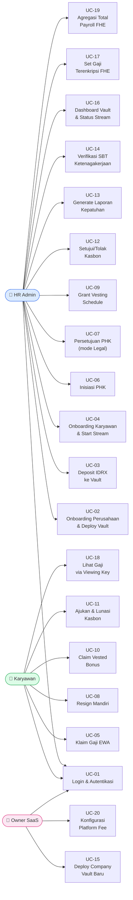
```mermaid
graph LR
    HR(["👤 HR Admin"])
    EMP(["👤 Karyawan"])
    OWNER(["👤 Owner SaaS"])

    HR --> UC01["UC-01\nLogin & Autentikasi"]
    HR --> UC02["UC-02\nOnboarding Perusahaan\n& Deploy Vault"]
    HR --> UC03["UC-03\nDeposit IDRX\nke Vault"]
    HR --> UC04["UC-04\nOnboarding Karyawan\n& Start Stream"]
    HR --> UC06["UC-06\nInisiasi PHK"]
    HR --> UC07["UC-07\nPersetujuan PHK\n(mode Legal)"]
    HR --> UC09["UC-09\nGrant Vesting\nSchedule"]
    HR --> UC12["UC-12\nSetujui/Tolak\nKasbon"]
    HR --> UC13["UC-13\nGenerate Laporan\nKepatuhan"]
    HR --> UC14["UC-14\nVerifikasi SBT\nKetenagakerjaan"]
    HR --> UC16["UC-16\nDashboard Vault\n& Status Stream"]
    HR --> UC17["UC-17\nSet Gaji\nTerenkripsi FHE"]
    HR --> UC19["UC-19\nAgregasi Total\nPayroll FHE"]

    EMP --> UC01
    EMP --> UC05["UC-05\nKlaim Gaji EWA"]
    EMP --> UC08["UC-08\nResign Mandiri"]
    EMP --> UC10["UC-10\nClaim Vested\nBonus"]
    EMP --> UC11["UC-11\nAjukan & Lunasi\nKasbon"]
    EMP --> UC18["UC-18\nLihat Gaji\nvia Viewing Key"]

    OWNER --> UC01
    OWNER --> UC15["UC-15\nDeploy Company\nVault Baru"]
    OWNER --> UC20["UC-20\nKonfigurasi\nPlatform Fee"]

    style HR fill:#dbeafe,stroke:#2563eb
    style EMP fill:#dcfce7,stroke:#16a34a
    style OWNER fill:#fce7f3,stroke:#db2777
```

> **Catatan:** Diagram disederhanakan menjadi tiga aktor persona utama (HR Admin, Karyawan, Owner SaaS) sesuai arahan pembimbing. Persetujuan PHK (UC-07) dan verifikasi SBT (UC-14), yang secara teknis dijalankan oleh pemegang `LEGAL_ROLE` on-chain atau pihak eksternal, digambarkan sebagai bagian dari domain HR Admin pada level diagram use case — detail teknis peran `LEGAL_ROLE` tetap didokumentasikan pada spesifikasi UC-07 dan pada DPPL (access control on-chain).

---

#### Spesifikasi Use Case

#### UC-01: Login dan Autentikasi

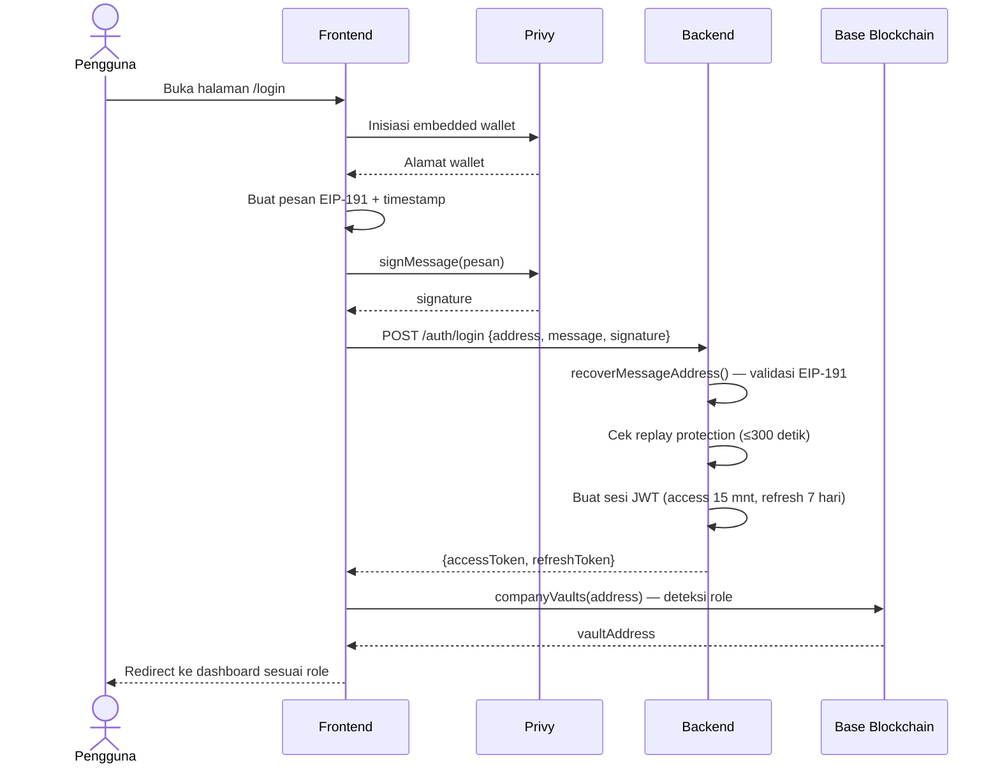
```mermaid
sequenceDiagram
    actor User as Pengguna
    participant FE as Frontend
    participant Privy
    participant BE as Backend
    participant Base as Base Blockchain

    User->>FE: Buka halaman /login
    FE->>Privy: Inisiasi embedded wallet
    Privy-->>FE: Alamat wallet
    FE->>FE: Buat pesan EIP-191 + timestamp
    FE->>Privy: signMessage(pesan)
    Privy-->>FE: signature
    FE->>BE: POST /auth/login {address, message, signature}
    BE->>BE: recoverMessageAddress() — validasi EIP-191
    BE->>BE: Cek replay protection (≤300 detik)
    BE->>BE: Buat sesi JWT (access 15 mnt, refresh 7 hari)
    BE-->>FE: {accessToken, refreshToken}
    FE->>Base: companyVaults(address) — deteksi role
    Base-->>FE: vaultAddress
    FE-->>User: Redirect ke dashboard sesuai role
```

| | |
|-|-|
| **Nama Use Case** | Login dan Autentikasi |
| **Deskripsi Singkat** | Pengguna (HR Admin, Karyawan, atau Legal Officer) melakukan autentikasi ke sistem Payana menggunakan tanda tangan kriptografis dari dompet digital mereka. |
| **Aktor** | HR Admin / Karyawan / Legal Officer |
| **Pre Kondisi** | Pengguna memiliki dompet Ethereum (MetaMask atau embedded wallet via Privy) dan telah terdaftar di sistem dengan role yang valid. |
| **Pos Kondisi** | Sistem menerbitkan JWT token; pengguna diarahkan ke dashboard sesuai perannya (HR, Employee, atau Legal). |
| **Basic Flow** | 1. Pengguna membuka halaman login Payana.   2. Sistem menampilkan opsi autentikasi melalui Privy (email, Google, atau koneksi langsung wallet).   3. Pengguna memilih metode autentikasi dan menyetujui permintaan tanda tangan pesan EIP-191 melalui dompet digital.   4. Privy memproses autentikasi dan mengembalikan JWT serta alamat wallet pengguna ke frontend.   5. Frontend mengirim JWT ke backend API melalui endpoint `GET /auth/me`.   6. Backend memverifikasi JWT, mengambil data profil pengguna dari database, dan menentukan role berdasarkan alamat wallet yang terdaftar on-chain.   7. Backend menerbitkan JWT token dengan klaim role dan wallet address, lalu mengembalikan data profil lengkap ke frontend.   8. Frontend membaca nilai role dan mengarahkan pengguna ke dashboard yang sesuai: HR Admin ke `/hr/vault`, Karyawan ke `/employee/ewa`, Legal Officer ke `/hr/phk`, atau Owner ke `/owner/dashboard`. |
| **Alternative Flow** | A1. Apabila pengguna sudah memiliki sesi JWT yang masih valid di browser, frontend langsung memanggil `GET /auth/me` tanpa menampilkan halaman login, sehingga pengguna otomatis diarahkan ke dashboard sesuai role.   A2. Apabila pengguna adalah Legal Officer, sistem memeriksa `LEGAL_ROLE` on-chain dan mengarahkan ke dashboard legal pada halaman `/hr/phk`. |
| **Error Flow** | E1. Apabila JWT tidak valid atau telah kedaluwarsa, backend mengembalikan status `401 Unauthorized`. Sistem menghapus token dari penyimpanan lokal dan menampilkan kembali halaman login dengan pesan "Sesi Anda telah berakhir. Silakan login kembali."   E2. Apabila wallet address tidak ditemukan dalam sistem (role null), pengguna diarahkan ke halaman `/onboarding` dengan pesan "Akun tidak ditemukan dalam sistem. Silakan lakukan pendaftaran."   E3. Apabila layanan Privy mengalami gangguan, frontend menampilkan pesan "Layanan autentikasi sedang tidak tersedia. Silakan coba beberapa saat lagi." dan menolak melanjutkan proses login. |

---

#### UC-02: Onboarding Perusahaan dan Deploy Vault

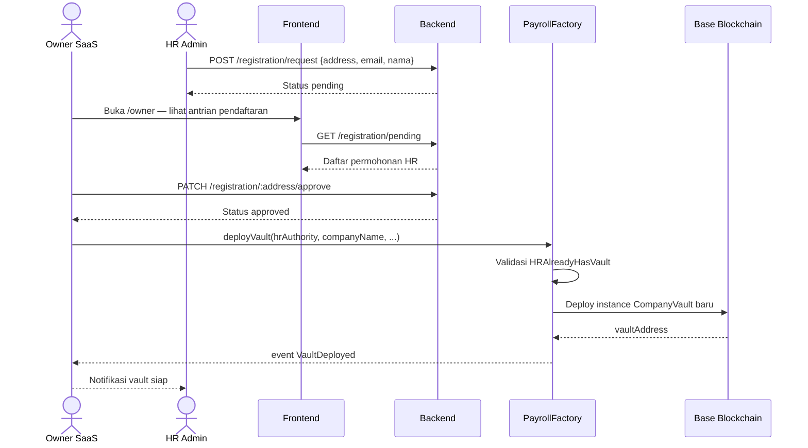
```mermaid
sequenceDiagram
    actor OWNER as Owner SaaS
    actor HR as HR Admin
    participant FE as Frontend
    participant BE as Backend
    participant SC as PayrollFactory
    participant Base as Base Blockchain

    HR->>BE: POST /registration/request {address, email, nama}
    BE-->>HR: Status pending
    OWNER->>FE: Buka /owner — lihat antrian pendaftaran
    FE->>BE: GET /registration/pending
    BE-->>FE: Daftar permohonan HR
    OWNER->>BE: PATCH /registration/:address/approve
    BE-->>OWNER: Status approved
    OWNER->>SC: deployVault(hrAuthority, companyName, ...)
    SC->>SC: Validasi HRAlreadyHasVault
    SC->>Base: Deploy instance CompanyVault baru
    Base-->>SC: vaultAddress
    SC-->>OWNER: event VaultDeployed
    OWNER-->>HR: Notifikasi vault siap
```

| | |
|-|-|
| **Nama Use Case** | Onboarding Perusahaan dan Deploy Vault |
| **Deskripsi Singkat** | HR Admin mendaftarkan perusahaan ke dalam sistem Payana dengan mengisi profil perusahaan, mengonfigurasi parameter alokasi dana gaji, dan men-deploy smart contract CompanyVault ke blockchain Base Sepolia melalui PayrollFactory. |
| **Aktor** | Owner SaaS / HR Admin |
| **Pre Kondisi** | HR Admin telah login dengan role `hr`. Akun HR Admin telah disetujui oleh Owner SaaS. Perusahaan belum memiliki vault aktif di sistem Payana. |
| **Pos Kondisi** | Smart contract CompanyVault berhasil di-deploy ke Base Sepolia. Alamat vault tersimpan di database backend. HR Admin diarahkan ke dashboard `/hr/vault` untuk mulai mengelola karyawan dan melakukan deposit awal. |
| **Basic Flow** | 1. HR Admin mengakses halaman `/hr/onboarding` setelah login pertama kali.   2. Sistem menampilkan wizard onboarding tiga langkah: Profil Perusahaan, Konfigurasi Split Alokasi Dana, dan Deploy Vault.   3. HR Admin mengisi formulir profil perusahaan: nama perusahaan, Nomor Pokok Wajib Pajak (NPWP), dan email penanggung jawab (PIC).   4. HR Admin meninjau dan mengonfirmasi parameter split alokasi dana default: 93% ke wallet karyawan, 5% ke Compliance Vault (BPJS/Pajak), dan 2% ke Severance Vault (pesangon). HR Admin dapat menyesuaikan nilai dalam satuan Basis Points (BPS) selama total tetap 10.000 BPS.   5. HR Admin mengklik "Deploy Vault". Frontend memanggil fungsi `PayrollFactory.deployVault(hrAddress, companyName, IDRX_address, liquidityPool_address)` melalui Privy.   6. Transaksi on-chain ditandatangani oleh HR Admin dan dikirim ke jaringan Base Sepolia. Frontend menampilkan indikator progres dengan pesan "Sedang men-deploy vault ke blockchain...".   7. Setelah transaksi dikonfirmasi, backend menerima webhook dari Alchemy dan menyimpan alamat vault baru beserta konfigurasi split ke database.   8. Sistem menampilkan konfirmasi keberhasilan dan mengarahkan HR Admin ke halaman `/hr/vault`. |
| **Alternative Flow** | A1. Apabila HR Admin mengubah parameter split pada langkah 4, frontend memvalidasi bahwa total BPS tepat 10.000. Jika valid, nilai kustom digunakan sebagai parameter deploy.   A2. HR Admin dapat melewati deposit awal dan melakukannya di lain waktu melalui `/hr/vault`. Namun, stream gaji karyawan tidak dapat dimulai sebelum vault memiliki saldo IDRX yang mencukupi. |
| **Error Flow** | E1. Apabila NPWP yang dimasukkan sudah terdaftar oleh perusahaan lain, backend mengembalikan error `409 Conflict` dengan pesan "NPWP ini sudah terdaftar dalam sistem. Silakan hubungi administrator."   E2. Apabila transaksi deploy gagal (revert) di smart contract karena parameter tidak valid, frontend menampilkan pesan "Deploy vault gagal. Silakan periksa konfigurasi dan coba kembali."   E3. Apabila wallet HR Admin tidak memiliki saldo ETH yang cukup untuk membayar gas, frontend menampilkan pesan "Saldo ETH tidak mencukupi untuk membayar gas. Silakan isi saldo ETH terlebih dahulu." |

---

#### UC-03: Deposit IDRX ke Vault Perusahaan

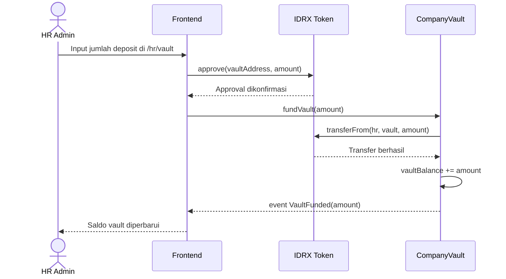
```mermaid
sequenceDiagram
    actor HR as HR Admin
    participant FE as Frontend
    participant IDRX as IDRX Token
    participant CV as CompanyVault

    HR->>FE: Input jumlah deposit di /hr/vault
    FE->>IDRX: approve(vaultAddress, amount)
    IDRX-->>FE: Approval dikonfirmasi
    FE->>CV: fundVault(amount)
    CV->>IDRX: transferFrom(hr, vault, amount)
    IDRX-->>CV: Transfer berhasil
    CV->>CV: vaultBalance += amount
    CV-->>FE: event VaultFunded(amount)
    FE-->>HR: Saldo vault diperbarui
```

| | |
|-|-|
| **Nama Use Case** | Deposit IDRX ke Vault Perusahaan |
| **Deskripsi Singkat** | HR Admin melakukan deposit token IDRX ke dalam CompanyVault perusahaan untuk memastikan ketersediaan likuiditas guna membayar akumulasi gaji karyawan, iuran kepatuhan, dan pesangon. |
| **Aktor** | HR Admin |
| **Pre Kondisi** | HR Admin telah login dengan role `hr`. CompanyVault perusahaan telah di-deploy dan aktif. HR Admin memiliki saldo IDRX yang cukup di wallet yang terhubung. |
| **Pos Kondisi** | Saldo IDRX dalam CompanyVault bertambah sesuai jumlah yang didepositkan. Audit log transaksi deposit tercatat di database backend. |
| **Basic Flow** | 1. HR Admin mengakses halaman `/hr/vault` dan melihat ringkasan saldo vault saat ini.   2. HR Admin mengklik tombol "Deposit IDRX".   3. Sistem menampilkan formulir deposit dengan informasi saldo IDRX yang tersedia di wallet HR Admin.   4. HR Admin memasukkan jumlah IDRX yang akan didepositkan ke vault.   5. HR Admin mengklik "Konfirmasi Deposit". Frontend terlebih dahulu memanggil fungsi `IDRX.approve(vaultAddress, amount)` untuk memberikan izin kepada vault mengambil token dari wallet HR Admin.   6. Setelah approval on-chain dikonfirmasi, frontend memanggil `CompanyVault.deposit(amount)`.   7. Smart contract menarik IDRX dari wallet HR Admin ke dalam vault dan memperbarui saldo vault on-chain.   8. Backend menerima webhook dari Alchemy, mencatat transaksi deposit di audit log, dan memperbarui saldo vault di database.   9. Frontend menampilkan notifikasi "Deposit berhasil. Saldo vault bertambah sebesar [jumlah] IDRX." dan memperbarui tampilan saldo vault secara real-time. |
| **Alternative Flow** | A1. Apabila HR Admin ingin melihat riwayat deposit sebelumnya, sistem menyediakan tab "Riwayat Transaksi" yang menampilkan daftar deposit beserta tanggal, jumlah, dan hash transaksi on-chain. |
| **Error Flow** | E1. Apabila vault sedang dalam kondisi dibekukan (`VaultFrozen`), smart contract menolak seluruh operasi deposit dan mengembalikan error. Frontend menampilkan pesan "Vault perusahaan sedang dibekukan oleh administrator. Seluruh operasi ditangguhkan hingga pembekuan dicabut."   E2. Apabila saldo IDRX di wallet HR Admin tidak mencukupi jumlah yang ingin didepositkan, transaksi approval akan gagal. Frontend menampilkan pesan "Saldo IDRX di wallet Anda tidak mencukupi untuk melakukan deposit sebesar [jumlah]."   E3. Apabila terjadi kegagalan transaksi on-chain pada tahap approval atau deposit, frontend menampilkan pesan "Transaksi gagal. Silakan periksa koneksi jaringan dan coba kembali." |

---

#### UC-04: Onboarding Karyawan dan Inisiasi Stream Gaji

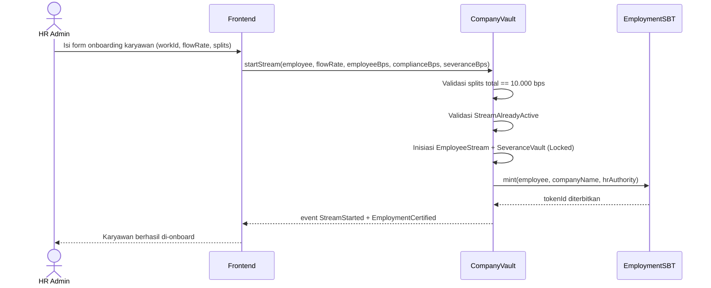
```mermaid
sequenceDiagram
    actor HR as HR Admin
    participant FE as Frontend
    participant CV as CompanyVault
    participant SBT as EmploymentSBT

    HR->>FE: Isi form onboarding karyawan (workId, flowRate, splits)
    FE->>CV: startStream(employee, flowRate, employeeBps, complianceBps, severanceBps)
    CV->>CV: Validasi splits total == 10.000 bps
    CV->>CV: Validasi StreamAlreadyActive
    CV->>CV: Inisiasi EmployeeStream + SeveranceVault (Locked)
    CV->>SBT: mint(employee, companyName, hrAuthority)
    SBT-->>CV: tokenId diterbitkan
    CV-->>FE: event StreamStarted + EmploymentCertified
    FE-->>HR: Karyawan berhasil di-onboard
```

| | |
|-|-|
| **Nama Use Case** | Onboarding Karyawan dan Inisiasi Stream Gaji |
| **Deskripsi Singkat** | HR Admin mendaftarkan karyawan baru ke dalam sistem Payana secara on-chain, menetapkan besaran gaji per detik (flow rate), dan memulai stream gaji real-time melalui CompanyVault. Karyawan akan mulai mengakumulasi gaji secara langsung setelah stream diaktifkan. |
| **Aktor** | HR Admin |
| **Pre Kondisi** | HR Admin telah login dengan role `hr`. CompanyVault perusahaan telah di-deploy dan memiliki saldo IDRX yang mencukupi. Karyawan yang akan di-onboarding telah terdaftar dan disetujui dalam sistem dengan role `employee`, serta memiliki alamat wallet yang valid. |
| **Pos Kondisi** | Data karyawan tersimpan on-chain di CompanyVault. Stream gaji karyawan berjalan aktif. Karyawan mulai mengakumulasi gaji secara real-time. Sertifikat ketenagakerjaan (EmploymentSBT) diterbitkan ke wallet karyawan. |
| **Basic Flow** | 1. HR Admin mengakses halaman `/hr/employees` dan mengklik "Tambah Karyawan".   2. Sistem menampilkan formulir onboarding karyawan. HR Admin mengisi data: nama lengkap karyawan, alamat wallet karyawan, besaran gaji bulanan (dalam IDRX), dan tanggal mulai bekerja.   3. Sistem menghitung flow rate per detik secara otomatis berdasarkan gaji bulanan yang dimasukkan (`flowRate = gajiPerBulan / (30 * 24 * 3600)`).   4. HR Admin meninjau konfigurasi split otomatis: 93% gaji bersih, 5% kepatuhan, 2% pesangon.   5. HR Admin mengklik "Mulai Stream". Frontend memanggil `CompanyVault.startStream(employeeAddress, flowRate)` melalui Privy.   6. Smart contract mendaftarkan karyawan, mencatat flow rate, dan memulai streaming gaji secara on-chain.   7. Smart contract menerbitkan EmploymentSBT (ERC-5192) ke wallet karyawan sebagai bukti hubungan kerja yang tidak dapat ditransfer.   8. Backend menerima webhook dari Alchemy, menyimpan data karyawan dan status stream ke database, serta mencatat waktu mulai stream.   9. Frontend menampilkan konfirmasi "Stream gaji berhasil dimulai. [Nama Karyawan] kini mulai mengakumulasi gaji secara real-time." |
| **Alternative Flow** | A1. Apabila HR Admin ingin menetapkan konfigurasi split khusus (misalnya karena bracket PPh21 karyawan berbeda), sistem menyediakan opsi override persentase split sebelum stream dimulai. Nilai baru divalidasi agar totalnya tetap 100%. |
| **Error Flow** | E1. Apabila stream untuk alamat wallet karyawan tersebut sudah pernah diaktifkan sebelumnya dan masih berjalan (`StreamAlreadyActive`), smart contract menolak dan mengembalikan error. Frontend menampilkan pesan "Stream gaji untuk karyawan ini sudah berjalan. Hentikan stream yang ada terlebih dahulu sebelum membuat stream baru."   E2. Apabila HR Admin tidak memiliki `HR_ROLE` yang valid di smart contract (`Unauthorized`), transaksi akan di-revert. Frontend menampilkan pesan "Akses ditolak. Anda tidak memiliki wewenang untuk memulai stream gaji."   E3. Apabila saldo vault tidak mencukupi untuk memulai stream (`InsufficientVaultBalance`), smart contract menolak operasi. Frontend menampilkan pesan "Saldo vault tidak mencukupi. Silakan lakukan deposit IDRX terlebih dahulu." |

---

#### UC-05: Karyawan Klaim Gaji Terakumulasi (EWA)

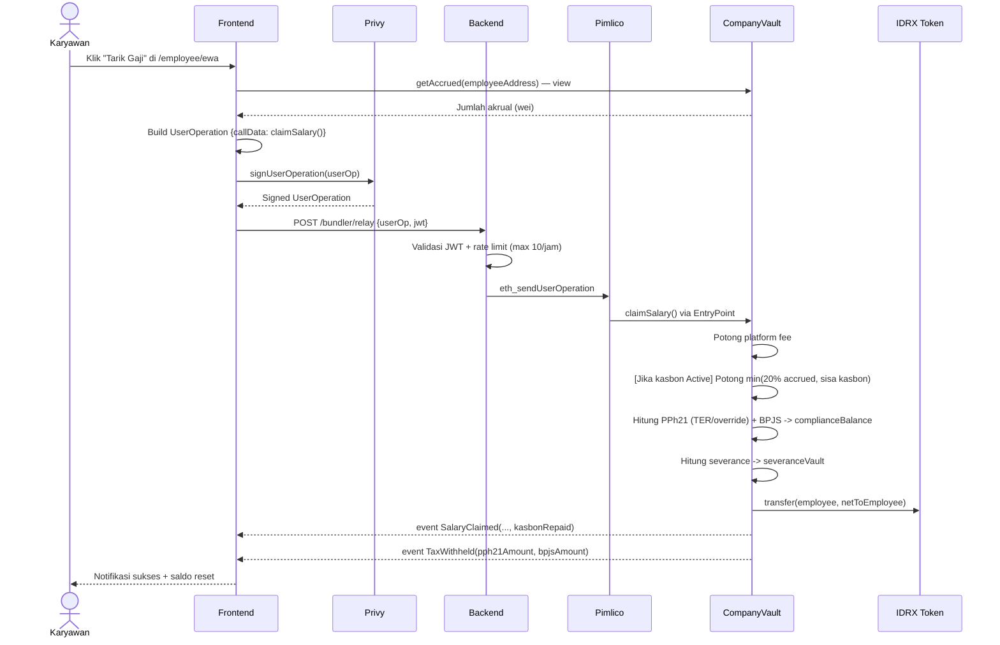
```mermaid
sequenceDiagram
    actor EMP as Karyawan
    participant FE as Frontend
    participant Privy
    participant BE as Backend
    participant Pimlico
    participant CV as CompanyVault
    participant IDRX as IDRX Token

    EMP->>FE: Klik "Tarik Gaji" di /employee/ewa
    FE->>CV: getAccrued(employeeAddress) — view
    CV-->>FE: Jumlah akrual (wei)
    FE->>FE: Build UserOperation {callData: claimSalary()}
    FE->>Privy: signUserOperation(userOp)
    Privy-->>FE: Signed UserOperation
    FE->>BE: POST /bundler/relay {userOp, jwt}
    BE->>BE: Validasi JWT + rate limit (max 10/jam)
    BE->>Pimlico: eth_sendUserOperation
    Pimlico->>CV: claimSalary() via EntryPoint
    CV->>CV: Potong platform fee
    CV->>CV: [Jika kasbon Active] Potong min(20% accrued, sisa kasbon)
    CV->>CV: Hitung PPh21 (TER/override) + BPJS -> complianceBalance
    CV->>CV: Hitung severance -> severanceVault
    CV->>IDRX: transfer(employee, netToEmployee)
    CV-->>FE: event SalaryClaimed(..., kasbonRepaid)
    CV-->>FE: event TaxWithheld(pph21Amount, bpjsAmount)
    FE-->>EMP: Notifikasi sukses + saldo reset
```

| | |
|-|-|
| **Nama Use Case** | Karyawan Klaim Gaji Terakumulasi (EWA) |
| **Deskripsi Singkat** | Karyawan mengakses fitur Earned Wage Access (EWA) untuk menarik gaji yang telah diakumulasikan secara real-time dari streaming contract. Transaksi dikemas sebagai UserOperation (ERC-4337), ditandatangani secara diam-diam oleh Privy, dan dieksekusi tanpa biaya gas (gasless) melalui Paymaster platform. |
| **Aktor** | Karyawan |
| **Pre Kondisi** | Karyawan telah login dengan role `employee`. HR Admin telah memulai stream gaji untuk karyawan tersebut dan stream dalam kondisi aktif. Terdapat saldo IDRX yang telah terakumulasi dan belum diklaim (lebih dari 0). |
| **Pos Kondisi** | Saldo IDRX terakumulasi direset ke nol. Karyawan menerima sisa akumulasi di wallet mereka setelah dipotong platform fee, cicilan kasbon (jika ada), PPh21+BPJS, dan porsi severance (2% default). Audit log transaksi tercatat di database. |
| **Basic Flow** | 1. Karyawan membuka halaman `/employee/ewa`.   2. Frontend membaca saldo terakumulasi secara real-time dari smart contract dan menampilkan nilai dalam IDRX beserta estimasi setara Rupiah.   3. Karyawan mengklik tombol "Tarik Gaji".   4. Frontend mengonstruksi UserOperation (ERC-4337) yang memanggil fungsi `CompanyVault.claimSalary()`. Privy menandatangani UserOperation secara diam-diam menggunakan kunci privat embedded wallet karyawan tanpa popup konfirmasi tambahan.   5. Frontend mengirimkan UserOperation yang telah ditandatangani ke backend melalui `POST /bundler/relay` beserta JWT autentikasi karyawan.   6. Backend memvalidasi JWT, memeriksa rate limit klaim, dan melampirkan Paymaster agar gas dibayarkan oleh platform (karyawan tidak perlu memiliki saldo ETH).   7. Backend mengirimkan UserOperation ke bundler on-chain di jaringan Base Sepolia.   8. Smart contract `CompanyVault.claimSalary()` dieksekusi: platform fee dipotong, lalu apabila karyawan memiliki kasbon berstatus `Active`, cicilan `min(20% accrued, sisa kasbon)` dipotong otomatis (lihat UC-11). Sisanya dipotong PPh21 (TER atau override HR) + BPJS ke Compliance Vault, dan porsi severance ke Severance Vault. Sisa bersih ditransfer ke wallet karyawan.   9. Backend menerima webhook dari Alchemy, memperbarui audit log, dan mengirimkan notifikasi melalui WebSocket ke frontend.   10. Frontend memperbarui tampilan saldo (direset ke nol) dan menampilkan notifikasi "Penarikan berhasil! Dana sebesar [jumlah] IDRX telah dikirim ke wallet Anda." |
| **Alternative Flow** | A1. Apabila karyawan memiliki kasbon aktif, frontend menampilkan rincian potongan cicilan sebelum klaim dieksekusi, sehingga karyawan mengetahui jumlah bersih yang akan diterima.   A2. Apabila karyawan mengklik "Batal" setelah langkah 3 namun sebelum UserOperation dikirim ke bundler, proses dibatalkan tanpa efek on-chain apapun. |
| **Error Flow** | E1. Apabila stream gaji karyawan belum aktif atau telah dihentikan (`StreamNotActive`), smart contract menolak klaim. Frontend menampilkan pesan "Stream gaji Anda belum aktif. Hubungi HR Admin untuk memulai stream."   E2. Apabila tidak ada akumulasi gaji yang dapat diklaim (`NothingToClaim`), backend menolak permintaan dengan pesan "Tidak ada saldo yang dapat ditarik saat ini. Saldo Anda akan diperbarui seiring berjalannya waktu."   E3. Apabila saldo CompanyVault tidak mencukupi untuk membayar klaim (`InsufficientVaultBalance`), smart contract menolak transaksi. Frontend menampilkan pesan "Dana vault perusahaan tidak mencukupi. Silakan hubungi HR Admin Anda."   E4. Apabila batas klaim per jam terlampaui, backend menolak permintaan dengan status `429 Too Many Requests` dan pesan "Batas klaim telah tercapai. Anda dapat melakukan klaim kembali dalam [X] menit." |

---

#### UC-06: Inisiasi PHK oleh HR Admin

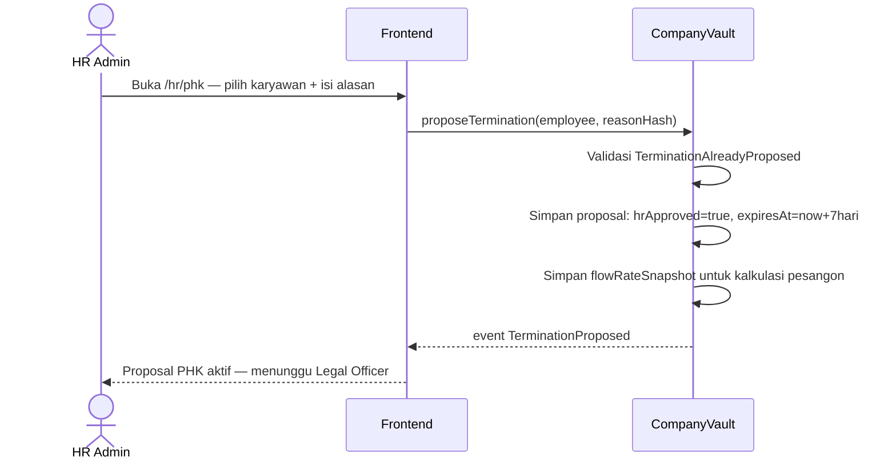
```mermaid
sequenceDiagram
    actor HR as HR Admin
    participant FE as Frontend
    participant CV as CompanyVault

    HR->>FE: Buka /hr/phk — pilih karyawan + isi alasan
    FE->>CV: proposeTermination(employee, reasonHash)
    CV->>CV: Validasi TerminationAlreadyProposed
    CV->>CV: Simpan proposal: hrApproved=true, expiresAt=now+7hari
    CV->>CV: Simpan flowRateSnapshot untuk kalkulasi pesangon
    CV-->>FE: event TerminationProposed
    FE-->>HR: Proposal PHK aktif — menunggu Legal Officer
```

| | |
|-|-|
| **Nama Use Case** | Inisiasi PHK oleh HR Admin |
| **Deskripsi Singkat** | HR Admin mengajukan proposal Pemutusan Hubungan Kerja (PHK) terhadap karyawan tertentu melalui smart contract CompanyVault. Proposal ini memerlukan persetujuan Legal Officer sebelum dapat dieksekusi, sebagai mekanisme pengamanan hukum dua pihak (multi-signature). |
| **Aktor** | HR Admin |
| **Pre Kondisi** | HR Admin telah login dengan role `hr`. Karyawan yang akan di-PHK memiliki status aktif dengan stream gaji yang sedang berjalan. Belum ada proposal PHK aktif untuk karyawan tersebut. |
| **Pos Kondisi** | Proposal PHK tersimpan di smart contract dengan status `menunggu_persetujuan_legal`. Legal Officer menerima notifikasi untuk meninjau proposal. Stream gaji karyawan ditangguhkan sementara menunggu eksekusi. |
| **Basic Flow** | 1. HR Admin mengakses halaman `/hr/phk` dan mengklik "Buat Proposal PHK".   2. Sistem menampilkan formulir proposal PHK. HR Admin memilih nama karyawan dari daftar karyawan aktif perusahaan.   3. HR Admin mengisi formulir: alasan PHK (restrukturisasi, pelanggaran berat, berakhirnya kontrak, atau lainnya), tanggal efektif yang diusulkan, dan catatan tambahan pendukung.   4. HR Admin mengklik "Ajukan Proposal". Frontend memanggil `CompanyVault.proposeTermination(employeeAddress, reason, effectiveDate)` melalui Privy.   5. Smart contract memverifikasi bahwa HR Admin memiliki `HR_ROLE` yang valid dan tidak ada proposal PHK aktif untuk karyawan tersebut.   6. Proposal tersimpan on-chain dengan timestamp pengajuan dan batas waktu persetujuan (misalnya 30 hari). Status berubah menjadi `menunggu_persetujuan_legal`.   7. Backend menerima webhook dari Alchemy, menyimpan data proposal ke database, dan mengirimkan notifikasi ke Legal Officer melalui email dan notifikasi in-app.   8. Frontend menampilkan konfirmasi "Proposal PHK berhasil diajukan dan sedang menunggu persetujuan Legal Officer." |
| **Alternative Flow** | A1. Apabila HR Admin ingin membatalkan proposal sebelum Legal Officer memberikan keputusan, HR dapat memanggil `CompanyVault.cancelProposal(employeeAddress)`. Status proposal berubah menjadi `dibatalkan` dan Legal Officer menerima notifikasi pembatalan. |
| **Error Flow** | E1. Apabila sudah terdapat proposal PHK aktif yang belum selesai diproses untuk karyawan yang sama (`TerminationAlreadyProposed`), smart contract menolak pengajuan baru. Frontend menampilkan pesan "Proposal PHK untuk karyawan ini sudah pernah diajukan dan masih dalam proses. Selesaikan atau batalkan proposal yang ada sebelum membuat proposal baru."   E2. Apabila HR Admin tidak memiliki `HR_ROLE` yang valid di smart contract (`Unauthorized`), transaksi akan di-revert. Frontend menampilkan pesan "Akses ditolak. Anda tidak memiliki wewenang untuk mengajukan proposal PHK."   E3. Apabila karyawan yang dipilih tidak ditemukan atau sudah dalam status non-aktif, backend mengembalikan error `404 Not Found`. Frontend menampilkan pesan "Karyawan tidak ditemukan atau sudah tidak aktif dalam sistem." |

---

#### UC-07: Persetujuan PHK (mode Legal)

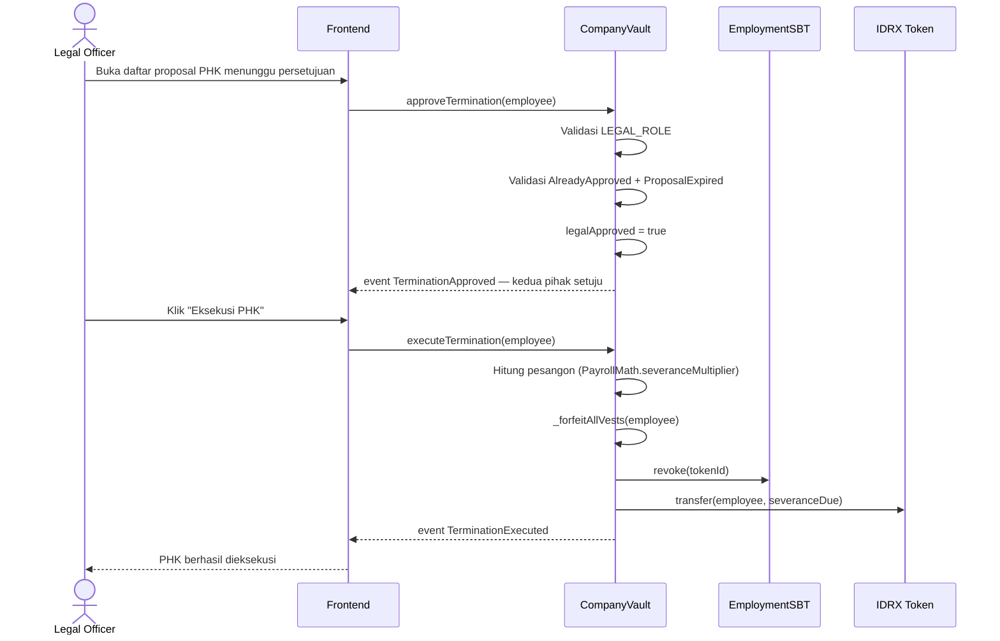
```mermaid
sequenceDiagram
    actor LEGAL as Legal Officer
    participant FE as Frontend
    participant CV as CompanyVault
    participant SBT as EmploymentSBT
    participant IDRX as IDRX Token

    LEGAL->>FE: Buka daftar proposal PHK menunggu persetujuan
    FE->>CV: approveTermination(employee)
    CV->>CV: Validasi LEGAL_ROLE
    CV->>CV: Validasi AlreadyApproved + ProposalExpired
    CV->>CV: legalApproved = true
    CV-->>FE: event TerminationApproved — kedua pihak setuju
    LEGAL->>FE: Klik "Eksekusi PHK"
    FE->>CV: executeTermination(employee)
    CV->>CV: Hitung pesangon (PayrollMath.severanceMultiplier)
    CV->>CV: _forfeitAllVests(employee)
    CV->>SBT: revoke(tokenId)
    CV->>IDRX: transfer(employee, severanceDue)
    CV-->>FE: event TerminationExecuted
    FE-->>LEGAL: PHK berhasil dieksekusi
```

| | |
|-|-|
| **Nama Use Case** | Persetujuan PHK (mode Legal) |
| **Deskripsi Singkat** | Pemegang wewenang legal (di level persona diagram digambarkan sebagai bagian dari domain HR Admin; secara teknis on-chain dikendalikan oleh alamat pemegang `LEGAL_ROLE`, bisa staf legal internal terpisah atau HR Admin yang juga diberi role tersebut) meninjau proposal PHK yang diajukan, memverifikasi kelengkapan dokumen dan kepatuhan hukum, kemudian memberikan persetujuan atau penolakan. Setelah disetujui, eksekusi PHK final dapat dilakukan on-chain. |
| **Aktor** | HR Admin (pemegang `LEGAL_ROLE`) |
| **Pre Kondisi** | Legal Officer telah login dengan role `legal`. Terdapat minimal satu proposal PHK dengan status `menunggu_persetujuan_legal` di database. Proposal belum kedaluwarsa (masih dalam batas waktu persetujuan 30 hari). |
| **Pos Kondisi** | Status proposal PHK berubah menjadi `disetujui` atau `ditolak`. Apabila disetujui, HR Admin dapat mengeksekusi PHK final yang akan mencabut SBT karyawan, menghentikan stream, dan mencairkan pesangon. |
| **Basic Flow** | 1. Legal Officer menerima notifikasi melalui email atau in-app bahwa ada proposal PHK yang memerlukan persetujuan.   2. Legal Officer login dan mengakses halaman `/hr/phk`, kemudian melihat daftar proposal dengan status "Menunggu Persetujuan Legal".   3. Legal Officer mengklik proposal untuk melihat detail: nama karyawan, alasan PHK yang diajukan HR, tanggal efektif, catatan pendukung, dan riwayat kinerja karyawan.   4. Legal Officer meninjau kelengkapan dokumen dan memastikan alasan PHK sesuai dengan ketentuan hukum ketenagakerjaan yang berlaku.   5. Legal Officer mengklik "Setujui". Frontend memanggil `CompanyVault.approveTermination(employeeAddress)` menggunakan akun Legal Officer yang memiliki `LEGAL_ROLE`.   6. Smart contract memverifikasi bahwa pemanggil memiliki `LEGAL_ROLE`, proposal masih aktif dan belum kedaluwarsa, serta Legal Officer ini belum pernah menyetujui proposal yang sama sebelumnya.   7. Status proposal berubah menjadi `disetujui` on-chain.   8. Backend menerima webhook, memperbarui status di database, dan mengirimkan notifikasi ke HR Admin bahwa PHK siap dieksekusi.   9. Frontend menampilkan konfirmasi "Persetujuan PHK berhasil diberikan. HR Admin akan mengeksekusi PHK secara final." |
| **Alternative Flow** | A1. Apabila Legal Officer menolak proposal, pada langkah 5 Legal Officer mengklik "Tolak" dan mengisi alasan penolakan secara tertulis. Frontend memanggil `CompanyVault.rejectTermination(employeeAddress, reason)`. Status proposal berubah menjadi `ditolak_legal`. HR Admin menerima notifikasi penolakan beserta alasannya dan dapat mengajukan proposal baru dengan perbaikan. |
| **Error Flow** | E1. Apabila Legal Officer yang sama mencoba menyetujui proposal yang sudah pernah disetujui oleh akun mereka sebelumnya (`AlreadyApproved`), smart contract menolak dan mengembalikan error. Frontend menampilkan pesan "Anda sudah memberikan persetujuan untuk proposal PHK ini sebelumnya."   E2. Apabila proposal PHK telah melampaui batas waktu persetujuan yang ditetapkan (`ProposalExpired`), smart contract menolak aksi approval. Frontend menampilkan pesan "Proposal PHK ini telah kedaluwarsa. HR Admin perlu mengajukan proposal baru."   E3. Apabila Legal Officer tidak memiliki `LEGAL_ROLE` yang valid di smart contract (`Unauthorized`), transaksi akan di-revert. Frontend menampilkan pesan "Akses ditolak. Anda tidak memiliki wewenang sebagai Legal Officer untuk menyetujui PHK." |

---

#### UC-08: Karyawan Resign Mandiri

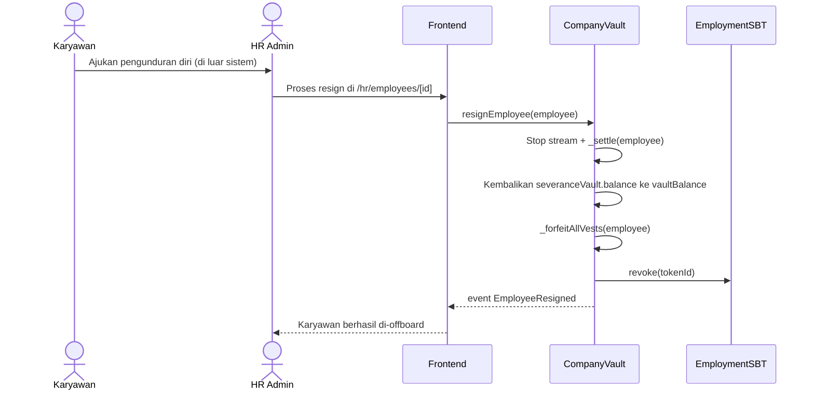
```mermaid
sequenceDiagram
    actor EMP as Karyawan
    actor HR as HR Admin
    participant FE as Frontend
    participant CV as CompanyVault
    participant SBT as EmploymentSBT

    EMP->>HR: Ajukan pengunduran diri (di luar sistem)
    HR->>FE: Proses resign di /hr/employees/[id]
    FE->>CV: resignEmployee(employee)
    CV->>CV: Stop stream + _settle(employee)
    CV->>CV: Kembalikan severanceVault.balance ke vaultBalance
    CV->>CV: _forfeitAllVests(employee)
    CV->>SBT: revoke(tokenId)
    CV-->>FE: event EmployeeResigned
    FE-->>HR: Karyawan berhasil di-offboard
```

| | |
|-|-|
| **Nama Use Case** | Karyawan Resign Mandiri |
| **Deskripsi Singkat** | Karyawan mengajukan pengunduran diri secara mandiri melalui aplikasi Payana. Sistem memproses permintaan resign, menghentikan stream gaji setelah periode pemberitahuan (notice period) berakhir, dan memproses hak-hak karyawan sesuai ketentuan yang berlaku. |
| **Aktor** | Karyawan |
| **Pre Kondisi** | Karyawan telah login dengan role `employee`. Karyawan memiliki stream gaji yang sedang berjalan secara aktif. Karyawan belum memiliki proses resign atau PHK yang sedang berjalan. |
| **Pos Kondisi** | Pengajuan resign tercatat di sistem dengan status `dalam_proses`. Stream gaji tetap berjalan selama notice period. Setelah notice period berakhir, stream dihentikan, SBT dicabut, sisa akumulasi gaji dapat diklaim, dan dana Severance Vault diproses sesuai kebijakan perusahaan. |
| **Basic Flow** | 1. Karyawan mengakses halaman `/employee/profile` dan mengklik menu "Pengajuan Resign".   2. Sistem menampilkan formulir pengajuan resign beserta informasi notice period yang berlaku (umumnya 30 hari) dan estimasi hak-hak yang akan diterima.   3. Karyawan mengisi alasan resign (opsional) dan memilih tanggal efektif yang diinginkan (minimal setelah notice period).   4. Karyawan mengklik "Ajukan Resign" dan mengonfirmasi tindakan pada dialog konfirmasi.   5. Frontend mengirimkan permintaan `POST /employee/resign` ke backend beserta JWT autentikasi dan data formulir.   6. Backend mencatat pengajuan resign di database dengan status `dalam_proses` dan menghitung tanggal efektif berdasarkan notice period perusahaan.   7. Backend mengirimkan notifikasi ke HR Admin bahwa karyawan telah mengajukan resign.   8. Pada tanggal efektif yang telah ditentukan, backend secara otomatis memicu pemanggilan `CompanyVault.stopStream(employeeAddress)` dan `EmploymentSBT.revoke(employeeAddress)` melalui mekanisme scheduler.   9. Sisa saldo akumulasi gaji dapat diklaim oleh karyawan dalam periode tertentu setelah stream dihentikan.   10. Frontend menampilkan konfirmasi "Pengajuan resign Anda telah diterima. Stream gaji akan dihentikan pada [tanggal efektif]." |
| **Alternative Flow** | A1. Apabila karyawan ingin membatalkan pengajuan resign sebelum tanggal efektif, karyawan dapat mengakses halaman yang sama dan mengklik "Batalkan Resign". Backend memperbarui status menjadi `dibatalkan` dan HR Admin menerima notifikasi pembatalan. |
| **Error Flow** | E1. Apabila stream karyawan sudah tidak aktif (`StreamNotActive`) saat sistem mencoba menghentikannya pada tanggal efektif (misalnya karena sudah dihentikan oleh HR Admin karena alasan lain), sistem mencatat kondisi ini dan melanjutkan proses pencabutan SBT dan penyelesaian hak tanpa menghentikan stream.   E2. Apabila karyawan sudah memiliki proses resign atau PHK yang sedang berjalan dan mencoba mengajukan resign kembali, backend mengembalikan error `409 Conflict` dengan pesan "Anda sudah memiliki proses pengunduran diri yang sedang berlangsung."   E3. Apabila terjadi kegagalan on-chain saat eksekusi penghentian stream pada tanggal efektif, sistem mengirimkan notifikasi kepada HR Admin untuk melakukan eksekusi manual. |

---

#### UC-09: HR Grant Vesting Schedule ke Karyawan

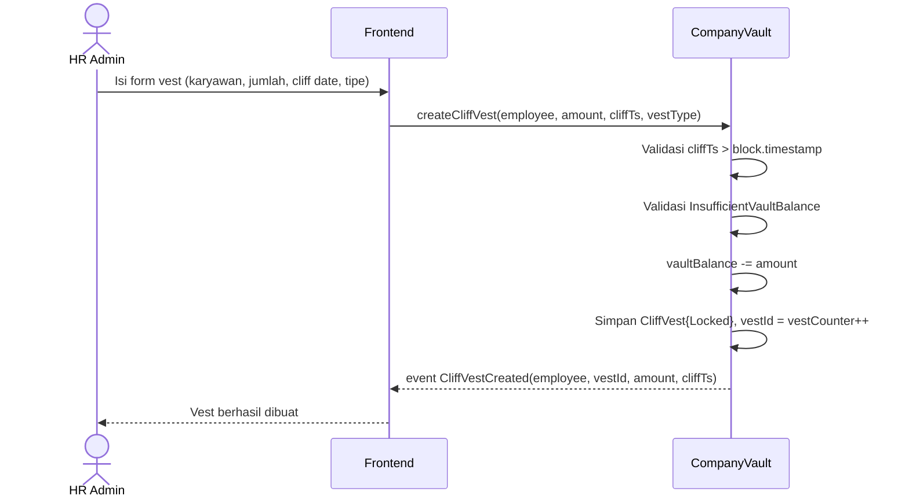
```mermaid
sequenceDiagram
    actor HR as HR Admin
    participant FE as Frontend
    participant CV as CompanyVault

    HR->>FE: Isi form vest (karyawan, jumlah, cliff date, tipe)
    FE->>CV: createCliffVest(employee, amount, cliffTs, vestType)
    CV->>CV: Validasi cliffTs > block.timestamp
    CV->>CV: Validasi InsufficientVaultBalance
    CV->>CV: vaultBalance -= amount
    CV->>CV: Simpan CliffVest{Locked}, vestId = vestCounter++
    CV-->>FE: event CliffVestCreated(employee, vestId, amount, cliffTs)
    FE-->>HR: Vest berhasil dibuat
```

| | |
|-|-|
| **Nama Use Case** | HR Grant Vesting Schedule ke Karyawan |
| **Deskripsi Singkat** | HR Admin mengunci sejumlah IDRX dalam mekanisme cliff vesting untuk karyawan tertentu sebagai bentuk insentif retensi, bonus kinerja tahunan, atau kompensasi jangka panjang. Dana terkunci hingga tanggal cliff terlewati, setelah itu karyawan dapat mengklaim secara mandiri. |
| **Aktor** | HR Admin |
| **Pre Kondisi** | HR Admin telah login dengan role `hr`. CompanyVault perusahaan memiliki saldo IDRX yang mencukupi untuk dikunci dalam vesting. Karyawan yang menjadi target vesting memiliki status aktif dan stream gaji yang berjalan. |
| **Pos Kondisi** | Entri vesting baru tercatat on-chain di CompanyVault dengan status `terkunci`. Sejumlah IDRX dikunci eksklusif untuk karyawan penerima hingga tanggal cliff. Karyawan menerima notifikasi bahwa vesting telah dibuat. |
| **Basic Flow** | 1. HR Admin mengakses halaman `/hr/vesting` yang menampilkan daftar vesting aktif seluruh karyawan.   2. HR Admin mengklik "Buat Vesting Baru". Sistem menampilkan formulir pembuatan vesting.   3. HR Admin mengisi formulir: pilih karyawan penerima dari daftar karyawan aktif, masukkan jumlah IDRX yang akan dikunci, tentukan tanggal cliff (tanggal mulai karyawan dapat mengklaim), dan pilih jenis vesting (bonus tahunan, insentif kinerja, retensi jangka panjang, atau lainnya).   4. Sistem menampilkan ringkasan vesting untuk dikonfirmasi oleh HR Admin, termasuk perhitungan jumlah hari hingga cliff.   5. HR Admin mengklik "Buat Vesting". Frontend memanggil `CompanyVault.createCliffVest(employeeAddress, amount, cliffTimestamp, vestType)` melalui Privy.   6. Smart contract memvalidasi bahwa saldo vault mencukupi, lalu mengunci sejumlah `amount` IDRX secara eksklusif untuk karyawan tersebut dengan ID vesting unik yang digenerate.   7. Backend menerima webhook dari Alchemy dan mencatat entri vesting baru di database dengan status `locked` beserta metadata cliff.   8. Backend mengirimkan notifikasi ke karyawan bahwa vesting telah dibuat atas nama mereka.   9. Frontend menampilkan konfirmasi "Cliff vesting berhasil dibuat. Dana [jumlah] IDRX akan dapat diklaim oleh [nama karyawan] mulai tanggal [tanggal cliff]." |
| **Alternative Flow** | A1. Apabila HR Admin ingin membatalkan vesting sebelum karyawan mengklaimnya, HR dapat memanggil `CompanyVault.cancelVesting(vestId)`. Dana dikembalikan ke saldo vault yang tersedia dan karyawan menerima notifikasi pembatalan. |
| **Error Flow** | E1. Apabila saldo vault tidak mencukupi untuk mengunci jumlah yang dimasukkan (`InsufficientVaultBalance`), smart contract menolak transaksi. Frontend menampilkan pesan "Saldo vault tidak mencukupi untuk membuat vesting sebesar [jumlah] IDRX. Silakan lakukan deposit terlebih dahulu."   E2. Apabila HR Admin tidak memiliki `HR_ROLE` yang valid (`Unauthorized`), transaksi akan di-revert. Frontend menampilkan pesan "Akses ditolak. Anda tidak memiliki wewenang untuk membuat vesting schedule."   E3. Apabila tanggal cliff yang dimasukkan sudah terlewati (tanggal di masa lalu), frontend memvalidasi dan menampilkan pesan "Tanggal cliff tidak valid. Tanggal cliff harus berada di masa mendatang." |

---

#### UC-10: Karyawan Claim Vested Bonus

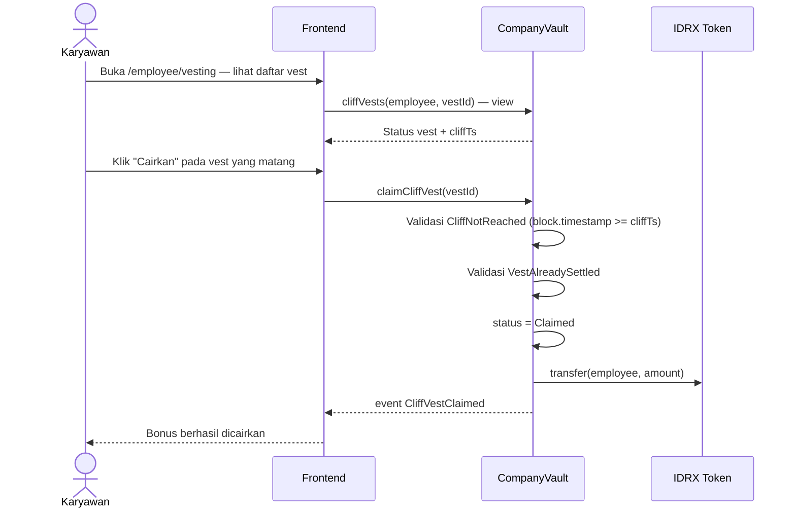
```mermaid
sequenceDiagram
    actor EMP as Karyawan
    participant FE as Frontend
    participant CV as CompanyVault
    participant IDRX as IDRX Token

    EMP->>FE: Buka /employee/vesting — lihat daftar vest
    FE->>CV: cliffVests(employee, vestId) — view
    CV-->>FE: Status vest + cliffTs
    EMP->>FE: Klik "Cairkan" pada vest yang matang
    FE->>CV: claimCliffVest(vestId)
    CV->>CV: Validasi CliffNotReached (block.timestamp >= cliffTs)
    CV->>CV: Validasi VestAlreadySettled
    CV->>CV: status = Claimed
    CV->>IDRX: transfer(employee, amount)
    CV-->>FE: event CliffVestClaimed
    FE-->>EMP: Bonus berhasil dicairkan
```

| | |
|-|-|
| **Nama Use Case** | Karyawan Claim Vested Bonus |
| **Deskripsi Singkat** | Karyawan mengklaim dana bonus yang telah melampaui periode cliff vesting. Setelah tanggal cliff terlewati, karyawan dapat mengeksekusi klaim secara mandiri on-chain dan menerima dana IDRX langsung ke wallet mereka. |
| **Aktor** | Karyawan |
| **Pre Kondisi** | Karyawan telah login dengan role `employee`. HR Admin telah membuat entri vesting untuk karyawan tersebut. Tanggal saat ini telah melampaui tanggal cliff yang ditetapkan. Dana vesting belum pernah diklaim sebelumnya. |
| **Pos Kondisi** | Dana IDRX yang terkunci dalam vesting dicairkan dan dikirim ke wallet karyawan. Status entri vesting berubah menjadi `claimed` di database dan on-chain. Audit log klaim tercatat di backend. |
| **Basic Flow** | 1. Karyawan membuka halaman `/employee/vesting` yang menampilkan daftar seluruh entri vesting milik karyawan tersebut.   2. Sistem menampilkan setiap entri vesting dengan informasi: jenis vesting, jumlah IDRX, tanggal cliff, status (terkunci atau siap klaim), dan sisa waktu hingga cliff apabila belum jatuh tempo.   3. Apabila tanggal saat ini sudah melewati tanggal cliff, tombol "Klaim" pada entri tersebut aktif. Apabila belum, tombol ditampilkan dalam kondisi nonaktif dengan countdown waktu tersisa.   4. Karyawan mengklik tombol "Klaim" pada entri vesting yang sudah jatuh tempo.   5. Frontend memanggil `CompanyVault.claimCliffVest(vestId)` melalui UserOperation (ERC-4337) yang ditandatangani Privy secara diam-diam.   6. Smart contract memvalidasi bahwa `block.timestamp >= cliffTimestamp`, vesting belum pernah diklaim, dan `vestId` adalah milik pemanggil.   7. Dana IDRX dicairkan dari vault ke wallet karyawan secara on-chain.   8. Backend menerima webhook, memperbarui status vesting menjadi `claimed` di database, dan mencatat transaksi di audit log.   9. Frontend menampilkan notifikasi "Dana vesting sebesar [jumlah] IDRX berhasil diklaim dan telah masuk ke wallet Anda." dan memperbarui tampilan daftar vesting. |
| **Alternative Flow** | A1. Apabila karyawan memiliki beberapa entri vesting yang siap diklaim secara bersamaan, karyawan dapat mengklaim satu per satu dari daftar yang tersedia di halaman yang sama. |
| **Error Flow** | E1. Apabila karyawan mencoba mengklaim sebelum tanggal cliff tercapai (`CliffNotReached`), smart contract menolak transaksi. Frontend menampilkan pesan "Dana vesting belum dapat diklaim. Cliff period belum tercapai. Tersisa [X hari Y jam] lagi."   E2. Apabila vesting sudah pernah diklaim sebelumnya (`VestAlreadySettled`), smart contract menolak transaksi karena flag `settled` sudah bernilai benar. Frontend menampilkan pesan "Vesting ini sudah pernah diklaim sebelumnya. Silakan periksa riwayat transaksi Anda."   E3. Apabila ID vesting yang dikirimkan tidak ditemukan atau bukan milik karyawan yang memanggil (`VestNotFound`), smart contract mengembalikan error. Frontend menampilkan pesan "Entri vesting tidak ditemukan atau Anda tidak memiliki akses untuk mengklaim vesting ini."   E4. Apabila saldo vault tidak mencukupi saat klaim dieksekusi akibat kondisi tidak terduga (`InsufficientVaultBalance`), transaksi di-revert. Frontend menampilkan pesan "Terjadi kesalahan sistem. Silakan hubungi HR Admin Anda." |

---

#### UC-11: Karyawan Mengajukan dan Melunasi Kasbon

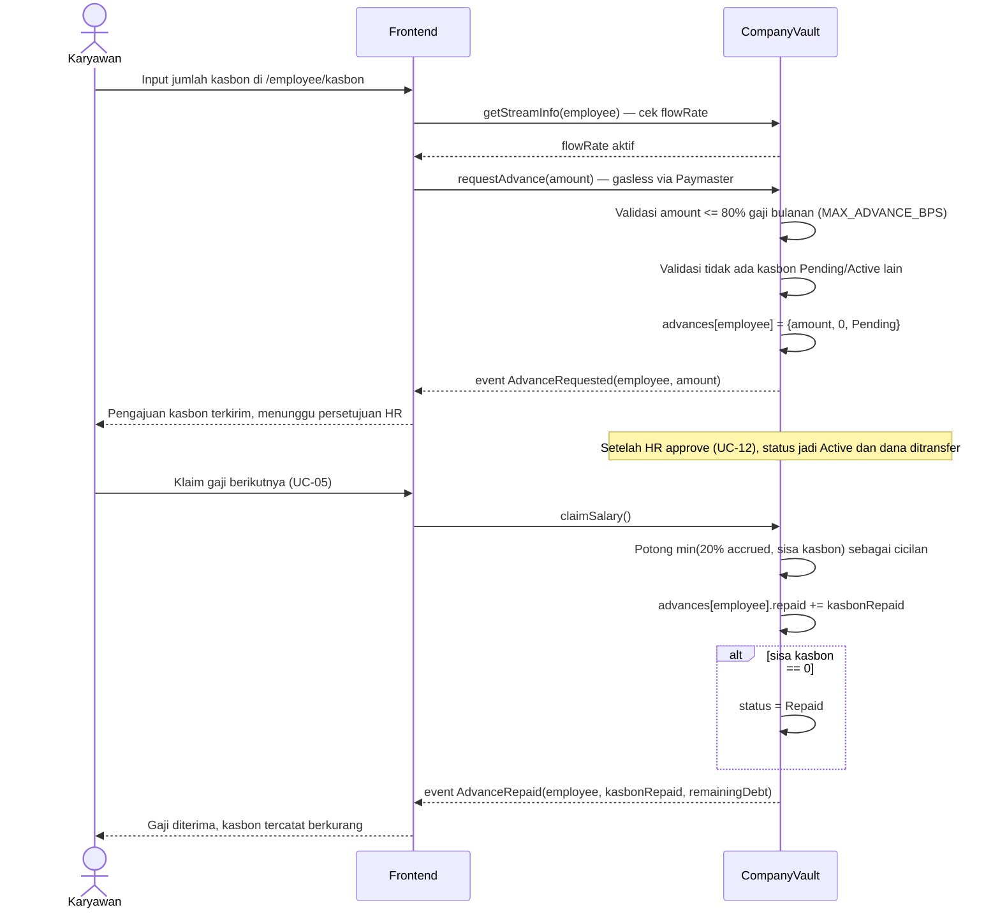
```mermaid
sequenceDiagram
    actor EMP as Karyawan
    participant FE as Frontend
    participant CV as CompanyVault

    EMP->>FE: Input jumlah kasbon di /employee/kasbon
    FE->>CV: getStreamInfo(employee) — cek flowRate
    CV-->>FE: flowRate aktif
    FE->>CV: requestAdvance(amount) — gasless via Paymaster
    CV->>CV: Validasi amount <= 80% gaji bulanan (MAX_ADVANCE_BPS)
    CV->>CV: Validasi tidak ada kasbon Pending/Active lain
    CV->>CV: advances[employee] = {amount, 0, Pending}
    CV-->>FE: event AdvanceRequested(employee, amount)
    FE-->>EMP: Pengajuan kasbon terkirim, menunggu persetujuan HR

    Note over CV: Setelah HR approve (UC-12), status jadi Active dan dana ditransfer

    EMP->>FE: Klaim gaji berikutnya (UC-05)
    FE->>CV: claimSalary()
    CV->>CV: Potong min(20% accrued, sisa kasbon) sebagai cicilan
    CV->>CV: advances[employee].repaid += kasbonRepaid
    alt sisa kasbon == 0
        CV->>CV: status = Repaid
    end
    CV-->>FE: event AdvanceRepaid(employee, kasbonRepaid, remainingDebt)
    FE-->>EMP: Gaji diterima, kasbon tercatat berkurang
```

| | |
|-|-|
| **Nama Use Case** | Karyawan Mengajukan dan Melunasi Kasbon |
| **Deskripsi Singkat** | Karyawan mengajukan uang muka gaji (kasbon) hingga 80% dari estimasi gaji bulanan yang belum accrued. Dana kasbon bersumber langsung dari `vaultBalance` perusahaan, disetujui manual oleh HR (UC-12), dan dilunasi otomatis melalui pemotongan sebagian dari setiap klaim gaji berikutnya. |
| **Aktor** | Karyawan |
| **Pre Kondisi** | Karyawan telah login dengan role `employee` dan memiliki stream gaji aktif. Karyawan tidak memiliki kasbon berstatus `Pending` atau `Active` lainnya. |
| **Pos Kondisi** | Pengajuan kasbon tercatat dengan status `Pending` menunggu persetujuan HR. Setelah disetujui dan dana ditransfer (status `Active`), setiap klaim gaji berikutnya otomatis memotong cicilan hingga status menjadi `Repaid`. |
| **Basic Flow** | 1. Karyawan membuka halaman `/employee/kasbon`.   2. Sistem menampilkan estimasi gaji bulanan, limit kasbon maksimal (80% dari estimasi), dan status kasbon saat ini (jika ada).   3. Karyawan memasukkan jumlah kasbon yang diinginkan (≤ limit) dan mengklik "Ajukan Kasbon".   4. Frontend memanggil `requestAdvance(amount)` melalui UserOperation gasless (ERC-4337, ditandatangani Privy).   5. Smart contract memvalidasi limit 80% dan ketiadaan kasbon aktif/pending lain, lalu mencatat status `Pending` dan menerbitkan event `AdvanceRequested`.   6. Backend menerima webhook, mencatat pengajuan, dan mengirim notifikasi ke HR untuk ditinjau (lanjut ke UC-12).   7. Setelah HR menyetujui, dana kasbon masuk ke wallet karyawan dan status berubah menjadi `Active`.   8. Pada klaim gaji berikutnya (UC-05), sistem otomatis memotong `min(20% accrued, sisa kasbon)` sebagai cicilan sebelum menghitung PPh21/BPJS dan pesangon.   9. Ketika sisa kasbon mencapai nol, status berubah menjadi `Repaid` dan karyawan dapat mengajukan kasbon baru. |
| **Alternative Flow** | A1. Apabila HR menolak pengajuan (UC-12), status berubah menjadi `Rejected` dan karyawan dapat mengajukan kembali. |
| **Error Flow** | E1. Apabila jumlah yang diajukan melebihi 80% estimasi gaji bulanan, smart contract menolak transaksi. Frontend menampilkan pesan "Jumlah kasbon melebihi batas maksimal 80% dari estimasi gaji bulanan Anda."   E2. Apabila karyawan masih memiliki kasbon berstatus `Pending` atau `Active`, smart contract menolak pengajuan baru. Frontend menampilkan pesan "Anda masih memiliki kasbon yang belum selesai. Selesaikan atau tunggu proses kasbon sebelumnya terlebih dahulu."   E3. Apabila karyawan resign atau di-PHK sebelum kasbon lunas, sisa kasbon dihapus sebagai bad debt (trade-off MVP) dan tidak mengurangi hak pesangon yang telah terakumulasi. |

---

#### UC-12: HR Menyetujui/Menolak Kasbon

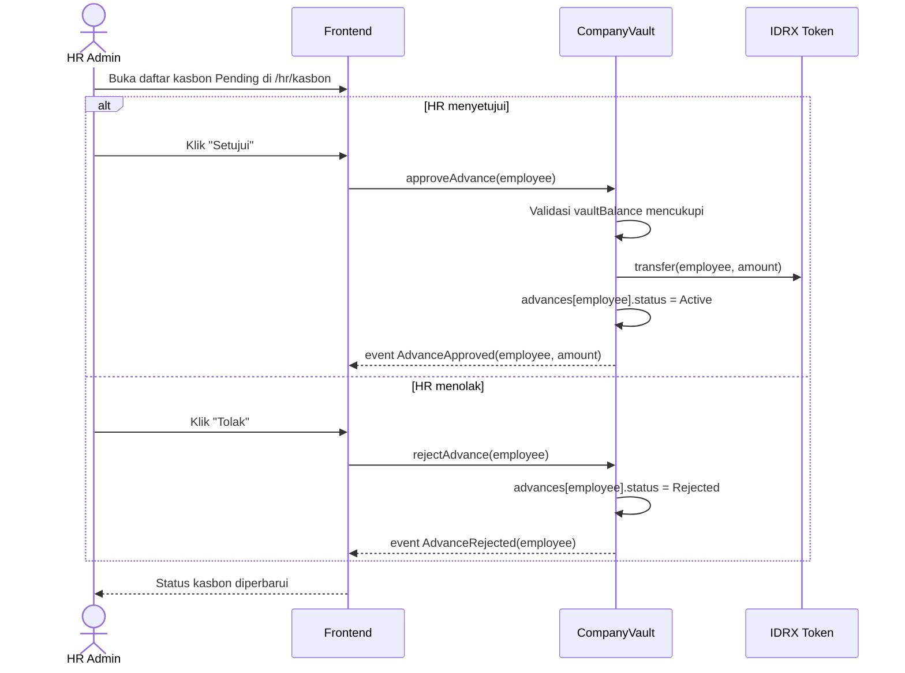
```mermaid
sequenceDiagram
    actor HR as HR Admin
    participant FE as Frontend
    participant CV as CompanyVault
    participant IDRX as IDRX Token

    HR->>FE: Buka daftar kasbon Pending di /hr/kasbon
    alt HR menyetujui
        HR->>FE: Klik "Setujui"
        FE->>CV: approveAdvance(employee)
        CV->>CV: Validasi vaultBalance mencukupi
        CV->>IDRX: transfer(employee, amount)
        CV->>CV: advances[employee].status = Active
        CV-->>FE: event AdvanceApproved(employee, amount)
    else HR menolak
        HR->>FE: Klik "Tolak"
        FE->>CV: rejectAdvance(employee)
        CV->>CV: advances[employee].status = Rejected
        CV-->>FE: event AdvanceRejected(employee)
    end
    FE-->>HR: Status kasbon diperbarui
```

| | |
|-|-|
| **Nama Use Case** | HR Menyetujui/Menolak Kasbon |
| **Deskripsi Singkat** | HR Admin meninjau daftar pengajuan kasbon karyawan berstatus `Pending`, kemudian menyetujui (dana langsung ditransfer ke karyawan) atau menolak pengajuan tersebut. |
| **Aktor** | HR Admin |
| **Pre Kondisi** | HR Admin telah login dengan role `hr`. Terdapat minimal satu pengajuan kasbon berstatus `Pending` untuk perusahaannya. |
| **Pos Kondisi** | Status kasbon berubah menjadi `Active` (disertai transfer dana ke karyawan) atau `Rejected`. |
| **Basic Flow** | 1. HR Admin membuka halaman `/hr/kasbon` dan melihat daftar pengajuan kasbon berstatus `Pending`.   2. HR Admin meninjau detail pengajuan: nama karyawan, jumlah yang diajukan, dan estimasi gaji bulanan karyawan.   3. HR Admin mengklik "Setujui". Frontend memanggil `approveAdvance(employee)`.   4. Smart contract memvalidasi `vaultBalance` mencukupi, mentransfer dana ke karyawan, dan mengubah status menjadi `Active`.   5. Frontend menampilkan konfirmasi dan memperbarui daftar kasbon. |
| **Alternative Flow** | A1. HR Admin mengklik "Tolak" pada langkah 3. Frontend memanggil `rejectAdvance(employee)`, status berubah menjadi `Rejected`, dan karyawan dapat mengajukan kembali. |
| **Error Flow** | E1. Apabila `vaultBalance` perusahaan tidak mencukupi jumlah kasbon yang disetujui, smart contract menolak transaksi. Frontend menampilkan pesan "Saldo vault tidak mencukupi untuk menyetujui kasbon ini. Silakan danai vault terlebih dahulu." |

---

#### UC-13: HR Generate Laporan Kepatuhan (BPJS/PPh21)

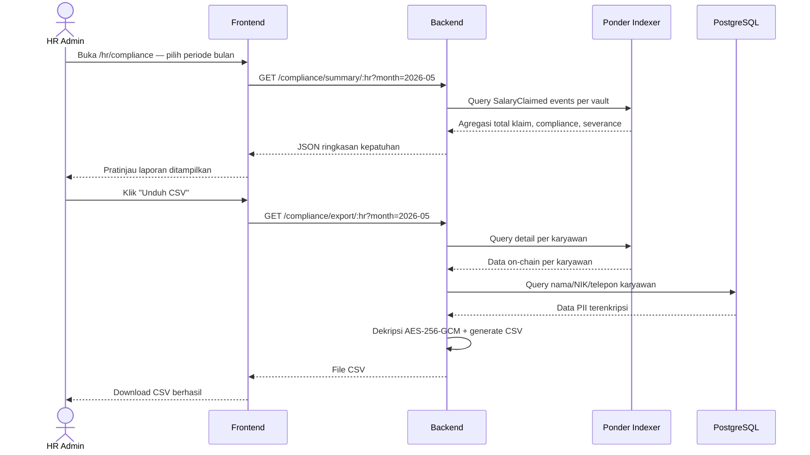
```mermaid
sequenceDiagram
    actor HR as HR Admin
    participant FE as Frontend
    participant BE as Backend
    participant Ponder as Ponder Indexer
    participant PG as PostgreSQL

    HR->>FE: Buka /hr/compliance — pilih periode bulan
    FE->>BE: GET /compliance/summary/:hr?month=2026-05
    BE->>Ponder: Query SalaryClaimed events per vault
    Ponder-->>BE: Agregasi total klaim, compliance, severance
    BE-->>FE: JSON ringkasan kepatuhan
    FE-->>HR: Pratinjau laporan ditampilkan
    HR->>FE: Klik "Unduh CSV"
    FE->>BE: GET /compliance/export/:hr?month=2026-05
    BE->>Ponder: Query detail per karyawan
    Ponder-->>BE: Data on-chain per karyawan
    BE->>PG: Query nama/NIK/telepon karyawan
    PG-->>BE: Data PII terenkripsi
    BE->>BE: Dekripsi AES-256-GCM + generate CSV
    BE-->>FE: File CSV
    FE-->>HR: Download CSV berhasil
```

| | |
|-|-|
| **Nama Use Case** | HR Generate Laporan Kepatuhan (BPJS/PPh21) |
| **Deskripsi Singkat** | HR Admin menghasilkan laporan kepatuhan hukum berupa rekap iuran BPJS Kesehatan, BPJS Ketenagakerjaan, dan Pajak Penghasilan Pasal 21 (PPh21) untuk seluruh karyawan perusahaan dalam periode tertentu. Laporan bersumber dari data alokasi Compliance Vault on-chain. |
| **Aktor** | HR Admin |
| **Pre Kondisi** | HR Admin telah login dengan role `hr`. Terdapat minimal satu karyawan aktif yang telah melakukan klaim EWA dalam periode yang dipilih, sehingga Compliance Vault memiliki data akumulasi dana kepatuhan. |
| **Pos Kondisi** | Laporan kepatuhan berhasil digenerate dalam format yang dapat diekspor (PDF atau CSV). Data laporan mencerminkan total iuran yang teralokasi ke Compliance Vault dalam periode yang dipilih. Riwayat generate laporan tercatat di audit log. |
| **Basic Flow** | 1. HR Admin mengakses halaman `/hr/compliance` dan memilih menu "Generate Laporan".   2. Sistem menampilkan formulir pemilihan parameter laporan: periode waktu (bulan dan tahun), jenis laporan (BPJS Kesehatan, BPJS Ketenagakerjaan, PPh21, atau gabungan), dan format ekspor yang diinginkan (PDF atau CSV).   3. HR Admin mengisi parameter laporan dan mengklik "Generate".   4. Backend mengambil data transaksi klaim EWA dari database dalam periode yang dipilih, mengekstrak alokasi 5% yang masuk ke Compliance Vault, dan menghitung besaran iuran per karyawan berdasarkan konfigurasi split yang berlaku.   5. Backend juga membaca data Compliance Vault on-chain melalui Alchemy untuk verifikasi silang (cross-check) antara data database dan data on-chain.   6. Backend menyusun laporan dengan rincian: nama karyawan, NIK, gaji bruto, potongan BPJS Kesehatan (persentase dan nominal), potongan BPJS Ketenagakerjaan (persentase dan nominal), potongan PPh21 (persentase dan nominal berdasarkan bracket), dan total iuran per karyawan.   7. Backend menghasilkan file laporan dalam format yang diminta dan menyimpannya sementara di server.   8. Backend mengembalikan URL unduhan laporan ke frontend. Frontend menampilkan pratinjau laporan dan tombol "Unduh".   9. HR Admin mengunduh file laporan. Backend mencatat aktivitas generate laporan di audit log. |
| **Alternative Flow** | A1. Apabila HR Admin membutuhkan laporan untuk satu karyawan tertentu saja, sistem menyediakan filter berdasarkan nama karyawan atau NIK di dalam formulir laporan.   A2. Apabila HR Admin ingin menjadwalkan generate laporan otomatis setiap akhir bulan, sistem menyediakan opsi penjadwalan yang akan mengirimkan laporan ke email HR Admin secara periodik. |
| **Error Flow** | E1. Apabila tidak ada data transaksi dalam periode yang dipilih (tidak ada klaim EWA yang terjadi), backend mengembalikan laporan kosong dengan pesan "Tidak ada data transaksi dalam periode yang dipilih. Laporan tidak dapat digenerate."   E2. Apabila terjadi ketidaksesuaian signifikan antara data database dan data on-chain saat proses verifikasi silang, backend mencatat anomali di audit log dan menampilkan peringatan kepada HR Admin: "Terdeteksi ketidaksesuaian data. Silakan hubungi administrator sistem untuk rekonsiliasi manual."   E3. Apabila proses generate laporan gagal karena kesalahan sistem internal, backend mengembalikan error `500 Internal Server Error`. Frontend menampilkan pesan "Gagal menghasilkan laporan. Silakan coba kembali atau hubungi dukungan teknis." |

---

#### UC-14: Verifikasi Sertifikat Ketenagakerjaan (SBT)

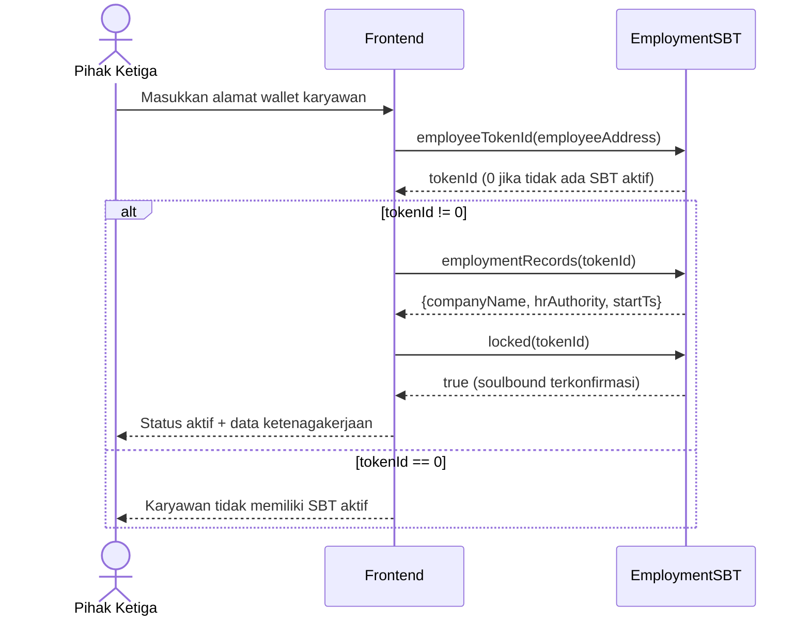
```mermaid
sequenceDiagram
    actor THIRD as Pihak Ketiga
    participant FE as Frontend
    participant SBT as EmploymentSBT

    THIRD->>FE: Masukkan alamat wallet karyawan
    FE->>SBT: employeeTokenId(employeeAddress)
    SBT-->>FE: tokenId (0 jika tidak ada SBT aktif)
    alt tokenId != 0
        FE->>SBT: employmentRecords(tokenId)
        SBT-->>FE: {companyName, hrAuthority, startTs}
        FE->>SBT: locked(tokenId)
        SBT-->>FE: true (soulbound terkonfirmasi)
        FE-->>THIRD: Status aktif + data ketenagakerjaan
    else tokenId == 0
        FE-->>THIRD: Karyawan tidak memiliki SBT aktif
    end
```

| | |
|-|-|
| **Nama Use Case** | Verifikasi Sertifikat Ketenagakerjaan (SBT) |
| **Deskripsi Singkat** | Verifikasi keaslian dan keabsahan Soulbound Token (SBT) ketenagakerjaan yang diterbitkan sistem Payana sebagai bukti hubungan kerja yang tidak dapat dipalsukan. Halaman verifikasi bersifat publik (tanpa login) sehingga dapat diakses oleh pihak ketiga (bank, lembaga keuangan, calon pemberi kerja) maupun karyawan sendiri; pada level diagram use case, use case ini digambarkan sebagai bagian dari domain HR Admin karena HR Admin adalah pihak yang menerbitkan dan mengelola SBT yang diverifikasi. |
| **Aktor** | HR Admin (pengelola SBT); halaman verifikasi itu sendiri dapat diakses publik tanpa autentikasi |
| **Pre Kondisi** | Karyawan atau pihak ketiga memiliki alamat wallet karyawan yang akan diverifikasi. EmploymentSBT telah diterbitkan oleh sistem Payana ke wallet karyawan saat onboarding. |
| **Pos Kondisi** | Status verifikasi SBT ditampilkan: valid dan aktif (karyawan masih bekerja) atau tidak valid/dicabut (karyawan sudah tidak bekerja). Informasi ketenagakerjaan yang terenkripsi dapat dibaca oleh pihak yang berwenang. |
| **Basic Flow** | 1. Pengguna (pihak ketiga atau karyawan) mengakses halaman publik verifikasi SBT Payana di `/verify` tanpa perlu login.   2. Pengguna memasukkan alamat wallet karyawan yang ingin diverifikasi pada kolom pencarian.   3. Frontend mengirimkan permintaan ke backend `GET /verify/sbt/:walletAddress`.   4. Backend membaca data SBT dari smart contract `EmploymentSBT` on-chain: memeriksa apakah token ada, apakah masih aktif (belum dicabut), dan metadata ketenagakerjaan yang terkait.   5. Backend memverifikasi integritas data SBT dengan memeriksa konsistensi antara data on-chain dan database backend.   6. Sistem menampilkan hasil verifikasi: status SBT (aktif atau telah dicabut), nama perusahaan, jabatan karyawan (jika tersedia), dan tanggal penerbitan SBT.   7. Apabila verifikasi dilakukan oleh karyawan pemilik SBT yang sudah login, karyawan dapat membagikan tautan verifikasi unik (shareable link) kepada pihak yang membutuhkan tanpa harus membocorkan alamat wallet mereka. |
| **Alternative Flow** | A1. Apabila pihak ketiga memerlukan konfirmasi lebih lanjut, sistem menyediakan opsi untuk mengunduh sertifikat verifikasi dalam format PDF yang ditandatangani secara digital oleh sistem Payana, yang dapat diserahkan sebagai dokumen pendukung formal. |
| **Error Flow** | E1. Apabila ada pihak yang mencoba mentransfer SBT ke wallet lain (misalnya melalui interaksi langsung dengan smart contract di luar antarmuka Payana), smart contract menolak operasi transfer karena SBT adalah Soulbound Token yang tidak dapat dipindahtangankan (`SoulboundTransferNotAllowed`). Sistem mencatat percobaan transfer di audit log keamanan.   E2. Apabila alamat wallet yang dimasukkan tidak memiliki SBT yang diterbitkan oleh sistem Payana, backend mengembalikan status `404 Not Found`. Frontend menampilkan pesan "Sertifikat ketenagakerjaan tidak ditemukan untuk alamat wallet yang diberikan. Pastikan alamat wallet yang dimasukkan sudah benar."   E3. Apabila SBT ditemukan namun sudah dicabut (karyawan sudah tidak aktif bekerja), sistem menampilkan status "SBT Tidak Aktif" beserta tanggal pencabutan dan alasan pencabutan (PHK atau resign) untuk transparansi. |

---

#### UC-15: Owner SaaS Deploy Company Vault Baru

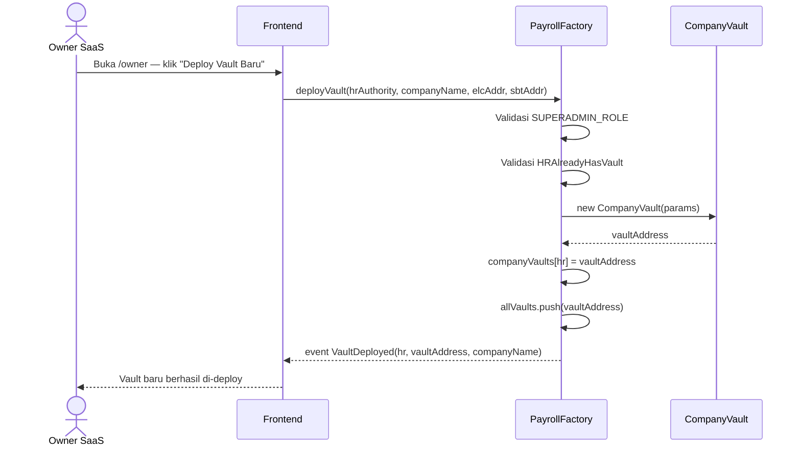
```mermaid
sequenceDiagram
    actor OWNER as Owner SaaS
    participant FE as Frontend
    participant PF as PayrollFactory
    participant CV as CompanyVault

    OWNER->>FE: Buka /owner — klik "Deploy Vault Baru"
    FE->>PF: deployVault(hrAuthority, companyName, elcAddr, sbtAddr)
    PF->>PF: Validasi SUPERADMIN_ROLE
    PF->>PF: Validasi HRAlreadyHasVault
    PF->>CV: new CompanyVault(params)
    CV-->>PF: vaultAddress
    PF->>PF: companyVaults[hr] = vaultAddress
    PF->>PF: allVaults.push(vaultAddress)
    PF-->>FE: event VaultDeployed(hr, vaultAddress, companyName)
    FE-->>OWNER: Vault baru berhasil di-deploy
```

| | |
|-|-|
| **Nama Use Case** | Owner SaaS Deploy Company Vault Baru |
| **Deskripsi Singkat** | Owner SaaS secara langsung men-deploy CompanyVault baru untuk perusahaan klien yang baru bergabung ke platform Payana. Proses ini dilakukan dari dashboard Owner dan mencakup konfigurasi parameter awal vault serta pendaftaran HR Admin perusahaan tersebut ke dalam sistem. |
| **Aktor** | Owner SaaS |
| **Pre Kondisi** | Owner SaaS telah login dengan role `owner`. Perusahaan klien baru telah menyelesaikan proses pendaftaran dan verifikasi di luar sistem (perjanjian kontrak, KYC perusahaan). HR Admin perusahaan tersebut telah terdaftar di sistem Payana dengan role `hr`. |
| **Pos Kondisi** | CompanyVault baru berhasil di-deploy ke Base Sepolia melalui PayrollFactory. Alamat vault terhubung ke profil perusahaan di database. HR Admin perusahaan dapat mengakses vault dan mulai melakukan onboarding karyawan. |
| **Basic Flow** | 1. Owner SaaS mengakses halaman `/owner/dashboard` dan mengklik "Deploy Vault Perusahaan Baru".   2. Sistem menampilkan formulir konfigurasi vault: nama perusahaan klien, alamat wallet HR Admin perusahaan, alamat token IDRX yang digunakan, alamat Employee Liquidity Pool, dan parameter split alokasi dana (default 93/5/2 BPS).   3. Owner SaaS mengisi dan memverifikasi seluruh parameter konfigurasi.   4. Owner SaaS mengklik "Deploy". Frontend memanggil `PayrollFactory.deployVault(hrAddress, companyName, IDRX_address, liquidityPool_address)` menggunakan akun Owner SaaS.   5. Transaksi dikirim ke Base Sepolia. Frontend menampilkan indikator loading dengan pesan "Sedang men-deploy vault ke blockchain...".   6. Setelah transaksi dikonfirmasi, smart contract `PayrollFactory` meng-emit event `VaultDeployed` dengan alamat vault baru.   7. Backend menerima webhook dari Alchemy, mencatat alamat vault baru dan menghubungkannya dengan profil perusahaan di database, serta memberikan akses vault kepada HR Admin perusahaan.   8. Backend mengirimkan notifikasi ke HR Admin perusahaan bahwa vault telah siap digunakan.   9. Frontend menampilkan konfirmasi kepada Owner: "Vault perusahaan [nama perusahaan] berhasil di-deploy. HR Admin dapat mulai menggunakan sistem." |
| **Alternative Flow** | A1. Apabila Owner SaaS ingin mendeploy beberapa vault sekaligus untuk beberapa perusahaan klien, proses dilakukan satu per satu melalui antarmuka yang sama. |
| **Error Flow** | E1. Apabila alamat HR Admin yang dimasukkan tidak terdaftar dalam sistem Payana, backend memvalidasi dan menampilkan pesan "Alamat wallet HR Admin tidak ditemukan dalam sistem. Pastikan HR Admin sudah mendaftarkan akun Payana terlebih dahulu."   E2. Apabila perusahaan dengan nama yang sama sudah memiliki vault aktif, backend menampilkan peringatan "Perusahaan dengan nama ini sudah memiliki vault aktif. Konfirmasi apakah Anda ingin membuat vault tambahan untuk perusahaan ini."   E3. Apabila transaksi deploy gagal karena parameter tidak valid atau gas tidak cukup, frontend menampilkan pesan kesalahan spesifik dari smart contract dan memungkinkan Owner SaaS untuk mengoreksi parameter dan mencoba ulang. |

---

#### UC-16: HR Lihat Dashboard Vault dan Status Stream

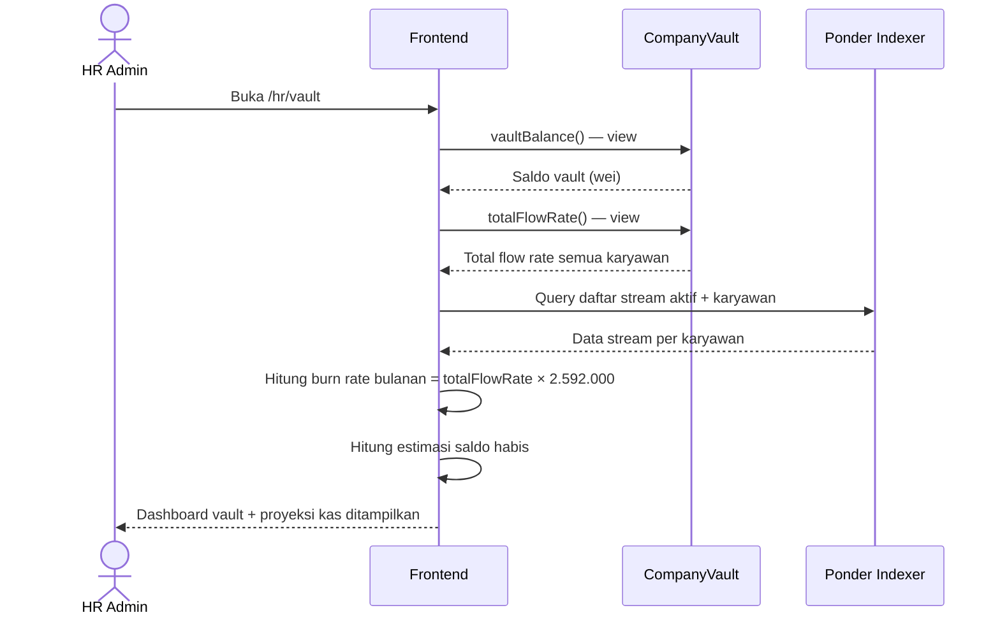
```mermaid
sequenceDiagram
    actor HR as HR Admin
    participant FE as Frontend
    participant CV as CompanyVault
    participant Ponder as Ponder Indexer

    HR->>FE: Buka /hr/vault
    FE->>CV: vaultBalance() — view
    CV-->>FE: Saldo vault (wei)
    FE->>CV: totalFlowRate() — view
    CV-->>FE: Total flow rate semua karyawan
    FE->>Ponder: Query daftar stream aktif + karyawan
    Ponder-->>FE: Data stream per karyawan
    FE->>FE: Hitung burn rate bulanan = totalFlowRate × 2.592.000
    FE->>FE: Hitung estimasi saldo habis
    FE-->>HR: Dashboard vault + proyeksi kas ditampilkan
```

| | |
|-|-|
| **Nama Use Case** | HR Lihat Dashboard Vault dan Status Stream |
| **Deskripsi Singkat** | HR Admin mengakses dashboard terpusat yang menampilkan ringkasan kondisi vault perusahaan secara real-time: saldo IDRX tersedia, total kewajiban stream aktif per detik, daftar karyawan dengan status stream masing-masing, saldo Compliance Vault, dan saldo Severance Vault. |
| **Aktor** | HR Admin |
| **Pre Kondisi** | HR Admin telah login dengan role `hr`. CompanyVault perusahaan telah di-deploy. Terdapat minimal satu karyawan yang telah di-onboarding ke sistem. |
| **Pos Kondisi** | HR Admin mendapatkan gambaran menyeluruh kondisi keuangan vault dan status stream seluruh karyawan aktif dalam satu tampilan terpusat. Tidak ada perubahan state yang terjadi (use case bersifat baca-saja). |
| **Basic Flow** | 1. HR Admin mengakses halaman `/hr/vault` setelah login.   2. Frontend secara paralel mengambil data dari beberapa sumber: saldo vault saat ini dari smart contract on-chain melalui Alchemy, daftar karyawan dan status stream dari database backend, saldo Compliance Vault dan Severance Vault, serta total flow rate aktif (akumulasi seluruh flow rate karyawan per detik).   3. Sistem menampilkan kartu ringkasan di bagian atas: saldo vault tersedia, total pengeluaran stream per bulan, saldo Compliance Vault, dan saldo Severance Vault.   4. Sistem menampilkan tabel daftar karyawan dengan kolom: nama, alamat wallet, besaran gaji bulanan, status stream (aktif/dihentikan), akumulasi gaji yang belum diklaim oleh karyawan, dan tanggal mulai bekerja.   5. HR Admin dapat mengklik nama karyawan untuk melihat detail stream: riwayat klaim EWA, histori transaksi on-chain, dan informasi vesting aktif (jika ada).   6. Sistem memperbarui saldo akumulasi karyawan secara real-time menggunakan kalkulasi berbasis `block.timestamp` tanpa perlu refresh halaman. |
| **Alternative Flow** | A1. Apabila saldo vault mendekati batas minimum operasional (kurang dari dana stream 7 hari ke depan), sistem menampilkan peringatan otomatis di bagian atas dashboard: "Peringatan: Saldo vault akan habis dalam [X] hari. Segera lakukan deposit."   A2. HR Admin dapat memfilter daftar karyawan berdasarkan status stream (aktif, dihentikan, atau semua) dan mengurutkan berdasarkan berbagai kolom untuk kemudahan navigasi. |
| **Error Flow** | E1. Apabila vault sedang dalam kondisi dibekukan (`VaultFrozen`), sistem menampilkan banner peringatan merah di bagian atas dashboard: "Vault sedang dalam kondisi dibekukan. Seluruh operasi ditangguhkan hingga pembekuan dicabut oleh administrator."   E2. Apabila koneksi ke node Alchemy mengalami gangguan sehingga data on-chain tidak dapat diambil, sistem menampilkan data dari cache database terakhir yang tersimpan dengan keterangan "Data mungkin tidak mencerminkan kondisi terbaru on-chain. Koneksi blockchain sedang terganggu."   E3. Apabila HR Admin mencoba mengakses vault perusahaan lain yang bukan miliknya, backend memvalidasi kepemilikan dan mengembalikan error `403 Forbidden`. |

---

#### UC-17: HR Admin Set Gaji Karyawan dalam Format Terenkripsi (FHE)

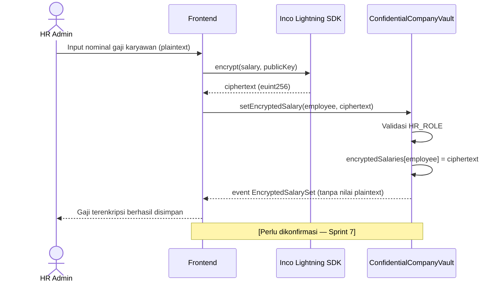
```mermaid
sequenceDiagram
    actor HR as HR Admin
    participant FE as Frontend
    participant Inco as Inco Lightning SDK
    participant CCV as ConfidentialCompanyVault

    HR->>FE: Input nominal gaji karyawan (plaintext)
    FE->>Inco: encrypt(salary, publicKey)
    Inco-->>FE: ciphertext (euint256)
    FE->>CCV: setEncryptedSalary(employee, ciphertext)
    CCV->>CCV: Validasi HR_ROLE
    CCV->>CCV: encryptedSalaries[employee] = ciphertext
    CCV-->>FE: event EncryptedSalarySet (tanpa nilai plaintext)
    FE-->>HR: Gaji terenkripsi berhasil disimpan
    note over FE,CCV: [Perlu dikonfirmasi — Sprint 7]
```

| | |
|-|-|
| **Nama Use Case** | HR Admin Set Gaji Karyawan dalam Format Terenkripsi (FHE) |
| **Deskripsi Singkat** | HR Admin menetapkan atau memperbarui besaran gaji karyawan menggunakan teknologi Fully Homomorphic Encryption (FHE) melalui integrasi Inco Network. Data gaji disimpan dalam bentuk ciphertext (`euint256`) on-chain sehingga nilai nominal gaji tidak terekspos secara publik di blockchain, melindungi privasi kompensasi karyawan. |
| **Aktor** | HR Admin |
| **Pre Kondisi** | HR Admin telah login dengan role `hr`. Karyawan yang dituju memiliki stream gaji aktif. Inco FHE Network tersedia dan terintegrasi dengan CompanyVault. HR Admin memiliki kunci enkripsi yang diperlukan untuk mengenkripsi nilai gaji. |
| **Pos Kondisi** | Nilai gaji karyawan tersimpan on-chain dalam format terenkripsi (`euint256`) di mapping `encryptedSalaries`. Event `EncryptedSalarySet` diterbitkan tanpa nilai plaintext. HR Admin mendapatkan konfirmasi pembaruan berhasil. |
| **Basic Flow** | 1. HR Admin mengakses halaman `/hr/employees` dan memilih karyawan yang akan diperbarui gajinya.   2. HR Admin mengklik "Perbarui Gaji (Terenkripsi)". Sistem menampilkan formulir input gaji dengan keterangan bahwa nilai akan dienkripsi menggunakan FHE sebelum dikirim ke blockchain.   3. HR Admin memasukkan nilai gaji baru dalam IDRX dalam plaintext di antarmuka lokal.   4. Frontend menggunakan Inco JS SDK untuk mengenkripsi nilai gaji menjadi `euint256` ciphertext di sisi klien: `const { bytes: encryptedSalary } = await inco.encrypt(salaryValue)`.   5. Frontend memanggil `ConfidentialCompanyVault.setEncryptedSalary(employeeAddress, encryptedSalary)` dengan menyertakan ETH fee via `msg.value` sesuai `inco.getFee()`.   6. Smart contract memverifikasi proof melalui Inco co-processor, menyimpan ciphertext `euint256` di mapping `encryptedSalaries`, dan memberikan ACL viewing key kepada HR dan karyawan yang bersangkutan.   7. Backend menerima webhook, mencatat pembaruan gaji (hanya metadata, bukan nilai plaintext) di audit log.   8. Frontend menampilkan konfirmasi "Gaji karyawan [nama] berhasil diperbarui dalam format terenkripsi." |
| **Alternative Flow** | A1. Apabila HR Admin ingin memverifikasi bahwa nilai yang tersimpan sudah benar tanpa mengekspos ke publik, HR Admin dapat menggunakan viewing key khusus yang dimiliki untuk mendekripsi dan memverifikasi nilai secara lokal. |
| **Error Flow** | E1. Apabila HR Admin tidak memiliki `HR_ROLE` yang valid (`Unauthorized`), transaksi akan di-revert. Frontend menampilkan pesan "Akses ditolak. Anda tidak memiliki wewenang untuk menetapkan gaji karyawan."   E2. Apabila Inco FHE Network mengalami gangguan sehingga proses enkripsi di sisi klien gagal, frontend menampilkan pesan "Layanan enkripsi saat ini tidak tersedia. Pembaruan gaji terenkripsi tidak dapat diproses. Silakan coba kembali nanti."   E3. Apabila nilai gaji yang dimasukkan HR Admin tidak valid (misalnya negatif atau nol), frontend memvalidasi sebelum enkripsi dan menampilkan pesan "Nilai gaji tidak valid. Masukkan nilai gaji yang sesuai." E4. Apabila ETH fee Inco tidak disertakan atau tidak sesuai `inco.getFee()`, transaksi di-revert dengan pesan "ConfidentialVault: Inco fee not paid". |

---

#### UC-18: Karyawan Lihat Gaji Sendiri via Viewing Key

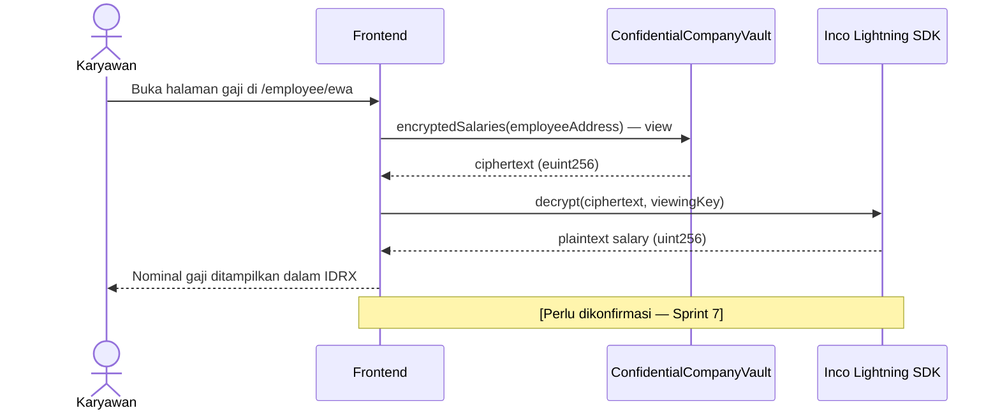
```mermaid
sequenceDiagram
    actor EMP as Karyawan
    participant FE as Frontend
    participant CCV as ConfidentialCompanyVault
    participant Inco as Inco Lightning SDK

    EMP->>FE: Buka halaman gaji di /employee/ewa
    FE->>CCV: encryptedSalaries(employeeAddress) — view
    CCV-->>FE: ciphertext (euint256)
    FE->>Inco: decrypt(ciphertext, viewingKey)
    Inco-->>FE: plaintext salary (uint256)
    FE-->>EMP: Nominal gaji ditampilkan dalam IDRX
    note over FE,Inco: [Perlu dikonfirmasi — Sprint 7]
```

| | |
|-|-|
| **Nama Use Case** | Karyawan Lihat Gaji Sendiri via Viewing Key |
| **Deskripsi Singkat** | Karyawan mendekripsi dan melihat nilai nominal gaji mereka sendiri yang tersimpan dalam format FHE on-chain menggunakan viewing key yang secara eksklusif diberikan kepada karyawan bersangkutan. Karyawan lain dan pihak yang tidak berwenang tidak dapat melihat nilai gaji ini. |
| **Aktor** | Karyawan |
| **Pre Kondisi** | Karyawan telah login dengan role `employee`. HR Admin telah menetapkan gaji karyawan dalam format terenkripsi FHE. Karyawan memiliki viewing key yang valid yang diterbitkan sistem Payana untuk akun mereka. |
| **Pos Kondisi** | Karyawan berhasil melihat nilai nominal gaji mereka dalam plaintext secara lokal di browser. Nilai plaintext tidak pernah dikirim ke server backend maupun disimpan di manapun selain memori browser sementara. |
| **Basic Flow** | 1. Karyawan mengakses halaman `/employee/profile` dan memilih tab "Informasi Gaji".   2. Sistem menampilkan komponen "Lihat Gaji Saya" dengan keterangan bahwa gaji tersimpan dalam format terenkripsi untuk kerahasiaan.   3. Karyawan mengklik "Dekripsi Gaji Saya".   4. Frontend meminta karyawan untuk mengonfirmasi identitas melalui tanda tangan dompet (EIP-712) untuk membuktikan kepemilikan wallet.   5. Frontend mengambil ciphertext gaji dari smart contract on-chain melalui `CompanyVault.getEncryptedSalary(employeeAddress)`.   6. Frontend menggunakan viewing key karyawan (yang tersimpan di local storage terenkripsi atau diambil dari backend setelah autentikasi) bersama library Inco FHE untuk mendekripsi ciphertext secara lokal di browser.   7. Nilai gaji dalam plaintext ditampilkan kepada karyawan di antarmuka dalam format IDRX beserta estimasi Rupiah.   8. Nilai plaintext dihapus dari memori browser setelah sesi ditutup atau karyawan mengklik "Sembunyikan". |
| **Alternative Flow** | A1. Apabila karyawan kehilangan viewing key mereka, karyawan dapat meminta penerbitan viewing key baru kepada HR Admin. HR Admin dapat menerbitkan ulang viewing key melalui fungsi smart contract yang sesuai. Viewing key lama akan dinonaktifkan. |
| **Error Flow** | E1. Apabila viewing key yang dimiliki karyawan sudah kedaluwarsa atau tidak valid, proses dekripsi gagal. Frontend menampilkan pesan "Viewing key Anda tidak valid atau telah kedaluwarsa. Silakan hubungi HR Admin untuk mendapatkan viewing key baru."   E2. Apabila HR Admin belum pernah menetapkan gaji dalam format FHE untuk karyawan tersebut (data gaji belum terenkripsi), smart contract mengembalikan ciphertext kosong. Frontend menampilkan pesan "Data gaji terenkripsi belum tersedia. Hubungi HR Admin Anda."   E3. Apabila koneksi ke Inco Network yang diperlukan untuk proses dekripsi mengalami gangguan, frontend menampilkan pesan "Layanan dekripsi sedang tidak tersedia. Silakan coba kembali dalam beberapa saat." |

---

#### UC-19: HR Lihat Total Payroll via Homomorphic Aggregation

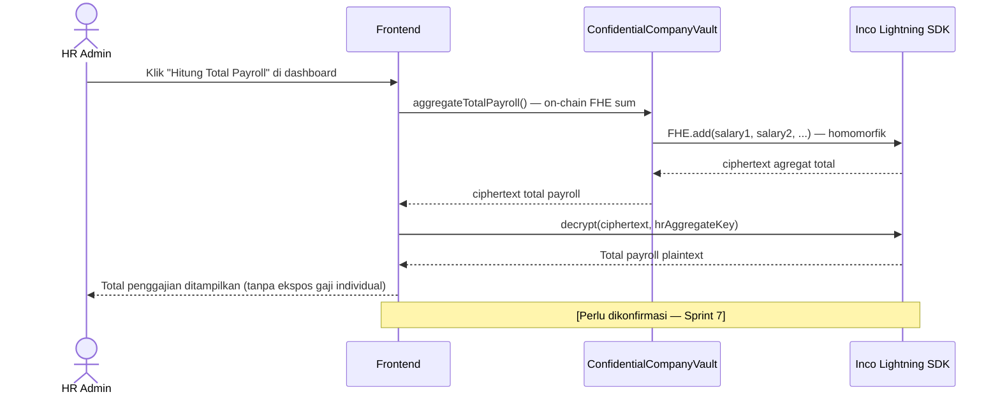
```mermaid
sequenceDiagram
    actor HR as HR Admin
    participant FE as Frontend
    participant CCV as ConfidentialCompanyVault
    participant Inco as Inco Lightning SDK

    HR->>FE: Klik "Hitung Total Payroll" di dashboard
    FE->>CCV: aggregateTotalPayroll() — on-chain FHE sum
    CCV->>Inco: FHE.add(salary1, salary2, ...) — homomorfik
    Inco-->>CCV: ciphertext agregat total
    CCV-->>FE: ciphertext total payroll
    FE->>Inco: decrypt(ciphertext, hrAggregateKey)
    Inco-->>FE: Total payroll plaintext
    FE-->>HR: Total penggajian ditampilkan (tanpa ekspos gaji individual)
    note over FE,Inco: [Perlu dikonfirmasi — Sprint 7]
```

| | |
|-|-|
| **Nama Use Case** | HR Lihat Total Payroll via Homomorphic Aggregation |
| **Deskripsi Singkat** | HR Admin melihat total pengeluaran payroll perusahaan secara keseluruhan yang dihitung menggunakan operasi penjumlahan homomorphic atas seluruh nilai gaji karyawan yang terenkripsi. Hasil agregasi dapat didekripsi oleh HR Admin menggunakan kunci khusus, sementara nilai gaji individual masing-masing karyawan tetap terlindungi. |
| **Aktor** | HR Admin |
| **Pre Kondisi** | HR Admin telah login dengan role `hr`. Terdapat minimal satu karyawan dengan data gaji yang tersimpan dalam format FHE on-chain. HR Admin memiliki kunci dekripsi agregat yang diterbitkan sistem untuk akses total payroll. |
| **Pos Kondisi** | HR Admin berhasil melihat nilai total pengeluaran payroll perusahaan dalam plaintext. Nilai gaji individual karyawan tidak terekspos kepada HR Admin melalui proses agregasi ini. Hasil kalkulasi dicatat di audit log untuk kebutuhan kepatuhan. |
| **Basic Flow** | 1. HR Admin mengakses halaman `/hr/vault` dan memilih tab "Laporan Payroll Terenkripsi".   2. HR Admin memilih periode agregasi (bulan berjalan atau periode kustom) dan mengklik "Hitung Total Payroll".   3. Frontend mengirimkan permintaan ke backend `POST /hr/payroll/aggregate` beserta JWT autentikasi.   4. Backend memanggil smart contract `CompanyVault.aggregateTotalPayroll()` yang mengeksekusi operasi penjumlahan homomorphic (`FHE.add`) atas seluruh ciphertext gaji karyawan yang terdaftar dalam vault. Operasi ini dilakukan sepenuhnya pada data terenkripsi tanpa ada dekripsi perantara.   5. Smart contract mengembalikan ciphertext hasil agregasi total payroll. Backend meneruskan ciphertext ini ke frontend.   6. Frontend menggunakan kunci dekripsi agregat milik HR Admin (berbeda dari viewing key karyawan individual) bersama library Inco FHE untuk mendekripsi ciphertext agregat secara lokal.   7. Nilai total pengeluaran payroll perusahaan ditampilkan dalam plaintext kepada HR Admin: total IDRX per bulan, breakdown per departemen (jika dikonfigurasi), dan tren perbandingan dengan periode sebelumnya.   8. Backend mencatat akses ke laporan payroll agregat di audit log beserta timestamp dan identitas HR Admin, namun tidak menyimpan nilai plaintext di server. |
| **Alternative Flow** | A1. Apabila HR Admin ingin melihat agregasi payroll per departemen atau divisi tertentu, sistem mendukung filter berdasarkan tag departemen yang ditetapkan saat onboarding karyawan. Operasi homomorphic dilakukan hanya pada subset karyawan yang sesuai filter.   A2. Apabila diperlukan untuk kebutuhan audit eksternal, HR Admin dapat mengunduh bukti kriptografis (zero-knowledge proof) bahwa total payroll yang dilaporkan sesuai dengan data on-chain tanpa mengekspos nilai gaji individual. |
| **Error Flow** | E1. Apabila HR Admin tidak memiliki `HR_ROLE` yang valid (`Unauthorized`), permintaan agregasi ditolak oleh smart contract. Frontend menampilkan pesan "Akses ditolak. Anda tidak memiliki wewenang untuk mengakses data payroll agregat."   E2. Apabila tidak ada data gaji karyawan yang tersimpan dalam format FHE (belum ada karyawan dengan gaji terenkripsi), smart contract mengembalikan nilai nol yang terenkripsi. Frontend menampilkan pesan "Belum ada data gaji terenkripsi yang dapat diagregasi. Pastikan HR Admin telah menetapkan gaji karyawan dalam format FHE."   E3. Apabila Inco FHE Network mengalami gangguan selama operasi agregasi homomorphic, transaksi gagal. Frontend menampilkan pesan "Proses kalkulasi payroll terenkripsi gagal karena layanan FHE sedang terganggu. Silakan coba kembali nanti."   E4. Apabila kunci dekripsi agregat HR Admin tidak valid atau kedaluwarsa, proses dekripsi hasil agregasi gagal di sisi klien. Frontend menampilkan pesan "Kunci akses payroll Anda tidak valid. Silakan minta kunci baru melalui administrator sistem." |

---

#### UC-20: Owner SaaS Konfigurasi dan Klaim Platform Fee

```mermaid
sequenceDiagram
    actor OWNER as Owner SaaS
    participant FE as Frontend
    participant PF as PayrollFactory
    participant Ponder as Ponder Indexer

    OWNER->>FE: Buka tab "Monetisasi" di /owner
    FE->>PF: platformFeeBps() — baca konfigurasi saat ini
    PF-->>FE: feeBps aktif
    OWNER->>FE: Input feeBps baru (maks 100 bps = 1%)
    FE->>PF: setPlatformFee(feeBps)
    PF->>PF: Validasi SUPERADMIN_ROLE
    PF->>PF: Validasi FeeTooHigh (feeBps <= MAX_FEE)
    PF->>PF: platformFeeBps = feeBps
    PF-->>FE: event PlatformFeeUpdated(feeBps)
    FE->>Ponder: Query histori PlatformFeePaid events
    Ponder-->>FE: Total fee terkumpul per periode
    FE-->>OWNER: Dashboard pendapatan platform diperbarui
```

| | |
|-|-|
| **Nama Use Case** | Owner SaaS Konfigurasi dan Klaim Platform Fee |
| **Deskripsi Singkat** | Owner SaaS menetapkan besaran platform fee yang akan dipotong dari setiap klaim gaji seluruh karyawan di platform, lalu memantau dan menarik akumulasi fee ke alamat treasury. |
| **Aktor** | Owner SaaS |
| **Pre Kondisi** | Owner SaaS telah login dengan role `owner`. Minimal satu CompanyVault aktif telah di-deploy melalui `PayrollFactory`. |
| **Pos Kondisi** | `platformFeeBps` terkonfigurasi di `PayrollFactory`. Setiap klaim gaji berikutnya secara otomatis memotong fee ke `protocolTreasury`. Owner dapat melihat akumulasi fee di dashboard. |
| **Basic Flow** | 1. Owner SaaS membuka halaman `/owner` dan memilih tab "Monetisasi Platform".   2. Owner memasukkan nilai `platformFeeBps` yang diinginkan (contoh: 10 bps = 0,1%) dan mengklik "Simpan Konfigurasi".   3. Frontend mengirim transaksi `PayrollFactory.setPlatformFee(platformFeeBps)` melalui dompet Owner.   4. Kontrak memvalidasi bahwa pemanggil memiliki `SUPERADMIN_ROLE` dan bahwa nilai `platformFeeBps` tidak melebihi batas maksimum.   5. Nilai `platformFeeBps` tersimpan on-chain dan event `PlatformFeeUpdated` diterbitkan.   6. Ponder mengindeks event tersebut; dashboard Owner memperbarui tampilan konfigurasi fee aktif.   7. Owner memilih tab "Pendapatan" untuk melihat akumulasi `PlatformFeePaid` events yang diindeks Ponder: total fee terkumpul per bulan, per vault, dan keseluruhan.   8. Owner menarik saldo IDRX dari alamat `protocolTreasury` menggunakan dompet yang terhubung. |
| **Alternative Flow** | A1. Apabila Owner ingin menonaktifkan platform fee sementara (misalnya untuk periode promosi), Owner dapat menetapkan `platformFeeBps = 0`. Kontrak melewati langkah pemotongan fee tanpa overhead gas tambahan.   A2. Owner dapat mengubah alamat `protocolTreasury` ke alamat multisig untuk keamanan dana yang lebih baik melalui fungsi `setProtocolTreasury()`. |
| **Error Flow** | E1. Apabila nilai `platformFeeBps` melebihi batas maksimum yang dikonfigurasi di kontrak (misalnya 100 bps = 1%), transaksi dibalik dengan `FeeTooHigh`. Frontend menampilkan "Nilai fee melebihi batas maksimum yang diizinkan (1%)."   E2. Apabila pemanggil tidak memiliki `SUPERADMIN_ROLE`, kontrak menolak dengan `Unauthorized`. Frontend menampilkan "Hanya Owner SaaS yang dapat mengubah konfigurasi platform fee." |

---

### 3.4 Kebutuhan Non-Fungsional

#### 3.4.1 Performance

ID Requirement : NFR-PAYANA-01
Deskripsi      : Response time API endpoint backend harus ≤ 500ms pada 99th percentile (P99) di bawah beban 50–100 concurrent users. **Status validasi (2026-06-25):** target awal dokumen ini ("≤500ms P99 @ 1.000 concurrent users, diukur via Datadog APM") tidak pernah benar-benar divalidasi dan Datadog tidak pernah diintegrasikan ke sistem — skala 1.000 concurrent juga tidak realistis diuji terhadap testnet publik Base Sepolia/Alchemy free-tier untuk keperluan skripsi. Stress test aktual dilakukan menggunakan k6 (50→100 concurrent users, ramping, ~2 menit) dengan hasil diukur via dashboard Grafana + InfluxDB (lihat `stress-test/README.md`): `GET /companies` (Ponder) P99 = 10,7ms (lulus jauh di bawah threshold); `POST /auth/login` P99 = 729ms dan `GET /compliance/summary/:hr` P99 = 799ms (keduanya **melebihi** threshold 500ms pada skala 100 concurrent, meski error rate tetap 0% — backend tidak gagal, hanya lebih lambat dari target awal pada deployment single-instance tanpa horizontal scaling/connection pooling). Threshold 500ms P99 dipertahankan sebagai target desain jangka panjang, namun pada kondisi MVP saat ini (single-instance, tanpa caching/scaling) baru tervalidasi tercapai untuk endpoint baca publik (Ponder); endpoint yang melibatkan verifikasi JWT + query database (`/auth/login`, `/compliance/*`) memerlukan optimasi lebih lanjut (connection pooling, caching sesi) sebelum threshold ini realistis tercapai di skala >50 concurrent users. `/bundler/relay` sengaja tidak diikutkan dalam stress test karena mengirim transaksi nyata ke Base Sepolia via Paymaster — lihat `stress-test/README.md` untuk justifikasi.
Rasional       : Dashboard HR dan karyawan menampilkan data gaji secara real-time. Respons lambat mengganggu kepercayaan pengguna terhadap platform, terutama saat karyawan memverifikasi saldo gaji terakumulasi.

ID Requirement : NFR-PAYANA-02
Deskripsi      : Waktu end-to-end proses klaim gaji (EWA) — mulai pengguna menekan tombol "Tarik Gaji" hingga konfirmasi transaksi diterima dari jaringan Base — harus selesai dalam ≤ 5 detik pada 95th percentile (P95).
Rasional       : Base Blockchain memiliki block finality optimistik sekitar 2 detik. Target 5 detik mencakup overhead relay UserOperation ERC-4337 melalui Pimlico Bundler dan konfirmasi webhook Alchemy.

ID Requirement : NFR-PAYANA-03
Deskripsi      : Ponder blockchain indexer harus mampu memproses dan menyimpan event dari smart contract ke PostgreSQL dalam ≤ 500ms setelah event diemit pada blok yang terkonfirmasi.
Rasional       : Dashboard real-time karyawan bergantung sepenuhnya pada data yang diindeks oleh Ponder. Lag indexer lebih dari 500ms akan menyebabkan tampilan saldo tidak konsisten dengan kondisi on-chain.

ID Requirement : NFR-PAYANA-04
Deskripsi      : Waktu aktivasi Work ID karyawan baru harus ≤ 3 menit sejak HR Admin mengkonfirmasi onboarding hingga event EmploymentCertified terdeteksi oleh Ponder indexer.
Rasional       : Proses melibatkan tiga tahap berurutan: persetujuan backend → eksekusi startStream on-chain → mint SBT. Target 3 menit mengakomodasi fluktuasi normal block time Base Sepolia.

ID Requirement : NFR-PAYANA-05
Deskripsi      : Uptime platform harus minimal 99,5% dalam periode rolling 30 hari, setara dengan downtime tidak lebih dari 3 jam 39 menit per bulan, diukur menggunakan Datadog synthetic monitoring.
Rasional       : Platform payroll bersifat kritikal — karyawan bergantung pada EWA untuk kebutuhan darurat. Downtime lebih dari target dapat menyebabkan kerugian finansial langsung bagi karyawan.

#### 3.4.2 Reliability

ID Requirement : NFR-PAYANA-06
Deskripsi      : Sistem harus memiliki Recovery Time Objective (RTO) ≤ 30 menit dan Recovery Point Objective (RPO) ≤ 5 menit untuk pemulihan dari kegagalan komponen backend atau database off-chain.
Rasional       : Data on-chain (smart contract state) bersifat immutable dan tidak dapat hilang. Namun data off-chain (sesi, profil PII, audit log) harus dipulihkan dengan cepat untuk menghindari gangguan operasional.

ID Requirement : NFR-PAYANA-07
Deskripsi      : Sistem harus mengimplementasikan mekanisme retry otomatis dengan exponential backoff untuk permintaan RPC ke Alchemy yang gagal, dengan maksimal 3 kali percobaan ulang dan fallback ke RPC alternatif jika Alchemy tidak merespons dalam 10 detik. **Status implementasi (2026-06-25):** sebelumnya hanya didokumentasikan di sini tanpa implementasi nyata — `backend/src/services/authz.ts` (`isHr()`, `canViewEmployeeData()`) menelan SETIAP kegagalan RPC (termasuk respons 429 rate-limit yang transien) langsung ke `catch { return false }`, mengubah gangguan infrastruktur sesaat menjadi keputusan otorisasi yang salah ("tidak diizinkan") tanpa pernah mencoba ulang. Sudah diperbaiki: kedua fungsi kini memanggil `readContractWithRetry()` (`backend/src/services/rpcRetry.ts`) yang menerapkan persis seperti dideskripsikan — 3 kali retry dengan backoff eksponensial (200ms/400ms/800ms), lalu fallback ke RPC publik `https://sepolia.base.org` jika RPC utama (Alchemy) tetap gagal. Diverifikasi lewat stress test RPC capacity (lihat `stress-test/README.md`) — hanya dua fungsi ini dan turunannya (`/termination/reason`, `/auth/profile/by-address/:address`, `/bounty/hr/:hrAddress`) yang benar-benar melakukan `eth_call` langsung; seluruh endpoint lain membaca dari Ponder (PostgreSQL terindeks), bukan RPC langsung, sehingga tidak terdampak oleh limit RPC sama sekali.
Rasional       : Ketergantungan pada satu penyedia RPC menimbulkan single point of failure. Mekanisme fallback memastikan operasional HR (deposit, onboarding) tidak terganggu saat terjadi gangguan infrastruktur Alchemy.

#### 3.4.3 Usability

ID Requirement : NFR-PAYANA-08
Deskripsi      : Karyawan harus dapat menyelesaikan proses penarikan gaji (EWA) dalam ≤ 3 interaksi (tap/klik) dari halaman dashboard utama: (1) tap tombol "Tarik Gaji", (2) konfirmasi jumlah, (3) konfirmasi tanda tangan wallet.
Rasional       : Mayoritas karyawan yang menjadi target pengguna tidak memiliki latar belakang teknis blockchain. Alur yang lebih dari 3 langkah berpotensi menyebabkan kebingungan dan tingkat konversi yang rendah.

ID Requirement : NFR-PAYANA-09
Deskripsi      : Seluruh istilah teknis blockchain (wallet, gas fee, transaction hash, smart contract) harus digantikan dengan terminologi yang familiar dalam antarmuka karyawan: "Akun Gaji" (wallet), "Tarik Gaji" (EWA), "Saldo Tersedia" (accrued balance). Istilah teknis hanya boleh muncul di antarmuka HR dan Owner.
Rasional       : Penelitian UX menunjukkan bahwa terminologi asing adalah hambatan utama adopsi aplikasi blockchain oleh pengguna non-teknis.

ID Requirement : NFR-PAYANA-10
Deskripsi      : Antarmuka harus menampilkan saldo gaji terakumulasi yang diperbarui setiap 10 detik tanpa perlu refresh halaman manual, menggunakan mekanisme polling atau WebSocket dari backend.
Rasional       : Mekanisme streaming payment per detik menciptakan ekspektasi pengguna bahwa saldo mereka berubah secara real-time. Pembaruan yang terlalu jarang dapat menyebabkan kebingungan terhadap nilai yang ditampilkan.

ID Requirement : NFR-PAYANA-11
Deskripsi      : Seluruh pesan kesalahan yang ditampilkan kepada pengguna harus menggunakan bahasa Indonesia yang mudah dipahami dengan panduan tindak lanjut yang jelas. Kode error teknis (misalnya custom error Solidity atau kode HTTP) hanya boleh ditampilkan di konsol developer, bukan di antarmuka pengguna.
Rasional       : Pesan seperti "InsufficientVaultBalance" atau "Error 403" tidak bermakna bagi pengguna non-teknis dan dapat menyebabkan frustrasi atau laporan support yang tidak perlu.

#### 3.4.4 Security

ID Requirement : NFR-PAYANA-12
Deskripsi      : Access token JWT harus memiliki masa berlaku 15 menit dan refresh token 7 hari. Setiap refresh token hanya dapat digunakan sekali (single-use via jti tracking di database). Signature JWT harus menggunakan algoritma HS256 dengan secret key minimal 256 bit yang dirotasi setiap 90 hari.
Rasional       : Access token berumur pendek membatasi dampak pencurian token. Refresh token single-use mencegah serangan replay. Rotasi kunci periodik meminimalkan risiko kompromi kunci jangka panjang.

ID Requirement : NFR-PAYANA-13
Deskripsi      : Seluruh data PII karyawan (nama, NIK, nomor telepon) harus dienkripsi menggunakan AES-256-GCM dengan IV unik per enkripsi sebelum disimpan di database PostgreSQL. Nilai plaintext tidak boleh pernah ditulis ke log sistem, file sementara, atau respons API yang tidak terenkripsi.
Rasional       : UU PDP No. 27/2022 mewajibkan perlindungan data pribadi dengan standar keamanan yang memadai. NIK adalah data sensitif yang dapat digunakan untuk pencurian identitas jika terekspos.

ID Requirement : NFR-PAYANA-14
Deskripsi      : Sistem harus membatasi frekuensi klaim gaji melalui relayer backend maksimal 10 permintaan per jam per alamat wallet karyawan, dengan penyimpanan state rate limit di tabel `rate_limits` database. Permintaan yang melebihi batas harus dikembalikan dengan HTTP 429 disertai header Retry-After.
Rasional       : Tanpa pembatasan laju, satu karyawan dapat menguras saldo Paymaster ERC-4337 melalui klaim berulang dalam waktu singkat, mengganggu layanan bagi karyawan lain.

ID Requirement : NFR-PAYANA-15
Deskripsi      : Seluruh event webhook dari Alchemy yang diterima oleh endpoint backend harus divalidasi keasliannya menggunakan HMAC-SHA256 dengan secret key yang dikonfigurasi di variabel lingkungan sebelum diproses. Payload yang tidak memiliki signature valid harus ditolak dengan HTTP 401 dan dicatat di audit log.
Rasional       : Endpoint webhook yang tidak divalidasi dapat dieksploitasi untuk menyuntikkan event palsu, misalnya event konfirmasi pembayaran yang tidak pernah terjadi on-chain.

ID Requirement : NFR-PAYANA-16
Deskripsi      : Smart contract CompanyVault harus mengimplementasikan pola checks-effects-interactions dan menggunakan modifier nonReentrant (OpenZeppelin ReentrancyGuard) pada seluruh fungsi yang melakukan transfer token ERC-20 eksternal, yaitu claimSalary(), withdrawVault(), withdrawCompliance(), executeTermination(), dan claimCliffVest().
Rasional       : Reentrancy adalah vektor serangan paling umum pada smart contract DeFi. Kegagalan mengimplementasikan perlindungan ini pada fungsi yang mentransfer dana dapat menyebabkan pengosongan vault secara tidak sah.

#### 3.4.5 Maintainability

ID Requirement : NFR-PAYANA-17
Deskripsi      : Seluruh fungsi smart contract yang memiliki lebih dari satu kemungkinan kondisi revert harus menggunakan custom error Solidity (bukan string revert) untuk menghemat gas dan memudahkan identifikasi kegagalan. Setiap custom error harus terdokumentasi dalam NatSpec.
Rasional       : Custom error menghemat gas dibandingkan revert string karena tidak menyimpan string karakter di bytecode. Selain itu, custom error memungkinkan frontend menampilkan pesan yang spesifik berdasarkan tipe error.

ID Requirement : NFR-PAYANA-18
Deskripsi      : Seluruh endpoint API backend harus terdokumentasi dalam spesifikasi OpenAPI 3.0 yang diperbarui secara sinkron dengan perubahan kode. Dokumentasi harus mencakup semua parameter, skema request/response, dan kode status HTTP yang mungkin dikembalikan.
Rasional       : Dokumentasi API yang akurat mempersingkat waktu onboarding developer baru dan meminimalkan kesalahpahaman antara tim frontend dan backend saat integrasi.

#### 3.4.6 Privacy

ID Requirement : NFR-PAYANA-19
Deskripsi      : Gas overhead untuk operasi penyimpanan gaji dalam format FHE (`euint256` via Inco Lightning v1) tidak boleh melebihi 5 kali lipat gas yang diperlukan untuk operasi penyimpanan `uint256` plaintext yang setara, dan harus tetap di bawah biaya setara USD 0,01 per transaksi di jaringan Base pada kondisi gas price normal (< 1 gwei). Operasi `setEncryptedSalary()` membebankan ETH fee tambahan ke Inco co-processor (`inco.getFee()`) di luar biaya gas Base Sepolia.
Rasional       : Gas overhead yang terlalu tinggi akan membuat fitur Salary Privacy tidak ekonomis untuk digunakan secara reguler oleh perusahaan dengan ratusan karyawan, menghambat adopsi fitur privasi.

ID Requirement : NFR-PAYANA-20
Deskripsi      : Data gaji karyawan dalam format terenkripsi FHE (ciphertext euint256) harus dapat didekripsi hanya oleh pemegang viewing key yang berwenang (karyawan bersangkutan dan HR Admin dengan delegated key). Pengujian harus memverifikasi bahwa query dari alamat karyawan yang berbeda menghasilkan ciphertext yang tidak dapat didekripsi tanpa kunci yang sesuai.
Rasional       : Blockchain publik mengekspos semua state secara default. FHE adalah satu-satunya mekanisme yang memungkinkan privasi data gaji di level smart contract tanpa memerlukan server terpusat yang mengelola enkripsi.

---

### 3.5 Kebutuhan Data

#### Catatan Arsitektur Data

Sistem Payana menggunakan tiga lapisan penyimpanan data yang memiliki karakteristik dan tujuan yang berbeda. Pemahaman terhadap ketiga lapisan ini penting untuk menghindari kesalahpahaman yang umum terjadi ketika membandingkan sistem berbasis blockchain dengan sistem informasi konvensional.

**Lapisan Pertama: On-Chain Storage (Smart Contract State).** Data yang disimpan di dalam smart contract bersifat permanen, transparan, dan tidak dapat diubah secara sepihak oleh siapapun — termasuk tim pengembang. Setiap perubahan state memerlukan transaksi yang ditandatangani oleh pihak yang berwenang dan membayar biaya gas. Keunggulan utamanya adalah jaminan integritas: data gaji, pesangon, dan status PHK tidak dapat dipalsukan atau dihapus oleh pihak manapun. Kelemahannya adalah biaya penyimpanan yang mahal (setiap 32 byte data on-chain memiliki biaya gas) dan keterbatasan kemampuan query (tidak ada SQL JOIN, tidak ada full-text search). Oleh karena itu, hanya data yang memerlukan jaminan integritas tertinggi yang disimpan on-chain: stream gaji, saldo severance, proposal PHK, cliff vest, dan catatan SBT.

**Lapisan Kedua: Off-Chain PostgreSQL.** Data yang tidak memerlukan jaminan immutability blockchain tetapi memerlukan kemampuan query yang kaya disimpan dalam database PostgreSQL konvensional di server backend. Ini mencakup data PII karyawan (nama, NIK, nomor telepon) yang dienkripsi AES-256-GCM — data ini sengaja tidak disimpan on-chain karena nilai privasi karyawan lebih tinggi daripada kebutuhan immutability. Lapisan ini juga menyimpan data operasional backend: sesi JWT, audit log, pembatasan laju, dan data pendaftaran HR. PostgreSQL memungkinkan query SQL yang efisien untuk keperluan pelaporan dan pencarian, yang tidak dimungkinkan di blockchain.

**Lapisan Ketiga: Ponder Indexed Data.** Ponder adalah framework indeksasi blockchain yang secara real-time membaca event yang diemit oleh smart contract (seperti SalaryClaimed, StreamStarted, VaultDeployed) dan menyimpan data yang terstruktur ke dalam tabel PostgreSQL di skema publik. Tanpa indexer, untuk mengetahui "berapa total gaji yang sudah diklaim oleh semua karyawan di semua vault" seseorang harus mengiterasi setiap transaksi sejak genesis blok — sebuah operasi yang sangat tidak efisien. Ponder menyelesaikan masalah ini dengan memelihara snapshot state yang dapat diquery secara efisien, layaknya database konvensional, namun dengan sumber data yang terjamin berasal dari blockchain. Data Ponder bersifat dapat direkonstruksi ulang kapan saja dari event on-chain jika database rusak.

---

#### ERD On-Chain (Smart Contract State)

```mermaid
erDiagram
    CompanyVault {
        address hrAuthority
        string companyName
        uint256 vaultBalance
        uint256 complianceBalance
        uint256 totalFlowRate
        VaultStatus status
        uint256 bpjsBps
        uint256 pph21Bps
        uint256 lowBalanceThresholdBps
    }

    EmployeeStream {
        uint256 flowRate
        uint256 lastWithdrawnTs
        uint256 settledBalance
        uint256 employeeBps
        uint256 complianceBps
        uint256 severanceBps
        uint256 startTs
        StreamStatus status
    }

    SeveranceVault {
        uint256 balance
        SeveranceStatus status
        uint256 tenureMonths
        uint256 flowRateSnapshot
    }

    TerminationProposal {
        bool hrApproved
        bool legalApproved
        address proposedBy
        uint256 expiresAt
        bytes32 reasonHash
        uint256 flowRateSnapshot
    }

    CliffVest {
        uint256 amount
        uint256 cliffTs
        VestType vestType
        VestStatus status
    }

    EmploymentSBT {
        address employeeTokenId
        uint256 tokenId
    }

    EmploymentRecord {
        string companyName
        address hrAuthority
        uint256 startTs
    }

    Pool {
        uint256 totalDeposited
        uint256 totalLoansOutstanding
        uint256 yieldPerShareX18
        uint256 interestRateBps
        bool initialized
    }

    LenderDeposit {
        uint256 principal
        uint256 yieldDebtX18
        uint256 depositedAt
    }

    LoanRecord {
        uint256 principal
        uint256 interest
        uint256 dueDate
        uint256 repaidAmount
        LoanStatus status
    }

    CompanyVault ||--o{ EmployeeStream : "employeeStreams[address]"
    CompanyVault ||--o{ SeveranceVault : "severanceVaults[address]"
    CompanyVault ||--o{ TerminationProposal : "terminationProposals[address]"
    CompanyVault ||--o{ CliffVest : "cliffVests[address][vestId]"
    EmploymentSBT ||--|| EmploymentRecord : "employmentRecords[tokenId]"
    Pool ||--o{ LenderDeposit : "lenderDeposits[address]"
    Pool ||--o{ LoanRecord : "loanRecords[address]"
```

---

#### ERD Off-Chain (PostgreSQL — Skema `app`)

```mermaid
erDiagram
    employees {
        text address PK
        text name_encrypted
        text nik_encrypted
        text phone_encrypted
        timestamp created_at
        timestamp updated_at
    }

    sessions {
        text id PK
        text address FK
        text jti
        timestamp expires_at
        timestamp created_at
    }

    audit_logs {
        text id PK
        text actor_address
        text action
        jsonb metadata
        text tx_hash
        timestamp created_at
    }

    rate_limits {
        text address
        text endpoint
        integer count
        timestamp window_start
    }

    webhook_events {
        text id PK
        text event_type
        integer block_number
        text tx_hash
        boolean processed
        timestamp created_at
    }

    pending_registrations {
        text address PK
        text email
        text name
        text status
        timestamp created_at
        timestamp updated_at
    }

    employees ||--o{ sessions : "address"
    employees ||--o{ audit_logs : "actor_address"
```

Catatan: Kolom `name_encrypted`, `nik_encrypted`, dan `phone_encrypted` di tabel `employees` disimpan dalam bentuk terenkripsi AES-256-GCM dengan IV unik per enkripsi. Nilai plaintext tidak pernah tersimpan di database.

---

#### ERD Ponder (Indexed Blockchain Data — Skema `public`)

Tabel-tabel berikut dihasilkan secara otomatis oleh Ponder framework berdasarkan definisi `onchainTable` di `ponder/ponder.schema.ts`. Setiap tabel merepresentasikan state teragregasi yang direkonstruksi dari event log smart contract dan diperbarui secara real-time setiap kali event baru terdeteksi pada blok yang terkonfirmasi. Karena Ponder menggunakan pendekatan state-tracking (bukan append-only event log), setiap baris mewakili state terkini dari entitas on-chain — bukan rekaman historis per event.

```mermaid
erDiagram
    company {
        hex id PK
        text name
        text status
        bigint vault_balance
        bigint created_at
    }

    employee_stream {
        hex id PK
        hex hr_authority
        bigint flow_rate
        bigint start_ts
        text status
        integer employee_bps
        integer compliance_bps
        integer severance_bps
    }

    salary_claim {
        text id PK
        hex employee
        hex hr_authority
        bigint accrued
        bigint net_to_employee
        bigint to_compliance
        bigint to_severance
        bigint block_number
        bigint timestamp
    }

    severance_vault {
        hex id PK
        hex hr_authority
        bigint amount
        text state
        bigint last_updated
    }

    termination_proposal {
        hex id PK
        hex hr_authority
        boolean hr_approved
        boolean legal_approved
        bigint expires_at
        bigint proposed_at
        bigint executed_at
    }

    cliff_vest {
        text id PK
        hex employee
        hex hr_authority
        bigint vest_id
        bigint amount
        bigint cliff_ts
        text vest_type
        text status
        bigint created_at
    }

    compliance_vault {
        hex id PK
        bigint accumulated
        bigint last_updated
    }

    liquidity_pool {
        hex id PK
        integer interest_rate_bps
        bigint total_deposited
        bigint total_loans_outstanding
        bigint created_at
    }

    lender_deposit {
        hex id PK
        hex company_address
        bigint principal
        bigint yield_earned
        bigint last_updated
    }

    loan_record {
        hex id PK
        hex company_address
        bigint principal
        bigint interest
        bigint repaid_amount
        bigint due_ts
        text status
        bigint created_at
    }

    employment_certificate {
        hex id PK
        bigint token_id
        hex hr_authority
        text company_name
        bigint issued_at
        bigint revoked_at
        boolean active
    }

    low_balance_alert {
        text id PK
        hex hr_authority
        bigint balance
        bigint monthly_need
        bigint timestamp
    }

    company ||--o{ employee_stream : "hr_authority"
    company ||--o{ salary_claim : "hr_authority"
    company ||--o{ severance_vault : "hr_authority"
    company ||--o{ termination_proposal : "hr_authority"
    company ||--o{ cliff_vest : "hr_authority"
    company ||--|| compliance_vault : "hr_authority"
    company ||--|| liquidity_pool : "id"
    liquidity_pool ||--o{ lender_deposit : "company_address"
    liquidity_pool ||--o{ loan_record : "company_address"
    company ||--o{ employment_certificate : "hr_authority"
    company ||--o{ low_balance_alert : "hr_authority"
    employee_stream ||--o{ salary_claim : "employee"
    employee_stream ||--o{ cliff_vest : "employee"
```

Keterangan kolom kunci:

- `company.id` — address `hrAuthority` yang sekaligus menjadi identifier unik vault perusahaan. Satu perusahaan = satu `hrAuthority` address = satu vault.
- `salary_claim.id` — komposit `${txHash}-${logIndex}` untuk memastikan uniqueness meskipun satu transaksi menghasilkan beberapa log event.
- `cliff_vest.id` — komposit `${employeeAddress}-${vestId}` karena satu karyawan dapat memiliki beberapa cliff vest bersamaan (Retention, Probation, ESOP).
- `severance_vault.state` — nilai enum: "Locked" (masih aktif bekerja), "Returned" (dikembalikan ke vault karena resign), "Released" (dicairkan ke karyawan pasca PHK).
- `employment_certificate.revoked_at` — `null` selama karyawan masih aktif bekerja; diisi timestamp saat SBT direvoke pada proses resign atau PHK.
- `low_balance_alert.id` — komposit `${txHash}-${logIndex}` karena satu vault dapat memicu lebih dari satu alert dalam satu transaksi deposit.

---

## A. Lampiran

### A.1 Singkatan Tambahan

| Singkatan | Kepanjangan |
|-----------|-------------|
| SKPL | Spesifikasi Kebutuhan Perangkat Lunak |
| FR | Functional Requirement |
| NFR | Non-Functional Requirement |
| UC | Use Case |
| IDRX | Indonesian Rupiah eXtended (stablecoin 1:1 IDR) |
| EWA | Earned Wage Access |
| SBT | Soulbound Token |
| FHE | Fully Homomorphic Encryption |
| PHK | Pemutusan Hubungan Kerja |
| JWT | JSON Web Token |
| EOA | Externally Owned Account |
| EIP | Ethereum Improvement Proposal |
| AES | Advanced Encryption Standard |
| GCM | Galois/Counter Mode |
| API | Application Programming Interface |
| REST | Representational State Transfer |
| RPC | Remote Procedure Call |
| L2 | Layer 2 |
| SaaS | Software as a Service |
| HR | Human Resources |
| NIK | Nomor Induk Kependudukan |
| PDP | Pelindungan Data Pribadi |
| BPJS | Badan Penyelenggara Jaminan Sosial |
| PPh21 | Pajak Penghasilan Pasal 21 |
| ERC | Ethereum Request for Comments |
| TVL | Total Value Locked |
| PII | Personally Identifiable Information |
| RTO | Recovery Time Objective |
| RPO | Recovery Point Objective |
| TPS | Transactions Per Second |
| DJP | Direktorat Jenderal Pajak |
| OJK | Otoritas Jasa Keuangan |
| APM | Application Performance Monitoring |
| ERD | Entity-Relationship Diagram |
| ORM | Object-Relational Mapping |
| WaaS | Wallet as a Service |
| MRC | Monthly Recurring Cost |
| ESOP | Employee Stock Ownership Plan |

### A.2 Alamat Kontrak Ter-Deploy

> Jaringan: Base Sepolia (Chain ID: 84532) — Redeployment Gen8 (cutover Koperasi → Tax Engine + Kasbon)

| Kontrak | Alamat |
|---------|--------|
| PayrollFactory | 0xF62dF08b38c6Fbde33E24208BA044907475ca815 |
| EmploymentSBT | 0x8dA9B60814536364daF77a82cb56B31226De4B62 |
| MockIDRX (Testnet) | 0x0996e627cE22C4FE2D5c4788b159a83C065D6d09 |
| ConfidentialCompanyVault (Demo) | 0x4560968670Dd852dACd73c7B8748695eC427e203 |
| Admin/Treasury | 0x906B34db1a8DD333ff9a84255e4AEc13C054f120 |

> `EmployeeLiquidityContract` tidak lagi dideploy sejak Gen8 — fungsinya digantikan oleh fitur kasbon terintegrasi di `CompanyVault` (lihat Kelompok G, §3.2.6–3.2.11).

> Catatan: IDRX yang digunakan di testnet adalah MockIDRX. IDRX mainnet resmi beralamat `0x18Bc5bcC660cf2B9cE3cd51a404aFe1a0cBD3C22`.

Seluruh kontrak di atas telah diverifikasi di Basescan.

### A.3 Catatan Teknis untuk Pembaca Non-Blockchain

**A.3.1 On-Chain Storage vs Database Konvensional**

Dalam sistem informasi konvensional, data disimpan di server database yang dikelola oleh pemilik aplikasi — artinya data tersebut dapat diubah, dihapus, atau bahkan dimanipulasi oleh administrator server. Blockchain bekerja secara fundamental berbeda. Data yang tersimpan dalam smart contract disebarkan ke ribuan komputer (node) di seluruh dunia secara bersamaan; mengubah data tersebut memerlukan konsensus dari mayoritas node sekaligus, yang secara praktis tidak mungkin dilakukan secara sepihak. Konsekuensinya adalah: data gaji, pesangon, dan riwayat PHK yang tersimpan di smart contract Payana tidak dapat dimanipulasi oleh siapapun — termasuk tim pengembang Payana sendiri. Ini memberikan jaminan integritas yang lebih kuat daripada database konvensional, namun dengan biaya penyimpanan yang jauh lebih tinggi dan kemampuan query yang lebih terbatas.

**A.3.2 Mengapa Ada Dua Lapisan Data (On-Chain dan PostgreSQL)**

Karena biaya penyimpanan on-chain sangat mahal (sekitar 20.000 gas per 32 byte, setara dengan puluhan rupiah per penyimpanan), menyimpan semua data di blockchain tidak ekonomis. Payana menggunakan strategi hibrida: data yang memerlukan jaminan integritas tertinggi (jumlah gaji, status PHK, saldo pesangon) disimpan on-chain, sementara data yang memerlukan kemampuan query yang kaya (profil karyawan, audit log, laporan) disimpan di PostgreSQL. Data PII seperti nama dan NIK sengaja tidak disimpan on-chain karena blockchain bersifat publik dan permanen — sekali tersimpan, data pribadi tidak dapat dihapus untuk memenuhi hak "right to be forgotten" yang diamanatkan UU PDP.

**A.3.3 Apa Itu Gasless Transaction dan Mengapa Karyawan Tidak Perlu Membayar Gas**

Setiap transaksi di jaringan Ethereum (termasuk Base) memerlukan biaya operasional yang disebut "gas", yang dibayar menggunakan ETH (mata uang kripto jaringan). Dalam skenario konvensional, karyawan harus memiliki ETH di dompet mereka sebelum dapat menarik gaji — sebuah hambatan yang tidak realistis bagi pengguna awam. Payana menyelesaikan ini menggunakan Account Abstraction (ERC-4337): karyawan menandatangani instruksi penarikan secara digital (seperti menandatangani dokumen elektronik), kemudian backend Payana meneruskan instruksi ini ke layanan "Bundler" (Pimlico) yang membayar biaya gas atas nama karyawan menggunakan "Paymaster" — sebuah kontrak yang didanai oleh operator platform. Dari sudut pandang karyawan, prosesnya terasa seperti transfer bank biasa: tap tombol, konfirmasi, selesai.

**A.3.4 Apa Itu FHE dan Mengapa Penting untuk Privasi Gaji**

Fully Homomorphic Encryption (FHE) adalah teknik kriptografi canggih yang memungkinkan komputer melakukan perhitungan pada data yang terenkripsi tanpa perlu mendekripsinya terlebih dahulu. Dalam konteks Payana, gaji karyawan disimpan sebagai ciphertext (data acak yang tidak bermakna) di blockchain publik. Siapapun yang membaca blockchain hanya akan melihat serangkaian angka acak, bukan nilai gaji. Hanya karyawan yang bersangkutan — menggunakan kunci dekripsi pribadinya (viewing key) — yang dapat membaca nilai gajinya sendiri. HR dapat menghitung total penggajian perusahaan melalui operasi penjumlahan yang dilakukan langsung pada ciphertext, tanpa pernah mendekripsi gaji individual. Ini penting karena Indonesia tidak memiliki budaya keterbukaan gaji, dan karyawan yang mengetahui gaji rekan kerjanya melalui blockchain publik dapat menimbulkan konflik internal perusahaan serta melanggar prinsip kerahasiaan kompensasi yang lazim dalam praktik HR profesional.

