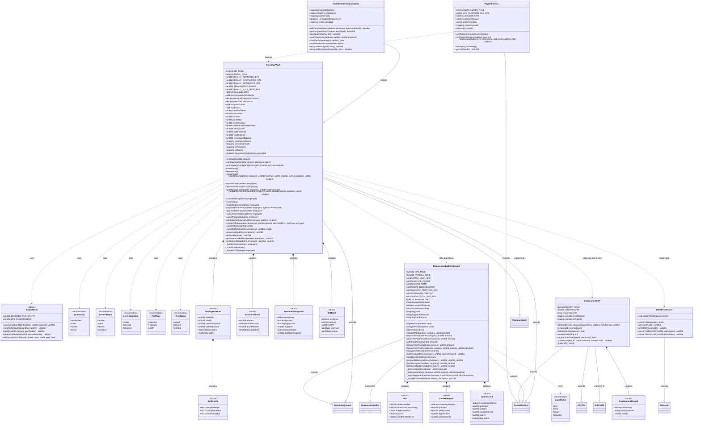

# Class Diagram — Payana Smart Contracts

```mermaid
classDiagram
    direction TB

    %% ── Library ──────────────────────────────────────────────────────────────
    class PayrollMath {
        <<library>>
        +uint256 SECONDS_PER_MONTH
        +uint256 BPS_DENOMINATOR
        +calcAccrued(uint256 flowRate, uint256 elapsed) uint256
        +monthlyToFlowRate(uint256 monthly) uint256
        +bpsOf(uint256 amount, uint256 bps) uint256
        +severanceMultiplier(uint256 tenureMonths) uint256
        +validateSplits(uint16 emp, uint16 comp, uint16 sev) bool
    }

    %% ── Enumerations ─────────────────────────────────────────────────────────
    class VaultStatus {
        <<enumeration>>
        Uninitialized
        Active
        Paused
        Frozen
    }

    class StreamStatus {
        <<enumeration>>
        Inactive
        Active
        Paused
        Cancelled
    }

    class SeveranceState {
        <<enumeration>>
        Locked
        Returned
        Released
    }

    class VestType {
        <<enumeration>>
        Retention
        Probation
        ESOP
    }

    class VestStatus {
        <<enumeration>>
        Locked
        Claimed
        Forfeited
    }

    class LoanStatus {
        <<enumeration>>
        None
        Active
        Repaid
        Defaulted
    }

    %% ── PayrollFactory ───────────────────────────────────────────────────────
    class PayrollFactory {
        +bytes32 SUPERADMIN_ROLE
        +uint16 MAX_PLATFORM_FEE_BPS
        +address immutable IDRX
        +address protocolTreasury
        +uint16 platformFeeBps
        +mapping companyVaults
        +address[] allVaults
        +setPlatformFee(uint16 newFeeBps)
        +setProtocolTreasury(address treasury)
        +deployVault(address hr, string name, address liq, address sbt) address
        +emergencyFreezeAll()
        +getTotalVaults() uint256
    }

    %% ── CompanyVault ─────────────────────────────────────────────────────────
    class SplitConfig {
        <<struct>>
        +uint16 employeeBps
        +uint16 complianceBps
        +uint16 severanceBps
    }

    class EmployeeStream {
        <<struct>>
        +uint256 flowRate
        +uint256 startTs
        +uint256 lastWithdrawnTs
        +uint256 settledBalance
        +StreamStatus status
        +SplitConfig splits
    }

    class SeveranceVault {
        <<struct>>
        +uint256 amount
        +SeveranceState state
        +uint256 tenureMonths
        +uint256 lastUpdatedTs
    }

    class TerminationProposal {
        <<struct>>
        +address employee
        +bool hrApproved
        +bool legalApproved
        +uint256 expiresAt
        +bytes32 reasonHash
        +uint256 flowRateSnapshot
    }

    class CliffVest {
        <<struct>>
        +address employee
        +uint256 amount
        +uint256 cliffTs
        +VestType vestType
        +VestStatus status
    }

    class CompanyVault {
        +bytes32 HR_ROLE
        +bytes32 LEGAL_ROLE
        +uint16 DEFAULT_EMPLOYEE_BPS
        +uint16 DEFAULT_COMPLIANCE_BPS
        +uint16 DEFAULT_SEVERANCE_BPS
        +uint256 TERMINATION_EXPIRY
        +uint16 DEFAULT_POOL_RATE_BPS
        +IERC20 immutable IDRX
        +address immutable hrAuthority
        +IEmployeeLiquidity liquidityContract
        +IEmploymentSBT sbtContract
        +address priceOracle
        +address factory
        +string companyName
        +VaultStatus status
        +uint16 bpjsBps
        +uint16 pph21Bps
        +uint16 severanceBps
        +uint16 lowBalanceThresholdBps
        +uint256 vestCounter
        +uint256 totalFlowRate
        +uint256 vaultBalance
        +uint256 complianceBalance
        +mapping employeeStreams
        +mapping severanceVaults
        +mapping terminations
        +mapping cliffVests
        +mapping employeeComplianceAccumulated
        +fundVault(uint256 amount)
        +withdrawVault(uint256 amount, address recipient)
        +setCompanyConfig(uint16 bpjs, uint16 pph21, uint16 threshold)
        +pauseVault()
        +resumeVault()
        +freezeVault()
        +startStream(address employee, uint256 flowRate, uint16 empBps, uint16 compBps, uint16 sevBps)
        +pauseStream(address employee)
        +resumeStream(address employee)
        +updateFlowRate(address employee, uint256 newFlowRate)
        +updateStreamSplits(address employee, uint16 empBps, uint16 compBps, uint16 sevBps)
        +cancelStream(address employee)
        +claimSalary()
        +resignEmployee(address employee)
        +proposeTermination(address employee, bytes32 reasonHash)
        +approveTermination(address employee)
        +executeTermination(address employee)
        +cancelProposal(address employee)
        +withdrawCompliance(uint256 amount, address recipient)
        +createCliffVest(address employee, uint256 amount, uint256 cliffTs, VestType vestType)
        +claimCliffVest(uint256 vestId)
        +cancelCliffVest(address employee, uint256 vestId)
        +getAccrued(address employee) uint256
        +getVaultBalance() uint256
        +getSeveranceBalance(address employee) uint256
        +getStreamInfo(address employee) address_uint256
        -_forfeitAllVests(address employee)
        -_checkLowBalance()
        -_revokeSBT(address employee)
    }

    %% ── ConfidentialCompanyVault ─────────────────────────────────────────────
    class ConfidentialCompanyVault {
        +mapping encryptedSalaries
        +mapping hasEncryptedSalary
        +mapping auditorExpiry
        +address[] _encryptedEmployeeList
        +mapping _inEncryptedList
        +setEncryptedSalary(address employee, bytes ciphertext) payable
        +getEncryptedSalary(address employee) euint256
        +aggregateTotalPayroll() euint256
        +grantViewingKey(address auditor, uint256 expiresAt)
        +isAuditorActive(address auditor) bool
        +revokeAuditorAccess(address auditor)
        +encryptedEmployeeCount() uint256
        +encryptedEmployeeAt(uint256 index) address
    }

    %% ── EmployeeLiquidityContract ────────────────────────────────────────────
    class Pool {
        <<struct>>
        +uint256 totalDeposited
        +uint256 totalLoansOutstanding
        +uint16 interestRateBps
        +bool initialized
        +uint256 yieldPerShareX18
    }

    class LenderDeposit {
        <<struct>>
        +address companyAddress
        +uint256 principal
        +uint256 yieldEarned
        +uint256 depositedTs
        +uint256 yieldDebtX18
    }

    class LoanRecord {
        <<struct>>
        +address companyAddress
        +uint256 principal
        +uint256 interest
        +uint256 repaidAmount
        +uint256 dueTs
        +LoanStatus status
    }

    class EmployeeLiquidityContract {
        +bytes32 OPS_ROLE
        +bytes32 PAYROLL_ROLE
        +uint256 MAX_LOAN_BPS
        +uint256 GRACE_PERIOD
        +uint256 LOAN_TERM
        +uint256 BPS_DENOMINATOR
        +uint256 REPAY_FRACTION_BPS
        +uint256 MINIMUM_DEPOSIT
        +uint256 PROTOCOL_FEE_BPS
        +IERC20 immutable IDRX
        +mapping registeredVaults
        +address protocolTreasury
        +uint256 totalProtocolFee
        +mapping pools
        +mapping lenderDeposits
        +mapping loanRecords
        +registerVault(address vault)
        +unregisterVault(address vault)
        +claimProtocolFee()
        +initializePool(address company, uint16 rateBps)
        +depositToPool(address company, uint256 amount)
        +depositToPoolFor(address company, uint256 amount)
        +withdrawDeposit(uint256 amount)
        +borrowFromPool(address company, uint256 amount)
        +borrowFromPoolFor(address company, uint256 amount, uint256 flowRate)
        +repayLoanManual(uint256 amount)
        +autoRepay(address borrower, uint256 claimedAmount) uint256
        +liquidateLoan(address borrower)
        +getLoanBalance(address borrower) uint256_uint256_uint256
        +getPoolLiquidity(address company) uint256_uint256
        +getDepositBalance(address lender) uint256_uint256
        -_doDeposit(address lender, uint256 amount)
        -_doBorrow(address borrower, uint256 amount, uint256 flowRate)
        -_applyRepayment(address borrower, LoanRecord record, uint256 amount)
        -_syncYield(LenderDeposit deposit, Pool pool) uint256
    }

    %% ── EmploymentSBT ────────────────────────────────────────────────────────
    class EmploymentRecord {
        <<struct>>
        +address hrAuthority
        +string companyName
        +uint256 startTs
    }

    class EmploymentSBT {
        +bytes32 MINTER_ROLE
        -uint256 _tokenIdCounter
        -string _baseTokenURI
        +mapping employmentRecords
        +mapping employeeTokenId
        +mint(address to, string companyName, address hrAuthority) uint256
        +revoke(address employee)
        +locked(uint256 tokenId) bool
        +setBaseURI(string uri)
        +supportsInterface(bytes4 interfaceId) bool
        -_update(address to, uint256 tokenId, address auth) address
        -_baseURI() string
    }

    %% ── IDRXPriceOracle ──────────────────────────────────────────────────────
    class IDRXPriceOracle {
        +AggregatorV3Interface priceFeed
        +setPriceFeed(address feed)
        +getLatestRate() uint256
        +getIDRXPriceInUSD() uint256
        +convertUSDtoIDRX(uint256 usdAmount) uint256
        +convertIDRXtoUSD(uint256 idrxAmount) uint256
    }

    %% ── Inheritance ──────────────────────────────────────────────────────────
    CompanyVault --|> ICompanyVault : implements
    CompanyVault --|> ReentrancyGuard : extends
    CompanyVault --|> AccessControl : extends
    ConfidentialCompanyVault --|> CompanyVault : extends
    EmployeeLiquidityContract --|> IEmployeeLiquidity : implements
    EmployeeLiquidityContract --|> ReentrancyGuard : extends
    EmployeeLiquidityContract --|> AccessControl : extends
    EmploymentSBT --|> ERC721 : extends
    EmploymentSBT --|> IERC5192 : implements
    EmploymentSBT --|> AccessControl : extends
    IDRXPriceOracle --|> Ownable : extends
    PayrollFactory --|> AccessControl : extends

    %% ── Composition (structs owned by contract) ──────────────────────────────
    CompanyVault *-- EmployeeStream : contains
    CompanyVault *-- SeveranceVault : contains
    CompanyVault *-- TerminationProposal : contains
    CompanyVault *-- CliffVest : contains
    EmployeeStream *-- SplitConfig : contains
    EmployeeLiquidityContract *-- Pool : contains
    EmployeeLiquidityContract *-- LenderDeposit : contains
    EmployeeLiquidityContract *-- LoanRecord : contains
    EmploymentSBT *-- EmploymentRecord : contains

    %% ── Associations (contract references) ──────────────────────────────────
    PayrollFactory ..> CompanyVault : deploys
    CompanyVault ..> EmployeeLiquidityContract : calls autoRepay
    CompanyVault ..> EmploymentSBT : calls mint and revoke
    CompanyVault ..> IDRXPriceOracle : reads price
    CompanyVault ..> PayrollMath : uses

    %% ── Enum usage ───────────────────────────────────────────────────────────
    CompanyVault ..> VaultStatus : uses
    CompanyVault ..> StreamStatus : uses
    CompanyVault ..> SeveranceState : uses
    CompanyVault ..> VestType : uses
    CompanyVault ..> VestStatus : uses
    EmployeeLiquidityContract ..> LoanStatus : uses
```
