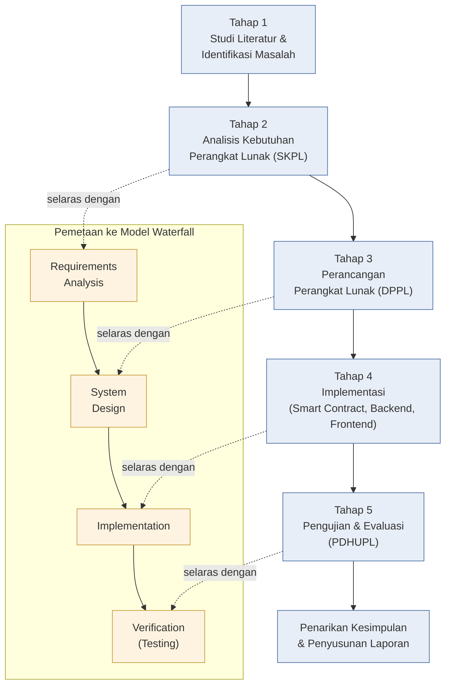
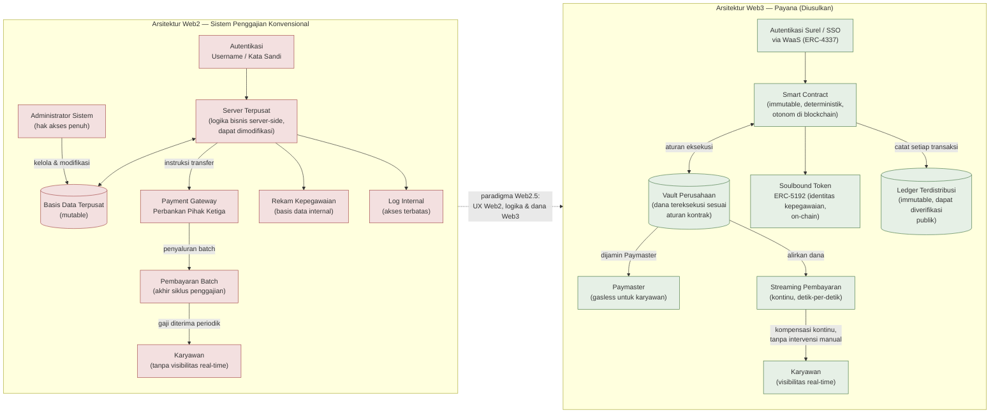
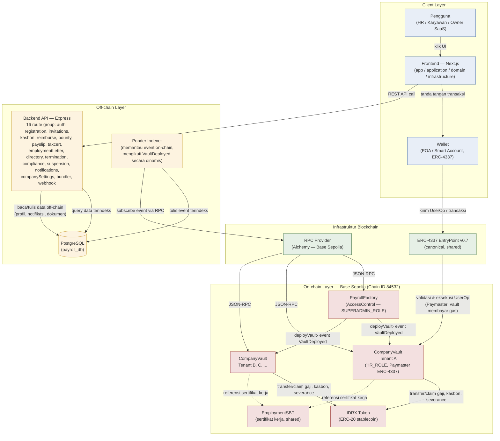

# Daftar Gambar — Skripsi Payana

> Kumpulan diagram (dibuat dengan Mermaid) untuk dilampirkan sebagai Gambar di naskah skripsi.
> Render tiap diagram (mis. via VS Code Mermaid preview, mermaid.live, atau `mmdc`) menjadi PNG/SVG
> sebelum ditempel ke dokumen Word/LaTeX skripsi — Word tidak merender kode Mermaid secara native.

---

## Gambar 3.1. Diagram Alur Tahapan Penelitian

> **Catatan:** 5 tahap penelitian di bawah diturunkan dari struktur dokumen rekayasa perangkat lunak
> yang sudah ada di proyek ini (`SKPL.md`, `DPPL.md`, `PDHUPL_v2.md`) dan konvensi umum skripsi
> rekayasa perangkat lunak. **Ini draf** — sesuaikan nama/urutan tahap dengan yang sudah kamu tulis
> di Bab 3 naskah skripsi kalau berbeda.

**Penjelasan tiap tahap:**

| Tahap | Aktivitas | Luaran | Fase Waterfall |
|---|---|---|---|
| 1. Studi Literatur & Identifikasi Masalah | Kajian pustaka Web3 payroll, stablecoin IDRX, regulasi ketenagakerjaan (UU Cipta Kerja), penentuan rumusan masalah dan tujuan penelitian | Rumusan masalah, batasan penelitian | — (pra-Waterfall) |
| 2. Analisis Kebutuhan Perangkat Lunak | Identifikasi aktor, use case, dan kebutuhan fungsional/non-fungsional sistem | `SKPL.md` (29 Use Case, kebutuhan fungsional FR-PAYANA-1xx s.d. 2001) | Requirements Analysis |
| 3. Perancangan Perangkat Lunak | Perancangan arsitektur, basis data, antarmuka, dan smart contract | `DPPL.md` (rancangan data, API, UI, sequence diagram) | System Design |
| 4. Implementasi | Penulisan kode smart contract (Solidity/Foundry), backend (Express/Ponder), dan frontend (Next.js); deploy ke Base Sepolia testnet | Kode sumber, kontrak ter-deploy | Implementation |
| 5. Pengujian & Evaluasi | Pengujian unit (Foundry), pengujian fungsional black-box, verifikasi eksekusi nyata di UI | `PDHUPL_v2.md` (96 butir uji, status Handal) | Verification (Testing) |

> Fase **Maintenance** pada model Waterfall klasik tidak tercakup dalam ruang lingkup penelitian ini,
> karena sistem berstatus prototipe/purwarupa skripsi dan bukan produk produksi yang dipelihara
> berkelanjutan.

---

## Gambar 3.2. Diagram Perbedaan Arsitektur Web2 dan Web3

> **Catatan:** Diagram ini memvisualisasikan Tabel 3.1 (Perbandingan Arsitektur Sistem Penggajian
> Web2 dan Web3) — kedelapan dimensi perbandingan pada tabel dipetakan satu-per-satu ke pasangan
> komponen di bawah, supaya narasi teks dan gambar konsisten.

**Pemetaan ke Tabel 3.1:**

| Dimensi (Tabel 3.1) | Komponen Web2 di diagram | Komponen Web3 di diagram |
|---|---|---|
| Penyimpanan data | Basis Data Terpusat (mutable) | Ledger Terdistribusi (immutable) |
| Logika bisnis | Server Terpusat (server-side, dapat dimodifikasi) | Smart Contract (immutable, deterministik) |
| Mekanisme pembayaran | Payment Gateway → Pembayaran Batch | Vault → Streaming Pembayaran (kontinu) |
| Autentikasi pengguna | Username / Kata Sandi | Surel/SSO via WaaS (ERC-4337) |
| Biaya transaksi karyawan | Ditanggung perusahaan via bank (implisit di alur Payment Gateway) | Paymaster (gasless) |
| Identitas kepegawaian | Rekam Kepegawaian (basis data internal) | Soulbound Token ERC-5192 (on-chain) |
| Audit trail | Log Internal (akses terbatas) | Ledger Terdistribusi (transaksi publik, dapat diverifikasi) |
| Ketergantungan perantara | Administrator Sistem + Payment Gateway (tinggi) | Smart Contract ↔ Vault langsung (minimal, trustless) |

---

## Gambar 4.1. Diagram Arsitektur Sistem Payana End-to-End

> **Catatan:** Komponen dan alur di bawah diverifikasi langsung dari kode (bukan diasumsikan):
> `docker-compose.yml` (services: backend, ponder, postgres, pgadmin), `ponder/ponder.config.ts`
> (indexer memantau `PayrollFactory` di Base Sepolia lalu otomatis mengikuti setiap `CompanyVault`
> yang di-deploy via event `VaultDeployed`), struktur folder `frontend/src/{app,application,domain,
> infrastructure}` (pola clean architecture), dan `backend/src/routes/*` (16 route group REST API).

**Penjelasan alur:**

1. **Pengguna** berinteraksi dengan **Frontend (Next.js)**, yang mengikuti pola clean architecture (pemisahan `app`, `application`, `domain`, `infrastructure`).
2. Untuk aksi yang butuh transaksi on-chain, frontend meminta tanda tangan ke **Wallet** pengguna (EOA biasa, atau Smart Account via ERC-4337 jika memakai fitur gasless).
3. Untuk data yang tidak perlu on-chain (autentikasi, profil, notifikasi, dokumen seperti payslip/tax cert/surat kerja), frontend memanggil **Backend API (Express)** langsung — 16 grup route REST.
4. Transaksi on-chain (deploy vault, mulai gaji stream, klaim gaji, kasbon, severance, dll.) dikirim ke jaringan **Base Sepolia** lewat **RPC Provider (Alchemy)**, baik sebagai transaksi biasa maupun **UserOperation** lewat **ERC-4337 EntryPoint** (di mana `CompanyVault` bertindak sebagai Paymaster-nya sendiri, menanggung gas karyawan).
5. **PayrollFactory** adalah satu-satunya kontrak yang dideploy sekali per jaringan; setiap perusahaan (tenant) mendapat instance **CompanyVault** terisolasi lewat `deployVault()`, yang memancarkan event `VaultDeployed`.
6. **Ponder Indexer** memantau event on-chain lewat RPC — termasuk secara dinamis "mengikuti" setiap `CompanyVault` baru begitu event `VaultDeployed` terdeteksi (bukan alamat tetap) — lalu menulis hasil indexing ke **PostgreSQL**.
7. **Backend API** membaca data on-chain yang sudah diindeks dari PostgreSQL yang sama (kolom terpisah dari data off-chain), sehingga frontend cukup satu sumber kebenaran (`payroll_db`) untuk gabungan data on-chain + off-chain.
8. **EmploymentSBT** (Soulbound Token sertifikat kerja) dan **IDRX** (stablecoin ERC-20) adalah kontrak bersama (shared) yang direferensikan oleh setiap `CompanyVault`, bukan didplikasi per tenant.

---

## Gambar 4.3. Struktur Direktori Proyek Smart Contract

> **Catatan:** Struktur di bawah diambil langsung dari isi folder `finley-payroll/` (proyek Foundry).
> Hanya folder/file kode sumber yang relevan yang ditampilkan — folder hasil build/dependensi
> (`out/`, `cache/`, `broadcast/`, `node_modules/`, isi `lib/*` pihak ketiga) diringkas sebagai satu
> baris agar diagram tetap terbaca.

```mermaid
flowchart TD
    ROOT["finley-payroll/<br/>(Foundry project)"]

    ROOT --> SRC["src/"]
    ROOT --> TEST["test/"]
    ROOT --> SCRIPT["script/"]
    ROOT --> LIB["lib/<br/>(dependensi eksternal)"]
    ROOT --> BUILD["out/, cache/, broadcast/<br/>(hasil build &amp; deployment,<br/>auto-generated)"]
    ROOT --> CFG["foundry.toml, foundry.lock,<br/>package.json, Makefile"]

    SRC --> SRC1["CompanyVault.sol<br/>(vault per-tenant, gaji streaming,<br/>kasbon, severance, Paymaster ERC-4337)"]
    SRC --> SRC2["PayrollFactory.sol<br/>(entry-point SaaS, deploy CompanyVault<br/>per tenant, AccessControl)"]
    SRC --> SRC3["EmploymentSBT.sol<br/>(Soulbound Token ERC-5192,<br/>sertifikat kerja)"]
    SRC --> SRC_IF["interfaces/"]
    SRC --> SRC_LIB["libraries/"]
    SRC --> SRC_MOCK["mocks/"]

    SRC_IF --> IF1["ICompanyVault.sol"]
    SRC_IF --> IF2["IERC5192.sol"]
    SRC_LIB --> LIB1["PayrollMath.sol<br/>(perhitungan bps, pembagian split)"]
    SRC_MOCK --> MOCK1["MockIDRX.sol<br/>(token IDRX tiruan untuk test)"]

    TEST --> T1["CompanyVault.t.sol"]
    TEST --> T2["CompanyVaultPaymaster.t.sol"]
    TEST --> T3["EmploymentSBT.t.sol"]
    TEST --> T4["PayrollFactory.t.sol"]
    TEST --> T5["PayrollMath.t.sol"]

    SCRIPT --> S1["Deploy.s.sol<br/>(deploy awal ke Base Sepolia)"]
    SCRIPT --> S2["DeployMock.s.sol<br/>(deploy dengan MockIDRX, dev/test)"]
    SCRIPT --> S3["RedeployFactory.s.sol"]
    SCRIPT --> S4["RedeployGen8.s.sol"]

    LIB --> L1["forge-std"]
    LIB --> L2["openzeppelin-contracts<br/>&amp; openzeppelin-contracts-upgradeable"]
    LIB --> L3["account-abstraction<br/>(ERC-4337 EntryPoint interfaces)"]

    style ROOT fill:#e8eef7,stroke:#4a6fa5
    style SRC fill:#f3e0e0,stroke:#a54a4a
    style SRC1 fill:#f3e0e0,stroke:#a54a4a
    style SRC2 fill:#f3e0e0,stroke:#a54a4a
    style SRC3 fill:#f3e0e0,stroke:#a54a4a
    style SRC_IF fill:#f3e0e0,stroke:#a54a4a
    style SRC_LIB fill:#f3e0e0,stroke:#a54a4a
    style SRC_MOCK fill:#f3e0e0,stroke:#a54a4a
    style TEST fill:#e6f0e6,stroke:#4a7a4a
    style SCRIPT fill:#fdf3e0,stroke:#c99a3a
    style LIB fill:#eee,stroke:#888
    style BUILD fill:#eee,stroke:#888
    style CFG fill:#eee,stroke:#888
```

**Penjelasan struktur:**

| Folder/File | Isi |
|---|---|
| `src/CompanyVault.sol` | Kontrak utama per-tenant — logika gaji streaming, kasbon (salary advance), severance, dan bertindak sebagai Paymaster ERC-4337 untuk transaksi gasless karyawan. |
| `src/PayrollFactory.sol` | Entry-point SaaS — mendeploy `CompanyVault` baru per tenant via `deployVault()`, dilindungi `AccessControl` (`SUPERADMIN_ROLE`). |
| `src/EmploymentSBT.sol` | Soulbound Token (ERC-5192) untuk sertifikat kerja karyawan, kontrak bersama (shared) antar-tenant. |
| `src/interfaces/` | Interface `ICompanyVault.sol` dan `IERC5192.sol`. |
| `src/libraries/PayrollMath.sol` | Fungsi murni untuk perhitungan basis poin (bps) dan pembagian split gaji/severance. |
| `src/mocks/MockIDRX.sol` | Token IDRX tiruan, dipakai di unit test dan skrip deploy lokal (`DeployMock.s.sol`). |
| `test/` | 5 file `*.t.sol` — unit test dan fuzz test (Foundry) untuk seluruh kontrak di atas. |
| `script/` | 4 skrip deployment Foundry (`Deploy.s.sol` untuk Base Sepolia, `DeployMock.s.sol` untuk dev, plus 2 skrip redeploy historis). |
| `lib/` | Dependensi eksternal: `forge-std`, OpenZeppelin (contracts + upgradeable), `account-abstraction` (interface ERC-4337). |

---

*(Tambahkan gambar skripsi lain di file ini seiring kebutuhan, dengan format `## Gambar X.Y. <judul>` diikuti blok mermaid.)*
