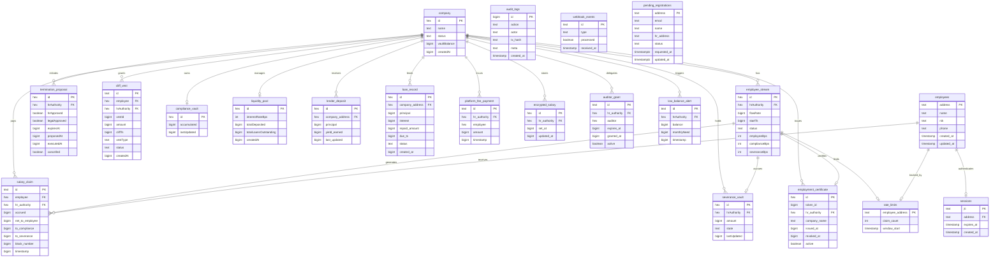

# Physical Data Model — Payana Database

```mermaid
erDiagram

    %% ════════════════════════════════════════════════════════════════
    %% PONDER SCHEMA (public) — on-chain indexed tables
    %% ════════════════════════════════════════════════════════════════

    company {
        hex id PK
        text name
        text status
        bigint vaultBalance
        bigint createdAt
    }

    employee_stream {
        hex id PK
        hex hrAuthority FK
        bigint flowRate
        bigint startTs
        text status
        int employeeBps
        int complianceBps
        int severanceBps
    }

    salary_claim {
        text id PK
        hex employee FK
        hex hr_authority FK
        bigint accrued
        bigint net_to_employee
        bigint to_compliance
        bigint to_severance
        bigint block_number
        bigint timestamp
    }

    severance_vault {
        hex id PK
        hex hrAuthority FK
        bigint amount
        text state
        bigint lastUpdated
    }

    termination_proposal {
        hex id PK
        hex hrAuthority FK
        boolean hrApproved
        boolean legalApproved
        bigint expiresAt
        bigint proposedAt
        bigint executedAt
        boolean cancelled
    }

    cliff_vest {
        text id PK
        hex employee FK
        hex hrAuthority FK
        bigint vestId
        bigint amount
        bigint cliffTs
        text vestType
        text status
        bigint createdAt
    }

    compliance_vault {
        hex id PK
        bigint accumulated
        bigint lastUpdated
    }

    liquidity_pool {
        hex id PK
        int interestRateBps
        bigint totalDeposited
        bigint totalLoansOutstanding
        bigint createdAt
    }

    lender_deposit {
        hex id PK
        hex company_address FK
        bigint principal
        bigint yield_earned
        bigint last_updated
    }

    loan_record {
        hex id PK
        hex company_address FK
        bigint principal
        bigint interest
        bigint repaid_amount
        bigint due_ts
        text status
        bigint created_at
    }

    employment_certificate {
        hex id PK
        bigint token_id
        hex hr_authority FK
        text company_name
        bigint issued_at
        bigint revoked_at
        boolean active
    }

    platform_fee_payment {
        text id PK
        hex hr_authority FK
        hex employee
        bigint amount
        bigint timestamp
    }

    encrypted_salary {
        hex id PK
        hex hr_authority FK
        bigint set_at
        bigint updated_at
    }

    auditor_grant {
        text id PK
        hex hr_authority FK
        hex auditor
        bigint expires_at
        bigint granted_at
        boolean active
    }

    low_balance_alert {
        text id PK
        hex hrAuthority FK
        bigint balance
        bigint monthlyNeed
        bigint timestamp
    }

    %% ════════════════════════════════════════════════════════════════
    %% APP SCHEMA (app) — off-chain backend tables
    %% ════════════════════════════════════════════════════════════════

    rate_limits {
        text employee_address PK
        int claim_count
        timestamp window_start
    }

    audit_logs {
        bigint id PK
        text action
        text actor
        text tx_hash
        text meta
        timestamp created_at
    }

    webhook_events {
        text id PK
        text type
        boolean processed
        timestamp received_at
    }

    employees {
        text address PK
        text name
        text nik
        text phone
        timestamp created_at
        timestamp updated_at
    }

    sessions {
        text jti PK
        text address FK
        timestamp expires_at
        timestamp created_at
    }

    pending_registrations {
        text address PK
        text email
        text name
        text hr_address
        text status
        timestamptz requested_at
        timestamptz updated_at
    }

    %% ════════════════════════════════════════════════════════════════
    %% RELATIONS
    %% ════════════════════════════════════════════════════════════════

    company ||--o{ employee_stream : "has"
    company ||--o{ severance_vault : "holds"
    company ||--o{ termination_proposal : "initiates"
    company ||--o{ cliff_vest : "grants"
    company ||--o{ salary_claim : "pays"
    company ||--o| compliance_vault : "owns"
    company ||--o| liquidity_pool : "manages"
    company ||--o{ lender_deposit : "receives"
    company ||--o{ loan_record : "lends"
    company ||--o{ employment_certificate : "issues"
    company ||--o{ platform_fee_payment : "incurs"
    company ||--o{ encrypted_salary : "stores"
    company ||--o{ auditor_grant : "delegates"
    company ||--o{ low_balance_alert : "triggers"

    employee_stream ||--o{ salary_claim : "generates"
    employee_stream ||--o| severance_vault : "accrues"
    employee_stream ||--o| employment_certificate : "certifies"
    employee_stream ||--o| rate_limits : "limits"

    employees ||--o| sessions : "authenticates"
    employees ||--o{ salary_claim : "receives"
    employees ||--o| rate_limits : "tracked_by"
```
