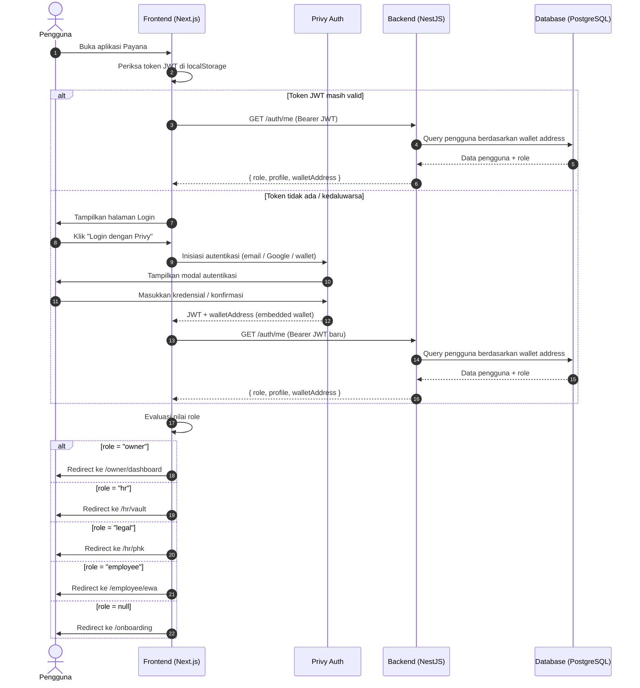
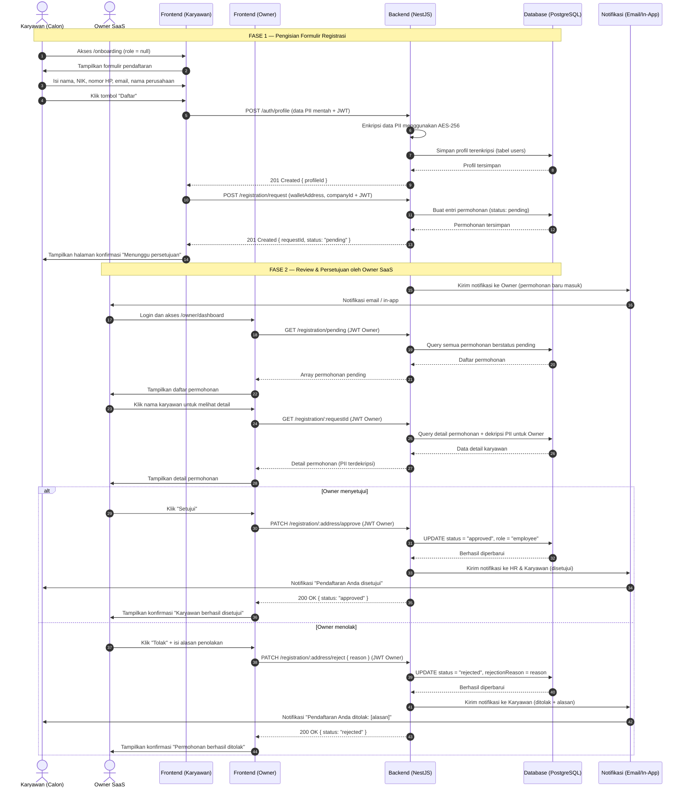
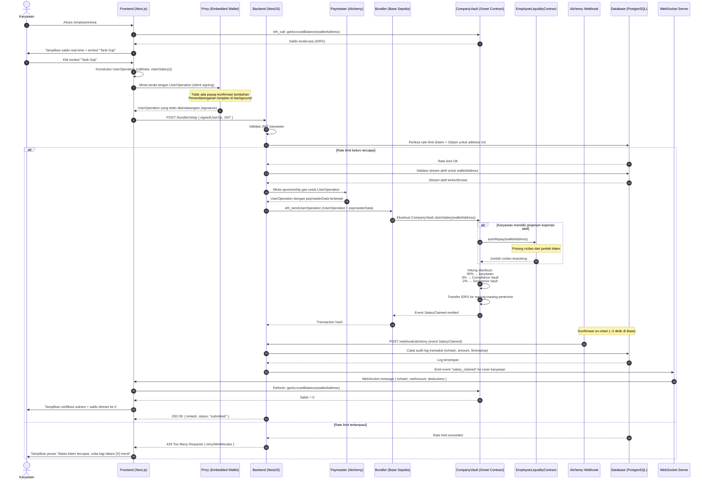
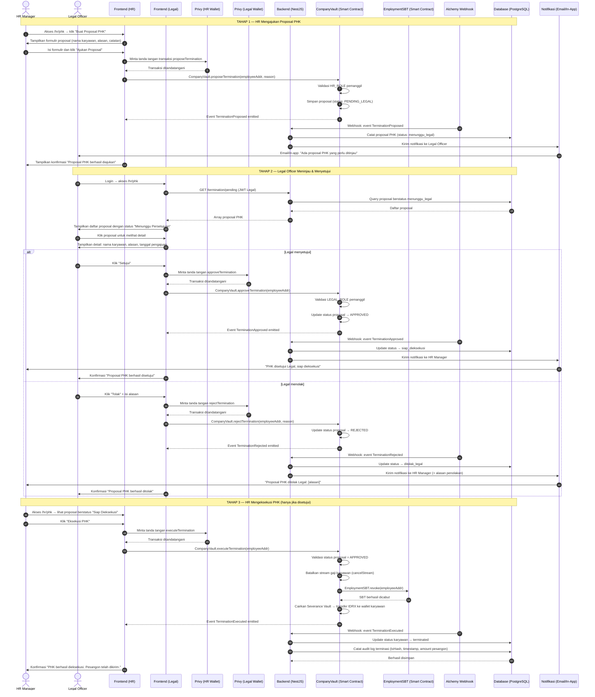
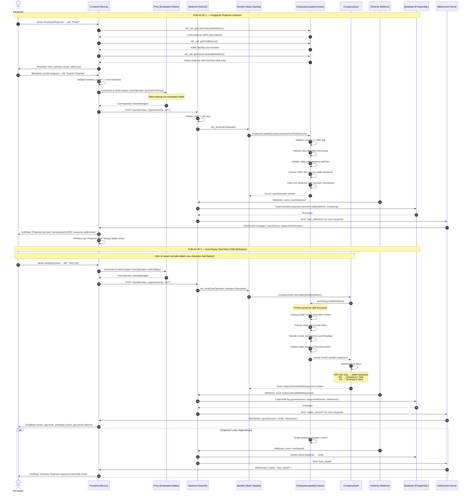

# Sequence Diagrams — Payana
> Platform Payroll & Earned Wage Access Berbasis Blockchain (Base Sepolia)

**Proyek:** Payana — Earned Wage Access & Payroll Berbasis Blockchain  
**Versi:** 1.0  
**Tanggal:** 27 Mei 2026  

Dokumen ini menyajikan sequence diagram untuk setiap alur utama sistem Payana menggunakan sintaks Mermaid (`sequenceDiagram`). Diagram menggambarkan interaksi antara aktor, komponen frontend, backend, smart contract, dan layanan eksternal.

---

## Daftar Diagram

| No. | Judul | Use Case Terkait |
|---|---|---|
| SD-01 | Login & Deteksi Role | UC-01 |
| SD-02 | Registrasi Karyawan & Persetujuan Owner | UC-02, UC-03 |
| SD-03 | Klaim EWA (Full Flow) | UC-05 |
| SD-04 | PHK Multi-Signature | UC-06 |
| SD-05 | Pinjaman Koperasi & Auto-Repay | UC-07 |

---

## SD-01: Login & Deteksi Role

Diagram ini menggambarkan alur autentikasi pengguna melalui Privy hingga sistem mendeteksi role dan mengarahkan pengguna ke halaman yang sesuai.

---

## SD-02: Registrasi Karyawan Baru & Persetujuan Owner SaaS

Diagram ini menggambarkan dua fase: (1) pengisian formulir pendaftaran oleh calon karyawan, dan (2) proses review serta persetujuan oleh Owner SaaS. Kedua fase ini dapat terjadi pada sesi yang berbeda.

---

## SD-03: Klaim EWA — Full Flow

Diagram ini menggambarkan alur lengkap klaim Earned Wage Access: dari interaksi karyawan di frontend, pengemasan UserOperation (ERC-4337), validasi backend, hingga eksekusi on-chain dan pembaruan status melalui webhook Alchemy.

---

## SD-04: PHK Multi-Signature

Diagram ini menggambarkan alur Pemutusan Hubungan Kerja (PHK) yang memerlukan dua tanda tangan: proposal dari HR Manager dan persetujuan dari Legal Officer, sebelum HR dapat mengeksekusi terminasi secara on-chain.

---

## SD-05: Pinjaman Koperasi & Mekanisme Auto-Repay

Diagram ini menggambarkan dua sub-alur yang saling berkaitan: (1) pengajuan pinjaman oleh karyawan dari liquidity pool, dan (2) pemotongan cicilan otomatis (auto-repay) yang terjadi setiap kali karyawan melakukan klaim EWA berikutnya.

---

## Catatan Teknis

### Konvensi Penulisan Diagram

1. **`autonumber`** — Setiap pesan diberi nomor urut otomatis untuk memudahkan referensi dalam penjelasan naratif.
2. **`alt/else`** — Digunakan untuk menggambarkan percabangan kondisional (happy path vs. alternatif/pengecualian).
3. **`Note over`** — Digunakan untuk memberikan keterangan kontekstual pada blok interaksi tertentu.
4. **Garis padat (`->>`)** — Merepresentasikan pengiriman pesan/permintaan.
5. **Garis putus (`-->>`)** — Merepresentasikan balasan/respons.

### Komponen Sistem

| Komponen | Teknologi | Keterangan |
|---|---|---|
| Frontend | Next.js 15+ (App Router) | Antarmuka pengguna berbasis React |
| Backend | NestJS (Node.js) | REST API + WebSocket server |
| Database | PostgreSQL | Penyimpanan data off-chain |
| Auth | Privy | Embedded wallet + JWT autentikasi |
| Smart Contract | Solidity (EVM) | CompanyVault, EmployeeLiquidityContract, SBT |
| Blockchain | Base Sepolia | Layer 2 EVM (testnet) |
| Bundler | Alchemy (ERC-4337) | Memproses UserOperation batch |
| Paymaster | Alchemy | Mensponsori gas karyawan |
| Webhook | Alchemy Notify | Event listener on-chain → backend |
| Token | IDRX (ERC-20) | Stablecoin IDR digital |
