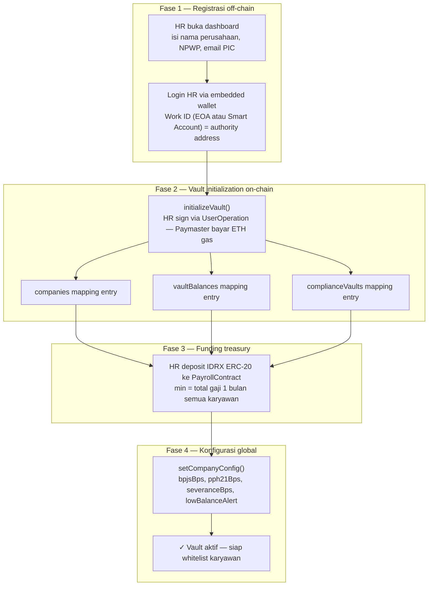

# Functional Requirements — Module A: Core Payroll

> **Sprint:** 1 (3 minggu)
> **Output:** Vault + streaming gaji berjalan di Base Sepolia
> **Contract:** `PayrollContract.sol`

---

## Overview

Modul A adalah fondasi seluruh sistem. Semua modul lain (Compliance, Cliff Vesting, Koperasi) bergantung pada komponen yang dibangun di Sprint 1 ini. Tiga sub-komponen utama:

1. **Company Vault Management** — deploy dan kelola treasury IDRX perusahaan
2. **Employee Stream Management** — buat dan kelola streaming gaji per karyawan
3. **Auto-Split Claim** — distribusi atomic saat karyawan menarik gaji

---

## FR-A01 · Company Vault Management

### Storage yang Terlibat

| Mapping | Key | Konten |
|---|---|---|
| `companies` | `hr_address` | treasuryBalance, status, hrAuthority, params |
| `vaultBalances` | `hr_address` | IDRX holding (treasury utama, disimpan dalam contract) |
| `complianceVaults` | `company_address` | bpjsBps, pph21Bps, accumulated |

### Requirements

- **[MUST]** System SHALL setup `companies`, `vaultBalances`, dan `complianceVaults` secara **atomic** dalam satu transaksi saat `initializeVault()` dipanggil
- **[MUST]** System SHALL memvalidasi bahwa hanya `hrAuthority` (`msg.sender`) yang bisa memanggil fungsi vault management (`pauseVault`, `resumeVault`, `setConfig`) — enforced via `onlyHR` modifier
- **[MUST]** System SHALL mengirim alert via backend webhook ke HR ketika `treasuryBalance < 20%` dari kebutuhan gaji bulanan seluruh karyawan aktif
- **[MUST]** System SHALL mendukung empat state vault dengan transisi yang terdefinisi:

```
Uninitialized → Active → Paused → Frozen

Transisi yang valid:
  initializeVault()  : Uninitialized → Active
  pauseVault()       : Active → Paused
  resumeVault()      : Paused → Active
  freezeVault()      : Active/Paused → Frozen (darurat)

Transisi yang TIDAK valid:
  Frozen → apapun (state final)
```

### Fungsi

```solidity
// Membuat vault perusahaan
function initializeVault(
    string memory companyName,
    uint16 bpjsBps,        // basis points, misal 500 = 5%
    uint16 pph21Bps,
    uint16 severanceBps,   // default 200 = 2%
    uint16 lowBalanceThresholdBps
) external;

// Update konfigurasi split
function setCompanyConfig(
    uint16 bpjsBps,
    uint16 pph21Bps,
    uint16 lowBalanceThresholdBps
) external onlyHR;

function pauseVault() external onlyHR;
function resumeVault() external onlyHR;
```

---

## FR-A02 · Employee Stream Management

### Storage yang Terlibat

| Mapping | Key | Konten |
|---|---|---|
| `employeeStreams` | `employee_address` | flowRate, startTs, lastWithdrawnTs, status |
| `severanceVaults` | `employee_address` | amount, state (LOCKED/RETURNED/RELEASED), tenureMonths |

### Requirements

- **[MUST]** System SHALL membuat entry di `employeeStreams` dengan key `employee_address` — **unik per karyawan per perusahaan**
- **[MUST]** System SHALL menghitung accrued salary dengan formula:
  ```
  accrued = flowRate × (block.timestamp − lastWithdrawnTs)
  ```
- **[MUST]** System SHALL mendukung operasi lengkap pada stream:

| Fungsi | Aksi | Authority |
|---|---|---|
| `startStream()` | Buat employeeStream entry, mulai akru | HR only |
| `pauseStream()` | Hentikan akru sementara | HR only |
| `resumeStream()` | Lanjutkan akru dari titik pause | HR only |
| `updateFlowRate()` | Ubah flowRate (kenaikan gaji) | HR only |
| `cancelStream()` | Akhiri stream (resign/kontrak selesai) | HR only |

- **[MUST]** System SHALL memastikan `cancelStream()` **tidak menghapus saldo yang sudah terakru** — karyawan tetap bisa claim sisa saldo setelah cancel

### Kalkulasi Flow Rate

```
Gaji bulanan: Rp X
Flow rate per detik = X / (30 × 24 × 3600)
Flow rate per detik = X / 2.592.000

Contoh:
  Gaji Rp 5.000.000 → flowRate = ~1.929 IDRX wei/detik
  Gaji Rp 10.000.000 → flowRate = ~3.858 IDRX wei/detik
```

### Fungsi

```solidity
function startStream(
    address employee,
    uint256 flowRate,           // IDRX wei per detik
    uint16 employeeSplitBps,    // misal 9300 = 93%
    uint16 complianceSplitBps,  // misal 500  =  5%
    uint16 severanceSplitBps    // misal 200  =  2%
) external onlyHR;
// Require: employeeSplitBps + complianceSplitBps + severanceSplitBps == 10000

function pauseStream(address employee) external onlyHR;
function resumeStream(address employee) external onlyHR;

function updateFlowRate(
    address employee,
    uint256 newFlowRate
) external onlyHR;

function cancelStream(address employee) external onlyHR;
```

---

## FR-A03 · Auto-Split Claim (claimSalary)

### Requirements

- **[MUST]** System SHALL melakukan split otomatis pada setiap `claimSalary()` dengan distribusi:
  ```
  accrued_amount:
    93% → Employee address (Work ID)
     5% → complianceVaults balance
     2% → severanceVaults balance
  ```
- **[SHOULD]** System SHALL mengizinkan HR mengoverride persentase split per karyawan (misal bracket PPh21 berbeda tiap karyawan)
- **[MUST]** System SHALL melakukan **external call ke `EmployeeLiquidityContract`** untuk auto-repayment pinjaman **sebelum** split dilakukan
- **[MUST]** System SHALL **revert** instruksi jika total split melebihi accrued amount
- **[MUST]** System SHALL menggunakan **Checks-Effects-Interactions pattern** untuk mencegah reentrancy
- **[MUST]** System SHALL update `lastWithdrawnTs = block.timestamp` setelah split selesai

### Urutan Eksekusi claimSalary

```
1. Verifikasi: karyawan ada di whitelist & stream aktif
2. Hitung: accrued = flowRate × (block.timestamp - lastWithdrawnTs)
3. External call: cek loanRecords — jika ada, potong cicilan dulu
4. Hitung: sisa setelah repayment
5. Effects: update lastWithdrawnTs = block.timestamp (sebelum transfer!)
6. Transfer 3× via IERC20.transfer() atomic:
     a. 93% → Employee address
     b.  5% → complianceVaults[company]
     c.  2% → severanceVaults[employee]
7. Increment: tenureMonths jika sesuai
8. Emit: event SalaryClaimed(employee, accrued, block.timestamp)
```

### Error Cases

| Error | Kondisi | Behavior |
|---|---|---|
| `InsufficientVaultBalance` | Treasury < accrued amount | Revert seluruh transaksi |
| `StreamNotActive` | Stream di-pause atau di-cancel | Revert |
| `NotWhitelisted` | Employee address tidak terdaftar | Revert |
| `SplitOverflow` | Total split > accrued | Revert |

---

## Flow Company Onboarding (Lengkap)


