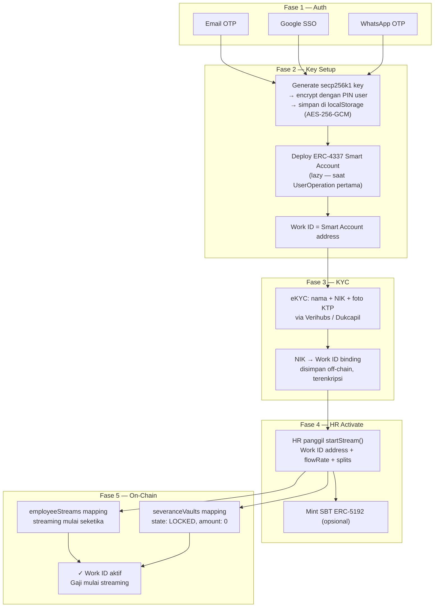

# Functional Requirements — Module B: Work ID & Auth

> **Sprint:** 3 (dev build) + Production Phase (production hardening)
> **Output Dev:** Self-hosted embedded wallet, EIP-191 auth, JWT session, on-chain role resolution
> **Output Prod:** ERC-4337 Smart Account, encrypted key, KYC binding, gasless flow end-to-end
> **Dependency:** Sprint 1 (stream harus ada sebelum claim bisa ditest)

---

## Overview

Modul B menangani identitas karyawan on-chain dan pengalaman pengguna yang transparan.
Tujuan utama: **karyawan tidak perlu tahu mereka menggunakan blockchain**.

Dua komponen kritis:
1. **Embedded Wallet** — Work ID creation (Ethereum address) tanpa seed phrase
2. **Gasless Transaction via ERC-4337** — Paymaster yang bayar gas fee ETH atas nama karyawan

---

## Apa itu Work ID?

> **Work ID** = Ethereum address karyawan yang dibuat otomatis saat pertama kali login.
> Ini adalah identitas on-chain yang menerima gaji, pesangon, bonus, dan pinjaman.
> Karyawan tidak perlu tahu ini adalah "wallet" — cukup tahu ini adalah "ID Karyawan" mereka.

---

## Status Implementasi

| Komponen | Dev Build (saat ini) | Production Target |
|---|---|---|
| Key generation | `generatePrivateKey()` → localStorage | Encrypted localStorage (PBKDF2/Argon2) atau MPC |
| Key architecture | EOA (private key biasa) | ERC-4337 Smart Account |
| Login method | Klik tombol — auto-generate | Email OTP / Google SSO / Phone OTP |
| Key recovery | Tidak ada | Email OTP + backup code |
| Gas fee | Karyawan harus punya ETH | Paymaster via ERC-4337 (gratis untuk karyawan) |
| Frontend tx flow | `wallet.writeContract()` langsung | UserOperation → Bundler → Paymaster |
| KYC / identity | Tidak ada | eKYC via Verihubs / Dukcapil API |
| Session revocation | Tidak bisa (stateless JWT) | Token blocklist (Redis) |
| Legal role detection | Tidak terdeteksi (bug) | `LEGAL_ROLE` check on-chain |

---

## FR-B01 · Embedded Wallet (Work ID Creation)

### Dev Build — Self-Hosted Wallet (Implemented)

Flow saat ini:

```
Karyawan buka /login → klik tombol
         │
         ▼
loadOrCreateWallet()              ← lib/wallet.ts
  First visit: generatePrivateKey() via viem
  → simpan di localStorage ("finley_wallet_pk")
  Return visits: load existing key
         │
         ▼
signMessage(EIP-191 challenge)    ← viem/accounts
  message = "Sign in to Finley\nTimestamp: {ts}\nAddress: {addr}"
         │
         ▼
POST /auth/login {address, message, signature}
  Backend: verifyMessage() via viem
  Replay protection: timestamp ±5 menit
  → Return JWT (15 min) + refreshToken (7 hari)
         │
         ▼
useRole() cek HR_ROLE on-chain    ← PayrollContract.hasRole()
  "hr" → redirect /hr
  "employee" → redirect /employee
```

**Batasan dev build:**
- Private key tersimpan plaintext di localStorage (XSS-accessible)
- Tidak ada recovery jika browser storage dihapus
- Tidak ada login method — siapapun yang buka browser bisa generate alamat baru
- Legal role tidak terdeteksi — legal officer mendaratkan di /employee

### Requirements Dev Build

- **[DONE]** System SHALL membuat Ethereum address (EOA) otomatis saat kunjungan pertama
- **[DONE]** System SHALL mempertahankan address yang sama di kunjungan berikutnya
- **[DONE]** System SHALL melakukan EIP-191 signature untuk auth ke backend
- **[DONE]** System SHALL menyimpan JWT di localStorage dengan expiry 15 menit
- **[BUG]** System SHALL mendeteksi LEGAL_ROLE on-chain — **belum diimplementasi, always falls to "employee"**

---

## FR-B02 · Production Work ID — Key Management

### Target Arsitektur: ERC-4337 Smart Account

Keuntungan Smart Account vs EOA biasa:
- Alamat stabil meskipun signing key diganti (key rotation tanpa ganti address)
- Recovery via guardian tanpa seed phrase
- Gasless tx native via Paymaster
- Batch transactions

```
Login → Key Management Layer
         │
         ├── Dev:  EOA key in localStorage (current)
         └── Prod: Smart Account (ERC-4337)
                    ├── Signing key: encrypted in localStorage (PBKDF2) atau MPC
                    └── Smart Account address: deterministik dari factory
```

### Requirements Production Key Management

- **[MUST — P0]** System SHALL menggunakan **ERC-4337 Smart Account** sebagai Work ID address
  - Standard: SimpleAccount (OpenZeppelin) atau Kernel (ZeroDev)
  - Factory: `create2` deterministik — address sama meski key dirotasi
- **[MUST — P0]** System SHALL **mengenkripsi private key** sebelum disimpan di localStorage
  - Enkripsi: WebCrypto AES-256-GCM + kunci turunan dari password/PIN user via PBKDF2 (100K iterations)
  - Alternatif: gunakan MPC provider (Lit Protocol, Web3Auth) untuk eliminasi key di device
- **[MUST — P0]** System SHALL menyediakan **mekanisme recovery** jika localStorage hilang:
  - Recovery option 1: Email OTP → unlock backup encrypted key di server-side (zero-knowledge)
  - Recovery option 2: Backup code 12 kata saat pertama setup (one-time display)
- **[SHOULD — P1]** System SHALL mendukung **multi-device** via sync:
  - Option A: iCloud Keychain / Google Password Manager untuk encrypted key
  - Option B: MPC key sharding — share 1 di device, share 2 di server HSM
- **[SHOULD — P1]** System SHALL menyediakan **export private key** flow dengan warning yang jelas

---

## FR-B03 · Production Work ID — Authentication

### Login Method

- **[MUST — P0]** System SHALL mendukung login:
  - **Email OTP** — kode 6 digit via email (Resend / SendGrid)
  - **Google OAuth** — SSO via Google Identity
  - **Phone OTP** — kode via WhatsApp (Wati API) atau SMS (Twilio)
- **[MUST — P0]** System SHALL mengikat **satu Work ID per identitas** (email/phone) — tidak bisa satu orang punya dua Work ID berbeda
- **[MUST — P0]** System SHALL mengizinkan **recovery Work ID** via email/phone yang sama jika ganti device

### Session Security

- **[MUST — P0]** Refresh token SHALL disimpan di **HttpOnly cookie** (tidak di localStorage — XSS-safe)
- **[MUST — P0]** System SHALL mendukung **session revocation** — token blocklist di Redis dengan TTL
- **[MUST — P0]** System SHALL menerapkan **brute force protection**: lockout 15 menit setelah 5 failed login
- **[MUST — P0]** System SHALL memvalidasi **nonce per challenge** — bukan hanya timestamp ±5 menit
  - Backend simpan nonce yang sudah dipakai di Redis dengan TTL 5 menit
  - Setiap nonce hanya bisa dipakai sekali (replay-proof)
- **[SHOULD — P1]** System SHALL mendukung **2FA / MFA**:
  - TOTP (Google Authenticator / Authy) untuk semua user
  - Passkey (WebAuthn / FIDO2) sebagai stronger option
- **[SHOULD — P1]** System SHALL menyimpan **device list** yang pernah login — user bisa revoke per device
- **[NICE — P2]** System SHALL mendukung **biometric unlock** (Face ID / Fingerprint) via WebAuthn di device yang support

### Auth Audit Log

- **[MUST — P0]** System SHALL menyimpan **log setiap event auth** ke database:
  - Login berhasil / gagal (dengan IP, user agent, timestamp)
  - Logout
  - Token refresh
  - Session revocation
- **[MUST — P0]** Auth log **append-only** — tidak bisa dihapus (compliance)

---

## FR-B04 · Production Work ID — Authorization & Role

### Role Detection

- **[MUST — P0 — BUG FIX]** System SHALL mendeteksi `LEGAL_ROLE` on-chain:
  ```typescript
  const LEGAL_ROLE = keccak256(toHex("LEGAL_ROLE"));
  const isLegal = await publicClient.readContract({
    ...payrollContract,
    functionName: "hasRole",
    args: [LEGAL_ROLE, address],
  });
  // Priority: HR > Legal > Employee
  ```
- **[MUST — P0]** Role resolution order:
  1. Check `HR_ROLE` on-chain → role = "hr"
  2. Check `LEGAL_ROLE` on-chain → role = "legal"
  3. Fallback → role = "employee"

### Role Caching

- **[SHOULD — P1]** System SHALL **cache role** di backend dengan TTL 5 menit
  - Invalidasi cache saat event `RoleGranted` / `RoleRevoked` diterima via Ponder
  - Mengurangi RPC call setiap page load
- **[SHOULD — P1]** System SHALL embed role ke **JWT payload** saat login — frontend tidak perlu RPC call saat pertama load

### Company–Employee Binding

- **[SHOULD — P1]** System SHALL memvalidasi bahwa employee hanya bisa mengakses data perusahaan tempat dia terdaftar
  - Validasi via `employeeStreams[address].hrAuthority` on-chain
  - Tambahkan `companyAddress` ke JWT payload saat login

---

## FR-B05 · Production Work ID — Gasless Transactions (ERC-4337)

### Masalah yang Diselesaikan

Setiap transaksi Base memerlukan ETH untuk gas fee (~$0.01/tx). Meminta karyawan membeli ETH sendiri menciptakan friction onboarding yang tidak dapat diterima. Solusi: **ERC-4337 Paymaster** membayar gas atas nama karyawan.

### Requirements

- **[MUST — P0]** System SHALL men-deploy **ERC-4337 Smart Account** per karyawan saat pertama login
  - Factory: deterministik `create2` — address bisa dihitung sebelum deploy
  - Lazy deploy: Smart Account di-deploy saat UserOperation pertama
- **[MUST — P0]** Frontend SHALL membangun `UserOperation` dan mengirimnya via backend bundler untuk semua tx yang disponsori
- **[MUST — P0]** System SHALL menggunakan **Paymaster** (Pimlico / Alchemy Gas Manager) untuk sponsor gas
- **[MUST — P0]** System SHALL memonitor saldo Paymaster dan kirim alert ke ops jika < 0.05 ETH
- **[SHOULD — P1]** System SHALL estimasi gas sebelum submit UserOperation (`eth_estimateUserOperationGas`)
- **[SHOULD — P1]** System SHALL menyediakan **fallback bundler** jika Pimlico down (Alchemy / Biconomy)
- **[SHOULD — P1]** System SHALL mencatat gas cost per UserOperation untuk **internal cost accounting**

### Flow Gasless (Production)

```
Karyawan klik "Tarik Gaji"
         │
         ▼
Frontend build UserOperation:
  {
    sender: Smart Account address,
    callData: PayrollContract.claimSalary(),
    paymasterAndData: Paymaster address + signature,
    nonce: entryPoint.getNonce(sender)
  }
         │
         ▼
Silent sign UserOperation via embedded wallet
(karyawan tidak lihat popup apapun)
         │
         ▼
POST /bundler/relay  {userOp, entryPoint}
  Backend:
    1. Verifikasi JWT + signature karyawan
    2. Cek rate limit (max 10 claim/jam per address)
    3. Forward ke Pimlico Bundler
       → Paymaster attach sponsorship
         │
         ▼
ERC-4337 EntryPoint broadcast ke Base (~2s)
         │
         ▼
Alchemy webhook → Backend → WebSocket → Frontend refresh
```

### Rate Limiting

```typescript
const RATE_LIMIT = {
  maxClaimsPerHour: 10,      // Per karyawan
  windowMs: 60 * 60 * 1000,
  alertThresholdETH: 0.05,
}
```

---

## FR-B06 · Production Work ID — KYC & Identity Compliance

### Latar Belakang

Platform Finley mengelola penggajian karyawan — termasuk distribusi dana. Di bawah regulasi Indonesia (OJK, UU PDP 2022, UU Ketenagakerjaan), identitas karyawan dan perusahaan harus terverifikasi.

### Requirements

- **[MUST — P0]** System SHALL mengverifikasi identitas karyawan via **eKYC** sebelum stream aktif:
  - Provider: Verihubs, Privy.id (berbeda dari Privy WaaS), atau Dukcapil API
  - Minimal: nama + NIK (Nomor Induk Kependudukan) + foto KTP
- **[MUST — P0]** System SHALL mengikat **NIK → Work ID address** di database off-chain (enkripsi at rest)
  - On-chain hanya menyimpan Ethereum address — **tidak ada PII on-chain**
- **[MUST — P0]** System SHALL mematuhi **UU PDP No. 27/2022**:
  - Semua PII (nama, NIK, email, nomor telepon) disimpan **off-chain, terenkripsi at rest**
  - Field-level encryption untuk kolom sensitif di PostgreSQL
  - Akses PII di-log setiap kali (audit trail)
  - Data retention policy: hapus data 5 tahun setelah hubungan kerja berakhir
- **[MUST — P0]** System SHALL memvalidasi **NPWP perusahaan** saat company onboarding (via DJP API atau manual verification)
- **[SHOULD — P1]** System SHALL menyimpan **hash NIK on-chain** (bukan NIK aslinya) sebagai proof-of-uniqueness tanpa ekspos data

---

## FR-B07 · Production Work ID — Security Hardening

### Key Security

- **[MUST — P0]** Paymaster private key disimpan di **HSM atau secret manager** (AWS Secrets Manager / GCP Secret Manager) — bukan plaintext .env
- **[MUST — P0]** System SHALL menggunakan **JWT kid (key ID)** untuk mendukung secret rotation tanpa invalidasi semua session sekaligus
  - Maintenance 2 active secrets selama rolling rotation
- **[MUST — P0]** System SHALL menerapkan **Content Security Policy (CSP)** yang ketat untuk mencegah XSS terhadap localStorage
  - `script-src 'self'` — no third-party script yang bisa baca localStorage
- **[SHOULD — P1]** System SHALL memindahkan signing key ke **WebAuthn / secure enclave** (Face ID / Fingerprint) di device yang mendukung
  - Private key tidak pernah muncul di JavaScript heap

### Network Security

- **[MUST — P0]** Semua komunikasi frontend ↔ backend via **HTTPS + HSTS**
- **[MUST — P0]** Backend menerapkan **CORS allowlist** — hanya domain resmi Finley yang diizinkan
- **[MUST — P0]** System SHALL menambahkan **CSRF token** untuk semua state-changing endpoint (bukan hanya JWT)
- **[SHOULD — P1]** System SHALL menerapkan **IP rate limiting** di level reverse proxy (Nginx / Cloudflare)

---

## FR-B08 · Proof of Employment SBT ERC-5192 (P2 — Nice to Have)

- **[NICE]** System SHALL mint non-transferable SBT (ERC-5192) ke Work ID saat `startStream()` dipanggil
- **[NICE]** SBT SHALL menyimpan: nama perusahaan, tanggal mulai kerja, jabatan (via tokenURI off-chain)
- **[NICE]** SBT SHALL di-revoke saat resign atau PHK

**Use case:**
- Proof of employment untuk loan application (koperasi)
- Background check tanpa mengekspos PII
- Verifikasi karyawan aktif tanpa database terpusat

---

## Roadmap Production Work ID

### Must Ship (sebelum go-live)

| # | Item | Komponen |
|---|---|---|
| 1 | Fix LEGAL_ROLE detection | Frontend `useRole.ts` |
| 2 | ERC-4337 Smart Account deployment per user | Frontend + Contract |
| 3 | Wire frontend ke gasless flow (UserOperation) | Frontend `useContractWrite.ts` |
| 4 | Email OTP login (minimal 1 method nyata) | Frontend + Backend |
| 5 | Encrypted key storage (PBKDF2 + AES-256-GCM) | Frontend `wallet.ts` |
| 6 | Key recovery via email | Frontend + Backend |
| 7 | HttpOnly cookie untuk refresh token | Backend `auth.ts` |
| 8 | Session revocation (Redis blocklist) | Backend `auth.ts` |
| 9 | Brute force protection + nonce tracking | Backend `auth.ts` |
| 10 | eKYC integration (Verihubs/Dukcapil) | Backend |
| 11 | PII encryption at rest (UU PDP) | Backend + DB schema |
| 12 | Auth event audit log | Backend |
| 13 | Paymaster auto top-up | Backend `paymasterMonitor.ts` |
| 14 | CSP headers + HSTS | Next.js `next.config.ts` |

### Should Ship (dalam 3 bulan pertama)

| # | Item |
|---|---|
| 15 | 2FA (TOTP via Google Authenticator) |
| 16 | Device list + per-device revocation |
| 17 | Role caching + JWT role payload |
| 18 | Fallback bundler (Alchemy jika Pimlico down) |
| 19 | Gas cost accounting per UserOperation |
| 20 | RPC round-robin (Alchemy + QuickNode) |

### Nice to Have (v2)

| # | Item |
|---|---|
| 21 | Passkey (WebAuthn) sebagai 2FA |
| 22 | Multi-device sync via iCloud / Google Keychain |
| 23 | NIK hash on-chain sebagai proof-of-uniqueness |
| 24 | Biometric unlock via WebAuthn |

---

## Flow Lengkap Work ID Onboarding (Production Target)


