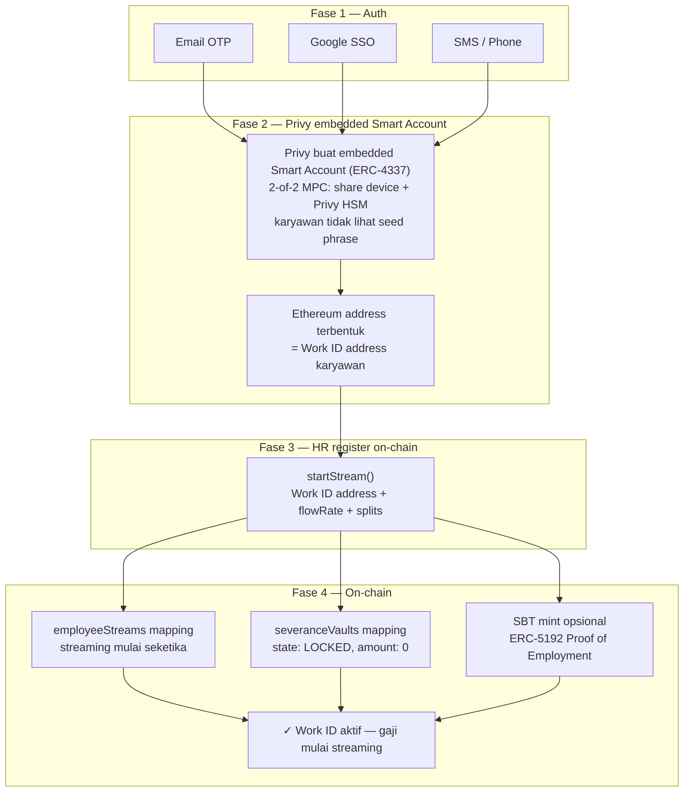

# Functional Requirements — Module B: Work ID & Auth

> **Sprint:** 3 (2 minggu)
> **Output:** End-to-end gasless claim dengan login email
> **Dependency:** Sprint 1 (stream harus ada sebelum claim bisa ditest)

---

## Overview

Modul B menangani identitas karyawan on-chain dan pengalaman pengguna yang transparan. Tujuan utama: **karyawan tidak perlu tahu mereka menggunakan blockchain**. Semua kompleksitas Web3 disembunyikan di balik login email biasa.

Dua komponen kritis:
1. **Privy Integration (EVM mode)** — Wallet-as-a-Service untuk Work ID creation (Ethereum address)
2. **Gasless Transaction via ERC-4337** — Paymaster yang bayar gas fee ETH atas nama karyawan

---

## FR-B01 · Privy Integration (EVM)

### Apa itu Work ID?

> **Work ID** = Ethereum address karyawan yang dibuat otomatis via Privy embedded Smart Account (ERC-4337). Ini adalah identitas on-chain yang menerima gaji, pesangon, bonus, dan pinjaman.

### Requirements

- **[MUST]** System SHALL membuat Ethereum Smart Account (ERC-4337) **otomatis** saat login pertama (`createOnLogin: all-users`)
- **[MUST]** System SHALL menggunakan `noPromptOnSignature: true` untuk claim EWA — UX terasa seperti Web2 tanpa popup konfirmasi
- **[MUST]** System SHALL mendukung login method:
  - Email OTP
  - Google OAuth (SSO)
  - SMS OTP
- **[MUST]** System SHALL mengizinkan **recovery Work ID** via email yang sama jika karyawan ganti device

### Arsitektur Privy MPC (EVM)

```
Karyawan login dengan email
          │
          ▼
    Privy membuat embedded Smart Account (ERC-4337)
    menggunakan 2-of-2 MPC:

    Share 1: Device karyawan (browser/mobile storage)
    Share 2: Privy HSM (Hardware Security Module)

    → Private key TIDAK PERNAH terbentuk utuh di satu tempat
    → Karyawan tidak melihat seed phrase
    → Signing terjadi via MPC computation
          │
          ▼
    Ethereum address terbentuk = Work ID
    (Smart Account address, ERC-4337 compatible)
```

### Konfigurasi Privy (Frontend)

```typescript
// privy-provider.tsx
import { base } from 'wagmi/chains';

const privyConfig = {
  appId: process.env.NEXT_PUBLIC_PRIVY_APP_ID,
  config: {
    loginMethods: ['email', 'google', 'sms'],
    appearance: {
      theme: 'light',
      accentColor: '#0ea5e9',
    },
    embeddedWallets: {
      createOnLogin: 'all-users',        // Auto-create untuk semua user
      noPromptOnSignature: true,         // Silent sign untuk EWA claim
    },
    defaultChain: base,                  // Base L2 (Ethereum)
    supportedChains: [base],
  },
}
```

### Flow Work ID Onboarding



---

## FR-B02 · Gasless Transaction (ERC-4337 Paymaster)

### Masalah yang Diselesaikan

Setiap transaksi Base (Ethereum L2) memerlukan ETH untuk membayar gas fee (~$0.01/tx). Meminta karyawan membeli ETH sendiri akan menciptakan friction onboarding yang tidak dapat diterima. Solusi: **ERC-4337 Account Abstraction dengan Paymaster** yang membayar fee atas nama karyawan — ini adalah mekanisme native Ethereum, lebih terstandar dibanding custom relayer.

### Requirements

- **[MUST]** System SHALL menggunakan **ERC-4337 Paymaster** (Pimlico / Biconomy) untuk membayar semua ETH gas fees atas nama karyawan
- **[MUST]** System SHALL memonitor saldo Paymaster dan kirim **alert ke ops team** jika saldo < 0.05 ETH
- **[SHOULD]** System SHALL mencatat biaya gas per UserOperation untuk **internal cost accounting**
- **[MUST]** System SHALL menerapkan **rate limiting** di Bundler backend: max 10 claim/jam per karyawan (mencegah abuse)

### Arsitektur ERC-4337

```
Karyawan klik "Tarik Gaji" di dashboard
          │
          ▼
Frontend buat UserOperation:
  {
    sender: employee Smart Account address,
    callData: PayrollContract.claimSalary(),
    paymasterAndData: Paymaster address + signature
  }
          │
          ▼
Privy silent sign UserOperation (noPromptOnSignature: true)
          │
          ▼
Frontend submit UserOperation ke Backend Bundler
          │
          ▼
Backend Bundler:
  1. Verifikasi signature karyawan
  2. Cek rate limit (max 10 claim/jam)
  3. Submit ke Pimlico/Biconomy Bundler
     → Paymaster sponsor ETH gas
          │
          ▼
ERC-4337 EntryPoint contract broadcast ke Base
          │
          ▼
Konfirmasi (~2s) → Alchemy webhook → callback ke frontend
```

### Konfigurasi Rate Limiting

```typescript
// bundler/rate-limiter.ts
const RATE_LIMIT = {
  maxClaimsPerHour: 10,      // Per karyawan
  windowMs: 60 * 60 * 1000,  // 1 jam dalam ms
  alertThresholdETH: 0.05,   // Alert ops jika Paymaster < 0.05 ETH
}
```

### Monitoring Paymaster

| Alert | Trigger | Action |
|---|---|---|
| Low ETH balance | Paymaster balance < 0.05 ETH | Email + Slack ke ops team |
| High claim rate | > 50 claim/menit platform-wide | Auto throttle + alert |
| Failed UserOp | > 1% failure rate dalam 5 menit | PagerDuty alert |

---

## FR-B03 · Proof of Employment SBT ERC-5192 (P2 — Nice to Have)

> **Catatan:** Fitur ini opsional untuk MVP. Diimplementasikan jika waktu Sprint 3 memungkinkan.

### Requirements

- **[NICE]** System SHALL mint non-transferable SBT (ERC-5192 Soulbound Token) ke Work ID saat `startStream()` dipanggil
- **[NICE]** SBT SHALL menyimpan metadata: nama perusahaan, tanggal mulai kerja, jabatan (off-chain via tokenURI)
- **[NICE]** SBT SHALL di-burn/revoke saat karyawan resign atau PHK

### Use Case SBT

- Proof of employment untuk loan application (koperasi)
- Background check tanpa mengekspos data PII
- Verifikasi karyawan aktif tanpa database terpusat
