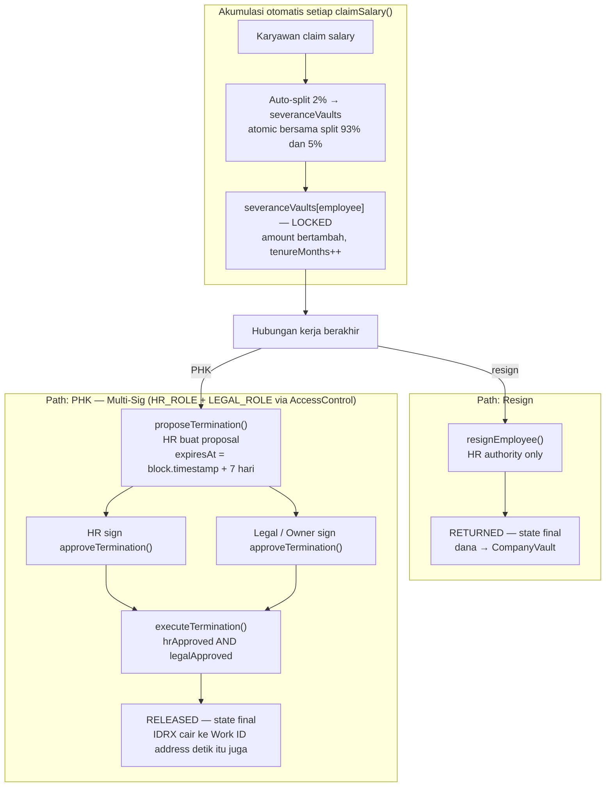

# Functional Requirements — Module C: Compliance

> **Sprint:** 2 (3 minggu)
> **Output:** Severance escrow + PHK flow berjalan di Base Sepolia
> **Dependency:** Sprint 1 (vault + stream harus ada — severance tidak bisa terakumulasi tanpa claim)

---

## Overview

Modul C memastikan platform mematuhi regulasi ketenagakerjaan Indonesia. Dua komponen utama:

1. **Severance Escrow** — akumulasi pesangon otomatis 2% per claim, terjamin on-chain
2. **Multi-Sig PHK Guard** — proses PHK yang aman dengan approval HR + Legal via OpenZeppelin AccessControl (HR_ROLE + LEGAL_ROLE), immutable audit trail
3. **ComplianceVault** — akumulasi BPJS dan PPh21 untuk rekonsiliasi bulanan

---

## FR-C01 · Severance Escrow

### Latar Belakang Regulasi

Berdasarkan **UU Cipta Kerja Pasal 156**, perusahaan wajib membayar uang pesangon saat terjadi PHK. Platform menjamin kewajiban ini dengan mengakumulasi dana pesangon on-chain dari setiap gaji yang diklaim.

### Storage yang Terlibat

| Mapping | Key | Konten |
|---|---|---|
| `severanceVaults` | `employee_address` | amount, state, tenureMonths, lastUpdatedTs |

### Requirements

- **[MUST]** System SHALL mengakumulasi **2%** dari setiap `claimSalary()` ke `severanceVaults[employee]`
- **[MUST]** System SHALL mengimplementasi state machine dengan 3 state:

```
                 claimSalary() (otomatis)
                       │
                    LOCKED ◄──────────
                       │              │
              ─────────┴─────────     │
              │                 │     │
          resignEmployee()  proposeTermination()
          (HR authority)    + approveTermination() (HR + Legal)
              │                 │
              ▼                 ▼
          RETURNED           RELEASED
        (state final)       (state final)
        dana → vault       dana → Work ID address
```

- **[MUST]** System SHALL memastikan `RETURNED` dan `RELEASED` adalah **state final** — tidak bisa kembali ke `LOCKED`
- **[MUST]** System SHALL menyimpan `tenureMonths` untuk kalibrasi formula pesangon sesuai UU Cipta Kerja Pasal 156
- **[MUST]** Perusahaan (HR) **tidak bisa** mengakses dana severanceVaults karyawan secara unilateral
- **[MUST]** Event `SeveranceReleased(employee, amount)` di-emit saat pesangon cair

### Formula Pesangon (UU Cipta Kerja Pasal 156)

```
Masa Kerja (tenureMonths)   │  Uang Pesangon
─────────────────────────────┼──────────────────
< 12 bulan                  │  1 × gaji bulanan
12–24 bulan                 │  2 × gaji bulanan
24–36 bulan                 │  3 × gaji bulanan
36–48 bulan                 │  4 × gaji bulanan
48–60 bulan                 │  5 × gaji bulanan
60–72 bulan                 │  6 × gaji bulanan
72–84 bulan                 │  7 × gaji bulanan
84–96 bulan                 │  8 × gaji bulanan
≥ 96 bulan                  │  9 × gaji bulanan
```

> **Catatan:** Verifikasi formula final dengan konsultasi legal sebelum Sprint 2 (Open Question #2).

### Fungsi

```solidity
// Dipanggil internal dari claimSalary()
// Tidak dipanggil langsung oleh user
function _accumulateSeverance(
    address employee,
    uint256 amount
) internal;

// HR proses resign
function resignEmployee(
    address employee
) external onlyHR;
// → severanceVaults[employee].state: LOCKED → RETURNED
// → Dana kembali ke CompanyVault

// Dipanggil setelah multi-sig PHK approve
function releaseSeverance(
    address employee
) external onlyHR;
// → severanceVaults[employee].state: LOCKED → RELEASED
// → Dana transfer ke Employee Work ID address via IERC20.transfer()
```

---

## FR-C02 · Multi-Sig PHK Guard

### Mengapa Multi-Sig?

PHK adalah keputusan yang signifikan secara hukum. Membutuhkan 2 pihak berbeda (HR dan Legal) untuk mencegah:
- PHK sepihak oleh HR tanpa persetujuan legal
- Penyalahgunaan akses untuk menarik dana pesangon
- Sengketa hukum akibat proses PHK yang tidak terdokumentasi

### Storage yang Terlibat

| Mapping | Key | Konten |
|---|---|---|
| `terminations` | `employee_address` | hrApproved, legalApproved, expiresAt, employeeAddress |

### Requirements

- **[MUST]** System SHALL membuat entry di `terminations` saat HR memanggil `proposeTermination()`
- **[MUST]** System SHALL mengizinkan HR dan Legal/Owner sign `approveTermination()` secara **independent** (urutan bebas — tidak ada urutan yang diwajibkan)
- **[MUST]** System SHALL otomatis **expire proposal** setelah **7 hari** jika tidak ada 2 approval
- **[MUST]** System SHALL memanggil `executeTermination()` **hanya jika** `hrApproved AND legalApproved AND !expired`
- **[MUST]** Setelah execute, `employeeStreams[employee]` dicancel dan `severanceVaults[employee].state` menjadi `RELEASED`

### State Machine PHK



### Fungsi

```solidity
function proposeTermination(
    address employee,
    bytes32 reasonHash    // Hash of reason string stored off-chain
) external onlyHR;
// → terminations[employee] dibuat
// → expiresAt = block.timestamp + (7 * 24 * 3600)

function approveTermination(
    address employee
) external;
// → Set hrApproved atau legalApproved tergantung msg.sender

function executeTermination(
    address employee
) external;
// Require: hrApproved AND legalApproved AND block.timestamp < expiresAt
// → cancelStream(employee)
// → releaseSeverance(employee)
// → delete terminations[employee]
// → emit TerminationExecuted(employee, block.timestamp)
```

### Security Constraints (Solidity)

```solidity
modifier validTermination(address employee) {
    TerminationProposal storage proposal = terminations[employee];
    require(proposal.hrApproved, "HRNotApproved");
    require(proposal.legalApproved, "LegalNotApproved");
    require(block.timestamp < proposal.expiresAt, "ProposalExpired");
    _;
}
```

---

## FR-C03 · ComplianceVault (BPJS & PPh21)

### Requirements

- **[MUST]** System SHALL mengakumulasi 5% dari setiap `claimSalary()` ke `complianceVaults[company]`
- **[MUST]** System SHALL menyimpan breakdown akumulasi per karyawan (untuk rekonsiliasi)
- **[MUST]** System SHALL menyediakan endpoint untuk export laporan CSV per bulan
- **[MUST]** Transfer ke DJP/BPJS dilakukan **manual** oleh HR — tidak otomatis ke pihak ketiga
- **[SHOULD]** System SHALL mengizinkan HR mengupdate `pph21Bps` per karyawan sesuai bracket pajak

### Breakdown Akumulasi (contoh dengan 5%)

```
Dari setiap claim Rp 1.000.000:
  Total ke ComplianceVault: Rp 50.000

  Breakdown internal (estimasi, sesuai regulasi):
  BPJS Kesehatan (1%):          Rp 10.000
  BPJS Ketenagakerjaan (2%):    Rp 20.000
  PPh21 (2% — varies by bracket): Rp 20.000
```

> **Catatan:** Persentase final BPJS dan PPh21 perlu konfirmasi legal (Open Question #6).
