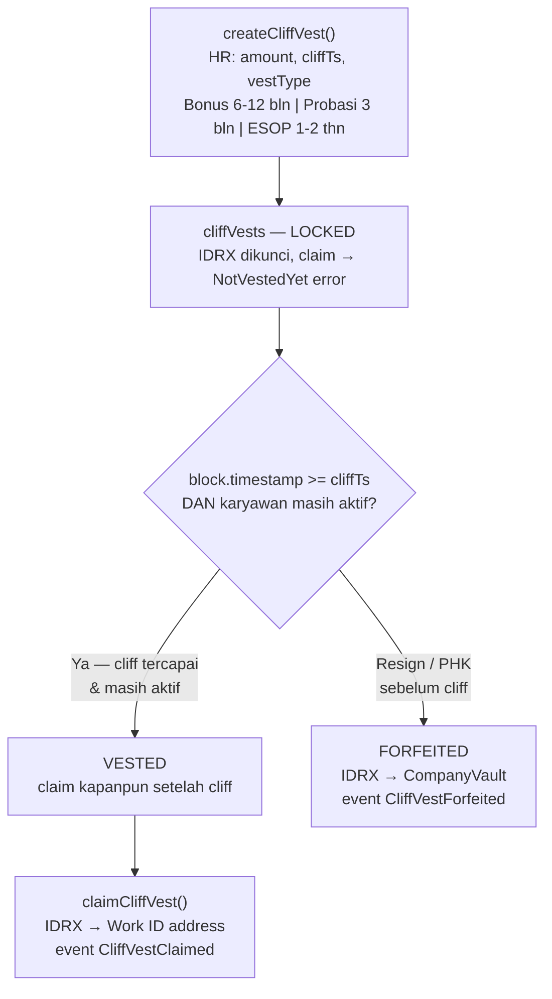

# Functional Requirements — Module D: Cliff Vesting

> **Sprint:** 4 (2 minggu)
> **Output:** Cliff vesting (bonus, probasi, ESOP) berjalan di Base Sepolia
> **Dependency:** Sprint 1 (vault harus ada — IDRX dikunci dari CompanyVault)
> **Prioritas:** P1 (Should Have)

---

## Overview

Modul D memungkinkan perusahaan mengunci insentif karyawan (bonus retensi, masa percobaan, ESOP) hingga tanggal tertentu. Dana dikunci di contract dan hanya bisa diclaim setelah `cliffTs` (cliff timestamp) tercapai.

Jika karyawan resign atau PHK **sebelum** cliff date, semua IDRX yang dikunci **dikembalikan ke CompanyVault** (forfeited).

---

## FR-D01 · CliffVest Storage

### Storage yang Terlibat

| Mapping | Key | Konten |
|---|---|---|
| `cliffVests` | `(employee_address, vestId)` | amount, cliffTs, vestType, status, employeeAddress |

> `vestId` adalah counter yang increment per karyawan — satu karyawan bisa punya multiple cliff vest bersamaan (misal bonus Q1 + ESOP sekaligus).

### Requirements

- **[MUST]** System SHALL membuat entry di `cliffVests` dengan key `(employee_address, vestId)`
- **[MUST]** System SHALL mengunci IDRX dalam contract balance hingga `cliffTs` tercapai
- **[MUST]** System SHALL **mengembalikan semua IDRX** dari `cliffVests` berstatus `Locked` ke vault karyawan jika resign/PHK sebelum cliff (FORFEITED)
- **[MUST]** Event `CliffVestCreated`, `CliffVestClaimed`, `CliffVestForfeited` di-emit untuk setiap state change

### State Machine



### Tipe Vest

| Tipe | `vestType` | Lock Period | Unlock | Digunakan Untuk |
|---|---|---|---|---|
| Gaji (linear) | N/A (streaming) | — | Kapanpun sejak hari 1 | Gaji harian/bulanan |
| Bonus retensi | `Retention` | 6–12 bulan | Lump sum setelah cliff | Insentif retensi karyawan kunci |
| Masa percobaan | `Probation` | 3 bulan | Unlock penuh setelah cliff | Karyawan baru dalam probation |
| ESOP | `ESOP` | 1–2 tahun | Vest bertahap setelah cliff | Program kepemilikan saham karyawan |

### Fungsi

```solidity
function createCliffVest(
    address employee,
    uint256 amount,         // IDRX wei yang dikunci
    uint256 cliffTs,        // Unix timestamp cliff date
    VestType vestType       // Retention | Probation | ESOP
) external onlyHR;
// → cliffVests[(employee, vestId)] dibuat
// → IDRX ditransfer dari vault balance ke contract internal balance
// → vestId di-increment di companies[hr].vestCounter

function claimCliffVest(
    uint256 vestId
) external;
// msg.sender HARUS karyawan pemilik vest (bukan HR)
// Require: block.timestamp >= cliffVests[(msg.sender, vestId)].cliffTs
// Require: VestStatus == Locked (cliff sudah tercapai)
// → IDRX transfer ke msg.sender via IERC20.transfer()
// → Status vest → Claimed
// → emit CliffVestClaimed(employee, vestId, amount)

function cancelCliffVest(
    address employee,
    uint256 vestId
) external onlyHR;
// Dipanggil oleh HR saat resign/PHK sebelum cliff
// → IDRX transfer kembali ke vaultBalances[company]
// → delete cliffVests[(employee, vestId)]
// → emit CliffVestForfeited(employee, vestId, amount)
```

### Error Cases

| Error | Kondisi |
|---|---|
| `NotVestedYet` | `block.timestamp < cliffTs` saat claim |
| `AlreadyClaimed` | Status sudah `Claimed` atau `Forfeited` |
| `NotHRAuthority` | `msg.sender` bukan `hrAuthority` untuk create/cancel |
| `VaultInsufficientFunds` | Vault tidak cukup IDRX untuk create vest |

---

## Contoh Skenario

### Skenario 1: Bonus Retensi 6 Bulan

```
HR setup:
  createCliffVest(
    employee: alice,
    amount: 5_000_000e18,      // 5 juta IDRX (18 decimals)
    cliffTs: block.timestamp + 180 days,
    vestType: Retention
  )

Setelah 6 bulan (cliff tercapai):
  Alice klik "Claim Bonus" di dashboard
  → claimCliffVest(vestId: 1)   // dipanggil oleh Alice sendiri (msg.sender)
  → 5.000.000 IDRX → Alice address
  → event CliffVestClaimed emitted
```

### Skenario 2: Karyawan Probation Resign di Bulan ke-2

```
HR setup saat onboarding:
  createCliffVest(
    employee: bob,
    amount: 1_500_000e18,
    cliffTs: block.timestamp + 90 days,
    vestType: Probation
  )

Bob resign di bulan ke-2:
  HR panggil resignEmployee(bob)
  → HR panggil cancelCliffVest(bob, vestId: 1)
  → 1.500.000 IDRX → CompanyVault balance
  → event CliffVestForfeited emitted
```

### Skenario 3: ESOP 2 Tahun dengan Vest Bertahap (P2)

```
Catatan: Implementasi vest bertahap setelah cliff adalah P2 (Nice to Have).
MVP hanya mendukung lump sum setelah cliff.

Rencana v2:
  createCliffVest(
    amount: 24_000_000e18,
    cliffTs: block.timestamp + 365 days,  // Cliff 1 tahun
    vestingSchedule: Monthly,             // Vest 1/12 per bulan setelah cliff
    vestType: ESOP
  )
```
