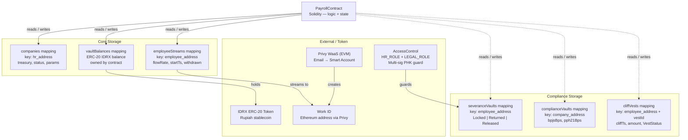

# Technical Architecture

---

## Tech Stack

| Layer | Teknologi | Alasan |
|---|---|---|
| **Smart Contract** | Solidity + Foundry (2 contracts) | Mature ecosystem, tooling lengkap, audit community besar |
| **Network** | Base Sepolia (Ethereum L2 testnet) | ~2s finality, EVM-compatible — skripsi scope: testnet only |
| **Stablecoin** | IDRX (ERC-20) | Rupiah-pegged, familiar pengguna Indonesia |
| **Work ID / WaaS** | Privy (EVM mode) | Email login, embedded Smart Account (ERC-4337), no seed phrase |
| **Gas Sponsor** | Faucet ETH (testnet) | Gas gratis di Base Sepolia — ERC-4337 Paymaster untuk mainnet (out of scope) |
| **Multi-Sig PHK** | OpenZeppelin AccessControl (HR_ROLE + LEGAL_ROLE) | On-chain role-based multi-sig — no external dependency, audit-ready, simpler than Gnosis Safe for 2-of-2 flow |
| **Frontend** | Next.js 16.2.4 + Tailwind v4 + Shadcn/UI | SSR, performa mobile baik |
| **Web3 Adapter** | wagmi + viem + @privy-io/react-auth | Standard library EVM, type-safe |
| **Indexer** | Ponder | Real-time event indexing, type-safe SQL, self-hosted |
| **Backend** | Node.js + PostgreSQL | Bundler relay, off-chain data, compliance reporting |
| **Testing** | Foundry (forge test) + Anvil | Unit test + fork simulation |
| **Monitoring** | Ponder logs + Alchemy webhooks | Event indexing + on-chain monitoring |

---

## Contract Structure

Platform terdiri dari **2 Solidity contracts** terpisah yang berinteraksi via external call:

| Contract | Storage yang Dikelola | Fungsi Utama |
|---|---|---|
| `PayrollContract` | companies, vaults, employeeStreams, severanceVaults, complianceVaults, cliffVests, terminations | initializeVault, registerEmployee, claimSalary, proposeTermination, approveTermination, executeTermination, createCliffVest |
| `EmployeeLiquidityContract` | pools, lenderDeposits, loanRecords | initializePool, depositToPool, borrowFromPool, repayLoan, withdrawDeposit |

---

## Diagram Arsitektur Storage



---

## Arsitektur Sistem End-to-End

```
┌─────────────────────────────────────────────────────────┐
│                    FRONTEND (Next.js 16)                  │
│  HR Dashboard          │        Employee Dashboard        │
│  - Vault management    │        - EWA live tracker        │
│  - Employee list       │        - Severance balance       │
│  - Compliance report   │        - Koperasi (pinjam/bayar) │
└──────────────┬─────────┴──────────────┬──────────────────┘
               │ HTTPS + JWT            │ HTTPS + JWT
               ▼                        ▼
┌─────────────────────────────────────────────────────────┐
│                  BACKEND (Node.js)                        │
│  ┌─────────────┐  ┌──────────────┐  ┌────────────────┐  │
│  │  Bundler    │  │  Off-chain   │  │  Alchemy       │  │
│  │  Relay      │  │  Data API    │  │  Webhook       │  │
│  │ (ERC-4337)  │  │ (PII, audit) │  │  Processor     │  │
│  └──────┬──────┘  └──────┬───────┘  └───────┬────────┘  │
│         │                │                   │           │
│  ┌──────▼──────────────────────────────────────────────┐ │
│  │              PostgreSQL Database                     │ │
│  │  employees | companies | transactions | audit_logs  │ │
│  └─────────────────────────────────────────────────────┘ │
└──────────────────┬──────────────────────────────────────┘
                   │ RPC (Alchemy)
                   ▼
┌─────────────────────────────────────────────────────────┐
│              BASE BLOCKCHAIN (Ethereum L2)                │
│  ┌────────────────────┐  ┌──────────────────────────┐   │
│  │  PayrollContract   │  │EmployeeLiquidityContract  │   │
│  │  - companies       │  │  - pools                  │   │
│  │  - vaultBalances   │◄─┤  - loanRecords (call)     │   │
│  │  - employeeStreams  │  │  - lenderDeposits         │   │
│  │  - severanceVaults │  └──────────────────────────┘   │
│  │  - complianceVaults│                                  │
│  │  - cliffVests      │  ┌──────────────────────────┐   │
│  └────────────────────┘  │  External Protocols       │   │
│                           │  - Privy WaaS (EVM)       │   │
│                           │  - AccessControl PHK      │   │
│                           │  - IDRX ERC-20 Token      │   │
│                           │  - ERC-4337 EntryPoint    │   │
│                           └──────────────────────────┘   │
└─────────────────────────────────────────────────────────┘
```

---

## Data Flow: EWA Claim (Happy Path)

```
1. Karyawan klik "Tarik Gaji" di dashboard mobile
         │
         ▼
2. Frontend: Privy buat UserOperation (ERC-4337)
   → Silent sign oleh Smart Account karyawan (noPromptOnSignature)
         │
         ▼
3. Frontend submit UserOperation ke Backend Bundler
         │
         ▼
4. Backend Bundler:
   a. Verifikasi signature karyawan
   b. Cek rate limit (< 10 claim/jam)
   c. Attach Paymaster signature (sponsor gas ETH)
   d. Submit ke Base via Alchemy RPC (melalui ERC-4337 EntryPoint)
         │
         ▼
5. Base execution (~ 2s):
   claimSalary() function:
   ├── Verify whitelist & stream active
   ├── accrued = flowRate × (block.timestamp - lastWithdrawnTs)
   ├── External call → EmployeeLiquidityContract (auto-repay jika ada pinjaman)
   └── 3× IERC20.transfer() atomic:
       ├── 93% → Employee address
       ├──  5% → ComplianceVault balance
       └──  2% → SeveranceVault balance
         │
         ▼
6. Alchemy webhook push event ke Backend
         │
         ▼
7. Backend update PostgreSQL (audit log, off-chain cache)
         │
         ▼
8. Frontend refresh via WebSocket/polling
   Dashboard karyawan terupdate real-time
```

---

## Storage Mapping Reference

| Storage | Key | Uniqueness |
|---|---|---|
| `companies` | `hr_authority address` | 1 per HR wallet |
| `employeeStreams` | `employee address` | 1 per employee |
| `severanceVaults` | `employee address` | 1 per employee |
| `complianceVaults` | `company address` | 1 per company |
| `cliffVests` | `employee address + vestId` | Multiple per employee |
| `terminations` | `employee address` | 1 per active proposal |
| `pools` | `company address` | 1 per company |
| `lenderDeposits` | `lender address` | 1 per lender |
| `loanRecords` | `borrower address` | 1 active per borrower |

---

## Catatan Indexer (Ponder)

> **Keterbatasan split indexing:** Event `StreamCreated` tidak meng-emit persentase split karyawan. Akibatnya, Ponder menyimpan nilai default (93/5/2) untuk semua stream di tabel `employee_stream`. Jika HR mengkonfigurasi split custom per karyawan, kolom `employeeBps / complianceBps / severanceBps` di tabel Ponder akan menampilkan default — **bukan nilai aktual**. Jumlah distribusi yang sesungguhnya tetap akurat karena event `SalaryClaimed` meng-emit `netToEmployee`, `toCompliance`, dan `toSeverance` secara langsung dari contract.

---

## Dependencies Eksternal

| Service | Tujuan | Fallback |
|---|---|---|
| **Privy** | Wallet-as-a-Service, embedded Smart Account (ERC-4337) | Custom MPC (v2 jika Privy pricing tidak scalable) |
| **Alchemy** | RPC premium + webhook event indexer | Infura / QuickNode |
| **Pimlico / Biconomy** | ERC-4337 Paymaster — sponsor gas fee karyawan | Stackup / self-hosted Bundler |
| **IDRX** | Rupiah stablecoin ERC-20 | USDC sebagai fallback MVP (Open Question #1) |
| **OpenZeppelin AccessControl** | HR_ROLE + LEGAL_ROLE multi-sig PHK guard | Built into PayrollContract — tidak butuh external protocol; Safe Protocol dipertimbangkan tapi tidak dipakai karena menambah dependency eksternal tanpa manfaat signifikan untuk 2-of-2 flow |
| **The Graph** | Subgraph indexing untuk query historis | Alchemy Transfers API |
| **Datadog** | APM + monitoring | Grafana + Prometheus self-hosted |

---

## Development Environment

```bash
# Prerequisites
node >= 20
foundry (forge, cast, anvil)  # Install: curl -L https://foundry.paradigm.xyz | bash

# Install dependencies
npm install
forge install

# Compile contracts
forge build

# Run local node (Base fork)
anvil --fork-url $BASE_RPC_URL

# Run tests
forge test                              # Unit tests
forge test --fork-url $BASE_RPC_URL    # Fork tests (mainnet state)

# Deploy ke Base Sepolia testnet
forge script script/Deploy.s.sol --rpc-url $BASE_SEPOLIA_RPC_URL --broadcast
```

### Project Structure

```
payroll-saas/
├── finley-payroll/                     # Foundry — Solidity contracts + tests
│   ├── src/
│   │   ├── PayrollContract.sol
│   │   │   ├── initializeVault()
│   │   │   ├── fundVault() / withdrawVault()
│   │   │   ├── startStream() / pauseStream() / resumeStream() / cancelStream()
│   │   │   ├── claimSalary()           # 93/5/2 auto-split
│   │   │   ├── proposeTermination() / approveTermination() / executeTermination()
│   │   │   ├── resignEmployee()
│   │   │   ├── createCliffVest() / claimCliffVest() / cancelCliffVest()
│   │   │   └── getStreamInfo()         # cross-contract read
│   │   ├── EmployeeLiquidityContract.sol
│   │   │   ├── initializePool()
│   │   │   ├── depositToPool() / withdrawDeposit()
│   │   │   ├── borrowFromPool() / repayLoanManual()
│   │   │   ├── autoRepay()             # called by PayrollContract
│   │   │   └── liquidateLoan()         # called by backend ops wallet
│   │   ├── EmploymentSBT.sol           # ERC-5192 soulbound token (FR-B03)
│   │   ├── interfaces/
│   │   │   ├── IPayroll.sol
│   │   │   ├── IEmployeeLiquidity.sol
│   │   │   └── IERC5192.sol
│   │   └── libraries/
│   │       └── PayrollMath.sol
│   ├── script/                         # Foundry deploy scripts
│   └── test/
│       ├── PayrollContract.t.sol
│       ├── EmployeeLiquidityContract.t.sol
│       ├── EmploymentSBT.t.sol
│       └── PayrollMath.t.sol
├── ponder/                             # Event indexer — schema + handlers
│   ├── ponder.config.ts                # contract addresses + RPC config
│   ├── ponder.schema.ts                # onchain tables (company, stream, claim …)
│   └── src/
│       ├── PayrollContract.ts          # event handlers for PayrollContract
│       └── EmployeeLiquidityContract.ts
├── backend/                            # Node.js — bundler relay, compliance, webhook
│   └── src/
│       ├── routes/
│       │   ├── bundler.ts              # POST /bundler/relay (ERC-4337)
│       │   ├── compliance.ts           # GET /compliance/export/:hr
│       │   ├── auth.ts
│       │   └── webhook.ts              # Alchemy webhook receiver
│       └── services/
│           ├── rateLimiter.ts          # max 10 claims/hour (FR-B02)
│           ├── paymasterMonitor.ts     # alert if ETH < 0.05 (FR-B02)
│           └── liquidation.ts          # cron — overdue loan liquidation (FR-E03)
└── frontend/                           # Next.js 16 — HR & employee dashboards
    └── src/
        ├── app/
        │   ├── hr/                     # HR dashboard
        │   ├── employee/               # Employee EWA dashboard
        │   └── login/
        └── components/
```

---

## Deployed Contracts (Base Sepolia Testnet)

> Network: **Base Sepolia** (Chain ID: 84532)
> Explorer: https://sepolia.basescan.org

| Contract | Address |
|---|---|
| `PayrollContract` | `0x05b1DF6d82356CC256D1265cD185B4222E4745b3` |
| `EmployeeLiquidityContract` | `0x872af14287370BAFC883237EF390E367d38a8A33` |
| `EmploymentSBT` | `0xCB5118AF36907165496Dc028b441ad9152D2D264` |

**BaseScan links:**
- PayrollContract: https://sepolia.basescan.org/address/0x05b1DF6d82356CC256D1265cD185B4222E4745b3
- EmployeeLiquidityContract: https://sepolia.basescan.org/address/0x872af14287370BAFC883237EF390E367d38a8A33
- EmploymentSBT: https://sepolia.basescan.org/address/0xCB5118AF36907165496Dc028b441ad9152D2D264

**Frontend env vars (`.env.local`):**
```bash
NEXT_PUBLIC_PAYROLL_CONTRACT_ADDRESS=0x05b1DF6d82356CC256D1265cD185B4222E4745b3
NEXT_PUBLIC_LIQUIDITY_CONTRACT_ADDRESS=0x872af14287370BAFC883237EF390E367d38a8A33
NEXT_PUBLIC_SBT_CONTRACT_ADDRESS=0xCB5118AF36907165496Dc028b441ad9152D2D264
NEXT_PUBLIC_CHAIN_ID=84532
```
