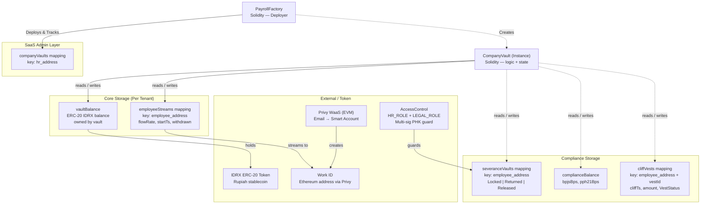

# Technical Architecture

---

## Tech Stack

| Layer | Teknologi | Status | Alasan |
|---|---|---|---|
| **Smart Contract** | Solidity + Foundry | ✅ Deployed | Mature ecosystem, tooling lengkap, audit community besar |
| **Network** | Base Sepolia (dev) / Base Mainnet (prod) | ✅ Running | ~2s finality, EVM-compatible, biaya rendah |
| **Stablecoin** | IDRX (ERC-20) | ✅ Configured | Rupiah-pegged, familiar pengguna Indonesia |
| **Work ID — Dev** | Privy WaaS (EVM embedded wallet) | ✅ Working | Email → EOA/Smart Account, EIP-191 auth, UX seamless |
| **Work ID — Prod** | ERC-4337 Smart Account + encrypted key | 📋 Planned | Stable address, key rotation, gasless native |
| **Gas Sponsor — Dev** | Faucet ETH (testnet) | ✅ Working | Gratis di Base Sepolia |
| **Gas Sponsor — Prod** | ERC-4337 Paymaster (Pimlico / Alchemy Gas Manager) | 📋 Planned | Sponsor gas untuk karyawan — zero ETH required |
| **Multi-Sig PHK** | OpenZeppelin AccessControl (HR_ROLE + LEGAL_ROLE) | ✅ Deployed | On-chain role-based — no external dependency, audit-ready |
| **Frontend** | Next.js + Tailwind v4 + Shadcn/UI | ✅ Running | SSR, performa mobile baik |
| **Web3 Adapter** | wagmi + viem | ✅ Running | Standard library EVM, type-safe |
| **Indexer** | Ponder | ✅ Running | Real-time event indexing, type-safe SQL, self-hosted |
| **Backend** | Node.js + PostgreSQL | ✅ Running | Bundler relay, off-chain data, compliance reporting |
| **Auth** | EIP-191 signature + JWT (15min/7d) | ✅ Working | Stateless, verifiable, no DB lookup per request |
| **Testing** | Foundry (forge test) + Anvil | ✅ Done | Unit test + fork simulation |
| **Salary Privacy** | Inco Lightning FHE (fhEVM) | ✅ Deployed | Encrypted `euint256` salary storage via `ConfidentialCompanyVault` — mencegah employee kepo gaji rekan via on-chain query |
| **KYC — Prod** | Verihubs / Dukcapil API | 📋 Planned | eKYC NIK binding per UU PDP 2022 |
| **Monitoring** | Ponder logs + Alchemy webhooks | ✅ Running | Event indexing + on-chain monitoring |

---

## Contract Structure

Platform terdiri dari **5 Solidity contracts** terpisah yang berinteraksi dalam ekosistem *Multi-Tenant* (Factory Pattern):

| Contract | Storage yang Dikelola | Fungsi Utama |
|---|---|---|
| `PayrollFactory` | companyVaults (mapping), allVaults, platformFeeBps, protocolTreasury | deployVault, emergencyFreezeAll, setPlatformFee, setProtocolTreasury |
| `CompanyVault` | (Isolated per Tenant): employeeStreams, severanceVaults, complianceBalance, cliffVests, terminations | fundVault, startStream, claimSalary, proposeTermination, executeTermination, createCliffVest |
| `ConfidentialCompanyVault` | (extends CompanyVault): encryptedSalaries, auditorExpiry | setEncryptedSalary (payable), getEncryptedSalary, aggregateTotalPayroll, grantViewingKey |
| `EmployeeLiquidityContract` | pools, lenderDeposits, loanRecords, registeredVaults, totalProtocolFee | registerVault, depositToPool(vault, amount), borrowFromPool(vault, amount), repayLoan, claimProtocolFee |
| `EmploymentSBT` | tokenIdCounter, ownerOf, employmentRecords | mint, revoke (ERC-5192 soulbound) |

---

## Diagram Arsitektur Storage (Factory Pattern)



---

## Arsitektur Sistem End-to-End

```
┌──────────────────────────────────────────────────────────────┐
│                  OWNER SAAS (Platform Admin)                  │
│  - Approve/reject registrasi HR baru                          │
│  - Address dikonfirmasi via env OWNER_ADDRESS                 │
│  - Akses: GET /registration/pending, PATCH /approve, DELETE   │
└─────────────────────────┬────────────────────────────────────┘
                          │ Bearer JWT (requireOwner middleware)
                          ▼
┌──────────────────────────────────────────────────────────────┐
│                    FRONTEND (Next.js 16)                       │
│  HR Dashboard          │        Employee Dashboard             │
│  - Vault management    │        - EWA live tracker             │
│  - Employee list       │        - Severance balance            │
│  - Compliance report   │        - Koperasi (pinjam/bayar)      │
│                        │                                       │
│  /onboarding           │        Legal Dashboard                │
│  - Registrasi HR baru  │        - Approve PHK proposal         │
│  - Deteksi role otomatis│                                      │
└──────────────┬─────────┴──────────────┬─────────────────────┘
               │ HTTPS + JWT            │ HTTPS + JWT
               ▼                        ▼
┌──────────────────────────────────────────────────────────────┐
│                  BACKEND (Node.js / Express)                   │
│  ┌─────────────┐  ┌──────────────┐  ┌────────────────────┐   │
│  │  Bundler    │  │  Off-chain   │  │  Alchemy           │   │
│  │  Relay      │  │  Data API    │  │  Webhook           │   │
│  │ (ERC-4337)  │  │ (PII, audit) │  │  Processor         │   │
│  └──────┬──────┘  └──────┬───────┘  └───────┬────────────┘   │
│         │                │                   │                │
│  ┌──────▼──────────────────────────────────────────────────┐  │
│  │              PostgreSQL Database                         │  │
│  │  employees | companies | transactions | audit_logs      │  │
│  │  registration_requests | refresh_tokens                 │  │
│  └──────────────────────────────────────────────────────────┘ │
└──────────────────┬───────────────────────────────────────────┘
                   │ RPC (Alchemy)
                   ▼
┌──────────────────────────────────────────────────────────────┐
│              BASE BLOCKCHAIN (Ethereum L2)                     │
│  ┌───────────────────┐                                        │
│  │  PayrollFactory   │ (Owner SaaS)                           │
│  │  - companyVaults  │─────────────┐                          │
│  └───────────────────┘             ▼                          │
│  ┌────────────────────┐  ┌──────────────────────────────┐     │
│  │  CompanyVault(s)   │  │EmployeeLiquidityContract     │     │
│  │  [Isolated state]  │  │  - pools                     │     │
│  │  - vaultBalance    │◄─┤  - loanRecords (call)        │     │
│  │  - employeeStreams │  │  - lenderDeposits             │     │
│  │  - severanceVaults │  │  - totalProtocolFee           │     │
│  │  - complianceBal   │  └──────────────────────────────┘     │
│  │  - cliffVests      │                                       │
│  └────────────────────┘  ┌──────────────────────────────┐     │
│                           │  EmploymentSBT               │    │
│                           │  - ERC-5192 soulbound token  │    │
│                           │  - Employment certificate    │    │
│                           └──────────────────────────────┘    │
│                           ┌──────────────────────────────┐    │
│                           │  External Protocols           │   │
│                           │  - Privy WaaS (EVM)           │   │
│                           │  - AccessControl PHK          │   │
│                           │  - IDRX ERC-20 Token          │   │
│                           │  - ERC-4337 EntryPoint        │   │
│                           └──────────────────────────────┘   │
└──────────────────────────────────────────────────────────────┘
```

---

## Auth Flow (EIP-191 + JWT + Role Detection)

Sistem autentikasi Payana menggunakan pendekatan *wallet-native* berbasis tanda tangan kriptografi, tanpa menyimpan password di server.

### 1. Login Flow (EIP-191 Signature)

```
1. Frontend (Privy embedded wallet):
   - Generate unix timestamp saat ini (detik)
   - Buat pesan: "Sign in to Payana\nTimestamp: {unix_seconds}"
   - Request personal_sign (EIP-191) ke Privy wallet
         │
         ▼
2. Backend POST /auth/login:
   - Terima: { address, message, signature, timestamp }
   - Verifikasi signature menggunakan viem (recoverMessageAddress)
   - Cek: recovered address === address yang dikirim
   - Cek replay protection: |now - timestamp| ≤ 300 detik (5 menit)
   - Issue: accessToken (JWT, expire 15 menit)
   - Issue: refreshToken (JWT, expire 7 hari, disimpan di DB)
         │
         ▼
3. Frontend simpan token:
   - accessToken → memory / state
   - refreshToken → httpOnly cookie atau localStorage
```

### 2. Token Refresh Flow

```
POST /auth/refresh
- Body: { refreshToken }
- Backend validasi refreshToken dari DB
- Issue accessToken baru (15 menit)
```

### 3. Role Detection (Client-side via useRole.ts)

Setelah login berhasil, frontend mendeteksi peran pengguna secara on-chain:

| Urutan Cek | Kondisi | Role yang Ditetapkan |
|---|---|---|
| 1 | `address === OWNER_ADDRESS` (env) | `owner` |
| 2 | `PayrollFactory.companyVaults(address) !== address(0)` | `hr` |
| 3 | `Ponder /stream/{address}` mengembalikan stream aktif | `employee` |
| 4 | `CompanyVault.hasRole(LEGAL_ROLE, address)` === true (per vault) | `legal` |
| 5 | Tidak ada kondisi di atas yang terpenuhi | `null` → redirect `/onboarding` |

### 4. Onboarding Flow (HR Baru)

```
/onboarding → POST /registration/request
   - HR calon kirim: { address, email, name }
   - Status awal: "pending"
         │
         ▼
Owner SaaS review di dashboard admin:
   GET /registration/pending
         │
   PATCH /registration/:address/approve  ── Disetujui
   DELETE /registration/:address         ── Ditolak
         │
         ▼
HR yang disetujui dapat deploy CompanyVault
via PayrollFactory.deployVault()
```

### 5. Authorization Middleware (Backend)

| Middleware | Kondisi | Digunakan Pada |
|---|---|---|
| `requireAuth` | JWT valid + tidak expired | Semua endpoint terproteksi |
| `requireOwner` | JWT valid + `req.address === OWNER_ADDRESS` | `/registration/*` (admin) |

---

## Data Flow: EWA Claim (Happy Path)

```
1. Karyawan klik "Tarik Gaji" di dashboard mobile
         │
         ▼
2. Frontend: Privy buat UserOperation (ERC-4337)
   → Silent sign oleh Smart Account karyawan (noPromptOnSignature)
         │
         ▼
3. Frontend submit UserOperation ke Backend Bundler
         │
         ▼
4. Backend Bundler:
   a. Verifikasi signature karyawan
   b. Cek rate limit (< 10 claim/jam)
   c. Attach Paymaster signature (sponsor gas ETH)
   d. Submit ke Base via Alchemy RPC (melalui ERC-4337 EntryPoint)
         │
         ▼
5. Base execution (~ 2s):
   claimSalary() function:
   ├── Verify whitelist & stream active
   ├── accrued = flowRate × (block.timestamp - lastWithdrawnTs)
   ├── platformCut = accrued × platformFeeBps / 10000 → protocolTreasury
   ├── External call → EmployeeLiquidityContract (auto-repay jika ada pinjaman)
   └── net = accrued - platformCut - repaid → split atomic:
       ├── 93% → Employee address
       ├──  5% → ComplianceVault balance
       └──  2% → SeveranceVault balance
         │
         ▼
6. Alchemy webhook push event ke Backend
         │
         ▼
7. Backend update PostgreSQL (audit log, off-chain cache)
         │
         ▼
8. Frontend refresh via WebSocket/polling
   Dashboard karyawan terupdate real-time
```

---

## Storage Mapping Reference

| Storage | Lokasi Kontrak | Key | Uniqueness |
|---|---|---|---|
| `companyVaults` | `PayrollFactory` | `hr_authority address` | 1 per HR wallet |
| `platformFeeBps` | `PayrollFactory` | (State variable) | Global — dipotong setiap claim |
| `protocolTreasury` | `PayrollFactory` | (State variable) | Tujuan platform fee |
| `vaultBalance` | `CompanyVault` | (State variable) | 1 per company vault |
| `employeeStreams` | `CompanyVault` | `employee address` | 1 per employee (per company) |
| `severanceVaults` | `CompanyVault` | `employee address` | 1 per employee (per company) |
| `complianceBalance`| `CompanyVault` | (State variable) | 1 per company vault |
| `cliffVests` | `CompanyVault` | `employee address + vestId` | Multiple per employee |
| `terminations` | `CompanyVault` | `employee address` | 1 per active proposal |
| `encryptedSalaries`| `ConfidentialCompanyVault` | `employee address` | 1 per employee — `euint256` ciphertext |
| `auditorExpiry` | `ConfidentialCompanyVault` | `auditor address` | Time-limited delegated key |
| `registeredVaults` | `EmployeeLiquidityContract`| `vault address` | Multi-tenant registry |
| `pools` | `EmployeeLiquidityContract`| `company address` | 1 per company |
| `lenderDeposits` | `EmployeeLiquidityContract`| `lender address` | 1 per lender |
| `loanRecords` | `EmployeeLiquidityContract`| `borrower address` | 1 active per borrower |

---

## Catatan Indexer (Ponder)

> **Keterbatasan split indexing:** Event `StreamCreated` tidak meng-emit persentase split karyawan. Akibatnya, Ponder menyimpan nilai default (93/5/2) untuk semua stream di tabel `employee_stream`. Jika HR mengkonfigurasi split custom per karyawan, kolom `employeeBps / complianceBps / severanceBps` di tabel Ponder akan menampilkan default — **bukan nilai aktual**. Jumlah distribusi yang sesungguhnya tetap akurat karena event `SalaryClaimed` meng-emit `netToEmployee`, `toCompliance`, dan `toSeverance` secara langsung dari contract.

---

## Dependencies Eksternal

| Service | Tujuan | Fallback |
|---|---|---|
| **Privy** | Wallet-as-a-Service, embedded Smart Account (ERC-4337) | Custom MPC (v2 jika Privy pricing tidak scalable) |
| **Alchemy** | RPC premium + webhook event indexer | Infura / QuickNode |
| **Pimlico / Biconomy** | ERC-4337 Paymaster — sponsor gas fee karyawan | Stackup / self-hosted Bundler |
| **IDRX** | Rupiah stablecoin ERC-20 | USDC sebagai fallback MVP (Open Question #1) |
| **OpenZeppelin AccessControl** | HR_ROLE + LEGAL_ROLE multi-sig PHK guard | Built into PayrollContract — tidak butuh external protocol; Safe Protocol dipertimbangkan tapi tidak dipakai karena menambah dependency eksternal tanpa manfaat signifikan untuk 2-of-2 flow |
| **Inco Lightning** | FHE co-processor untuk encrypted salary storage di Base Sepolia | Tidak ada fallback saat ini — fitur optional, bisa dinonaktifkan tanpa breaking core payroll |
| **Azure App Service** | Hosting backend Node.js + Ponder di Indonesia Central | Railway / Render sebagai fallback |
| **Datadog** | APM + monitoring | Grafana + Prometheus self-hosted |

---

## Privacy Architecture — Confidential Salary (Inco FHE)

### Threat Model

Base adalah public blockchain. Tanpa proteksi, siapapun yang tahu wallet address karyawan lain bisa:
- Query `employeeStreams[address].flowRate` → hitung gaji per bulan
- Baca `Transfer` events → lihat history penarikan exact
- Query `balanceOf(address)` di IDRX contract → lihat saldo real-time

Threat actor yang paling realistis: **karyawan iseng** yang tahu Work ID rekannya (bisa didapat dari event `StreamCreated` publik).

### Solusi: Inco Lightning FHE

Inco Lightning adalah TEE-backed FHE co-processor untuk Base Sepolia (live sejak April 2025, npm: `@inco/lightning`). Gaji disimpan sebagai ciphertext `euint256` — tidak bisa dibaca on-chain oleh siapapun kecuali pemegang ACL viewing key.

> **Catatan teknis:** Inco Lightning v1 hanya menyediakan `euint256` (bukan `euint64`). Nilai gaji IDRX wei tetap dalam jangkauan uint256.

```solidity
import {euint256, e, inco} from "@inco/lightning/src/Lib.sol";

// Salary stored as encrypted uint256 — on-chain hanya ciphertext
mapping(address => euint256) public encryptedSalaries;

// HR set salary — amount dienkripsi client-side via Inco JS SDK
// Fungsi ini payable karena Inco membebankan ETH fee per operasi FHE
function setEncryptedSalary(address employee, bytes memory encryptedSalary)
    external payable onlyHR
{
    require(msg.value == inco.getFee(), "Inco fee not paid");
    euint256 ciphertext = encryptedSalary.newEuint256(msg.sender);
    ciphertext.allowThis();
    ciphertext.allow(msg.sender); // HR viewing access
    ciphertext.allow(employee);   // Employee self-view
    encryptedSalaries[employee] = ciphertext;
}

// Employee dan HR bisa akses ciphertext (client-side decrypt via Inco JS SDK)
function getEncryptedSalary(address employee) external view returns (euint256) {
    return encryptedSalaries[employee];
}

// HR aggregate total payroll secara homomorfik — tanpa dekripsi individual
function aggregateTotalPayroll() external onlyHR returns (euint256 aggregate) { ... }
```

### Access Control Model

| Pihak | Akses | Cara |
|---|---|---|
| HR Admin | Baca semua gaji | HR master viewing key |
| Employee | Baca gaji sendiri | Personal viewing key (dari Privy wallet) |
| Employee lain | ❌ Tidak bisa baca | Hanya dapat ciphertext acak |
| Compliance/Auditor | Baca aggregate + individual (atas request) | Delegated decryption key dari HR |
| On-chain observer | ❌ Hanya ciphertext | Tidak ada plaintext on-chain |

### Trade-off yang Diakui

| Aspek | Nilai |
|---|---|
| Gas overhead | ~2–5x vs plaintext storage — masih murah di Base (~$0.001/tx) |
| Trust model | Percaya Inco co-processor nodes — bukan trustless sepenuhnya |
| Streaming rate | `flowRate` di `employeeStreams` masih plaintext — perlu migrasi terpisah ke Inco jika diperlukan |
| Compliance audit | Diatasi dengan delegated decryption key untuk auditor |

### Deployment Pattern

```
ConfidentialCompanyVault.sol (extends CompanyVault)
  ├── encryptedSalaries: mapping(address => euint256)  ← Inco FHE (public)
  ├── auditorExpiry: mapping(address => uint256)        ← FR-1105
  ├── setEncryptedSalary(address, bytes) payable        ← HR only, requires inco.getFee()
  ├── getEncryptedSalary(address)                       ← employee self / HR
  ├── aggregateTotalPayroll()                            ← HR only, homomorphic sum
  ├── grantViewingKey(address auditor, uint256 expiresAt) ← FR-1105
  └── revokeAuditorAccess(address auditor)              ← FR-1105

Deployed: 0x4560968670Dd852dACd73c7B8748695eC427e203 (Base Sepolia, block 42398878)
```

`CompanyVault` existing tidak diubah — `ConfidentialCompanyVault` adalah ekstensi opsional. Core payroll (streaming, claim, split) tetap berjalan tanpa FHE.

---

## Development Environment

```bash
# Prerequisites
node >= 20
foundry (forge, cast, anvil)  # Install: curl -L https://foundry.paradigm.xyz | bash

# Install dependencies
npm install
forge install

# Compile contracts
forge build

# Run local node (Base fork)
anvil --fork-url $BASE_RPC_URL

# Run tests
forge test                              # Unit tests
forge test --fork-url $BASE_RPC_URL    # Fork tests (mainnet state)

# Deploy ke Base Sepolia testnet
forge script script/Deploy.s.sol --rpc-url $BASE_SEPOLIA_RPC_URL --broadcast
```

### Project Structure

```
payroll-saas/
├── finley-payroll/                     # Foundry — Solidity contracts + tests
│   ├── src/
│   │   ├── PayrollFactory.sol          # Deploys isolated CompanyVaults; setPlatformFee, setProtocolTreasury
│   │   ├── CompanyVault.sol            # Single-tenant isolated vault
│   │   │   ├── fundVault() / withdrawVault()
│   │   │   ├── startStream() / pauseStream() / resumeStream() / cancelStream()
│   │   │   ├── claimSalary()           # platform fee → 93/5/2 auto-split
│   │   │   ├── proposeTermination() / approveTermination() / executeTermination()
│   │   │   ├── resignEmployee()
│   │   │   ├── createCliffVest() / claimCliffVest() / cancelCliffVest()
│   │   │   └── getStreamInfo()         # cross-contract read
│   │   ├── ConfidentialCompanyVault.sol  # FHE extension (Sprint 7)
│   │   │   ├── setEncryptedSalary(address, bytes) payable  # FR-1102
│   │   │   ├── getEncryptedSalary(address)                 # FR-1103
│   │   │   ├── aggregateTotalPayroll()                      # FR-1104
│   │   │   ├── grantViewingKey(auditor, expiresAt)          # FR-1105
│   │   │   └── revokeAuditorAccess(auditor)                 # FR-1105
│   │   ├── EmployeeLiquidityContract.sol
│   │   │   ├── registerVault() / unregisterVault()  # multi-tenant registry
│   │   │   ├── initializePool()
│   │   │   ├── depositToPool(vault, amount) / withdrawDeposit()
│   │   │   ├── borrowFromPool(vault, amount) / repayLoanManual()
│   │   │   ├── autoRepay()             # called by CompanyVault
│   │   │   ├── liquidateLoan()         
│   │   │   └── claimProtocolFee()      # 1% Yield cut for SuperAdmin
│   │   ├── EmploymentSBT.sol           # ERC-5192 soulbound token
│   │   ├── interfaces/
│   │   │   ├── ICompanyVault.sol       # VestType: Retention/Probation/ESOP
│   │   │   ├── IEmployeeLiquidity.sol
│   │   │   └── IERC5192.sol
│   │   └── libraries/
│   │       └── PayrollMath.sol
│   ├── script/
│   │   ├── Deploy.s.sol                # Deploy Factory + ELC + SBT (real IDRX)
│   │   ├── DeployMock.s.sol            # Deploy with MockIDRX (testnet)
│   │   └── DeployConfidential.s.sol    # Deploy ConfidentialCompanyVault per company
│   └── test/
│       ├── CompanyVault.t.sol
│       ├── ConfidentialCompanyVault.t.sol  # FHE tests (6 di-skip — butuh Inco node)
│       ├── EmployeeLiquidityContract.t.sol
│       ├── EmploymentSBT.t.sol
│       └── PayrollMath.t.sol
├── ponder/                             # Event indexer — schema + handlers
│   ├── ponder.config.ts                # PayrollContract + ELC + ConfidentialCompanyVault
│   ├── ponder.schema.ts                # 13 onchain tables incl. platform_fee_payment, encrypted_salary, auditor_grant
│   └── src/
│       ├── PayrollContract.ts          # 33 event handlers incl. PlatformFeePaid
│       ├── EmployeeLiquidityContract.ts
│       └── ConfidentialCompanyVault.ts # EncryptedSalarySet + AuditorViewingKeyGranted
├── backend/                            # Node.js — bundler relay, compliance, webhook
│   └── src/
│       ├── routes/
│       │   ├── auth.ts                 # POST /auth/login, /refresh, /logout, /profile
│       │   ├── registration.ts         # HR onboarding flow
│       │   ├── bundler.ts              # POST /bundler/relay (callData validated: claimSalary only)
│       │   ├── compliance.ts           # GET /compliance/export + /summary
│       │   └── webhook.ts              # SalaryClaimed, PlatformFeePaid, EncryptedSalarySet, LowVaultBalance
│       └── services/
│           ├── rateLimiter.ts          # max 10 claims/hour (NFR-14)
│           ├── paymasterMonitor.ts     # alert if ETH < 0.05 (FR-403)
│           ├── liquidation.ts          # cron 6h — overdue loan liquidation
│           └── wsServer.ts             # WebSocket broadcast: 4 event types
└── frontend/                           # Next.js 16 — HR & employee dashboards
    └── src/
        ├── app/
        │   ├── hr/                     # HR dashboard
        │   ├── employee/               # Employee EWA dashboard
        │   ├── legal/                  # Legal dashboard (PHK approval)
        │   ├── onboarding/             # Registrasi HR baru
        │   └── login/
        ├── hooks/
        │   └── useRole.ts              # On-chain role detection
        └── components/
```

---

## Deployed Contracts (Base Sepolia Testnet)

> Network: **Base Sepolia** (Chain ID: 84532)
> Explorer: https://sepolia.basescan.org
> Redeployed: 4 Juni 2026 — block 42397510

| Contract | Address | Verified |
|---|---|---|
| `PayrollFactory` | `0x1B5A705Cb11BAF5798DC78fE27b8686C8c986BdF` | ✅ |
| `EmployeeLiquidityContract` | `0xd9cd18C33Ef3922810bD1b43B4F09693399d14a9` | ✅ |
| `EmploymentSBT` | `0xF0D52Bc9f3455F0D200bCE6Cf9e8C4f0759a5128` | ✅ |
| `MockIDRX` | `0x0996e627cE22C4FE2D5c4788b159a83C065D6d09` | ✅ |
| `ConfidentialCompanyVault` (PT Payana Demo) | `0x4560968670Dd852dACd73c7B8748695eC427e203` | ✅ block 42398878 |

**BaseScan links:**
- PayrollFactory: https://sepolia.basescan.org/address/0x1B5A705Cb11BAF5798DC78fE27b8686C8c986BdF
- EmployeeLiquidityContract: https://sepolia.basescan.org/address/0xd9cd18C33Ef3922810bD1b43B4F09693399d14a9
- EmploymentSBT: https://sepolia.basescan.org/address/0xF0D52Bc9f3455F0D200bCE6Cf9e8C4f0759a5128
- MockIDRX: https://sepolia.basescan.org/address/0x0996e627cE22C4FE2D5c4788b159a83C065D6d09
- ConfidentialCompanyVault: https://sepolia.basescan.org/address/0x4560968670Dd852dACd73c7B8748695eC427e203

**Frontend env vars (`.env.local`):**
```bash
NEXT_PUBLIC_PAYROLL_FACTORY_ADDRESS=0x1B5A705Cb11BAF5798DC78fE27b8686C8c986BdF
NEXT_PUBLIC_LIQUIDITY_CONTRACT_ADDRESS=0xd9cd18C33Ef3922810bD1b43B4F09693399d14a9
NEXT_PUBLIC_SBT_CONTRACT_ADDRESS=0xF0D52Bc9f3455F0D200bCE6Cf9e8C4f0759a5128
NEXT_PUBLIC_IDRX_ADDRESS=0x0996e627cE22C4FE2D5c4788b159a83C065D6d09
NEXT_PUBLIC_CONFIDENTIAL_VAULT_ADDRESS=0x4560968670Dd852dACd73c7B8748695eC427e203
NEXT_PUBLIC_CHAIN_ID=84532
```

---

## Deployment (Azure App Service — Indonesia Central)

Platform Payana di-deploy pada Azure App Service di region **Indonesia Central** untuk memastikan latensi rendah bagi pengguna Indonesia.

### Layanan yang Di-deploy

| Layanan | URL | Deskripsi |
|---|---|---|
| **Backend (Node.js/Express)** | `https://backend-payroll-g4b0b3e2akbjbxf3.indonesiacentral-01.azurewebsites.net` | REST API: auth, bundler relay, compliance, webhook |
| **Ponder (Indexer/Hono)** | `https://ponder-payroll-aucxhrb3hmhfd3fh.indonesiacentral-01.azurewebsites.net` | Event indexer REST API + Swagger UI |

### Konfigurasi Azure

```
Runtime: Node.js 20 LTS
SKU: B1 (Basic) — dapat di-upgrade ke P1v3 untuk production
Region: Indonesia Central (Jakarta)
Database: PostgreSQL Flexible Server (Azure Database)
```

### Environment Variables (Azure App Service — Application Settings)

```bash
# Backend
DATABASE_URL=postgresql://...
JWT_SECRET=...
REFRESH_TOKEN_SECRET=...
ALCHEMY_API_KEY=...
ALCHEMY_WEBHOOK_SIGNING_KEY=...
OWNER_ADDRESS=0x...
AES_ENCRYPTION_KEY=...

# Ponder
PONDER_RPC_URL_84532=https://base-sepolia.g.alchemy.com/v2/...
DATABASE_URL=postgresql://...
PAYROLL_CONTRACT_ADDRESS=0x1B5A705Cb11BAF5798DC78fE27b8686C8c986BdF
LIQUIDITY_CONTRACT_ADDRESS=0xd9cd18C33Ef3922810bD1b43B4F09693399d14a9
SBT_CONTRACT_ADDRESS=0xF0D52Bc9f3455F0D200bCE6Cf9e8C4f0759a5128
IDRX_ADDRESS=0x0996e627cE22C4FE2D5c4788b159a83C065D6d09
CONFIDENTIAL_VAULT_ADDRESS=0x4560968670Dd852dACd73c7B8748695eC427e203
PAYROLL_START_BLOCK=42397510
CONFIDENTIAL_START_BLOCK=42398878
```

### Swagger UI (Ponder)

Dokumentasi interaktif endpoint Ponder tersedia di:
```
https://ponder-payroll-aucxhrb3hmhfd3fh.indonesiacentral-01.azurewebsites.net/api-docs
```

OpenAPI JSON schema:
```
https://ponder-payroll-aucxhrb3hmhfd3fh.indonesiacentral-01.azurewebsites.net/openapi.json
```
